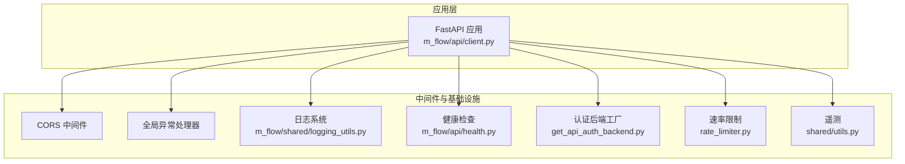
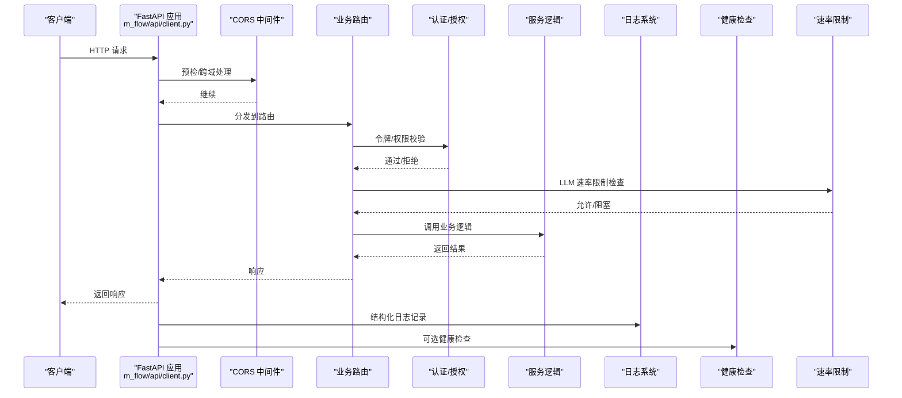
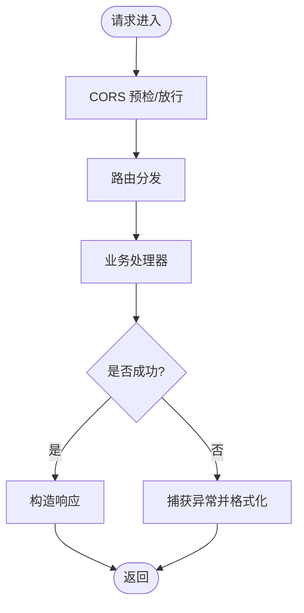
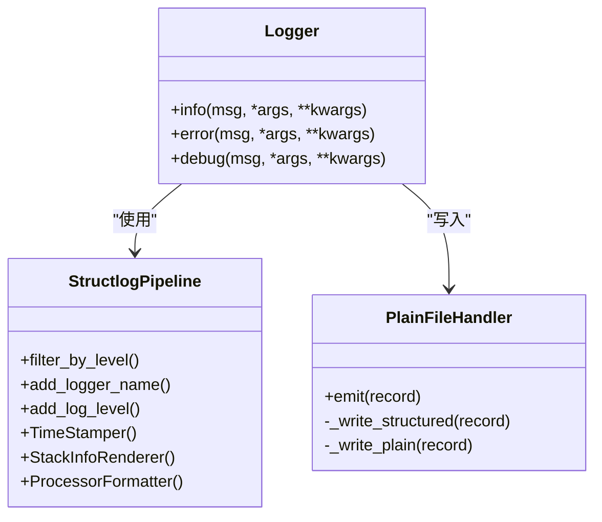
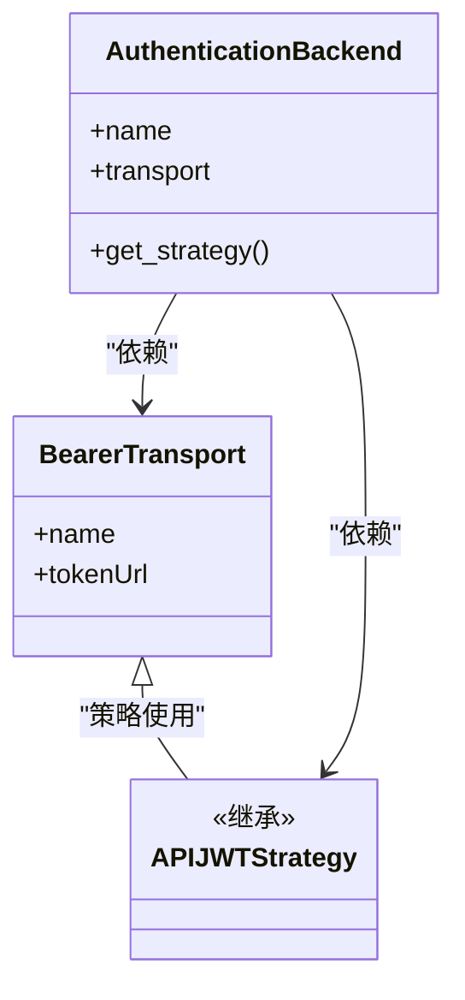
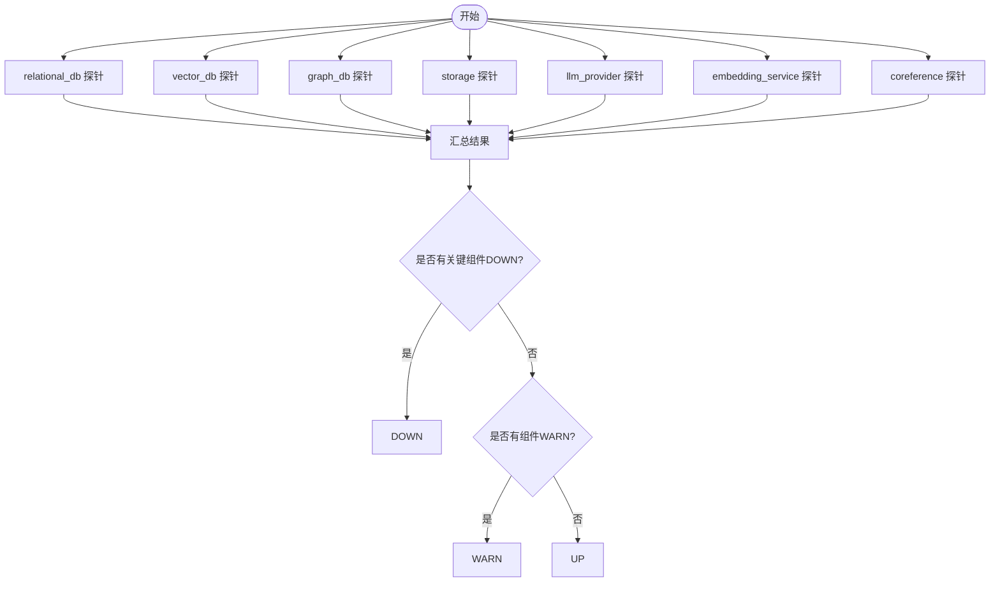
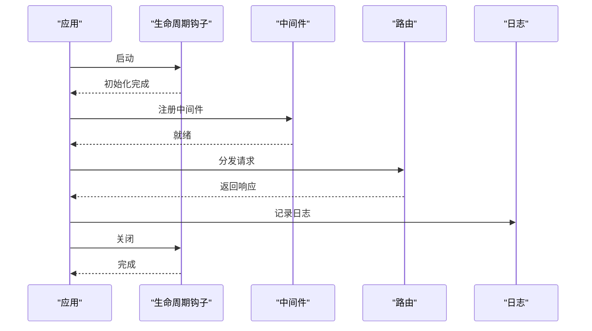
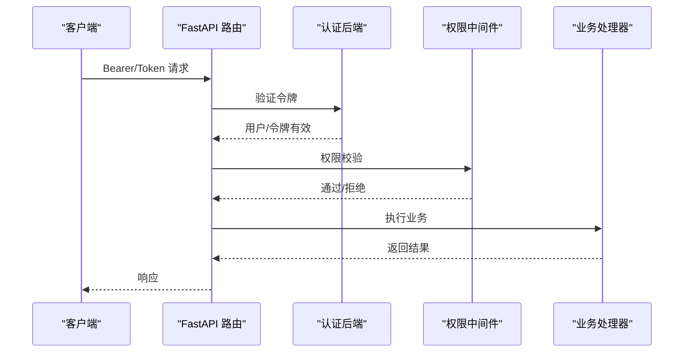
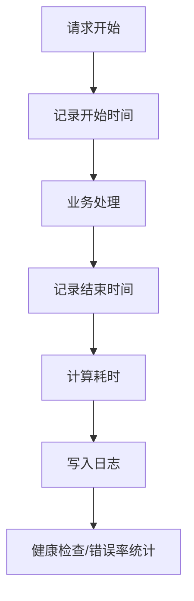
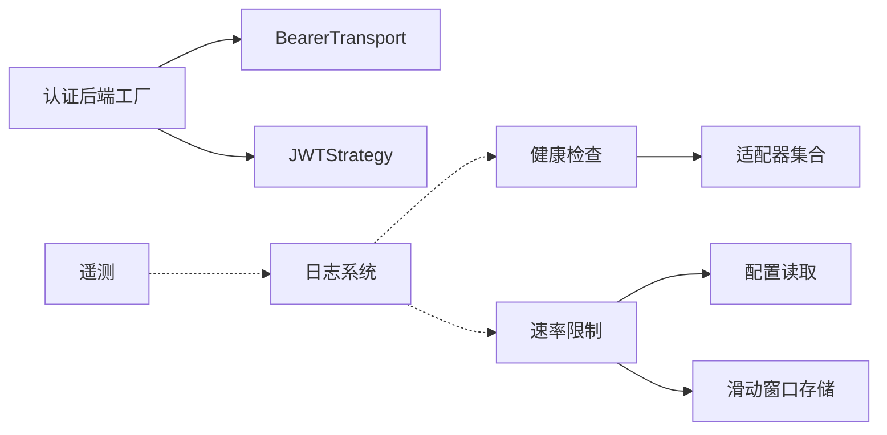

# 中间件开发

<cite>
**本文引用的文件**
- [m_flow/api/client.py](file://m_flow/api/client.py)
- [m_flow/shared/logging_utils.py](file://m_flow/shared/logging_utils.py)
- [m_flow/api/health.py](file://m_flow/api/health.py)
- [m_flow/auth/authentication/get_api_auth_backend.py](file://m_flow/auth/authentication/get_api_auth_backend.py)
- [m_flow/auth/authentication/api_bearer/api_bearer_transport.py](file://m_flow/auth/authentication/api_bearer/api_bearer_transport.py)
- [m_flow/auth/authentication/api_bearer/api_jwt_strategy.py](file://m_flow/auth/authentication/api_bearer/api_jwt_strategy.py)
- [m_flow/llm/backends/litellm_instructor/llm/rate_limiter.py](file://m_flow/llm/backends/litellm_instructor/llm/rate_limiter.py)
- [m_flow/shared/utils.py](file://m_flow/shared/utils.py)
- [m_flow/tests/test_telemetry.py](file://m_flow/tests/test_telemetry.py)
- [m_flow/tests/unit/api/test_prune_router.py](file://m_flow/tests/unit/api/test_prune_router.py)
- [m_flow/tests/unit/infrastructure/test_rate_limiting_realistic.py](file://m_flow/tests/unit/infrastructure/test_rate_limiting_realistic.py)
</cite>

## 目录
1. [简介](#简介)
2. [项目结构](#项目结构)
3. [核心组件](#核心组件)
4. [架构总览](#架构总览)
5. [详细组件分析](#详细组件分析)
6. [依赖分析](#依赖分析)
7. [性能考虑](#性能考虑)
8. [故障排查指南](#故障排查指南)
9. [结论](#结论)
10. [附录](#附录)

## 简介
本指南面向在 M-flow 平台上进行中间件开发的工程师，系统讲解如何基于现有基础设施构建与集成中间件，覆盖以下主题：
- 请求/响应拦截与异常处理中间件
- 日志记录中间件
- 认证中间件（JWT 令牌、API 密钥、权限校验）
- 性能监控中间件（请求计时、内存统计、错误率）
- 中间件执行顺序与生命周期管理（前置处理、主处理、后置处理）
- 完整实现路径与配置示例

M-flow 基于 FastAPI 构建，已内置 CORS、OpenAPI 定制、全局异常处理、健康检查等能力；本文将在此基础上扩展中间件能力，确保与现有模块解耦、可插拔、可观测。

## 项目结构
围绕中间件开发的关键目录与文件：
- API 层入口与中间件注册：m_flow/api/client.py
- 日志系统：m_flow/shared/logging_utils.py
- 健康检查与监控：m_flow/api/health.py
- 认证子系统：m_flow/auth/authentication/*
- 速率限制与重试：m_flow/llm/backends/litellm_instructor/llm/rate_limiter.py
- 遥测上报：m_flow/shared/utils.py 与测试用例

图表来源
- [m_flow/api/client.py:110-127](file://m_flow/api/client.py#L110-L127)
- [m_flow/shared/logging_utils.py:340-519](file://m_flow/shared/logging_utils.py#L340-L519)
- [m_flow/api/health.py:341-398](file://m_flow/api/health.py#L341-L398)
- [m_flow/auth/authentication/get_api_auth_backend.py:22-45](file://m_flow/auth/authentication/get_api_auth_backend.py#L22-L45)
- [m_flow/llm/backends/litellm_instructor/llm/rate_limiter.py:55-250](file://m_flow/llm/backends/litellm_instructor/llm/rate_limiter.py#L55-L250)
- [m_flow/shared/utils.py:66-97](file://m_flow/shared/utils.py#L66-L97)

章节来源
- [m_flow/api/client.py:110-127](file://m_flow/api/client.py#L110-L127)
- [m_flow/shared/logging_utils.py:340-519](file://m_flow/shared/logging_utils.py#L340-L519)
- [m_flow/api/health.py:341-398](file://m_flow/api/health.py#L341-L398)
- [m_flow/auth/authentication/get_api_auth_backend.py:22-45](file://m_flow/auth/authentication/get_api_auth_backend.py#L22-L45)
- [m_flow/llm/backends/litellm_instructor/llm/rate_limiter.py:55-250](file://m_flow/llm/backends/litellm_instructor/llm/rate_limiter.py#L55-L250)
- [m_flow/shared/utils.py:66-97](file://m_flow/shared/utils.py#L66-L97)

## 核心组件
- 应用工厂与中间件注册：在应用工厂中添加 CORS、生命周期钩子、OpenAPI 定制与异常处理。
- 日志系统：统一结构化日志、文件轮转、第三方噪声过滤、全局异常钩子。
- 健康检查：并发探测数据库、向量库、图数据库、存储、LLM、嵌入、共指消解等组件，聚合状态。
- 认证子系统：基于 FastAPI-Users 的 Bearer 传输与 JWT 策略，支持 API 密钥与用户态令牌。
- 速率限制：基于滑动窗口的 LLM 请求限流与指数退避重试装饰器。
- 遥测：生产/非测试环境下的匿名事件上报，带敏感字段脱敏。

章节来源
- [m_flow/api/client.py:110-198](file://m_flow/api/client.py#L110-L198)
- [m_flow/shared/logging_utils.py:340-519](file://m_flow/shared/logging_utils.py#L340-L519)
- [m_flow/api/health.py:341-398](file://m_flow/api/health.py#L341-L398)
- [m_flow/auth/authentication/get_api_auth_backend.py:22-45](file://m_flow/auth/authentication/get_api_auth_backend.py#L22-L45)
- [m_flow/llm/backends/litellm_instructor/llm/rate_limiter.py:55-250](file://m_flow/llm/backends/litellm_instructor/llm/rate_limiter.py#L55-L250)
- [m_flow/shared/utils.py:66-97](file://m_flow/shared/utils.py#L66-L97)

## 架构总览
下图展示中间件在请求生命周期中的位置与交互：

图表来源
- [m_flow/api/client.py:110-127](file://m_flow/api/client.py#L110-L127)
- [m_flow/auth/authentication/get_api_auth_backend.py:22-45](file://m_flow/auth/authentication/get_api_auth_backend.py#L22-L45)
- [m_flow/llm/backends/litellm_instructor/llm/rate_limiter.py:86-110](file://m_flow/llm/backends/litellm_instructor/llm/rate_limiter.py#L86-L110)
- [m_flow/shared/logging_utils.py:340-519](file://m_flow/shared/logging_utils.py#L340-L519)
- [m_flow/api/health.py:341-398](file://m_flow/api/health.py#L341-L398)

## 详细组件分析

### 请求/响应拦截与异常处理中间件
- CORS 中间件：在应用工厂中注册，允许跨域来源、凭证、方法与头。
- 全局异常处理：对请求验证错误与通用异常进行格式化返回，区分业务异常与系统异常。
- OpenAPI 定制：按需注入安全方案与认证要求。

图表来源
- [m_flow/api/client.py:115-122](file://m_flow/api/client.py#L115-L122)
- [m_flow/api/client.py:169-197](file://m_flow/api/client.py#L169-L197)
- [m_flow/api/client.py:135-161](file://m_flow/api/client.py#L135-L161)

章节来源
- [m_flow/api/client.py:110-198](file://m_flow/api/client.py#L110-L198)

### 日志记录中间件
- 结构化日志：统一处理器流水线，输出到控制台与文件，支持异常增强、时间戳、级别、栈追踪。
- 文件轮转：按大小与数量轮转，保留最近 N 份日志。
- 第三方噪声过滤：抑制第三方库冗余日志。
- 全局异常钩子：未捕获异常统一记录并透传。

图表来源
- [m_flow/shared/logging_utils.py:388-404](file://m_flow/shared/logging_utils.py#L388-L404)
- [m_flow/shared/logging_utils.py:189-262](file://m_flow/shared/logging_utils.py#L189-L262)
- [m_flow/shared/logging_utils.py:407-417](file://m_flow/shared/logging_utils.py#L407-L417)

章节来源
- [m_flow/shared/logging_utils.py:340-519](file://m_flow/shared/logging_utils.py#L340-L519)

### 认证中间件（JWT 令牌、API 密钥、权限）
- API Bearer 传输：定义 tokenUrl 与传输名称，配合 FastAPI-Users。
- JWT 策略：继承 JWTStrategy，用于 API 密钥场景。
- 认证后端工厂：生成 AuthenticationBackend，含缓存与启动期密钥校验。

图表来源
- [m_flow/auth/authentication/api_bearer/api_bearer_transport.py:14-17](file://m_flow/auth/authentication/api_bearer/api_bearer_transport.py#L14-L17)
- [m_flow/auth/authentication/api_bearer/api_jwt_strategy.py:10-17](file://m_flow/auth/authentication/api_bearer/api_jwt_strategy.py#L10-L17)
- [m_flow/auth/authentication/get_api_auth_backend.py:22-45](file://m_flow/auth/authentication/get_api_auth_backend.py#L22-L45)

章节来源
- [m_flow/auth/authentication/get_api_auth_backend.py:22-45](file://m_flow/auth/authentication/get_api_auth_backend.py#L22-L45)
- [m_flow/auth/authentication/api_bearer/api_bearer_transport.py:14-17](file://m_flow/auth/authentication/api_bearer/api_bearer_transport.py#L14-L17)
- [m_flow/auth/authentication/api_bearer/api_jwt_strategy.py:10-17](file://m_flow/auth/authentication/api_bearer/api_jwt_strategy.py#L10-L17)

### 性能监控中间件（请求计时、内存统计、错误率）
- 健康检查：并发探测关键后端，返回延迟、状态与注释，聚合整体健康度。
- 速率限制：滑动窗口限流，支持指数退避重试装饰器，自动处理限流错误。
- 遥测：匿名事件上报，生产/非测试环境启用，敏感字段脱敏。

图表来源
- [m_flow/api/health.py:341-398](file://m_flow/api/health.py#L341-L398)
- [m_flow/api/health.py:77-121](file://m_flow/api/health.py#L77-L121)
- [m_flow/api/health.py:123-173](file://m_flow/api/health.py#L123-L173)
- [m_flow/api/health.py:175-202](file://m_flow/api/health.py#L175-L202)
- [m_flow/api/health.py:204-241](file://m_flow/api/health.py#L204-L241)
- [m_flow/api/health.py:243-273](file://m_flow/api/health.py#L243-L273)
- [m_flow/api/health.py:275-310](file://m_flow/api/health.py#L275-L310)

章节来源
- [m_flow/api/health.py:341-398](file://m_flow/api/health.py#L341-L398)
- [m_flow/llm/backends/litellm_instructor/llm/rate_limiter.py:55-250](file://m_flow/llm/backends/litellm_instructor/llm/rate_limiter.py#L55-L250)
- [m_flow/shared/utils.py:66-97](file://m_flow/shared/utils.py#L66-L97)

### 中间件执行顺序与生命周期管理
- 生命周期：应用启动时初始化数据库、默认用户；优雅关闭前执行图数据库检查点与连接关闭。
- 中间件顺序：CORS 在前，随后为业务路由；异常处理器位于应用层，最后生效。
- 前置处理：CORS 预检、认证校验、速率限制检查。
- 主处理：路由分发至业务处理器。
- 后置处理：日志记录、可选健康检查。

图表来源
- [m_flow/api/client.py:68-103](file://m_flow/api/client.py#L68-L103)
- [m_flow/api/client.py:115-122](file://m_flow/api/client.py#L115-L122)
- [m_flow/api/client.py:169-197](file://m_flow/api/client.py#L169-L197)

章节来源
- [m_flow/api/client.py:68-103](file://m_flow/api/client.py#L68-L103)
- [m_flow/api/client.py:110-198](file://m_flow/api/client.py#L110-L198)

### 认证中间件开发示例（JWT、API 密钥、权限）
- 使用认证后端工厂创建 API 认证后端，配置传输与策略。
- 在路由层结合 FastAPI-Users 进行用户态认证与权限校验。
- 可扩展权限中间件：在前置处理阶段读取令牌、解析角色与租户，注入上下文。

图表来源
- [m_flow/auth/authentication/get_api_auth_backend.py:22-45](file://m_flow/auth/authentication/get_api_auth_backend.py#L22-L45)
- [m_flow/auth/authentication/api_bearer/api_bearer_transport.py:14-17](file://m_flow/auth/authentication/api_bearer/api_bearer_transport.py#L14-L17)
- [m_flow/auth/authentication/api_bearer/api_jwt_strategy.py:10-17](file://m_flow/auth/authentication/api_bearer/api_jwt_strategy.py#L10-L17)

章节来源
- [m_flow/auth/authentication/get_api_auth_backend.py:22-45](file://m_flow/auth/authentication/get_api_auth_backend.py#L22-L45)
- [m_flow/auth/authentication/api_bearer/api_bearer_transport.py:14-17](file://m_flow/auth/authentication/api_bearer/api_bearer_transport.py#L14-L17)
- [m_flow/auth/authentication/api_bearer/api_jwt_strategy.py:10-17](file://m_flow/auth/authentication/api_bearer/api_jwt_strategy.py#L10-L17)

### 性能监控中间件（请求计时、内存使用、错误率）
- 请求计时：在路由前后记录时间戳，计算耗时并写入日志。
- 内存统计：结合系统指标或服务端指标采集（如 Prometheus），在日志中附加内存使用摘要。
- 错误率监控：健康检查聚合各探针错误数，结合速率限制与异常处理统计错误率。

图表来源
- [m_flow/api/health.py:341-398](file://m_flow/api/health.py#L341-L398)
- [m_flow/shared/logging_utils.py:340-519](file://m_flow/shared/logging_utils.py#L340-L519)

章节来源
- [m_flow/api/health.py:341-398](file://m_flow/api/health.py#L341-L398)
- [m_flow/shared/logging_utils.py:340-519](file://m_flow/shared/logging_utils.py#L340-L519)

## 依赖分析
- 认证后端依赖 BearerTransport 与 JWTStrategy，二者均来自 FastAPI-Users。
- 速率限制依赖配置读取与滑动窗口存储，装饰器可复用到任意调用链。
- 健康检查并发探测多个适配器，避免阻塞导致整体超时。
- 日志系统与健康检查、遥测相互独立，通过统一接口接入。

图表来源
- [m_flow/auth/authentication/get_api_auth_backend.py:22-45](file://m_flow/auth/authentication/get_api_auth_backend.py#L22-L45)
- [m_flow/llm/backends/litellm_instructor/llm/rate_limiter.py:55-110](file://m_flow/llm/backends/litellm_instructor/llm/rate_limiter.py#L55-L110)
- [m_flow/api/health.py:341-398](file://m_flow/api/health.py#L341-L398)
- [m_flow/shared/logging_utils.py:340-519](file://m_flow/shared/logging_utils.py#L340-L519)
- [m_flow/shared/utils.py:66-97](file://m_flow/shared/utils.py#L66-L97)

章节来源
- [m_flow/auth/authentication/get_api_auth_backend.py:22-45](file://m_flow/auth/authentication/get_api_auth_backend.py#L22-L45)
- [m_flow/llm/backends/litellm_instructor/llm/rate_limiter.py:55-250](file://m_flow/llm/backends/litellm_instructor/llm/rate_limiter.py#L55-L250)
- [m_flow/api/health.py:341-398](file://m_flow/api/health.py#L341-L398)
- [m_flow/shared/logging_utils.py:340-519](file://m_flow/shared/logging_utils.py#L340-L519)
- [m_flow/shared/utils.py:66-97](file://m_flow/shared/utils.py#L66-L97)

## 性能考虑
- 健康检查并发执行，关键组件超时保护，避免阻塞主请求。
- 速率限制采用滑动窗口与每分钟换算，降低突发流量影响。
- 日志轮转与噪声过滤减少 IO 与噪音干扰。
- 生产环境启用 Sentry（如可用）与结构化日志，便于定位性能瓶颈。

## 故障排查指南
- 异常处理：请求验证错误与通用异常统一格式化返回，业务异常与系统异常区分处理。
- 健康检查：关注关键组件 DOWN/WARN 状态与延迟，定位慢探针与资源瓶颈。
- 速率限制：观察限流触发次数与退避重试效果，调整请求频率与窗口参数。
- 遥测：确认环境变量与端点配置，生产/非测试环境才上报。

章节来源
- [m_flow/api/client.py:169-197](file://m_flow/api/client.py#L169-L197)
- [m_flow/api/health.py:341-398](file://m_flow/api/health.py#L341-L398)
- [m_flow/llm/backends/litellm_instructor/llm/rate_limiter.py:227-245](file://m_flow/llm/backends/litellm_instructor/llm/rate_limiter.py#L227-L245)
- [m_flow/shared/utils.py:66-97](file://m_flow/shared/utils.py#L66-L97)
- [m_flow/tests/test_telemetry.py:47-97](file://m_flow/tests/test_telemetry.py#L47-L97)
- [m_flow/tests/unit/api/test_prune_router.py:313-346](file://m_flow/tests/unit/api/test_prune_router.py#L313-L346)
- [m_flow/tests/unit/infrastructure/test_rate_limiting_realistic.py:47-137](file://m_flow/tests/unit/infrastructure/test_rate_limiting_realistic.py#L47-L137)

## 结论
通过在 FastAPI 应用工厂中注册 CORS、异常处理与 OpenAPI 定制，并结合认证、速率限制、健康检查与日志系统，M-flow 提供了完善的中间件开发基础。开发者可在此基础上扩展请求拦截、权限校验与性能监控中间件，确保系统可观测、可维护与高可用。

## 附录
- 中间件实现路径参考
  - CORS 与异常处理：[m_flow/api/client.py:115-197](file://m_flow/api/client.py#L115-L197)
  - 日志系统：[m_flow/shared/logging_utils.py:340-519](file://m_flow/shared/logging_utils.py#L340-L519)
  - 健康检查：[m_flow/api/health.py:341-398](file://m_flow/api/health.py#L341-L398)
  - 认证后端：[m_flow/auth/authentication/get_api_auth_backend.py:22-45](file://m_flow/auth/authentication/get_api_auth_backend.py#L22-L45)
  - 速率限制：[m_flow/llm/backends/litellm_instructor/llm/rate_limiter.py:55-250](file://m_flow/llm/backends/litellm_instructor/llm/rate_limiter.py#L55-L250)
  - 遥测：[m_flow/shared/utils.py:66-97](file://m_flow/shared/utils.py#L66-L97)
- 配置示例参考
  - CORS 允许来源：[m_flow/api/client.py:37-42](file://m_flow/api/client.py#L37-L42)
  - 健康检查并发与超时：[m_flow/api/health.py:130-148](file://m_flow/api/health.py#L130-L148)
  - 速率限制窗口与请求数：[m_flow/llm/backends/litellm_instructor/llm/rate_limiter.py:70-84](file://m_flow/llm/backends/litellm_instructor/llm/rate_limiter.py#L70-L84)
  - 遥测开关与环境：[m_flow/shared/utils.py:74-77](file://m_flow/shared/utils.py#L74-L77)