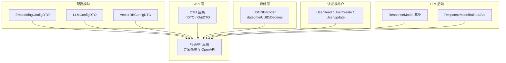
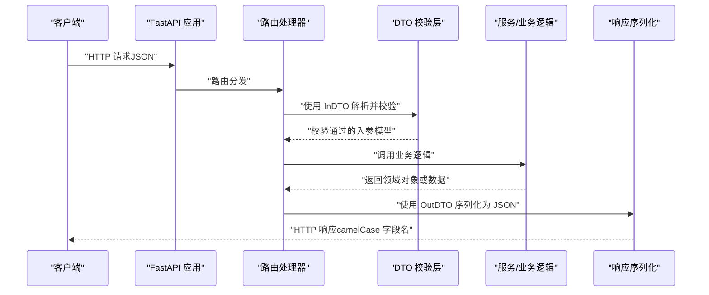
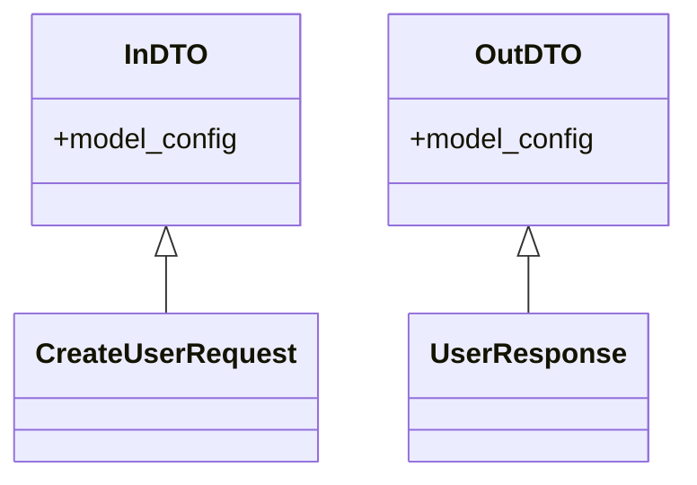
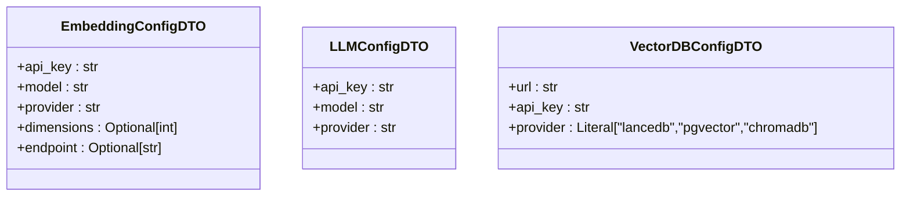
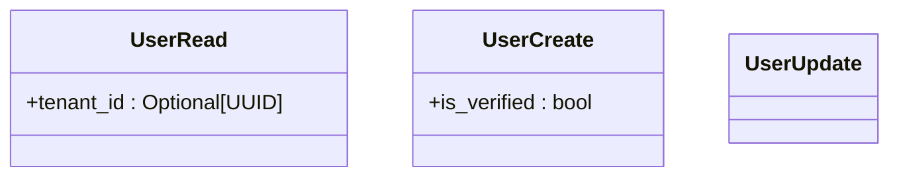
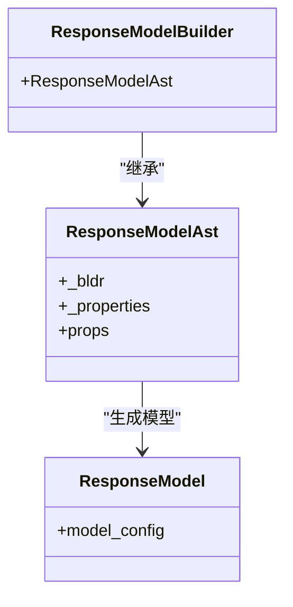
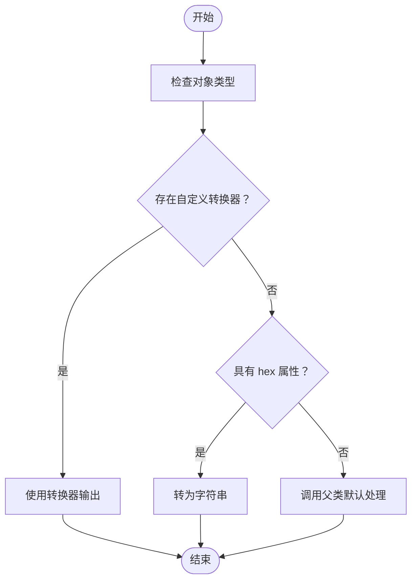
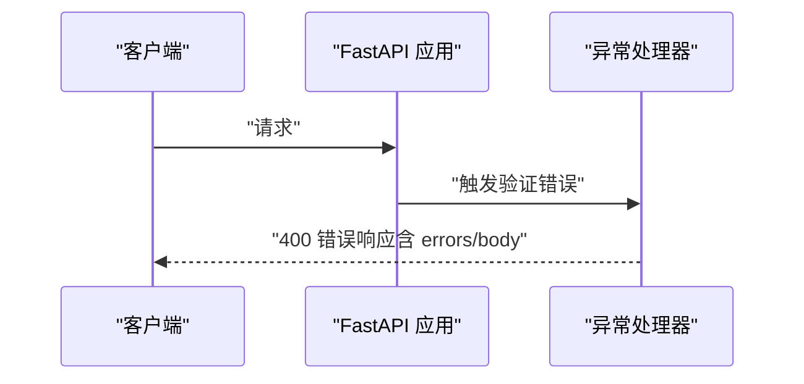
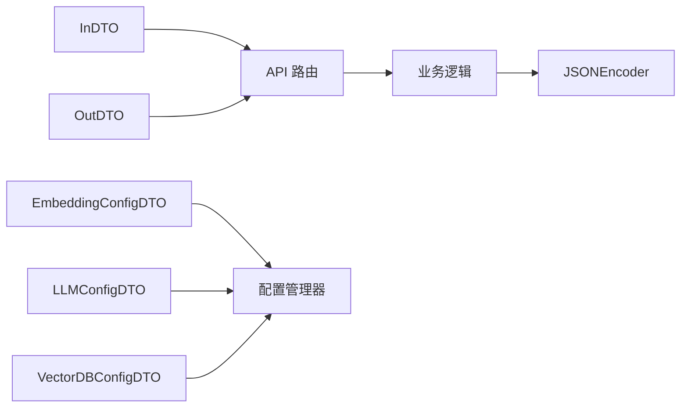

# 数据传输对象模型

<cite>
**本文引用的文件**
- [DTO.py](file://m_flow/api/DTO.py)
- [save_embedding_config.py](file://m_flow/config/settings/save_embedding_config.py)
- [save_llm_config.py](file://m_flow/config/settings/save_llm_config.py)
- [save_vector_db_config.py](file://m_flow/config/settings/save_vector_db_config.py)
- [client.py](file://m_flow/api/client.py)
- [JSONEncoder.py](file://m_flow/storage/utils_mod/utils/__init__.py)
- [User.py](file://m_flow/auth/models/User.py)
- [types.py](file://m_flow/llm/backends/baml/baml_client/types.py)
- [type_builder.py](file://m_flow/llm/backends/baml/baml_client/type_builder.py)
</cite>

## 目录
1. [简介](#简介)
2. [项目结构](#项目结构)
3. [核心组件](#核心组件)
4. [架构总览](#架构总览)
5. [详细组件分析](#详细组件分析)
6. [依赖关系分析](#依赖关系分析)
7. [性能考量](#性能考量)
8. [故障排查指南](#故障排查指南)
9. [结论](#结论)
10. [附录](#附录)

## 简介
本指南围绕数据传输对象（DTO）在项目中的设计与实践展开，重点涵盖：
- 基于 Pydantic 的 DTO 设计原则与最佳实践：字段定义、数据验证、类型注解与序列化行为
- 请求与响应 DTO 的设计模式：嵌套模型、列表模型、可选字段与默认值处理
- DTO 继承与复用：基类设计、字段覆盖与扩展策略
- 数据序列化与反序列化：JSON 序列化、日期时间处理与自定义编码器
- 完整实现示例与验证规则配置路径指引

## 项目结构
本项目的 DTO 相关实现主要分布在以下位置：
- API 层基础 DTO：统一的请求/响应基类，确保跨端一致的命名风格与序列化行为
- 配置模块 DTO：用于运行时配置更新的传输对象，包含敏感信息掩码逻辑
- 存储层工具：自定义 JSON 编码器，支持 datetime、UUID、Decimal 等类型的序列化
- 认证与用户模型：基于 Pydantic 的用户读写模型，作为 FastAPI-Users 路由的数据契约
- LLM 后端生成模型：BAML 客户端生成的响应模型基类，支持额外字段

**图表来源**
- [DTO.py:24-57](file://m_flow/api/DTO.py#L24-L57)
- [client.py:147-185](file://m_flow/api/client.py#L147-L185)
- [save_embedding_config.py:18-31](file://m_flow/config/settings/save_embedding_config.py#L18-L31)
- [save_llm_config.py:17-28](file://m_flow/config/settings/save_llm_config.py#L17-L28)
- [save_vector_db_config.py:19-30](file://m_flow/config/settings/save_vector_db_config.py#L19-L30)
- [JSONEncoder.py:45-54](file://m_flow/storage/utils_mod/utils/__init__.py#L45-L54)
- [User.py:71-86](file://m_flow/auth/models/User.py#L71-L86)
- [types.py:52-53](file://m_flow/llm/backends/baml/baml_client/types.py#L52-L53)
- [type_builder.py:57-73](file://m_flow/llm/backends/baml/baml_client/type_builder.py#L57-L73)

**章节来源**
- [DTO.py:1-58](file://m_flow/api/DTO.py#L1-L58)
- [client.py:147-185](file://m_flow/api/client.py#L147-L185)

## 核心组件
- API 基础 DTO
  - InDTO：统一的请求载荷基类，支持驼峰与蛇形命名混用，便于前端传参与后端解析
  - OutDTO：统一的响应载荷基类，自动将 snake_case 字段名转换为 camelCase 输出
- 配置更新 DTO
  - EmbeddingConfigDTO、LLMConfigDTO、VectorDBConfigDTO：承载运行时配置更新，内置敏感字段掩码逻辑
- 自定义 JSON 编码器
  - JSONEncoder：扩展标准 JSONEncoder，支持 datetime、UUID、Decimal 等类型序列化
- 用户模型
  - UserRead、UserCreate、UserUpdate：基于 Pydantic 的用户数据契约，供 FastAPI-Users 使用
- LLM 响应模型
  - ResponseModel：允许额外字段的通用响应模型基类；配合 Builder/Ast 支持动态构建

**章节来源**
- [DTO.py:24-57](file://m_flow/api/DTO.py#L24-L57)
- [save_embedding_config.py:18-31](file://m_flow/config/settings/save_embedding_config.py#L18-L31)
- [save_llm_config.py:17-28](file://m_flow/config/settings/save_llm_config.py#L17-L28)
- [save_vector_db_config.py:19-30](file://m_flow/config/settings/save_vector_db_config.py#L19-L30)
- [JSONEncoder.py:45-54](file://m_flow/storage/utils_mod/utils/__init__.py#L45-L54)
- [User.py:71-86](file://m_flow/auth/models/User.py#L71-L86)
- [types.py:52-53](file://m_flow/llm/backends/baml/baml_client/types.py#L52-L53)
- [type_builder.py:57-73](file://m_flow/llm/backends/baml/baml_client/type_builder.py#L57-L73)

## 架构总览
下图展示了从请求进入、DTO 校验、业务处理到响应输出的整体流程，以及关键组件之间的交互。

**图表来源**
- [DTO.py:24-57](file://m_flow/api/DTO.py#L24-L57)
- [client.py:169-185](file://m_flow/api/client.py#L169-L185)

## 详细组件分析

### API 基础 DTO 类设计
- 统一配置
  - alias_generator：将字段名从 snake_case 映射为 camelCase
  - populate_by_name：同时接受 snake_case 与 camelCase 名称进行赋值
- 设计目标
  - 请求 DTO（InDTO）：兼容前端传参习惯，提升易用性
  - 响应 DTO（OutDTO）：统一输出风格，避免命名不一致问题

**图表来源**
- [DTO.py:24-57](file://m_flow/api/DTO.py#L24-L57)

**章节来源**
- [DTO.py:16-57](file://m_flow/api/DTO.py#L16-L57)

### 配置更新 DTO（嵌套与可选字段）
- 字段设计要点
  - 必填字段使用 Ellipsis（...），确保强制校验
  - 可选字段使用 Optional[T] 或 default=None，明确空值语义
  - 敏感字段（如 API Key）支持掩码占位符，仅在非掩码时更新
- 典型模式
  - 嵌套模型：以配置 DTO 作为更高层接口的字段
  - 列表模型：多个配置项的集合（可在具体路由中组合使用）

**图表来源**
- [save_embedding_config.py:18-31](file://m_flow/config/settings/save_embedding_config.py#L18-L31)
- [save_llm_config.py:17-28](file://m_flow/config/settings/save_llm_config.py#L17-L28)
- [save_vector_db_config.py:19-30](file://m_flow/config/settings/save_vector_db_config.py#L19-L30)

**章节来源**
- [save_embedding_config.py:18-85](file://m_flow/config/settings/save_embedding_config.py#L18-L85)
- [save_llm_config.py:17-68](file://m_flow/config/settings/save_llm_config.py#L17-L68)
- [save_vector_db_config.py:19-70](file://m_flow/config/settings/save_vector_db_config.py#L19-L70)

### 认证与用户模型（继承与复用）
- 用户读写模型
  - UserRead：对外输出的用户视图，可包含租户 ID 等字段
  - UserCreate：注册时的输入模型，强制邮箱等字段
  - UserUpdate：部分更新的输入模型
- 复用策略
  - 基于 FastAPI-Users 的 BaseUser 模型扩展，保持与用户系统的兼容

**图表来源**
- [User.py:71-86](file://m_flow/auth/models/User.py#L71-L86)

**章节来源**
- [User.py:71-86](file://m_flow/auth/models/User.py#L71-L86)

### LLM 响应模型（动态构建与扩展）
- ResponseModel：允许额外字段，适配不同 LLM 返回结构
- Builder/Ast：通过类型构建器动态生成模型属性与结构

**图表来源**
- [types.py:52-53](file://m_flow/llm/backends/baml/baml_client/types.py#L52-L53)
- [type_builder.py:57-73](file://m_flow/llm/backends/baml/baml_client/type_builder.py#L57-L73)

**章节来源**
- [types.py:44-58](file://m_flow/llm/backends/baml/baml_client/types.py#L44-L58)
- [type_builder.py:35-73](file://m_flow/llm/backends/baml/baml_client/type_builder.py#L35-L73)

### 序列化与反序列化（JSON 编码器与日期时间处理）
- JSONEncoder 扩展
  - 支持 datetime、UUID、Decimal 等类型序列化
  - 通过类型映射表选择合适的转换器
- 与 DTO 的协作
  - OutDTO 输出时自动进行命名转换
  - 业务层返回的数据经 JSONEncoder 序列化为稳定格式

**图表来源**
- [JSONEncoder.py:45-54](file://m_flow/storage/utils_mod/utils/__init__.py#L45-L54)

**章节来源**
- [JSONEncoder.py:45-54](file://m_flow/storage/utils_mod/utils/__init__.py#L45-L54)

### 异常处理与验证错误响应
- 请求验证失败：捕获 RequestValidationError，返回包含错误详情与原始 body 的 400 响应
- 通用异常：捕获未处理异常，结合 ServiceFault 生成结构化错误消息

**图表来源**
- [client.py:169-185](file://m_flow/api/client.py#L169-L185)

**章节来源**
- [client.py:169-185](file://m_flow/api/client.py#L169-L185)

## 依赖关系分析
- 组件耦合
  - API 路由依赖 DTO 基类，确保请求/响应一致性
  - 配置模块 DTO 依赖运行时配置管理器，负责持久化
  - 存储层 JSONEncoder 与业务层数据序列化解耦
- 关键依赖链
  - InDTO/OutDTO → 路由处理器 → 业务逻辑 → 响应序列化
  - 配置 DTO → 配置管理器 → 环境变量持久化

**图表来源**
- [DTO.py:24-57](file://m_flow/api/DTO.py#L24-L57)
- [save_embedding_config.py:33-81](file://m_flow/config/settings/save_embedding_config.py#L33-L81)
- [save_llm_config.py:30-64](file://m_flow/config/settings/save_llm_config.py#L30-L64)
- [save_vector_db_config.py:32-66](file://m_flow/config/settings/save_vector_db_config.py#L32-L66)
- [JSONEncoder.py:45-54](file://m_flow/storage/utils_mod/utils/__init__.py#L45-L54)

**章节来源**
- [DTO.py:24-57](file://m_flow/api/DTO.py#L24-L57)
- [save_embedding_config.py:33-81](file://m_flow/config/settings/save_embedding_config.py#L33-L81)
- [save_llm_config.py:30-64](file://m_flow/config/settings/save_llm_config.py#L30-L64)
- [save_vector_db_config.py:32-66](file://m_flow/config/settings/save_vector_db_config.py#L32-L66)
- [JSONEncoder.py:45-54](file://m_flow/storage/utils_mod/utils/__init__.py#L45-L54)

## 性能考量
- 字段数量与复杂度
  - DTO 字段过多会增加序列化与校验开销，建议按功能拆分模型或使用选择性序列化
- 嵌套层级
  - 深度嵌套模型在反序列化时会放大错误定位难度，建议控制嵌套层级并提供清晰的错误信息
- 序列化成本
  - 对大量数据进行 JSONEncoder 序列化时，优先考虑流式输出或分页返回，减少内存峰值
- 可选字段与默认值
  - 合理使用 Optional 与默认值，避免不必要的空值传播，降低前端解析负担

## 故障排查指南
- 常见问题
  - 字段命名不一致：确认使用 OutDTO 输出、InDTO 输入，避免手动拼接字段名
  - 验证失败：检查必填字段是否缺失，或类型是否匹配
  - 序列化异常：确保返回对象包含可被 JSONEncoder 处理的类型
- 排查步骤
  - 打印 DTO 的 model_dump() 结果，核对字段名与类型
  - 在路由层添加日志，记录请求体与响应体
  - 使用 FastAPI 的 OpenAPI 文档校验请求/响应结构

**章节来源**
- [client.py:169-185](file://m_flow/api/client.py#L169-L185)

## 结论
本项目通过统一的 DTO 基类与规范化的配置 DTO，实现了请求/响应的一致性与可维护性。结合自定义 JSONEncoder 与严格的异常处理机制，整体数据传输链路具备良好的健壮性与扩展性。建议在后续迭代中继续遵循字段最小化、命名规范化与序列化成本控制的原则，持续优化用户体验与系统性能。

## 附录
- 示例与规则配置路径
  - 请求 DTO 基类：[DTO.py:42-57](file://m_flow/api/DTO.py#L42-L57)
  - 响应 DTO 基类：[DTO.py:24-39](file://m_flow/api/DTO.py#L24-L39)
  - 配置更新 DTO（嵌套与可选字段）：
    - [save_embedding_config.py:18-31](file://m_flow/config/settings/save_embedding_config.py#L18-L31)
    - [save_llm_config.py:17-28](file://m_flow/config/settings/save_llm_config.py#L17-L28)
    - [save_vector_db_config.py:19-30](file://m_flow/config/settings/save_vector_db_config.py#L19-L30)
  - 用户模型（继承与复用）：[User.py:71-86](file://m_flow/auth/models/User.py#L71-L86)
  - LLM 响应模型（动态构建）：
    - [types.py:52-53](file://m_flow/llm/backends/baml/baml_client/types.py#L52-L53)
    - [type_builder.py:57-73](file://m_flow/llm/backends/baml/baml_client/type_builder.py#L57-L73)
  - 自定义 JSON 编码器：[JSONEncoder.py:45-54](file://m_flow/storage/utils_mod/utils/__init__.py#L45-L54)
  - 异常处理与验证错误响应：[client.py:169-185](file://m_flow/api/client.py#L169-L185)