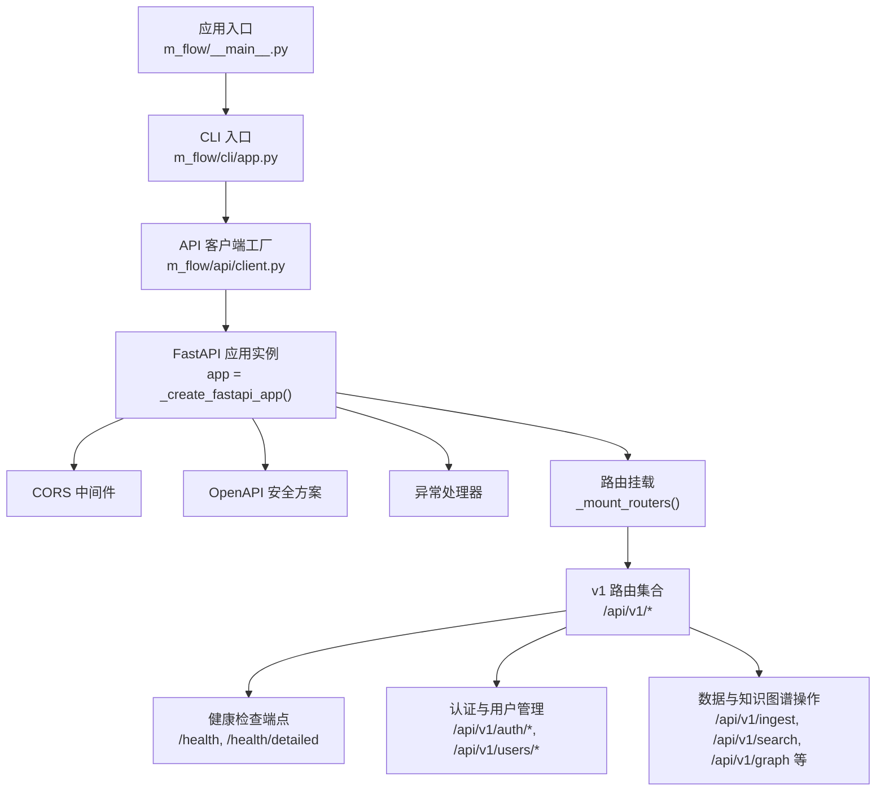
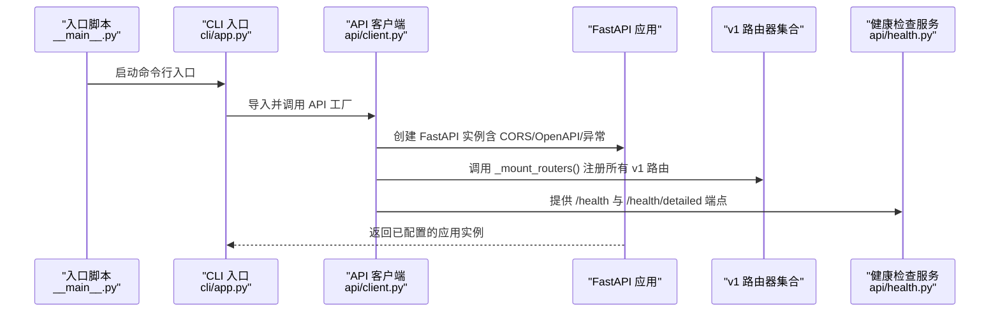
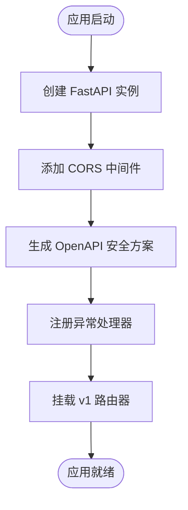
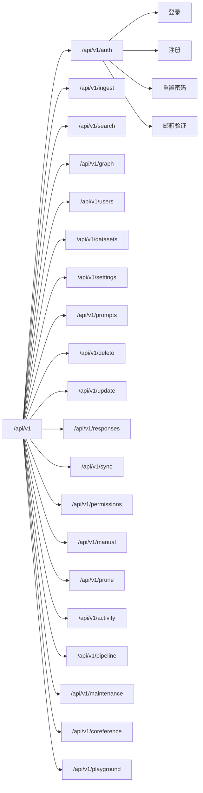
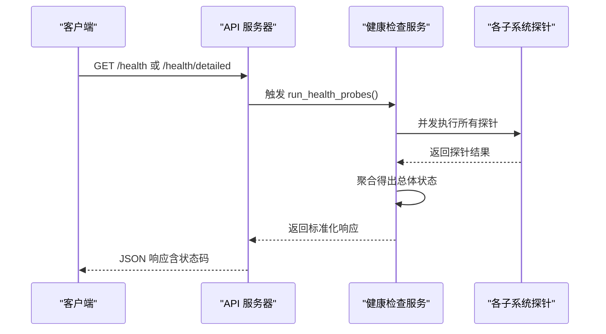
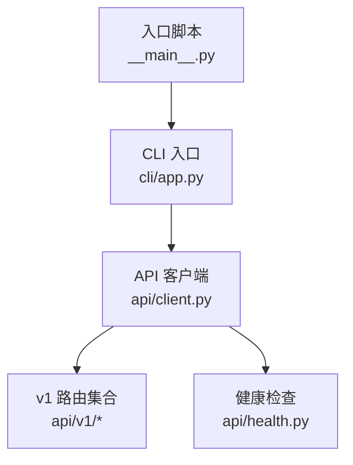

# 自定义路由开发

<cite>
**本文档引用的文件**
- [m_flow/api/client.py](file://m_flow/api/client.py)
- [m_flow/api/health.py](file://m_flow/api/health.py)
- [m_flow/api/v1/__init__.py](file://m_flow/api/v1/__init__.py)
- [m_flow/cli/app.py](file://m_flow/cli/app.py)
- [m_flow/__main__.py](file://m_flow/__main__.py)
</cite>

## 目录
1. [简介](#简介)
2. [项目结构](#项目结构)
3. [核心组件](#核心组件)
4. [架构总览](#架构总览)
5. [详细组件分析](#详细组件分析)
6. [依赖分析](#依赖分析)
7. [性能考虑](#性能考虑)
8. [故障排查指南](#故障排查指南)
9. [结论](#结论)
10. [附录](#附录)

## 简介
本指南面向希望在 M-flow 中创建自定义 API 路由与端点的开发者，系统讲解从路由注册、URL 模式定义到 HTTP 方法映射的完整流程；详解 FastAPI 路由装饰器的使用方式；说明路径参数、查询参数与请求体参数的定义与验证；提供错误处理、状态码返回与响应格式标准化的最佳实践；并介绍中间件集成与权限控制机制。

## 项目结构
M-flow 的 API 层基于 FastAPI 构建，通过模块化路由器组织功能域，并在应用启动时统一挂载。核心入口位于 API 客户端模块，负责创建 FastAPI 实例、配置中间件与异常处理器、注册所有 v1 路由器，并提供健康检查与根端点。

**图表来源**
- [m_flow/__main__.py:1-19](file://m_flow/__main__.py#L1-L19)
- [m_flow/cli/app.py:231-279](file://m_flow/cli/app.py#L231-L279)
- [m_flow/api/client.py:110-127](file://m_flow/api/client.py#L110-L127)
- [m_flow/api/client.py:268-337](file://m_flow/api/client.py#L268-L337)

**章节来源**
- [m_flow/api/client.py:110-127](file://m_flow/api/client.py#L110-L127)
- [m_flow/api/client.py:268-337](file://m_flow/api/client.py#L268-L337)
- [m_flow/api/v1/__init__.py:1-11](file://m_flow/api/v1/__init__.py#L1-L11)

## 核心组件
- FastAPI 应用工厂：负责创建应用实例、配置 CORS、生命周期钩子、OpenAPI 安全方案与异常处理器。
- 路由挂载器：集中注册所有 v1 功能模块的路由器，按前缀与标签组织端点。
- 健康检查服务：提供就绪/存活探针，聚合数据库、向量库、图库、存储、LLM、嵌入与共指等子系统的健康状态。
- 异常处理：对请求验证错误与通用异常进行标准化响应，支持业务异常的结构化输出。

**章节来源**
- [m_flow/api/client.py:110-127](file://m_flow/api/client.py#L110-L127)
- [m_flow/api/client.py:268-337](file://m_flow/api/client.py#L268-L337)
- [m_flow/api/health.py:341-384](file://m_flow/api/health.py#L341-L384)

## 架构总览
下图展示从应用启动到路由注册与健康检查的整体流程：

**图表来源**
- [m_flow/__main__.py:10-18](file://m_flow/__main__.py#L10-L18)
- [m_flow/cli/app.py:231-279](file://m_flow/cli/app.py#L231-L279)
- [m_flow/api/client.py:110-127](file://m_flow/api/client.py#L110-L127)
- [m_flow/api/client.py:268-337](file://m_flow/api/client.py#L268-L337)
- [m_flow/api/health.py:341-384](file://m_flow/api/health.py#L341-L384)

## 详细组件分析

### FastAPI 应用工厂与中间件
- 应用创建：通过工厂函数创建 FastAPI 实例，启用调试模式（非生产环境），并绑定生命周期上下文管理器。
- CORS 配置：允许指定来源、凭证、方法与头部，满足前端跨域访问需求。
- OpenAPI 安全方案：在 OpenAPI 文档中声明 Bearer 与 Cookie 两种鉴权方式，并根据配置决定是否全局启用安全要求。
- 异常处理：
  - 请求验证错误：返回 400，包含错误详情与原始请求体。
  - 通用异常：捕获业务异常并按其状态码与消息返回；其他异常统一返回 500。

**图表来源**
- [m_flow/api/client.py:110-127](file://m_flow/api/client.py#L110-L127)
- [m_flow/api/client.py:135-161](file://m_flow/api/client.py#L135-L161)
- [m_flow/api/client.py:169-198](file://m_flow/api/client.py#L169-L198)
- [m_flow/api/client.py:268-337](file://m_flow/api/client.py#L268-L337)

**章节来源**
- [m_flow/api/client.py:110-127](file://m_flow/api/client.py#L110-L127)
- [m_flow/api/client.py:135-161](file://m_flow/api/client.py#L135-L161)
- [m_flow/api/client.py:169-198](file://m_flow/api/client.py#L169-L198)

### 路由注册与 URL 前缀
- 认证路由：统一挂载于 `/api/v1/auth` 前缀，包含登录、注册、重置密码与邮箱验证等子路由。
- 核心功能路由：以 `/api/v1/<模块>` 为前缀，如 `/api/v1/ingest`、`/api/v1/search`、`/api/v1/graph` 等，每个模块通过工厂函数返回独立路由器。
- 标签分组：为每类路由设置标签，便于在 OpenAPI 文档中分类查看。

**图表来源**
- [m_flow/api/client.py:300-334](file://m_flow/api/client.py#L300-L334)

**章节来源**
- [m_flow/api/client.py:300-334](file://m_flow/api/client.py#L300-L334)

### 健康检查端点
- 端点：
  - GET `/health`：快速就绪/存活检查，返回简要状态与版本信息。
  - GET `/health/detailed`：详细诊断，返回各子系统探针结果与聚合状态。
- 探针类型：关系型数据库、向量数据库、图数据库、文件存储、LLM 提供商、嵌入服务、共指解析模块。
- 聚合策略：关键组件任一 Down 则整体 Down；否则若存在 Warn 则 Warn；全部 Up 则 Up。
- 超时与降级：健康检查总超时限制，避免阻塞；图库探针采用超时保护，防止写锁导致阻塞。

**图表来源**
- [m_flow/api/client.py:211-261](file://m_flow/api/client.py#L211-L261)
- [m_flow/api/health.py:341-384](file://m_flow/api/health.py#L341-L384)

**章节来源**
- [m_flow/api/client.py:211-261](file://m_flow/api/client.py#L211-L261)
- [m_flow/api/health.py:341-384](file://m_flow/api/health.py#L341-L384)

### FastAPI 路由装饰器使用指南
- 基本装饰器：
  - @app.get(path, ...)：用于获取资源或执行只读操作。
  - @app.post(path, ...)：用于创建新资源或提交数据。
  - @app.put(path, ...)：用于更新现有资源。
  - @app.delete(path, ...)：用于删除资源。
- 参数定义与验证：
  - 路径参数：在路径模板中使用花括号占位符，配合 Pydantic 模型进行类型校验。
  - 查询参数：作为函数签名参数自动解析，建议使用 Pydantic 模型包装可选/必填字段。
  - 请求体参数：使用 Pydantic 模型定义请求体结构，自动进行序列化与反序列化。
- 响应格式标准化：统一返回 JSON，必要时使用 FastAPI 的响应模型或 JSONResponse。
- 状态码选择：遵循 REST 语义，如 200/201/204/4xx/5xx；错误场景结合异常处理器返回一致格式。

**章节来源**
- [m_flow/api/client.py:169-198](file://m_flow/api/client.py#L169-L198)

### 错误处理与状态码
- 请求验证错误：返回 400，包含错误列表与原始请求体，便于前端定位问题。
- 业务异常（ServiceFault）：按异常对象的状态码与消息返回；若异常定义不规范则回退为 500。
- 通用异常：记录堆栈日志并返回 500，避免泄露内部细节。
- 健康检查异常：在 /health 与 /health/detailed 中分别处理超时与失败场景，确保探针可用性。

**章节来源**
- [m_flow/api/client.py:169-198](file://m_flow/api/client.py#L169-L198)
- [m_flow/api/client.py:211-261](file://m_flow/api/client.py#L211-L261)

### 权限控制与中间件
- CORS：允许指定来源、凭证与方法，满足前端跨域访问。
- OpenAPI 安全方案：在文档中声明 Bearer 与 Cookie 两种鉴权方式，并可根据配置启用全局安全要求。
- 生命周期钩子：应用启动时初始化数据库与默认用户；优雅关闭时对图数据库执行检查点与连接关闭。
- 认证路由：统一挂载于 `/api/v1/auth`，包含登录、注册、重置密码与邮箱验证等端点，遵循统一的鉴权流程。

**章节来源**
- [m_flow/api/client.py:115-122](file://m_flow/api/client.py#L115-L122)
- [m_flow/api/client.py:135-161](file://m_flow/api/client.py#L135-L161)
- [m_flow/api/client.py:68-103](file://m_flow/api/client.py#L68-L103)
- [m_flow/api/client.py:300-305](file://m_flow/api/client.py#L300-L305)

## 依赖分析
- 应用启动链路：入口脚本委托 CLI，CLI 再导入 API 客户端工厂创建应用并挂载路由。
- 路由依赖：v1 路由器通过工厂函数动态导入，降低启动时的耦合度。
- 健康检查：与各适配器（关系型、向量、图、存储、LLM、嵌入、共指）解耦，通过异步并发探针聚合状态。

**图表来源**
- [m_flow/__main__.py:10-18](file://m_flow/__main__.py#L10-L18)
- [m_flow/cli/app.py:231-279](file://m_flow/cli/app.py#L231-L279)
- [m_flow/api/client.py:268-337](file://m_flow/api/client.py#L268-L337)
- [m_flow/api/health.py:341-384](file://m_flow/api/health.py#L341-L384)

**章节来源**
- [m_flow/__main__.py:10-18](file://m_flow/__main__.py#L10-L18)
- [m_flow/cli/app.py:231-279](file://m_flow/cli/app.py#L231-L279)
- [m_flow/api/client.py:268-337](file://m_flow/api/client.py#L268-L337)

## 性能考虑
- 路由挂载延迟：通过工厂函数与延迟导入减少启动时间。
- 健康检查并发：使用异步并发执行探针，缩短总耗时。
- 图库探针超时：对可能被写锁阻塞的操作设置超时，避免阻塞整个健康检查。
- CORS 白名单：仅允许必要的来源与方法，降低跨域开销。

[本节为通用指导，无需列出具体文件来源]

## 故障排查指南
- 端点无法访问：
  - 检查是否正确挂载路由器与前缀是否匹配。
  - 确认 CORS 配置是否包含前端来源。
- 健康检查失败：
  - 查看 /health 与 /health/detailed 的响应内容，定位具体子系统问题。
  - 关注图库探针的超时提示，确认是否存在长时间运行的写操作。
- 异常响应不符合预期：
  - 确认业务异常是否继承自统一异常基类并设置了状态码与消息。
  - 检查异常处理器逻辑，确保捕获顺序与返回格式一致。

**章节来源**
- [m_flow/api/client.py:169-198](file://m_flow/api/client.py#L169-L198)
- [m_flow/api/client.py:211-261](file://m_flow/api/client.py#L211-L261)
- [m_flow/api/health.py:341-384](file://m_flow/api/health.py#L341-L384)

## 结论
通过本指南，您可以在 M-flow 中高效地创建自定义路由：使用 FastAPI 装饰器定义端点，利用工厂函数与延迟导入优化启动性能，借助统一的异常处理与健康检查保障稳定性，并通过 CORS 与 OpenAPI 安全方案实现跨域与鉴权控制。建议在新增路由时遵循现有模块的命名与前缀规范，保持一致的响应格式与错误处理策略。

[本节为总结性内容，无需列出具体文件来源]

## 附录
- 快速开始步骤：
  1) 在对应 v1 子模块中创建路由器工厂函数，返回 FastAPI 路由器实例。
  2) 在挂载函数中注册该路由器，设置合适的前缀与标签。
  3) 使用装饰器定义端点，明确 HTTP 方法与参数类型。
  4) 编写异常处理与健康检查（如涉及外部依赖）。
  5) 启动服务并访问 /health 与 /docs 验证功能。

**章节来源**
- [m_flow/api/client.py:268-337](file://m_flow/api/client.py#L268-L337)
- [m_flow/api/client.py:135-161](file://m_flow/api/client.py#L135-L161)