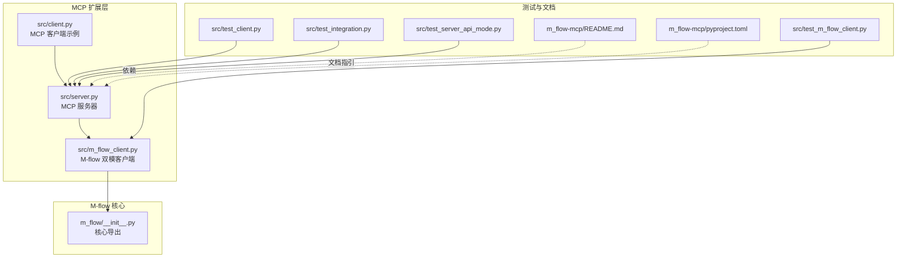
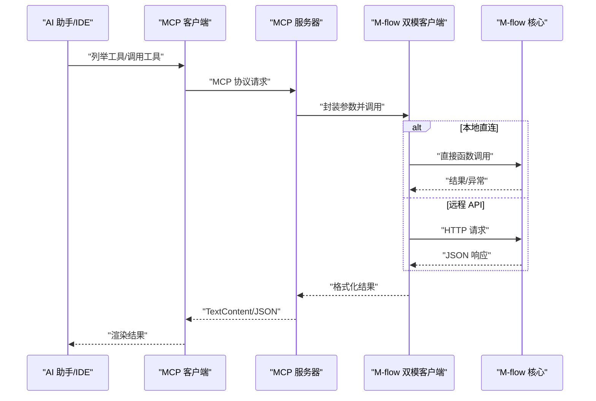
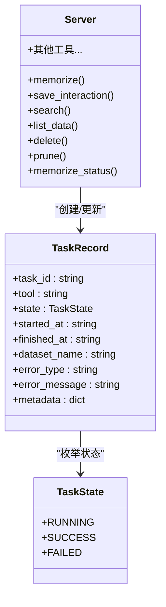
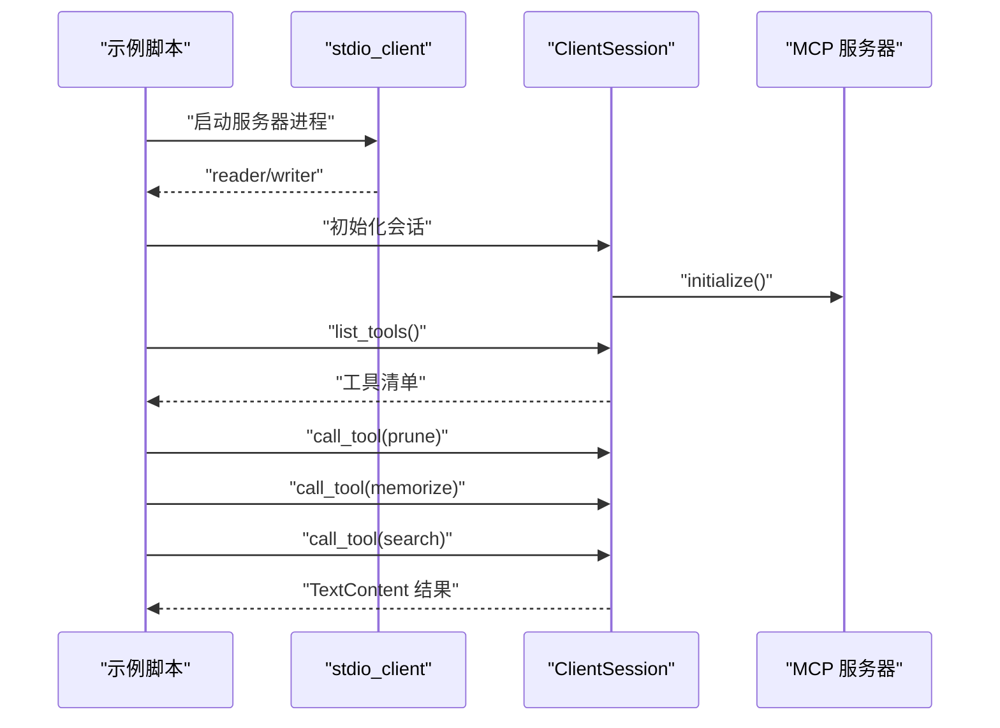
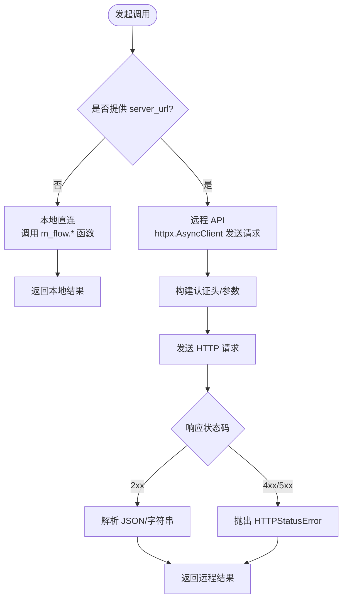
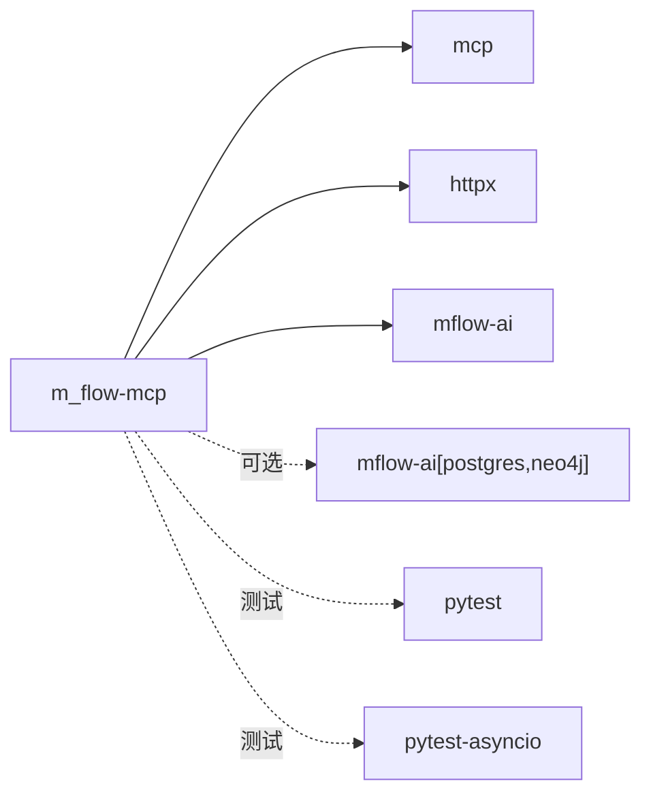

# MCP 协议扩展

<cite>
**本文引用的文件**
- [m_flow-mcp/src/__init__.py](file://m_flow-mcp/src/__init__.py)
- [m_flow-mcp/src/client.py](file://m_flow-mcp/src/client.py)
- [m_flow-mcp/src/m_flow_client.py](file://m_flow-mcp/src/m_flow_client.py)
- [m_flow-mcp/src/server.py](file://m_flow-mcp/src/server.py)
- [m_flow-mcp/README.md](file://m_flow-mcp/README.md)
- [m_flow-mcp/pyproject.toml](file://m_flow-mcp/pyproject.toml)
- [m_flow-mcp/src/test_client.py](file://m_flow-mcp/src/test_client.py)
- [m_flow-mcp/src/test_integration.py](file://m_flow-mcp/src/test_integration.py)
- [m_flow-mcp/src/test_m_flow_client.py](file://m_flow-mcp/src/test_m_flow_client.py)
- [m_flow-mcp/src/test_server_api_mode.py](file://m_flow-mcp/src/test_server_api_mode.py)
- [m_flow/__init__.py](file://m_flow/__init__.py)
</cite>

## 目录
1. [简介](#简介)
2. [项目结构](#项目结构)
3. [核心组件](#核心组件)
4. [架构总览](#架构总览)
5. [详细组件分析](#详细组件分析)
6. [依赖分析](#依赖分析)
7. [性能考量](#性能考量)
8. [故障排查指南](#故障排查指南)
9. [结论](#结论)
10. [附录](#附录)

## 简介
本指南围绕 Model Context Protocol（MCP）在 M-flow 知识图谱平台中的扩展实践，系统阐述如何基于现有实现进行二次开发与集成。内容涵盖：
- MCP 工具的自定义与扩展方法
- 消息格式与协议实现要点
- MCP 客户端与服务器的开发模式（连接管理、会话处理、错误恢复）
- 工具注册与发现机制（工具元数据、能力声明、版本管理）
- 安全考虑（身份验证、授权、数据加密）
- 完整扩展示例与第三方 AI 工具集成案例

## 项目结构
m_flow-mcp 子模块提供了 MCP 服务器与客户端，以及对 M-flow 核心能力的双模封装（本地直连与远程 HTTP API）。其关键目录与文件如下：
- src/server.py：MCP 服务器实现，暴露一组工具函数供 AI 助手调用
- src/m_flow_client.py：M-flow 双模客户端（本地直连/远程 API），统一底层调用
- src/client.py：MCP 客户端示例，演示如何通过 MCP 协议调用工具
- src/test_*：单元测试、集成测试与 API 模式测试
- README.md：快速开始、工具清单、环境变量、传输模式与 IDE 集成指引
- pyproject.toml：依赖与打包配置

**图表来源**
- [m_flow-mcp/src/server.py:1-120](file://m_flow-mcp/src/server.py#L1-L120)
- [m_flow-mcp/src/client.py:1-55](file://m_flow-mcp/src/client.py#L1-L55)
- [m_flow-mcp/src/m_flow_client.py:1-120](file://m_flow-mcp/src/m_flow_client.py#L1-L120)
- [m_flow-mcp/README.md:1-120](file://m_flow-mcp/README.md#L1-L120)
- [m_flow-mcp/pyproject.toml:1-31](file://m_flow-mcp/pyproject.toml#L1-L31)
- [m_flow/__init__.py:1-95](file://m_flow/__init__.py#L1-L95)

**章节来源**
- [m_flow-mcp/README.md:1-120](file://m_flow-mcp/README.md#L1-L120)
- [m_flow-mcp/pyproject.toml:1-31](file://m_flow-mcp/pyproject.toml#L1-L31)

## 核心组件
- MCP 服务器（FastMCP）：通过装饰器注册工具函数，统一处理参数校验、异步任务跟踪与响应格式化
- M-flow 双模客户端：根据是否提供 API 地址自动切换直连或远程模式，屏蔽底层差异
- MCP 客户端示例：演示 stdio 会话初始化、工具列举与调用流程
- 测试套件：覆盖工具发现、参数校验、错误处理、并发与 API 模式适配

**章节来源**
- [m_flow-mcp/src/server.py:245-800](file://m_flow-mcp/src/server.py#L245-L800)
- [m_flow-mcp/src/m_flow_client.py:21-558](file://m_flow-mcp/src/m_flow_client.py#L21-L558)
- [m_flow-mcp/src/client.py:23-55](file://m_flow-mcp/src/client.py#L23-L55)
- [m_flow-mcp/src/test_client.py:81-183](file://m_flow-mcp/src/test_client.py#L81-L183)
- [m_flow-mcp/src/test_integration.py:28-102](file://m_flow-mcp/src/test_integration.py#L28-L102)

## 架构总览
MCP 服务器作为协议适配层，将 AI 助手的工具调用请求转发至 M-flow 核心；M-flow 双模客户端负责实际业务执行，支持本地直连与远程 API 两种模式。

**图表来源**
- [m_flow-mcp/src/client.py:23-55](file://m_flow-mcp/src/client.py#L23-L55)
- [m_flow-mcp/src/server.py:245-494](file://m_flow-mcp/src/server.py#L245-L494)
- [m_flow-mcp/src/m_flow_client.py:21-192](file://m_flow-mcp/src/m_flow_client.py#L21-L192)
- [m_flow/__init__.py:21-46](file://m_flow/__init__.py#L21-L46)

## 详细组件分析

### MCP 服务器（工具注册与实现）
- 工具注册：使用装饰器注册工具函数，统一参数校验与错误处理
- 异步任务跟踪：为后台任务维护状态记录，支持按 task_id 查询
- 响应格式：统一返回 TextContent，便于 MCP 客户端渲染
- 传输模式：支持 stdio、SSE、HTTP，内置 CORS 中间件

**图表来源**
- [m_flow-mcp/src/server.py:71-180](file://m_flow-mcp/src/server.py#L71-L180)
- [m_flow-mcp/src/server.py:250-800](file://m_flow-mcp/src/server.py#L250-L800)

**章节来源**
- [m_flow-mcp/src/server.py:245-800](file://m_flow-mcp/src/server.py#L245-L800)

### MCP 客户端（会话与工具调用）
- 会话管理：通过 stdio 启动 MCP 服务器，建立 ClientSession
- 工具调用：列举工具、调用工具并处理返回内容
- 示例流程：清空数据、添加示例数据、等待处理、搜索并输出结果

**图表来源**
- [m_flow-mcp/src/client.py:23-55](file://m_flow-mcp/src/client.py#L23-L55)

**章节来源**
- [m_flow-mcp/src/client.py:23-55](file://m_flow-mcp/src/client.py#L23-L55)

### M-flow 双模客户端（本地直连 vs 远程 API）
- 模式切换：根据是否提供 server_url 自动选择直连或远程 HTTP
- 统一接口：add、memorize、search、delete、prune、learn、update、ingest、query 等
- 远程模式约束：部分功能（如 prune、learn 的特定参数）存在权限与兼容性限制
- 安全头：自动附加 Authorization 头（Bearer Token）

**图表来源**
- [m_flow-mcp/src/m_flow_client.py:30-558](file://m_flow-mcp/src/m_flow_client.py#L30-L558)

**章节来源**
- [m_flow-mcp/src/m_flow_client.py:21-558](file://m_flow-mcp/src/m_flow_client.py#L21-L558)

### 工具注册与发现机制
- 工具清单：服务器启动后通过装饰器注册工具，客户端可列举并调用
- 能力声明：工具函数签名与参数文档即为能力声明的一部分
- 版本管理：包版本由 __version__ 统一管理，便于客户端识别与兼容性控制

**章节来源**
- [m_flow-mcp/src/__init__.py:16-68](file://m_flow-mcp/src/__init__.py#L16-L68)
- [m_flow-mcp/src/server.py:245-494](file://m_flow-mcp/src/server.py#L245-L494)
- [m_flow-mcp/pyproject.toml:6-6](file://m_flow-mcp/pyproject.toml#L6-L6)

### 消息格式与协议实现
- 请求/响应：MCP 客户端通过 ClientSession 与服务器交互，服务器返回 TextContent
- 参数校验：工具函数内部对 recall_mode、top_k、mode 等参数进行校验
- 错误处理：捕获异常并返回结构化错误信息，同时记录日志

**章节来源**
- [m_flow-mcp/src/server.py:412-494](file://m_flow-mcp/src/server.py#L412-L494)
- [m_flow-mcp/src/test_client.py:185-206](file://m_flow-mcp/src/test_client.py#L185-L206)

### 安全考虑（身份验证、授权、数据加密）
- 身份验证：远程模式通过 Authorization: Bearer Token 进行鉴权
- 授权策略：远程 API 端点对管理员权限与功能开关进行严格控制（如 prune 的权限与冷却期）
- 数据加密：传输建议使用 HTTPS；日志与配置需避免泄露敏感信息
- CORS：SSE/HTTP 服务器内置 CORS 中间件，限制来源与方法

**章节来源**
- [m_flow-mcp/src/m_flow_client.py:48-55](file://m_flow-mcp/src/m_flow_client.py#L48-L55)
- [m_flow-mcp/src/server.py:201-237](file://m_flow-mcp/src/server.py#L201-L237)
- [m_flow-mcp/src/server.py:666-744](file://m_flow-mcp/src/server.py#L666-L744)

### 完整扩展示例与第三方集成
- 扩展示例：新增工具时，参考现有装饰器注册方式，确保参数校验与返回格式一致
- 第三方集成：通过 stdio（IDE）、SSE（Web 客户端）、HTTP（REST）三种传输模式对接 Cursor、Claude Desktop、VS Code + Continue 等
- 端到端测试：提供 Docker 构建与健康检查脚本，验证服务可用性与日志质量

**章节来源**
- [m_flow-mcp/README.md:88-138](file://m_flow-mcp/README.md#L88-L138)
- [m_flow-mcp/README.md:166-217](file://m_flow-mcp/README.md#L166-L217)
- [m_flow-mcp/README.md:230-244](file://m_flow-mcp/README.md#L230-L244)

## 依赖分析
- 运行时依赖：mcp（MCP 协议）、httpx（HTTP 客户端）、mflow-ai（M-flow 核心）
- 可选依赖：postgres、neo4j 等数据库驱动
- 测试依赖：pytest、pytest-asyncio

**图表来源**
- [m_flow-mcp/pyproject.toml:10-23](file://m_flow-mcp/pyproject.toml#L10-L23)

**章节来源**
- [m_flow-mcp/pyproject.toml:1-31](file://m_flow-mcp/pyproject.toml#L1-L31)

## 性能考量
- 异步执行：后台任务通过 asyncio.create_task 执行，避免阻塞主线程
- 任务跟踪：LRU 任务记录上限与超时控制，防止内存膨胀
- 并发处理：集成测试覆盖并发入库场景，建议在生产环境合理配置资源与限流
- 传输优化：SSE/HTTP 服务器内置中间件，减少跨域与头部开销

**章节来源**
- [m_flow-mcp/src/server.py:113-180](file://m_flow-mcp/src/server.py#L113-L180)
- [m_flow-mcp/src/test_integration.py:190-222](file://m_flow-mcp/src/test_integration.py#L190-L222)

## 故障排查指南
- 服务器无法连接：检查健康端点与日志输出
- IDE 无法发现工具：确认 MCP 配置文件 JSON 语法与 URL 端口
- 搜索无结果：确认已入库数据、使用 list_data 检查数据集、尝试不同 recall_mode
- 参数错误：关注无效模式、top_k 范围、UUID 格式等校验提示
- API 模式限制：prune、learn 等功能在远程模式下存在权限与兼容性限制

**章节来源**
- [m_flow-mcp/README.md:246-269](file://m_flow-mcp/README.md#L246-L269)
- [m_flow-mcp/src/test_client.py:294-315](file://m_flow-mcp/src/test_client.py#L294-L315)
- [m_flow-mcp/src/test_server_api_mode.py:24-35](file://m_flow-mcp/src/test_server_api_mode.py#L24-L35)

## 结论
m_flow-mcp 提供了清晰的 MCP 服务器与客户端实现，结合 M-flow 双模客户端，既支持本地直连也支持远程 API，满足不同部署与集成需求。通过完善的参数校验、异步任务跟踪与测试覆盖，开发者可以在此基础上稳定地扩展工具、优化性能并保障安全性。

## 附录
- 快速开始与 IDE 集成示例见 README
- 完整测试套件覆盖工具功能、参数校验、错误恢复与并发场景
- 版本号与打包配置位于 pyproject.toml

**章节来源**
- [m_flow-mcp/README.md:1-274](file://m_flow-mcp/README.md#L1-L274)
- [m_flow-mcp/src/test_client.py:618-705](file://m_flow-mcp/src/test_client.py#L618-L705)
- [m_flow-mcp/src/test_integration.py:253-272](file://m_flow-mcp/src/test_integration.py#L253-L272)
- [m_flow-mcp/pyproject.toml:1-31](file://m_flow-mcp/pyproject.toml#L1-L31)