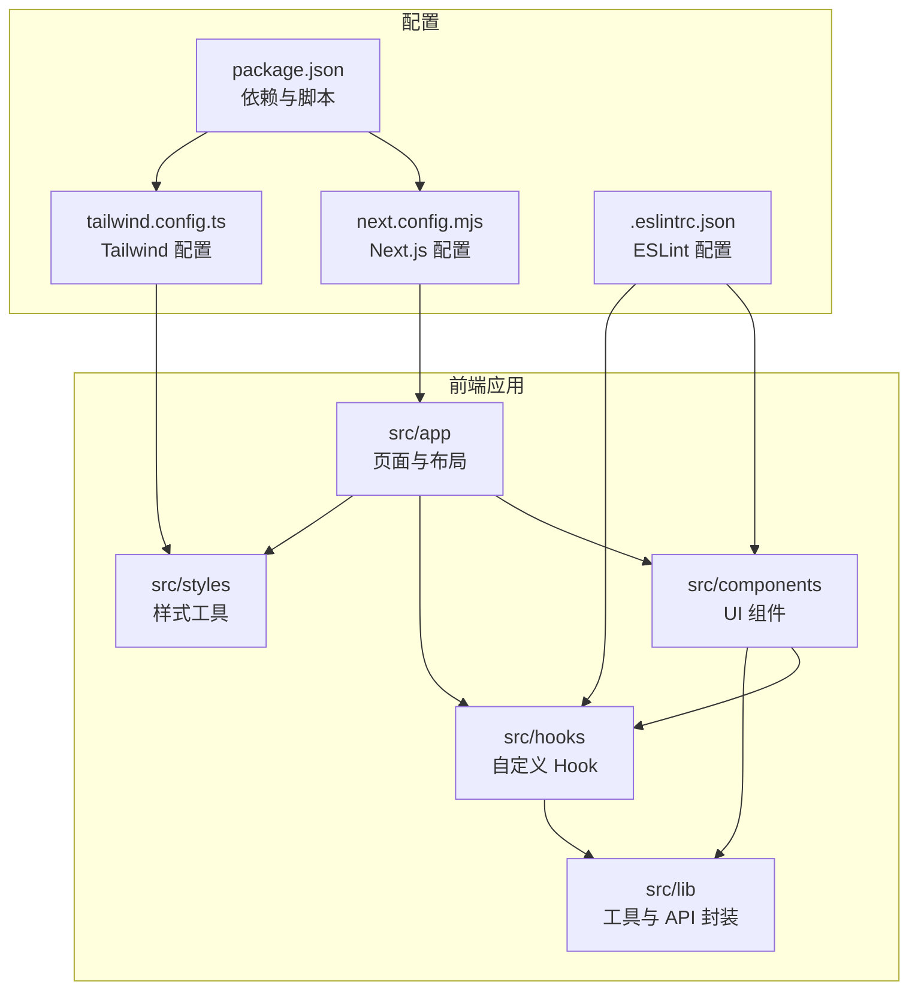
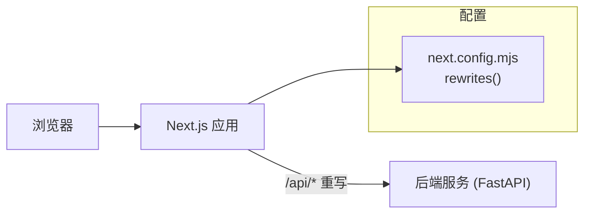
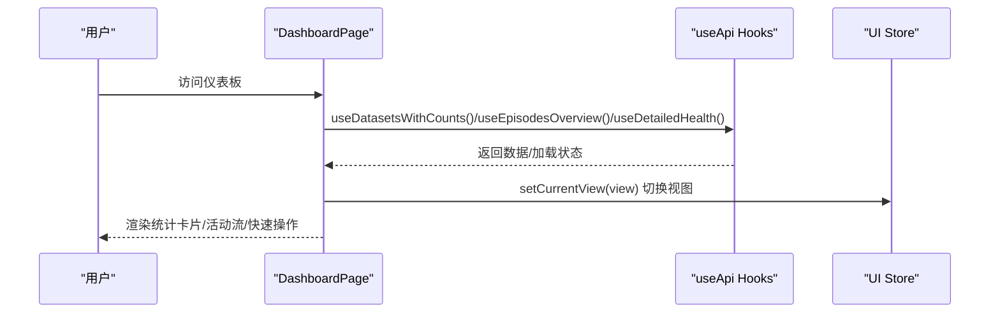
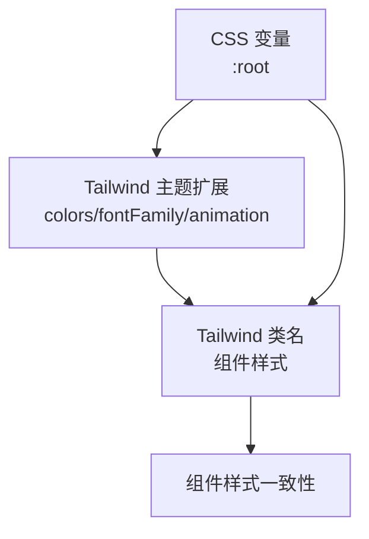
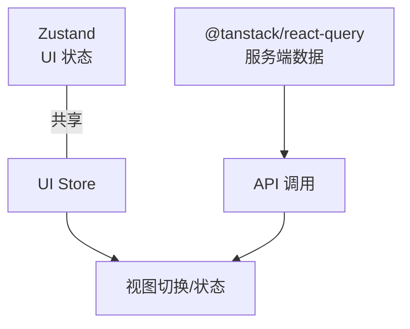
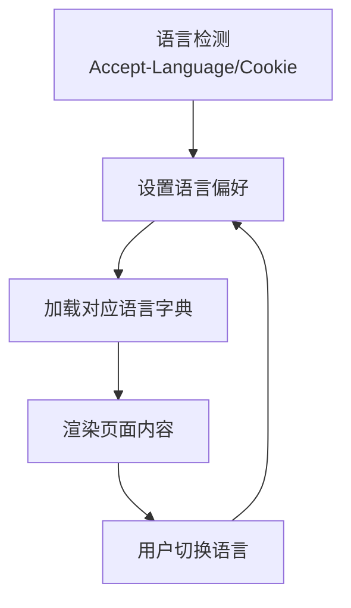
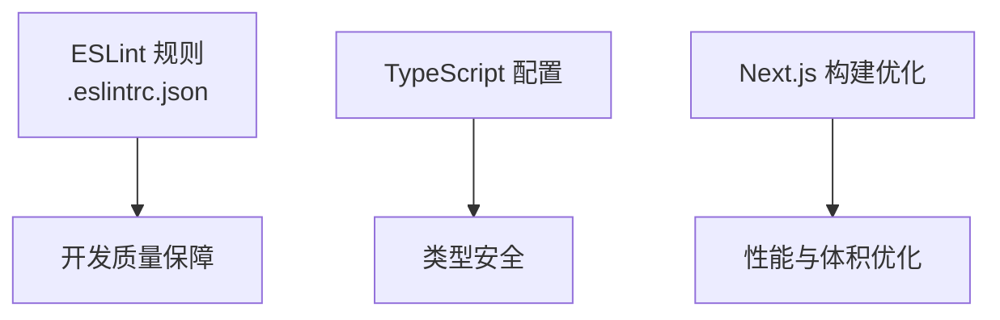
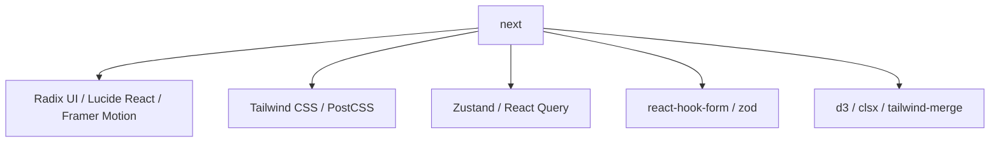

# 前端扩展开发

<cite>
**本文引用的文件**
- [package.json](file://m_flow-frontend/package.json)
- [next.config.mjs](file://m_flow-frontend/nex.config.mjs)
- [tailwind.config.ts](file://m_flow-frontend/tailwind.config.ts)
- [.eslintrc.json](file://m_flow-frontend/.eslintrc.json)
- [layout.tsx](file://m_flow-frontend/src/app/layout.tsx)
- [globals.css](file://m_flow-frontend/src/app/globals.css)
- [DashboardPage.tsx](file://m_flow-frontend/src/components/dashboard/DashboardPage.tsx)
</cite>

## 目录
1. [简介](#简介)
2. [项目结构](#项目结构)
3. [核心组件](#核心组件)
4. [架构总览](#架构总览)
5. [详细组件分析](#详细组件分析)
6. [依赖关系分析](#依赖关系分析)
7. [性能考虑](#性能考虑)
8. [故障排查指南](#故障排查指南)
9. [结论](#结论)
10. [附录](#附录)

## 简介
本指南面向希望在现有 Next.js 前端基础上进行扩展与定制的开发者，围绕以下主题提供系统化的扩展方法与最佳实践：
- 自定义组件开发：基于现有组件模式与设计系统进行二次扩展
- 页面路由与布局设计：理解 Next.js App Router 结构与全局布局
- 状态管理扩展：集成 Redux Toolkit、Zustand 与 React Query 的策略与边界
- 样式系统扩展：Tailwind CSS 定制、主题系统与响应式设计
- 国际化扩展：多语言支持、本地化配置与动态语言切换
- 前端工具链扩展：ESLint 配置、TypeScript 类型定义与构建优化
- 实战示例与用户体验优化建议

## 项目结构
前端工程位于 m_flow-frontend 目录，采用 Next.js App Router 架构，核心目录与职责如下：
- src/app：页面与布局（App Router）
- src/components：可复用 UI 组件（按功能域分层）
- src/hooks：自定义 Hook（数据获取、状态逻辑）
- src/lib：工具函数、API 封装、类型定义
- src/styles：样式工具与主题变量
- 配置文件：next.config.mjs、tailwind.config.ts、.eslintrc.json、tsconfig.json 等

图表来源
- [layout.tsx:1-23](file://m_flow-frontend/src/app/layout.tsx#L1-L23)
- [globals.css:1-296](file://m_flow-frontend/src/app/globals.css#L1-L296)
- [tailwind.config.ts:1-127](file://m_flow-frontend/tailwind.config.ts#L1-L127)
- [next.config.mjs:1-29](file://m_flow-frontend/nex.config.mjs#L1-L29)
- [package.json:1-65](file://m_flow-frontend/package.json#L1-L65)

章节来源
- [layout.tsx:1-23](file://m_flow-frontend/src/app/layout.tsx#L1-L23)
- [globals.css:1-296](file://m_flow-frontend/src/app/globals.css#L1-L296)
- [tailwind.config.ts:1-127](file://m_flow-frontend/tailwind.config.ts#L1-L127)
- [next.config.mjs:1-29](file://m_flow-frontend/nex.config.mjs#L1-L29)
- [package.json:1-65](file://m_flow-frontend/package.json#L1-L65)

## 核心组件
- 全局布局与元数据：根布局负责注入全局样式与元信息，确保客户端渲染安全与水合控制
- 设计系统与主题：通过 CSS 变量与 Tailwind 扩展实现深色高对比度风格与品牌色彩体系
- 组件组织：按功能域划分（dashboard、graph、memorize 等），组件内部使用 CSS 变量与 Tailwind 类名统一风格
- 数据获取与状态：通过自定义 Hook 调用 API，结合 UI Store 进行视图状态管理

章节来源
- [layout.tsx:1-23](file://m_flow-frontend/src/app/layout.tsx#L1-L23)
- [globals.css:1-296](file://m_flow-frontend/src/app/globals.css#L1-L296)
- [DashboardPage.tsx:1-367](file://m_flow-frontend/src/components/dashboard/DashboardPage.tsx#L1-L367)

## 架构总览
前端与后端通过 Next.js 重写规则代理 API 请求，开发环境默认将 /api/* 重写到本地后端服务。

图表来源
- [next.config.mjs:16-25](file://m_flow-frontend/nex.config.mjs#L16-L25)

章节来源
- [next.config.mjs:1-29](file://m_flow-frontend/nex.config.mjs#L1-L29)

## 详细组件分析

### 组件：DashboardPage
DashboardPage 展示了典型的扩展模式：使用自定义 Hook 获取数据、通过 UI Store 切换视图、利用 CSS 变量与 Tailwind 类名实现一致风格，并在首次加载时使用骨架屏优化体验。

图表来源
- [DashboardPage.tsx:158-362](file://m_flow-frontend/src/components/dashboard/DashboardPage.tsx#L158-L362)

章节来源
- [DashboardPage.tsx:1-367](file://m_flow-frontend/src/components/dashboard/DashboardPage.tsx#L1-L367)

### 样式系统与主题扩展
- CSS 变量：通过 :root 定义背景、边框、文本、强调色与间距等变量，形成统一的设计令牌
- Tailwind 扩展：在 tailwind.config.ts 中扩展颜色、字体族、动画与关键帧，实现品牌化视觉风格
- 全局样式：在 globals.css 中集中定义基础排版、动画与组件通用样式

图表来源
- [globals.css:12-55](file://m_flow-frontend/src/app/globals.css#L12-L55)
- [tailwind.config.ts:9-122](file://m_flow-frontend/tailwind.config.ts#L9-L122)

章节来源
- [globals.css:1-296](file://m_flow-frontend/src/app/globals.css#L1-L296)
- [tailwind.config.ts:1-127](file://m_flow-frontend/tailwind.config.ts#L1-L127)

### 状态管理扩展策略
当前项目已引入 Zustand 与 React Query，建议扩展策略如下：
- Zustand：用于轻量级 UI 状态与跨组件共享的状态（如当前视图、侧边栏展开状态）
- React Query：用于服务端数据缓存、并发请求管理与自动重试
- Redux Toolkit：若业务复杂度提升，可作为 Zustand 的补充或替代方案，但需评估与现有依赖的兼容性

图表来源
- [package.json:16-43](file://m_flow-frontend/package.json#L16-L43)

章节来源
- [package.json:1-65](file://m_flow-frontend/package.json#L1-L65)

### 国际化扩展开发
- 多语言支持：建议引入 next-i18next 或 next-intl，配合目录结构按语言拆分页面与资源
- 本地化配置：在 next.config.mjs 中配置 locales、defaultLocale 与检测策略
- 动态语言切换：通过路由参数或 Cookie/LocalStorage 存储语言偏好，切换后重新渲染对应语言内容

（本节为概念性指导，不直接分析具体源码）

### 工具链扩展
- ESLint：基于 next/core-web-vitals 规则集，可按团队规范扩展自定义规则
- TypeScript：保持严格模式与路径别名配置，确保类型安全与开发体验
- 构建优化：启用 Next.js 内置优化（如输出独立包、静态生成等），并结合 PostCSS/Tailwind 进行样式产物优化

图表来源
- [.eslintrc.json:1-2](file://m_flow-frontend/.eslintrc.json#L1-L2)
- [package.json:1-65](file://m_flow-frontend/package.json#L1-L65)

章节来源
- [.eslintrc.json:1-2](file://m_flow-frontend/.eslintrc.json#L1-L2)
- [package.json:1-65](file://m_flow-frontend/package.json#L1-L65)

## 依赖关系分析
前端依赖以 Next.js 14 为核心，辅以 Radix UI、Lucide React、Framer Motion、Tailwind CSS、Zustand、React Query 等生态库；开发依赖包含 ESLint、Vitest、Playwright、PostCSS、Tailwind 等工具链。

图表来源
- [package.json:16-43](file://m_flow-frontend/package.json#L16-L43)

章节来源
- [package.json:1-65](file://m_flow-frontend/package.json#L1-L65)

## 性能考虑
- 首屏与交互：利用骨架屏与条件渲染减少首屏阻塞，避免不必要的数据请求
- 图片与媒体：使用 Next.js Image 优化图片，合理设置尺寸与格式
- 样式体积：通过 Tailwind purge 与按需引入减少 CSS 体积
- 缓存策略：结合 React Query 的缓存与失效策略，减少重复请求
- 构建优化：启用 Next.js 输出独立包与静态导出（如适用），缩短启动时间

（本节提供通用指导）

## 故障排查指南
- 水合不匹配：确保仅在客户端组件中使用浏览器 API，必要时使用客户端包装器
- API 代理失败：检查 next.config.mjs 中的重写规则与后端服务可用性
- 样式异常：确认 Tailwind 配置的 content 路径覆盖到目标组件与页面
- ESLint 报错：遵循 next/core-web-vitals 规则，逐步添加团队自定义规则

章节来源
- [layout.tsx:16-20](file://m_flow-frontend/src/app/layout.tsx#L16-L20)
- [next.config.mjs:16-25](file://m_flow-frontend/nex.config.mjs#L16-L25)
- [tailwind.config.ts:4-8](file://m_flow-frontend/tailwind.config.ts#L4-L8)
- [.eslintrc.json:1-2](file://m_flow-frontend/.eslintrc.json#L1-L2)

## 结论
本指南提供了在现有 Next.js 前端工程上进行扩展的系统方法，涵盖组件开发、路由与布局、状态管理、样式系统、国际化与工具链等方面。建议在扩展过程中坚持“最小可行”原则，优先复用现有设计系统与工具链，确保一致的用户体验与开发效率。

## 附录
- 示例清单（路径参考）：
  - 页面与布局：[layout.tsx:1-23](file://m_flow-frontend/src/app/layout.tsx#L1-L23)
  - 全局样式：[globals.css:1-296](file://m_flow-frontend/src/app/globals.css#L1-L296)
  - Tailwind 配置：[tailwind.config.ts:1-127](file://m_flow-frontend/tailwind.config.ts#L1-L127)
  - Next.js 配置：[next.config.mjs:1-29](file://m_flow-frontend/nex.config.mjs#L1-L29)
  - 依赖与脚本：[package.json:1-65](file://m_flow-frontend/package.json#L1-L65)
  - 仪表板组件：[DashboardPage.tsx:1-367](file://m_flow-frontend/src/components/dashboard/DashboardPage.tsx#L1-L367)