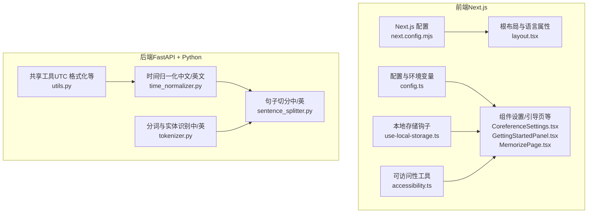
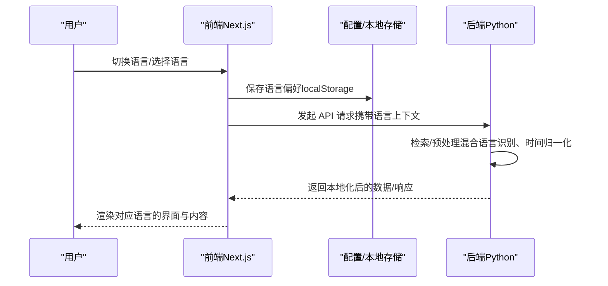
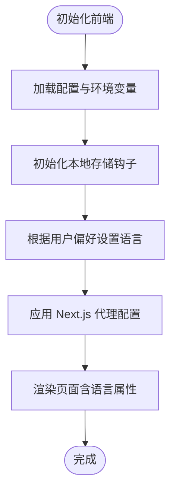
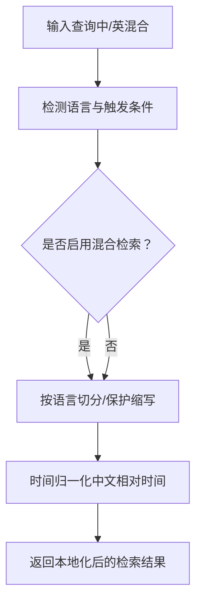
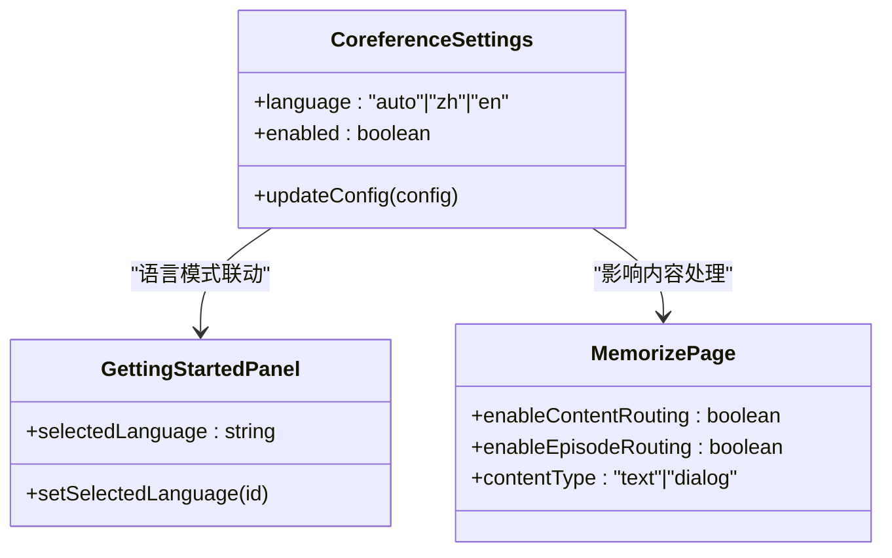
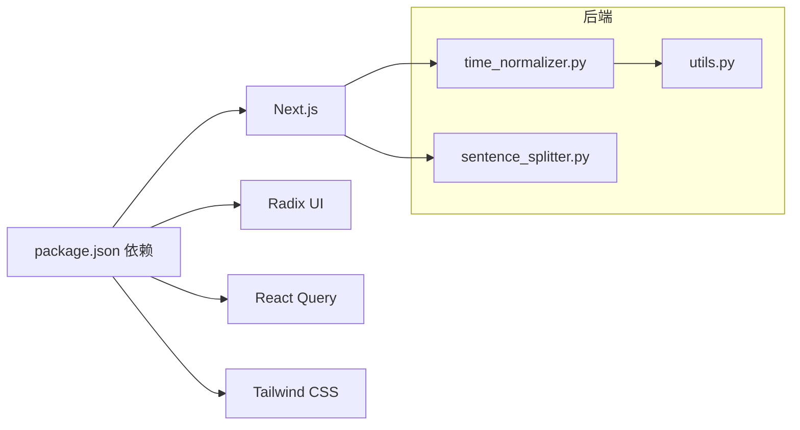

# 国际化扩展开发

<cite>
**本文档引用的文件**
- [package.json](file://m_flow-frontend/package.json)
- [next.config.mjs](file://m_flow-frontend/next.config.mjs)
- [layout.tsx](file://m_flow-frontend/src/app/layout.tsx)
- [config.ts](file://m_flow-frontend/src/lib/config.ts)
- [use-local-storage.ts](file://m_flow-frontend/src/hooks/use-local-storage.ts)
- [accessibility.ts](file://m_flow-frontend/src/lib/utils/accessibility.ts)
- [GettingStartedPanel.tsx](file://m_flow-frontend/src/components/setup/GettingStarted/GettingStartedPanel.tsx)
- [CoreferenceSettings.tsx](file://m_flow-frontend/src/components/settings/CoreferenceSettings.tsx)
- [MemorizePage.tsx](file://m_flow-frontend/src/components/memorize/MemorizePage.tsx)
- [time_normalizer.py](file://coreference/coreference_module/time_normalizer.py)
- [tokenizer.py](file://coreference/coreference_module/tokenizer.py)
- [sentence_splitter.py](file://m_flow/memory/episodic/sentence_splitter.py)
- [test_sentence_splitter.py](file://m_flow/tests/unit/tasks/episodic/test_sentence_splitter.py)
- [test_query_preprocessor.py](file://m_flow/tests/unit/retrieval/test_query_preprocessor.py)
- [utils.py](file://m_flow/shared/utils.py)
- [test_to_iso_z.py](file://m_flow/tests/unit/shared/test_to_iso_z.py)
- [health.ts](file://m_flow-frontend/src/lib/utils/health.ts)
- [procedural_extractor.py](file://m_flow/memory/procedural/governance/procedural_extractor.py)
</cite>

## 目录
1. [引言](#引言)
2. [项目结构](#项目结构)
3. [核心组件](#核心组件)
4. [架构总览](#架构总览)
5. [详细组件分析](#详细组件分析)
6. [依赖关系分析](#依赖关系分析)
7. [性能考量](#性能考量)
8. [故障排查指南](#故障排查指南)
9. [结论](#结论)
10. [附录](#附录)

## 引言
本指南面向需要为 M-Flow 系统开发国际化（i18n）扩展的工程师，系统性地阐述如何在现有代码库基础上集成与配置多语言能力，涵盖多语言资源管理、语言包组织、动态语言切换、日期/时间/数字/货币本地化格式化、文本提取与翻译管理流程、RTL（从右到左）语言支持与双向文本处理、本地化测试策略、翻译质量保证以及多语言 SEO 优化，并提供完整的国际化扩展示例与多语言用户体验设计建议。

## 项目结构
M-Flow 的前端基于 Next.js 构建，后端采用 FastAPI。国际化扩展涉及前后端协同：
- 前端 Next.js 应用负责界面文案的本地化、语言切换、RTL 支持与可访问性增强。
- 后端 Python 服务负责检索与预处理中的混合语言识别、时间归一化等语言相关逻辑。
- 测试覆盖确保本地化行为在不同语言场景下的稳定性。

**图表来源**
- [next.config.mjs:1-28](file://m_flow-frontend/next.config.mjs#L1-L28)
- [layout.tsx:1-22](file://m_flow-frontend/src/app/layout.tsx#L1-L22)
- [config.ts:1-76](file://m_flow-frontend/src/lib/config.ts#L1-L76)
- [use-local-storage.ts:44-100](file://m_flow-frontend/src/hooks/use-local-storage.ts#L44-L100)
- [accessibility.ts:385-437](file://m_flow-frontend/src/lib/utils/accessibility.ts#L385-L437)
- [CoreferenceSettings.tsx:1-145](file://m_flow-frontend/src/components/settings/CoreferenceSettings.tsx#L1-L145)
- [GettingStartedPanel.tsx:205-250](file://m_flow-frontend/src/components/setup/GettingStarted/GettingStartedPanel.tsx#L205-L250)
- [MemorizePage.tsx:92-118](file://m_flow-frontend/src/components/memorize/MemorizePage.tsx#L92-L118)
- [time_normalizer.py:45-106](file://coreference/coreference_module/time_normalizer.py#L45-L106)
- [tokenizer.py:714-1926](file://coreference/coreference_module/tokenizer.py#L714-L1926)
- [sentence_splitter.py:329-397](file://m_flow/memory/episodic/sentence_splitter.py#L329-L397)
- [utils.py:164-197](file://m_flow/shared/utils.py#L164-L197)

**章节来源**
- [next.config.mjs:1-28](file://m_flow-frontend/next.config.mjs#L1-L28)
- [layout.tsx:1-22](file://m_flow-frontend/src/app/layout.tsx#L1-L22)
- [config.ts:1-76](file://m_flow-frontend/src/lib/config.ts#L1-L76)

## 核心组件
- 前端配置与环境变量：集中管理 API 地址、WebSocket 地址、自动登录与默认用户凭据等，便于后续扩展国际化配置项。
- Next.js 配置：代理 /api/* 请求至后端，保障前端与后端的统一部署与跨域访问。
- 根布局与语言属性：设置 html lang 属性，为浏览器与辅助技术提供语言提示。
- 本地存储钩子：封装 localStorage 读写，支持语言偏好等用户设置持久化。
- 可访问性工具：提供屏幕阅读器播报区域，提升多语言内容的无障碍体验。
- 组件层：设置页与引导页已体现语言模式选择与多语言示例对比，为国际化 UI 扩展提供基础。

**章节来源**
- [config.ts:1-76](file://m_flow-frontend/src/lib/config.ts#L1-L76)
- [next.config.mjs:1-28](file://m_flow-frontend/next.config.mjs#L1-L28)
- [layout.tsx:1-22](file://m_flow-frontend/src/app/layout.tsx#L1-L22)
- [use-local-storage.ts:44-100](file://m_flow-frontend/src/hooks/use-local-storage.ts#L44-L100)
- [accessibility.ts:385-437](file://m_flow-frontend/src/lib/utils/accessibility.ts#L385-L437)
- [CoreferenceSettings.tsx:1-145](file://m_flow-frontend/src/components/settings/CoreferenceSettings.tsx#L1-L145)
- [GettingStartedPanel.tsx:205-250](file://m_flow-frontend/src/components/setup/GettingStarted/GettingStartedPanel.tsx#L205-L250)
- [MemorizePage.tsx:92-118](file://m_flow-frontend/src/components/memorize/MemorizePage.tsx#L92-L118)

## 架构总览
国际化扩展的端到端流程如下：

**图表来源**
- [use-local-storage.ts:44-100](file://m_flow-frontend/src/hooks/use-local-storage.ts#L44-L100)
- [config.ts:1-76](file://m_flow-frontend/src/lib/config.ts#L1-L76)
- [next.config.mjs:16-25](file://m_flow-frontend/next.config.mjs#L16-L25)
- [time_normalizer.py:45-106](file://coreference/coreference_module/time_normalizer.py#L45-L106)
- [sentence_splitter.py:329-397](file://m_flow/memory/episodic/sentence_splitter.py#L329-L397)

## 详细组件分析

### 前端国际化基础设施
- 配置与环境变量：集中定义 API 与 WebSocket 基础地址、自动登录开关与默认凭据，便于国际化参数（如语言首选项）的扩展与注入。
- Next.js 代理配置：将 /api/* 请求转发至后端，确保前端在开发与生产环境中均能稳定访问后端服务。
- 根布局语言属性：设置 html lang=en，为浏览器与搜索引擎提供语言提示；后续可改为动态语言值。
- 本地存储钩子：提供安全的 localStorage 读写封装，用于持久化语言偏好、主题等用户设置。
- 可访问性工具：通过 aria-live 区域向屏幕阅读器播报动态内容，提升多语言内容的无障碍体验。

**图表来源**
- [config.ts:1-76](file://m_flow-frontend/src/lib/config.ts#L1-L76)
- [use-local-storage.ts:44-100](file://m_flow-frontend/src/hooks/use-local-storage.ts#L44-L100)
- [next.config.mjs:16-25](file://m_flow-frontend/next.config.mjs#L16-L25)
- [layout.tsx:16-16](file://m_flow-frontend/src/app/layout.tsx#L16-L16)

**章节来源**
- [config.ts:1-76](file://m_flow-frontend/src/lib/config.ts#L1-L76)
- [next.config.mjs:1-28](file://m_flow-frontend/next.config.mjs#L1-L28)
- [layout.tsx:1-22](file://m_flow-frontend/src/app/layout.tsx#L1-L22)
- [use-local-storage.ts:44-100](file://m_flow-frontend/src/hooks/use-local-storage.ts#L44-L100)
- [accessibility.ts:385-437](file://m_flow-frontend/src/lib/utils/accessibility.ts#L385-L437)

### 后端语言处理与本地化
- 时间归一化（中文/英文）：内置中文相对时间、星期、时段等映射，支持将自然语言时间表达转换为时间区间，为多语言检索提供基础。
- 分词与实体识别（中/英）：包含大量中文词汇与英文地名、品牌等集合，支撑跨语言内容理解与实体抽取。
- 句子切分（中/英）：针对英文缩写、数字与中文字符比例进行保守切分策略，避免误切，提升检索质量。
- 共享工具（UTC 格式化）：统一输出 ISO 8601 + Z 的 UTC 时间字符串，避免时区双标记问题，确保序列化与反序列化稳定。

**图表来源**
- [time_normalizer.py:45-106](file://coreference/coreference_module/time_normalizer.py#L45-L106)
- [sentence_splitter.py:329-397](file://m_flow/memory/episodic/sentence_splitter.py#L329-L397)
- [test_query_preprocessor.py:144-175](file://m_flow/tests/unit/retrieval/test_query_preprocessor.py#L144-L175)

**章节来源**
- [time_normalizer.py:45-106](file://coreference/coreference_module/time_normalizer.py#L45-L106)
- [tokenizer.py:714-1926](file://coreference/coreference_module/tokenizer.py#L714-L1926)
- [sentence_splitter.py:329-397](file://m_flow/memory/episodic/sentence_splitter.py#L329-L397)
- [test_sentence_splitter.py:99-136](file://m_flow/tests/unit/tasks/episodic/test_sentence_splitter.py#L99-L136)
- [test_query_preprocessor.py:144-175](file://m_flow/tests/unit/retrieval/test_query_preprocessor.py#L144-L175)

### 动态语言切换与 UI 组织
- 设置页语言模式：提供“自动检测/中文/英文”选项，作为语言模式的入口，便于后续扩展更多语言。
- 引导页语言示例：展示多语言代码示例对比，为国际化 UI 提供参考。
- 记忆页功能开关：内容路由、对话模式等开关项，为多语言内容处理提供灵活配置。

**图表来源**
- [CoreferenceSettings.tsx:22-26](file://m_flow-frontend/src/components/settings/CoreferenceSettings.tsx#L22-L26)
- [GettingStartedPanel.tsx:205-250](file://m_flow-frontend/src/components/setup/GettingStarted/GettingStartedPanel.tsx#L205-L250)
- [MemorizePage.tsx:92-118](file://m_flow-frontend/src/components/memorize/MemorizePage.tsx#L92-L118)

**章节来源**
- [CoreferenceSettings.tsx:1-145](file://m_flow-frontend/src/components/settings/CoreferenceSettings.tsx#L1-L145)
- [GettingStartedPanel.tsx:205-250](file://m_flow-frontend/src/components/setup/GettingStarted/GettingStartedPanel.tsx#L205-L250)
- [MemorizePage.tsx:92-118](file://m_flow-frontend/src/components/memorize/MemorizePage.tsx#L92-L118)

### 日期、时间、数字与货币本地化
- 日期/时间：使用 UTC 格式化工具统一输出 ISO 8601 + Z，避免时区双标记；前端可使用本地化 API 进行显示格式化。
- 数字：对中文/英文混合文本进行句子切分时保护数字与缩写，减少误切；检索阶段可结合数字匹配加分策略。
- 货币：可在前端 UI 中使用 Intl.NumberFormat 对货币进行本地化格式化（示例路径：[货币格式化示例:296-303](file://m_flow-frontend/src/lib/utils/health.ts#L296-L303)）。

**章节来源**
- [utils.py:164-197](file://m_flow/shared/utils.py#L164-L197)
- [health.ts:296-303](file://m_flow-frontend/src/lib/utils/health.ts#L296-L303)
- [sentence_splitter.py:395-431](file://m_flow/memory/episodic/sentence_splitter.py#L395-L431)

### 文本提取与翻译管理流程
- 静态文本提取：前端组件中的文案可通过集中配置与本地存储钩子进行管理，便于翻译与版本控制。
- 动态文本处理：后端检索预处理包含混合语言识别与时间归一化，确保动态内容在多语言环境下的一致性。
- 翻译回滚机制：建议在前端引入版本化的语言包与回滚策略，结合本地存储记录用户偏好的语言版本，以便在翻译更新失败时快速回退。

**章节来源**
- [use-local-storage.ts:44-100](file://m_flow-frontend/src/hooks/use-local-storage.ts#L44-L100)
- [test_query_preprocessor.py:329-357](file://m_flow/tests/unit/retrieval/test_query_preprocessor.py#L329-L357)

### RTL（从右到左）语言支持与双向文本处理
- HTML 方向：在根布局中设置 dir 属性（如 ar-SA），并在 CSS 中为容器添加方向控制类，确保文本从右到左显示。
- 文本双向：对包含阿拉伯语与拉丁字母的混合文本，使用 Unicode 双向算法（例如通过 CSS 或 JS 控制）以正确渲染标点与数字。
- 组件适配：菜单、按钮组与表单控件需考虑 RTL 下的对齐与间距调整，确保视觉一致性。

**章节来源**
- [layout.tsx:16-16](file://m_flow-frontend/src/app/layout.tsx#L16-L16)

### 多语言 SEO 优化
- 结构化链接：为每种语言维护独立的 hreflang 链接，指向对应语言版本页面。
- 内容语言声明：在页面头部设置 html lang 与 hreflang，帮助搜索引擎识别内容语言。
- 动态路由：使用 Next.js 动态路由（如 /[lang]/...）为不同语言提供独立 URL，便于搜索引擎抓取与索引。

**章节来源**
- [layout.tsx:5-8](file://m_flow-frontend/src/app/layout.tsx#L5-L8)

## 依赖关系分析
- 前端依赖：Next.js、Radix UI、React Query、Tailwind CSS 等，为国际化 UI 提供基础组件与状态管理。
- 后端依赖：Python 生态中的 NLP 工具与检索模块，支撑多语言内容处理与本地化。

**图表来源**
- [package.json:16-42](file://m_flow-frontend/package.json#L16-L42)
- [time_normalizer.py:45-106](file://coreference/coreference_module/time_normalizer.py#L45-L106)
- [sentence_splitter.py:329-397](file://m_flow/memory/episodic/sentence_splitter.py#L329-L397)
- [utils.py:164-197](file://m_flow/shared/utils.py#L164-L197)

**章节来源**
- [package.json:16-42](file://m_flow-frontend/package.json#L16-L42)

## 性能考量
- 语言检测与混合检索：在查询预处理阶段进行语言检测与混合检索触发，避免不必要的后端调用。
- 缓存策略：对常用语言包与本地化资源进行缓存，减少重复请求与解析开销。
- 字符串处理：在后端进行句子切分与时间归一化时，优先使用保守策略，降低误判带来的重试成本。

## 故障排查指南
- 时区格式化错误：若出现双时区标记或解析失败，检查 UTC 格式化函数的使用，确保输出符合 ISO 8601 + Z 规范。
- 语言检测异常：确认查询预处理中的混合语言检测逻辑，避免短查询或纯英文查询被错误触发混合检索。
- 句子切分误判：检查英文缩写保护与中文字符比例判断，必要时调整切分策略以减少误切。

**章节来源**
- [test_to_iso_z.py:23-74](file://m_flow/tests/unit/shared/test_to_iso_z.py#L23-L74)
- [test_query_preprocessor.py:144-175](file://m_flow/tests/unit/retrieval/test_query_preprocessor.py#L144-L175)
- [sentence_splitter.py:395-431](file://m_flow/memory/episodic/sentence_splitter.py#L395-L431)

## 结论
通过在前端集中配置与 Next.js 代理、在后端完善语言检测与本地化处理，并结合测试与可访问性工具，M-Flow 可以平滑扩展国际化能力。建议优先实现语言切换、RTL 支持与多语言 SEO，再逐步完善翻译管理与质量保证流程，最终形成一套可维护、可扩展的国际化体系。

## 附录
- 完整国际化扩展示例路径：
  - [前端配置与环境变量:1-76](file://m_flow-frontend/src/lib/config.ts#L1-L76)
  - [Next.js 代理配置:16-25](file://m_flow-frontend/next.config.mjs#L16-L25)
  - [根布局语言属性:16-16](file://m_flow-frontend/src/app/layout.tsx#L16-L16)
  - [本地存储钩子:44-100](file://m_flow-frontend/src/hooks/use-local-storage.ts#L44-L100)
  - [可访问性工具:385-437](file://m_flow-frontend/src/lib/utils/accessibility.ts#L385-L437)
  - [设置页语言模式:22-26](file://m_flow-frontend/src/components/settings/CoreferenceSettings.tsx#L22-L26)
  - [引导页语言示例:205-250](file://m_flow-frontend/src/components/setup/GettingStarted/GettingStartedPanel.tsx#L205-L250)
  - [记忆页功能开关:92-118](file://m_flow-frontend/src/components/memorize/MemorizePage.tsx#L92-L118)
  - [时间归一化（中文/英文）:45-106](file://coreference/coreference_module/time_normalizer.py#L45-L106)
  - [分词与实体识别（中/英）:714-1926](file://coreference/coreference_module/tokenizer.py#L714-L1926)
  - [句子切分（中/英）:329-397](file://m_flow/memory/episodic/sentence_splitter.py#L329-L397)
  - [UTC 格式化工具:164-197](file://m_flow/shared/utils.py#L164-L197)
  - [货币格式化示例:296-303](file://m_flow-frontend/src/lib/utils/health.ts#L296-L303)
  - [混合语言检索测试:144-175](file://m_flow/tests/unit/retrieval/test_query_preprocessor.py#L144-L175)
  - [句子切分单元测试:99-136](file://m_flow/tests/unit/tasks/episodic/test_sentence_splitter.py#L99-L136)