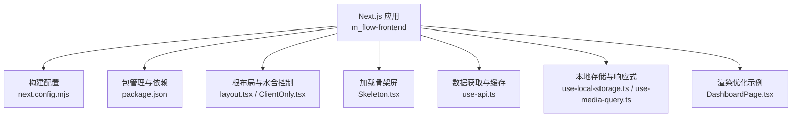
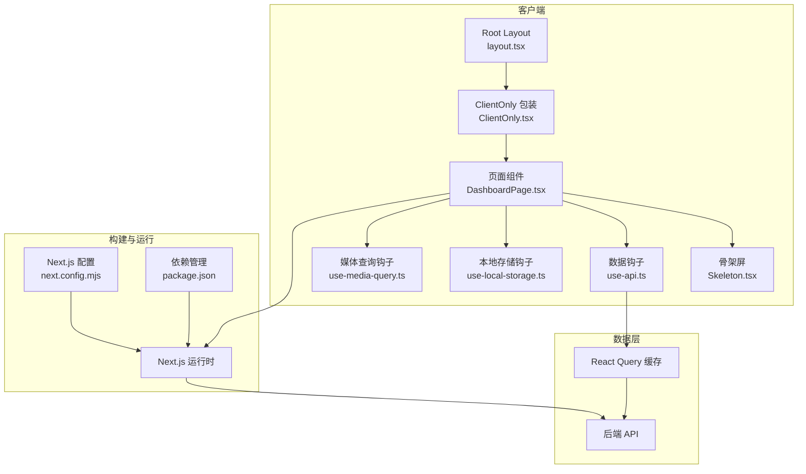
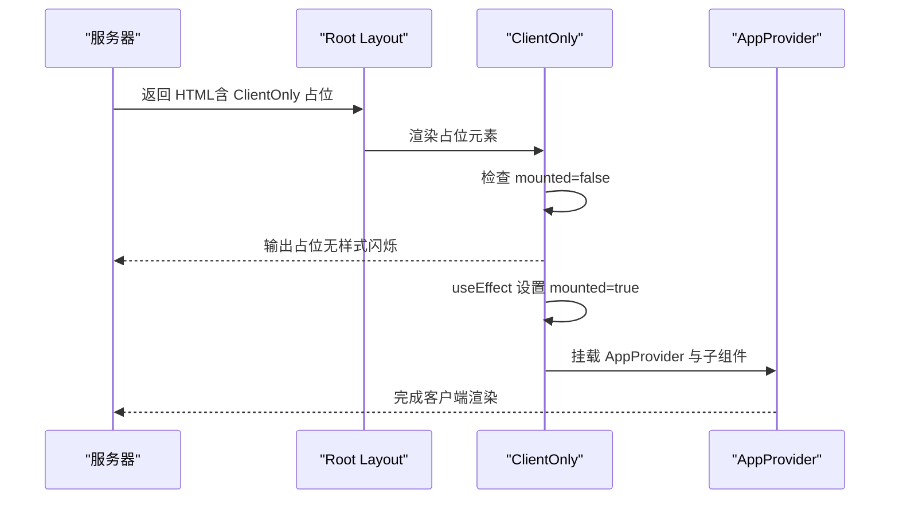
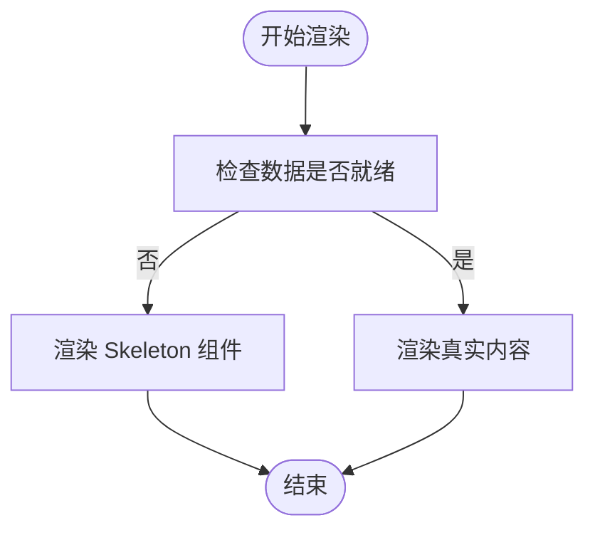
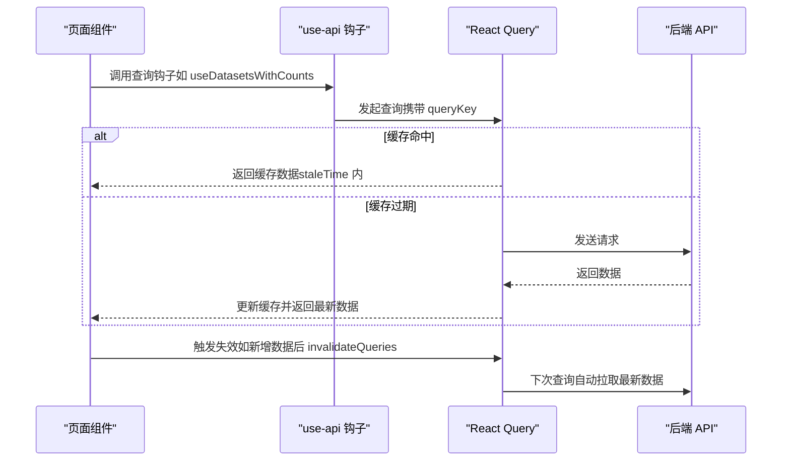
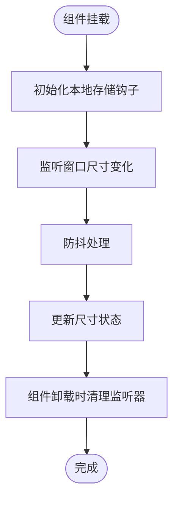
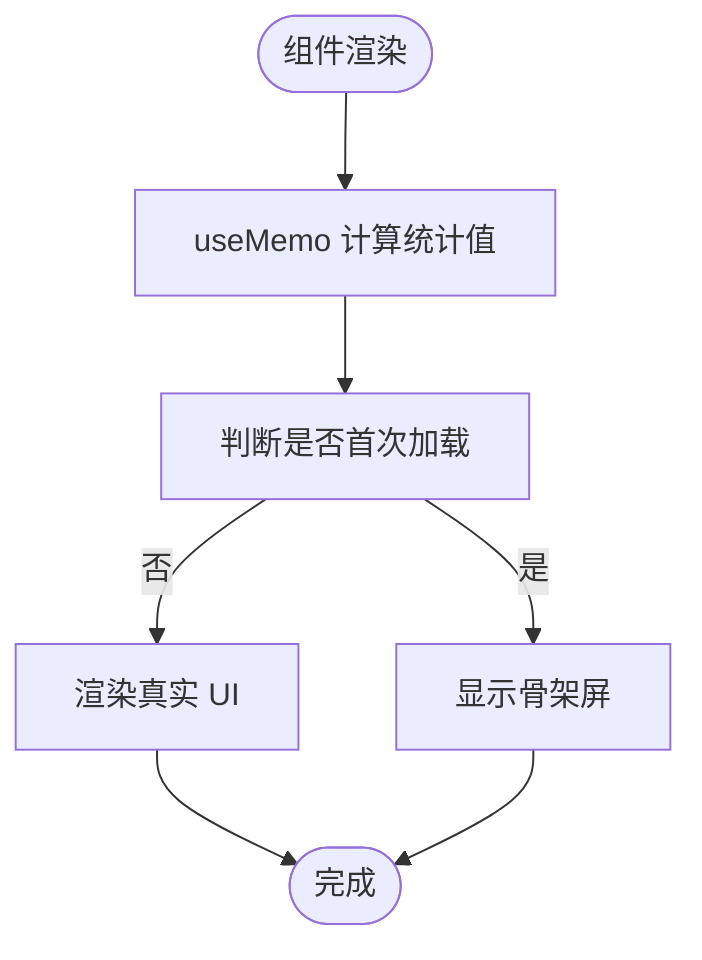
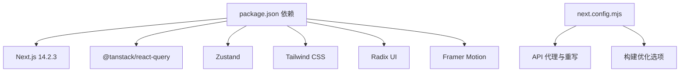

# 性能优化扩展

<cite>
**本文档引用的文件**
- [next.config.mjs](file://m_flow-frontend/next.config.mjs)
- [package.json](file://m_flow-frontend/package.json)
- [layout.tsx](file://m_flow-frontend/src/app/layout.tsx)
- [ClientOnly.tsx](file://m_flow-frontend/src/components/providers/ClientOnly.tsx)
- [Skeleton.tsx](file://m_flow-frontend/src/components/common/Skeleton.tsx)
- [use-api.ts](file://m_flow-frontend/src/hooks/use-api.ts)
- [use-local-storage.ts](file://m_flow-frontend/src/hooks/use-local-storage.ts)
- [use-media-query.ts](file://m_flow-frontend/src/hooks/use-media-query.ts)
- [DashboardPage.tsx](file://m_flow-frontend/src/components/dashboard/DashboardPage.tsx)
</cite>

## 目录
1. [简介](#简介)
2. [项目结构](#项目结构)
3. [核心组件](#核心组件)
4. [架构概览](#架构概览)
5. [详细组件分析](#详细组件分析)
6. [依赖分析](#依赖分析)
7. [性能考虑](#性能考虑)
8. [故障排除指南](#故障排除指南)
9. [结论](#结论)
10. [附录](#附录)

## 简介
本指南面向 Next.js 前端应用的性能优化扩展，结合现有代码库中的实现模式，系统性地介绍以下优化策略与实践：
- 代码分割、懒加载与预取机制
- 组件渲染优化（React.memo、useMemo、useCallback）
- 图片优化、字体优化与静态资源压缩
- 内存管理与垃圾回收优化（组件卸载清理、事件监听器管理）
- 性能监控与分析工具集成（Web Vitals、性能指标收集、错误追踪）
- 完整的性能优化示例与用户体验提升技巧

本指南既适用于具备一定前端基础的开发者，也适合希望快速落地优化措施的团队。

## 项目结构
前端项目位于 m_flow-frontend 目录，采用 Next.js 14.2.3 框架，使用 TypeScript、Tailwind CSS 与 Radix UI 组件库。核心优化点分布在以下位置：
- 构建与运行配置：next.config.mjs、package.json
- 客户端水合控制：src/app/layout.tsx、src/components/providers/ClientOnly.tsx
- 加载状态与骨架屏：src/components/common/Skeleton.tsx
- 数据获取与缓存：src/hooks/use-api.ts（基于 React Query）
- 本地存储与响应式：src/hooks/use-local-storage.ts、src/hooks/use-media-query.ts
- 渲染优化示例：src/components/dashboard/DashboardPage.tsx

**图表来源**
- [next.config.mjs:1-29](file://m_flow-frontend/next.config.mjs#L1-L29)
- [package.json:1-65](file://m_flow-frontend/package.json#L1-L65)
- [layout.tsx:1-23](file://m_flow-frontend/src/app/layout.tsx#L1-L23)
- [ClientOnly.tsx:1-31](file://m_flow-frontend/src/components/providers/ClientOnly.tsx#L1-L31)
- [Skeleton.tsx:1-503](file://m_flow-frontend/src/components/common/Skeleton.tsx#L1-L503)
- [use-api.ts:1-900](file://m_flow-frontend/src/hooks/use-api.ts#L1-L900)
- [use-local-storage.ts:182-357](file://m_flow-frontend/src/hooks/use-local-storage.ts#L182-L357)
- [use-media-query.ts:272-327](file://m_flow-frontend/src/hooks/use-media-query.ts#L272-L327)
- [DashboardPage.tsx:1-367](file://m_flow-frontend/src/components/dashboard/DashboardPage.tsx#L1-L367)

**章节来源**
- [next.config.mjs:1-29](file://m_flow-frontend/next.config.mjs#L1-L29)
- [package.json:1-65](file://m_flow-frontend/package.json#L1-L65)

## 核心组件
本节聚焦于与性能优化直接相关的组件与钩子，并说明其优化策略与适用场景。

- 客户端水合控制（ClientOnly）
  - 作用：避免首屏与服务端渲染之间的水合差异导致的闪烁与重绘，通过客户端挂载后再渲染实际内容。
  - 优化要点：仅在客户端渲染复杂组件或需要 DOM 的组件时使用；配合骨架屏提升感知性能。
  - 参考路径：[ClientOnly.tsx:1-31](file://m_flow-frontend/src/components/providers/ClientOnly.tsx#L1-L31)

- 骨架屏（Skeleton）
  - 作用：在数据加载期间显示占位元素，显著改善感知性能与用户心理预期。
  - 优化要点：提供多种变体（文本、卡片、头像、按钮等），支持动画与无障碍标签；在列表、表格、网格等场景中批量使用。
  - 参考路径：[Skeleton.tsx:1-503](file://m_flow-frontend/src/components/common/Skeleton.tsx#L1-L503)

- 数据获取与缓存（use-api）
  - 作用：基于 React Query 实现查询键隔离、缓存失效、自动刷新与错误重试，减少重复请求与网络开销。
  - 优化要点：合理设置 staleTime、refetchInterval、retry 策略；对多数据集环境使用包含 datasetId 的查询键；在变更后及时失效相关缓存。
  - 参考路径：[use-api.ts:1-900](file://m_flow-frontend/src/hooks/use-api.ts#L1-L900)

- 本地存储与响应式（use-local-storage、use-media-query）
  - 作用：封装 localStorage 读写与响应式窗口尺寸，避免不必要的重渲染与事件泄漏。
  - 优化要点：useCallback 包裹增删改操作；防抖处理窗口尺寸变化；在组件卸载时清理事件监听器。
  - 参考路径：
    - [use-local-storage.ts:182-357](file://m_flow-frontend/src/hooks/use-local-storage.ts#L182-L357)
    - [use-media-query.ts:272-327](file://m_flow-frontend/src/hooks/use-media-query.ts#L272-L327)

- 渲染优化示例（DashboardPage）
  - 作用：展示 useMemo、useRef 在计算稳定化与避免闪烁中的应用。
  - 优化要点：useMemo 计算统计值；useRef 稳定 isNewUser 判断；首次加载使用骨架屏。
  - 参考路径：[DashboardPage.tsx:1-367](file://m_flow-frontend/src/components/dashboard/DashboardPage.tsx#L1-L367)

**章节来源**
- [ClientOnly.tsx:1-31](file://m_flow-frontend/src/components/providers/ClientOnly.tsx#L1-L31)
- [Skeleton.tsx:1-503](file://m_flow-frontend/src/components/common/Skeleton.tsx#L1-L503)
- [use-api.ts:1-900](file://m_flow-frontend/src/hooks/use-api.ts#L1-L900)
- [use-local-storage.ts:182-357](file://m_flow-frontend/src/hooks/use-local-storage.ts#L182-L357)
- [use-media-query.ts:272-327](file://m_flow-frontend/src/hooks/use-media-query.ts#L272-L327)
- [DashboardPage.tsx:1-367](file://m_flow-frontend/src/components/dashboard/DashboardPage.tsx#L1-L367)

## 架构概览
下图展示了前端性能优化的关键交互路径：从客户端水合到数据获取、缓存与渲染优化，再到骨架屏与响应式适配。

**图表来源**
- [layout.tsx:1-23](file://m_flow-frontend/src/app/layout.tsx#L1-L23)
- [ClientOnly.tsx:1-31](file://m_flow-frontend/src/components/providers/ClientOnly.tsx#L1-L31)
- [DashboardPage.tsx:1-367](file://m_flow-frontend/src/components/dashboard/DashboardPage.tsx#L1-L367)
- [Skeleton.tsx:1-503](file://m_flow-frontend/src/components/common/Skeleton.tsx#L1-L503)
- [use-api.ts:1-900](file://m_flow-frontend/src/hooks/use-api.ts#L1-L900)
- [use-local-storage.ts:182-357](file://m_flow-frontend/src/hooks/use-local-storage.ts#L182-L357)
- [use-media-query.ts:272-327](file://m_flow-frontend/src/hooks/use-media-query.ts#L272-L327)
- [next.config.mjs:1-29](file://m_flow-frontend/next.config.mjs#L1-L29)
- [package.json:1-65](file://m_flow-frontend/package.json#L1-L65)

## 详细组件分析

### 客户端水合控制（ClientOnly）
- 设计目标：避免 SSR 与 CSR 之间的差异导致的闪烁与重排，确保仅在客户端挂载后渲染实际内容。
- 关键实现：通过 useState 跟踪 mounted 状态，在未挂载时返回轻量级占位元素，挂载后渲染 AppProvider 与子组件。
- 性能影响：减少首屏重绘，提升感知性能；与骨架屏配合可进一步优化用户体验。

**图表来源**
- [layout.tsx:10-22](file://m_flow-frontend/src/app/layout.tsx#L10-L22)
- [ClientOnly.tsx:7-30](file://m_flow-frontend/src/components/providers/ClientOnly.tsx#L7-L30)

**章节来源**
- [layout.tsx:1-23](file://m_flow-frontend/src/app/layout.tsx#L1-L23)
- [ClientOnly.tsx:1-31](file://m_flow-frontend/src/components/providers/ClientOnly.tsx#L1-L31)

### 骨架屏（Skeleton）
- 设计目标：在数据加载期间提供占位元素，改善感知性能与用户心理预期。
- 关键实现：提供多种复合组件（文本、卡片、网格、列表、表格等），支持动画与无障碍标签；通过 cn 工具类组合样式。
- 性能影响：显著降低长列表与复杂布局的闪烁感；与 React Query 的缓存策略配合，减少重复加载。

**图表来源**
- [Skeleton.tsx:1-503](file://m_flow-frontend/src/components/common/Skeleton.tsx#L1-L503)

**章节来源**
- [Skeleton.tsx:1-503](file://m_flow-frontend/src/components/common/Skeleton.tsx#L1-L503)

### 数据获取与缓存（use-api）
- 设计目标：统一管理 API 请求，利用缓存与失效策略减少网络请求与重复计算。
- 关键实现：定义查询键（queryKeys）用于缓存隔离；为不同场景设置 staleTime、refetchInterval、retry；在成功回调中失效相关缓存。
- 性能影响：降低带宽消耗与服务器压力；提升交互响应速度；在多数据集环境中保持缓存一致性。

**图表来源**
- [use-api.ts:27-52](file://m_flow-frontend/src/hooks/use-api.ts#L27-L52)
- [use-api.ts:291-304](file://m_flow-frontend/src/hooks/use-api.ts#L291-L304)

**章节来源**
- [use-api.ts:1-900](file://m_flow-frontend/src/hooks/use-api.ts#L1-L900)

### 本地存储与响应式（use-local-storage、use-media-query）
- 设计目标：封装本地持久化与响应式能力，避免不必要的重渲染与事件泄漏。
- 关键实现：useCallback 包裹增删改操作；防抖处理窗口尺寸变化；在组件卸载时清理事件监听器。
- 性能影响：减少状态更新带来的重渲染；避免内存泄漏；提升复杂交互的流畅度。

**图表来源**
- [use-media-query.ts:288-324](file://m_flow-frontend/src/hooks/use-media-query.ts#L288-L324)
- [use-local-storage.ts:247-291](file://m_flow-frontend/src/hooks/use-local-storage.ts#L247-L291)

**章节来源**
- [use-local-storage.ts:182-357](file://m_flow-frontend/src/hooks/use-local-storage.ts#L182-L357)
- [use-media-query.ts:272-327](file://m_flow-frontend/src/hooks/use-media-query.ts#L272-L327)

### 渲染优化示例（DashboardPage）
- 设计目标：展示 useMemo、useRef 在计算稳定化与避免闪烁中的应用。
- 关键实现：useMemo 计算统计值；useRef 稳定 isNewUser 判断；首次加载使用骨架屏。
- 性能影响：减少不必要的重渲染；避免因频繁刷新导致的状态抖动；提升首屏体验。

**图表来源**
- [DashboardPage.tsx:158-184](file://m_flow-frontend/src/components/dashboard/DashboardPage.tsx#L158-L184)
- [DashboardPage.tsx:166-176](file://m_flow-frontend/src/components/dashboard/DashboardPage.tsx#L166-L176)

**章节来源**
- [DashboardPage.tsx:1-367](file://m_flow-frontend/src/components/dashboard/DashboardPage.tsx#L1-L367)

## 依赖分析
- Next.js 配置：启用 reactStrictMode、禁用 poweredByHeader、输出 standalone，有助于构建更小的容器镜像与更严格的开发模式。
- 依赖管理：使用 React 18、Next.js 14、Tailwind CSS、Radix UI、Framer Motion、Zustand、@tanstack/react-query 等，形成高性能的前端生态。
- 代理与重写：将 /api/* 请求代理至后端服务，简化开发环境下的跨域与路由转发。

**图表来源**
- [package.json:16-42](file://m_flow-frontend/package.json#L16-L42)
- [next.config.mjs:10-26](file://m_flow-frontend/next.config.mjs#L10-L26)

**章节来源**
- [package.json:1-65](file://m_flow-frontend/package.json#L1-L65)
- [next.config.mjs:1-29](file://m_flow-frontend/next.config.mjs#L1-L29)

## 性能考虑
- 代码分割与懒加载
  - 使用动态导入（dynamic import）按需加载大型组件或页面，减少首屏包体积。
  - 对于非关键路径的页面（如设置页、导出页），建议使用动态导入并在路由切换时触发加载。
  - 结合 Suspense 边界与骨架屏，提升过渡体验。

- 预取机制
  - 在用户可能访问的页面前，使用预取钩子（如 usePrefetchQuery）提前拉取数据，缩短交互延迟。
  - 对高频访问的数据（如仪表盘统计）设置合理的 staleTime 与 refetchInterval。

- 组件渲染优化
  - React.memo：对纯展示型组件进行浅比较，避免父组件重渲染导致的子组件重渲染。
  - useMemo：缓存昂贵计算结果，仅在依赖变化时更新。
  - useCallback：稳定函数引用，避免子组件不必要的重渲染。

- 图片优化
  - 使用 next/image 并配置合适的尺寸与格式（webp/avif），自动进行尺寸裁剪与格式优化。
  - 为关键路径图片设置占位符与懒加载，避免阻塞主线程。

- 字体优化
  - 使用本地字体与字体子集化，减少首字节时间。
  - 合理设置 font-display（如 swap），避免 FOIT/FOUT。

- 静态资源压缩
  - 启用 gzip/br 压缩与 HTTP/2 多路复用，减少传输时间。
  - 使用 CDN 缓存静态资源，提升全球访问速度。

- 内存管理与垃圾回收
  - 在组件卸载时清理事件监听器、定时器与订阅，防止内存泄漏。
  - 使用 React Query 的缓存清理与失效机制，避免缓存无限增长。
  - 对长列表使用虚拟滚动，减少 DOM 节点数量。

- 性能监控与分析
  - 集成 Web Vitals（CLS、FCP、LCP、INP、FID），在生产环境收集关键指标。
  - 使用性能 API（PerformanceObserver）记录自定义指标，结合错误追踪（如 Sentry）定位问题。
  - 在开发环境启用严格模式与性能面板，持续优化渲染路径。

## 故障排除指南
- 水合闪烁
  - 症状：页面在首屏出现闪烁或布局抖动。
  - 排查：确认是否在服务端渲染中使用了需要 DOM 的组件；使用 ClientOnly 包装。
  - 参考：[ClientOnly.tsx:7-30](file://m_flow-frontend/src/components/providers/ClientOnly.tsx#L7-L30)

- 骨架屏与真实内容切换卡顿
  - 症状：数据到达后界面切换突兀或卡顿。
  - 排查：检查骨架屏组件的动画与无障碍标签；确保数据获取钩子已正确缓存。
  - 参考：[Skeleton.tsx:1-503](file://m_flow-frontend/src/components/common/Skeleton.tsx#L1-L503)、[use-api.ts:146-163](file://m_flow-frontend/src/hooks/use-api.ts#L146-L163)

- 查询缓存未更新
  - 症状：新增/删除数据后界面未刷新。
  - 排查：确认在成功回调中调用了 invalidateQueries；检查查询键是否包含必要的上下文（如 datasetId）。
  - 参考：[use-api.ts:336-343](file://m_flow-frontend/src/hooks/use-api.ts#L336-L343)

- 响应式钩子导致的内存泄漏
  - 症状：窗口尺寸变化时内存占用持续上升。
  - 排查：确认在组件卸载时移除了事件监听器；防抖逻辑是否正确清理。
  - 参考：[use-media-query.ts:316-321](file://m_flow-frontend/src/hooks/use-media-query.ts#L316-L321)

- 本地存储性能问题
  - 症状：频繁读写 localStorage 导致主线程阻塞。
  - 排查：使用 useCallback 包裹增删改操作；避免在渲染过程中执行大量序列化/反序列化。
  - 参考：[use-local-storage.ts:247-291](file://m_flow-frontend/src/hooks/use-local-storage.ts#L247-L291)

**章节来源**
- [ClientOnly.tsx:1-31](file://m_flow-frontend/src/components/providers/ClientOnly.tsx#L1-L31)
- [Skeleton.tsx:1-503](file://m_flow-frontend/src/components/common/Skeleton.tsx#L1-L503)
- [use-api.ts:1-900](file://m_flow-frontend/src/hooks/use-api.ts#L1-L900)
- [use-media-query.ts:272-327](file://m_flow-frontend/src/hooks/use-media-query.ts#L272-L327)
- [use-local-storage.ts:182-357](file://m_flow-frontend/src/hooks/use-local-storage.ts#L182-L357)

## 结论
通过结合现有代码库中的客户端水合控制、骨架屏、React Query 缓存与响应式钩子，可以系统性地提升 Next.js 前端应用的性能与用户体验。在此基础上，进一步引入代码分割、懒加载、预取、图片与字体优化、静态资源压缩以及完善的性能监控体系，将使应用在复杂场景下依然保持流畅与稳定。

## 附录
- 最佳实践清单
  - 首屏优先：使用骨架屏与关键资源内联，确保 FCP 与 LCP 优化。
  - 渲染稳定：对纯展示组件使用 React.memo；对昂贵计算使用 useMemo；对回调使用 useCallback。
  - 数据高效：合理设置 staleTime 与 refetchInterval；在变更后及时失效缓存。
  - 资源优化：动态导入、图片格式与尺寸优化、字体子集化、CDN 缓存。
  - 内存安全：清理事件监听器、定时器与订阅；避免缓存无限增长。
  - 监控闭环：集成 Web Vitals 与错误追踪，持续迭代性能指标。