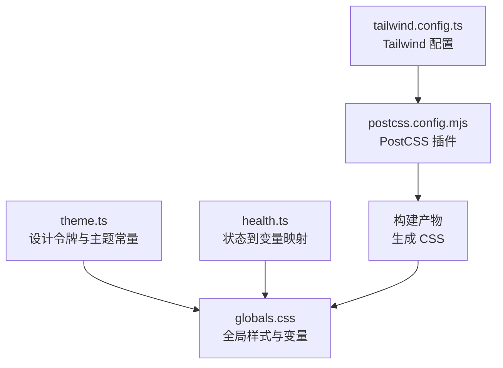
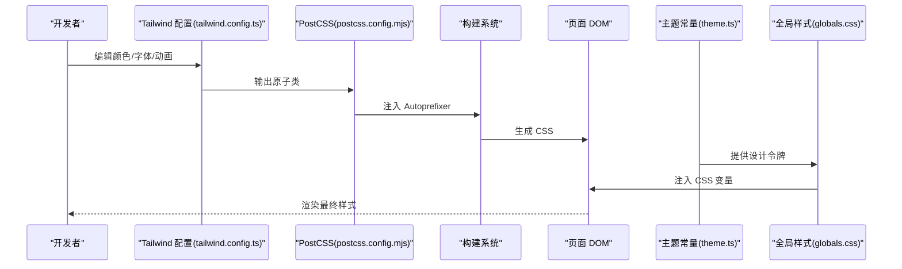
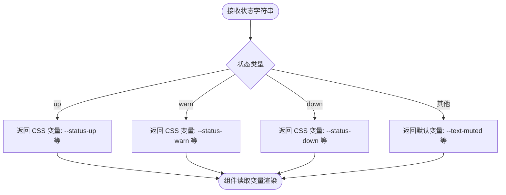
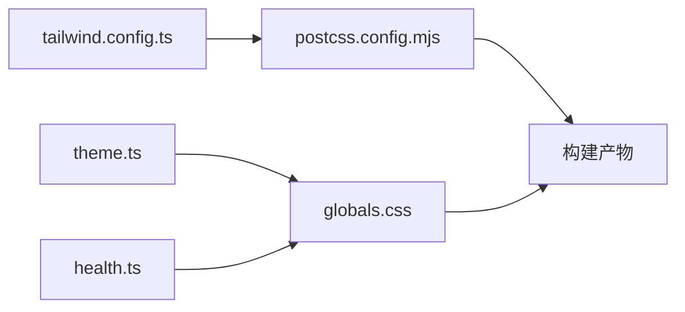

# 样式系统扩展

<cite>
**本文引用的文件**
- [tailwind.config.ts](file://m_flow-frontend/tailwind.config.ts)
- [postcss.config.mjs](file://m_flow-frontend/postcss.config.mjs)
- [package.json](file://m_flow-frontend/package.json)
- [theme.ts](file://m_flow-frontend/src/lib/utils/theme.ts)
- [globals.css](file://m_flow-frontend/src/app/globals.css)
- [health.ts](file://m_flow-frontend/src/lib/utils/health.ts)
</cite>

## 目录
1. [简介](#简介)
2. [项目结构](#项目结构)
3. [核心组件](#核心组件)
4. [架构总览](#架构总览)
5. [详细组件分析](#详细组件分析)
6. [依赖关系分析](#依赖关系分析)
7. [性能考虑](#性能考虑)
8. [故障排查指南](#故障排查指南)
9. [结论](#结论)
10. [附录](#附录)

## 简介
本指南面向希望在现有前端工程中扩展样式系统的工程师与设计师。文档围绕 Tailwind CSS 定制化配置（颜色系统、字体设置、动画与关键帧）、主题系统（深色模式、品牌色、状态色）以及 CSS-in-JS 集成（styled-components/emotion）进行系统讲解，并提供组件样式封装策略、调试技巧、性能优化与浏览器兼容性建议。为便于落地，文档同时给出可直接参考的配置文件路径与实现要点。

## 项目结构
前端工程采用 Next.js 14 + Tailwind CSS + PostCSS 架构，样式体系由以下关键文件构成：
- Tailwind 配置：定义内容扫描范围、主题扩展（颜色、字体、动画、关键帧）
- PostCSS 配置：启用 Tailwind 与 Autoprefixer 插件
- 主题常量：集中管理颜色、间距、排版等设计令牌
- 全局样式：应用基础样式与 CSS 变量桥接
- 健康状态工具：基于 CSS 变量的状态映射

图表来源
- [tailwind.config.ts:1-127](file://m_flow-frontend/tailwind.config.ts#L1-L127)
- [postcss.config.mjs:1-10](file://m_flow-frontend/postcss.config.mjs#L1-L10)
- [theme.ts:1-91](file://m_flow-frontend/src/lib/utils/theme.ts#L1-L91)
- [globals.css](file://m_flow-frontend/src/app/globals.css)
- [health.ts:331-350](file://m_flow-frontend/src/lib/utils/health.ts#L331-L350)

章节来源
- [tailwind.config.ts:1-127](file://m_flow-frontend/tailwind.config.ts#L1-L127)
- [postcss.config.mjs:1-10](file://m_flow-frontend/postcss.config.mjs#L1-L10)
- [package.json:1-65](file://m_flow-frontend/package.json#L1-L65)

## 核心组件
- Tailwind 主题扩展：颜色系统（含品牌色与状态色）、字体族、动画与关键帧
- PostCSS 流水线：Tailwind 与 Autoprefixer 自动前缀
- 设计令牌与主题常量：统一的颜色、间距、排版与交互语义
- 全局样式与 CSS 变量：为组件提供主题继承与动态变量桥接
- 健康状态映射：将运行时状态映射为 CSS 变量，实现动态样式生成

章节来源
- [tailwind.config.ts:9-127](file://m_flow-frontend/tailwind.config.ts#L9-L127)
- [theme.ts:17-91](file://m_flow-frontend/src/lib/utils/theme.ts#L17-L91)
- [globals.css](file://m_flow-frontend/src/app/globals.css)
- [health.ts:331-350](file://m_flow-frontend/src/lib/utils/health.ts#L331-L350)

## 架构总览
Tailwind 通过内容扫描与主题扩展生成原子类；PostCSS 在构建阶段注入 Autoprefixer；设计令牌与全局样式提供主题继承与变量桥接；健康状态工具将运行时状态映射为 CSS 变量，形成“配置 → 构建 → 运行时变量”的完整链路。

图表来源
- [tailwind.config.ts:1-127](file://m_flow-frontend/tailwind.config.ts#L1-L127)
- [postcss.config.mjs:1-10](file://m_flow-frontend/postcss.config.mjs#L1-L10)
- [theme.ts:17-91](file://m_flow-frontend/src/lib/utils/theme.ts#L17-L91)
- [globals.css](file://m_flow-frontend/src/app/globals.css)

## 详细组件分析

### Tailwind 主题扩展
- 内容扫描范围：限定在 pages、components、app 目录，确保按需生成原子类
- 颜色系统：
  - 品牌灰阶：自定义 xai-* 前缀的高阶灰度与品牌色、状态色
  - 调色板降饱和：对蓝色、琥珀、绿/青、紫色、红色、黄色、橙色等进行“奢华灰”风格降饱和处理
- 字体设置：sans 与 mono 字体族，适配系统字体优先策略
- 动画与关键帧：提供淡入、上滑、慢速脉冲等常用动画
- 插件：当前为空，预留扩展空间

章节来源
- [tailwind.config.ts:3-127](file://m_flow-frontend/tailwind.config.ts#L3-L127)

### PostCSS 与构建流水线
- 启用 Tailwind 与 Autoprefixer 插件，自动补全浏览器前缀
- 与 Tailwind 配置联动，确保输出兼容目标浏览器

章节来源
- [postcss.config.mjs:1-10](file://m_flow-frontend/postcss.config.mjs#L1-L10)
- [package.json:54-62](file://m_flow-frontend/package.json#L54-L62)

### 设计令牌与主题常量
- 颜色分层：背景、边框、文本、状态、交互五类语义化颜色
- 状态色：成功/警告/错误/信息的主色与背景/悬停/描边变体
- 间距与排版：集中定义在主题常量中，供组件与工具函数复用
- 用途：作为 CSS-in-JS 或原子类的输入源，保证跨组件一致性

章节来源
- [theme.ts:17-91](file://m_flow-frontend/src/lib/utils/theme.ts#L17-L91)

### 全局样式与 CSS 变量桥接
- 全局样式文件用于注入基础样式与 CSS 变量
- 可将设计令牌映射为 CSS 变量，使组件在运行时可读取变量值，实现主题继承与动态样式生成

章节来源
- [globals.css](file://m_flow-frontend/src/app/globals.css)

### 健康状态映射与动态样式
- 将运行时状态（如 up/warn/down）映射为 CSS 变量，组件通过变量读取对应文本、背景与描边
- 适用于状态指示器、告警面板等场景

图表来源
- [health.ts:331-350](file://m_flow-frontend/src/lib/utils/health.ts#L331-L350)

章节来源
- [health.ts:331-350](file://m_flow-frontend/src/lib/utils/health.ts#L331-L350)

### CSS-in-JS 集成策略（styled-components/emotion）
- 变量桥接：在全局样式中将设计令牌映射为 CSS 变量，CSS-in-JS 组件通过变量读取颜色、间距等
- 主题对象：以设计令牌为数据源，构造主题对象传入 Provider，组件内部通过主题访问颜色与排版
- 动态样式：根据 props 或运行时状态选择变量或内联样式，保持一致的视觉语言
- 样式隔离：通过命名空间与作用域控制，避免样式污染；结合原子类与 CSS-in-JS 混合使用时，建议以 CSS-in-JS 为主、原子类为辅

说明：本节为通用集成策略说明，不直接分析具体源码文件

### 组件样式封装策略
- 样式隔离：使用 CSS Modules、CSS-in-JS 或作用域选择器，避免全局污染
- 主题继承：通过 Provider 或上下文传递主题对象，组件内部统一读取设计令牌
- 动态样式生成：根据 props、状态或环境变量动态选择样式，保持一致性与灵活性
- 复用与组合：将通用样式抽象为可复用模块，支持组合与扩展

说明：本节为通用封装策略说明，不直接分析具体源码文件

## 依赖关系分析
- Tailwind 与 PostCSS：Tailwind 生成原子类，PostCSS 注入 Autoprefixer
- 设计令牌与全局样式：为主题提供统一入口，供组件与 CSS-in-JS 使用
- 健康状态工具：将运行时状态映射为 CSS 变量，与全局样式协同工作

图表来源
- [tailwind.config.ts:1-127](file://m_flow-frontend/tailwind.config.ts#L1-L127)
- [postcss.config.mjs:1-10](file://m_flow-frontend/postcss.config.mjs#L1-L10)
- [theme.ts:17-91](file://m_flow-frontend/src/lib/utils/theme.ts#L17-L91)
- [health.ts:331-350](file://m_flow-frontend/src/lib/utils/health.ts#L331-L350)
- [globals.css](file://m_flow-frontend/src/app/globals.css)

章节来源
- [tailwind.config.ts:1-127](file://m_flow-frontend/tailwind.config.ts#L1-L127)
- [postcss.config.mjs:1-10](file://m_flow-frontend/postcss.config.mjs#L1-L10)
- [theme.ts:17-91](file://m_flow-frontend/src/lib/utils/theme.ts#L17-L91)
- [health.ts:331-350](file://m_flow-frontend/src/lib/utils/health.ts#L331-L350)
- [globals.css](file://m_flow-frontend/src/app/globals.css)

## 性能考虑
- 按需生成：Tailwind 的内容扫描范围应仅覆盖实际使用的目录，避免生成冗余类
- 动画与关键帧：尽量复用内置动画，减少自定义关键帧数量
- CSS-in-JS：合理拆分样式模块，避免重复计算与内存占用；使用缓存与稳定引用
- 构建优化：利用 PostCSS 插件自动前缀，减少手动维护成本；在生产环境开启压缩与 Tree Shaking

说明：本节提供通用指导，不直接分析具体源码文件

## 故障排查指南
- Tailwind 类无效：检查内容扫描路径是否包含目标文件，确认构建命令已执行
- 颜色/字体未生效：核对 tailwind.config 中的扩展项是否正确拼写与加载
- CSS 变量未读取：确认全局样式中变量已注入，组件是否正确读取变量名
- 动画异常：检查 keyframes 与动画名称是否匹配，浏览器兼容性是否满足

章节来源
- [tailwind.config.ts:4-8](file://m_flow-frontend/tailwind.config.ts#L4-L8)
- [postcss.config.mjs:3-6](file://m_flow-frontend/postcss.config.mjs#L3-L6)
- [globals.css](file://m_flow-frontend/src/app/globals.css)
- [health.ts:331-350](file://m_flow-frontend/src/lib/utils/health.ts#L331-L350)

## 结论
通过 Tailwind 主题扩展、PostCSS 构建流水线、设计令牌与全局样式、以及健康状态映射，可以建立起一套可扩展、可维护、可动态化的样式系统。结合 CSS-in-JS 的变量桥接与主题继承，能够进一步提升组件的灵活性与一致性。建议在团队内建立设计令牌与命名规范，确保跨项目的一致体验与开发效率。

## 附录
- 扩展 Tailwind 颜色系统：在 tailwind.config.ts 的 colors.extend 中新增品牌色与状态色，确保命名规范与设计令牌一致
- 新增字体族：在 tailwind.config.ts 的 fontFamily 中添加新字体，注意系统回退顺序
- 新增动画：在 animation 与 keyframes 中定义新动画，避免过度使用复杂关键帧
- CSS-in-JS 最佳实践：以设计令牌为唯一真实来源，组件内部通过变量或主题对象读取，避免硬编码颜色与尺寸

章节来源
- [tailwind.config.ts:9-127](file://m_flow-frontend/tailwind.config.ts#L9-L127)
- [theme.ts:17-91](file://m_flow-frontend/src/lib/utils/theme.ts#L17-L91)
- [globals.css](file://m_flow-frontend/src/app/globals.css)
- [health.ts:331-350](file://m_flow-frontend/src/lib/utils/health.ts#L331-L350)