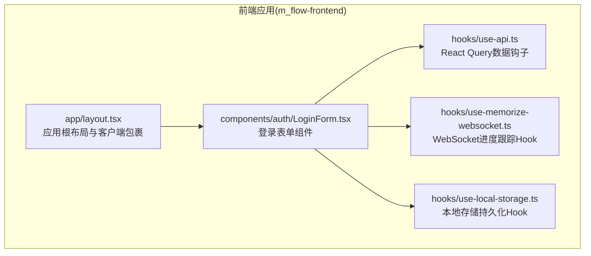
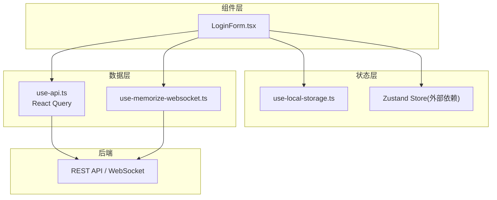
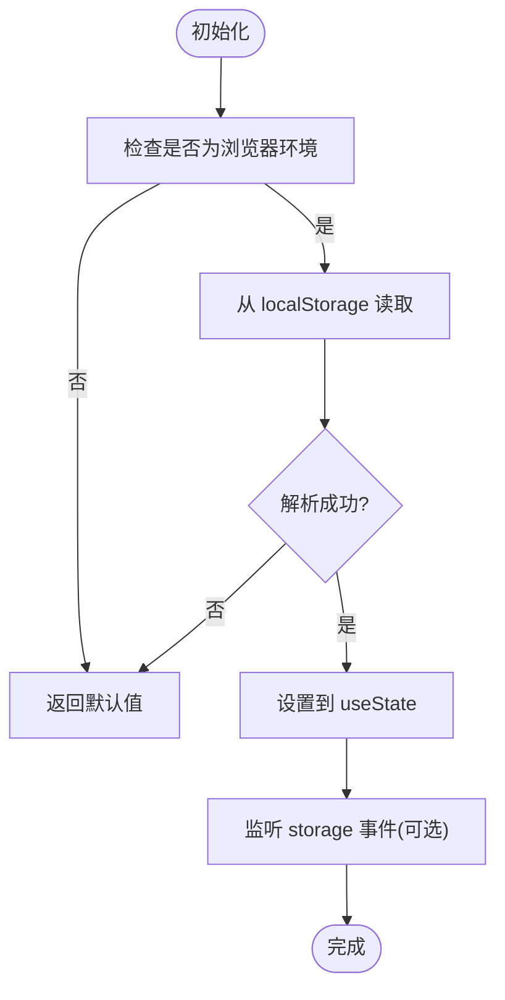
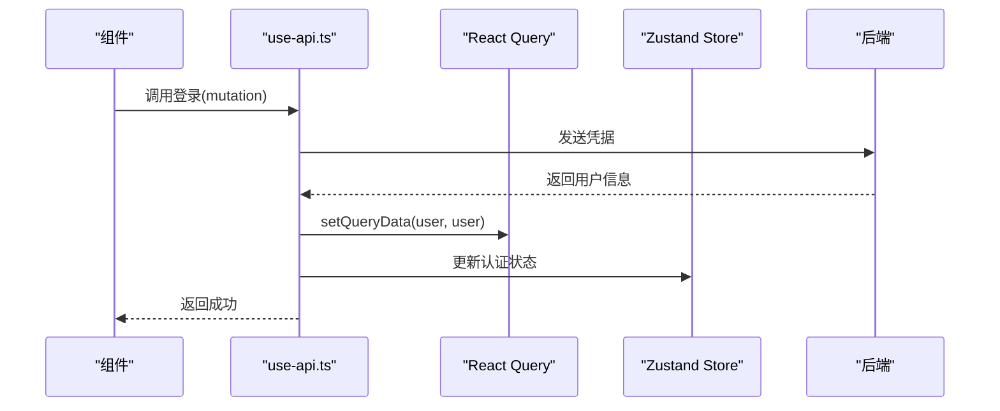
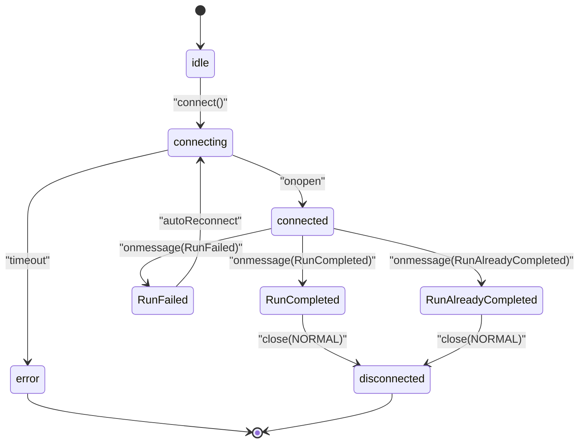
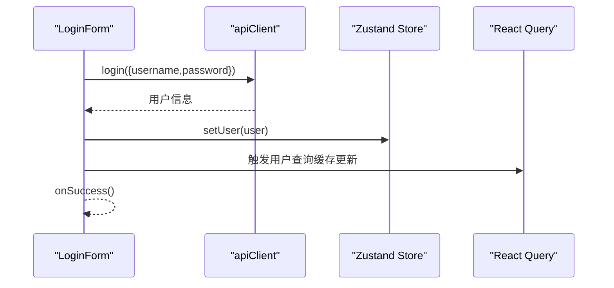
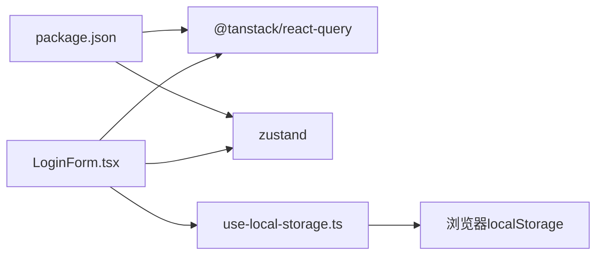

# 状态管理扩展

<cite>
**本文引用的文件**
- [package.json](file://m_flow-frontend/package.json)
- [layout.tsx](file://m_flow-frontend/src/app/layout.tsx)
- [use-local-storage.ts](file://m_flow-frontend/src/hooks/use-local-storage.ts)
- [use-api.ts](file://m_flow-frontend/src/hooks/use-api.ts)
- [use-memorize-websocket.ts](file://m_flow-frontend/src/hooks/use-memorize-websocket.ts)
- [LoginForm.tsx](file://m_flow-frontend/src/components/auth/LoginForm.tsx)
</cite>

## 目录
1. [引言](#引言)
2. [项目结构](#项目结构)
3. [核心组件](#核心组件)
4. [架构总览](#架构总览)
5. [详细组件分析](#详细组件分析)
6. [依赖关系分析](#依赖关系分析)
7. [性能考量](#性能考量)
8. [故障排查指南](#故障排查指南)
9. [结论](#结论)
10. [附录](#附录)

## 引言
本指南围绕前端状态管理扩展进行系统性梳理，结合仓库中现有的 React Hooks 实现，覆盖以下主题：
- React 内置状态模式：useState、useReducer、useContext 的适用场景与边界
- 第三方状态管理库集成：React Query（数据缓存与服务端状态）、Zustand（客户端轻量状态）
- 全局状态与局部状态设计原则、状态提升与下沉最佳实践
- 状态持久化方案：浏览器本地存储、服务器同步、离线数据处理
- 实际应用示例：用户认证状态、数据缓存、表单状态管理

在当前仓库中，前端采用 React + Next.js 技术栈，状态管理以自研 Hooks 为主，辅以 React Query 与 Zustand。本文将基于实际源码对这些能力进行深入解析，并给出可操作的实践建议。

## 项目结构
前端位于 m_flow-frontend 目录，关键状态管理相关位置如下：
- hooks：集中存放状态与副作用相关的自定义 Hook（本地存储、API 查询、WebSocket 进度跟踪）
- components：UI 组件，部分组件直接消费状态或调用 Hook
- app：应用入口布局，包含客户端包裹器，确保客户端状态在 SSR 场景下的安全使用
- package.json：声明 React Query 与 Zustand 等依赖

图表来源
- [layout.tsx:1-23](file://m_flow-frontend/src/app/layout.tsx#L1-L23)
- [use-local-storage.ts:1-358](file://m_flow-frontend/src/hooks/use-local-storage.ts#L1-L358)
- [use-api.ts:1-900](file://m_flow-frontend/src/hooks/use-api.ts#L1-L900)
- [use-memorize-websocket.ts:1-286](file://m_flow-frontend/src/hooks/use-memorize-websocket.ts#L1-L286)
- [LoginForm.tsx:1-164](file://m_flow-frontend/src/components/auth/LoginForm.tsx#L1-L164)

章节来源
- [layout.tsx:1-23](file://m_flow-frontend/src/app/layout.tsx#L1-L23)

## 核心组件
本节聚焦于仓库中已实现的状态管理相关模块，说明其职责、数据流与典型用法。

- 本地存储 Hook（useLocalStorage 系列）
  - 职责：提供类型安全、SSR 友好、跨标签页同步的本地存储能力；支持布尔、数字、字符串、数组、集合等专用变体
  - 关键点：默认序列化/反序列化、错误回调、跨标签页事件监听、前缀清理与容量统计
  - 适用场景：主题、语言、分页参数、筛选条件、表单草稿等轻量状态

- 数据查询与缓存 Hook（React Query）
  - 职责：封装后端 API，统一管理查询键、缓存失效、重试策略、并发控制
  - 关键点：查询键命名规范、启用/禁用条件、过期时间、成功回调同步 UI 状态（如认证用户）
  - 适用场景：用户信息、数据集列表、知识图谱子图、设置、提示词、活动流、搜索历史等

- WebSocket 进度跟踪 Hook（useMemorizeWebSocket）
  - 职责：订阅记忆处理流水线的实时进度，自动重连、超时处理、完成/失败状态判断
  - 关键点：连接状态机、指数退避重连、鉴权失败特殊处理、手动断开/重连
  - 适用场景：批量导入、知识图谱构建等长时间运行任务的进度反馈

- 认证与登录组件
  - 职责：表单状态管理（邮箱、密码、加载、错误），调用后端登录接口，更新全局认证状态
  - 关键点：默认账户一键登录、网络错误检测、成功回调
  - 适用场景：登录流程、会话保持、权限控制

章节来源
- [use-local-storage.ts:1-358](file://m_flow-frontend/src/hooks/use-local-storage.ts#L1-L358)
- [use-api.ts:1-900](file://m_flow-frontend/src/hooks/use-api.ts#L1-L900)
- [use-memorize-websocket.ts:1-286](file://m_flow-frontend/src/hooks/use-memorize-websocket.ts#L1-L286)
- [LoginForm.tsx:1-164](file://m_flow-frontend/src/components/auth/LoginForm.tsx#L1-L164)

## 架构总览
下图展示前端状态管理的整体交互：组件通过自定义 Hook 获取/更新状态，本地存储 Hook 提供持久化，React Query 负责服务端数据缓存与一致性，Zustand 用于客户端轻量全局状态，WebSocket Hook 提供长连接进度反馈。

图表来源
- [LoginForm.tsx:1-164](file://m_flow-frontend/src/components/auth/LoginForm.tsx#L1-L164)
- [use-local-storage.ts:1-358](file://m_flow-frontend/src/hooks/use-local-storage.ts#L1-L358)
- [use-api.ts:1-900](file://m_flow-frontend/src/hooks/use-api.ts#L1-L900)
- [use-memorize-websocket.ts:1-286](file://m_flow-frontend/src/hooks/use-memorize-websocket.ts#L1-L286)
- [package.json:16-42](file://m_flow-frontend/package.json#L16-L42)

## 详细组件分析

### 本地存储 Hook（useLocalStorage 系列）
- 设计要点
  - 类型安全：泛型参数保证读写值的类型一致
  - SSR 支持：仅在浏览器环境执行本地存储操作
  - 跨标签页同步：监听 storage 事件，实现多标签页状态同步
  - 默认值与序列化：可自定义序列化/反序列化函数，支持布尔/数字/字符串/数组/集合等专用 Hook
  - 错误处理：提供 onError 回调，避免异常中断 UI 渲染
- 复杂度与性能
  - 读写为 O(1)，跨标签页监听为事件驱动，无额外轮询开销
  - 建议：避免存储大对象，优先拆分键空间或压缩数据
- 最佳实践
  - 使用前缀区分模块键空间，便于清理与迁移
  - 对频繁变更的键设置合理的 staleTime 或手动失效
  - 对敏感信息谨慎使用本地存储，必要时加密

图表来源
- [use-local-storage.ts:54-190](file://m_flow-frontend/src/hooks/use-local-storage.ts#L54-L190)

章节来源
- [use-local-storage.ts:1-358](file://m_flow-frontend/src/hooks/use-local-storage.ts#L1-L358)

### 数据查询与缓存 Hook（React Query）
- 设计要点
  - 查询键命名：采用层级化键名，支持带参数键与多数据集隔离
  - 缓存策略：staleTime 控制新鲜度，refetchInterval 定时刷新，retry 指数退避
  - 成功回调：在 mutation 成功后主动失效/更新相关查询，保证 UI 与服务端一致
  - 条件启用：根据用户角色或参数动态启用/禁用查询
- 典型场景
  - 用户认证：登录成功后同时更新 React Query 与 Zustand 中的用户状态
  - 图谱数据：按数据集 ID 隔离缓存，避免跨数据集污染
  - 活动流：非关键功能降级处理，错误时返回空数组，避免阻塞主界面
- 性能优化
  - 合理设置 staleTime 与 cacheTime，减少不必要的请求
  - 使用 invalidateQueries 批量失效，避免细粒度过多导致的抖动

图表来源
- [use-api.ts:178-220](file://m_flow-frontend/src/hooks/use-api.ts#L178-L220)

章节来源
- [use-api.ts:1-900](file://m_flow-frontend/src/hooks/use-api.ts#L1-L900)

### WebSocket 进度跟踪 Hook（useMemorizeWebSocket）
- 设计要点
  - 连接状态机：idle/connecting/connected/disconnected/error/auth_failed
  - 自动重连：指数退避，最大重连次数限制
  - 超时处理：连接超时自动关闭并标记错误
  - 结束条件：完成或失败后自动停止重连
- 典型场景
  - 记忆处理流水线进度监控，完成后自动断开
  - 批量导入、知识图谱构建等异步任务的实时反馈
- 最佳实践
  - 在组件卸载时显式调用 disconnect，防止内存泄漏
  - 对鉴权失败进行明确提示并引导重新登录

图表来源
- [use-memorize-websocket.ts:72-247](file://m_flow-frontend/src/hooks/use-memorize-websocket.ts#L72-L247)

章节来源
- [use-memorize-websocket.ts:1-286](file://m_flow-frontend/src/hooks/use-memorize-websocket.ts#L1-L286)

### 登录表单组件（LoginForm）
- 设计要点
  - 表单状态：邮箱、密码、加载、错误
  - 默认账户一键登录：在配置允许时提供快捷入口
  - 错误分类：网络错误与业务错误分别提示
  - 成功回调：登录成功后更新全局认证状态
- 与状态管理的关系
  - 直接使用 useState 管理表单本地状态
  - 调用后端接口与全局状态更新由其他 Hook 协作完成

图表来源
- [LoginForm.tsx:20-42](file://m_flow-frontend/src/components/auth/LoginForm.tsx#L20-L42)
- [use-api.ts:178-189](file://m_flow-frontend/src/hooks/use-api.ts#L178-L189)

章节来源
- [LoginForm.tsx:1-164](file://m_flow-frontend/src/components/auth/LoginForm.tsx#L1-L164)

## 依赖关系分析
- React Query
  - 作用：统一管理服务端数据缓存、失效与重试，提供查询键命名规范
  - 依赖：@tanstack/react-query
- Zustand
  - 作用：轻量全局状态管理（如认证用户），与 React Query 并行协作
  - 依赖：zustand
- 浏览器存储
  - 作用：localStorage 持久化，提供类型安全与跨标签页同步
  - 依赖：原生 localStorage

图表来源
- [package.json:16-42](file://m_flow-frontend/package.json#L16-L42)
- [use-local-storage.ts:1-358](file://m_flow-frontend/src/hooks/use-local-storage.ts#L1-L358)

章节来源
- [package.json:1-65](file://m_flow-frontend/package.json#L1-L65)

## 性能考量
- 本地存储
  - 避免存储大对象，优先拆分键空间；定期清理过期键；监控剩余容量
- React Query
  - 合理设置 staleTime 与 cacheTime，避免过度请求；对高频更新的数据使用较短 staleTime
  - 使用查询键参数化，避免缓存污染；在 mutation 成功后及时失效相关查询
- WebSocket
  - 设置合理的连接超时与最大重连次数；在组件卸载时清理资源；对鉴权失败快速终止重连
- 组件渲染
  - 将稳定值放入 ref，减少不必要的重渲染；对高频状态使用局部状态，避免全局风暴

## 故障排查指南
- 本地存储
  - 症状：读取失败或抛错
  - 排查：确认运行环境为浏览器；检查序列化/反序列化函数；查看 onError 回调日志
- React Query
  - 症状：数据不更新或显示陈旧
  - 排查：确认查询键命名与参数一致；检查 staleTime 与 refetchInterval；在 mutation 成功后调用 invalidateQueries
- WebSocket
  - 症状：连接超时、反复重连、鉴权失败
  - 排查：检查连接 URL 与鉴权头；确认服务端关闭码；限制最大重连次数；在组件卸载时调用 disconnect
- 登录
  - 症状：登录失败或网络错误
  - 排查：确认后端地址可达；检查默认账户配置；区分网络错误与业务错误并提示

章节来源
- [use-local-storage.ts:72-98](file://m_flow-frontend/src/hooks/use-local-storage.ts#L72-L98)
- [use-api.ts:146-163](file://m_flow-frontend/src/hooks/use-api.ts#L146-L163)
- [use-memorize-websocket.ts:141-212](file://m_flow-frontend/src/hooks/use-memorize-websocket.ts#L141-L212)
- [LoginForm.tsx:32-64](file://m_flow-frontend/src/components/auth/LoginForm.tsx#L32-L64)

## 结论
本仓库前端状态管理以自定义 Hook 为核心，结合 React Query 与 Zustand，实现了从本地持久化、服务端数据缓存到长连接进度反馈的完整链路。遵循“就近原则”划分局部与全局状态，配合查询键命名规范与缓存策略，可在保证性能的同时提升开发体验。后续可进一步引入 useReducer 管理复杂表单状态机，或在需要强一致性的场景下完善服务端状态同步机制。

## 附录
- 设计原则与最佳实践
  - 局部状态优先：组件内部简单状态使用 useState
  - 局部状态升级：状态逻辑复杂或跨组件共享时考虑 useReducer
  - 全局状态最小化：仅对跨页面、跨组件共享且频繁使用的状态使用 Zustand
  - 服务端状态：统一通过 React Query 管理，避免重复请求与状态漂移
  - 状态持久化：本地存储用于轻量配置与草稿；重要数据以服务端为准
  - 状态提升与下沉：尽量下沉共享状态，减少上提带来的渲染风暴
- 实战示例思路
  - 用户认证：登录表单使用 useState，登录成功后通过 React Query 与 Zustand 同步用户状态
  - 数据缓存：列表/详情页使用查询键隔离缓存，支持刷新与失效
  - 表单状态：复杂表单可用 useReducer 管理字段校验与提交流程
  - 离线处理：本地存储草稿，联网后通过 React Query 同步至服务端