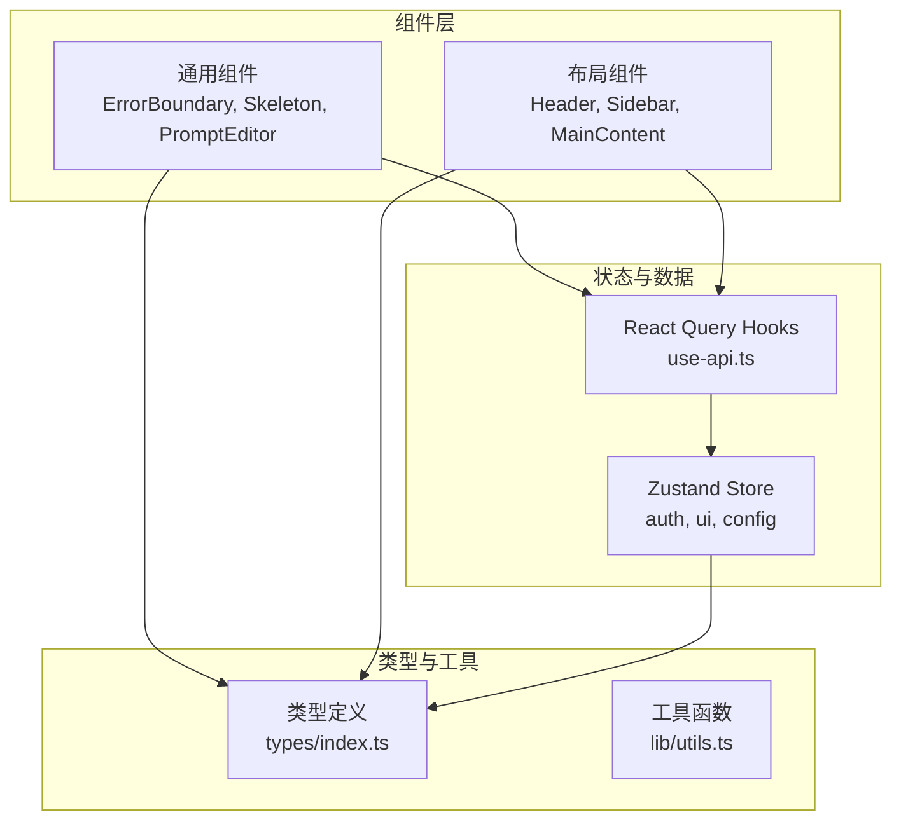
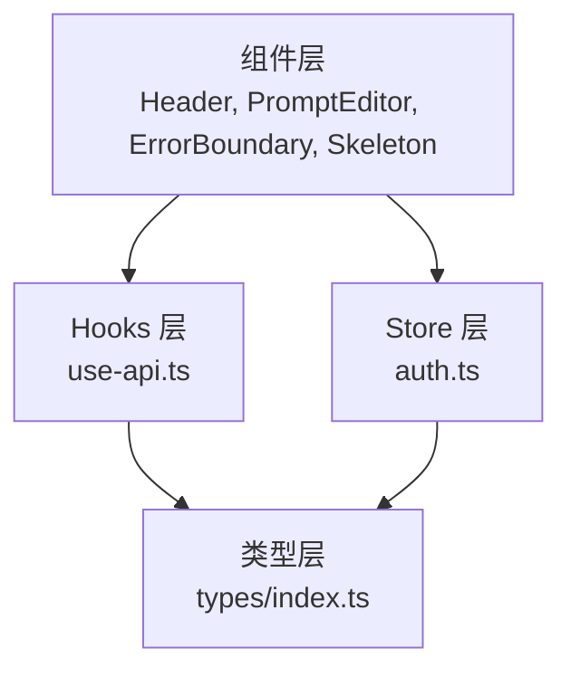
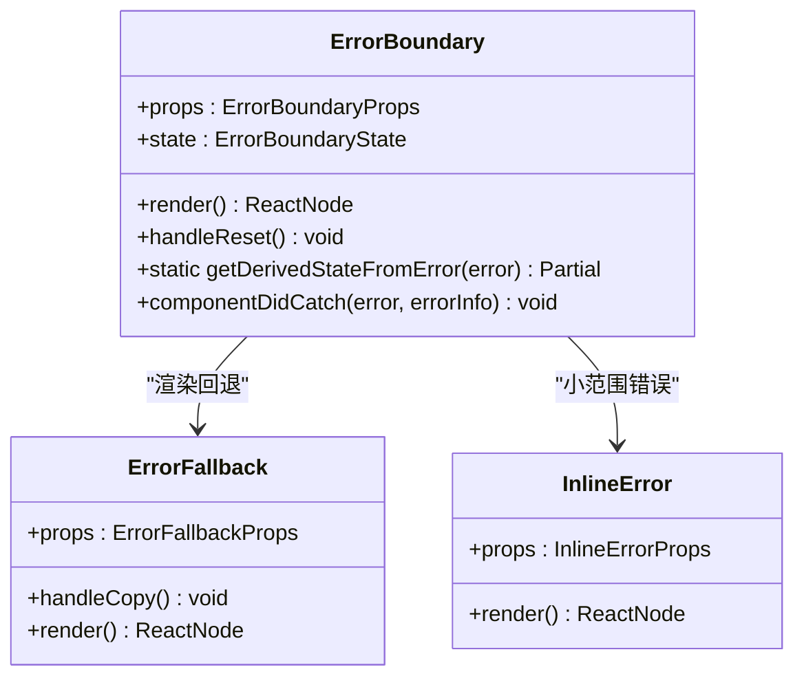
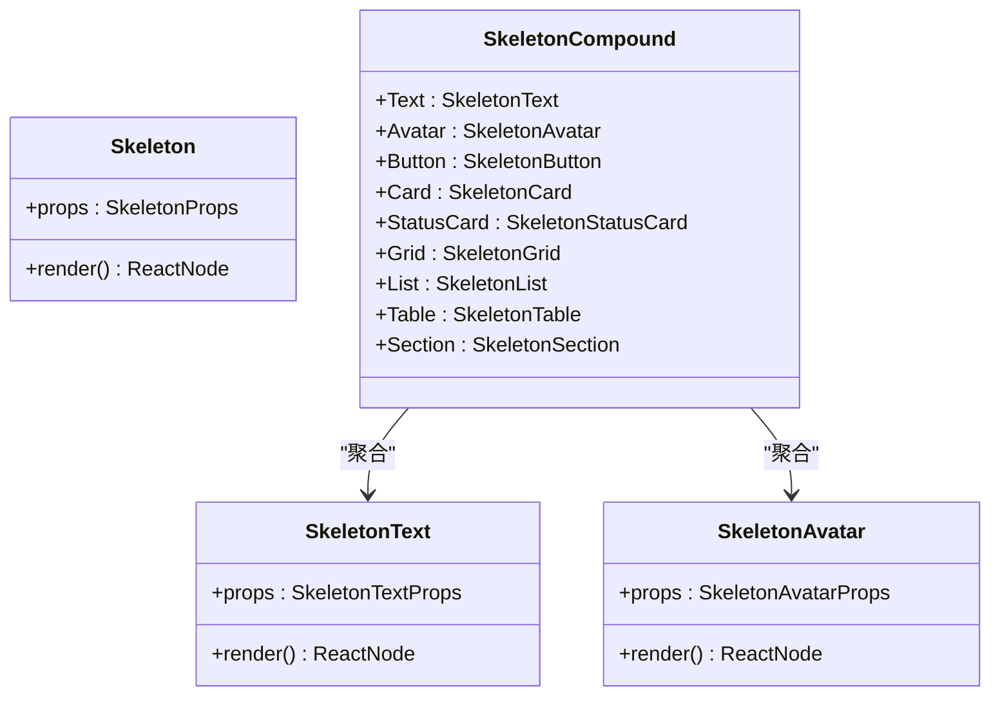
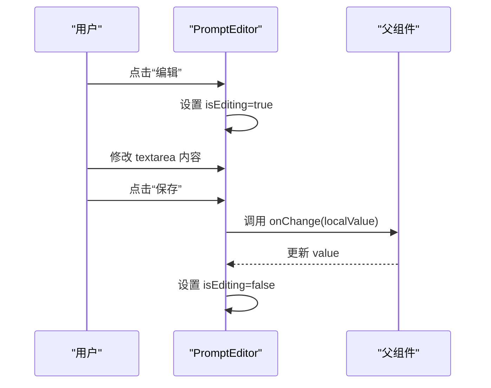
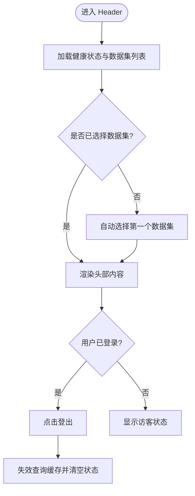
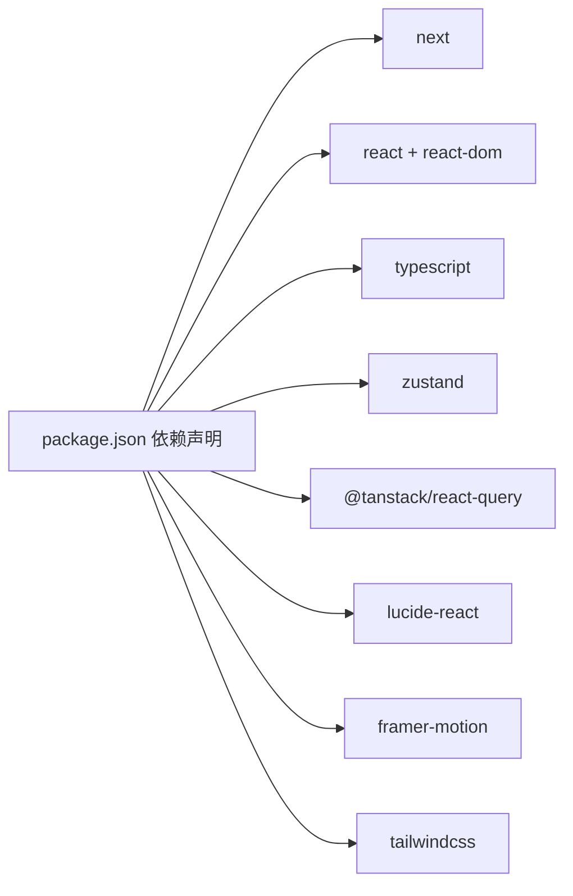

# 自定义组件开发

<cite>
**本文引用的文件**
- [m_flow-frontend/package.json](file://m_flow-frontend/package.json)
- [m_flow-frontend/src/components/common/index.ts](file://m_flow-frontend/src/components/common/index.ts)
- [m_flow-frontend/src/components/common/ErrorBoundary.tsx](file://m_flow-frontend/src/components/common/ErrorBoundary.tsx)
- [m_flow-frontend/src/components/common/Skeleton.tsx](file://m_flow-frontend/src/components/common/Skeleton.tsx)
- [m_flow-frontend/src/components/common/PromptEditor.tsx](file://m_flow-frontend/src/components/common/PromptEditor.tsx)
- [m_flow-frontend/src/components/layout/Header.tsx](file://m_flow-frontend/src/components/layout/Header.tsx)
- [m_flow-frontend/src/hooks/use-api.ts](file://m_flow-frontend/src/hooks/use-api.ts)
- [m_flow-frontend/src/lib/store/auth.ts](file://m_flow-frontend/src/lib/store/auth.ts)
- [m_flow-frontend/src/lib/store/index.ts](file://m_flow-frontend/src/lib/store/index.ts)
- [m_flow-frontend/src/types/index.ts](file://m_flow-frontend/src/types/index.ts)
- [m_flow-frontend/src/test/example.test.tsx](file://m_flow-frontend/src/test/example.test.tsx)
</cite>

## 目录
1. [简介](#简介)
2. [项目结构](#项目结构)
3. [核心组件](#核心组件)
4. [架构总览](#架构总览)
5. [详细组件分析](#详细组件分析)
6. [依赖关系分析](#依赖关系分析)
7. [性能考量](#性能考量)
8. [故障排查指南](#故障排查指南)
9. [结论](#结论)
10. [附录](#附录)

## 简介
本指南面向在 Next.js 中开发可复用 React 组件的工程师，结合仓库中的前端工程实践，系统讲解组件设计原则、Props 接口与 TypeScript 类型约束、生命周期与状态管理、事件处理机制、组件间通信模式、测试策略以及可访问性与性能优化。文档以“可直接落地”的方式组织内容，既适合初学者快速上手，也便于有经验的开发者进行深度参考。

## 项目结构
前端位于 m_flow-frontend 目录，采用按功能域分层的组织方式：
- components：通用与页面级组件，按领域拆分（common、layout、ui 等）
- hooks：基于 TanStack React Query 的数据获取与状态逻辑封装
- lib：工具函数、全局状态（Zustand）、API 客户端与配置
- types：统一的 TypeScript 类型定义
- test：单元测试与端到端测试配置与示例

**图示来源**
- [m_flow-frontend/src/components/common/index.ts:1-105](file://m_flow-frontend/src/components/common/index.ts#L1-L105)
- [m_flow-frontend/src/hooks/use-api.ts:1-900](file://m_flow-frontend/src/hooks/use-api.ts#L1-L900)
- [m_flow-frontend/src/lib/store/auth.ts:1-32](file://m_flow-frontend/src/lib/store/auth.ts#L1-L32)
- [m_flow-frontend/src/types/index.ts:1-1281](file://m_flow-frontend/src/types/index.ts#L1-L1281)

**章节来源**
- [m_flow-frontend/package.json:1-65](file://m_flow-frontend/package.json#L1-L65)

## 核心组件
本节聚焦于三个关键组件：错误边界、骨架屏、提示词编辑器，它们分别体现了错误处理、加载态与交互编辑的设计要点。

- 错误边界（ErrorBoundary）
  - 职责：捕获子树 JavaScript 错误，提供回退 UI、复制错误信息、支持重试与细节展开
  - Props 接口：children、fallback、onError、showDetails、componentName、className
  - 状态：hasError、error、errorInfo
  - HOC 包装：withErrorBoundary 提供便捷的包裹能力
  - 可访问性：通过 role="alert"、aria-* 属性提升可读性
  - 设计要点：默认在开发环境展示细节；生产环境仅展示简化信息

- 骨架屏（Skeleton）
  - 职责：为复杂布局提供占位加载态，改善感知性能
  - 变体：基础 Skeleton、文本 SkeletonText、头像 SkeletonAvatar、按钮 SkeletonButton、卡片 SkeletonCard、网格 SkeletonGrid、列表 SkeletonList、表格 SkeletonTable、区域 SkeletonSection
  - 复合组件：SkeletonCompound 将各变体聚合导出，便于按需使用
  - 可访问性：统一 role="status" 与 aria-label

- 提示词编辑器（PromptEditor）
  - 职责：支持标题、描述、默认值与当前值的对比，可折叠编辑，支持重置为默认
  - Props 接口：title、description、value、defaultValue、onChange、placeholder、className、collapsible、defaultExpanded
  - 状态：展开/收起、编辑态、本地值、重置确认
  - 交互：保存、取消、重置、修改标记

**章节来源**
- [m_flow-frontend/src/components/common/ErrorBoundary.tsx:1-344](file://m_flow-frontend/src/components/common/ErrorBoundary.tsx#L1-L344)
- [m_flow-frontend/src/components/common/Skeleton.tsx:1-503](file://m_flow-frontend/src/components/common/Skeleton.tsx#L1-L503)
- [m_flow-frontend/src/components/common/PromptEditor.tsx:1-254](file://m_flow-frontend/src/components/common/PromptEditor.tsx#L1-L254)

## 架构总览
前端整体采用“组件 + Hooks + Store + 类型”的分层架构：
- 组件层：负责 UI 呈现与用户交互
- Hooks 层：封装数据获取、缓存、错误与重试、乐观更新
- Store 层：轻量全局状态（Zustand），与 Hooks 缓存互补
- 类型层：统一的数据契约与接口定义，贯穿全链路

**图示来源**
- [m_flow-frontend/src/components/layout/Header.tsx:1-207](file://m_flow-frontend/src/components/layout/Header.tsx#L1-L207)
- [m_flow-frontend/src/hooks/use-api.ts:1-900](file://m_flow-frontend/src/hooks/use-api.ts#L1-L900)
- [m_flow-frontend/src/lib/store/auth.ts:1-32](file://m_flow-frontend/src/lib/store/auth.ts#L1-L32)
- [m_flow-frontend/src/types/index.ts:1-1281](file://m_flow-frontend/src/types/index.ts#L1-L1281)

## 详细组件分析

### 错误边界组件（ErrorBoundary）
- 设计原则
  - 单一职责：只处理错误捕获与回退渲染
  - 可插拔：支持自定义 fallback 与错误回调
  - 开发友好：在开发环境展示详细堆栈
- 生命周期与状态
  - getDerivedStateFromError：静态方法用于设置 hasError
  - componentDidCatch：记录错误并调用 onError 回调
  - handleReset：重置内部状态，恢复子树渲染
- 事件处理
  - onReset：触发重置
  - 复制错误：将错误信息复制到剪贴板
  - 显示/隐藏详情：通过受控开关切换
- 可访问性
  - 使用 role="alert"、aria-label 提升屏幕阅读器体验
- 性能
  - 仅在异常时渲染回退 UI，避免额外开销

**图示来源**
- [m_flow-frontend/src/components/common/ErrorBoundary.tsx:241-307](file://m_flow-frontend/src/components/common/ErrorBoundary.tsx#L241-L307)

**章节来源**
- [m_flow-frontend/src/components/common/ErrorBoundary.tsx:1-344](file://m_flow-frontend/src/components/common/ErrorBoundary.tsx#L1-L344)

### 骨架屏组件（Skeleton）
- 设计原则
  - 一致性：统一的动画与颜色体系
  - 可组合：复合组件 SkeletonCompound 汇集所有变体
  - 可扩展：支持宽度、高度、圆角、动画开关
- 数据流
  - 输入：Props（width、height、rounded、animate、className）
  - 输出：DOM 结构与样式类名
- 可访问性
  - role="status" 与 aria-label 标识加载状态

**图示来源**
- [m_flow-frontend/src/components/common/Skeleton.tsx:41-73](file://m_flow-frontend/src/components/common/Skeleton.tsx#L41-L73)
- [m_flow-frontend/src/components/common/Skeleton.tsx:94-120](file://milli-frontend/src/components/common/Skeleton.tsx#L94-L120)
- [m_flow-frontend/src/components/common/Skeleton.tsx:137-157](file://m_flow-frontend/src/components/common/Skeleton.tsx#L137-L157)
- [m_flow-frontend/src/components/common/Skeleton.tsx:471-481](file://m_flow-frontend/src/components/common/Skeleton.tsx#L471-L481)

**章节来源**
- [m_flow-frontend/src/components/common/Skeleton.tsx:1-503](file://m_flow-frontend/src/components/common/Skeleton.tsx#L1-L503)

### 提示词编辑器（PromptEditor）
- 设计原则
  - 可折叠：支持展开/收起，节省空间
  - 可编辑：支持本地编辑与保存/取消
  - 可重置：一键恢复默认值，带二次确认
  - 可读性：显示修改标记与预览
- 状态与事件
  - 展开/收起：collapsible 与 defaultExpanded 控制
  - 编辑态：isEditing 切换编辑/只读视图
  - 本地值：localValue 与外部 value 同步
  - 保存/取消/重置：onChange 回调驱动外部更新
- 可访问性
  - 按钮具备 title 与键盘可达性
  - 文本域具备占位符与自动调整行数

**图示来源**
- [m_flow-frontend/src/components/common/PromptEditor.tsx:27-71](file://m_flow-frontend/src/components/common/PromptEditor.tsx#L27-L71)
- [m_flow-frontend/src/components/common/PromptEditor.tsx:49-57](file://m_flow-frontend/src/components/common/PromptEditor.tsx#L49-L57)
- [m_flow-frontend/src/components/common/PromptEditor.tsx:59-69](file://m_flow-frontend/src/components/common/PromptEditor.tsx#L59-L69)

**章节来源**
- [m_flow-frontend/src/components/common/PromptEditor.tsx:1-254](file://m_flow-frontend/src/components/common/PromptEditor.tsx#L1-L254)

### 布局组件（Header）
- 设计原则
  - 下拉菜单：Dropdown 封装通用交互（点击外部关闭、选项高亮）
  - 全局上下文：从 Zustand Store 读取与写入 dataset 上下文
  - 数据同步：通过 React Query Hooks 获取健康状态与数据集列表
- 事件处理
  - 选择数据集：onChange 触发 setDatasetContext
  - 登出：调用 useLogout.mutation
  - 自动选择：首次加载时自动选择第一个数据集
- 可访问性
  - 按钮具备 title 与无障碍标签
  - 下拉菜单具备键盘导航与焦点管理

**图示来源**
- [m_flow-frontend/src/components/layout/Header.tsx:102-118](file://m_flow-frontend/src/components/layout/Header.tsx#L102-L118)
- [m_flow-frontend/src/components/layout/Header.tsx:136-149](file://m_flow-frontend/src/components/layout/Header.tsx#L136-L149)
- [m_flow-frontend/src/hooks/use-api.ts:203-220](file://m_flow-frontend/src/hooks/use-api.ts#L203-L220)

**章节来源**
- [m_flow-frontend/src/components/layout/Header.tsx:1-207](file://m_flow-frontend/src/components/layout/Header.tsx#L1-L207)

## 依赖关系分析
- 技术栈
  - Next.js 14、React 18、TypeScript
  - 状态：Zustand（轻量全局状态）
  - 数据流：TanStack React Query（查询、缓存、乐观更新）
  - UI 图标：Lucide React
  - 动画：Framer Motion
  - 样式：Tailwind CSS
- 测试
  - 单元测试：Vitest + @testing-library/react
  - 端到端：Playwright
- 关键依赖路径
  - 组件依赖 Hooks 与 Store
  - Hooks 依赖类型定义与 API 客户端
  - Store 依赖类型定义

**图示来源**
- [m_flow-frontend/package.json:16-63](file://m_flow-frontend/package.json#L16-L63)

**章节来源**
- [m_flow-frontend/package.json:1-65](file://m_flow-frontend/package.json#L1-L65)

## 性能考量
- 加载态优化
  - 使用 Skeleton 系列组件替代闪烁，减少感知延迟
  - 合理设置 staleTime 与 refetchInterval，平衡实时性与网络开销
- 状态与缓存
  - React Query 查询键隔离多数据集场景，避免缓存污染
  - Mutation 成功后主动失效相关查询，确保 UI 与服务端一致
- 事件与渲染
  - 下拉菜单使用 useRef 与事件监听，避免不必要的重渲染
  - Header 在无数据集时自动选择，减少用户操作成本
- 可访问性
  - 错误边界与骨架屏均提供 role 与 aria-* 属性，提升可读性

[本节为通用指导，不直接分析具体文件]

## 故障排查指南
- 错误边界
  - 现象：组件崩溃导致整页白屏
  - 排查：检查 ErrorBoundary 是否包裹目标组件；确认 showDetails 与 onError 回调
  - 处理：使用默认回退或自定义 fallback；复制错误信息辅助定位
- 骨架屏
  - 现象：加载态不出现或样式异常
  - 排查：确认 SkeletonCompound 导出与使用方式；检查 className 与动画开关
  - 处理：按需引入变体；确保 Tailwind 样式生效
- 提示词编辑器
  - 现象：无法保存或重置无效
  - 排查：确认 value 与 defaultValue 的对比逻辑；检查 onChange 回调
  - 处理：确保外部状态与本地状态同步；合理设置 collapsible 与 defaultExpanded
- 布局与状态
  - 现象：数据集选择无效或登出后状态未更新
  - 排查：确认 useDatasets 与 useLogout 的查询键与缓存失效逻辑
  - 处理：在 mutation 成功后调用 queryClient.invalidateQueries；Zustand 状态同步

**章节来源**
- [m_flow-frontend/src/components/common/ErrorBoundary.tsx:258-267](file://m_flow-frontend/src/components/common/ErrorBoundary.tsx#L258-L267)
- [m_flow-frontend/src/components/common/Skeleton.tsx:471-481](file://m_flow-frontend/src/components/common/Skeleton.tsx#L471-L481)
- [m_flow-frontend/src/components/common/PromptEditor.tsx:43-47](file://m_flow-frontend/src/components/common/PromptEditor.tsx#L43-L47)
- [m_flow-frontend/src/components/layout/Header.tsx:109-118](file://m_flow-frontend/src/components/layout/Header.tsx#L109-L118)
- [m_flow-frontend/src/hooks/use-api.ts:180-189](file://m_flow-frontend/src/hooks/use-api.ts#L180-L189)

## 结论
本指南基于真实仓库提炼了 Next.js 自定义组件开发的关键实践：以类型驱动的 Props 设计、以 Hooks 为中心的数据与状态管理、以 Store 为补充的全局状态、以可访问性与性能为导向的 UI 实现。遵循这些原则，可在保证质量的同时显著提升开发效率与可维护性。

[本节为总结性内容，不直接分析具体文件]

## 附录

### 组件间通信模式
- 父子通信
  - 父组件通过 props 传递数据与回调，子组件通过回调触发变更
  - 示例：Header 的 dataset 选择通过 onChange 通知父级上下文更新
- 兄弟通信
  - 通过共同父组件的 props 或共享状态（Zustand）协调
  - 示例：Header 与侧边栏通过 UI Store 协同控制布局
- 跨层级通信
  - 通过全局状态（Zustand）与 React Query 缓存实现跨层级同步
  - 示例：登录成功后，Query 缓存与 Zustand 同步更新

**章节来源**
- [m_flow-frontend/src/components/layout/Header.tsx:136-149](file://m_flow-frontend/src/components/layout/Header.tsx#L136-L149)
- [m_flow-frontend/src/lib/store/auth.ts:15-31](file://m_flow-frontend/src/lib/store/auth.ts#L15-L31)
- [m_flow-frontend/src/hooks/use-api.ts:180-189](file://m_flow-frontend/src/hooks/use-api.ts#L180-L189)

### 组件测试策略
- 单元测试
  - 使用 Vitest + @testing-library/react 进行组件渲染与交互验证
  - 示例：基础渲染断言与交互行为测试
- 集成测试
  - 通过 React Query Mock 或 MSW 模拟 API 行为，验证数据流与状态更新
- 端到端测试
  - 使用 Playwright 进行真实浏览器场景验证，覆盖关键用户流程

**章节来源**
- [m_flow-frontend/src/test/example.test.tsx:1-15](file://m_flow-frontend/src/test/example.test.tsx#L1-L15)
- [m_flow-frontend/package.json:10-14](file://m_flow-frontend/package.json#L10-L14)

### 可访问性设计
- 错误边界：role="alert"、可复制错误信息
- 骨架屏：role="status"、aria-label
- 下拉菜单：键盘导航、焦点管理、点击外部关闭
- 文本域与按钮：具备 title 与无障碍标签

**章节来源**
- [m_flow-frontend/src/components/common/ErrorBoundary.tsx:98-198](file://m_flow-frontend/src/components/common/ErrorBoundary.tsx#L98-L198)
- [m_flow-frontend/src/components/common/Skeleton.tsx:57-72](file://m_flow-frontend/src/components/common/Skeleton.tsx#L57-L72)
- [m_flow-frontend/src/components/layout/Header.tsx:32-96](file://m_flow-frontend/src/components/layout/Header.tsx#L32-L96)

### TypeScript 类型约束与 Props 接口
- 类型定义集中于 types/index.ts，涵盖搜索、活动、知识图谱、配置、请求响应等
- 组件 Props 严格对接类型定义，确保编译期安全与 IDE 智能提示
- Hooks 返回值与参数同样强类型化，降低运行时风险

**章节来源**
- [m_flow-frontend/src/types/index.ts:1-1281](file://m_flow-frontend/src/types/index.ts#L1-L1281)