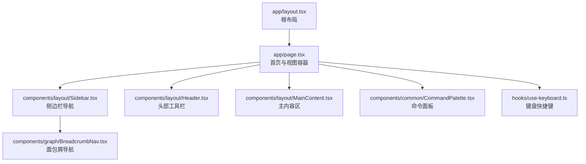
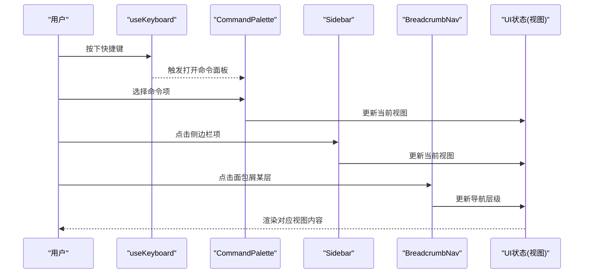
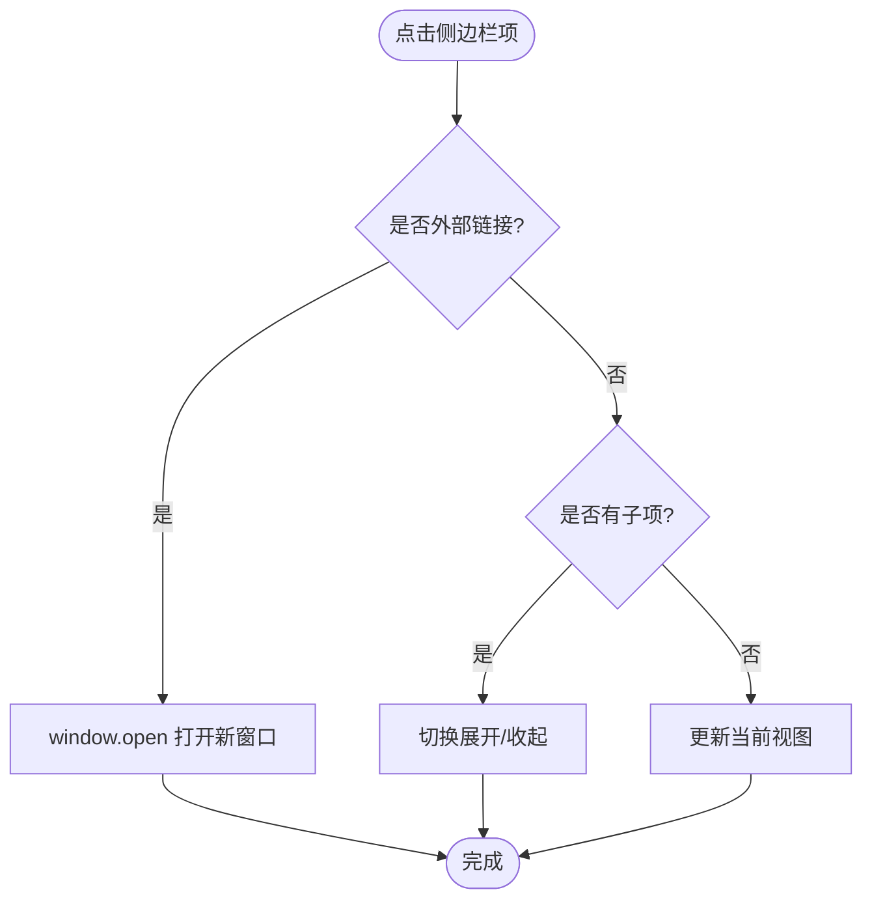
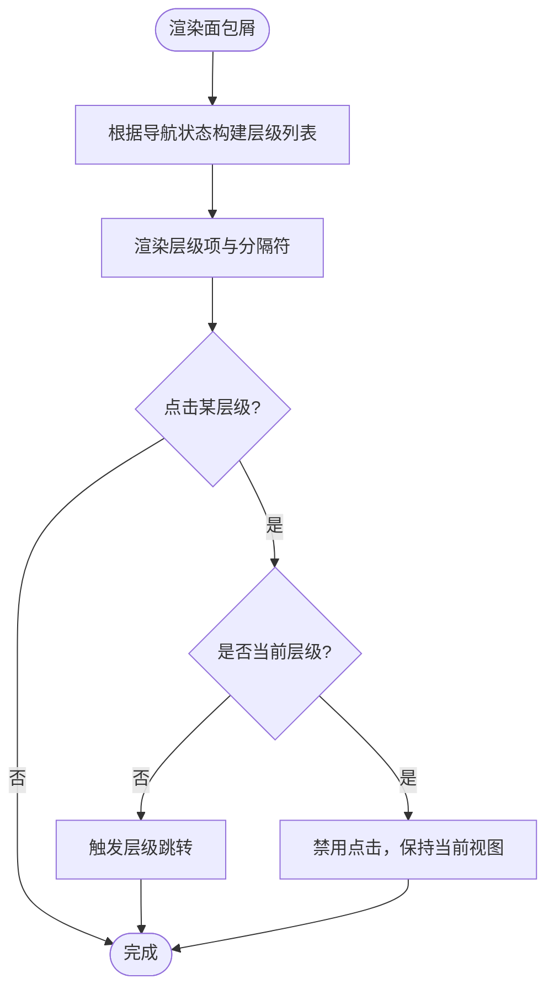
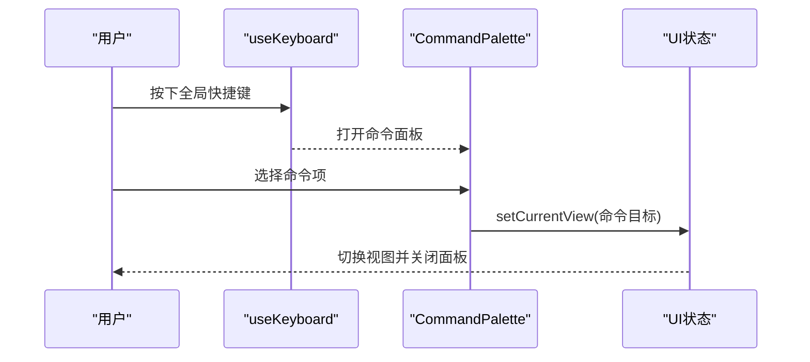
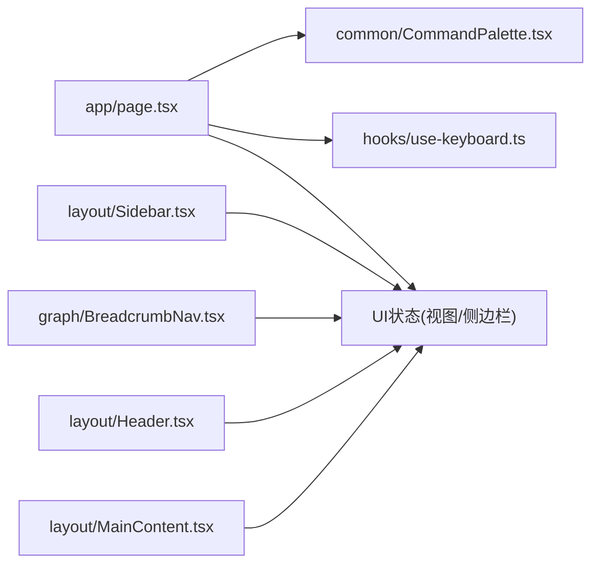

# 路由导航扩展

<cite>
**本文引用的文件**
- [layout.tsx](file://m_flow-frontend/src/app/layout.tsx)
- [page.tsx](file://m_flow-frontend/src/app/page.tsx)
- [Sidebar.tsx](file://m_flow-frontend/src/components/layout/Sidebar.tsx)
- [BreadcrumbNav.tsx](file://m_flow-frontend/src/components/graph/BreadcrumbNav.tsx)
- [Header.tsx](file://m_flow-frontend/src/components/layout/Header.tsx)
- [MainContent.tsx](file://m_flow-frontend/src/components/layout/MainContent.tsx)
- [CommandPalette.tsx](file://m_flow-frontend/src/components/common/CommandPalette.tsx)
- [useKeyboard.ts](file://m_flow-frontend/src/hooks/use-keyboard.ts)
- [store.test.ts](file://m_flow-frontend/src/lib/__tests__/store.test.ts)
</cite>

## 目录
1. [引言](#引言)
2. [项目结构](#项目结构)
3. [核心组件](#核心组件)
4. [架构总览](#架构总览)
5. [详细组件分析](#详细组件分析)
6. [依赖关系分析](#依赖关系分析)
7. [性能考虑](#性能考虑)
8. [故障排查指南](#故障排查指南)
9. [结论](#结论)
10. [附录](#附录)

## 引言
本指南围绕 Next.js 路由系统在前端中的扩展实践展开，结合仓库中现有的布局、导航与状态管理实现，系统讲解如何在不使用传统页面级路由的前提下，通过“视图切换”与“命令面板”实现动态导航；并在此基础上扩展出面包屑导航、侧边栏菜单、标签页系统、键盘快捷键、无障碍访问与移动端优化等能力。同时给出性能优化建议与可落地的扩展示例路径。

## 项目结构
前端位于 m_flow-frontend，采用 Next.js App Router 结构，页面入口为 app/page.tsx，根布局为 app/layout.tsx。导航相关的核心组件集中在 components/layout 与 components/graph 下，配合自定义 Hook 与 Zustand 状态管理实现视图切换与交互行为。

图表来源
- [layout.tsx:1-23](file://m_flow-frontend/src/app/layout.tsx#L1-L23)
- [page.tsx:1-210](file://m_flow-frontend/src/app/page.tsx#L1-L210)
- [Sidebar.tsx:1-360](file://m_flow-frontend/src/components/layout/Sidebar.tsx#L1-L360)
- [BreadcrumbNav.tsx:1-91](file://m_flow-frontend/src/components/graph/BreadcrumbNav.tsx#L1-L91)
- [Header.tsx](file://m_flow-frontend/src/components/layout/Header.tsx)
- [MainContent.tsx](file://m_flow-frontend/src/components/layout/MainContent.tsx)
- [CommandPalette.tsx](file://m_flow-frontend/src/components/common/CommandPalette.tsx)
- [useKeyboard.ts](file://m_flow-frontend/src/hooks/use-keyboard.ts)

章节来源
- [layout.tsx:1-23](file://m_flow-frontend/src/app/layout.tsx#L1-L23)
- [page.tsx:1-210](file://m_flow-frontend/src/app/page.tsx#L1-L210)

## 核心组件
- 视图状态与切换：通过页面中的 UI 存储钩子实现视图切换，命令面板与侧边栏均调用该存储以更新当前视图。
- 侧边栏导航：支持折叠、分组、子菜单、外部链接与键盘可达性。
- 面包屑导航：基于层级状态渲染，允许回退到任意层级。
- 命令面板：全局快捷键触发，提供快速导航与操作入口。
- 键盘快捷键：统一注册与处理跨组件的快捷键事件。

章节来源
- [page.tsx:30-210](file://m_flow-frontend/src/app/page.tsx#L30-L210)
- [Sidebar.tsx:1-360](file://m_flow-frontend/src/components/layout/Sidebar.tsx#L1-L360)
- [BreadcrumbNav.tsx:1-91](file://m_flow-frontend/src/components/graph/BreadcrumbNav.tsx#L1-L91)
- [CommandPalette.tsx](file://m_flow-frontend/src/components/common/CommandPalette.tsx)
- [useKeyboard.ts](file://m_flow-frontend/src/hooks/use-keyboard.ts)

## 架构总览
下图展示了从用户交互到视图更新的整体流程，涵盖键盘快捷键、命令面板、侧边栏与面包屑导航的协作关系。

图表来源
- [useKeyboard.ts](file://m_flow-frontend/src/hooks/use-keyboard.ts)
- [CommandPalette.tsx](file://m_flow-frontend/src/components/common/CommandPalette.tsx)
- [Sidebar.tsx:1-360](file://m_flow-frontend/src/components/layout/Sidebar.tsx#L1-L360)
- [BreadcrumbNav.tsx:1-91](file://m_flow-frontend/src/components/graph/BreadcrumbNav.tsx#L1-L91)
- [page.tsx:30-210](file://m_flow-frontend/src/app/page.tsx#L30-L210)

## 详细组件分析

### 侧边栏导航（Sidebar）
- 功能要点
  - 主菜单与系统菜单分组，支持子菜单折叠与展开。
  - 支持外部链接跳转。
  - 折叠模式下仅显示图标，标题通过悬浮提示显示。
  - 使用状态管理控制当前视图与折叠状态。
- 关键交互
  - 点击菜单项：若为外部链接则新开窗口；若含子项则切换展开状态；否则更新当前视图。
  - 展开/收起按钮：切换侧边栏宽度与文本显示。
- 可扩展点
  - 动态路由参数：可在点击时携带参数并写入导航状态。
  - 路由守卫：在更新视图前进行权限校验或数据加载。
  - 标签页系统：为每个视图维护独立标签页状态，支持多标签切换。

图表来源
- [Sidebar.tsx:186-210](file://m_flow-frontend/src/components/layout/Sidebar.tsx#L186-L210)

章节来源
- [Sidebar.tsx:1-360](file://m_flow-frontend/src/components/layout/Sidebar.tsx#L1-L360)

### 面包屑导航（BreadcrumbNav）
- 功能要点
  - 根据导航层级状态生成路径，支持跳转到任一层级。
  - 当前层级禁用点击，非当前层级可点击回退。
- 可扩展点
  - 动态路由参数：在跳转时携带实体 ID、片段 ID 等参数。
  - 路由守卫：点击层级前进行数据校验或异步加载。
  - 多标签页：为每个层级维护独立标签页，点击面包屑切换对应标签。

图表来源
- [BreadcrumbNav.tsx:16-91](file://m_flow-frontend/src/components/graph/BreadcrumbNav.tsx#L16-L91)

章节来源
- [BreadcrumbNav.tsx:1-91](file://m_flow-frontend/src/components/graph/BreadcrumbNav.tsx#L1-L91)

### 命令面板（CommandPalette）
- 功能要点
  - 全局快捷键触发，提供分类化的命令列表。
  - 通过回调更新当前视图，实现快速导航。
- 可扩展点
  - 动态路由参数：为不同命令注入参数。
  - 路由守卫：在执行命令前进行权限与数据校验。
  - 自定义动作：除视图切换外，还可执行导入、导出、设置等功能。

图表来源
- [page.tsx:35-188](file://m_flow-frontend/src/app/page.tsx#L35-L188)
- [CommandPalette.tsx](file://m_flow-frontend/src/components/common/CommandPalette.tsx)
- [useKeyboard.ts](file://m_flow-frontend/src/hooks/use-keyboard.ts)

章节来源
- [page.tsx:30-210](file://m_flow-frontend/src/app/page.tsx#L30-L210)

### 键盘快捷键（useKeyboard）
- 功能要点
  - 提供统一的快捷键注册与事件处理机制。
  - 与命令面板联动，实现全局快捷键触发。
- 可扩展点
  - 为各视图注册专属快捷键（如保存、刷新、新建等）。
  - 与标签页系统集成，支持快捷键在多标签间切换。

章节来源
- [useKeyboard.ts](file://m_flow-frontend/src/hooks/use-keyboard.ts)

### 视图状态管理（UI Store）
- 功能要点
  - 统一管理当前视图、侧边栏折叠状态等 UI 状态。
  - 通过 Zustand 实现轻量状态持久化与订阅。
- 可扩展点
  - 导航历史：维护前进/后退栈，支持浏览器式导航。
  - 标签页状态：为每个视图维护独立标签页状态与参数。
  - 路由守卫：在状态变更前执行异步校验逻辑。

章节来源
- [store.test.ts:1-70](file://m_flow-frontend/src/lib/__tests__/store.test.ts#L1-L70)

## 依赖关系分析
- 组件耦合
  - 页面组件依赖 UI 存储与命令面板，用于视图切换与快捷键触发。
  - 侧边栏与面包屑导航均依赖 UI 存储的当前视图与层级状态。
  - 键盘快捷键 Hook 为全局交互提供统一入口。
- 外部依赖
  - 图标库（lucide-react）用于菜单与面包屑图标。
  - Zustand 用于状态管理（测试用例体现其使用方式）。

图表来源
- [page.tsx:1-210](file://m_flow-frontend/src/app/page.tsx#L1-L210)
- [Sidebar.tsx:1-360](file://m_flow-frontend/src/components/layout/Sidebar.tsx#L1-L360)
- [BreadcrumbNav.tsx:1-91](file://m_flow-frontend/src/components/graph/BreadcrumbNav.tsx#L1-L91)
- [Header.tsx](file://m_flow-frontend/src/components/layout/Header.tsx)
- [MainContent.tsx](file://m_flow-frontend/src/components/layout/MainContent.tsx)
- [CommandPalette.tsx](file://m_flow-frontend/src/components/common/CommandPalette.tsx)
- [useKeyboard.ts](file://m_flow-frontend/src/hooks/use-keyboard.ts)

## 性能考虑
- 预加载与懒加载
  - 将大型视图组件按需加载，减少首屏体积；对常用视图可采用预加载策略。
  - 在路由切换前预取关键数据，避免白屏与闪烁。
- 缓存策略
  - 对静态或低频变化的数据使用内存缓存；对查询结果使用带过期时间的缓存。
  - 针对标签页场景，缓存已加载的标签页内容，切换时直接复用。
- 渲染优化
  - 使用 React.memo 与 useMemo 降低重渲染频率。
  - 侧边栏与面包屑等高频组件应避免不必要的状态提升。
- 导航历史
  - 维护导航历史栈，支持前进/后退；在标签页场景下为每个标签维护独立历史。

## 故障排查指南
- 快捷键无效
  - 检查快捷键注册是否正确，确认事件未被其他元素拦截。
  - 确认命令面板与侧边栏未阻止键盘事件冒泡。
- 视图不更新
  - 检查 UI 存储中的当前视图是否被正确更新。
  - 确认视图切换逻辑中未存在条件分支导致状态未变更。
- 面包屑点击无响应
  - 检查层级状态是否正确传入，点击回调是否触发。
  - 确认当前层级禁用点击的逻辑是否覆盖了所有情况。
- 移动端体验差
  - 检查侧边栏折叠逻辑与触摸手势兼容性。
  - 确认命令面板在移动端的可见性与交互是否合理。

## 结论
本项目通过“视图切换 + 命令面板 + 键盘快捷键”的组合，实现了灵活且可扩展的导航体系。在此基础上，可进一步引入动态路由参数、路由守卫、导航历史与标签页系统，并结合预加载、懒加载与缓存策略，显著提升用户体验与性能表现。建议优先完善 UI 状态管理与导航历史，再逐步扩展到标签页与路由守卫，确保系统稳定与可维护性。

## 附录
- 扩展示例路径（以路径代替具体代码）
  - 动态路由参数与路由守卫：参考 [Sidebar.tsx:186-210](file://m_flow-frontend/src/components/layout/Sidebar.tsx#L186-L210) 的视图更新逻辑，扩展为带参数的导航与守卫校验。
  - 导航历史与标签页系统：参考 [store.test.ts:1-70](file://m_flow-frontend/src/lib/__tests__/store.test.ts#L1-L70) 的状态管理模式，新增历史栈与标签页状态字段。
  - 键盘快捷键与无障碍：参考 [useKeyboard.ts](file://m_flow-frontend/src/hooks/use-keyboard.ts) 的注册机制，为各视图添加无障碍属性与键盘映射。
  - 面包屑与侧边栏联动：参考 [BreadcrumbNav.tsx:16-91](file://m_flow-frontend/src/components/graph/BreadcrumbNav.tsx#L16-L91) 与 [Sidebar.tsx:1-360](file://m_flow-frontend/src/components/layout/Sidebar.tsx#L1-L360)，将层级状态与视图切换解耦，支持多标签页场景。