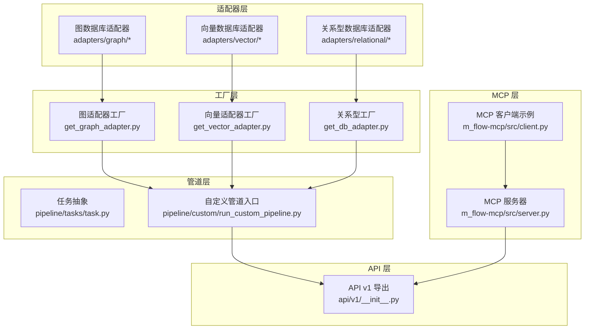
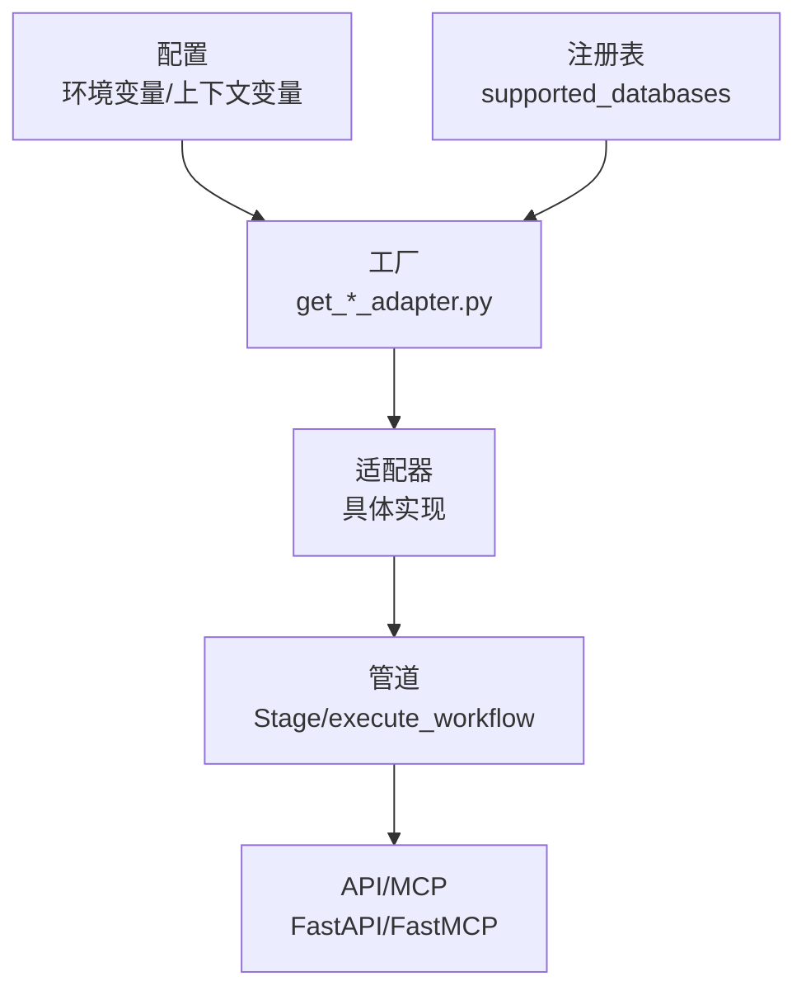
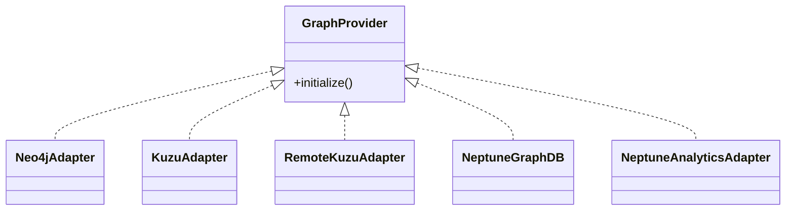
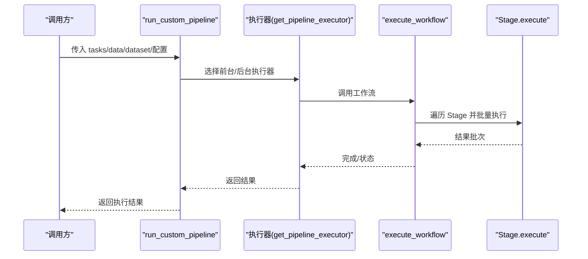
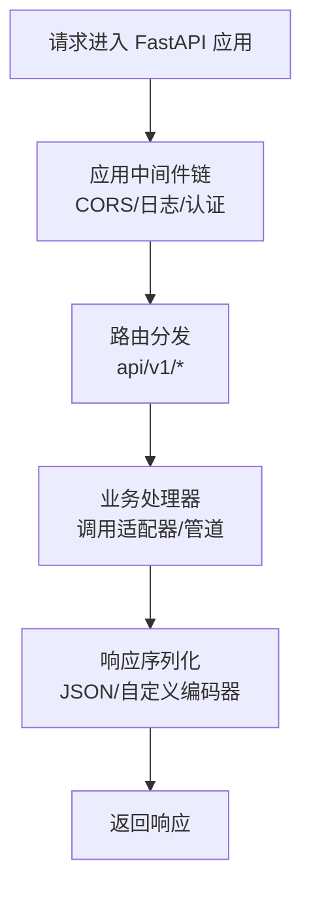
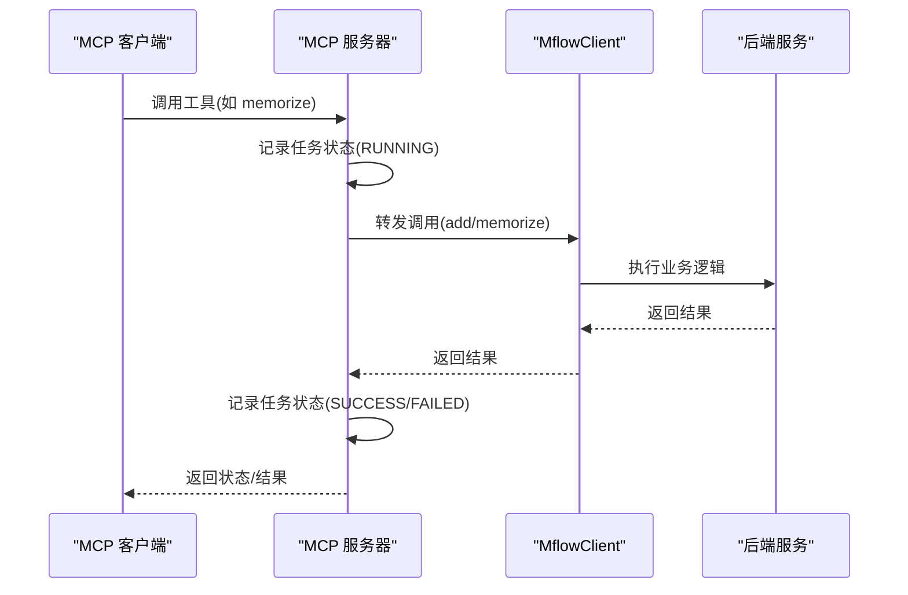
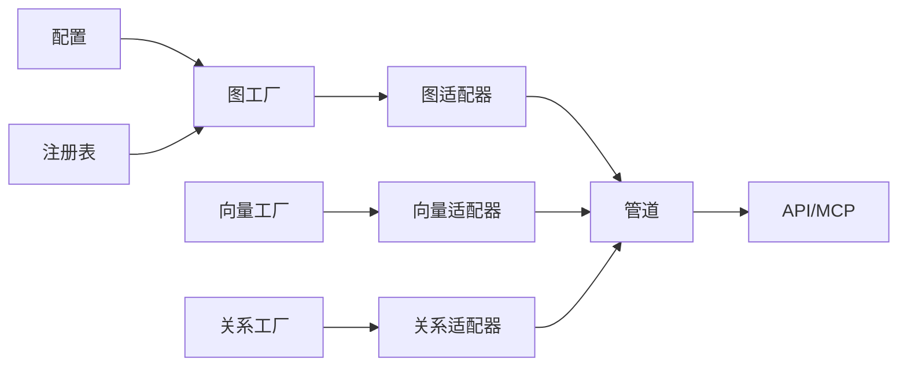

# 扩展开发指南

<cite>
**本文引用的文件**
- [m_flow/__init__.py](file://m_flow/__init__.py)
- [adapters/graph/get_graph_adapter.py](file://m_flow/adapters/graph/get_graph_adapter.py)
- [adapters/vector/get_vector_adapter.py](file://m_flow/adapters/vector/get_vector_adapter.py)
- [adapters/relational/get_db_adapter.py](file://m_flow/adapters/relational/get_db_adapter.py)
- [adapters/graph/supported_databases.py](file://m_flow/adapters/graph/supported_databases.py)
- [adapters/vector/supported_databases.py](file://m_flow/adapters/vector/supported_databases.py)
- [adapters/relational/create_relational_engine.py](file://m_flow/adapters/relational/create_relational_engine.py)
- [pipeline/custom/run_custom_pipeline.py](file://m_flow/pipeline/custom/run_custom_pipeline.py)
- [pipeline/tasks/task.py](file://m_flow/pipeline/tasks/task.py)
- [api/v1/__init__.py](file://m_flow/api/v1/__init__.py)
- [m_flow-mcp/src/__init__.py](file://m_flow-mcp/src/__init__.py)
- [m_flow-mcp/src/server.py](file://m_flow-mcp/src/server.py)
- [m_flow-mcp/src/client.py](file://m_flow-mcp/src/client.py)
- [shared/context/__init__.py](file://m_flow/shared/context/__init__.py)
</cite>

## 目录
1. [简介](#简介)
2. [项目结构](#项目结构)
3. [核心组件](#核心组件)
4. [架构总览](#架构总览)
5. [详细组件分析](#详细组件分析)
6. [依赖分析](#依赖分析)
7. [性能考虑](#性能考虑)
8. [故障排除指南](#故障排除指南)
9. [结论](#结论)
10. [附录](#附录)

## 简介
本指南面向希望在 M-flow 平台上进行扩展开发的工程师与架构师，系统讲解插件系统架构（适配器模式、工厂模式、扩展点设计）、自定义适配器开发（数据库适配器、LLM 适配器、存储适配器）、API 扩展（自定义路由、中间件、响应处理器）、管道扩展（自定义任务、处理器、执行器）、前端扩展（组件扩展、状态管理、样式定制）以及 MCP 协议扩展（自定义工具、消息格式、协议实现）。文档结合仓库中的实际实现，提供可操作的扩展路径与最佳实践。

## 项目结构
M-flow 采用模块化分层组织，核心能力围绕“适配器 + 工厂 + 管道 + API + MCP + 前端”展开：
- 适配器层：统一抽象不同后端（图数据库、向量库、关系型数据库）
- 工厂层：按配置动态构建适配器实例
- 管道层：统一的任务编排与执行模型
- API 层：REST 接口与维护接口
- MCP 层：Model Context Protocol 服务端与客户端
- 前端层：Next.js 应用，组件、状态与样式体系

图表来源
- [adapters/graph/get_graph_adapter.py:22-35](file://m_flow/adapters/graph/get_graph_adapter.py#L22-L35)
- [adapters/vector/get_vector_adapter.py:11-18](file://m_flow/adapters/vector/get_vector_adapter.py#L11-L18)
- [adapters/relational/get_db_adapter.py:11-21](file://m_flow/adapters/relational/get_db_adapter.py#L11-L21)
- [pipeline/tasks/task.py:16-87](file://m_flow/pipeline/tasks/task.py#L16-L87)
- [pipeline/custom/run_custom_pipeline.py:25-94](file://m_flow/pipeline/custom/run_custom_pipeline.py#L25-L94)
- [api/v1/__init__.py:6-10](file://m_flow/api/v1/__init__.py#L6-L10)
- [m_flow-mcp/src/server.py:46-48](file://m_flow-mcp/src/server.py#L46-L48)
- [m_flow-mcp/src/client.py:23-54](file://m_flow-mcp/src/client.py#L23-L54)

章节来源
- [m_flow/__init__.py:21-56](file://m_flow/__init__.py#L21-L56)

## 核心组件
- 插件系统架构
  - 适配器模式：通过统一接口抽象不同后端能力，如图/向量/关系型数据库适配器
  - 工厂模式：根据运行时配置动态构建适配器实例，支持注册表扩展
  - 扩展点设计：通过注册表与配置驱动，允许第三方扩展新适配器
- 管道扩展：统一的 Stage 抽象与执行器，支持同步/异步/生成器函数
- API 扩展：基于 FastAPI 的模块化导出与维护接口
- MCP 扩展：基于 FastMCP 的工具注册与传输模式（stdio/SSE/HTTP）

章节来源
- [adapters/graph/get_graph_adapter.py:22-35](file://m_flow/adapters/graph/get_graph_adapter.py#L22-L35)
- [adapters/vector/get_vector_adapter.py:11-18](file://m_flow/adapters/vector/get_vector_adapter.py#L11-L18)
- [adapters/relational/get_db_adapter.py:11-21](file://m_flow/adapters/relational/get_db_adapter.py#L11-L21)
- [adapters/graph/supported_databases.py:7-7](file://m_flow/adapters/graph/supported_databases.py#L7-L7)
- [adapters/vector/supported_databases.py:7-7](file://m_flow/adapters/vector/supported_databases.py#L7-L7)
- [pipeline/tasks/task.py:16-87](file://m_flow/pipeline/tasks/task.py#L16-L87)
- [pipeline/custom/run_custom_pipeline.py:25-94](file://m_flow/pipeline/custom/run_custom_pipeline.py#L25-L94)
- [api/v1/__init__.py:6-10](file://m_flow/api/v1/__init__.py#L6-L10)
- [m_flow-mcp/src/__init__.py:1-68](file://m_flow-mcp/src/__init__.py#L1-L68)

## 架构总览
M-flow 的扩展架构以“配置驱动 + 工厂 + 适配器 + 管道 + API/MCP”为主线，形成高内聚、低耦合的可扩展系统。

图表来源
- [adapters/graph/get_graph_adapter.py:66-73](file://m_flow/adapters/graph/get_graph_adapter.py#L66-L73)
- [adapters/vector/get_vector_adapter.py:11-18](file://m_flow/adapters/vector/get_vector_adapter.py#L11-L18)
- [adapters/relational/get_db_adapter.py:11-21](file://m_flow/adapters/relational/get_db_adapter.py#L11-L21)
- [adapters/graph/supported_databases.py:7-7](file://m_flow/adapters/graph/supported_databases.py#L7-L7)
- [adapters/vector/supported_databases.py:7-7](file://m_flow/adapters/vector/supported_databases.py#L7-L7)
- [pipeline/tasks/task.py:94-121](file://m_flow/pipeline/tasks/task.py#L94-L121)
- [m_flow-mcp/src/server.py:240-243](file://m_flow-mcp/src/server.py#L240-L243)

## 详细组件分析

### 适配器与工厂：数据库适配器扩展
- 图数据库适配器工厂
  - 支持注册表扩展与内置提供者（Neo4j/Kuzu/Neptune/Neptune Analytics）
  - 初始化阶段可执行异步初始化
- 向量数据库适配器工厂
  - 基于上下文配置创建引擎实例
- 关系型数据库适配器工厂
  - 支持 SQLite/PostgreSQL，连接字符串构建与依赖校验
- 扩展点
  - 在注册表中注册新提供者构造器
  - 实现统一接口以适配新后端

图表来源
- [adapters/graph/get_graph_adapter.py:76-122](file://m_flow/adapters/graph/get_graph_adapter.py#L76-L122)
- [adapters/graph/supported_databases.py:7-7](file://m_flow/adapters/graph/supported_databases.py#L7-L7)

章节来源
- [adapters/graph/get_graph_adapter.py:22-35](file://m_flow/adapters/graph/get_graph_adapter.py#L22-L35)
- [adapters/vector/get_vector_adapter.py:11-18](file://m_flow/adapters/vector/get_vector_adapter.py#L11-L18)
- [adapters/relational/get_db_adapter.py:11-21](file://m_flow/adapters/relational/get_db_adapter.py#L11-L21)
- [adapters/relational/create_relational_engine.py:16-56](file://m_flow/adapters/relational/create_relational_engine.py#L16-L56)
- [adapters/graph/supported_databases.py:7-7](file://m_flow/adapters/graph/supported_databases.py#L7-L7)
- [adapters/vector/supported_databases.py:7-7](file://m_flow/adapters/vector/supported_databases.py#L7-L7)

### 管道扩展：自定义任务、处理器与执行器
- Stage 抽象
  - 统一包装任意可调用对象（同步/异步/生成器/异步生成器）
  - 提供批量产出与异步迭代接口
- 自定义管道入口
  - 支持前台/后台调度、缓存、增量加载、批大小等参数
  - 可覆盖向量/图存储后端配置

图表来源
- [pipeline/custom/run_custom_pipeline.py:25-94](file://m_flow/pipeline/custom/run_custom_pipeline.py#L25-L94)
- [pipeline/tasks/task.py:94-121](file://m_flow/pipeline/tasks/task.py#L94-L121)

章节来源
- [pipeline/tasks/task.py:16-152](file://m_flow/pipeline/tasks/task.py#L16-L152)
- [pipeline/custom/run_custom_pipeline.py:25-94](file://m_flow/pipeline/custom/run_custom_pipeline.py#L25-L94)

### API 扩展：自定义路由、中间件与响应处理器
- API v1 模块导出
  - 维护接口模块化导出，便于扩展新的路由组
- 中间件与响应
  - 可在 FastAPI 应用层添加 CORS、日志、认证等中间件
  - 响应处理器可统一序列化与错误包装

图表来源
- [api/v1/__init__.py:6-10](file://m_flow/api/v1/__init__.py#L6-L10)
- [m_flow-mcp/src/server.py:204-236](file://m_flow-mcp/src/server.py#L204-L236)

章节来源
- [api/v1/__init__.py:6-10](file://m_flow/api/v1/__init__.py#L6-L10)
- [m_flow-mcp/src/server.py:201-243](file://m_flow-mcp/src/server.py#L201-L243)

### MCP 协议扩展：自定义工具、消息格式与协议实现
- 工具注册与状态跟踪
  - 使用装饰器注册工具（memorize/save_interaction/search/list_data/delete/prune/memorize_status）
  - 内置后台任务状态登记与查询
- 传输模式
  - 支持 stdio/SSE/HTTP 三种传输模式
- 消息格式
  - 使用 MCP 类型与 JSON 编码器进行消息封装

图表来源
- [m_flow-mcp/src/server.py:113-180](file://m_flow-mcp/src/server.py#L113-L180)
- [m_flow-mcp/src/server.py:250-333](file://m_flow-mcp/src/server.py#L250-L333)
- [m_flow-mcp/src/server.py:412-494](file://m_flow-mcp/src/server.py#L412-L494)
- [m_flow-mcp/src/server.py:746-800](file://m_flow-mcp/src/server.py#L746-L800)

章节来源
- [m_flow-mcp/src/__init__.py:16-68](file://m_flow-mcp/src/__init__.py#L16-L68)
- [m_flow-mcp/src/server.py:46-48](file://m_flow-mcp/src/server.py#L46-L48)
- [m_flow-mcp/src/server.py:113-180](file://m_flow-mcp/src/server.py#L113-L180)
- [m_flow-mcp/src/server.py:250-333](file://m_flow-mcp/src/server.py#L250-L333)
- [m_flow-mcp/src/server.py:412-494](file://m_flow-mcp/src/server.py#L412-L494)
- [m_flow-mcp/src/server.py:746-800](file://m_flow-mcp/src/server.py#L746-L800)
- [m_flow-mcp/src/client.py:23-54](file://m_flow-mcp/src/client.py#L23-L54)

### 前端扩展：组件扩展、状态管理与样式定制
- 上下文管理
  - 通过上下文变量与显式参数传递状态，避免参数层层透传
- 扩展建议
  - 组件扩展：基于现有组件库与类型系统新增页面与控件
  - 状态管理：利用上下文变量与全局设置对象管理跨组件状态
  - 样式定制：遵循 Tailwind 配置与主题规范

章节来源
- [shared/context/__init__.py:8-22](file://m_flow/shared/context/__init__.py#L8-L22)

## 依赖分析
- 适配器与工厂
  - 工厂依赖配置模块与具体适配器实现
  - 注册表提供扩展点，避免硬编码新增提供者
- 管道
  - Stage 抽象解耦任务实现与执行框架
  - 执行器根据 run_in_background 参数切换前台/后台调度
- API/MCP
  - API 通过模块化导出扩展路由
  - MCP 通过装饰器注册工具，统一状态跟踪与传输

图表来源
- [adapters/graph/get_graph_adapter.py:66-73](file://m_flow/adapters/graph/get_graph_adapter.py#L66-L73)
- [adapters/vector/get_vector_adapter.py:11-18](file://m_flow/adapters/vector/get_vector_adapter.py#L11-L18)
- [adapters/relational/get_db_adapter.py:11-21](file://m_flow/adapters/relational/get_db_adapter.py#L11-L21)
- [adapters/graph/supported_databases.py:7-7](file://m_flow/adapters/graph/supported_databases.py#L7-L7)
- [pipeline/tasks/task.py:94-121](file://m_flow/pipeline/tasks/task.py#L94-L121)
- [m_flow-mcp/src/server.py:240-243](file://m_flow-mcp/src/server.py#L240-L243)

章节来源
- [adapters/graph/get_graph_adapter.py:22-35](file://m_flow/adapters/graph/get_graph_adapter.py#L22-L35)
- [adapters/vector/get_vector_adapter.py:11-18](file://m_flow/adapters/vector/get_vector_adapter.py#L11-L18)
- [adapters/relational/get_db_adapter.py:11-21](file://m_flow/adapters/relational/get_db_adapter.py#L11-L21)
- [adapters/graph/supported_databases.py:7-7](file://m_flow/adapters/graph/supported_databases.py#L7-L7)
- [adapters/vector/supported_databases.py:7-7](file://m_flow/adapters/vector/supported_databases.py#L7-L7)
- [pipeline/tasks/task.py:16-152](file://m_flow/pipeline/tasks/task.py#L16-L152)
- [m_flow-mcp/src/server.py:46-48](file://m_flow-mcp/src/server.py#L46-L48)

## 性能考虑
- 工厂缓存
  - 图/关系型工厂使用缓存减少重复初始化开销
- 批量处理
  - Stage 支持批量产出，降低网络与 IO 调用频率
- 异步执行
  - 工具与任务均支持异步执行，提升并发吞吐
- 传输优化
  - SSE/HTTP 传输模式适用于分布式部署与 Web 客户端集成

章节来源
- [adapters/graph/get_graph_adapter.py:43-44](file://m_flow/adapters/graph/get_graph_adapter.py#L43-L44)
- [adapters/relational/create_relational_engine.py:16-16](file://m_flow/adapters/relational/create_relational_engine.py#L16-L16)
- [pipeline/tasks/task.py:109-121](file://m_flow/pipeline/tasks/task.py#L109-L121)
- [m_flow-mcp/src/server.py:201-236](file://m_flow-mcp/src/server.py#L201-L236)

## 故障排除指南
- 适配器初始化失败
  - 检查必需配置项与提供者名称拼写
  - 对于 Neptune，确认 AWS 依赖安装
- 工厂返回未知提供者
  - 确认注册表中已注册新提供者构造器
  - 检查配置键名与大小写
- 管道执行异常
  - 查看后台任务状态登记（memorize_status）
  - 检查批大小与增量加载参数
- API/MCP 传输问题
  - 确认传输模式与端口配置
  - 检查 CORS 与鉴权中间件设置

章节来源
- [adapters/graph/get_graph_adapter.py:139-155](file://m_flow/adapters/graph/get_graph_adapter.py#L139-L155)
- [adapters/graph/get_graph_adapter.py:124-131](file://m_flow/adapters/graph/get_graph_adapter.py#L124-L131)
- [m_flow-mcp/src/server.py:113-180](file://m_flow-mcp/src/server.py#L113-L180)
- [m_flow-mcp/src/server.py:746-800](file://m_flow-mcp/src/server.py#L746-L800)
- [m_flow-mcp/src/server.py:201-236](file://m_flow-mcp/src/server.py#L201-L236)

## 结论
M-flow 的扩展开发以“配置驱动 + 工厂 + 适配器 + 管道 + API/MCP”为核心，通过注册表与统一接口实现高度可扩展性。开发者可按需扩展数据库适配器、自定义管道任务、API 路由与 MCP 工具，并结合前端上下文体系实现组件与状态的灵活扩展。建议在扩展过程中遵循统一接口、缓存策略与异步执行原则，确保性能与可观测性。

## 附录
- 扩展示例路径参考
  - 自定义图数据库适配器：在注册表中注册构造器并在工厂中解析
  - 自定义向量数据库适配器：实现统一接口并通过工厂创建实例
  - 自定义关系型数据库适配器：扩展连接字符串构建与依赖校验
  - 自定义管道任务：使用 Stage 包装可调用对象并设置批大小
  - 自定义 API 路由：在 api/v1 下新增路由模块并导出
  - 自定义 MCP 工具：使用装饰器注册工具并实现状态跟踪
- 最佳实践
  - 明确职责边界：适配器只负责与后端交互，工厂只负责实例化
  - 统一错误处理：在适配器与工具中抛出明确异常并记录日志
  - 可观测性：为后台任务与管道执行提供状态登记与查询接口
  - 文档化：为新适配器与工具提供使用说明与参数清单