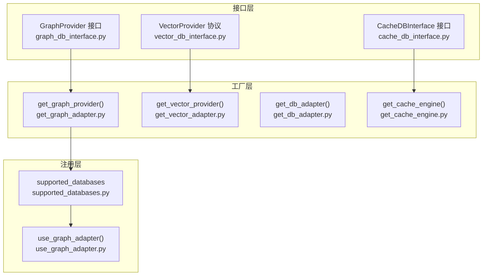
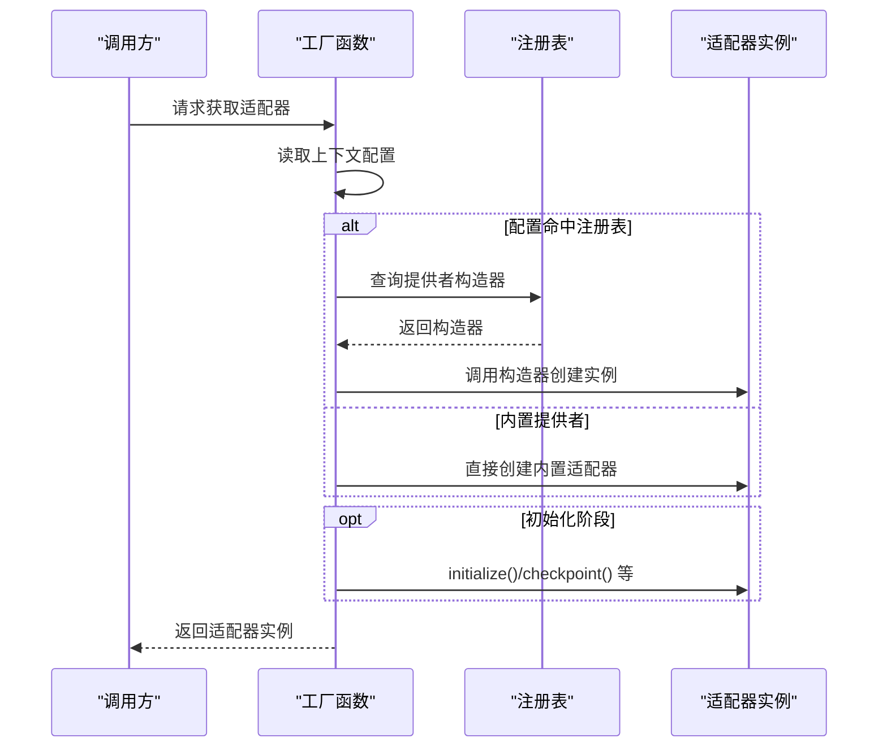
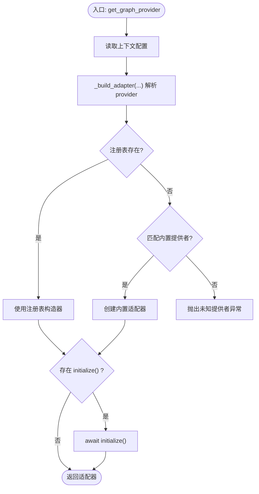
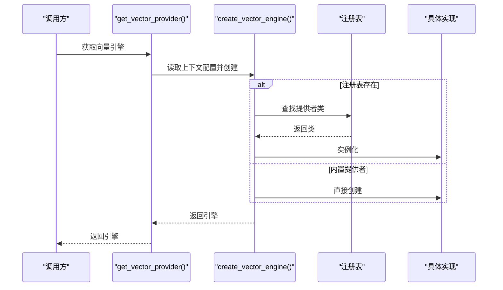
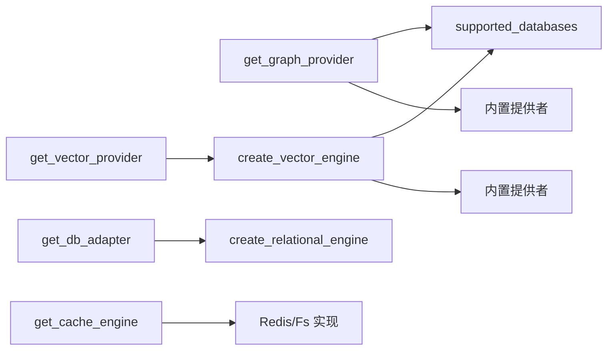

# 插件系统架构

<cite>
**本文引用的文件**
- [m_flow/adapters/graph/get_graph_adapter.py](file://m_flow/adapters/graph/get_graph_adapter.py)
- [m_flow/adapters/graph/use_graph_adapter.py](file://m_flow/adapters/graph/use_graph_adapter.py)
- [m_flow/adapters/graph/supported_databases.py](file://m_flow/adapters/graph/supported_databases.py)
- [m_flow/adapters/graph/graph_db_interface.py](file://m_flow/adapters/graph/graph_db_interface.py)
- [m_flow/adapters/vector/create_vector_engine.py](file://m_flow/adapters/vector/create_vector_engine.py)
- [m_flow/adapters/vector/get_vector_adapter.py](file://m_flow/adapters/vector/get_vector_adapter.py)
- [m_flow/adapters/vector/vector_db_interface.py](file://m_flow/adapters/vector/vector_db_interface.py)
- [m_flow/adapters/relational/create_relational_engine.py](file://m_flow/adapters/relational/create_relational_engine.py)
- [m_flow/adapters/relational/get_db_adapter.py](file://m_flow/adapters/relational/get_db_adapter.py)
- [m_flow/adapters/cache/get_cache_engine.py](file://m_flow/adapters/cache/get_cache_engine.py)
- [m_flow/adapters/cache/cache_db_interface.py](file://m_flow/adapters/cache/cache_db_interface.py)
- [m_flow/config/presets.py](file://m_flow/config/presets.py)
</cite>

## 目录
1. [引言](#引言)
2. [项目结构](#项目结构)
3. [核心组件](#核心组件)
4. [架构总览](#架构总览)
5. [详细组件分析](#详细组件分析)
6. [依赖分析](#依赖分析)
7. [性能考虑](#性能考虑)
8. [故障排查指南](#故障排查指南)
9. [结论](#结论)
10. [附录](#附录)

## 引言
本文件系统性阐述 M-flow 的插件系统架构与实现原理，重点覆盖以下方面：
- 设计理念：适配器模式、工厂模式与扩展点设计
- 插件注册机制、生命周期管理与依赖注入
- 插件接口规范与标准化约定（接口定义、参数传递、返回值格式）
- 插件发现与加载机制（自动扫描、配置管理、错误处理）
- 插件开发最佳实践（单例、工厂、观察者等模式的应用）

通过对图数据库、向量数据库、关系型数据库与缓存等适配层的深入分析，帮助开发者理解如何以统一接口扩展新的后端能力，并在运行时按配置动态选择与装配。

## 项目结构
M-flow 将“插件”抽象为“适配器”，通过“工厂 + 注册表”的方式实现可插拔的后端能力。核心组织方式如下：
- 接口层：定义稳定的抽象契约，确保上层业务不直接依赖具体实现
- 工厂层：根据运行时配置解析并实例化适配器
- 注册层：维护扩展点映射，支持外部模块注册自定义适配器
- 生命周期与清理：通过配置预设与缓存清理机制管理全局状态

图表来源
- [m_flow/adapters/graph/get_graph_adapter.py:22-35](file://m_flow/adapters/graph/get_graph_adapter.py#L22-L35)
- [m_flow/adapters/graph/supported_databases.py:7-7](file://m_flow/adapters/graph/supported_databases.py#L7-L7)
- [m_flow/adapters/graph/use_graph_adapter.py:10-11](file://m_flow/adapters/graph/use_graph_adapter.py#L10-L11)
- [m_flow/adapters/vector/get_vector_adapter.py:11-18](file://m_flow/adapters/vector/get_vector_adapter.py#L11-L18)
- [m_flow/adapters/relational/get_db_adapter.py:11-21](file://m_flow/adapters/relational/get_db_adapter.py#L11-L21)
- [m_flow/adapters/cache/get_cache_engine.py:68-78](file://m_flow/adapters/cache/get_cache_engine.py#L68-L78)

章节来源
- [m_flow/adapters/graph/get_graph_adapter.py:22-35](file://m_flow/adapters/graph/get_graph_adapter.py#L22-L35)
- [m_flow/adapters/graph/supported_databases.py:7-7](file://m_flow/adapters/graph/supported_databases.py#L7-L7)
- [m_flow/adapters/graph/use_graph_adapter.py:10-11](file://m_flow/adapters/graph/use_graph_adapter.py#L10-L11)
- [m_flow/adapters/vector/get_vector_adapter.py:11-18](file://m_flow/adapters/vector/get_vector_adapter.py#L11-L18)
- [m_flow/adapters/relational/get_db_adapter.py:11-21](file://m_flow/adapters/relational/get_db_adapter.py#L11-L21)
- [m_flow/adapters/cache/get_cache_engine.py:68-78](file://m_flow/adapters/cache/get_cache_engine.py#L68-L78)

## 核心组件
- 图数据库适配器体系
  - 接口：GraphProvider 定义节点/边 CRUD、查询、统计、子图提取等能力
  - 工厂：get_graph_provider() 解析配置并返回已初始化的适配器；_build_adapter() 支持注册表与内置提供者
  - 扩展点：supported_databases 注册表 + use_graph_adapter() 动态注册
- 向量数据库适配器体系
  - 接口：VectorProvider 协议定义集合管理、内存节点 CRUD、语义检索、批量检索、嵌入生成、维护操作等
  - 工厂：get_vector_provider() + create_vector_engine() 支持注册表与内置提供者
- 关系型数据库适配器体系
  - 工厂：get_db_adapter() + create_relational_engine() 支持 SQLite/PostgreSQL
- 缓存适配器体系
  - 接口：CacheDBInterface 定义分布式锁与问答会话存储
  - 工厂：get_cache_engine() + create_cache_engine() 支持 Redis 与文件系统后端

章节来源
- [m_flow/adapters/graph/graph_db_interface.py:122-346](file://m_flow/adapters/graph/graph_db_interface.py#L122-L346)
- [m_flow/adapters/graph/get_graph_adapter.py:22-131](file://m_flow/adapters/graph/get_graph_adapter.py#L22-L131)
- [m_flow/adapters/graph/use_graph_adapter.py:10-11](file://m_flow/adapters/graph/use_graph_adapter.py#L10-L11)
- [m_flow/adapters/graph/supported_databases.py:7-7](file://m_flow/adapters/graph/supported_databases.py#L7-L7)
- [m_flow/adapters/vector/vector_db_interface.py:16-179](file://m_flow/adapters/vector/vector_db_interface.py#L16-L179)
- [m_flow/adapters/vector/create_vector_engine.py:15-111](file://m_flow/adapters/vector/create_vector_engine.py#L15-L111)
- [m_flow/adapters/vector/get_vector_adapter.py:11-18](file://m_flow/adapters/vector/get_vector_adapter.py#L11-L18)
- [m_flow/adapters/relational/create_relational_engine.py:16-81](file://m_flow/adapters/relational/create_relational_engine.py#L16-L81)
- [m_flow/adapters/relational/get_db_adapter.py:11-21](file://m_flow/adapters/relational/get_db_adapter.py#L11-L21)
- [m_flow/adapters/cache/get_cache_engine.py:19-78](file://m_flow/adapters/cache/get_cache_engine.py#L19-L78)
- [m_flow/adapters/cache/cache_db_interface.py:12-124](file://m_flow/adapters/cache/cache_db_interface.py#L12-L124)

## 架构总览
下图展示插件系统的关键交互：上层业务仅依赖稳定接口；工厂根据配置解析并实例化适配器；注册表允许第三方扩展；生命周期与清理由配置预设统一管理。

图表来源
- [m_flow/adapters/graph/get_graph_adapter.py:22-35](file://m_flow/adapters/graph/get_graph_adapter.py#L22-L35)
- [m_flow/adapters/graph/supported_databases.py:7-7](file://m_flow/adapters/graph/supported_databases.py#L7-L7)
- [m_flow/adapters/vector/create_vector_engine.py:47-55](file://m_flow/adapters/vector/create_vector_engine.py#L47-L55)
- [m_flow/adapters/relational/create_relational_engine.py:16-56](file://m_flow/adapters/relational/create_relational_engine.py#L16-L56)
- [m_flow/adapters/cache/get_cache_engine.py:44-65](file://m_flow/adapters/cache/get_cache_engine.py#L44-L65)

## 详细组件分析

### 图数据库适配器（GraphProvider）
- 设计要点
  - 采用适配器模式：统一接口屏蔽不同图库差异
  - 工厂 + 注册表：优先从注册表解析，否则回退内置提供者
  - 生命周期：支持 initialize() 异步初始化
- 关键流程
  - get_graph_provider() 读取上下文配置并调用 _build_adapter()
  - _build_adapter() 先查 supported_databases，再匹配内置提供者
  - 提供 _require/_validate_prefix/_ensure_langchain_aws 等辅助校验

图表来源
- [m_flow/adapters/graph/get_graph_adapter.py:22-131](file://m_flow/adapters/graph/get_graph_adapter.py#L22-L131)

章节来源
- [m_flow/adapters/graph/get_graph_adapter.py:22-131](file://m_flow/adapters/graph/get_graph_adapter.py#L22-L131)
- [m_flow/adapters/graph/use_graph_adapter.py:10-11](file://m_flow/adapters/graph/use_graph_adapter.py#L10-L11)
- [m_flow/adapters/graph/supported_databases.py:7-7](file://m_flow/adapters/graph/supported_databases.py#L7-L7)
- [m_flow/adapters/graph/graph_db_interface.py:122-346](file://m_flow/adapters/graph/graph_db_interface.py#L122-L346)

### 向量数据库适配器（VectorProvider）
- 设计要点
  - 协议化接口：VectorProvider 定义集合、CRUD、检索、嵌入、维护等能力
  - 工厂：get_vector_provider() 通过 create_vector_engine() 创建实例
  - 扩展点：注册表支持自定义提供者；内置支持 PGVector、ChromaDB、LanceDB、Neptune Analytics、Pinecone、Milvus
- 关键流程
  - create_vector_engine() 优先查注册表，再按 provider 名称匹配内置实现
  - 对缺失依赖进行显式 ImportError 提示

图表来源
- [m_flow/adapters/vector/get_vector_adapter.py:11-18](file://m_flow/adapters/vector/get_vector_adapter.py#L11-L18)
- [m_flow/adapters/vector/create_vector_engine.py:15-111](file://m_flow/adapters/vector/create_vector_engine.py#L15-L111)

章节来源
- [m_flow/adapters/vector/get_vector_adapter.py:11-18](file://m_flow/adapters/vector/get_vector_adapter.py#L11-L18)
- [m_flow/adapters/vector/create_vector_engine.py:15-111](file://m_flow/adapters/vector/create_vector_engine.py#L15-L111)
- [m_flow/adapters/vector/vector_db_interface.py:16-179](file://m_flow/adapters/vector/vector_db_interface.py#L16-L179)

### 关系型数据库适配器（Relational）
- 设计要点
  - 工厂：get_db_adapter() 通过 create_relational_engine() 创建 SQLAlchemyAdapter
  - 连接字符串：支持 SQLite 与 PostgreSQL，内置导入检查与错误提示
- 关键流程
  - _build_connection_string() 根据 provider 生成连接串
  - create_relational_engine() 缓存实例，避免重复创建

章节来源
- [m_flow/adapters/relational/get_db_adapter.py:11-21](file://m_flow/adapters/relational/get_db_adapter.py#L11-L21)
- [m_flow/adapters/relational/create_relational_engine.py:16-81](file://m_flow/adapters/relational/create_relational_engine.py#L16-L81)

### 缓存适配器（CacheDBInterface）
- 设计要点
  - 接口：分布式锁、问答会话存储、生命周期关闭
  - 工厂：get_cache_engine() 依据配置选择 Redis 或文件系统后端
- 关键流程
  - create_cache_engine() 按配置后端创建实例；禁用缓存时返回 None

章节来源
- [m_flow/adapters/cache/get_cache_engine.py:19-78](file://m_flow/adapters/cache/get_cache_engine.py#L19-L78)
- [m_flow/adapters/cache/cache_db_interface.py:12-124](file://m_flow/adapters/cache/cache_db_interface.py#L12-L124)

## 依赖分析
- 组件耦合
  - 工厂对注册表存在直接依赖；注册表为全局字典，便于跨模块扩展
  - 接口层与实现层解耦，通过协议/抽象类约束行为
- 可能的循环依赖
  - 图适配器装饰器中引入关系型适配器用于账本记录，采用延迟导入避免循环
- 外部依赖
  - 向量/图适配器对第三方库有可选依赖，工厂层统一捕获 ImportError 并给出安装指引

图表来源
- [m_flow/adapters/graph/get_graph_adapter.py:66-73](file://m_flow/adapters/graph/get_graph_adapter.py#L66-L73)
- [m_flow/adapters/vector/create_vector_engine.py:48-55](file://m_flow/adapters/vector/create_vector_engine.py#L48-L55)
- [m_flow/adapters/relational/get_db_adapter.py:20-21](file://m_flow/adapters/relational/get_db_adapter.py#L20-L21)
- [m_flow/adapters/cache/get_cache_engine.py:49-63](file://m_flow/adapters/cache/get_cache_engine.py#L49-L63)

章节来源
- [m_flow/adapters/graph/get_graph_adapter.py:66-73](file://m_flow/adapters/graph/get_graph_adapter.py#L66-L73)
- [m_flow/adapters/vector/create_vector_engine.py:48-55](file://m_flow/adapters/vector/create_vector_engine.py#L48-L55)
- [m_flow/adapters/relational/get_db_adapter.py:20-21](file://m_flow/adapters/relational/get_db_adapter.py#L20-L21)
- [m_flow/adapters/cache/get_cache_engine.py:49-63](file://m_flow/adapters/cache/get_cache_engine.py#L49-L63)

## 性能考虑
- 缓存策略
  - 工厂层广泛使用 LRU 缓存（如 @lru_cache），降低重复构建成本
- 异步初始化
  - 图适配器工厂支持 await initialize()，避免阻塞主流程
- 连接复用
  - 关系型适配器缓存连接串与实例，减少频繁创建开销
- 依赖懒加载
  - 第三方库导入失败时才抛错，避免启动期不必要的异常

## 故障排查指南
- 未知提供者
  - 现象：抛出“未知提供者”异常
  - 排查：确认 provider 名称大小写与内置/注册表一致；检查是否正确调用 use_graph_adapter() 注册
- 缺少依赖
  - 现象：ImportError 提示缺少特定依赖
  - 排查：根据异常消息安装对应 extras 或依赖包
- 配置缺失
  - 现象：EnvironmentError 提示缺少必要参数
  - 排查：核对配置项（如 URL、密钥、主机名等）是否完整
- 缓存禁用或后端不匹配
  - 现象：get_cache_engine() 返回 None 或后端报错
  - 排查：检查缓存开关与后端类型配置

章节来源
- [m_flow/adapters/graph/get_graph_adapter.py:139-155](file://m_flow/adapters/graph/get_graph_adapter.py#L139-L155)
- [m_flow/adapters/vector/create_vector_engine.py:128-131](file://m_flow/adapters/vector/create_vector_engine.py#L128-L131)
- [m_flow/adapters/cache/get_cache_engine.py:44-65](file://m_flow/adapters/cache/get_cache_engine.py#L44-L65)

## 结论
M-flow 的插件系统以“接口 + 工厂 + 注册表”为核心，结合适配器与工厂模式，实现了高内聚、低耦合且可扩展的后端适配层。通过清晰的接口规范、完善的错误处理与缓存优化，开发者可以快速接入新后端并在运行时灵活切换。建议在扩展时遵循本文档的接口约定与最佳实践，确保一致性与可维护性。

## 附录

### 插件接口规范与标准化约定
- 接口定义
  - 图数据库：GraphProvider（节点/边 CRUD、查询、统计、子图提取、可选持久化）
  - 向量数据库：VectorProvider（集合管理、CRUD、检索、嵌入、维护）
  - 缓存：CacheDBInterface（分布式锁、问答会话存储、生命周期）
- 参数传递
  - 工厂函数统一接收配置字典并通过关键字参数传入构造器
  - 注册表以 provider 名称映射到构造器，便于动态解析
- 返回值格式
  - 工厂返回适配器实例；禁用缓存时返回 None
  - 接口方法返回标准数据结构（列表、字典、布尔值等），便于上层统一处理

章节来源
- [m_flow/adapters/graph/graph_db_interface.py:122-346](file://m_flow/adapters/graph/graph_db_interface.py#L122-L346)
- [m_flow/adapters/vector/vector_db_interface.py:16-179](file://m_flow/adapters/vector/vector_db_interface.py#L16-L179)
- [m_flow/adapters/cache/cache_db_interface.py:12-124](file://m_flow/adapters/cache/cache_db_interface.py#L12-L124)
- [m_flow/adapters/graph/get_graph_adapter.py:44-73](file://m_flow/adapters/graph/get_graph_adapter.py#L44-L73)
- [m_flow/adapters/vector/create_vector_engine.py:48-55](file://m_flow/adapters/vector/create_vector_engine.py#L48-L55)
- [m_flow/adapters/cache/get_cache_engine.py:44-65](file://m_flow/adapters/cache/get_cache_engine.py#L44-L65)

### 插件注册机制与生命周期管理
- 注册机制
  - 使用 use_graph_adapter(name, adapter) 将自定义适配器注册到 supported_databases
- 生命周期
  - 图适配器可通过 initialize() 进行异步初始化
  - 配置预设提供清理钩子与缓存清理，统一管理全局状态

章节来源
- [m_flow/adapters/graph/use_graph_adapter.py:10-11](file://m_flow/adapters/graph/use_graph_adapter.py#L10-L11)
- [m_flow/adapters/graph/supported_databases.py:7-7](file://m_flow/adapters/graph/supported_databases.py#L7-L7)
- [m_flow/adapters/graph/get_graph_adapter.py:32-33](file://m_flow/adapters/graph/get_graph_adapter.py#L32-L33)
- [m_flow/config/presets.py:76-101](file://m_flow/config/presets.py#L76-L101)

### 插件发现与加载机制
- 发现与加载
  - 工厂优先查注册表，再匹配内置提供者
  - 对缺失依赖与配置错误进行显式提示
- 错误处理
  - 统一抛出 EnvironmentError/ImportError/ValueError，便于上层捕获与降级

章节来源
- [m_flow/adapters/graph/get_graph_adapter.py:66-131](file://m_flow/adapters/graph/get_graph_adapter.py#L66-L131)
- [m_flow/adapters/vector/create_vector_engine.py:102-111](file://m_flow/adapters/vector/create_vector_engine.py#L102-L111)
- [m_flow/adapters/cache/get_cache_engine.py:62-65](file://m_flow/adapters/cache/get_cache_engine.py#L62-L65)

### 插件开发最佳实践
- 单例模式
  - 利用工厂层的 LRU 缓存避免重复创建昂贵对象
- 工厂模式
  - 将构造细节封装在工厂中，暴露统一接口
- 观察者模式
  - 在适配器变更处（如节点/边写入）使用装饰器记录账本，便于审计与追踪

章节来源
- [m_flow/adapters/graph/graph_db_interface.py:35-96](file://m_flow/adapters/graph/graph_db_interface.py#L35-L96)
- [m_flow/adapters/relational/create_relational_engine.py:16-56](file://m_flow/adapters/relational/create_relational_engine.py#L16-L56)
- [m_flow/adapters/vector/create_vector_engine.py:15-44](file://m_flow/adapters/vector/create_vector_engine.py#L15-L44)
- [m_flow/adapters/cache/get_cache_engine.py:19-43](file://m_flow/adapters/cache/get_cache_engine.py#L19-L43)