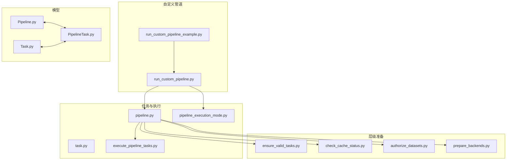
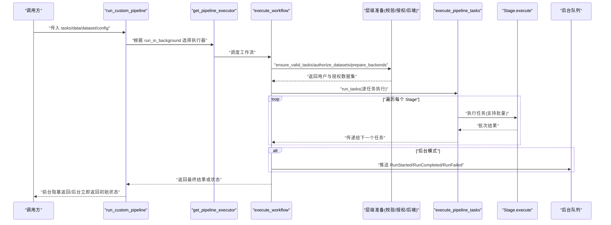
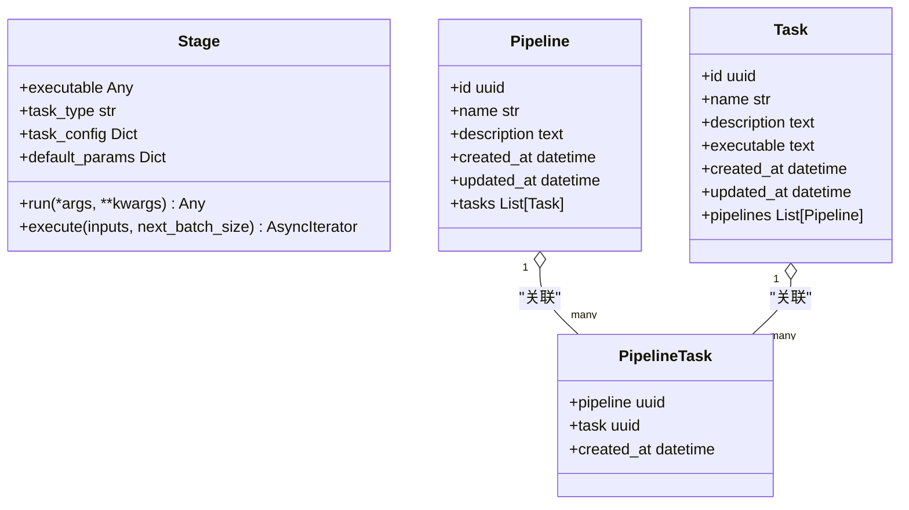
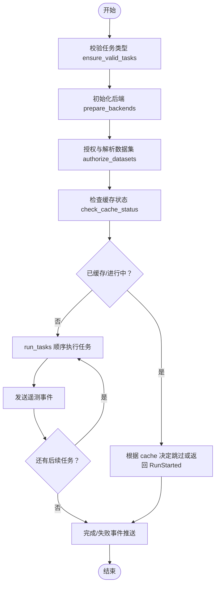
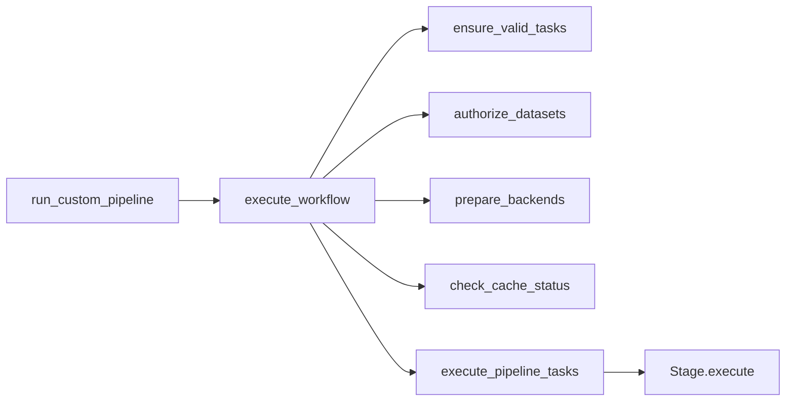

# 管道扩展开发

<cite>
**本文引用的文件**
- [run_custom_pipeline.py](file://m_flow/pipeline/custom/run_custom_pipeline.py)
- [run_custom_pipeline_example.py](file://examples/python/run_custom_pipeline_example.py)
- [Pipeline.py](file://m_flow/pipeline/models/Pipeline.py)
- [Task.py](file://m_flow/pipeline/models/Task.py)
- [PipelineTask.py](file://m_flow/pipeline/models/PipelineTask.py)
- [task.py](file://m_flow/pipeline/tasks/task.py)
- [pipeline.py](file://m_flow/pipeline/operations/pipeline.py)
- [pipeline_execution_mode.py](file://m_flow/pipeline/layers/pipeline_execution_mode.py)
- [execute_pipeline_tasks.py](file://m_flow/pipeline/operations/execute_pipeline_tasks.py)
- [ensure_valid_tasks.py](file://m_flow/pipeline/layers/ensure_valid_tasks.py)
- [check_cache_status.py](file://m_flow/pipeline/layers/check_cache_status.py)
- [authorize_datasets.py](file://m_flow/pipeline/layers/authorize_datasets.py)
- [prepare_backends.py](file://m_flow/pipeline/layers/prepare_backends.py)
- [config.yaml](file://coreference/configs/config.yaml)
</cite>

## 目录
1. [简介](#简介)
2. [项目结构](#项目结构)
3. [核心组件](#核心组件)
4. [架构总览](#架构总览)
5. [详细组件分析](#详细组件分析)
6. [依赖分析](#依赖分析)
7. [性能考虑](#性能考虑)
8. [故障排查指南](#故障排查指南)
9. [结论](#结论)
10. [附录](#附录)

## 简介
本指南面向希望在 M-Flow 平台上进行“管道扩展开发”的工程师与架构师。内容覆盖自定义管道任务的定义、参数配置与执行逻辑实现；管道编排与工作流设计（任务依赖、并行与错误处理）；配置系统（YAML、环境变量与动态配置）；以及监控与调试（执行状态跟踪、性能分析与故障诊断）。文末提供完整扩展示例与最佳实践。

## 项目结构
围绕“管道扩展”，本仓库的关键目录与文件如下：
- 自定义管道入口与编排：m_flow/pipeline/custom/run_custom_pipeline.py
- 示例演示：examples/python/run_custom_pipeline_example.py
- 管道与任务数据模型：m_flow/pipeline/models/Pipeline.py、Task.py、PipelineTask.py
- 任务抽象与执行：m_flow/pipeline/tasks/task.py
- 工作流执行引擎：m_flow/pipeline/operations/pipeline.py
- 执行模式与后台调度：m_flow/pipeline/layers/pipeline_execution_mode.py
- 任务执行器与遥测：m_flow/pipeline/operations/execute_pipeline_tasks.py
- 层级校验与准备：ensure_valid_tasks.py、check_cache_status.py、authorize_datasets.py、prepare_backends.py
- 配置参考：coreference/configs/config.yaml（用于理解 YAML 配置风格）

图表来源
- [run_custom_pipeline.py:1-95](file://m_flow/pipeline/custom/run_custom_pipeline.py#L1-L95)
- [run_custom_pipeline_example.py:1-84](file://examples/python/run_custom_pipeline_example.py#L1-L84)
- [Pipeline.py:1-44](file://m_flow/pipeline/models/Pipeline.py#L1-L44)
- [Task.py:1-50](file://m_flow/pipeline/models/Task.py#L1-L50)
- [PipelineTask.py:1-39](file://m_flow/pipeline/models/PipelineTask.py#L1-L39)
- [task.py:1-152](file://m_flow/pipeline/tasks/task.py#L1-L152)
- [pipeline.py:1-139](file://m_flow/pipeline/operations/pipeline.py#L1-L139)
- [pipeline_execution_mode.py:1-172](file://m_flow/pipeline/layers/pipeline_execution_mode.py#L1-L172)
- [execute_pipeline_tasks.py:1-144](file://m_flow/pipeline/operations/execute_pipeline_tasks.py#L1-L144)
- [ensure_valid_tasks.py:1-26](file://m_flow/pipeline/layers/ensure_valid_tasks.py#L1-L26)
- [check_cache_status.py:1-74](file://m_flow/pipeline/layers/check_cache_status.py#L1-L74)
- [authorize_datasets.py:1-49](file://m_flow/pipeline/layers/authorize_datasets.py#L1-L49)
- [prepare_backends.py:1-65](file://m_flow/pipeline/layers/prepare_backends.py#L1-L65)

章节来源
- [run_custom_pipeline.py:1-95](file://m_flow/pipeline/custom/run_custom_pipeline.py#L1-L95)
- [run_custom_pipeline_example.py:1-84](file://examples/python/run_custom_pipeline_example.py#L1-L84)

## 核心组件
- 自定义管道入口：run_custom_pipeline 提供统一的异步调度接口，支持前台阻塞与后台运行两种模式，可注入向量/图数据库配置、缓存开关、增量加载、批大小等运行时参数。
- 任务抽象：Stage 统一包装任意可调用对象（同步/异步函数、生成器、异步生成器），暴露统一的异步迭代接口，支持批量产出。
- 工作流执行：execute_workflow 负责输入校验、后端初始化、授权与缓存检查，然后委派给 run_tasks 完成逐任务执行。
- 执行模式：get_pipeline_executor 根据 run_in_background 选择阻塞或后台执行器，后台执行器会持续推送运行事件到队列。
- 任务执行器：execute_pipeline_tasks 实现顺序执行、上下文注入、遥测事件发送与异常传播。
- 层级准备：ensure_valid_tasks 校验任务类型；authorize_datasets 解析/授权数据集；prepare_backends 初始化数据库与首次连接验证；check_cache_status 决定是否跳过已运行的任务。

章节来源
- [run_custom_pipeline.py:25-95](file://m_flow/pipeline/custom/run_custom_pipeline.py#L25-L95)
- [task.py:16-152](file://m_flow/pipeline/tasks/task.py#L16-L152)
- [pipeline.py:46-139](file://m_flow/pipeline/operations/pipeline.py#L46-L139)
- [pipeline_execution_mode.py:157-172](file://m_flow/pipeline/layers/pipeline_execution_mode.py#L157-L172)
- [execute_pipeline_tasks.py:46-144](file://m_flow/pipeline/operations/execute_pipeline_tasks.py#L46-L144)
- [ensure_valid_tasks.py:11-26](file://m_flow/pipeline/layers/ensure_valid_tasks.py#L11-L26)
- [authorize_datasets.py:21-49](file://m_flow/pipeline/layers/authorize_datasets.py#L21-L49)
- [prepare_backends.py:23-65](file://m_flow/pipeline/layers/prepare_backends.py#L23-L65)
- [check_cache_status.py:22-74](file://m_flow/pipeline/layers/check_cache_status.py#L22-L74)

## 架构总览
下图展示了从用户调用到任务执行、再到后台状态推送的整体流程。

图表来源
- [run_custom_pipeline.py:74-95](file://m_flow/pipeline/custom/run_custom_pipeline.py#L74-L95)
- [pipeline_execution_mode.py:157-172](file://m_flow/pipeline/layers/pipeline_execution_mode.py#L157-L172)
- [pipeline.py:87-139](file://m_flow/pipeline/operations/pipeline.py#L87-L139)
- [execute_pipeline_tasks.py:46-144](file://m_flow/pipeline/operations/execute_pipeline_tasks.py#L46-L144)
- [task.py:94-152](file://m_flow/pipeline/tasks/task.py#L94-L152)

## 详细组件分析

### 自定义管道入口：run_custom_pipeline
- 职责：接收任务列表、数据、数据集、用户、可选的向量/图数据库配置、缓存与增量标志、批大小、后台运行标志与工作流名称，解析为 WorkflowConfig 并交由执行器调度。
- 关键点：
  - 支持前台阻塞与后台运行两种模式；
  - 可覆盖默认向量/图存储配置；
  - 支持增量加载与批大小控制；
  - 使用 get_pipeline_executor 动态选择执行器。

章节来源
- [run_custom_pipeline.py:25-95](file://m_flow/pipeline/custom/run_custom_pipeline.py#L25-L95)

### 任务抽象：Stage
- 职责：统一封装任意可调用对象，自动识别其类型（同步/异步/生成器/异步生成器），提供 run 与 execute 接口，支持批量产出。
- 关键点：
  - 默认 batch_size=1，可通过 config 或 task_config 指定；
  - execute 返回异步迭代器，按批次产出；
  - 支持将默认参数与关键字参数合并后调用。

章节来源
- [task.py:16-152](file://m_flow/pipeline/tasks/task.py#L16-L152)

### 工作流执行：execute_workflow
- 职责：对多数据集依次执行任务序列，负责输入校验、后端初始化、授权与缓存检查，然后委派 run_tasks。
- 关键点：
  - _prepare 调用 ensure_valid_tasks、prepare_backends、authorize_datasets；
  - _execute_for_dataset 中根据 check_cache_status 决定是否跳过或直接开始；
  - 将 WorkflowConfig 的 batch_size、incremental、cache 等透传给 run_tasks。

章节来源
- [pipeline.py:46-139](file://m_flow/pipeline/operations/pipeline.py#L46-L139)

### 执行模式：get_pipeline_executor
- 职责：根据 run_in_background 返回阻塞或后台执行器。
- 后台执行器特性：
  - 对每个数据集初始化生成器并获取初始 RunStarted；
  - 异步消费剩余事件并推送到队列；
  - 在所有后台任务完成后尝试触发图数据库检查点，确保持久化安全。

章节来源
- [pipeline_execution_mode.py:157-172](file://m_flow/pipeline/layers/pipeline_execution_mode.py#L157-L172)

### 任务执行器：execute_pipeline_tasks
- 职责：顺序执行任务链，注入上下文，发送遥测事件，处理异常并向上抛出。
- 关键点：
  - 通过 inspect.signature 判断是否需要注入 context；
  - 递归将当前批次结果传递给后续任务；
  - 异步更新当前步骤信息（fire-and-forget）；
  - 发送任务开始/完成/错误的遥测事件。

章节来源
- [execute_pipeline_tasks.py:46-144](file://m_flow/pipeline/operations/execute_pipeline_tasks.py#L46-L144)

### 层级准备与校验
- ensure_valid_tasks：确保 tasks 是 Stage 实例列表。
- authorize_datasets：解析/授权数据集，必要时创建新数据集，校验写权限与名称。
- prepare_backends：设置向量/图数据库配置，初始化关系型与向量数据库表，首次运行测试 LLM 与嵌入连接。
- check_cache_status：查询工作流状态，若已在处理或已完成则返回相应 RunStarted/RunCompleted，否则允许继续。

章节来源
- [ensure_valid_tasks.py:11-26](file://m_flow/pipeline/layers/ensure_valid_tasks.py#L11-L26)
- [authorize_datasets.py:21-49](file://m_flow/pipeline/layers/authorize_datasets.py#L21-L49)
- [prepare_backends.py:23-65](file://m_flow/pipeline/layers/prepare_backends.py#L23-L65)
- [check_cache_status.py:22-74](file://m_flow/pipeline/layers/check_cache_status.py#L22-L74)

### 数据模型：Pipeline、Task、PipelineTask
- Pipeline：可复用的管道配置，包含名称、描述与时间戳，与 Task 通过 PipelineTask 多对多关联。
- Task：可复用的任务单元，包含名称、描述、可执行体（字符串形式存储）与时间戳。
- PipelineTask：关联表，记录 pipeline 与 task 的绑定关系及创建时间。

章节来源
- [Pipeline.py:27-44](file://m_flow/pipeline/models/Pipeline.py#L27-L44)
- [Task.py:27-50](file://m_flow/pipeline/models/Task.py#L27-L50)
- [PipelineTask.py:19-39](file://m_flow/pipeline/models/PipelineTask.py#L19-L39)

### 类关系图（代码级）

图表来源
- [task.py:16-152](file://m_flow/pipeline/tasks/task.py#L16-L152)
- [Pipeline.py:27-44](file://m_flow/pipeline/models/Pipeline.py#L27-L44)
- [Task.py:27-50](file://m_flow/pipeline/models/Task.py#L27-L50)
- [PipelineTask.py:19-39](file://m_flow/pipeline/models/PipelineTask.py#L19-L39)

### 工作流执行流程图

图表来源
- [pipeline.py:87-139](file://m_flow/pipeline/operations/pipeline.py#L87-L139)
- [execute_pipeline_tasks.py:46-144](file://m_flow/pipeline/operations/execute_pipeline_tasks.py#L46-L144)
- [ensure_valid_tasks.py:11-26](file://m_flow/pipeline/layers/ensure_valid_tasks.py#L11-L26)
- [prepare_backends.py:23-65](file://m_flow/pipeline/layers/prepare_backends.py#L23-L65)
- [authorize_datasets.py:21-49](file://m_flow/pipeline/layers/authorize_datasets.py#L21-L49)
- [check_cache_status.py:22-74](file://m_flow/pipeline/layers/check_cache_status.py#L22-L74)

## 依赖分析
- 组件耦合：
  - run_custom_pipeline 仅依赖 execute_workflow 与执行器选择逻辑，耦合度低，便于扩展。
  - execute_workflow 串联多个层级准备与任务执行模块，职责清晰、边界明确。
  - Stage 与 execute_pipeline_tasks 之间通过异步迭代器解耦，便于替换不同类型的任务实现。
- 外部依赖：
  - 数据库初始化与 LLM 连接验证在 prepare_backends 中集中处理，避免重复初始化。
  - 后台执行器通过队列推送运行事件，便于前端或监控系统订阅。

图表来源
- [run_custom_pipeline.py:74-95](file://m_flow/pipeline/custom/run_custom_pipeline.py#L74-L95)
- [pipeline.py:87-139](file://m_flow/pipeline/operations/pipeline.py#L87-L139)
- [execute_pipeline_tasks.py:46-144](file://m_flow/pipeline/operations/execute_pipeline_tasks.py#L46-L144)
- [task.py:94-152](file://m_flow/pipeline/tasks/task.py#L94-L152)

章节来源
- [run_custom_pipeline.py:74-95](file://m_flow/pipeline/custom/run_custom_pipeline.py#L74-L95)
- [pipeline.py:87-139](file://m_flow/pipeline/operations/pipeline.py#L87-L139)

## 性能考虑
- 批量处理：通过 Stage 的 batch_size 与 WorkflowConfig 的 batch_size 控制吞吐；建议根据下游任务的 I/O 特性调整。
- 缓存与增量：开启 cache 可跳过已完成阶段；开启 incremental 可仅处理新增数据，减少重复计算。
- 后台执行：后台模式下，事件推送与检查点写入有助于稳定性和可观测性，但需关注队列与数据库压力。
- 任务类型：异步生成器与异步函数可提升 I/O 密集场景下的并发效率；注意异常传播与资源释放。

## 故障排查指南
- 任务类型错误：ensure_valid_tasks 抛出 WrongTaskTypeError，检查传入是否为 Stage 实例列表。
- 数据集未授权或不存在：authorize_datasets 在无可用数据集时抛出 DatasetNotFoundError，确认用户权限与数据集名称。
- 后端初始化失败：prepare_backends 首次运行会测试 LLM 与嵌入连接，失败时检查配置与网络连通性。
- 缓存冲突：check_cache_status 若检测到 DATASET_PROCESSING_STARTED/DATASET_PROCESSING_COMPLETED，将返回对应 RunStarted/RunCompleted，避免重复执行。
- 任务异常：execute_pipeline_tasks 捕获异常并发送错误遥测事件，同时向上抛出，便于定位具体任务与堆栈。

章节来源
- [ensure_valid_tasks.py:11-26](file://m_flow/pipeline/layers/ensure_valid_tasks.py#L11-L26)
- [authorize_datasets.py:42-49](file://m_flow/pipeline/layers/authorize_datasets.py#L42-L49)
- [prepare_backends.py:51-65](file://m_flow/pipeline/layers/prepare_backends.py#L51-L65)
- [check_cache_status.py:54-73](file://m_flow/pipeline/layers/check_cache_status.py#L54-L73)
- [execute_pipeline_tasks.py:122-126](file://m_flow/pipeline/operations/execute_pipeline_tasks.py#L122-L126)

## 结论
通过统一的 Stage 抽象、清晰的层级准备与强大的执行器，M-Flow 为自定义管道扩展提供了高内聚、低耦合的开发框架。结合缓存、增量与后台执行能力，可在保证稳定性的同时获得良好的性能与可观测性。建议在实际项目中遵循本文的最佳实践，逐步完善配置体系与监控告警。

## 附录

### 管道扩展示例：从零构建 add + memorize 管道
- 步骤概览：
  - 清理系统状态与数据；
  - 设置基础环境；
  - 组装“添加”阶段：resolve_data_directories → ingest_data；
  - 组装“记忆化”阶段：通过 get_default_tasks 获取默认任务；
  - 分别运行两个自定义管道；
  - 查询知识图谱验证结果。
- 示例入口：examples/python/run_custom_pipeline_example.py

章节来源
- [run_custom_pipeline_example.py:23-84](file://examples/python/run_custom_pipeline_example.py#L23-L84)

### 配置系统与动态管理
- YAML 配置风格参考：coreference/configs/config.yaml 展示了模型、数据、训练与推理的典型字段组织方式，可用于理解项目中的配置组织思路。
- 动态配置注入：
  - run_custom_pipeline 的 vector_db_config 与 graph_db_config 可覆盖默认后端配置；
  - WorkflowConfig 的 cache、incremental、batch_size 可在运行时调整；
  - prepare_backends 会将配置写入上下文变量，供后续组件读取。

章节来源
- [config.yaml:1-66](file://coreference/configs/config.yaml#L1-L66)
- [run_custom_pipeline.py:78-92](file://m_flow/pipeline/custom/run_custom_pipeline.py#L78-L92)
- [prepare_backends.py:37-42](file://m_flow/pipeline/layers/prepare_backends.py#L37-L42)

### 最佳实践清单
- 明确任务边界：每个 Stage 聚焦单一职责，便于复用与测试。
- 合理设置批大小：根据下游 I/O 与内存占用权衡 batch_size。
- 使用缓存与增量：对重复性任务启用 cache；对持续流入的数据启用 incremental。
- 优先使用后台执行：长耗时任务采用后台模式，结合队列事件进行进度追踪。
- 注入上下文：在任务签名中声明 context 参数以共享运行期信息。
- 异常即上报：保持 execute_pipeline_tasks 的异常传播，配合遥测事件快速定位问题。