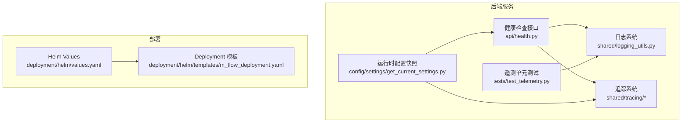
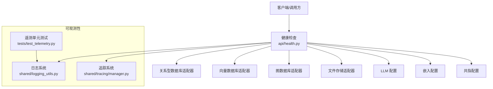
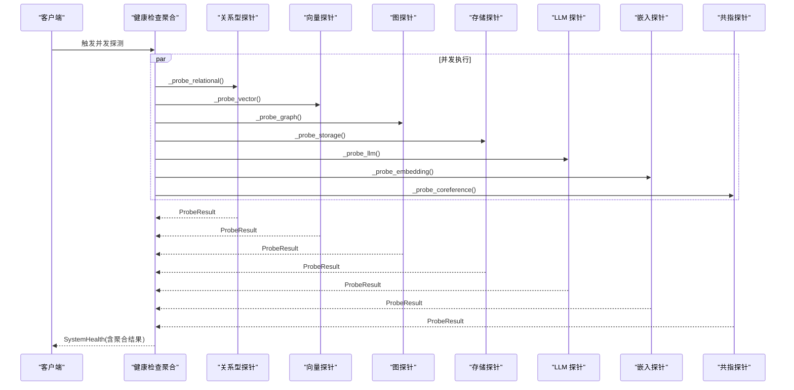
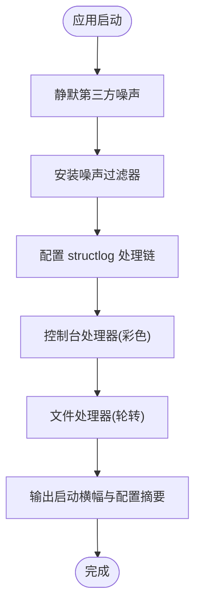
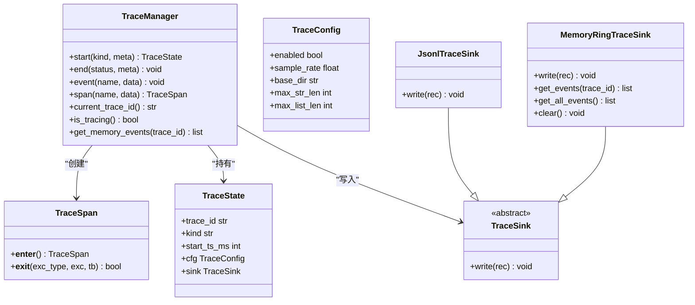
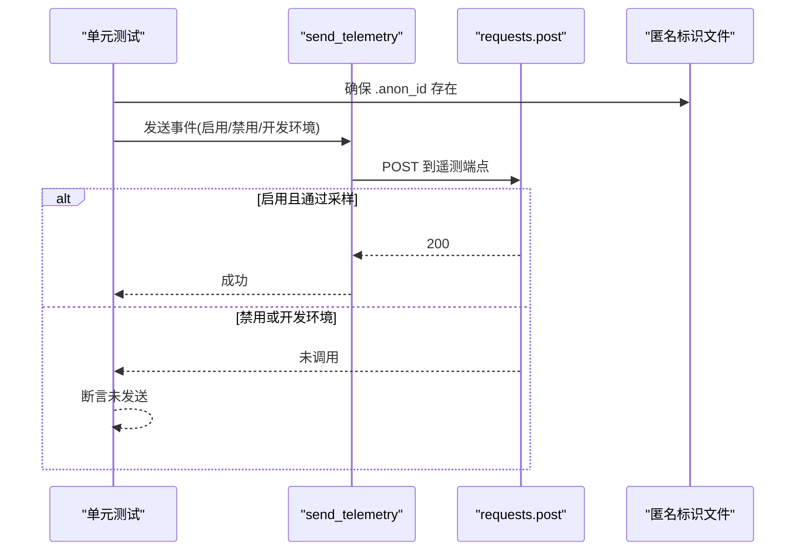
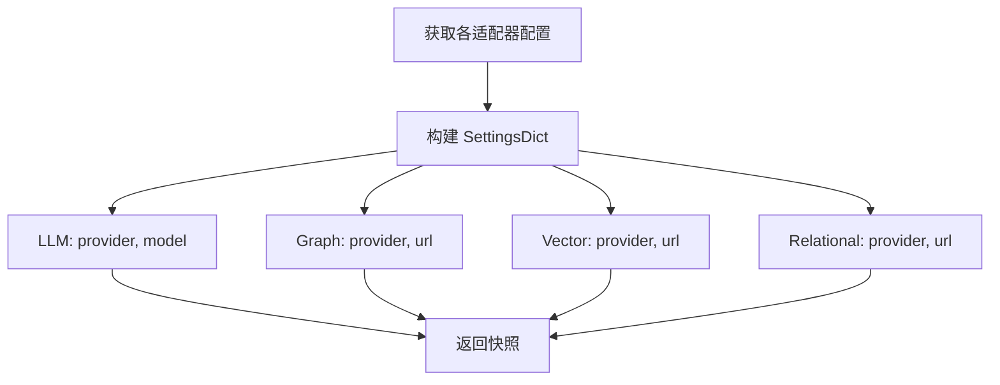
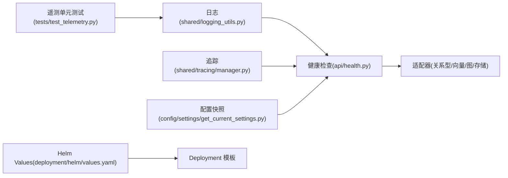

# 提供商测试与监控

<cite>
**本文引用的文件**
- [m_flow/tests/test_telemetry.py](file://m_flow/tests/test_telemetry.py)
- [m_flow/shared/logging_utils.py](file://m_flow/shared/logging_utils.py)
- [m_flow/api/health.py](file://m_flow/api/health.py)
- [m_flow/shared/tracing/__init__.py](file://m_flow/shared/tracing/__init__.py)
- [m_flow/shared/tracing/manager.py](file://m_flow/shared/tracing/manager.py)
- [m_flow/shared/tracing/sinks.py](file://m_flow/shared/tracing/sinks.py)
- [m_flow/config/settings/get_current_settings.py](file://m_flow/config/settings/get_current_settings.py)
- [deployment/helm/values.yaml](file://deployment/helm/values.yaml)
- [deployment/helm/templates/m_flow_deployment.yaml](file://deployment/helm/templates/m_flow_deployment.yaml)
</cite>

## 目录
1. [引言](#引言)
2. [项目结构](#项目结构)
3. [核心组件](#核心组件)
4. [架构总览](#架构总览)
5. [详细组件分析](#详细组件分析)
6. [依赖分析](#依赖分析)
7. [性能考量](#性能考量)
8. [故障排查指南](#故障排查指南)
9. [结论](#结论)
10. [附录](#附录)

## 引言
本指南面向“提供商测试与监控”的系统化实践，围绕以下目标展开：
- 测试策略：单元测试、集成测试与性能基准测试的组织方式与落地要点
- 监控体系：指标采集、日志记录、健康检查与告警配置
- 可观测性：分布式追踪、性能分析与错误诊断
- 测试用例编写：模拟数据准备、测试环境搭建、回归策略
- 指标设计：延迟统计、吞吐量测量、错误率跟踪
- 实战参考：测试脚本路径与监控配置模板

本指南以仓库中已实现的日志、健康检查、遥测与追踪模块为依据，结合部署模板给出可操作的实施建议。

## 项目结构
围绕“提供商测试与监控”，本项目的关键位置如下：
- 日志与可观测性：m_flow/shared/logging_utils.py、m_flow/shared/tracing/
- 健康检查：m_flow/api/health.py
- 遥测：m_flow/tests/test_telemetry.py（单元测试）
- 运行时配置快照：m_flow/config/settings/get_current_settings.py
- 部署与资源：deployment/helm/*

图表来源
- [m_flow/api/health.py:1-402](file://m_flow/api/health.py#L1-L402)
- [m_flow/shared/logging_utils.py:1-533](file://m_flow/shared/logging_utils.py#L1-L533)
- [m_flow/shared/tracing/__init__.py:1-51](file://m_flow/shared/tracing/__init__.py#L1-L51)
- [m_flow/shared/tracing/manager.py:1-280](file://m_flow/shared/tracing/manager.py#L1-L280)
- [m_flow/shared/tracing/sinks.py:1-110](file://m_flow/shared/tracing/sinks.py#L1-L110)
- [m_flow/tests/test_telemetry.py:1-98](file://m_flow/tests/test_telemetry.py#L1-L98)
- [m_flow/config/settings/get_current_settings.py:1-111](file://m_flow/config/settings/get_current_settings.py#L1-L111)
- [deployment/helm/values.yaml:1-23](file://deployment/helm/values.yaml#L1-L23)
- [deployment/helm/templates/m_flow_deployment.yaml:1-33](file://deployment/helm/templates/m_flow_deployment.yaml#L1-L33)

章节来源
- [m_flow/api/health.py:1-402](file://m_flow/api/health.py#L1-L402)
- [m_flow/shared/logging_utils.py:1-533](file://m_flow/shared/logging_utils.py#L1-L533)
- [m_flow/shared/tracing/__init__.py:1-51](file://m_flow/shared/tracing/__init__.py#L1-L51)
- [m_flow/shared/tracing/manager.py:1-280](file://m_flow/shared/tracing/manager.py#L1-L280)
- [m_flow/shared/tracing/sinks.py:1-110](file://m_flow/shared/tracing/sinks.py#L1-L110)
- [m_flow/tests/test_telemetry.py:1-98](file://m_flow/tests/test_telemetry.py#L1-L98)
- [m_flow/config/settings/get_current_settings.py:1-111](file://m_flow/config/settings/get_current_settings.py#L1-L111)
- [deployment/helm/values.yaml:1-23](file://deployment/helm/values.yaml#L1-L23)
- [deployment/helm/templates/m_flow_deployment.yaml:1-33](file://deployment/helm/templates/m_flow_deployment.yaml#L1-L33)

## 核心组件
- 健康检查系统：统一聚合数据库、向量库、图数据库、存储、LLM、嵌入与共指等组件的健康探测，返回三态聚合结果，并记录延迟与备注
- 日志系统：集中式初始化（structlog + stdlib），支持控制台彩色输出、纯文本文件轮转、第三方噪声抑制、异常钩子与启动横幅
- 分布式追踪：TraceManager 提供 trace 生命周期管理、事件记录、自动计时 Span、采样与内存环形缓冲回放
- 遥测单元测试：验证遥测开关、环境变量对发送行为的影响，以及匿名标识与负载结构
- 运行时配置快照：聚合 LLM、图数据库、向量库、关系型数据库的当前配置，便于监控与排障

章节来源
- [m_flow/api/health.py:317-384](file://m_flow/api/health.py#L317-L384)
- [m_flow/shared/logging_utils.py:340-520](file://m_flow/shared/logging_utils.py#L340-L520)
- [m_flow/shared/tracing/manager.py:107-280](file://m_flow/shared/tracing/manager.py#L107-L280)
- [m_flow/tests/test_telemetry.py:16-98](file://m_flow/tests/test_telemetry.py#L16-L98)
- [m_flow/config/settings/get_current_settings.py:71-111](file://m_flow/config/settings/get_current_settings.py#L71-L111)

## 架构总览
下图展示“提供商测试与监控”在系统中的交互关系：健康检查作为统一入口，日志与追踪贯穿请求生命周期，遥测用于外部指标上报；部署层提供资源与环境变量配置。

图表来源
- [m_flow/api/health.py:77-310](file://m_flow/api/health.py#L77-L310)
- [m_flow/shared/logging_utils.py:340-520](file://m_flow/shared/logging_utils.py#L340-L520)
- [m_flow/shared/tracing/manager.py:107-280](file://m_flow/shared/tracing/manager.py#L107-L280)
- [m_flow/tests/test_telemetry.py:16-98](file://m_flow/tests/test_telemetry.py#L16-L98)

## 详细组件分析

### 健康检查组件分析
- 探针注册：关系型、向量、图、存储、LLM、嵌入、共指七类探针，区分关键与非关键
- 并发执行：使用 asyncio.gather 并发探测，避免阻塞
- 聚合策略：关键组件 DOWN 即 DOWN，否则若存在 WARN 则 WARN，否则 UP
- 图数据库超时处理：对连接获取与查询设置超时，避免长事务导致探针阻塞
- 存储探针：本地与 S3 的读写探测，保证数据根目录可用

图表来源
- [m_flow/api/health.py:341-384](file://m_flow/api/health.py#L341-L384)
- [m_flow/api/health.py:77-310](file://m_flow/api/health.py#L77-L310)

章节来源
- [m_flow/api/health.py:317-384](file://m_flow/api/health.py#L317-L384)

### 日志系统组件分析
- 初始化流程：静默降噪第三方日志、安装过滤器、配置 structlog 处理链、控制台处理器、文件处理器（轮转）
- 文件处理器：支持结构化事件与普通日志混合输出，异常信息落盘
- 启动横幅：记录版本、平台、数据库路径、各适配器配置摘要
- 环境变量：LOG_LEVEL、LOG_FILE_NAME、LOG_FILE_LEVEL、LOG_FILE_MAX_BYTES、LOG_FILE_BACKUP_COUNT、MFLOW_LOGS_DIR、MFLOW_CLI_MODE

图表来源
- [m_flow/shared/logging_utils.py:340-520](file://m_flow/shared/logging_utils.py#L340-L520)

章节来源
- [m_flow/shared/logging_utils.py:340-520](file://m_flow/shared/logging_utils.py#L340-L520)

### 分布式追踪组件分析
- TraceManager：全局追踪管理，支持 start/end、事件记录、自动计时 Span、采样、内存环形缓冲
- 配置项：MFLOW_TRACE_ENABLED、MFLOW_TRACE_SAMPLE_RATE、MFLOW_TRACE_DIR、MFLOW_TRACE_MAX_STR、MFLOW_TRACE_MAX_LIST
- Sink：Jsonl 文件 sink（按日期分天、按 trace_id 分文件）、内存环形缓冲 sink、多 sink 组合
- 上下文：get/set/clear 当前 trace，支持测试/调试读取内存事件

图表来源
- [m_flow/shared/tracing/manager.py:107-280](file://m_flow/shared/tracing/manager.py#L107-L280)
- [m_flow/shared/tracing/sinks.py:17-110](file://m_flow/shared/tracing/sinks.py#L17-L110)
- [m_flow/shared/tracing/__init__.py:28-50](file://m_flow/shared/tracing/__init__.py#L28-L50)

章节来源
- [m_flow/shared/tracing/manager.py:107-280](file://m_flow/shared/tracing/manager.py#L107-L280)
- [m_flow/shared/tracing/sinks.py:1-110](file://m_flow/shared/tracing/sinks.py#L1-L110)
- [m_flow/shared/tracing/__init__.py:1-51](file://m_flow/shared/tracing/__init__.py#L1-L51)

### 遥测单元测试分析
- 测试目标：验证遥测开关（TELEMETRY_DISABLED）、环境变量（ENV）对发送行为的影响；校验匿名标识文件存在性；校验负载结构（事件名、用户属性、属性键值）
- Mock 策略：替换遥测端点与 requests.post，断言调用次数与参数
- 场景覆盖：启用（生产环境）、禁用（显式关闭）、开发环境默认禁用

图表来源
- [m_flow/tests/test_telemetry.py:16-98](file://m_flow/tests/test_telemetry.py#L16-L98)

章节来源
- [m_flow/tests/test_telemetry.py:16-98](file://m_flow/tests/test_telemetry.py#L16-L98)

### 运行时配置快照分析
- 功能：聚合 LLM、图数据库、向量数据库、关系型数据库的当前配置，生成统一 SettingsDict
- 输出字段：provider、model/url 等关键信息，便于监控面板与运维界面展示
- 关键逻辑：根据配置对象动态拼接 URL 字段

图表来源
- [m_flow/config/settings/get_current_settings.py:71-111](file://m_flow/config/settings/get_current_settings.py#L71-L111)

章节来源
- [m_flow/config/settings/get_current_settings.py:71-111](file://m_flow/config/settings/get_current_settings.py#L71-L111)

## 依赖分析
- 健康检查对各适配器的懒加载导入，避免启动时副作用
- 日志系统对 structlog 的集中配置，屏蔽第三方噪声
- 追踪系统对环境变量的解耦，支持运行期开关与采样
- 遥测单元测试对网络层的隔离，仅断言行为而非真实发送
- 部署层通过 Helm Values 控制镜像、端口、资源与环境变量

图表来源
- [m_flow/api/health.py:77-310](file://m_flow/api/health.py#L77-L310)
- [m_flow/shared/logging_utils.py:340-520](file://m_flow/shared/logging_utils.py#L340-L520)
- [m_flow/shared/tracing/manager.py:107-280](file://m_flow/shared/tracing/manager.py#L107-L280)
- [m_flow/tests/test_telemetry.py:16-98](file://m_flow/tests/test_telemetry.py#L16-L98)
- [m_flow/config/settings/get_current_settings.py:71-111](file://m_flow/config/settings/get_current_settings.py#L71-L111)
- [deployment/helm/values.yaml:1-23](file://deployment/helm/values.yaml#L1-L23)
- [deployment/helm/templates/m_flow_deployment.yaml:1-33](file://deployment/helm/templates/m_flow_deployment.yaml#L1-L33)

章节来源
- [m_flow/api/health.py:77-310](file://m_flow/api/health.py#L77-L310)
- [m_flow/shared/logging_utils.py:340-520](file://m_flow/shared/logging_utils.py#L340-L520)
- [m_flow/shared/tracing/manager.py:107-280](file://m_flow/shared/tracing/manager.py#L107-L280)
- [m_flow/tests/test_telemetry.py:16-98](file://m_flow/tests/test_telemetry.py#L16-L98)
- [m_flow/config/settings/get_current_settings.py:71-111](file://m_flow/config/settings/get_current_settings.py#L71-L111)
- [deployment/helm/values.yaml:1-23](file://deployment/helm/values.yaml#L1-L23)
- [deployment/helm/templates/m_flow_deployment.yaml:1-33](file://deployment/helm/templates/m_flow_deployment.yaml#L1-L33)

## 性能考量
- 健康检查并发：使用 asyncio.gather 并发探测，降低整体延迟
- 图数据库超时：对连接与查询设置超时，避免阻塞探针
- 日志轮转：文件处理器支持最大字节与备份数控制，避免磁盘膨胀
- 追踪采样：通过采样率与内存环形缓冲平衡开销与可观测性
- 部署资源：Helm Values 中定义 CPU 与内存限制，结合实际负载压测调整

## 故障排查指南
- 健康检查 DOWN/WARN 定位
  - 查看聚合结果中的组件状态与备注，优先处理关键组件（数据库、存储、LLM、嵌入）
  - 对图数据库关注“连接超时/查询超时”提示，排查写入锁或查询阻塞
- 日志定位
  - 使用 get_log_file_location 获取当前日志文件路径
  - 结合结构化事件与异常栈，快速定位问题
- 追踪定位
  - 在问题发生前后，使用 MemoryRingTraceSink 回放最近事件
  - 通过环境变量开启/采样追踪，避免线上性能影响
- 遥测验证
  - 确认 .anon_id 存在与内容有效
  - 检查 TELEMETRY_DISABLED 与 ENV 环境变量是否符合预期
  - 校验负载结构与端点配置

章节来源
- [m_flow/api/health.py:341-384](file://m_flow/api/health.py#L341-L384)
- [m_flow/shared/logging_utils.py:527-533](file://m_flow/shared/logging_utils.py#L527-L533)
- [m_flow/shared/tracing/manager.py:267-280](file://m_flow/shared/tracing/manager.py#L267-L280)
- [m_flow/tests/test_telemetry.py:16-98](file://m_flow/tests/test_telemetry.py#L16-L98)

## 结论
本项目提供了从健康检查到日志、追踪与遥测的完整可观测性闭环。通过并发健康探测、集中日志与结构化事件、可采样的分布式追踪，以及受控的遥测上报，能够有效支撑提供商测试与监控需求。配合 Helm 部署模板，可在不同环境中稳定运行并持续优化。

## 附录

### 测试策略与用例编写指南
- 单元测试
  - 遥测：断言开关与环境变量对发送行为的影响，Mock 网络层
  - 日志：断言结构化事件格式、异常栈落盘、噪声过滤
  - 追踪：断言事件写入、Span 计时、内存缓冲回放
- 集成测试
  - 健康检查：在真实后端（数据库、存储、LLM）上验证探针连通性与超时处理
  - 配置快照：验证聚合输出与 URL 拼接逻辑
- 性能基准测试
  - 健康检查：在不同并发度下测量聚合耗时
  - 日志：评估轮转与异常栈写入对吞吐的影响
  - 追踪：对比采样率与内存缓冲对性能的影响

章节来源
- [m_flow/tests/test_telemetry.py:16-98](file://m_flow/tests/test_telemetry.py#L16-L98)
- [m_flow/shared/logging_utils.py:340-520](file://m_flow/shared/logging_utils.py#L340-L520)
- [m_flow/shared/tracing/manager.py:107-280](file://m_flow/shared/tracing/manager.py#L107-L280)
- [m_flow/api/health.py:341-384](file://m_flow/api/health.py#L341-L384)
- [m_flow/config/settings/get_current_settings.py:71-111](file://m_flow/config/settings/get_current_settings.py#L71-L111)

### 监控指标设计建议
- 延迟统计
  - 健康检查：每个探针的 latency_ms，聚合后的 alive_seconds
  - 追踪：span.start/span.end 的 dur_ms
- 吞吐量测量
  - 健康检查：单位时间内的探测次数与成功比例
  - 日志：文件处理器写入速率与轮转频率
- 错误率跟踪
  - 健康检查：DOWN/WARN 组件占比与错误备注分布
  - 遥测：发送失败次数与端点响应码统计
  - 日志：ERROR/WARNING 级别事件计数

章节来源
- [m_flow/api/health.py:341-384](file://m_flow/api/health.py#L341-L384)
- [m_flow/shared/tracing/manager.py:77-105](file://m_flow/shared/tracing/manager.py#L77-L105)
- [m_flow/shared/logging_utils.py:340-520](file://m_flow/shared/logging_utils.py#L340-L520)
- [m_flow/tests/test_telemetry.py:16-98](file://m_flow/tests/test_telemetry.py#L16-L98)

### 测试脚本与监控配置模板参考路径
- 遥测单元测试脚本路径
  - [m_flow/tests/test_telemetry.py:1-98](file://m_flow/tests/test_telemetry.py#L1-L98)
- 健康检查接口路径
  - [m_flow/api/health.py:1-402](file://m_flow/api/health.py#L1-L402)
- 日志系统初始化与配置路径
  - [m_flow/shared/logging_utils.py:340-520](file://m_flow/shared/logging_utils.py#L340-L520)
- 分布式追踪管理器与 Sink 路径
  - [m_flow/shared/tracing/manager.py:1-280](file://m_flow/shared/tracing/manager.py#L1-L280)
  - [m_flow/shared/tracing/sinks.py:1-110](file://m_flow/shared/tracing/sinks.py#L1-L110)
- 运行时配置快照路径
  - [m_flow/config/settings/get_current_settings.py:1-111](file://m_flow/config/settings/get_current_settings.py#L1-L111)
- Helm 部署配置模板路径
  - [deployment/helm/values.yaml:1-23](file://deployment/helm/values.yaml#L1-L23)
  - [deployment/helm/templates/m_flow_deployment.yaml:1-33](file://deployment/helm/templates/m_flow_deployment.yaml#L1-L33)