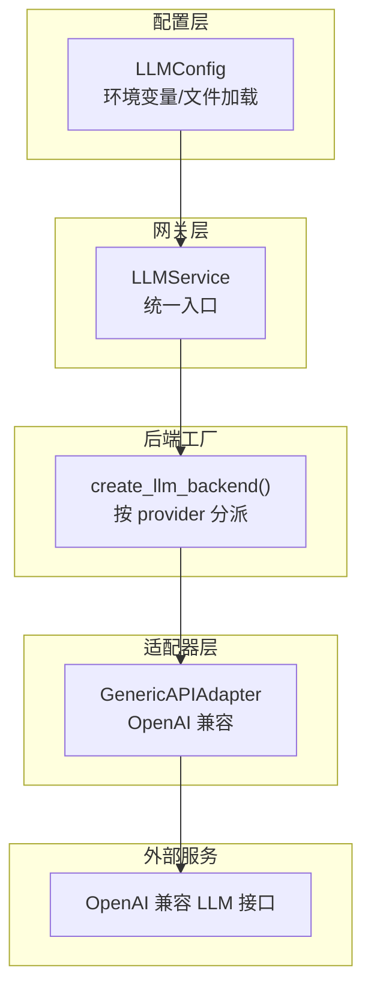
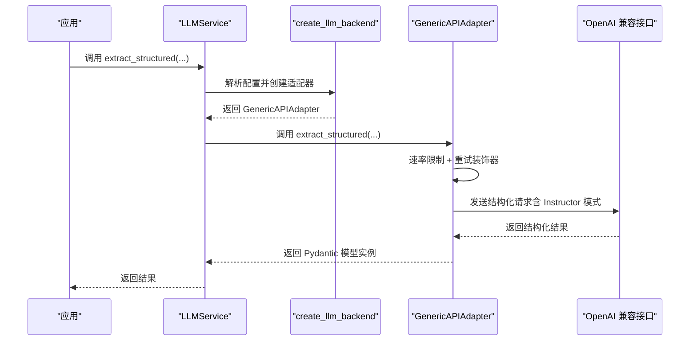
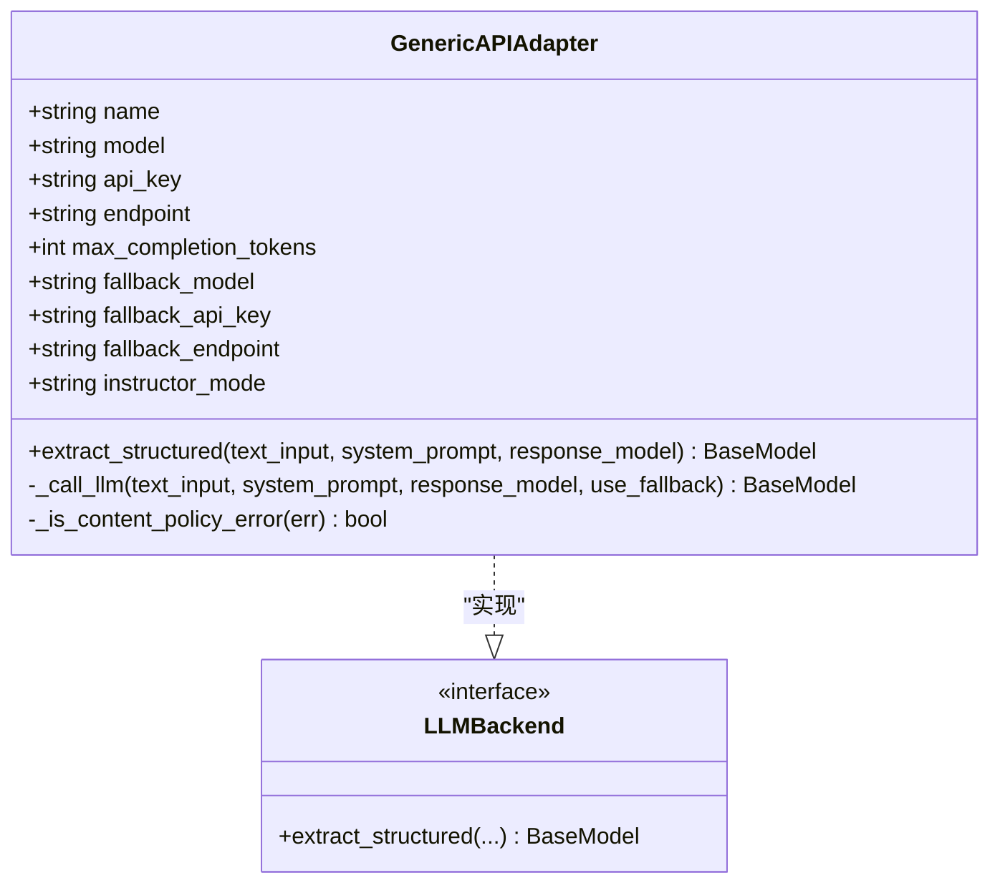
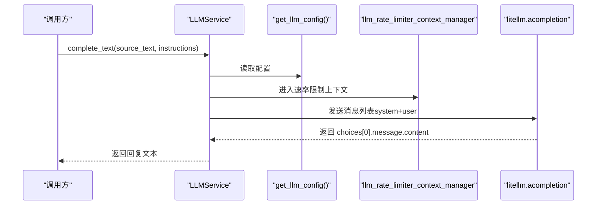
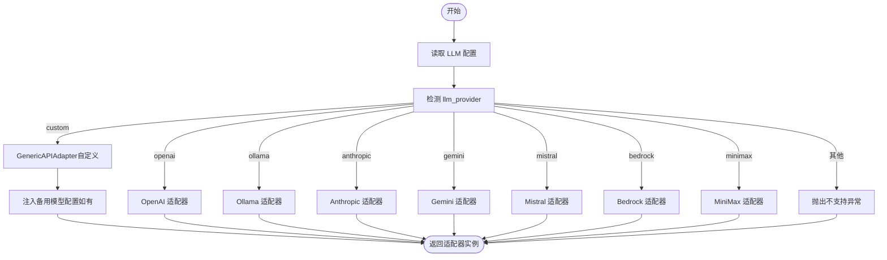
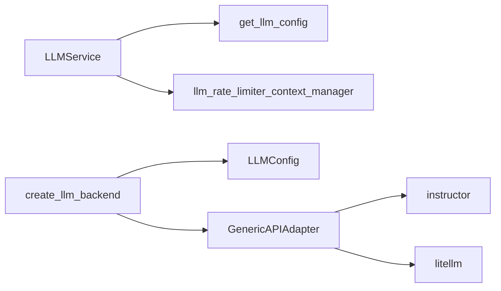

# 自定义 LLM 提供商

<cite>
**本文引用的文件**
- [CUSTOM_LLM_PROVIDERS.md](file://docs/CUSTOM_LLM_PROVIDERS.md)
- [LLMGateway.py](file://m_flow/llm/LLMGateway.py)
- [config.py](file://m_flow/llm/config.py)
- [utils.py](file://m_flow/llm/utils.py)
- [__init__.py](file://m_flow/llm/__init__.py)
- [get_llm_client.py](file://m_flow/llm/backends/litellm_instructor/llm/get_llm_client.py)
- [adapter.py](file://m_flow/llm/backends/litellm_instructor/llm/generic_llm_api/adapter.py)
- [test_generic_api_adapter.py](file://m_flow/tests/unit/infrastructure/llm/test_generic_api_adapter.py)
</cite>

## 目录
1. [简介](#简介)
2. [项目结构](#项目结构)
3. [核心组件](#核心组件)
4. [架构总览](#架构总览)
5. [组件详解](#组件详解)
6. [依赖关系分析](#依赖关系分析)
7. [性能与可扩展性](#性能与可扩展性)
8. [故障排除指南](#故障排除指南)
9. [结论](#结论)
10. [附录：配置与示例路径](#附录配置与示例路径)

## 简介
本指南面向希望在 M-Flow 中接入新的大语言模型提供商（尤其是 OpenAI 兼容接口）的开发者。文档覆盖以下主题：
- 如何通过“自定义”提供商对接任意 OpenAI 兼容的推理/结构化输出接口
- 请求与响应格式转换、错误处理与内容策略回退机制
- LLM 网关的扩展方法（客户端初始化、请求路由、响应解析）
- 配置系统集成（环境变量、配置文件与运行时参数）
- 实战示例（认证、速率限制、重试策略）
- 性能优化、监控指标与常见问题排查

## 项目结构
围绕 LLM 的关键模块与文件如下：
- 配置层：负责从环境变量与 .env 文件加载 LLM 设置，支持 BAML 与 Instructor 双框架切换
- 网关层：统一对外暴露结构化抽取、文本补全、音频转写、图像描述等能力
- 后端工厂：根据配置选择具体适配器（OpenAI、Ollama、Anthropic、Gemini、自定义、Mistral、Bedrock、MiniMax）
- 通用适配器：为任意 OpenAI 兼容接口提供结构化输出与内容策略回退

图表来源
- [config.py:38-209](file://m_flow/llm/config.py#L38-L209)
- [LLMGateway.py:60-168](file://m_flow/llm/LLMGateway.py#L60-L168)
- [get_llm_client.py:27-166](file://m_flow/llm/backends/litellm_instructor/llm/get_llm_client.py#L27-L166)
- [adapter.py:44-161](file://m_flow/llm/backends/litellm_instructor/llm/generic_llm_api/adapter.py#L44-L161)

章节来源
- [config.py:38-209](file://m_flow/llm/config.py#L38-L209)
- [LLMGateway.py:60-168](file://m_flow/llm/LLMGateway.py#L60-L168)
- [get_llm_client.py:27-166](file://m_flow/llm/backends/litellm_instructor/llm/get_llm_client.py#L27-L166)
- [adapter.py:44-161](file://m_flow/llm/backends/litellm_instructor/llm/generic_llm_api/adapter.py#L44-L161)

## 核心组件
- LLM 配置（LLMConfig）
  - 支持主模型与备用模型（回退）配置
  - 支持 Instructor 模式（json_mode、tool_call、markdown_json_mode）
  - 支持速率限制开关与额度
  - 支持 BAML 注册表（可选）
- LLM 网关（LLMService）
  - 统一结构化抽取、文本补全、音频转写、图像描述
  - 内置指数退避重试与速率限制
- 后端工厂（create_llm_backend）
  - 基于配置选择适配器（含 CUSTOM）
  - 自动推导最大补全 token 上限
- 通用适配器（GenericAPIAdapter）
  - 面向任意 OpenAI 兼容接口
  - 结构化输出由 Instructor 强制校验
  - 内容策略违规自动回退到备用模型

章节来源
- [config.py:38-209](file://m_flow/llm/config.py#L38-L209)
- [LLMGateway.py:60-168](file://m_flow/llm/LLMGateway.py#L60-L168)
- [get_llm_client.py:27-166](file://m_flow/llm/backends/litellm_instructor/llm/get_llm_client.py#L27-L166)
- [adapter.py:44-161](file://m_flow/llm/backends/litellm_instructor/llm/generic_llm_api/adapter.py#L44-L161)

## 架构总览
下图展示了从应用调用到外部 LLM 的完整链路，以及“自定义”提供商如何通过通用适配器桥接。

图表来源
- [LLMGateway.py:60-168](file://m_flow/llm/LLMGateway.py#L60-L168)
- [get_llm_client.py:27-166](file://m_flow/llm/backends/litellm_instructor/llm/get_llm_client.py#L27-L166)
- [adapter.py:132-161](file://m_flow/llm/backends/litellm_instructor/llm/generic_llm_api/adapter.py#L132-L161)

## 组件详解

### 通用适配器（GenericAPIAdapter）类图
该适配器实现了 LLMBackend 协议，负责：
- 将用户输入与系统提示封装为 OpenAI 兼容的消息数组
- 通过 Instructor 强制结构化输出
- 在内容策略错误时自动回退到备用模型
- 使用速率限制上下文与指数退避重试

图表来源
- [adapter.py:44-161](file://m_flow/llm/backends/litellm_instructor/llm/generic_llm_api/adapter.py#L44-L161)

章节来源
- [adapter.py:44-161](file://m_flow/llm/backends/litellm_instructor/llm/generic_llm_api/adapter.py#L44-L161)

### LLM 网关（LLMService）序列图
网关负责：
- 根据配置选择 BAML 或 Instructor 后端
- 对文本补全进行统一的速率限制与指数退避重试
- 暴露结构化抽取、同步/异步、音频转写、图像描述等能力

图表来源
- [LLMGateway.py:126-168](file://m_flow/llm/LLMGateway.py#L126-L168)

章节来源
- [LLMGateway.py:60-168](file://m_flow/llm/LLMGateway.py#L60-L168)

### 后端工厂（create_llm_backend）流程图
工厂根据配置选择适配器，其中 CUSTOM 分支会返回 GenericAPIAdapter 并注入备用模型信息。

图表来源
- [get_llm_client.py:27-166](file://m_flow/llm/backends/litellm_instructor/llm/get_llm_client.py#L27-L166)

章节来源
- [get_llm_client.py:27-166](file://m_flow/llm/backends/litellm_instructor/llm/get_llm_client.py#L27-L166)

### 错误处理与内容策略回退
- 内容策略错误识别：InstructorRetryException、ContentFilterFinishReasonError、ContentPolicyViolationError
- 当发生内容策略错误且存在备用模型时，自动切换到备用端点；若备用端点仍触发内容策略错误，则抛出统一异常类型
- 对于非内容策略错误（如 404、400、401），使用指数退避重试装饰器自动重试

章节来源
- [adapter.py:83-161](file://m_flow/llm/backends/litellm_instructor/llm/generic_llm_api/adapter.py#L83-L161)
- [LLMGateway.py:113-125](file://m_flow/llm/LLMGateway.py#L113-L125)

### 配置系统集成
- 环境变量前缀：MFLOW_
- 关键字段（节选）：llm_provider、llm_model、llm_endpoint、llm_api_key、llm_api_version、llm_instructor_mode、llm_rate_limit_*、fallback_*、backends
- .env 文件与环境变量优先级：后者覆盖前者
- BAML 注册表：当 backends=baml 时，动态注册 LLM 客户端并设为主客户端

章节来源
- [config.py:38-209](file://m_flow/llm/config.py#L38-L209)

## 依赖关系分析
- LLMService 依赖配置获取与速率限制上下文管理器
- create_llm_backend 依赖 LLMConfig 与各适配器实现
- GenericAPIAdapter 依赖 Instructor 与 LiteLLM，并通过速率限制与重试装饰器增强鲁棒性

图表来源
- [LLMGateway.py:138-143](file://m_flow/llm/LLMGateway.py#L138-L143)
- [get_llm_client.py:49-56](file://m_flow/llm/backends/litellm_instructor/llm/get_llm_client.py#L49-L56)
- [adapter.py:81-82](file://m_flow/llm/backends/litellm_instructor/llm/generic_llm_api/adapter.py#L81-L82)

章节来源
- [LLMGateway.py:138-143](file://m_flow/llm/LLMGateway.py#L138-L143)
- [get_llm_client.py:49-56](file://m_flow/llm/backends/litellm_instructor/llm/get_llm_client.py#L49-L56)
- [adapter.py:81-82](file://m_flow/llm/backends/litellm_instructor/llm/generic_llm_api/adapter.py#L81-L82)

## 性能与可扩展性
- 最大补全 token 上限推导：优先使用 LiteLLM 模型注册表中的上限，否则回退到配置项
- 分块令牌预算：嵌入引擎上限与 LLM 上下文的一半取较小值，避免单次分块过大导致截断
- 速率限制：可开启全局 LLM 速率限制，避免触发上游配额
- 重试策略：对瞬时错误采用指数退避（上限 120 秒），对内容策略错误不重试，改走回退逻辑

章节来源
- [utils.py:27-82](file://m_flow/llm/utils.py#L27-L82)
- [config.py:75-88](file://m_flow/llm/config.py#L75-L88)
- [adapter.py:119-131](file://m_flow/llm/backends/litellm_instructor/llm/generic_llm_api/adapter.py#L119-L131)
- [LLMGateway.py:113-125](file://m_flow/llm/LLMGateway.py#L113-L125)

## 故障排除指南
- “模型不存在”：LiteLLM 内部模型注册表未收录时，可在模型名前加前缀以强制走 OpenAI 兼容路径
- 结构化输出返回原始文本：某些提供商忽略 response_format，切换到 markdown_json_mode
- 速率限制：启用内置速率限制并合理设置请求数与时间窗口
- 端点 URL：大多数情况下不要带 /v1 后缀，LiteLLM 会自动拼接
- 连通性探测：使用工具函数发起最小化结构化请求或嵌入请求验证连通性

章节来源
- [CUSTOM_LLM_PROVIDERS.md:95-140](file://docs/CUSTOM_LLM_PROVIDERS.md#L95-L140)
- [utils.py:90-126](file://m_flow/llm/utils.py#L90-L126)

## 结论
通过“自定义”提供商与通用适配器，M-Flow 能够以最小改动接入任意 OpenAI 兼容接口，同时借助 Instructor 的结构化输出能力与内容策略回退机制，确保在多变的外部环境中保持稳定与可控。配合统一的配置系统、速率限制与重试策略，开发者可以快速完成新提供商的集成与上线。

## 附录：配置与示例路径
- 快速开始与推荐预设：参见文档
- 环境变量与 .env 文件：参见配置类字段定义
- 示例：结构化抽取最小化验证（参考测试用例）

章节来源
- [CUSTOM_LLM_PROVIDERS.md:16-203](file://docs/CUSTOM_LLM_PROVIDERS.md#L16-L203)
- [config.py:38-209](file://m_flow/llm/config.py#L38-L209)
- [test_generic_api_adapter.py:73-199](file://m_flow/tests/unit/infrastructure/llm/test_generic_api_adapter.py#L73-L199)