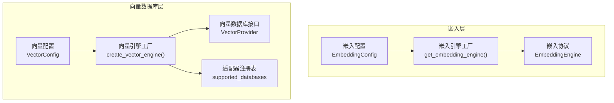
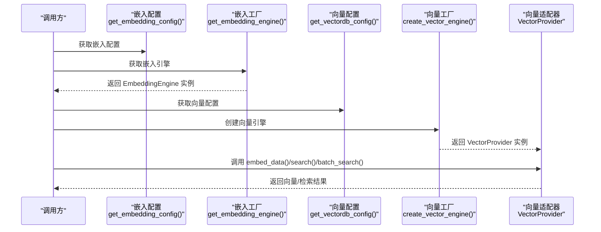
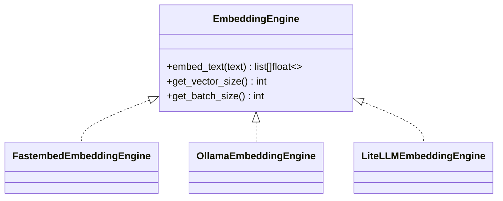
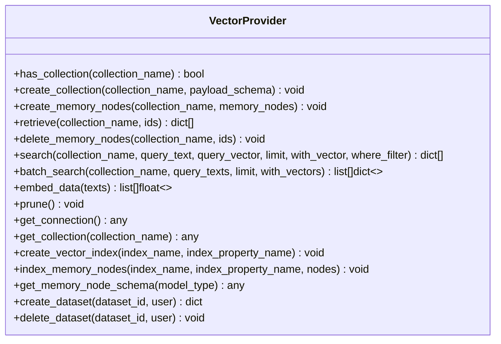
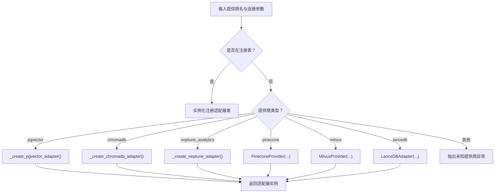
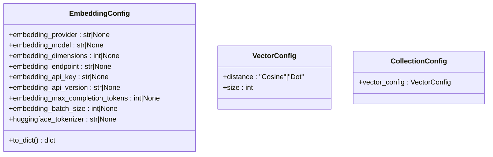
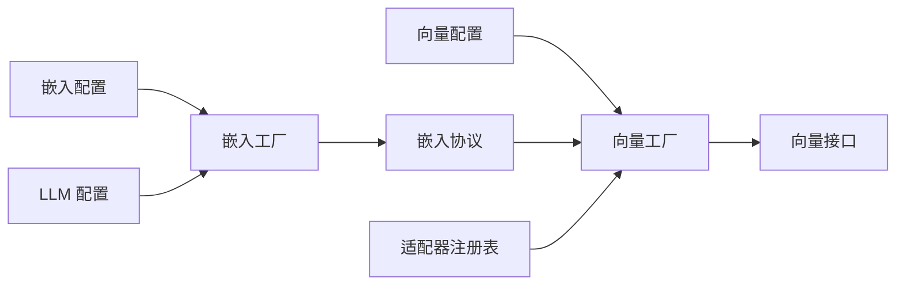

# 自定义向量嵌入提供商

<cite>
**本文档引用的文件**
- [m_flow/adapters/vector/__init__.py](file://m_flow/adapters/vector/__init__.py)
- [m_flow/adapters/vector/config.py](file://m_flow/adapters/vector/config.py)
- [m_flow/adapters/vector/create_vector_engine.py](file://m_flow/adapters/vector/create_vector_engine.py)
- [m_flow/adapters/vector/get_vector_adapter.py](file://m_flow/adapters/vector/get_vector_adapter.py)
- [m_flow/adapters/vector/supported_databases.py](file://m_flow/adapters/vector/supported_databases.py)
- [m_flow/adapters/vector/vector_db_interface.py](file://m_flow/adapters/vector/vector_db_interface.py)
- [m_flow/adapters/vector/models/CollectionConfig.py](file://m_flow/adapters/vector/models/CollectionConfig.py)
- [m_flow/adapters/vector/models/VectorConfig.py](file://m_flow/adapters/vector/models/VectorConfig.py)
- [m_flow/adapters/vector/embeddings/EmbeddingEngine.py](file://m_flow/adapters/vector/embeddings/EmbeddingEngine.py)
- [m_flow/adapters/vector/embeddings/get_embedding_engine.py](file://m_flow/adapters/vector/embeddings/get_embedding_engine.py)
- [m_flow/adapters/vector/embeddings/config.py](file://m_flow/adapters/vector/embeddings/config.py)
</cite>

## 目录
1. [简介](#简介)
2. [项目结构](#项目结构)
3. [核心组件](#核心组件)
4. [架构总览](#架构总览)
5. [详细组件分析](#详细组件分析)
6. [依赖关系分析](#依赖关系分析)
7. [性能考虑](#性能考虑)
8. [故障排查指南](#故障排查指南)
9. [结论](#结论)
10. [附录](#附录)

## 简介
本指南面向希望在系统中添加自定义向量嵌入提供商的开发者，涵盖以下关键主题：
- 如何实现新的嵌入模型提供商（文本编码器集成）
- 批量处理优化与内存管理策略
- 嵌入引擎扩展方法（模型加载、推理加速、结果标准化）
- 嵌入配置系统的集成（模型参数、缓存策略、性能调优）
- 具体实现示例：创建自定义嵌入适配器（模型注册、批量处理、错误恢复）
- 性能基准测试、内存使用优化与部署最佳实践

## 项目结构
向量嵌入能力由“嵌入引擎”和“向量数据库适配器”两部分组成：
- 嵌入引擎负责将文本转换为向量，支持本地与云端多种后端
- 向量数据库适配器负责集合管理、数据增删改查、语义检索与索引维护

**图表来源**
- [m_flow/adapters/vector/embeddings/config.py:16-68](file://m_flow/adapters/vector/embeddings/config.py#L16-L68)
- [m_flow/adapters/vector/embeddings/get_embedding_engine.py:16-99](file://m_flow/adapters/vector/embeddings/get_embedding_engine.py#L16-L99)
- [m_flow/adapters/vector/embeddings/EmbeddingEngine.py:14-63](file://m_flow/adapters/vector/embeddings/EmbeddingEngine.py#L14-L63)
- [m_flow/adapters/vector/config.py:26-76](file://m_flow/adapters/vector/config.py#L26-L76)
- [m_flow/adapters/vector/create_vector_engine.py:15-111](file://m_flow/adapters/vector/create_vector_engine.py#L15-L111)
- [m_flow/adapters/vector/vector_db_interface.py:16-179](file://m_flow/adapters/vector/vector_db_interface.py#L16-L179)
- [m_flow/adapters/vector/supported_databases.py:7](file://m_flow/adapters/vector/supported_databases.py#L7)

**章节来源**
- [m_flow/adapters/vector/__init__.py:1-7](file://m_flow/adapters/vector/__init__.py#L1-L7)
- [m_flow/adapters/vector/config.py:26-76](file://m_flow/adapters/vector/config.py#L26-L76)
- [m_flow/adapters/vector/create_vector_engine.py:15-111](file://m_flow/adapters/vector/create_vector_engine.py#L15-L111)
- [m_flow/adapters/vector/get_vector_adapter.py:11-18](file://m_flow/adapters/vector/get_vector_adapter.py#L11-L18)
- [m_flow/adapters/vector/supported_databases.py:7](file://m_flow/adapters/vector/supported_databases.py#L7)
- [m_flow/adapters/vector/vector_db_interface.py:16-179](file://m_flow/adapters/vector/vector_db_interface.py#L16-L179)
- [m_flow/adapters/vector/models/CollectionConfig.py:15-18](file://m_flow/adapters/vector/models/CollectionConfig.py#L15-L18)
- [m_flow/adapters/vector/models/VectorConfig.py:20-47](file://m_flow/adapters/vector/models/VectorConfig.py#L20-L47)
- [m_flow/adapters/vector/embeddings/EmbeddingEngine.py:14-63](file://m_flow/adapters/vector/embeddings/EmbeddingEngine.py#L14-L63)
- [m_flow/adapters/vector/embeddings/get_embedding_engine.py:16-99](file://m_flow/adapters/vector/embeddings/get_embedding_engine.py#L16-L99)
- [m_flow/adapters/vector/embeddings/config.py:16-68](file://m_flow/adapters/vector/embeddings/config.py#L16-L68)

## 核心组件
- 嵌入配置模型：定义嵌入提供商、模型标识、维度、批大小、令牌上限等参数，并提供序列化与默认值处理
- 嵌入引擎协议：统一的异步嵌入接口，要求实现 embed_text、get_vector_size、get_batch_size
- 嵌入引擎工厂：根据配置动态构建具体引擎实例，支持 fastembed、ollama、LiteLLM 等后端
- 向量配置模型：定义距离度量（余弦/点积）与向量维度，用于集合创建与检索一致性
- 向量数据库接口：抽象出集合管理、节点 CRUD、搜索、批量搜索、嵌入生成、维护操作等能力
- 向量引擎工厂：基于提供商名称选择或注册适配器，组装嵌入引擎与底层存储
- 适配器注册表：允许第三方以键值方式注册自定义适配器类

**章节来源**
- [m_flow/adapters/vector/embeddings/config.py:16-68](file://m_flow/adapters/vector/embeddings/config.py#L16-L68)
- [m_flow/adapters/vector/embeddings/EmbeddingEngine.py:14-63](file://m_flow/adapters/vector/embeddings/EmbeddingEngine.py#L14-L63)
- [m_flow/adapters/vector/embeddings/get_embedding_engine.py:16-99](file://m_flow/adapters/vector/embeddings/get_embedding_engine.py#L16-L99)
- [m_flow/adapters/vector/models/VectorConfig.py:20-47](file://m_flow/adapters/vector/models/VectorConfig.py#L20-L47)
- [m_flow/adapters/vector/vector_db_interface.py:16-179](file://m_flow/adapters/vector/vector_db_interface.py#L16-L179)
- [m_flow/adapters/vector/create_vector_engine.py:15-111](file://m_flow/adapters/vector/create_vector_engine.py#L15-L111)
- [m_flow/adapters/vector/supported_databases.py:7](file://m_flow/adapters/vector/supported_databases.py#L7)

## 架构总览
下图展示了从配置到引擎再到适配器的整体流程，以及嵌入引擎与向量适配器之间的协作关系。

**图表来源**
- [m_flow/adapters/vector/embeddings/get_embedding_engine.py:16-38](file://m_flow/adapters/vector/embeddings/get_embedding_engine.py#L16-L38)
- [m_flow/adapters/vector/get_vector_adapter.py:11-18](file://m_flow/adapters/vector/get_vector_adapter.py#L11-L18)
- [m_flow/adapters/vector/create_vector_engine.py:15-111](file://m_flow/adapters/vector/create_vector_engine.py#L15-L111)
- [m_flow/adapters/vector/vector_db_interface.py:16-179](file://m_flow/adapters/vector/vector_db_interface.py#L16-L179)

## 详细组件分析

### 嵌入引擎协议与工厂
- 协议职责：统一 embed_text 接口，返回与模型维度一致的浮点向量；提供 get_vector_size 与 get_batch_size 以指导批量策略
- 工厂职责：读取嵌入配置与 LLM 配置，按提供商类型动态构建具体引擎；对构建过程进行 LRU 缓存，避免重复初始化
- 支持的提供商：fastembed（本地）、ollama（本地服务）、LiteLLM（OpenAI 兼容）

**图表来源**
- [m_flow/adapters/vector/embeddings/EmbeddingEngine.py:14-63](file://m_flow/adapters/vector/embeddings/EmbeddingEngine.py#L14-L63)
- [m_flow/adapters/vector/embeddings/get_embedding_engine.py:60-99](file://m_flow/adapters/vector/embeddings/get_embedding_engine.py#L60-L99)

**章节来源**
- [m_flow/adapters/vector/embeddings/EmbeddingEngine.py:14-63](file://m_flow/adapters/vector/embeddings/EmbeddingEngine.py#L14-L63)
- [m_flow/adapters/vector/embeddings/get_embedding_engine.py:16-99](file://m_flow/adapters/vector/embeddings/get_embedding_engine.py#L16-L99)

### 向量数据库适配器接口
- 集合管理：has_collection、create_collection
- 节点 CRUD：create_memory_nodes、retrieve、delete_memory_nodes
- 搜索：search（支持文本或向量查询）、batch_search（批量查询）
- 嵌入：embed_data（直接生成向量）
- 维护：prune（清理过期数据）
- 可选扩展：get_connection、get_collection、create_vector_index、index_memory_nodes、get_memory_node_schema
- 多租户钩子：create_dataset、delete_dataset

**图表来源**
- [m_flow/adapters/vector/vector_db_interface.py:16-179](file://m_flow/adapters/vector/vector_db_interface.py#L16-L179)

**章节来源**
- [m_flow/adapters/vector/vector_db_interface.py:16-179](file://m_flow/adapters/vector/vector_db_interface.py#L16-L179)

### 向量引擎工厂与适配器注册
- 工厂逻辑：优先检查已注册的适配器映射，再按提供商名称分支创建；未知提供商抛出环境异常
- 注册表：通过字典将字符串提供商名映射到适配器类，便于扩展自定义提供商
- 典型适配器：PGVector、ChromaDB、LanceDB、Neptune Analytics、Pinecone、Milvus

**图表来源**
- [m_flow/adapters/vector/create_vector_engine.py:15-111](file://m_flow/adapters/vector/create_vector_engine.py#L15-L111)
- [m_flow/adapters/vector/supported_databases.py:7](file://m_flow/adapters/vector/supported_databases.py#L7)

**章节来源**
- [m_flow/adapters/vector/create_vector_engine.py:15-111](file://m_flow/adapters/vector/create_vector_engine.py#L15-L111)
- [m_flow/adapters/vector/supported_databases.py:7](file://m_flow/adapters/vector/supported_databases.py#L7)

### 配置系统与数据模型
- 嵌入配置：提供提供商、模型、维度、批大小、令牌上限、端点、密钥、版本、HF 分词器等字段
- 向量配置：定义距离度量（余弦/点积）与向量维度，确保检索一致性
- 集合配置：封装单个命名嵌入集合的存储参数

**图表来源**
- [m_flow/adapters/vector/embeddings/config.py:16-68](file://m_flow/adapters/vector/embeddings/config.py#L16-L68)
- [m_flow/adapters/vector/models/VectorConfig.py:20-47](file://m_flow/adapters/vector/models/VectorConfig.py#L20-L47)
- [m_flow/adapters/vector/models/CollectionConfig.py:15-18](file://m_flow/adapters/vector/models/CollectionConfig.py#L15-L18)

**章节来源**
- [m_flow/adapters/vector/embeddings/config.py:16-68](file://m_flow/adapters/vector/embeddings/config.py#L16-L68)
- [m_flow/adapters/vector/models/VectorConfig.py:20-47](file://m_flow/adapters/vector/models/VectorConfig.py#L20-L47)
- [m_flow/adapters/vector/models/CollectionConfig.py:15-18](file://m_flow/adapters/vector/models/CollectionConfig.py#L15-L18)

## 依赖关系分析
- 嵌入层依赖于配置模块与 LLM 配置，通过工厂函数统一构建
- 向量层依赖于嵌入引擎与配置模块，通过工厂函数创建适配器
- 适配器注册表为扩展提供了最小耦合点，新增提供商只需注册映射或在工厂中增加分支

**图表来源**
- [m_flow/adapters/vector/embeddings/get_embedding_engine.py:16-38](file://m_flow/adapters/vector/embeddings/get_embedding_engine.py#L16-L38)
- [m_flow/adapters/vector/get_vector_adapter.py:11-18](file://m_flow/adapters/vector/get_vector_adapter.py#L11-L18)
- [m_flow/adapters/vector/create_vector_engine.py:15-111](file://m_flow/adapters/vector/create_vector_engine.py#L15-L111)
- [m_flow/adapters/vector/supported_databases.py:7](file://m_flow/adapters/vector/supported_databases.py#L7)

**章节来源**
- [m_flow/adapters/vector/embeddings/get_embedding_engine.py:16-38](file://m_flow/adapters/vector/embeddings/get_embedding_engine.py#L16-L38)
- [m_flow/adapters/vector/get_vector_adapter.py:11-18](file://m_flow/adapters/vector/get_vector_adapter.py#L11-L18)
- [m_flow/adapters/vector/create_vector_engine.py:15-111](file://m_flow/adapters/vector/create_vector_engine.py#L15-L111)
- [m_flow/adapters/vector/supported_databases.py:7](file://m_flow/adapters/vector/supported_databases.py#L7)

## 性能考虑
- 批量处理优化
  - 使用 get_batch_size 提示最优批大小，减少往返次数
  - 在批量搜索与嵌入时合并请求，避免小批次高频调用
- 内存管理策略
  - 对嵌入引擎与向量适配器采用 LRU 缓存，避免重复初始化
  - 控制单次请求的文本长度与批大小，防止内存峰值过高
- 推理加速
  - 选择合适的提供商与模型，平衡精度与延迟
  - 对高频查询启用向量索引（如 create_vector_index），并结合 where 过滤
- 结果标准化
  - 统一向量维度（VectorConfig.size）与距离度量（余弦/点积），保证检索一致性

[本节为通用性能建议，不直接分析特定文件]

## 故障排查指南
- 未知向量提供商
  - 现象：创建向量引擎时报错提示未知提供商
  - 排查：确认提供商名称大小写与注册表/工厂分支一致
  - 参考路径：[create_vector_engine.py:102-111](file://m_flow/adapters/vector/create_vector_engine.py#L102-L111)
- 缺少依赖
  - 现象：导入特定适配器或提供商时报 ImportError
  - 排查：安装对应依赖包（如 chromadb、langchain_aws、m_flow[postgres]）
  - 参考路径：[create_vector_engine.py:127-129](file://m_flow/adapters/vector/create_vector_engine.py#L127-L129), [create_vector_engine.py:136-139](file://m_flow/adapters/vector/create_vector_engine.py#L136-L139), [create_vector_engine.py:148-151](file://m_flow/adapters/vector/create_vector_engine.py#L148-L151)
- 凭证缺失
  - 现象：PGVector 或其他需要凭证的适配器初始化失败
  - 排查：检查相关环境变量与配置项是否完整
  - 参考路径：[create_vector_engine.py:118-122](file://m_flow/adapters/vector/create_vector_engine.py#L118-L122)
- 嵌入配置不匹配
  - 现象：检索结果异常或维度不一致
  - 排查：核对 EmbeddingConfig 与 VectorConfig 的维度与距离度量
  - 参考路径：[embeddings/config.py:32-40](file://m_flow/adapters/vector/embeddings/config.py#L32-L40), [models/VectorConfig.py:43-47](file://m_flow/adapters/vector/models/VectorConfig.py#L43-L47)

**章节来源**
- [m_flow/adapters/vector/create_vector_engine.py:118-122](file://m_flow/adapters/vector/create_vector_engine.py#L118-L122)
- [m_flow/adapters/vector/create_vector_engine.py:127-129](file://m_flow/adapters/vector/create_vector_engine.py#L127-L129)
- [m_flow/adapters/vector/create_vector_engine.py:136-139](file://m_flow/adapters/vector/create_vector_engine.py#L136-L139)
- [m_flow/adapters/vector/create_vector_engine.py:148-151](file://m_flow/adapters/vector/create_vector_engine.py#L148-L151)
- [m_flow/adapters/vector/create_vector_engine.py:102-111](file://m_flow/adapters/vector/create_vector_engine.py#L102-L111)
- [m_flow/adapters/vector/embeddings/config.py:32-40](file://m_flow/adapters/vector/embeddings/config.py#L32-L40)
- [m_flow/adapters/vector/models/VectorConfig.py:43-47](file://m_flow/adapters/vector/models/VectorConfig.py#L43-L47)

## 结论
通过统一的嵌入协议与工厂模式，系统实现了对多提供商嵌入后端的灵活接入；借助向量接口与工厂，可无缝扩展新的向量数据库适配器。遵循本指南中的配置、批量与内存管理策略，可在保证检索质量的同时提升吞吐与稳定性。

[本节为总结性内容，不直接分析特定文件]

## 附录

### 自定义嵌入提供商开发步骤
- 定义嵌入适配器类
  - 实现 EmbeddingEngine 协议：embed_text、get_vector_size、get_batch_size
  - 参考路径：[EmbeddingEngine.py:24-63](file://m_flow/adapters/vector/embeddings/EmbeddingEngine.py#L24-L63)
- 注册或在工厂中添加分支
  - 方案A：在适配器注册表中注册键值映射
    - 参考路径：[supported_databases.py:7](file://m_flow/adapters/vector/supported_databases.py#L7)
  - 方案B：在向量引擎工厂中增加提供商分支
    - 参考路径：[create_vector_engine.py:47-55](file://m_flow/adapters/vector/create_vector_engine.py#L47-L55)
- 集成嵌入配置
  - 在嵌入配置中添加新提供商的参数项，并提供默认值
  - 参考路径：[embeddings/config.py:16-68](file://m_flow/adapters/vector/embeddings/config.py#L16-L68)
- 批量处理与错误恢复
  - 使用 get_batch_size 控制批大小，实现重试与降级策略
  - 参考路径：[EmbeddingEngine.py:55-63](file://m_flow/adapters/vector/embeddings/EmbeddingEngine.py#L55-L63)
- 结果标准化
  - 确保输出向量维度与 VectorConfig.size 一致，统一距离度量
  - 参考路径：[models/VectorConfig.py:43-47](file://m_flow/adapters/vector/models/VectorConfig.py#L43-L47)

### 性能基准测试与部署最佳实践
- 基准测试
  - 测量不同批大小下的吞吐与延迟，确定最优 get_batch_size
  - 对比不同提供商与模型的精度与速度
- 内存优化
  - 控制批大小与并发度，避免内存峰值
  - 合理设置缓存大小与超时时间
- 部署建议
  - 将嵌入引擎与向量适配器实例缓存至进程内，减少初始化开销
  - 为高可用场景准备备用提供商与降级策略

[本节为通用实践建议，不直接分析特定文件]