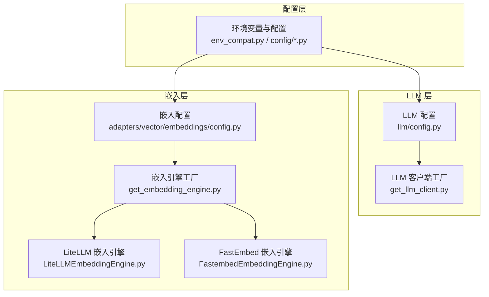
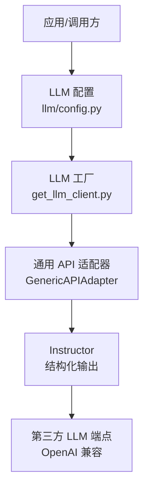
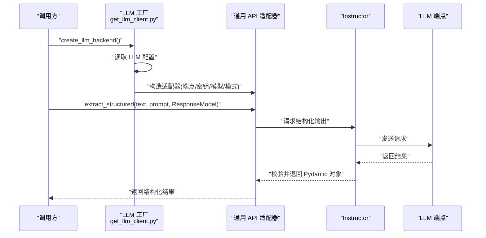
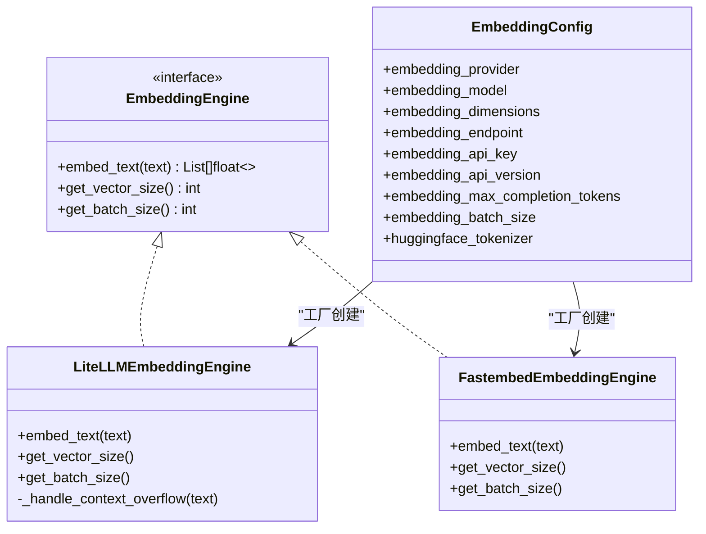
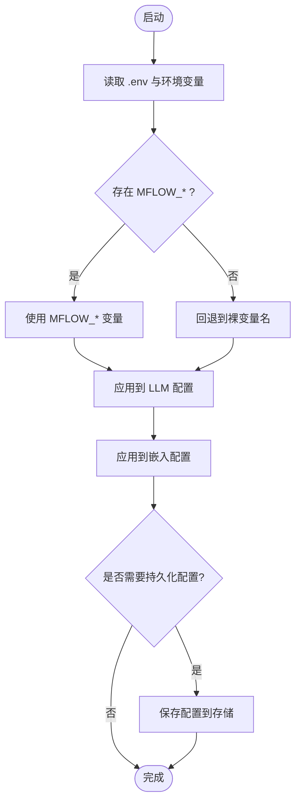
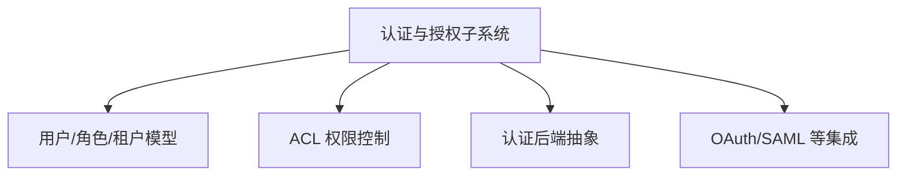
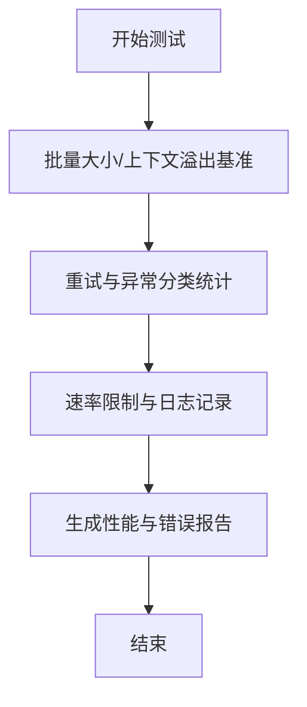
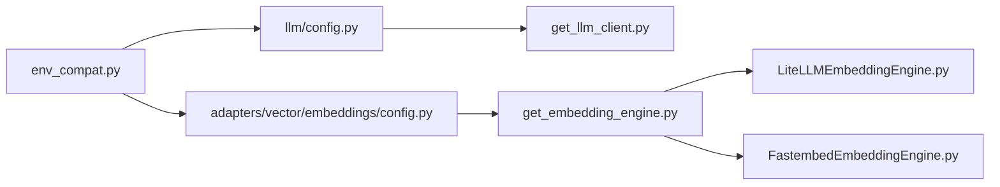

# 自定义提供商开发

<cite>
**本文引用的文件**
- [CUSTOM_LLM_PROVIDERS.md](file://docs/CUSTOM_LLM_PROVIDERS.md)
- [llm/config.py](file://m_flow/llm/config.py)
- [config/config.py](file://m_flow/config/config.py)
- [adapters/vector/embeddings/__init__.py](file://m_flow/adapters/vector/embeddings/__init__.py)
- [adapters/vector/embeddings/get_embedding_engine.py](file://m_flow/adapters/vector/embeddings/get_embedding_engine.py)
- [adapters/vector/embeddings/config.py](file://m_flow/adapters/vector/embeddings/config.py)
- [llm/backends/litellm_instructor/llm/get_llm_client.py](file://m_flow/llm/backends/litellm_instructor/llm/get_llm_client.py)
- [adapters/vector/embeddings/LiteLLMEmbeddingEngine.py](file://m_flow/adapters/vector/embeddings/LiteLLMEmbeddingEngine.py)
- [adapters/vector/embeddings/FastembedEmbeddingEngine.py](file://m_flow/adapters/vector/embeddings/FastembedEmbeddingEngine.py)
- [config/env_compat.py](file://m_flow/config/env_compat.py)
- [tests/unit/infrastructure/vector/embeddings/test_embedding_config_custom_provider.py](file://m_flow/tests/unit/infrastructure/vector/embeddings/test_embedding_config_custom_provider.py)
- [examples/python/run_custom_pipeline_example.py](file://examples/python/run_custom_pipeline_example.py)
</cite>

## 目录
1. [简介](#简介)
2. [项目结构](#项目结构)
3. [核心组件](#核心组件)
4. [架构总览](#架构总览)
5. [详细组件分析](#详细组件分析)
6. [依赖分析](#依赖分析)
7. [性能考虑](#性能考虑)
8. [故障排查指南](#故障排查指南)
9. [结论](#结论)
10. [附录](#附录)

## 简介
本指南面向需要为 M-Flow 扩展“自定义提供商”的开发者，覆盖以下主题：
- 新增 LLM 提供商与 API 兼容性适配（含 OpenAI 兼容端点）
- 向量嵌入提供商扩展（本地 FastEmbed、远程 LiteLLM、批量与上下文窗口处理）
- 配置系统扩展（环境变量、配置文件、运行时设置）
- 认证与授权（API Key 管理、OAuth 集成与访问控制）
- 测试与监控（性能基准、错误率统计、用量追踪）
- 完整开发示例与部署最佳实践

## 项目结构
围绕“自定义提供商”相关的关键模块如下：
- LLM 配置与客户端工厂：负责读取环境变量、选择提供商、构建适配器
- 向量嵌入配置与引擎工厂：负责读取嵌入配置、选择引擎（FastEmbed/LiteLLM/Ollama）、批量与限流
- 环境兼容层：统一 MFLOW_ 前缀与回退逻辑
- 示例与测试：演示如何组装自定义流水线、验证嵌入配置

**图表来源**
- [config/env_compat.py:21-46](file://m_flow/config/env_compat.py#L21-L46)
- [m_flow/llm/config.py:38-209](file://m_flow/llm/config.py#L38-L209)
- [m_flow/llm/backends/litellm_instructor/llm/get_llm_client.py:27-166](file://m_flow/llm/backends/litellm_instructor/llm/get_llm_client.py#L27-L166)
- [m_flow/adapters/vector/embeddings/config.py:16-69](file://m_flow/adapters/vector/embeddings/config.py#L16-L69)
- [m_flow/adapters/vector/embeddings/get_embedding_engine.py:16-100](file://m_flow/adapters/vector/embeddings/get_embedding_engine.py#L16-L100)
- [m_flow/adapters/vector/embeddings/LiteLLMEmbeddingEngine.py:37-178](file://m_flow/adapters/vector/embeddings/LiteLLMEmbeddingEngine.py#L37-L178)
- [m_flow/adapters/vector/embeddings/FastembedEmbeddingEngine.py:35-128](file://m_flow/adapters/vector/embeddings/FastembedEmbeddingEngine.py#L35-L128)

**章节来源**
- [config/env_compat.py:21-46](file://m_flow/config/env_compat.py#L21-L46)
- [m_flow/llm/config.py:38-209](file://m_flow/llm/config.py#L38-L209)
- [m_flow/llm/backends/litellm_instructor/llm/get_llm_client.py:27-166](file://m_flow/llm/backends/litellm_instructor/llm/get_llm_client.py#L27-L166)
- [m_flow/adapters/vector/embeddings/config.py:16-69](file://m_flow/adapters/vector/embeddings/config.py#L16-L69)
- [m_flow/adapters/vector/embeddings/get_embedding_engine.py:16-100](file://m_flow/adapters/vector/embeddings/get_embedding_engine.py#L16-L100)
- [m_flow/adapters/vector/embeddings/LiteLLMEmbeddingEngine.py:37-178](file://m_flow/adapters/vector/embeddings/LiteLLMEmbeddingEngine.py#L37-L178)
- [m_flow/adapters/vector/embeddings/FastembedEmbeddingEngine.py:35-128](file://m_flow/adapters/vector/embeddings/FastembedEmbeddingEngine.py#L35-L128)

## 核心组件
- 环境兼容与配置基类：统一读取 MFLOW_ 前缀变量，并在未设置时回退到裸变量名；提供 .env 文件加载能力
- LLM 配置与工厂：集中管理 LLM 提供商、模型、端点、API Key、温度、流式输出、最大补全长度、结构化输出模式、速率限制、回退模型等；通过工厂函数按配置动态选择适配器
- 嵌入配置与工厂：集中管理嵌入提供商、模型、维度、端点、API Key、版本、最大令牌数、批大小、HF 分词器；工厂根据提供商返回对应引擎实例
- LiteLLM 嵌入引擎：支持 OpenAI/Azure 等兼容端点，内置重试、分片与池化、上下文窗口溢出处理、多种分词器适配
- FastEmbed 嵌入引擎：本地 ONNX 模型，零外部调用，适合离线与低延迟场景
- 示例与测试：演示如何以任务级流水线方式组装“添加+记忆化”，以及嵌入配置的单元测试

**章节来源**
- [config/env_compat.py:21-46](file://m_flow/config/env_compat.py#L21-L46)
- [m_flow/llm/config.py:38-209](file://m_flow/llm/config.py#L38-L209)
- [m_flow/llm/backends/litellm_instructor/llm/get_llm_client.py:27-166](file://m_flow/llm/backends/litellm_instructor/llm/get_llm_client.py#L27-L166)
- [m_flow/adapters/vector/embeddings/config.py:16-69](file://m_flow/adapters/vector/embeddings/config.py#L16-L69)
- [m_flow/adapters/vector/embeddings/get_embedding_engine.py:16-100](file://m_flow/adapters/vector/embeddings/get_embedding_engine.py#L16-L100)
- [m_flow/adapters/vector/embeddings/LiteLLMEmbeddingEngine.py:37-178](file://m_flow/adapters/vector/embeddings/LiteLLMEmbeddingEngine.py#L37-L178)
- [m_flow/adapters/vector/embeddings/FastembedEmbeddingEngine.py:35-128](file://m_flow/adapters/vector/embeddings/FastembedEmbeddingEngine.py#L35-L128)
- [examples/python/run_custom_pipeline_example.py:23-84](file://examples/python/run_custom_pipeline_example.py#L23-L84)
- [tests/unit/infrastructure/vector/embeddings/test_embedding_config_custom_provider.py:6-20](file://m_flow/tests/unit/infrastructure/vector/embeddings/test_embedding_config_custom_provider.py#L6-L20)

## 架构总览
下图展示“自定义 LLM 提供商”与“自定义嵌入提供商”的整体交互路径。

**图表来源**
- [m_flow/llm/config.py:38-209](file://m_flow/llm/config.py#L38-L209)
- [m_flow/llm/backends/litellm_instructor/llm/get_llm_client.py:27-166](file://m_flow/llm/backends/litellm_instructor/llm/get_llm_client.py#L27-L166)

**章节来源**
- [m_flow/llm/config.py:38-209](file://m_flow/llm/config.py#L38-L209)
- [m_flow/llm/backends/litellm_instructor/llm/get_llm_client.py:27-166](file://m_flow/llm/backends/litellm_instructor/llm/get_llm_client.py#L27-L166)

## 详细组件分析

### LLM 提供商扩展（新增自定义提供商）
- 支持通过环境变量启用自定义提供商，使用通用 API 适配器对接任何 OpenAI 兼容端点
- 结构化输出可通过多种模式（JSON、工具调用、Markdown JSON）由 Instructor 强制校验
- 回退模型仅在内容策略违规时触发，其他错误由内置指数退避重试处理
- 推荐预设与常见陷阱（模型不存在、结构化输出返回原始文本、速率限制、端点 URL 格式）

**图表来源**
- [m_flow/llm/backends/litellm_instructor/llm/get_llm_client.py:27-166](file://m_flow/llm/backends/litellm_instructor/llm/get_llm_client.py#L27-L166)
- [m_flow/llm/config.py:38-209](file://m_flow/llm/config.py#L38-L209)

**章节来源**
- [docs/CUSTOM_LLM_PROVIDERS.md:1-203](file://docs/CUSTOM_LLM_PROVIDERS.md#L1-L203)
- [m_flow/llm/backends/litellm_instructor/llm/get_llm_client.py:27-166](file://m_flow/llm/backends/litellm_instructor/llm/get_llm_client.py#L27-L166)
- [m_flow/llm/config.py:38-209](file://m_flow/llm/config.py#L38-L209)

### 向量嵌入提供商扩展（自定义嵌入模型、批量与缓存策略）
- 嵌入配置集中于嵌入配置类，支持提供商、模型、维度、端点、API Key、版本、最大令牌数、批大小、HF 分词器
- 嵌入引擎工厂根据提供商返回对应引擎：FastEmbed（本地）、LiteLLM（远程兼容）、Ollama（本地）
- LiteLLM 嵌入引擎具备重试、指数抖动退避、上下文溢出自动分片与池化、多分词器适配
- FastEmbed 嵌入引擎本地执行，ONNX 加速，Mock 模式便于测试
- 单元测试验证自定义提供商下的维度与批大小等配置项

**图表来源**
- [m_flow/adapters/vector/embeddings/config.py:16-69](file://m_flow/adapters/vector/embeddings/config.py#L16-L69)
- [m_flow/adapters/vector/embeddings/get_embedding_engine.py:16-100](file://m_flow/adapters/vector/embeddings/get_embedding_engine.py#L16-L100)
- [m_flow/adapters/vector/embeddings/LiteLLMEmbeddingEngine.py:37-178](file://m_flow/adapters/vector/embeddings/LiteLLMEmbeddingEngine.py#L37-L178)
- [m_flow/adapters/vector/embeddings/FastembedEmbeddingEngine.py:35-128](file://m_flow/adapters/vector/embeddings/FastembedEmbeddingEngine.py#L35-L128)

**章节来源**
- [m_flow/adapters/vector/embeddings/config.py:16-69](file://m_flow/adapters/vector/embeddings/config.py#L16-L69)
- [m_flow/adapters/vector/embeddings/get_embedding_engine.py:16-100](file://m_flow/adapters/vector/embeddings/get_embedding_engine.py#L16-L100)
- [m_flow/adapters/vector/embeddings/LiteLLMEmbeddingEngine.py:37-178](file://m_flow/adapters/vector/embeddings/LiteLLMEmbeddingEngine.py#L37-L178)
- [m_flow/adapters/vector/embeddings/FastembedEmbeddingEngine.py:35-128](file://m_flow/adapters/vector/embeddings/FastembedEmbeddingEngine.py#L35-L128)
- [tests/unit/infrastructure/vector/embeddings/test_embedding_config_custom_provider.py:6-20](file://m_flow/tests/unit/infrastructure/vector/embeddings/test_embedding_config_custom_provider.py#L6-L20)

### 配置系统扩展（环境变量、配置文件与运行时）
- 统一前缀与回退：优先读取 MFLOW_ 前缀变量，若未设置则回退到裸变量名，保证向后兼容
- LLM 配置：集中管理提供商、模型、端点、API Key、温度、流式、最大补全长度、结构化输出模式、速率限制、回退模型
- 嵌入配置：集中管理提供商、模型、维度、端点、API Key、版本、最大令牌数、批大小、HF 分词器
- 运行时持久化：提供保存 LLM/嵌入/向量数据库配置的工具函数（用于 CLI 或管理界面）

**图表来源**
- [config/env_compat.py:21-46](file://m_flow/config/env_compat.py#L21-L46)
- [m_flow/llm/config.py:38-209](file://m_flow/llm/config.py#L38-L209)
- [m_flow/adapters/vector/embeddings/config.py:16-69](file://m_flow/adapters/vector/embeddings/config.py#L16-L69)

**章节来源**
- [config/env_compat.py:21-46](file://m_flow/config/env_compat.py#L21-L46)
- [m_flow/llm/config.py:38-209](file://m_flow/llm/config.py#L38-L209)
- [m_flow/adapters/vector/embeddings/config.py:16-69](file://m_flow/adapters/vector/embeddings/config.py#L16-L69)

### 认证与授权机制（API Key、OAuth、访问控制）
- API Key 管理：LLM 与嵌入配置均支持通过环境变量注入 API Key；工厂在缺少必要密钥时可抛出异常
- OAuth 集成：认证子系统提供 FastAPI Users 与后端抽象，可用于接入 OAuth 2.0、SAML 等
- 访问控制：基于用户、角色、租户与权限模型的 ACL 系统，支持默认权限与租户级权限

[此图为概念图，不直接映射具体源码文件]

### 测试与监控方案（性能基准、错误率统计、用量追踪）
- 性能基准：对嵌入引擎进行批量大小、上下文溢出处理、Mock 模式的基准测试
- 错误率统计：LiteLLM 嵌入引擎内置重试与异常分类，便于统计错误类型与频率
- 用量追踪：结合速率限制器与日志记录，追踪请求次数、耗时与错误

**图表来源**
- [m_flow/adapters/vector/embeddings/LiteLLMEmbeddingEngine.py:72-143](file://m_flow/adapters/vector/embeddings/LiteLLMEmbeddingEngine.py#L72-L143)
- [tests/unit/infrastructure/vector/embeddings/test_embedding_config_custom_provider.py:6-20](file://m_flow/tests/unit/infrastructure/vector/embeddings/test_embedding_config_custom_provider.py#L6-L20)

**章节来源**
- [m_flow/adapters/vector/embeddings/LiteLLMEmbeddingEngine.py:72-143](file://m_flow/adapters/vector/embeddings/LiteLLMEmbeddingEngine.py#L72-L143)
- [tests/unit/infrastructure/vector/embeddings/test_embedding_config_custom_provider.py:6-20](file://m_flow/tests/unit/infrastructure/vector/embeddings/test_embedding_config_custom_provider.py#L6-L20)

### 开发示例与部署最佳实践
- 自定义流水线示例：演示如何以任务级 API 组装“添加+记忆化”流水线，便于集成自定义提供商
- 部署建议：
  - 使用 MFLOW_ 前缀环境变量统一管理配置
  - 在生产中启用速率限制与指数退避重试
  - 对于长文本与大模型，合理设置批大小与上下文窗口策略
  - 使用 .env 文件管理敏感信息，避免硬编码

**章节来源**
- [examples/python/run_custom_pipeline_example.py:23-84](file://examples/python/run_custom_pipeline_example.py#L23-L84)

## 依赖分析
- 配置层依赖：环境兼容层为所有配置类提供统一的变量解析与回退机制
- LLM 层依赖：工厂函数依赖 LLM 配置，按提供商导入具体适配器
- 嵌入层依赖：工厂函数依赖嵌入配置，按提供商导入具体引擎；引擎内部依赖分词器与速率限制器

**图表来源**
- [config/env_compat.py:21-46](file://m_flow/config/env_compat.py#L21-L46)
- [m_flow/llm/config.py:38-209](file://m_flow/llm/config.py#L38-L209)
- [m_flow/adapters/vector/embeddings/config.py:16-69](file://m_flow/adapters/vector/embeddings/config.py#L16-L69)
- [m_flow/llm/backends/litellm_instructor/llm/get_llm_client.py:27-166](file://m_flow/llm/backends/litellm_instructor/llm/get_llm_client.py#L27-L166)
- [m_flow/adapters/vector/embeddings/get_embedding_engine.py:16-100](file://m_flow/adapters/vector/embeddings/get_embedding_engine.py#L16-L100)
- [m_flow/adapters/vector/embeddings/LiteLLMEmbeddingEngine.py:37-178](file://m_flow/adapters/vector/embeddings/LiteLLMEmbeddingEngine.py#L37-L178)
- [m_flow/adapters/vector/embeddings/FastembedEmbeddingEngine.py:35-128](file://m_flow/adapters/vector/embeddings/FastembedEmbeddingEngine.py#L35-L128)

**章节来源**
- [config/env_compat.py:21-46](file://m_flow/config/env_compat.py#L21-L46)
- [m_flow/llm/config.py:38-209](file://m_flow/llm/config.py#L38-L209)
- [m_flow/adapters/vector/embeddings/config.py:16-69](file://m_flow/adapters/vector/embeddings/config.py#L16-L69)
- [m_flow/llm/backends/litellm_instructor/llm/get_llm_client.py:27-166](file://m_flow/llm/backends/litellm_instructor/llm/get_llm_client.py#L27-L166)
- [m_flow/adapters/vector/embeddings/get_embedding_engine.py:16-100](file://m_flow/adapters/vector/embeddings/get_embedding_engine.py#L16-L100)
- [m_flow/adapters/vector/embeddings/LiteLLMEmbeddingEngine.py:37-178](file://m_flow/adapters/vector/embeddings/LiteLLMEmbeddingEngine.py#L37-L178)
- [m_flow/adapters/vector/embeddings/FastembedEmbeddingEngine.py:35-128](file://m_flow/adapters/vector/embeddings/FastembedEmbeddingEngine.py#L35-L128)

## 性能考虑
- 批量处理：嵌入引擎支持批大小配置，合理设置可提升吞吐；LiteLLM 引擎在上下文溢出时采用分片与池化策略
- 速率限制：LLM 与嵌入均可启用速率限制，避免触发第三方配额上限
- 重试策略：指数退避与抖动可降低瞬时峰值压力，提高稳定性
- 本地化：FastEmbed 适合低延迟与离线场景，减少网络开销

[本节为通用指导，无需列出章节来源]

## 故障排查指南
- “模型不存在”：在 LiteLLM 内部模型注册表中未找到时，可尝试在模型名前加前缀以强制走 OpenAI 兼容路径
- 结构化输出返回原始文本：切换到更通用的 Markdown JSON 模式
- 速率限制：启用内置速率限制器，合理设置请求间隔与配额
- 端点 URL 格式：大多数 OpenAI 兼容端点不需要手动拼接 /v1，避免重复

**章节来源**
- [docs/CUSTOM_LLM_PROVIDERS.md:95-140](file://docs/CUSTOM_LLM_PROVIDERS.md#L95-L140)

## 结论
通过统一的配置层、灵活的工厂模式与可插拔的引擎实现，M-Flow 为自定义 LLM 与嵌入提供商提供了清晰的扩展路径。遵循本文档的配置、性能与测试建议，可在保证稳定性的同时快速集成新的提供商并实现生产级部署。

[本节为总结，无需列出章节来源]

## 附录
- 快速开始与推荐预设：参考文档中的环境变量示例与常见提供商的预设表格
- 验证安装：使用内置烟雾测试脚本验证自定义提供商配置是否正确

**章节来源**
- [docs/CUSTOM_LLM_PROVIDERS.md:16-203](file://docs/CUSTOM_LLM_PROVIDERS.md#L16-L203)