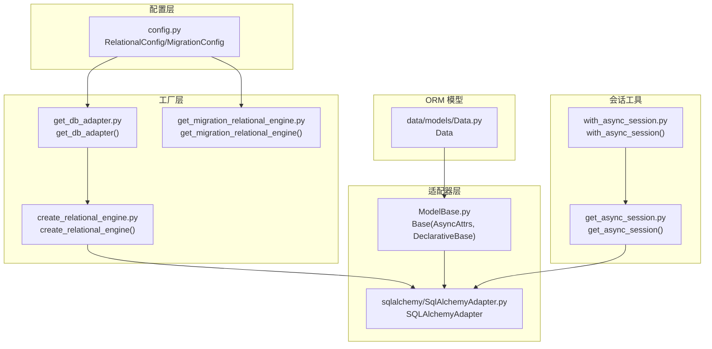
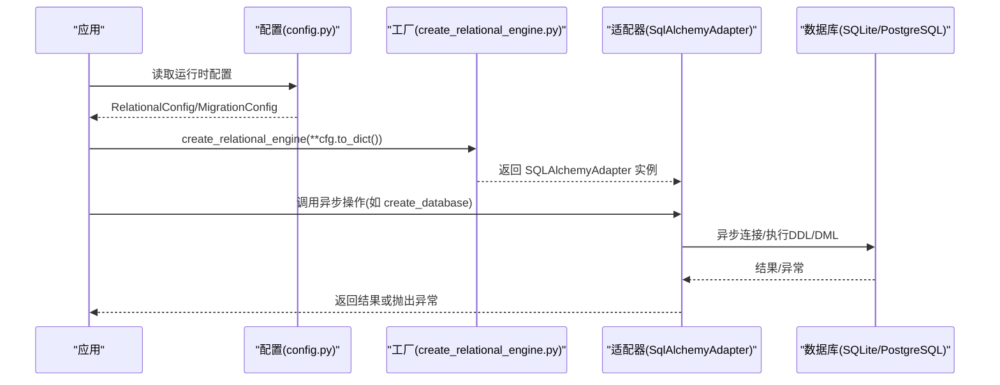
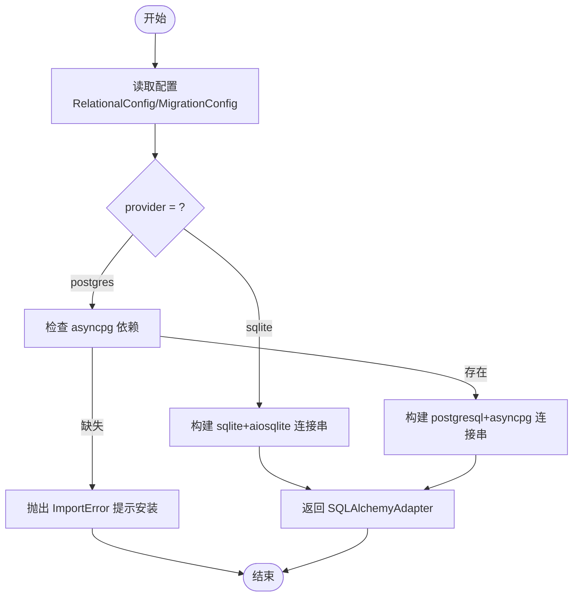
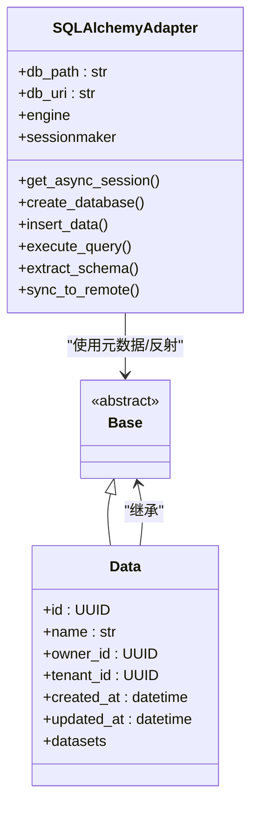
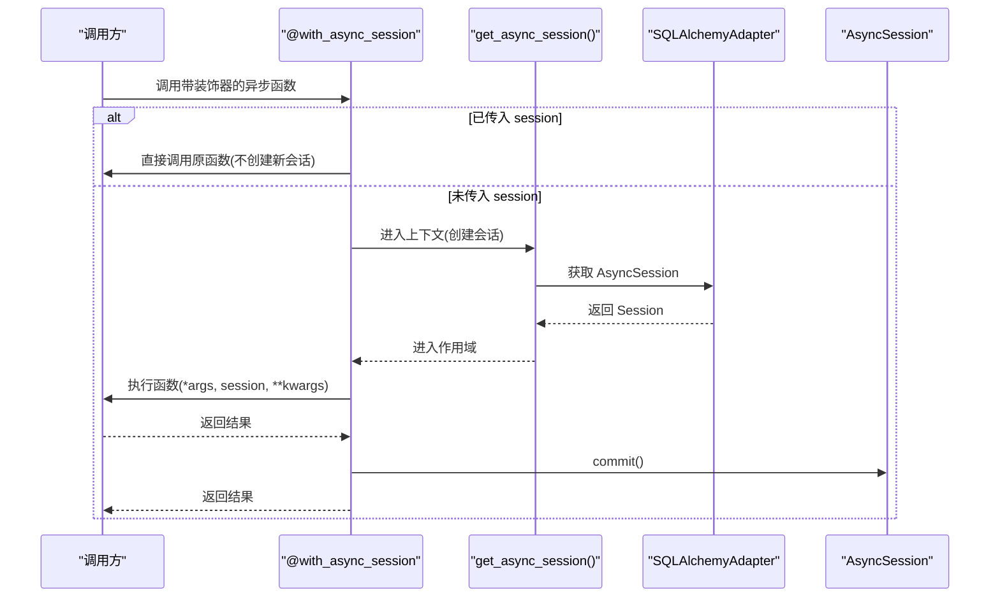
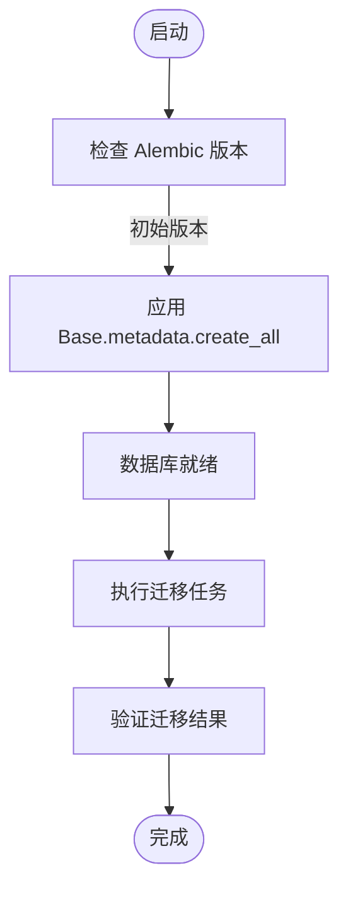
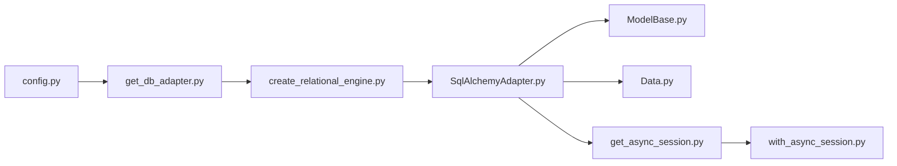

# 关系数据库适配器开发

<cite>
**本文档引用的文件**
- [m_flow/adapters/relational/__init__.py](file://m_flow/adapters/relational/__init__.py)
- [m_flow/adapters/relational/create_relational_engine.py](file://m_flow/adapters/relational/create_relational_engine.py)
- [m_flow/adapters/relational/get_db_adapter.py](file://m_flow/adapters/relational/get_db_adapter.py)
- [m_flow/adapters/relational/get_async_session.py](file://m_flow/adapters/relational/get_async_session.py)
- [m_flow/adapters/relational/with_async_session.py](file://m_flow/adapters/relational/with_async_session.py)
- [m_flow/adapters/relational/sqlalchemy/SqlAlchemyAdapter.py](file://m_flow/adapters/relational/sqlalchemy/SqlAlchemyAdapter.py)
- [m_flow/adapters/relational/ModelBase.py](file://m_flow/adapters/relational/ModelBase.py)
- [m_flow/adapters/relational/config.py](file://m_flow/adapters/relational/config.py)
- [m_flow/adapters/relational/create_db_and_tables.py](file://m_flow/adapters/relational/create_db_and_tables.py)
- [m_flow/adapters/relational/get_migration_relational_engine.py](file://m_flow/adapters/relational/get_migration_relational_engine.py)
- [m_flow/data/models/Data.py](file://m_flow/data/models/Data.py)
- [m_flow/adapters/exceptions/exceptions.py](file://m_flow/adapters/exceptions/exceptions.py)
- [examples/python/relational_database_migration_example.py](file://examples/python/relational_database_migration_example.py)
- [examples/relational_db_with_dlt/relational_db_and_dlt.py](file://examples/relational_db_with_dlt/relational_db_and_dlt.py)
- [m_flow/tests/test_relational_db_migration.py](file://m_flow/tests/test_relational_db_migration.py)
- [alembic/versions/92b3293baa66_mflow_initial_schema.py](file://alembic/versions/92b3293baa66_mflow_initial_schema.py)
</cite>

## 目录
1. [简介](#简介)
2. [项目结构](#项目结构)
3. [核心组件](#核心组件)
4. [架构总览](#架构总览)
5. [详细组件分析](#详细组件分析)
6. [依赖分析](#依赖分析)
7. [性能考虑](#性能考虑)
8. [故障排查指南](#故障排查指南)
9. [结论](#结论)
10. [附录](#附录)

## 简介
本指南面向关系数据库适配器的开发者与维护者，系统阐述基于 SQLAlchemy 的异步关系数据库适配器设计与实现要点，覆盖连接管理、ORM 模型设计、事务处理、表结构与索引设计、查询性能调优、迁移与版本管理、数据同步策略，以及单元测试、集成测试与性能基准测试方法。文档以现有 m_flow 关系数据库适配器为蓝本，提供可直接落地的实践建议与扩展指引。

## 项目结构
关系数据库适配器位于 m_flow/adapters/relational 目录下，采用分层与职责分离的设计：
- 配置层：读取环境变量，生成运行时配置对象
- 工厂层：根据配置创建数据库引擎实例
- 适配器层：封装 SQLAlchemy 异步引擎、会话管理、CRUD、元数据反射与迁移辅助
- ORM 层：统一的 Base 类，所有关系模型继承自该基类
- 会话工具：上下文管理器与装饰器，简化异步会话生命周期
- 迁移与初始化：启动时创建数据库与表，迁移专用引擎工厂
- 示例与测试：演示迁移流程、ETL 集成与端到端验证

图表来源
- [m_flow/adapters/relational/config.py:43-106](file://m_flow/adapters/relational/config.py#L43-L106)
- [m_flow/adapters/relational/create_relational_engine.py:16-81](file://m_flow/adapters/relational/create_relational_engine.py#L16-L81)
- [m_flow/adapters/relational/get_db_adapter.py:11-21](file://m_flow/adapters/relational/get_db_adapter.py#L11-L21)
- [m_flow/adapters/relational/get_migration_relational_engine.py:13-43](file://m_flow/adapters/relational/get_migration_relational_engine.py#L13-L43)
- [m_flow/adapters/relational/sqlalchemy/SqlAlchemyAdapter.py:33-58](file://m_flow/adapters/relational/sqlalchemy/SqlAlchemyAdapter.py#L33-L58)
- [m_flow/adapters/relational/ModelBase.py:14-23](file://m_flow/adapters/relational/ModelBase.py#L14-L23)
- [m_flow/adapters/relational/get_async_session.py:15-35](file://m_flow/adapters/relational/get_async_session.py#L15-L35)
- [m_flow/adapters/relational/with_async_session.py:24-54](file://m_flow/adapters/relational/with_async_session.py#L24-L54)
- [m_flow/data/models/Data.py:35-86](file://m_flow/data/models/Data.py#L35-L86)

章节来源
- [m_flow/adapters/relational/__init__.py:1-9](file://m_flow/adapters/relational/__init__.py#L1-L9)
- [m_flow/adapters/relational/config.py:43-106](file://m_flow/adapters/relational/config.py#L43-L106)
- [m_flow/adapters/relational/create_relational_engine.py:16-81](file://m_flow/adapters/relational/create_relational_engine.py#L16-L81)
- [m_flow/adapters/relational/get_db_adapter.py:11-21](file://m_flow/adapters/relational/get_db_adapter.py#L11-L21)
- [m_flow/adapters/relational/get_migration_relational_engine.py:13-43](file://m_flow/adapters/relational/get_migration_relational_engine.py#L13-L43)
- [m_flow/adapters/relational/sqlalchemy/SqlAlchemyAdapter.py:33-58](file://m_flow/adapters/relational/sqlalchemy/SqlAlchemyAdapter.py#L33-L58)
- [m_flow/adapters/relational/ModelBase.py:14-23](file://m_flow/adapters/relational/ModelBase.py#L14-L23)
- [m_flow/adapters/relational/get_async_session.py:15-35](file://m_flow/adapters/relational/get_async_session.py#L15-L35)
- [m_flow/adapters/relational/with_async_session.py:24-54](file://m_flow/adapters/relational/with_async_session.py#L24-L54)
- [m_flow/data/models/Data.py:35-86](file://m_flow/data/models/Data.py#L35-L86)

## 核心组件
- 配置模块：提供主库与迁移库两套配置，支持 SQLite 与 PostgreSQL，默认 SQLite；通过环境变量注入，提供 to_dict 序列化以便工厂函数使用。
- 引擎工厂：根据 provider 选择 SQLite 或 PostgreSQL，构建异步 SQLAlchemy 引擎；对 PostgreSQL 缺失依赖进行显式提示。
- 适配器类：封装异步会话、CRUD、表创建/删除、模式提取、Schema 反射、SQLite 与 PostgreSQL 的差异化处理、S3 同步（SQLite）等。
- ORM 基类：统一的 DeclarativeBase 与 AsyncAttrs 组合，确保异步关系延迟加载可用。
- 会话工具：上下文管理器与装饰器，自动管理会话生命周期与提交。
- 初始化与默认权限：启动时创建数据库与表，并预创建权限类型避免并发冲突。
- 迁移专用引擎：从迁移配置读取参数，按需连接目标数据库执行迁移。

章节来源
- [m_flow/adapters/relational/config.py:43-106](file://m_flow/adapters/relational/config.py#L43-L106)
- [m_flow/adapters/relational/create_relational_engine.py:16-81](file://m_flow/adapters/relational/create_relational_engine.py#L16-L81)
- [m_flow/adapters/relational/sqlalchemy/SqlAlchemyAdapter.py:33-58](file://m_flow/adapters/relational/sqlalchemy/SqlAlchemyAdapter.py#L33-L58)
- [m_flow/adapters/relational/ModelBase.py:14-23](file://m_flow/adapters/relational/ModelBase.py#L14-L23)
- [m_flow/adapters/relational/get_async_session.py:15-35](file://m_flow/adapters/relational/get_async_session.py#L15-L35)
- [m_flow/adapters/relational/with_async_session.py:24-54](file://m_flow/adapters/relational/with_async_session.py#L24-L54)
- [m_flow/adapters/relational/create_db_and_tables.py:17-59](file://m_flow/adapters/relational/create_db_and_tables.py#L17-L59)
- [m_flow/adapters/relational/get_migration_relational_engine.py:13-43](file://m_flow/adapters/relational/get_migration_relational_engine.py#L13-L43)

## 架构总览
关系数据库适配器采用“配置 → 工厂 → 适配器 → ORM”的分层架构，配合会话工具与迁移工具，形成完整的数据访问与演进体系。

图表来源
- [m_flow/adapters/relational/config.py:43-106](file://m_flow/adapters/relational/config.py#L43-L106)
- [m_flow/adapters/relational/create_relational_engine.py:16-81](file://m_flow/adapters/relational/create_relational_engine.py#L16-L81)
- [m_flow/adapters/relational/sqlalchemy/SqlAlchemyAdapter.py:33-58](file://m_flow/adapters/relational/sqlalchemy/SqlAlchemyAdapter.py#L33-L58)

## 详细组件分析

### 配置与工厂
- 主配置 RelationalConfig 默认 SQLite，支持通过环境变量覆盖；迁移配置 MigrationConfig 提供独立连接参数，便于在不同环境中执行迁移。
- 工厂函数根据 provider 动态拼接连接字符串，SQLite 使用 aiopath，PostgreSQL 使用 asyncpg 并在缺失时抛出明确错误信息。
- 两个工厂函数均使用 LRU 缓存，降低重复创建开销。

图表来源
- [m_flow/adapters/relational/config.py:43-106](file://m_flow/adapters/relational/config.py#L43-L106)
- [m_flow/adapters/relational/create_relational_engine.py:16-81](file://m_flow/adapters/relational/create_relational_engine.py#L16-L81)

章节来源
- [m_flow/adapters/relational/config.py:43-106](file://m_flow/adapters/relational/config.py#L43-L106)
- [m_flow/adapters/relational/create_relational_engine.py:16-81](file://m_flow/adapters/relational/create_relational_engine.py#L16-L81)
- [m_flow/adapters/relational/get_db_adapter.py:11-21](file://m_flow/adapters/relational/get_db_adapter.py#L11-L21)
- [m_flow/adapters/relational/get_migration_relational_engine.py:13-43](file://m_flow/adapters/relational/get_migration_relational_engine.py#L13-L43)

### 适配器类与 ORM 基类
- SQLAlchemyAdapter 封装异步引擎、会话工厂、CRUD、表管理、Schema 反射与提取、SQLite 与 PostgreSQL 的差异化逻辑，以及 S3 同步（SQLite）。
- Base 作为所有关系模型的抽象基类，结合 AsyncAttrs 与 DeclarativeBase，确保异步关系延迟加载与一致的元数据反射行为。
- 数据模型 Data 继承自 Base，定义字段、索引与关系，体现 ORM 设计与业务实体映射。

图表来源
- [m_flow/adapters/relational/ModelBase.py:14-23](file://m_flow/adapters/relational/ModelBase.py#L14-L23)
- [m_flow/adapters/relational/sqlalchemy/SqlAlchemyAdapter.py:33-58](file://m_flow/adapters/relational/sqlalchemy/SqlAlchemyAdapter.py#L33-L58)
- [m_flow/data/models/Data.py:35-86](file://m_flow/data/models/Data.py#L35-L86)

章节来源
- [m_flow/adapters/relational/sqlalchemy/SqlAlchemyAdapter.py:33-58](file://m_flow/adapters/relational/sqlalchemy/SqlAlchemyAdapter.py#L33-L58)
- [m_flow/adapters/relational/ModelBase.py:14-23](file://m_flow/adapters/relational/ModelBase.py#L14-L23)
- [m_flow/data/models/Data.py:35-86](file://m_flow/data/models/Data.py#L35-L86)

### 会话管理与事务处理
- get_async_session 提供异步上下文管理器，自动创建与关闭会话，并支持在退出时自动提交。
- with_async_session 装饰器优先复用传入的会话，否则自动创建并在完成后提交，避免重复会话管理代码。
- 适配器内部使用嵌套事务（SAVEPOINT）与异常捕获，保证并发场景下的幂等性与一致性。

图表来源
- [m_flow/adapters/relational/with_async_session.py:24-54](file://m_flow/adapters/relational/with_async_session.py#L24-L54)
- [m_flow/adapters/relational/get_async_session.py:15-35](file://m_flow/adapters/relational/get_async_session.py#L15-L35)
- [m_flow/adapters/relational/sqlalchemy/SqlAlchemyAdapter.py:113-125](file://m_flow/adapters/relational/sqlalchemy/SqlAlchemyAdapter.py#L113-L125)

章节来源
- [m_flow/adapters/relational/get_async_session.py:15-35](file://m_flow/adapters/relational/get_async_session.py#L15-L35)
- [m_flow/adapters/relational/with_async_session.py:24-54](file://m_flow/adapters/relational/with_async_session.py#L24-L54)
- [m_flow/adapters/relational/sqlalchemy/SqlAlchemyAdapter.py:113-125](file://m_flow/adapters/relational/sqlalchemy/SqlAlchemyAdapter.py#L113-L125)

### 表结构设计与索引优化
- 字段设计：遵循业务语义命名，使用合适的数据类型与长度限制；UUID 主键用于跨系统唯一标识；JSON/可变字典用于灵活元数据存储。
- 索引策略：在常用过滤字段（如 owner_id、tenant_id）上建立索引；对时间戳字段建立索引以支持范围查询。
- 外键约束：在关系模型中定义外键，启用 SQLite 外键检查，确保参照完整性。
- 模式隔离：PostgreSQL 支持 Schema 分离，便于多租户或多版本隔离。

章节来源
- [m_flow/data/models/Data.py:90-120](file://m_flow/data/models/Data.py#L90-L120)

### 查询性能调优
- 使用异步查询与批量插入减少阻塞；对大结果集采用分页或流式读取。
- 在过滤条件中使用 IN 子句时，注意参数绑定与 SQL 注入防护。
- PostgreSQL 使用连接池参数（大小、溢出、回收周期、预检查）提升并发吞吐。
- SQLite 在本地文件系统上运行，必要时启用 WAL 模式与合适的缓存策略。

章节来源
- [m_flow/adapters/relational/sqlalchemy/SqlAlchemyAdapter.py:175-208](file://m_flow/adapters/relational/sqlalchemy/SqlAlchemyAdapter.py#L175-L208)
- [m_flow/adapters/relational/sqlalchemy/SqlAlchemyAdapter.py:318-356](file://m_flow/adapters/relational/sqlalchemy/SqlAlchemyAdapter.py#L318-L356)
- [m_flow/adapters/relational/sqlalchemy/SqlAlchemyAdapter.py:80-89](file://m_flow/adapters/relational/sqlalchemy/SqlAlchemyAdapter.py#L80-L89)

### 数据库迁移与版本管理
- 初始迁移脚本采用“应用启动即创建”策略，Alembic 版本文件标记为无操作，由应用侧通过 Base.metadata.create_all 创建。
- 迁移专用引擎从迁移配置读取参数，支持独立数据库与凭据，便于在 CI/CD 中安全执行迁移。
- 测试覆盖 SQLite 与 PostgreSQL 两种后端，验证模式提取与数据迁移正确性。

图表来源
- [alembic/versions/92b3293baa66_mflow_initial_schema.py:24-29](file://alembic/versions/92b3293baa66_mflow_initial_schema.py#L24-L29)
- [m_flow/adapters/relational/create_db_and_tables.py:17-20](file://m_flow/adapters/relational/create_db_and_tables.py#L17-L20)
- [m_flow/adapters/relational/get_migration_relational_engine.py:13-43](file://m_flow/adapters/relational/get_migration_relational_engine.py#L13-L43)

章节来源
- [alembic/versions/92b3293baa66_mflow_initial_schema.py:24-29](file://alembic/versions/92b3293baa66_mflow_initial_schema.py#L24-L29)
- [m_flow/adapters/relational/create_db_and_tables.py:17-20](file://m_flow/adapters/relational/create_db_and_tables.py#L17-L20)
- [m_flow/adapters/relational/get_migration_relational_engine.py:13-43](file://m_flow/adapters/relational/get_migration_relational_engine.py#L13-L43)
- [m_flow/tests/test_relational_db_migration.py:144-178](file://m_flow/tests/test_relational_db_migration.py#L144-L178)

### 数据同步策略（SQLite 与 S3）
- 当 SQLite 路径指向 S3 时，适配器会在本地临时文件中拉取远端数据库，操作结束后再推送到远端，确保一致性。
- 通过环境变量控制是否启用 S3 后端，避免不必要的网络开销。

章节来源
- [m_flow/adapters/relational/sqlalchemy/SqlAlchemyAdapter.py:91-112](file://m_flow/adapters/relational/sqlalchemy/SqlAlchemyAdapter.py#L91-L112)
- [m_flow/adapters/relational/sqlalchemy/SqlAlchemyAdapter.py:59-78](file://m_flow/adapters/relational/sqlalchemy/SqlAlchemyAdapter.py#L59-L78)

### 扩展支持新数据库系统
- 新增数据库提供商时，需在工厂函数中添加连接字符串构建逻辑与依赖检查。
- 适配器内部对 SQLite 与 PostgreSQL 的差异处理（如 Schema、外键、PRAGMA 等）需要在新后端上进行等价实现。
- 会话与事务处理保持一致接口，确保上层调用无需改动。

章节来源
- [m_flow/adapters/relational/create_relational_engine.py:59-81](file://m_flow/adapters/relational/create_relational_engine.py#L59-L81)
- [m_flow/adapters/relational/sqlalchemy/SqlAlchemyAdapter.py:59-89](file://m_flow/adapters/relational/sqlalchemy/SqlAlchemyAdapter.py#L59-L89)

### 单元测试、集成测试与性能基准测试
- 单元测试：验证配置解析、工厂创建、适配器方法（如 create_database、insert_data、execute_query）的行为。
- 集成测试：通过迁移示例与测试用例，验证从关系数据库到知识图谱的完整链路，包括模式提取、数据导入与查询验证。
- 性能基准测试：针对不同数据量与查询复杂度，测量异步连接、批量写入、并发查询的吞吐与延迟。

章节来源
- [examples/python/relational_database_migration_example.py:32-96](file://examples/python/relational_database_migration_example.py#L32-L96)
- [examples/relational_db_with_dlt/relational_db_and_dlt.py:51-125](file://examples/relational_db_with_dlt/relational_db_and_dlt.py#L51-L125)
- [m_flow/tests/test_relational_db_migration.py:1-183](file://m_flow/tests/test_relational_db_migration.py#L1-L183)

## 依赖分析
- 组件内聚：适配器集中封装数据库相关能力，与 ORM 基类与模型解耦。
- 组件耦合：工厂与配置紧密耦合，但通过 to_dict 解耦了具体实现；会话工具与适配器松耦合。
- 外部依赖：SQLAlchemy 异步、PostgreSQL asyncpg、S3 文件存储（可选）、Pydantic 设置。

图表来源
- [m_flow/adapters/relational/config.py:43-106](file://m_flow/adapters/relational/config.py#L43-L106)
- [m_flow/adapters/relational/get_db_adapter.py:11-21](file://m_flow/adapters/relational/get_db_adapter.py#L11-L21)
- [m_flow/adapters/relational/create_relational_engine.py:16-81](file://m_flow/adapters/relational/create_relational_engine.py#L16-L81)
- [m_flow/adapters/relational/sqlalchemy/SqlAlchemyAdapter.py:33-58](file://m_flow/adapters/relational/sqlalchemy/SqlAlchemyAdapter.py#L33-L58)
- [m_flow/adapters/relational/ModelBase.py:14-23](file://m_flow/adapters/relational/ModelBase.py#L14-L23)
- [m_flow/data/models/Data.py:35-86](file://m_flow/data/models/Data.py#L35-L86)
- [m_flow/adapters/relational/get_async_session.py:15-35](file://m_flow/adapters/relational/get_async_session.py#L15-L35)
- [m_flow/adapters/relational/with_async_session.py:24-54](file://m_flow/adapters/relational/with_async_session.py#L24-L54)

## 性能考虑
- 连接池：PostgreSQL 使用合理的 pool_size、max_overflow、pool_recycle 与 pool_pre_ping 参数，提升高并发稳定性。
- 异步 I/O：使用 aiopg/asyncpg 与 aiosqlite，避免阻塞主线程。
- 写入优化：批量插入、避免 N+1 查询、合理使用 joinedload/joinedload 等联结策略。
- 读取优化：对热点字段建立索引，使用分页与投影减少网络传输。
- 缓存与重试：LRU 缓存工厂实例，减少重复创建；对临时性错误进行指数退避重试（视具体实现而定）。

## 故障排查指南
- PostgreSQL 依赖缺失：当缺少 asyncpg 时，工厂函数会抛出 ImportError 并提示安装命令。
- 会话未提交：使用 with_async_session 或 get_async_session(commit=True) 确保事务提交。
- 概念不存在：适配器在找不到表或实体时抛出 ConceptNotFoundError，检查表名与 Schema。
- 权限初始化冲突：启动时预创建权限类型，使用 SAVEPOINT 防止并发冲突。

章节来源
- [m_flow/adapters/relational/create_relational_engine.py:74-79](file://m_flow/adapters/relational/create_relational_engine.py#L74-L79)
- [m_flow/adapters/relational/with_async_session.py:40-52](file://m_flow/adapters/relational/with_async_session.py#L40-L52)
- [m_flow/adapters/exceptions/exceptions.py:29-35](file://m_flow/adapters/exceptions/exceptions.py#L29-L35)
- [m_flow/adapters/relational/create_db_and_tables.py:48-55](file://m_flow/adapters/relational/create_db_and_tables.py#L48-L55)

## 结论
本指南基于现有 m_flow 关系数据库适配器，总结了从配置、工厂、适配器到 ORM、会话与迁移的全栈实现要点。通过清晰的分层与一致的接口设计，适配器能够稳定地支撑异步关系数据库访问，并为扩展新数据库系统提供可复用的模式。建议在生产环境中结合连接池、索引与查询优化策略，持续监控性能并完善测试覆盖。

## 附录
- 示例与测试参考路径：
  - [迁移示例:32-96](file://examples/python/relational_database_migration_example.py#L32-L96)
  - [dlt 集成示例:51-125](file://examples/relational_db_with_dlt/relational_db_and_dlt.py#L51-L125)
  - [迁移测试:144-178](file://m_flow/tests/test_relational_db_migration.py#L144-L178)
- 迁移脚本参考路径：
  - [初始版本:24-29](file://alembic/versions/92b3293baa66_mflow_initial_schema.py#L24-L29)