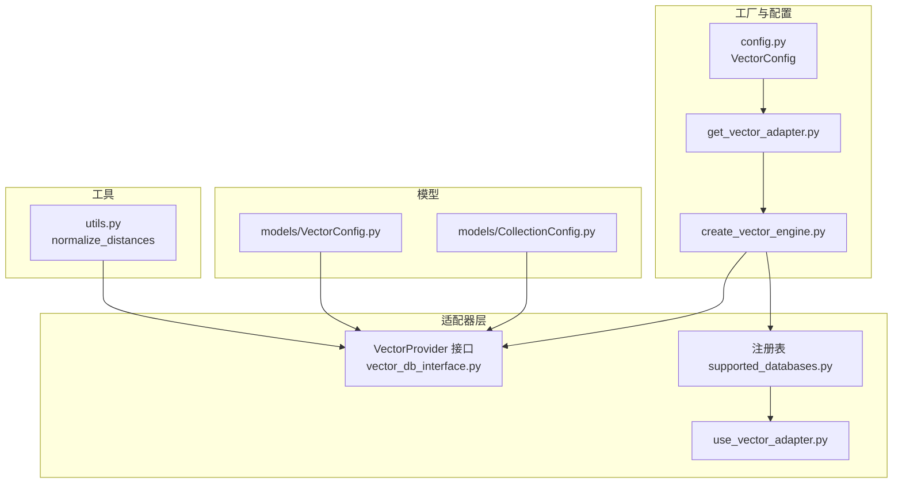
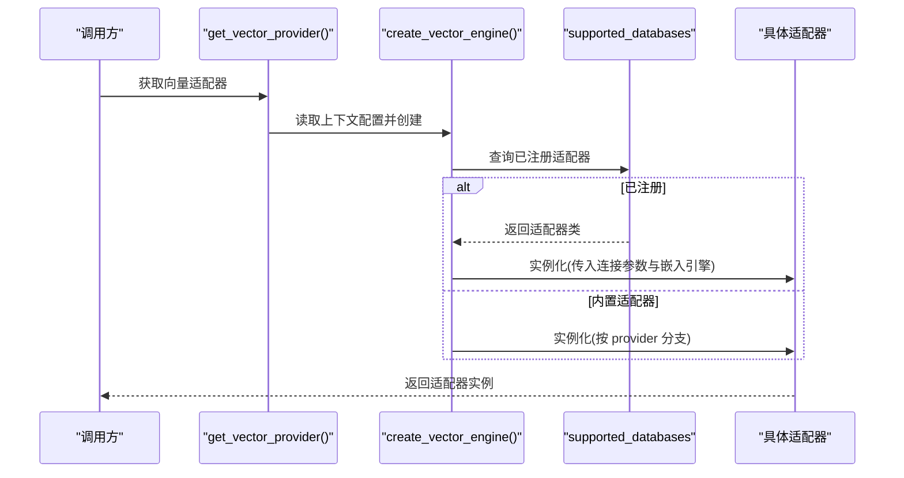
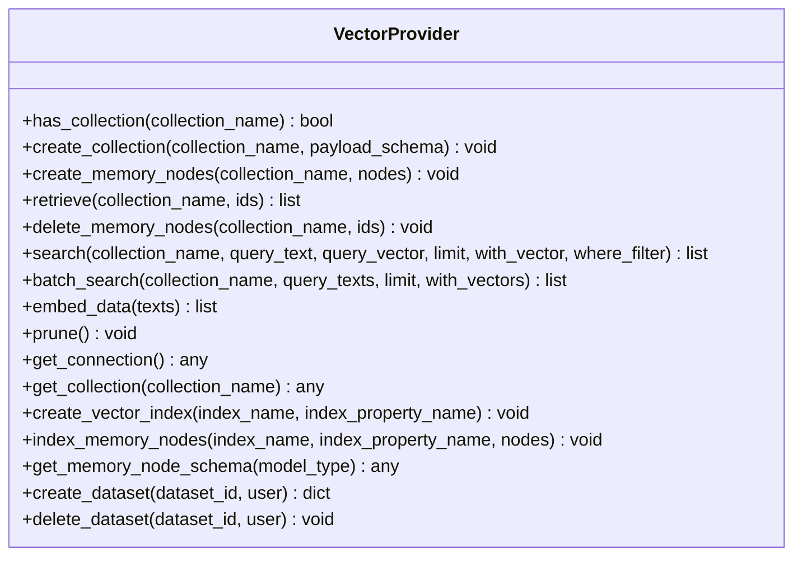
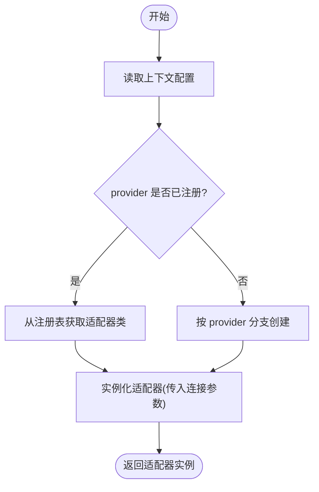
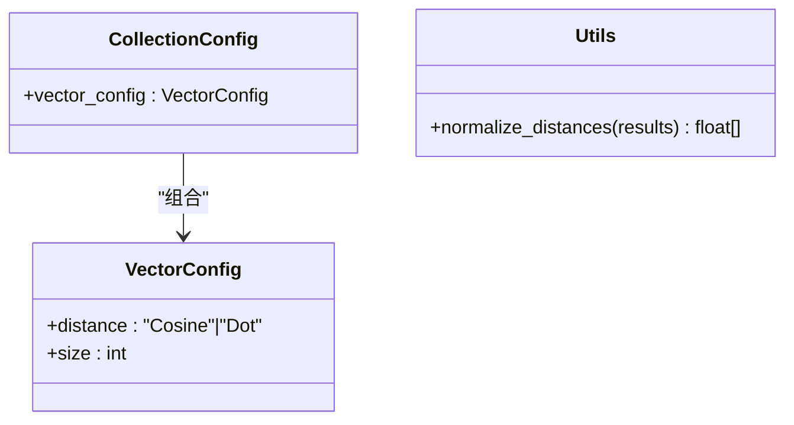
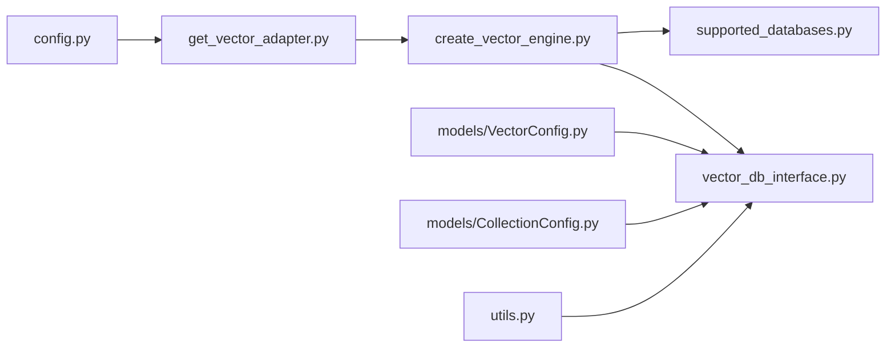

# 向量数据库适配器开发

<cite>
**本文引用的文件**
- [vector_db_interface.py](file://m_flow/adapters/vector/vector_db_interface.py)
- [__init__.py](file://m_flow/adapters/vector/__init__.py)
- [config.py](file://m_flow/adapters/vector/config.py)
- [create_vector_engine.py](file://m_flow/adapters/vector/create_vector_engine.py)
- [get_vector_adapter.py](file://m_flow/adapters/vector/get_vector_adapter.py)
- [supported_databases.py](file://m_flow/adapters/vector/supported_databases.py)
- [use_vector_adapter.py](file://m_flow/adapters/vector/use_vector_adapter.py)
- [utils.py](file://m_flow/adapters/vector/utils.py)
- [VectorConfig.py](file://m_flow/adapters/vector/models/VectorConfig.py)
- [CollectionConfig.py](file://m_flow/adapters/vector/models/CollectionConfig.py)
- [chromadb_example.py](file://examples/database_examples/chromadb_example.py)
- [pgvector_example.py](file://examples/database_examples/pgvector_example.py)
- [test_chromadb.py](file://m_flow/tests/test_chromadb.py)
- [test_pgvector.py](file://m_flow/tests/test_pgvector.py)
- [test_lancedb.py](file://m_flow/tests/test_lancedb.py)
</cite>

## 目录
1. [简介](#简介)
2. [项目结构](#项目结构)
3. [核心组件](#核心组件)
4. [架构总览](#架构总览)
5. [详细组件分析](#详细组件分析)
6. [依赖分析](#依赖分析)
7. [性能考虑](#性能考虑)
8. [故障排除指南](#故障排除指南)
9. [结论](#结论)
10. [附录](#附录)

## 简介
本指南面向需要在 M-Flow 中开发与集成向量数据库适配器的工程师与架构师。文档系统性阐述了向量数据库适配器的抽象接口、工厂与配置体系、以及针对 ChromaDB、pgvector、LanceDB 等后端的适配策略与性能优化要点；同时覆盖嵌入引擎集成、向量维度处理、相似度计算、批量操作、索引管理与维护等关键主题，并提供测试与故障排除建议。

## 项目结构
向量数据库适配器位于 m_flow/adapters/vector 目录下，采用“接口 + 工厂 + 配置 + 注册表”的分层设计：
- 接口层：定义统一的 VectorProvider 协议，约束集合管理、CRUD、搜索、嵌入、维护与可选扩展点。
- 工厂层：根据运行时配置动态创建具体适配器实例，支持内置与自定义注册适配器。
- 配置层：集中管理向量数据库连接参数与默认值，支持环境变量与上下文感知读取。
- 模型层：封装向量存储的配置模型（如距离度量、维度）与集合配置。
- 工具层：提供结果归一化等辅助能力。

**图表来源**
- [vector_db_interface.py:16-180](file://m_flow/adapters/vector/vector_db_interface.py#L16-L180)
- [supported_databases.py:1-8](file://m_flow/adapters/vector/supported_databases.py#L1-L8)
- [use_vector_adapter.py:10-13](file://m_flow/adapters/vector/use_vector_adapter.py#L10-L13)
- [config.py:26-77](file://m_flow/adapters/vector/config.py#L26-L77)
- [create_vector_engine.py:15-166](file://m_flow/adapters/vector/create_vector_engine.py#L15-L166)
- [get_vector_adapter.py:11-19](file://m_flow/adapters/vector/get_vector_adapter.py#L11-L19)
- [VectorConfig.py:20-48](file://m_flow/adapters/vector/models/VectorConfig.py#L20-L48)
- [CollectionConfig.py:15-19](file://m_flow/adapters/vector/models/CollectionConfig.py#L15-L19)
- [utils.py:13-46](file://m_flow/adapters/vector/utils.py#L13-L46)

**章节来源**
- [__init__.py:1-7](file://m_flow/adapters/vector/__init__.py#L1-L7)
- [config.py:26-77](file://m_flow/adapters/vector/config.py#L26-L77)
- [create_vector_engine.py:15-166](file://m_flow/adapters/vector/create_vector_engine.py#L15-L166)
- [get_vector_adapter.py:11-19](file://m_flow/adapters/vector/get_vector_adapter.py#L11-L19)
- [supported_databases.py:1-8](file://m_flow/adapters/vector/supported_databases.py#L1-L8)
- [use_vector_adapter.py:10-13](file://m_flow/adapters/vector/use_vector_adapter.py#L10-L13)
- [VectorConfig.py:20-48](file://m_flow/adapters/vector/models/VectorConfig.py#L20-L48)
- [CollectionConfig.py:15-19](file://m_flow/adapters/vector/models/CollectionConfig.py#L15-L19)
- [utils.py:13-46](file://m_flow/adapters/vector/utils.py#L13-L46)

## 核心组件
- VectorProvider 抽象接口：定义集合管理、内存节点 CRUD、语义搜索（单次与批量）、嵌入生成、维护清理与可选扩展点（连接句柄、集合句柄、向量索引、节点索引、模式转换、多租户数据集生命周期钩子）。
- 工厂与注册：通过 create_vector_engine 基于 provider 名称与连接参数创建适配器；支持内置适配器与 use_vector_adapter 动态注册自定义适配器。
- 配置系统：VectorConfig 提供连接参数与默认路径解析；get_vectordb_context_config 支持上下文感知读取。
- 模型与工具：VectorConfig 定义距离度量与维度；normalize_distances 提供距离归一化工具。

**章节来源**
- [vector_db_interface.py:16-180](file://m_flow/adapters/vector/vector_db_interface.py#L16-L180)
- [create_vector_engine.py:15-166](file://m_flow/adapters/vector/create_vector_engine.py#L15-L166)
- [config.py:26-77](file://m_flow/adapters/vector/config.py#L26-L77)
- [VectorConfig.py:20-48](file://m_flow/adapters/vector/models/VectorConfig.py#L20-L48)
- [utils.py:13-46](file://m_flow/adapters/vector/utils.py#L13-L46)

## 架构总览
适配器架构遵循“接口抽象 + 工厂选择 + 配置驱动 + 可插拔注册”的设计，确保对多种向量数据库后端的一致访问体验。

**图表来源**
- [get_vector_adapter.py:11-19](file://m_flow/adapters/vector/get_vector_adapter.py#L11-L19)
- [create_vector_engine.py:15-166](file://m_flow/adapters/vector/create_vector_engine.py#L15-L166)
- [supported_databases.py:7](file://m_flow/adapters/vector/supported_databases.py#L7)

## 详细组件分析

### VectorProvider 接口规范
- 集合管理：has_collection、create_collection
- 内存节点 CRUD：create_memory_nodes、retrieve、delete_memory_nodes
- 搜索：search（支持文本或向量查询、限制返回条数、是否返回向量、SQL-like 过滤表达式）、batch_search（批量查询）
- 嵌入：embed_data（文本到向量）
- 维护：prune（清理过期或孤儿数据）
- 可选扩展点：get_connection、get_collection、create_vector_index、index_memory_nodes、get_memory_node_schema
- 多租户钩子：create_dataset、delete_dataset

**图表来源**
- [vector_db_interface.py:16-180](file://m_flow/adapters/vector/vector_db_interface.py#L16-L180)

**章节来源**
- [vector_db_interface.py:16-180](file://m_flow/adapters/vector/vector_db_interface.py#L16-L180)

### 工厂与配置体系
- 配置模型：VectorConfig 负责连接参数与默认路径解析；支持从环境变量读取，自动将相对路径转绝对路径。
- 上下文配置：get_vectordb_context_config 优先从全局上下文读取，否则使用单例配置。
- 工厂函数：create_vector_engine 根据 provider 名称选择内置适配器或已注册适配器；内置支持 PGVector、ChromaDB、LanceDB、Neptune Analytics、Pinecone、Milvus 等。
- 适配器注册：use_vector_adapter 将自定义适配器类注册到 supported_databases 字典中。

**图表来源**
- [get_vector_adapter.py:11-19](file://m_flow/adapters/vector/get_vector_adapter.py#L11-L19)
- [create_vector_engine.py:15-166](file://m_flow/adapters/vector/create_vector_engine.py#L15-L166)
- [supported_databases.py:7](file://m_flow/adapters/vector/supported_databases.py#L7)
- [use_vector_adapter.py:10-13](file://m_flow/adapters/vector/use_vector_adapter.py#L10-L13)

**章节来源**
- [config.py:26-77](file://m_flow/adapters/vector/config.py#L26-L77)
- [get_vector_adapter.py:11-19](file://m_flow/adapters/vector/get_vector_adapter.py#L11-L19)
- [create_vector_engine.py:15-166](file://m_flow/adapters/vector/create_vector_engine.py#L15-L166)
- [supported_databases.py:7](file://m_flow/adapters/vector/supported_databases.py#L7)
- [use_vector_adapter.py:10-13](file://m_flow/adapters/vector/use_vector_adapter.py#L10-L13)

### 数据模型与工具
- VectorConfig：定义 distance（余弦或点积）与 size（向量维度），用于一致性校验与相似度计算。
- CollectionConfig：封装单个集合的向量配置。
- normalize_distances：对搜索结果中的距离进行最小-最大归一化，便于跨后端统一评分。

**图表来源**
- [VectorConfig.py:20-48](file://m_flow/adapters/vector/models/VectorConfig.py#L20-L48)
- [CollectionConfig.py:15-19](file://m_flow/adapters/vector/models/CollectionConfig.py#L15-L19)
- [utils.py:13-46](file://m_flow/adapters/vector/utils.py#L13-L46)

**章节来源**
- [VectorConfig.py:20-48](file://m_flow/adapters/vector/models/VectorConfig.py#L20-L48)
- [CollectionConfig.py:15-19](file://m_flow/adapters/vector/models/CollectionConfig.py#L15-L19)
- [utils.py:13-46](file://m_flow/adapters/vector/utils.py#L13-L46)

### 案例：ChromaDB 适配策略
- 适用场景：开源本地/远程部署，适合中小规模检索与快速原型。
- 关键点：
  - 使用 create_vector_engine 的 chromadb 分支创建适配器。
  - 通过 url 与 api_key 配置连接信息。
  - 遵循 VectorProvider 接口完成集合管理、CRUD、搜索与嵌入。
- 性能优化：
  - 合理设置查询 limit 与过滤条件，避免全表扫描。
  - 对高频查询建立集合索引（若后端支持）。
  - 批量插入与批量搜索提升吞吐。

**章节来源**
- [create_vector_engine.py:134-144](file://m_flow/adapters/vector/create_vector_engine.py#L134-L144)
- [vector_db_interface.py:28-103](file://m_flow/adapters/vector/vector_db_interface.py#L28-L103)

### 案例：pgvector 适配策略
- 适用场景：PostgreSQL 扩展，适合已有 Postgres 基础设施的团队。
- 关键点：
  - 通过 create_vector_engine 的 pgvector 分支，从关系型配置构建连接字符串。
  - 严格校验凭据完整性，缺失时报错。
  - 保持向量维度与嵌入模型输出一致。
- 性能优化：
  - 在向量列上建立 GIN/GIST 索引。
  - 利用 SQL 过滤表达式进行预过滤，减少候选集。
  - 批量写入与事务提交优化入库性能。

**章节来源**
- [create_vector_engine.py:114-132](file://m_flow/adapters/vector/create_vector_engine.py#L114-L132)
- [vector_db_interface.py:28-103](file://m_flow/adapters/vector/vector_db_interface.py#L28-L103)

### 案例：LanceDB 适配策略
- 适用场景：本地嵌入式向量库，零运维、低延迟。
- 关键点：
  - 默认路径指向系统根目录下的数据库文件夹。
  - 通过 create_vector_engine 的 lancedb 分支创建适配器。
- 性能优化：
  - 合理设置向量维度与索引类型。
  - 使用批量操作与缓存策略降低 I/O 开销。

**章节来源**
- [config.py:38-50](file://m_flow/adapters/vector/config.py#L38-L50)
- [create_vector_engine.py:92-101](file://m_flow/adapters/vector/create_vector_engine.py#L92-L101)
- [vector_db_interface.py:28-103](file://m_flow/adapters/vector/vector_db_interface.py#L28-L103)

### 嵌入引擎集成与相似度计算
- 嵌入引擎：工厂会先获取嵌入引擎，再将之注入到具体适配器构造函数中，确保所有后端共享同一嵌入模型。
- 相似度计算：VectorConfig.distance 支持余弦与点积两种度量；归一化工具可用于统一不同后端的距离范围。

**章节来源**
- [create_vector_engine.py:45](file://m_flow/adapters/vector/create_vector_engine.py#L45)
- [VectorConfig.py:39-47](file://m_flow/adapters/vector/models/VectorConfig.py#L39-L47)
- [utils.py:13-46](file://m_flow/adapters/vector/utils.py#L13-L46)

### 批量操作与索引管理
- 批量搜索：VectorProvider.batch_search 支持一次请求返回多个查询的结果列表。
- 索引管理：可选扩展点 create_vector_index 与 index_memory_nodes 允许后端实现自定义索引策略（如 Faiss、HNSW 等）。
- 维护：prune 用于清理过期或孤儿数据，保持索引与数据一致性。

**章节来源**
- [vector_db_interface.py:94-151](file://m_flow/adapters/vector/vector_db_interface.py#L94-L151)

## 依赖分析
- 组件耦合：
  - 工厂函数依赖注册表与嵌入引擎；注册表与 use_vector_adapter 低耦合。
  - 接口与具体实现解耦，通过协议约束实现多态。
- 外部依赖：
  - ChromaDB、PGVector、LanceDB、Neptune Analytics、Pinecone、Milvus 等后端均通过条件导入与异常提示保证可选依赖。
- 循环依赖：
  - 未发现循环导入；配置与工厂通过函数调用解耦。

**图表来源**
- [config.py:26-77](file://m_flow/adapters/vector/config.py#L26-L77)
- [get_vector_adapter.py:11-19](file://m_flow/adapters/vector/get_vector_adapter.py#L11-L19)
- [create_vector_engine.py:15-166](file://m_flow/adapters/vector/create_vector_engine.py#L15-L166)
- [supported_databases.py:7](file://m_flow/adapters/vector/supported_databases.py#L7)
- [vector_db_interface.py:16-180](file://m_flow/adapters/vector/vector_db_interface.py#L16-L180)
- [VectorConfig.py:20-48](file://m_flow/adapters/vector/models/VectorConfig.py#L20-L48)
- [CollectionConfig.py:15-19](file://m_flow/adapters/vector/models/CollectionConfig.py#L15-L19)
- [utils.py:13-46](file://m_flow/adapters/vector/utils.py#L13-L46)

**章节来源**
- [create_vector_engine.py:15-166](file://m_flow/adapters/vector/create_vector_engine.py#L15-L166)
- [supported_databases.py:7](file://m_flow/adapters/vector/supported_databases.py#L7)

## 性能考虑
- 批量化：
  - 使用 batch_search 与批量插入减少网络往返与上下文切换。
- 索引与过滤：
  - 在高维向量上建立高效索引；利用 where_filter 进行预过滤，缩小候选集。
- 维度与度量：
  - 确保向量维度与嵌入模型一致；根据场景选择余弦或点积度量。
- 归一化：
  - 使用 normalize_distances 统一不同后端的距离范围，便于阈值设定与排序。
- 存储与路径：
  - LanceDB 默认路径位于系统根目录下，注意磁盘空间与 IO 性能。

**章节来源**
- [utils.py:13-46](file://m_flow/adapters/vector/utils.py#L13-L46)
- [config.py:38-50](file://m_flow/adapters/vector/config.py#L38-L50)
- [VectorConfig.py:39-47](file://m_flow/adapters/vector/models/VectorConfig.py#L39-L47)

## 故障排除指南
- 未知适配器：
  - 当 provider 名称不在已注册列表与内置分支中时，工厂抛出环境错误，需检查拼写或注册流程。
- 缺失依赖：
  - ChromaDB、PGVector、Neptune Analytics 等依赖缺失时，工厂抛出 ImportError 并提示安装命令。
- 凭据不完整：
  - PGVector 依赖关系型配置的主机、端口、数据库名、用户名与密码，任一为空将报错。
- 测试参考：
  - 参考仓库中的 ChromaDB、pgvector、LanceDB 测试文件，验证适配器功能与稳定性。

**章节来源**
- [create_vector_engine.py:102-111](file://m_flow/adapters/vector/create_vector_engine.py#L102-L111)
- [create_vector_engine.py:136-139](file://m_flow/adapters/vector/create_vector_engine.py#L136-L139)
- [create_vector_engine.py:118-122](file://m_flow/adapters/vector/create_vector_engine.py#L118-L122)
- [test_chromadb.py](file://m_flow/tests/test_chromadb.py)
- [test_pgvector.py](file://m_flow/tests/test_pgvector.py)
- [test_lancedb.py](file://m_flow/tests/test_lancedb.py)

## 结论
通过统一的 VectorProvider 接口与工厂化配置体系，M-Flow 实现了对多种向量数据库的无缝适配。开发者只需遵循接口规范并正确集成嵌入引擎与配置参数，即可快速接入新后端。结合批量操作、索引管理与距离归一化等实践，可在不同场景下获得稳定且高性能的向量检索能力。

## 附录
- 示例参考：
  - ChromaDB 示例脚本路径：[chromadb_example.py](file://examples/database_examples/chromadb_example.py)
  - pgvector 示例脚本路径：[pgvector_example.py](file://examples/database_examples/pgvector_example.py)
- 测试参考：
  - ChromaDB 测试：[test_chromadb.py](file://m_flow/tests/test_chromadb.py)
  - pgvector 测试：[test_pgvector.py](file://m_flow/tests/test_pgvector.py)
  - LanceDB 测试：[test_lancedb.py](file://m_flow/tests/test_lancedb.py)