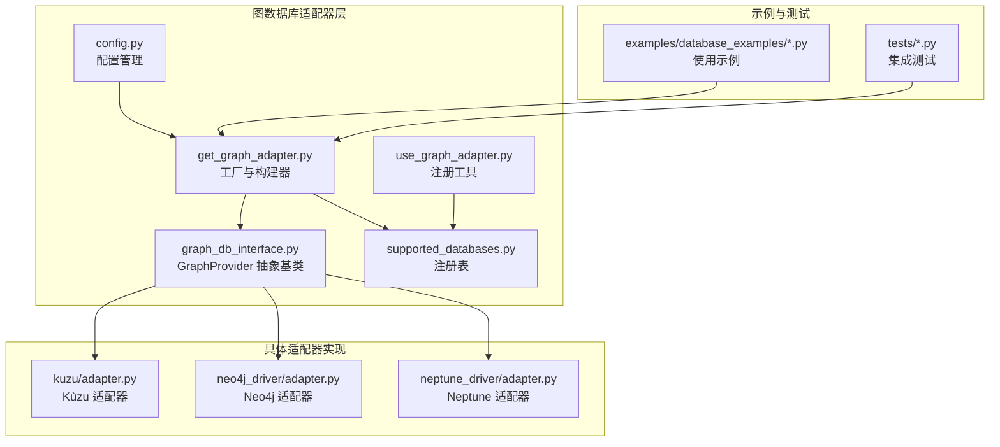
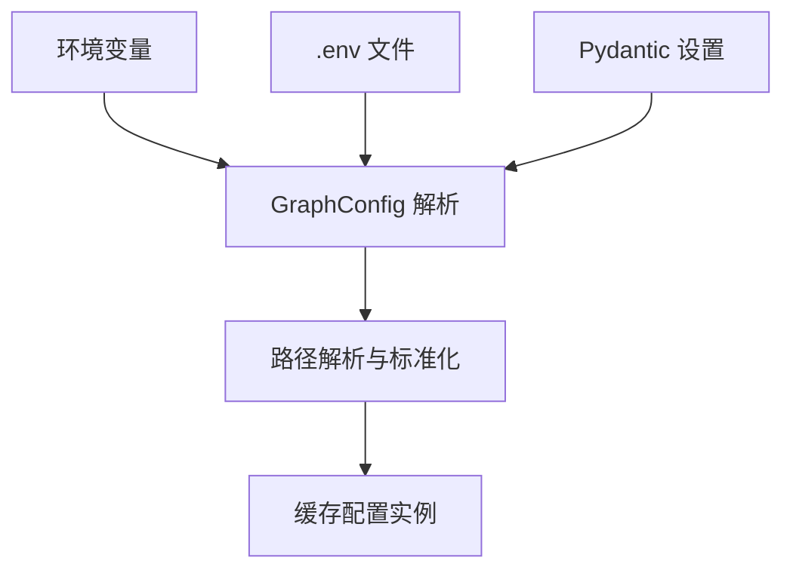
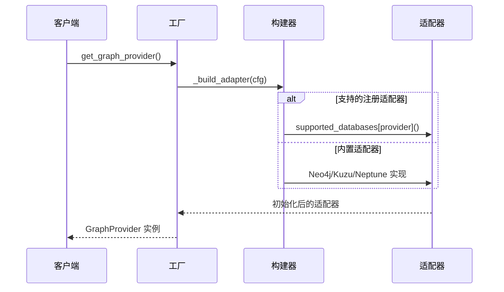
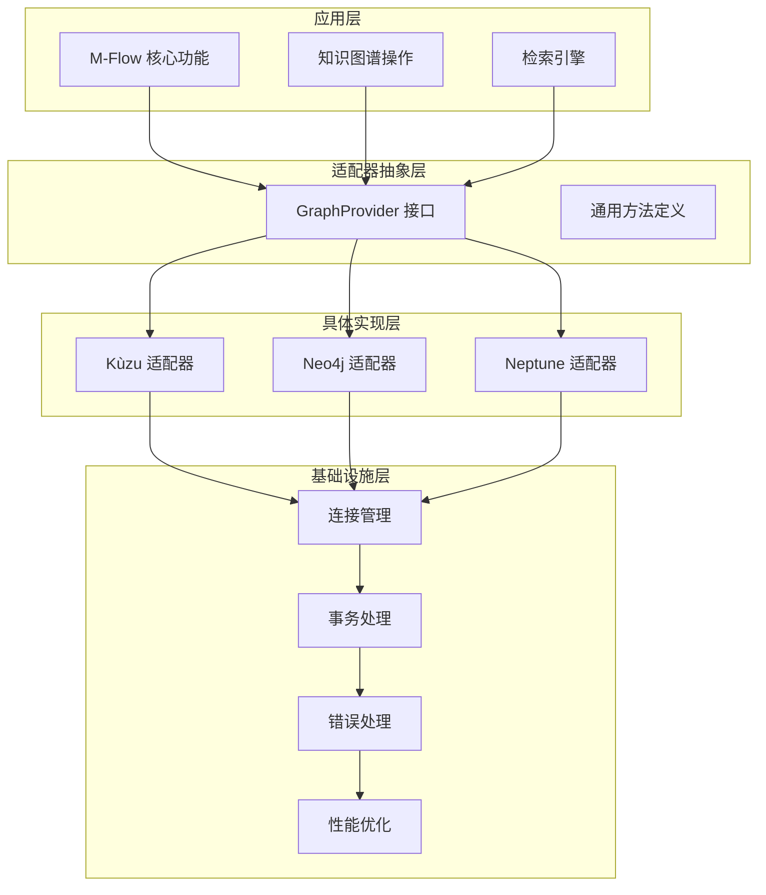
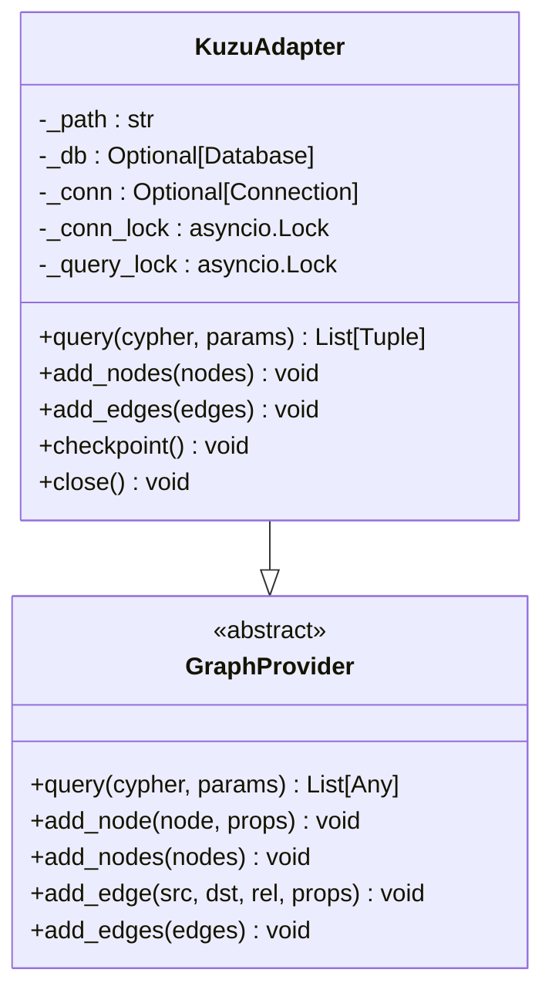
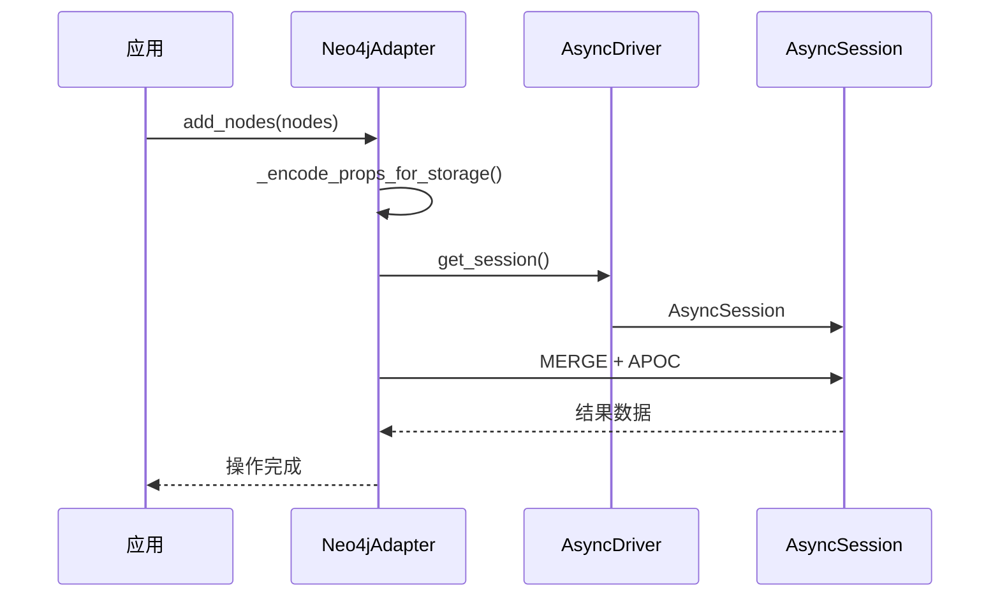
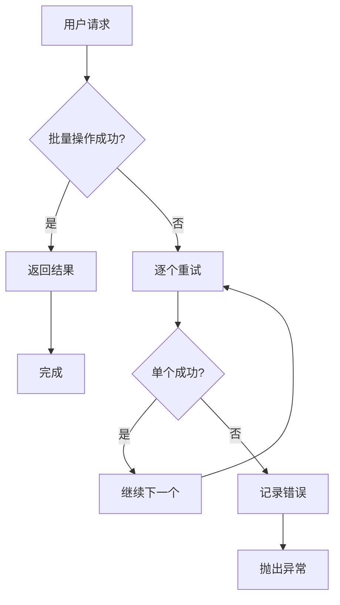
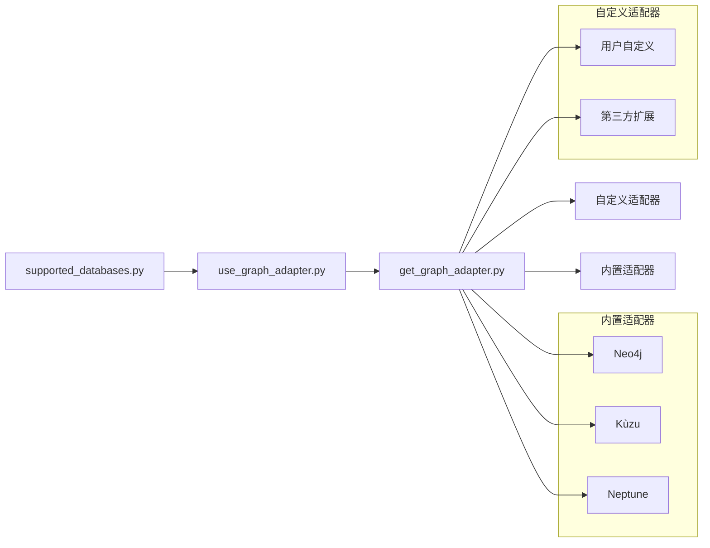
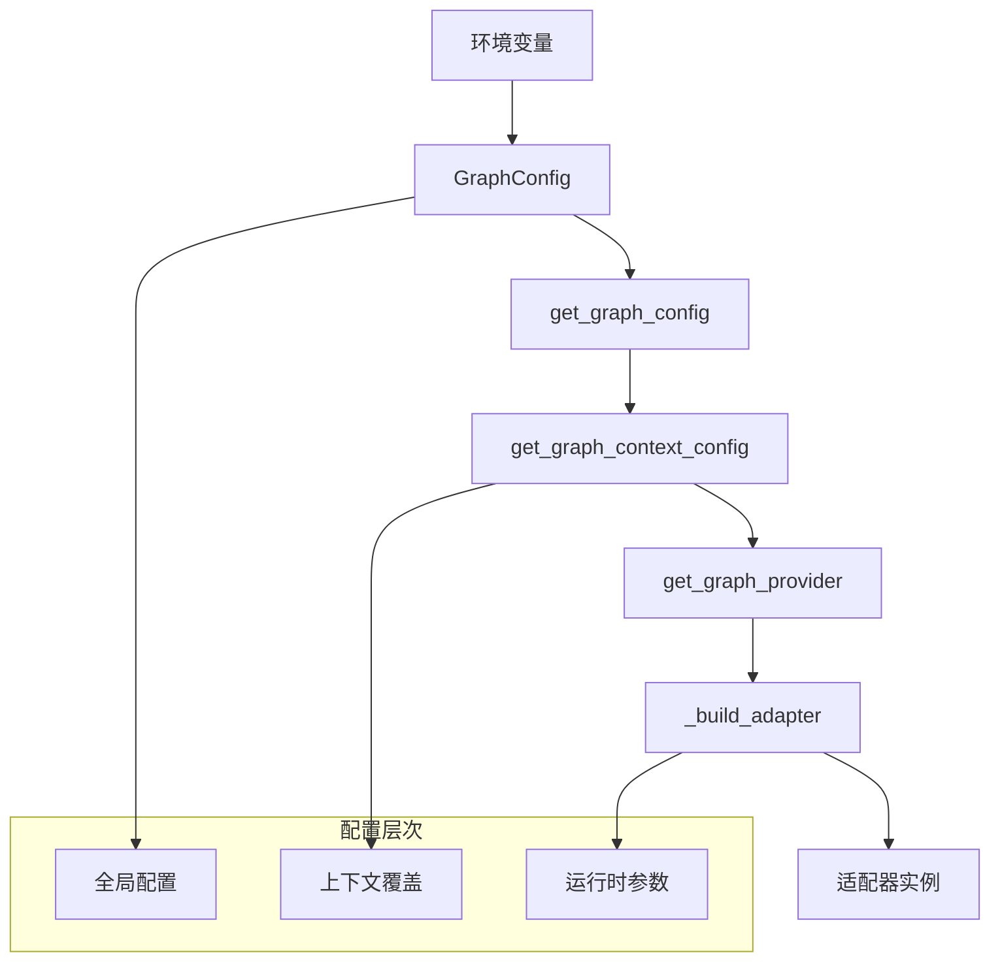
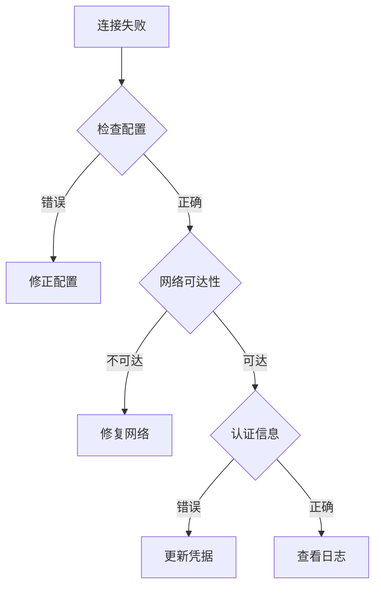

# 图数据库适配器开发

<cite>
**本文档引用的文件**
- [graph_db_interface.py](file://m_flow/adapters/graph/graph_db_interface.py)
- [get_graph_adapter.py](file://m_flow/adapters/graph/get_graph_adapter.py)
- [config.py](file://m_flow/adapters/graph/config.py)
- [supported_databases.py](file://m_flow/adapters/graph/supported_databases.py)
- [use_graph_adapter.py](file://m_flow/adapters/graph/use_graph_adapter.py)
- [adapter.py](file://m_flow/adapters/graph/kuzu/adapter.py)
- [adapter.py](file://m_flow/adapters/graph/neo4j_driver/adapter.py)
- [adapter.py](file://m_flow/adapters/graph/neptune_driver/adapter.py)
- [neo4j_example.py](file://examples/database_examples/neo4j_example.py)
- [kuzu_example.py](file://examples/database_examples/kuzu_example.py)
- [neptune_analytics_example.py](file://examples/database_examples/neptune_analytics_example.py)
- [test_neo4j.py](file://m_flow/tests/test_neo4j.py)
- [test_kuzu.py](file://m_flow/tests/test_kuzu.py)
</cite>

## 目录
1. [简介](#简介)
2. [项目结构](#项目结构)
3. [核心组件](#核心组件)
4. [架构概览](#架构概览)
5. [详细组件分析](#详细组件分析)
6. [依赖关系分析](#依赖关系分析)
7. [性能考虑](#性能考虑)
8. [故障排除指南](#故障排除指南)
9. [结论](#结论)
10. [附录](#附录)

## 简介

本指南面向需要为 M-Flow 框架开发图数据库适配器的开发者。文档基于现有的图数据库适配器实现（Neo4j、KùzuDB、Amazon Neptune），系统阐述了图数据库适配器的设计模式、接口规范和最佳实践。

M-Flow 的图数据库抽象通过 GraphProvider 抽象基类实现，统一了不同图数据库的访问接口。该抽象定义了节点/边 CRUD、图级操作、遍历辅助方法以及可选的持久化控制等能力，确保上层应用无需关心底层具体实现。

## 项目结构

M-Flow 的图数据库适配器位于 `m_flow/adapters/graph/` 目录下，采用模块化设计：



**图表来源**
- [graph_db_interface.py:1-347](file://m_flow/adapters/graph/graph_db_interface.py#L1-L347)
- [get_graph_adapter.py:1-159](file://m_flow/adapters/graph/get_graph_adapter.py#L1-L159)
- [config.py:1-128](file://m_flow/adapters/graph/config.py#L1-L128)

**章节来源**
- [graph_db_interface.py:1-347](file://m_flow/adapters/graph/graph_db_interface.py#L1-L347)
- [get_graph_adapter.py:1-159](file://m_flow/adapters/graph/get_graph_adapter.py#L1-L159)
- [config.py:1-128](file://m_flow/adapters/graph/config.py#L1-L128)

## 核心组件

### GraphProvider 抽象基类

GraphProvider 定义了图数据库适配器必须实现的完整接口，涵盖以下核心领域：

#### 查询执行接口
- `query(cypher: str, params: Dict[str, Any]) -> List[Any]`: 执行原生查询（Cypher/Gremlin）
- `is_empty() -> bool`: 检查图是否为空

#### 节点 CRUD 操作
- `add_node(node: Union[MemoryNode, str], props: Optional[NodeProps]) -> None`
- `add_nodes(nodes: List[Any]) -> None`
- `has_node(node_id: str) -> bool`
- `get_node(node_id: str) -> Optional[NodeProps]`
- `get_nodes(ids: List[str]) -> List[NodeProps]`
- `delete_node(node_id: str) -> None`
- `delete_nodes(ids: List[str]) -> None`

#### 边 CRUD 操作
- `add_edge(src: str, dst: str, rel: str, props: Optional[Dict[str, Any]]) -> None`
- `add_edges(edges: List[EdgeTuple]) -> None`
- `has_edge(src: str, dst: str, rel: str) -> bool`
- `has_edges(edges: List[EdgeTuple]) -> List[EdgeTuple]`
- `get_edges(node_id: str) -> List[EdgeTriple]`

#### 图级操作
- `delete_graph() -> None`
- `get_graph_data() -> Tuple[List[NodeTuple], List[EdgeTuple]]`
- `get_graph_metrics(extended: bool = False) -> Dict[str, Any]`
- `query_by_attributes(attribute_filters: List[Dict[str, List[Union[str, int]]]]) -> Tuple[List[NodeTuple], List[EdgeTuple]]`

#### 遍历辅助方法
- `get_neighbors(node_id: str) -> List[NodeProps]`
- `get_triplets(node_id: Union[str, UUID]) -> List[Tuple[NodeProps, Dict[str, Any], NodeProps]]`
- `extract_typed_subgraph(node_type: Type[Any], names: List[str]) -> Tuple[List[Tuple[int, dict]], List[Tuple[int, int, str, dict]]]`

#### 可选扩展操作
- `update_node(node_id: str, props: Dict[str, Any]) -> None`: 默认实现为读取-修改-写入
- `delete_edge(src: str, dst: str, rel: str) -> None`: 默认未实现
- `get_document_subgraph(data_id: str) -> Optional[Dict[str, list]]`: 获取文档相关子图
- `checkpoint() -> None`: 强制持久化检查点（适用于 WAL 数据库）

#### 关键设计特性
- **装饰器支持**: 使用 `@record_graph_changes` 装饰器自动记录节点/边变更到关系账本
- **类型别名**: 定义了 `NodeProps`、`EdgeTuple`、`NodeTuple`、`EdgeTriple` 等类型别名
- **异步接口**: 所有方法均为异步，支持现代 Python 异步编程模型
- **默认实现**: 提供合理的默认实现，允许适配器选择性覆盖

**章节来源**
- [graph_db_interface.py:122-347](file://m_flow/adapters/graph/graph_db_interface.py#L122-L347)

### 工厂与配置系统

#### 配置管理
GraphConfig 提供统一的配置模型，支持环境变量和文件配置：



**图表来源**
- [config.py:29-106](file://m_flow/adapters/graph/config.py#L29-L106)

#### 适配器工厂
get_graph_provider 提供统一的适配器创建入口：



**图表来源**
- [get_graph_adapter.py:22-131](file://m_flow/adapters/graph/get_graph_adapter.py#L22-L131)

**章节来源**
- [config.py:29-128](file://m_flow/adapters/graph/config.py#L29-L128)
- [get_graph_adapter.py:22-159](file://m_flow/adapters/graph/get_graph_adapter.py#L22-L159)

## 架构概览

M-Flow 的图数据库适配器采用分层架构设计：



**图表来源**
- [graph_db_interface.py:122-347](file://m_flow/adapters/graph/graph_db_interface.py#L122-L347)
- [get_graph_adapter.py:44-131](file://m_flow/adapters/graph/get_graph_adapter.py#L44-L131)

## 详细组件分析

### KùzuDB 适配器

KùzuDB 是嵌入式图数据库，适配器实现了完整的异步接口：

#### 连接管理
- 使用 `Database` 和 `Connection` 类型
- 支持本地文件存储和 S3 同步
- 实现连接状态管理和自动重连

#### 查询执行
- 将 Cypher 查询转换为 Kùzu 原生查询
- 处理属性序列化和反序列化
- 支持批量操作和冲突处理

#### 性能优化
- 实现写冲突分区算法避免并发写入冲突
- 支持分布式锁机制
- 提供检查点强制持久化



**图表来源**
- [adapter.py:144-188](file://m_flow/adapters/graph/kuzu/adapter.py#L144-L188)
- [graph_db_interface.py:122-347](file://m_flow/adapters/graph/graph_db_interface.py#L122-L347)

**章节来源**
- [adapter.py:144-800](file://m_flow/adapters/graph/kuzu/adapter.py#L144-L800)

### Neo4j 适配器

Neo4j 适配器提供了企业级图数据库功能：

#### 节点标签管理
- 使用 `__Node__` 基础标签确保一致性
- 自动创建唯一性约束
- 支持动态标签添加

#### 边属性处理
- 实现复杂的属性扁平化逻辑
- 支持嵌套对象和列表的 JSON 序列化
- 权重属性的特殊处理

#### 性能增强
- 集成 GDS 图投影功能
- 实现死锁重试机制
- 支持分布式队列批量操作



**图表来源**
- [adapter.py:90-153](file://m_flow/adapters/graph/neo4j_driver/adapter.py#L90-L153)

**章节来源**
- [adapter.py:90-800](file://m_flow/adapters/graph/neo4j_driver/adapter.py#L90-L800)

### Amazon Neptune 适配器

Neptune 适配器专注于云原生图数据库：

#### AWS 集成
- 使用 `langchain_aws` SDK
- 支持多种认证方式（IAM 角色、密钥对、临时令牌）
- 实现区域验证和配置校验

#### 错误处理
- 统一的错误格式化机制
- 自动降级到单个操作
- 详细的日志记录

#### 扩展功能
- 实现图指标计算
- 支持子图提取
- 提供文档相关子图查询



**图表来源**
- [adapter.py:282-315](file://m_flow/adapters/graph/neptune_driver/adapter.py#L282-L315)

**章节来源**
- [adapter.py:108-800](file://m_flow/adapters/graph/neptune_driver/adapter.py#L108-L800)

## 依赖关系分析

### 适配器注册系统



**图表来源**
- [supported_databases.py:7](file://m_flow/adapters/graph/supported_databases.py#L7)
- [use_graph_adapter.py:10-12](file://m_flow/adapters/graph/use_graph_adapter.py#L10-L12)
- [get_graph_adapter.py:66-73](file://m_flow/adapters/graph/get_graph_adapter.py#L66-L73)

### 配置依赖链



**图表来源**
- [config.py:109-127](file://m_flow/adapters/graph/config.py#L109-L127)
- [get_graph_adapter.py:22-35](file://m_flow/adapters/graph/get_graph_adapter.py#L22-L35)

**章节来源**
- [supported_databases.py:1-8](file://m_flow/adapters/graph/supported_databases.py#L1-L8)
- [use_graph_adapter.py:1-13](file://m_flow/adapters/graph/use_graph_adapter.py#L1-L13)
- [get_graph_adapter.py:44-131](file://m_flow/adapters/graph/get_graph_adapter.py#L44-L131)

## 性能考虑

### 连接池管理
- **Neo4j**: 使用连接池和会话管理，设置最大连接生命周期
- **Kùzu**: 实现分布式锁避免并发写入冲突
- **Neptune**: 利用云原生连接管理

### 批量操作优化
- **Kùzu**: 实现写冲突分区算法，避免内部写写冲突
- **Neo4j**: 使用 UNWIND 语句进行批量操作
- **Neptune**: 分组按关系类型批量插入

### 缓存策略
- **路径缓存**: 使用 LRU 缓存配置信息
- **连接复用**: 在适配器级别维护连接状态
- **查询结果缓存**: 根据使用场景实现适当的缓存

### 并发控制
- **线程安全**: 所有适配器都实现了适当的并发控制
- **资源管理**: 使用上下文管理器确保资源正确释放
- **超时处理**: 实现合理的超时和重试机制

## 故障排除指南

### 常见问题诊断

#### 连接问题


#### 查询性能问题
- 检查索引和约束
- 分析查询计划
- 调整批量大小
- 实现适当的缓存策略

#### 并发冲突
- **Kùzu**: 检查写冲突分区算法
- **Neo4j**: 实现死锁重试
- **Neptune**: 使用 AWS 提供的并发控制

### 日志分析
- **详细日志**: 启用调试级别日志
- **性能指标**: 监控查询响应时间
- **错误统计**: 记录常见错误类型

**章节来源**
- [adapter.py:537-549](file://m_flow/adapters/graph/kuzu/adapter.py#L537-L549)
- [adapter.py:160-179](file://m_flow/adapters/graph/neo4j_driver/adapter.py#L160-L179)

## 结论

M-Flow 的图数据库适配器框架提供了高度一致的抽象接口和灵活的实现机制。通过 GraphProvider 抽象基类，开发者可以轻松地为新的图数据库实现适配器，同时保持与现有系统的兼容性。

关键成功因素包括：
- 严格遵循 GraphProvider 接口规范
- 实现适当的连接管理和并发控制
- 提供完善的错误处理和日志记录
- 优化批量操作和查询性能
- 实现必要的配置管理和安全考虑

## 附录

### 开发新适配器步骤

#### 1. 创建适配器类
```python
class MyGraphAdapter(GraphProvider):
    def __init__(self, config_params):
        # 初始化连接
        pass
    
    async def query(self, cypher, params):
        # 实现查询执行
        pass
    
    # 实现所有必需的方法...
```

#### 2. 注册适配器
```python
use_graph_adapter("my_adapter", MyGraphAdapter)
```

#### 3. 配置使用
```python
m_flow.config.set_graph_db_config({
    "graph_database_provider": "my_adapter",
    # 其他配置参数
})
```

#### 4. 测试验证
- 单元测试：验证基本 CRUD 操作
- 集成测试：验证与完整工作流的集成
- 性能测试：评估批量操作性能
- 并发测试：验证多线程安全性

### 最佳实践清单

#### 设计原则
- **单一职责**: 每个适配器只负责特定数据库
- **接口一致性**: 严格遵循 GraphProvider 规范
- **错误隔离**: 将数据库特定错误转换为通用异常
- **资源管理**: 确保连接和资源的正确清理

#### 性能优化
- **批量操作**: 优先使用批量 API
- **连接复用**: 避免频繁创建/销毁连接
- **查询优化**: 实现适当的索引和约束
- **缓存策略**: 根据使用模式实现智能缓存

#### 安全考虑
- **凭据管理**: 使用环境变量或安全存储
- **网络加密**: 启用 TLS/SSL 连接
- **权限控制**: 实施最小权限原则
- **审计日志**: 记录关键操作和错误

#### 监控和运维
- **健康检查**: 实现连接状态监控
- **性能指标**: 收集查询延迟和吞吐量
- **告警机制**: 设置异常情况通知
- **备份恢复**: 实现数据备份和恢复策略