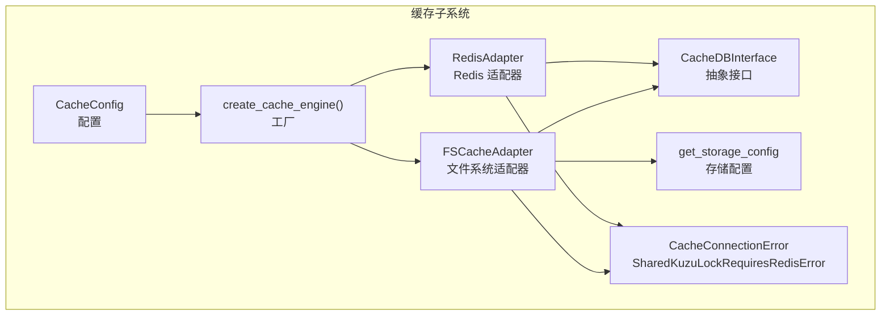
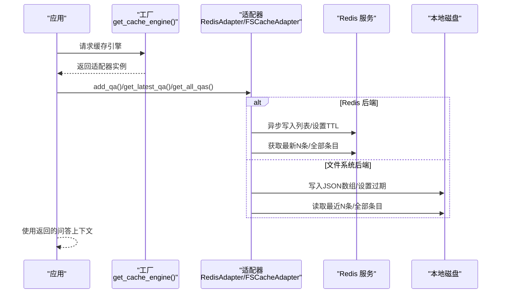
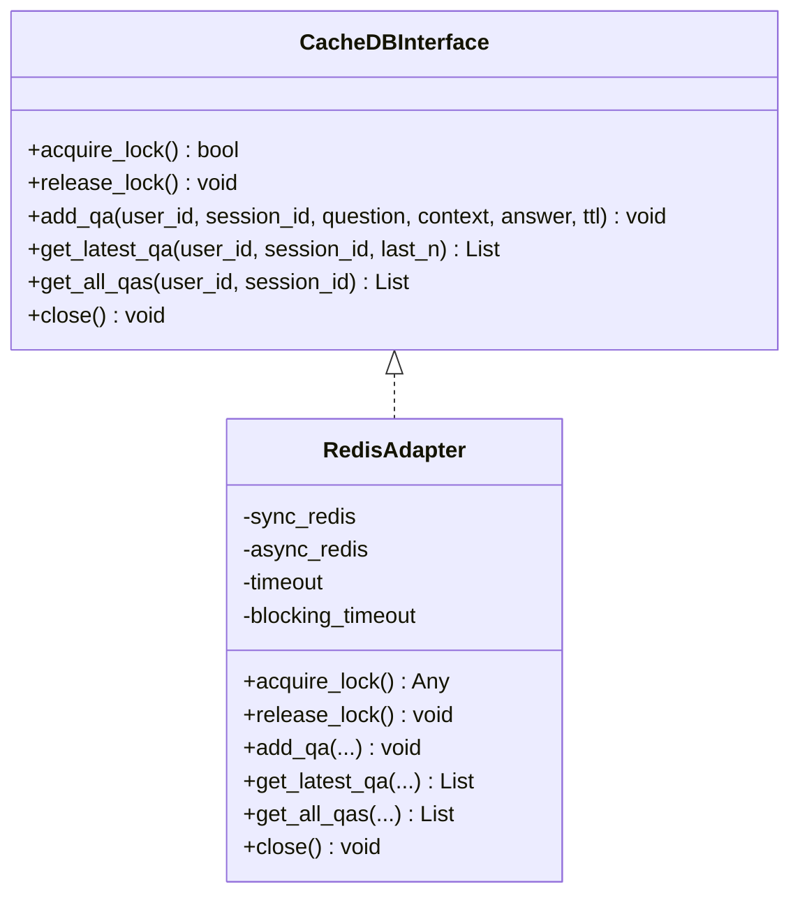
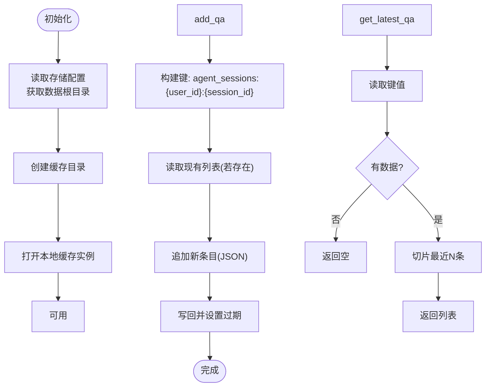
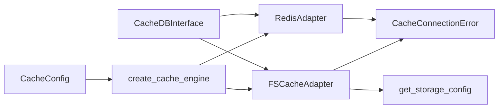

# 缓存适配器开发

<cite>
**本文档引用的文件**
- [cache_db_interface.py](file://m_flow/adapters/cache/cache_db_interface.py)
- [get_cache_engine.py](file://m_flow/adapters/cache/get_cache_engine.py)
- [config.py](file://m_flow/adapters/cache/config.py)
- [FsCacheAdapter.py](file://m_flow/adapters/cache/fscache/FsCacheAdapter.py)
- [RedisAdapter.py](file://m_flow/adapters/cache/redis/RedisAdapter.py)
- [exceptions.py](file://m_flow/adapters/exceptions/exceptions.py)
- [get_storage_config.py](file://m_flow/shared/files/storage/get_storage_config.py)
- [test_conversation_history.py](file://m_flow/tests/test_conversation_history.py)
- [test_cache_config.py](file://m_flow/tests/unit/infrastructure/databases/cache/test_cache_config.py)
</cite>

## 目录
1. [简介](#简介)
2. [项目结构](#项目结构)
3. [核心组件](#核心组件)
4. [架构总览](#架构总览)
5. [详细组件分析](#详细组件分析)
6. [依赖关系分析](#依赖关系分析)
7. [性能考量](#性能考量)
8. [故障排查指南](#故障排查指南)
9. [结论](#结论)
10. [附录](#附录)

## 简介
本指南面向需要在 M-Flow 中开发与集成缓存适配器的工程师，系统阐述缓存抽象接口、工厂创建流程、Redis 与文件系统两种适配器的实现要点，以及连接管理、序列化与过期策略。文档同时给出键设计建议、数据一致性保障、性能优化实践，并通过实际源码路径指引帮助读者快速定位实现细节。

## 项目结构
缓存子系统位于适配器层的 cache 子包中，采用“抽象接口 + 工厂 + 具体适配器”的分层设计：
- 抽象接口：定义分布式锁与问答会话存储能力
- 配置模块：集中管理缓存后端、连接参数与分布式锁超时
- 工厂模块：根据配置动态选择 Redis 或文件系统适配器
- 具体适配器：RedisAdapter（支持分布式锁与会话存储）、FsCacheAdapter（本地磁盘缓存，不支持分布式锁）
- 异常模块：统一缓存相关错误类型
- 存储配置：为文件系统适配器提供根目录等存储信息

图表来源
- [cache_db_interface.py:12-125](file://m_flow/adapters/cache/cache_db_interface.py#L12-L125)
- [config.py:25-89](file://m_flow/adapters/cache/config.py#L25-L89)
- [get_cache_engine.py:19-79](file://m_flow/adapters/cache/get_cache_engine.py#L19-L79)
- [RedisAdapter.py:24-179](file://m_flow/adapters/cache/redis/RedisAdapter.py#L24-L179)
- [FsCacheAdapter.py:27-111](file://m_flow/adapters/cache/fscache/FsCacheAdapter.py#L27-L111)
- [exceptions.py:75-87](file://m_flow/adapters/exceptions/exceptions.py#L75-L87)
- [get_storage_config.py:23-27](file://m_flow/shared/files/storage/get_storage_config.py#L23-L27)

章节来源
- [cache_db_interface.py:12-125](file://m_flow/adapters/cache/cache_db_interface.py#L12-L125)
- [config.py:25-89](file://m_flow/adapters/cache/config.py#L25-L89)
- [get_cache_engine.py:19-79](file://m_flow/adapters/cache/get_cache_engine.py#L19-L79)

## 核心组件
- 抽象接口 CacheDBInterface：定义分布式锁原语与问答会话存储接口，确保不同后端的一致行为契约。
- 配置 CacheConfig：集中管理缓存后端、连接参数、分布式锁超时等；提供单例获取函数。
- 工厂 create_cache_engine/get_cache_engine：依据配置创建具体适配器实例，支持 Redis 与文件系统两种后端。
- RedisAdapter：提供同步/异步 Redis 客户端、分布式锁、会话列表存储与 TTL 过期控制。
- FsCacheAdapter：基于 diskcache 的本地磁盘缓存，提供会话存储与过期清理，不支持分布式锁。
- 异常类型：统一缓存连接失败与共享锁需 Redis 的错误类型。

章节来源
- [cache_db_interface.py:12-125](file://m_flow/adapters/cache/cache_db_interface.py#L12-L125)
- [config.py:25-89](file://m_flow/adapters/cache/config.py#L25-L89)
- [get_cache_engine.py:19-79](file://m_flow/adapters/cache/get_cache_engine.py#L19-L79)
- [RedisAdapter.py:24-179](file://m_flow/adapters/cache/redis/RedisAdapter.py#L24-L179)
- [FsCacheAdapter.py:27-111](file://m_flow/adapters/cache/fscache/FsCacheAdapter.py#L27-L111)
- [exceptions.py:75-87](file://m_flow/adapters/exceptions/exceptions.py#L75-L87)

## 架构总览
缓存子系统的运行时交互如下：应用通过工厂获取缓存引擎，随后在问答检索或会话管理场景中调用接口进行数据持久化与查询；Redis 适配器同时提供分布式锁能力，文件系统适配器仅提供本地会话存储。

图表来源
- [get_cache_engine.py:68-79](file://m_flow/adapters/cache/get_cache_engine.py#L68-L79)
- [RedisAdapter.py:116-178](file://m_flow/adapters/cache/redis/RedisAdapter.py#L116-L178)
- [FsCacheAdapter.py:54-110](file://m_flow/adapters/cache/fscache/FsCacheAdapter.py#L54-L110)

## 详细组件分析

### 抽象接口：CacheDBInterface
- 职责边界
  - 分布式锁：acquire_lock/release_lock/hold_lock
  - 问答会话存储：add_qa/get_latest_qa/get_all_qas
  - 生命周期：close
- 设计要点
  - 统一的属性访问（host/port/lock_key/lock）便于上层一致化调用
  - 锁原语提供上下文管理器，简化持有期的资源释放
  - 问答接口均声明为异步，便于与异步 Redis 客户端配合

章节来源
- [cache_db_interface.py:12-125](file://m_flow/adapters/cache/cache_db_interface.py#L12-L125)

### 配置：CacheConfig
- 关键字段
  - cache_backend：后端标识（"redis"/"fs"）
  - caching：全局开关，关闭时工厂返回 None
  - shared_kuzu_lock：是否启用跨进程锁（用于嵌入式 Kùzu）
  - cache_host/cache_port：Redis 地址与端口（fs 模式忽略）
  - cache_username/cache_password：Redis 认证凭据
  - agentic_lock_expire/agentic_lock_timeout：分布式锁超时与等待时间
- 单例模式：通过 LRU 缓存的 get_cache_config 提供进程内唯一配置实例

章节来源
- [config.py:25-89](file://m_flow/adapters/cache/config.py#L25-L89)

### 工厂：create_cache_engine/get_cache_engine
- 行为
  - 若 caching 为 False，直接返回 None
  - 根据 cache_backend 选择 RedisAdapter 或 FSCacheAdapter
  - Redis 适配器传入用户名/密码、锁名、锁超时与阻塞超时
- 可扩展性
  - 新增后端时在工厂中添加分支并导入对应适配器类

章节来源
- [get_cache_engine.py:19-79](file://m_flow/adapters/cache/get_cache_engine.py#L19-L79)

### Redis 适配器：RedisAdapter
- 连接与健康检查
  - 同步/异步客户端分离，分别用于锁与数据操作
  - 初始化阶段执行 ping 校验，失败抛出缓存连接异常
- 分布式锁
  - 使用 Redis 锁，支持超时与阻塞超时
  - 提供上下文管理器 hold_lock，确保异常路径也能释放
- 数据序列化与过期
  - 问答条目序列化为 JSON 字符串，作为列表元素追加
  - 支持按秒设置 TTL，实现自动过期
- 查询策略
  - 最近 N 条：使用列表范围读取
  - 单条：使用列表索引读取
  - 全量：读取整个列表

图表来源
- [cache_db_interface.py:12-125](file://m_flow/adapters/cache/cache_db_interface.py#L12-L125)
- [RedisAdapter.py:24-179](file://m_flow/adapters/cache/redis/RedisAdapter.py#L24-L179)

章节来源
- [RedisAdapter.py:24-179](file://m_flow/adapters/cache/redis/RedisAdapter.py#L24-L179)

### 文件系统适配器：FsCacheAdapter
- 存储位置
  - 基于存储配置获取数据根目录，创建专用缓存目录
- 键设计
  - 使用统一前缀与用户/会话 ID 组合形成键，避免冲突
- 序列化与过期
  - 列表以 JSON 数组形式存储，元素为字典条目
  - 设置过期时间，定期清理
- 锁支持
  - 不支持分布式锁，尝试获取锁时抛出需使用 Redis 的异常

图表来源
- [FsCacheAdapter.py:35-110](file://m_flow/adapters/cache/fscache/FsCacheAdapter.py#L35-L110)
- [get_storage_config.py:23-27](file://m_flow/shared/files/storage/get_storage_config.py#L23-L27)

章节来源
- [FsCacheAdapter.py:27-111](file://m_flow/adapters/cache/fscache/FsCacheAdapter.py#L27-L111)
- [get_storage_config.py:17-27](file://m_flow/shared/files/storage/get_storage_config.py#L17-L27)

### 键设计最佳实践
- 命名空间隔离：统一前缀（如 agent_sessions）避免键冲突
- 用户与会话维度：键中包含 user_id 与 session_id，确保多用户/多会话隔离
- 可读性与可维护性：键结构清晰，便于调试与排障
- 建议参考
  - Redis：使用冒号分隔的层级键
  - 文件系统：在键中包含用户与会话 ID，结合本地目录结构

章节来源
- [RedisAdapter.py:136-149](file://m_flow/adapters/cache/redis/RedisAdapter.py#L136-L149)
- [FsCacheAdapter.py:65-78](file://m_flow/adapters/cache/fscache/FsCacheAdapter.py#L65-L78)

### 数据一致性与过期策略
- 一致性
  - Redis：列表操作原子性较强；分布式锁用于并发写入保护
  - 文件系统：单进程/单实例下顺序写入；多实例需外部协调（推荐 Redis）
- 过期策略
  - Redis：按秒设置 TTL，自动过期
  - 文件系统：定期清理与惰性过期相结合
- 建议
  - 生产环境优先使用 Redis 以获得更强的一致性与锁能力
  - 文件系统适配器适合开发/单机场景

章节来源
- [RedisAdapter.py:146-149](file://m_flow/adapters/cache/redis/RedisAdapter.py#L146-L149)
- [FsCacheAdapter.py:78-81](file://m_flow/adapters/cache/fscache/FsCacheAdapter.py#L78-L81)

### 性能优化建议
- Redis
  - 复用连接：工厂已创建同步/异步客户端，避免频繁创建
  - 批量读取：尽量使用列表范围读取而非多次索引
  - TTL 合理设置：平衡内存占用与访问频率
- 文件系统
  - 控制列表长度：限制最近 N 条数量，降低读写开销
  - 定期清理：利用过期机制减少无效数据

章节来源
- [RedisAdapter.py:163-168](file://m_flow/adapters/cache/redis/RedisAdapter.py#L163-L168)
- [FsCacheAdapter.py:96-97](file://m_flow/adapters/cache/fscache/FsCacheAdapter.py#L96-L97)

## 依赖关系分析
- 接口与实现
  - RedisAdapter 与 FSCacheAdapter 均继承 CacheDBInterface，确保上层调用一致
- 工厂与配置
  - 工厂依赖配置模块决定后端类型；配置模块提供单例
- 异常与存储
  - 适配器在连接失败时抛出统一异常类型
  - 文件系统适配器依赖存储配置模块获取根目录

图表来源
- [cache_db_interface.py:12-125](file://m_flow/adapters/cache/cache_db_interface.py#L12-L125)
- [get_cache_engine.py:19-79](file://m_flow/adapters/cache/get_cache_engine.py#L19-L79)
- [config.py:25-89](file://m_flow/adapters/cache/config.py#L25-L89)
- [FsCacheAdapter.py:27-111](file://m_flow/adapters/cache/fscache/FsCacheAdapter.py#L27-L111)
- [get_storage_config.py:23-27](file://m_flow/shared/files/storage/get_storage_config.py#L23-L27)
- [exceptions.py:75-87](file://m_flow/adapters/exceptions/exceptions.py#L75-L87)

章节来源
- [cache_db_interface.py:12-125](file://m_flow/adapters/cache/cache_db_interface.py#L12-L125)
- [get_cache_engine.py:19-79](file://m_flow/adapters/cache/get_cache_engine.py#L19-L79)
- [config.py:25-89](file://m_flow/adapters/cache/config.py#L25-L89)
- [FsCacheAdapter.py:27-111](file://m_flow/adapters/cache/fscache/FsCacheAdapter.py#L27-L111)
- [get_storage_config.py:23-27](file://m_flow/shared/files/storage/get_storage_config.py#L23-L27)
- [exceptions.py:75-87](file://m_flow/adapters/exceptions/exceptions.py#L75-L87)

## 性能考量
- 连接复用
  - RedisAdapter 在初始化时建立同步/异步客户端，避免每次操作新建连接
- 读写路径
  - Redis：列表操作具备较高吞吐；批量读取优于多次单条读取
  - 文件系统：控制列表长度与定期清理，减少磁盘 IO
- 锁竞争
  - Redis 锁超时与阻塞超时参数需结合业务并发与响应时间权衡

章节来源
- [RedisAdapter.py:51-75](file://m_flow/adapters/cache/redis/RedisAdapter.py#L51-L75)
- [RedisAdapter.py:163-168](file://m_flow/adapters/cache/redis/RedisAdapter.py#L163-L168)

## 故障排查指南
- 常见问题
  - 缓存不可用：检查配置中的 caching 与 cache_backend；确认 Redis 地址/凭据；查看连接异常
  - 共享锁需 Redis：文件系统适配器不支持分布式锁，需切换到 Redis
- 定位方法
  - 查看工厂返回值是否为 None（caching 关闭）
  - 检查 Redis ping 与连接参数
  - 观察异常类型 CacheConnectionError 与 SharedKuzuLockRequiresRedisError
- 测试参考
  - 会话历史测试展示了如何通过缓存引擎读取问答条目
  - 缓存配置测试覆盖了默认值、自定义值与单例行为

章节来源
- [exceptions.py:75-87](file://m_flow/adapters/exceptions/exceptions.py#L75-L87)
- [test_conversation_history.py:40-126](file://m_flow/tests/test_conversation_history.py#L40-L126)
- [test_cache_config.py:11-117](file://m_flow/tests/unit/infrastructure/databases/cache/test_cache_config.py#L11-L117)

## 结论
通过抽象接口与工厂模式，M-Flow 的缓存子系统实现了对多种后端的统一接入。RedisAdapter 提供强一致性的分布式锁与高效的会话存储，适合生产部署；FsCacheAdapter 适合开发与单机场景，但不具备分布式锁能力。遵循本文的键设计、一致性与性能优化建议，可帮助你在不同环境中稳定地集成与扩展缓存适配器。

## 附录

### 接口规范速查
- 分布式锁
  - acquire_lock：尝试获取锁，成功返回真
  - release_lock：释放当前持有的锁
  - hold_lock：上下文管理器，自动释放
- 问答会话存储
  - add_qa：持久化问答三元组，支持 TTL
  - get_latest_qa：获取最近 N 条问答
  - get_all_qas：获取会话全部问答
  - close：释放底层连接/资源

章节来源
- [cache_db_interface.py:55-124](file://m_flow/adapters/cache/cache_db_interface.py#L55-L124)