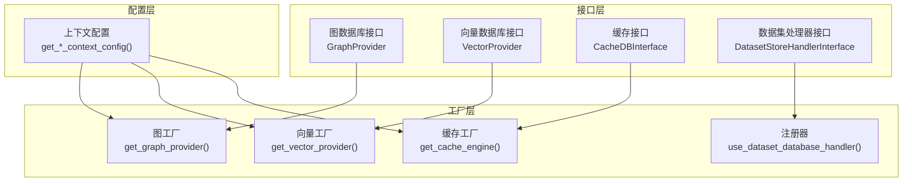
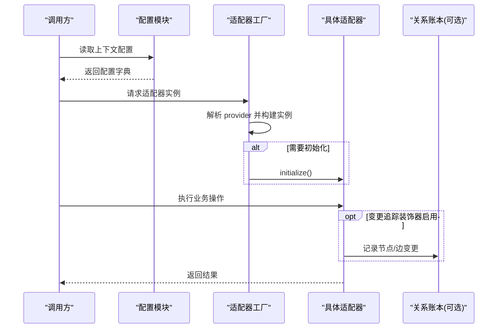
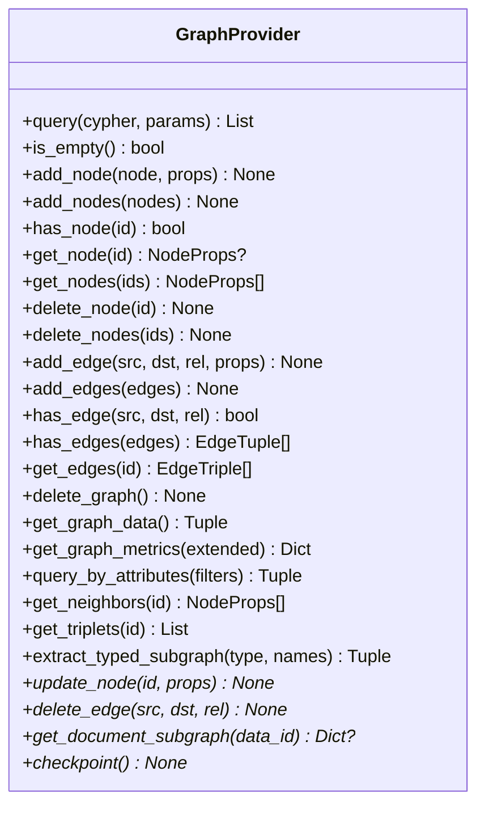
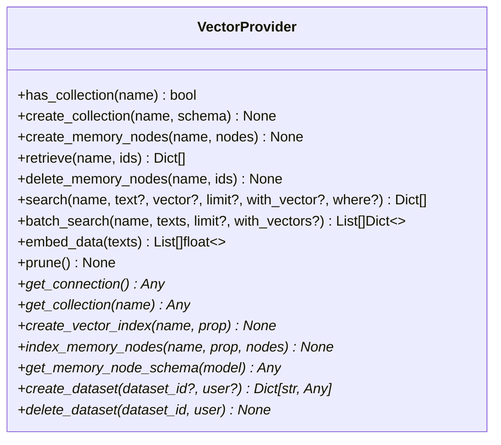
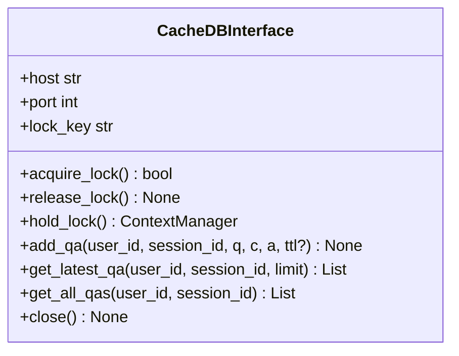
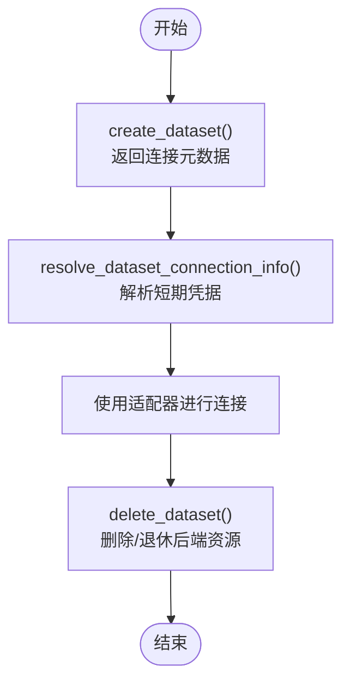
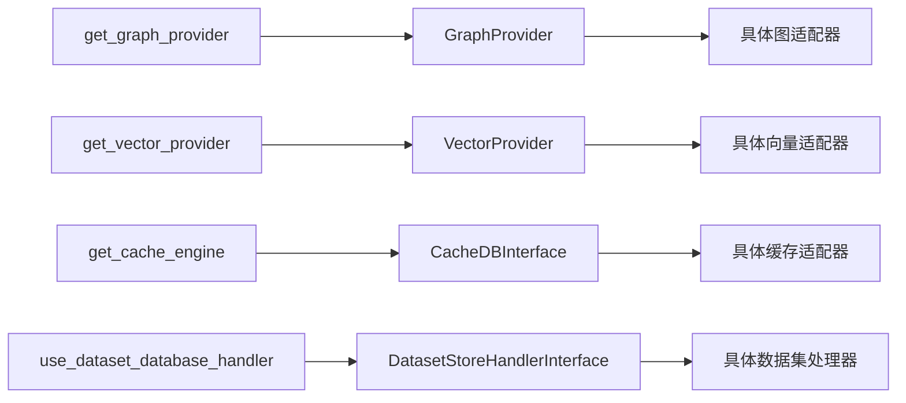

# 适配器开发

<cite>
**本文引用的文件**
- [m_flow/adapters/graph/graph_db_interface.py](file://m_flow/adapters/graph/graph_db_interface.py)
- [m_flow/adapters/vector/vector_db_interface.py](file://m_flow/adapters/vector/vector_db_interface.py)
- [m_flow/adapters/cache/cache_db_interface.py](file://m_flow/adapters/cache/cache_db_interface.py)
- [m_flow/adapters/dataset_database_handler/dataset_database_handler_interface.py](file://m_flow/adapters/dataset_database_handler/dataset_database_handler_interface.py)
- [m_flow/adapters/relational/ModelBase.py](file://m_flow/adapters/relational/ModelBase.py)
- [m_flow/adapters/graph/get_graph_adapter.py](file://m_flow/adapters/graph/get_graph_adapter.py)
- [m_flow/adapters/vector/get_vector_adapter.py](file://m_flow/adapters/vector/get_vector_adapter.py)
- [m_flow/adapters/cache/get_cache_engine.py](file://m_flow/adapters/cache/get_cache_engine.py)
- [m_flow/adapters/dataset_database_handler/use_dataset_database_handler.py](file://m_flow/adapters/dataset_database_handler/use_dataset_database_handler.py)
- [m_flow/adapters/exceptions/exceptions.py](file://m_flow/adapters/exceptions/exceptions.py)
- [m_flow/adapters/utils/__init__.py](file://m_flow/adapters/utils/__init__.py)
- [examples/database_examples/chromadb_example.py](file://examples/database_examples/chromadb_example.py)
- [examples/database_examples/kuzu_example.py](file://examples/database_examples/kuzu_example.py)
- [examples/database_examples/neo4j_example.py](file://examples/database_examples/neo4j_example.py)
- [examples/database_examples/neptune_analytics_example.py](file://examples/database_examples/neptune_analytics_example.py)
- [examples/database_examples/pgvector_example.py](file://examples/database_examples/pgvector_example.py)
</cite>

## 目录
1. [简介](#简介)
2. [项目结构](#项目结构)
3. [核心组件](#核心组件)
4. [架构总览](#架构总览)
5. [详细组件分析](#详细组件分析)
6. [依赖分析](#依赖分析)
7. [性能考虑](#性能考虑)
8. [故障排查指南](#故障排查指南)
9. [结论](#结论)
10. [附录：开发与测试实践](#附录开发与测试实践)

## 简介
本指南面向希望为 M-flow 扩展或自定义适配器的开发者，系统讲解适配器模式在图数据库、向量数据库、缓存以及关系数据库领域的应用与实现要点。文档覆盖：
- 适配器接口规范与抽象基类设计（必须实现与可选扩展）
- 自定义适配器的开发流程（接口实现、配置管理、错误处理）
- 测试策略与调试技巧（单元测试、集成测试、性能测试）
- 完整示例与常见问题解决方案

## 项目结构
M-flow 的适配器体系以“接口 + 工厂 + 配置”的分层组织：
- 接口层：定义统一能力契约（图、向量、缓存、数据集生命周期）
- 实现层：具体后端适配器（Neo4j、Kuzu、Neptune、ChromaDB、pgvector、Redis 等）
- 工厂层：按运行时配置解析并实例化适配器
- 配置层：环境变量与上下文配置驱动适配器选择与初始化
- 工具层：多租户数据集的生命周期编排与连接信息解析

图表来源
- [m_flow/adapters/graph/graph_db_interface.py:122-347](file://m_flow/adapters/graph/graph_db_interface.py#L122-L347)
- [m_flow/adapters/vector/vector_db_interface.py:16-180](file://m_flow/adapters/vector/vector_db_interface.py#L16-L180)
- [m_flow/adapters/cache/cache_db_interface.py:12-125](file://m_flow/adapters/cache/cache_db_interface.py#L12-L125)
- [m_flow/adapters/dataset_database_handler/dataset_database_handler_interface.py:18-119](file://m_flow/adapters/dataset_database_handler/dataset_database_handler_interface.py#L18-L119)
- [m_flow/adapters/graph/get_graph_adapter.py:22-36](file://m_flow/adapters/graph/get_graph_adapter.py#L22-L36)
- [m_flow/adapters/vector/get_vector_adapter.py:11-19](file://m_flow/adapters/vector/get_vector_adapter.py#L11-L19)
- [m_flow/adapters/cache/get_cache_engine.py:68-79](file://m_flow/adapters/cache/get_cache_engine.py#L68-L79)
- [m_flow/adapters/dataset_database_handler/use_dataset_database_handler.py:10-31](file://m_flow/adapters/dataset_database_handler/use_dataset_database_handler.py#L10-L31)

章节来源
- [m_flow/adapters/graph/get_graph_adapter.py:22-36](file://m_flow/adapters/graph/get_graph_adapter.py#L22-L36)
- [m_flow/adapters/vector/get_vector_adapter.py:11-19](file://m_flow/adapters/vector/get_vector_adapter.py#L11-L19)
- [m_flow/adapters/cache/get_cache_engine.py:68-79](file://m_flow/adapters/cache/get_cache_engine.py#L68-L79)
- [m_flow/adapters/dataset_database_handler/use_dataset_database_handler.py:10-31](file://m_flow/adapters/dataset_database_handler/use_dataset_database_handler.py#L10-L31)

## 核心组件
本节概述四大适配器接口的能力边界与扩展点。

- 图数据库适配器接口（GraphProvider）
  - 能力范围：原生查询、空图检测、节点 CRUD、边 CRUD、图级操作、遍历辅助、可选扩展（更新、删除边、文档子图提取、检查点）
  - 关键注解：部分方法带“变更追踪”装饰器，用于关系账本记录
  - 参考路径：[图接口定义:122-347](file://m_flow/adapters/graph/graph_db_interface.py#L122-L347)

- 向量数据库适配器接口（VectorProvider）
  - 能力范围：集合管理、内存节点 CRUD、语义检索（单次/批量）、嵌入生成、维护清理、可选扩展（连接句柄、索引、Schema 转换、多租户数据集生命周期）
  - 参考路径：[向量接口定义:16-180](file://m_flow/adapters/vector/vector_db_interface.py#L16-L180)

- 缓存适配器接口（CacheDBInterface）
  - 能力范围：分布式锁（acquire/release/hold_lock）、问答会话存储（新增/最近/全部）、生命周期关闭
  - 参考路径：[缓存接口定义:12-125](file://m_flow/adapters/cache/cache_db_interface.py#L12-L125)

- 数据集处理器接口（DatasetStoreHandlerInterface）
  - 能力范围：创建数据集（返回连接元数据）、解析连接信息（短有效期凭据）、删除数据集（硬删/软退）
  - 参考路径：[数据集处理器接口:18-119](file://m_flow/adapters/dataset_database_handler/dataset_database_handler_interface.py#L18-L119)

章节来源
- [m_flow/adapters/graph/graph_db_interface.py:122-347](file://m_flow/adapters/graph/graph_db_interface.py#L122-L347)
- [m_flow/adapters/vector/vector_db_interface.py:16-180](file://m_flow/adapters/vector/vector_db_interface.py#L16-L180)
- [m_flow/adapters/cache/cache_db_interface.py:12-125](file://m_flow/adapters/cache/cache_db_interface.py#L12-L125)
- [m_flow/adapters/dataset_database_handler/dataset_database_handler_interface.py:18-119](file://m_flow/adapters/dataset_database_handler/dataset_database_handler_interface.py#L18-L119)

## 架构总览
下图展示适配器在系统中的交互关系：工厂根据上下文配置解析具体适配器；接口层约束能力；工具层负责多租户数据集生命周期编排。

图表来源
- [m_flow/adapters/graph/get_graph_adapter.py:22-36](file://m_flow/adapters/graph/get_graph_adapter.py#L22-L36)
- [m_flow/adapters/graph/graph_db_interface.py:35-96](file://m_flow/adapters/graph/graph_db_interface.py#L35-L96)

章节来源
- [m_flow/adapters/graph/get_graph_adapter.py:22-36](file://m_flow/adapters/graph/get_graph_adapter.py#L22-L36)
- [m_flow/adapters/graph/graph_db_interface.py:35-96](file://m_flow/adapters/graph/graph_db_interface.py#L35-L96)

## 详细组件分析

### 图数据库适配器
- 必须实现的方法
  - 查询与统计：query、is_empty、get_graph_metrics、get_graph_data、query_by_attributes
  - 节点 CRUD：add_node/add_nodes、has_node、get_node/get_nodes、delete_node/delete_nodes
  - 边 CRUD：add_edge/add_edges、has_edge/has_edges、get_edges
  - 图级操作：delete_graph、get_neighbors、get_triplets、extract_typed_subgraph
- 可选扩展
  - 更新节点：update_node（默认抛出未实现，建议覆盖为原子写）
  - 删除边：delete_edge（默认抛出未实现，建议覆盖）
  - 文档子图提取：get_document_subgraph（默认未实现）
  - 持久化检查点：checkpoint（默认空操作）
- 变更追踪
  - 使用装饰器自动记录节点/边变更到关系账本，便于审计与回溯
- 示例参考
  - Neo4j 示例：[示例路径](file://examples/database_examples/neo4j_example.py)
  - Kuzu 示例：[示例路径](file://examples/database_examples/kuzu_example.py)
  - Neptune Analytics 示例：[示例路径](file://examples/database_examples/neptune_analytics_example.py)

图表来源
- [m_flow/adapters/graph/graph_db_interface.py:122-347](file://m_flow/adapters/graph/graph_db_interface.py#L122-L347)

章节来源
- [m_flow/adapters/graph/graph_db_interface.py:122-347](file://m_flow/adapters/graph/graph_db_interface.py#L122-L347)
- [examples/database_examples/neo4j_example.py](file://examples/database_examples/neo4j_example.py)
- [examples/database_examples/kuzu_example.py](file://examples/database_examples/kuzu_example.py)
- [examples/database_examples/neptune_analytics_example.py](file://examples/database_examples/neptune_analytics_example.py)

### 向量数据库适配器
- 必须实现的方法
  - 集合管理：has_collection、create_collection
  - 内存节点 CRUD：create_memory_nodes、retrieve、delete_memory_nodes
  - 检索：search（文本/向量）、batch_search（批量）
  - 嵌入：embed_data
  - 维护：prune
- 可选扩展
  - 连接句柄：get_connection、get_collection
  - 索引：create_vector_index、index_memory_nodes
  - Schema 转换：get_memory_node_schema
  - 多租户：类方法 create_dataset、实例方法 delete_dataset
- 示例参考
  - ChromaDB 示例：[示例路径](file://examples/database_examples/chromadb_example.py)
  - pgvector 示例：[示例路径](file://examples/database_examples/pgvector_example.py)

图表来源
- [m_flow/adapters/vector/vector_db_interface.py:16-180](file://m_flow/adapters/vector/vector_db_interface.py#L16-L180)

章节来源
- [m_flow/adapters/vector/vector_db_interface.py:16-180](file://m_flow/adapters/vector/vector_db_interface.py#L16-L180)
- [examples/database_examples/chromadb_example.py](file://examples/database_examples/chromadb_example.py)
- [examples/database_examples/pgvector_example.py](file://examples/database_examples/pgvector_example.py)

### 缓存适配器
- 必须实现的方法
  - 分布式锁：acquire_lock、release_lock、hold_lock 上下文管理
  - 问答会话存储：add_qa、get_latest_qa、get_all_qas
  - 生命周期：close
- 设计要点
  - 支持 Redis 或文件系统两种后端
  - 提供工厂函数按配置创建实例
- 示例参考
  - Redis 适配器注册与使用：[工厂路径:68-79](file://m_flow/adapters/cache/get_cache_engine.py#L68-L79)

图表来源
- [m_flow/adapters/cache/cache_db_interface.py:12-125](file://m_flow/adapters/cache/cache_db_interface.py#L12-L125)

章节来源
- [m_flow/adapters/cache/cache_db_interface.py:12-125](file://m_flow/adapters/cache/cache_db_interface.py#L12-L125)
- [m_flow/adapters/cache/get_cache_engine.py:68-79](file://m_flow/adapters/cache/get_cache_engine.py#L68-L79)

### 数据集处理器（多租户隔离）
- 能力三段式
  - Provisioning：create_dataset 返回连接元数据
  - Resolution：resolve_dataset_connection_info 将元数据解析为短期凭据
  - Teardown：delete_dataset 删除或退休后端资源
- 注册机制
  - 通过注册器将处理器与具体数据库提供商绑定
- 参考路径
  - [处理器接口:18-119](file://m_flow/adapters/dataset_database_handler/dataset_database_handler_interface.py#L18-L119)
  - [注册器:10-31](file://m_flow/adapters/dataset_database_handler/use_dataset_database_handler.py#L10-L31)

图表来源
- [m_flow/adapters/dataset_database_handler/dataset_database_handler_interface.py:36-119](file://m_flow/adapters/dataset_database_handler/dataset_database_handler_interface.py#L36-L119)
- [m_flow/adapters/dataset_database_handler/use_dataset_database_handler.py:10-31](file://m_flow/adapters/dataset_database_handler/use_dataset_database_handler.py#L10-L31)

章节来源
- [m_flow/adapters/dataset_database_handler/dataset_database_handler_interface.py:18-119](file://m_flow/adapters/dataset_database_handler/dataset_database_handler_interface.py#L18-L119)
- [m_flow/adapters/dataset_database_handler/use_dataset_database_handler.py:10-31](file://m_flow/adapters/dataset_database_handler/use_dataset_database_handler.py#L10-L31)

## 依赖分析
- 接口与实现解耦：通过 Protocol/ABC 抽象，确保上层调用不依赖具体实现
- 工厂与配置：工厂函数从上下文配置中读取参数，支持动态切换后端
- 变更追踪：图适配器装饰器将节点/边变更写入关系账本，降低耦合风险
- 多租户：数据集处理器接口与注册器形成可插拔的生命周期编排

图表来源
- [m_flow/adapters/graph/graph_db_interface.py:122-347](file://m_flow/adapters/graph/graph_db_interface.py#L122-L347)
- [m_flow/adapters/vector/vector_db_interface.py:16-180](file://m_flow/adapters/vector/vector_db_interface.py#L16-L180)
- [m_flow/adapters/cache/cache_db_interface.py:12-125](file://m_flow/adapters/cache/cache_db_interface.py#L12-L125)
- [m_flow/adapters/dataset_database_handler/dataset_database_handler_interface.py:18-119](file://m_flow/adapters/dataset_database_handler/dataset_database_handler_interface.py#L18-L119)
- [m_flow/adapters/graph/get_graph_adapter.py:22-36](file://m_flow/adapters/graph/get_graph_adapter.py#L22-L36)
- [m_flow/adapters/vector/get_vector_adapter.py:11-19](file://m_flow/adapters/vector/get_vector_adapter.py#L11-L19)
- [m_flow/adapters/cache/get_cache_engine.py:68-79](file://m_flow/adapters/cache/get_cache_engine.py#L68-L79)
- [m_flow/adapters/dataset_database_handler/use_dataset_database_handler.py:10-31](file://m_flow/adapters/dataset_database_handler/use_dataset_database_handler.py#L10-L31)

章节来源
- [m_flow/adapters/graph/get_graph_adapter.py:22-36](file://m_flow/adapters/graph/get_graph_adapter.py#L22-L36)
- [m_flow/adapters/vector/get_vector_adapter.py:11-19](file://m_flow/adapters/vector/get_vector_adapter.py#L11-L19)
- [m_flow/adapters/cache/get_cache_engine.py:68-79](file://m_flow/adapters/cache/get_cache_engine.py#L68-L79)
- [m_flow/adapters/dataset_database_handler/use_dataset_database_handler.py:10-31](file://m_flow/adapters/dataset_database_handler/use_dataset_database_handler.py#L10-L31)

## 性能考虑
- 原子性与一致性
  - 图适配器的更新/删除等可选方法建议提供原生原子实现，避免读改写带来的竞态
- 批处理与索引
  - 向量适配器优先使用批量插入与索引能力，减少检索延迟
- 锁竞争与超时
  - 缓存锁应设置合理的过期与阻塞超时，避免长尾阻塞
- WAL 检查点
  - 对使用 WAL 的嵌入式图库，关键写入后调用检查点保障持久化
- 多租户凭据解析
  - 连接凭据仅在生命周期内有效，避免写回目录库

## 故障排查指南
- 常见异常类型
  - 数据库未创建：DatabaseNotCreatedError
  - 实体不存在/冲突：ConceptNotFoundError、ConceptAlreadyExistsError
  - 图过滤不支持：NodesetFilterNotSupportedError
  - 嵌入失败：EmbeddingException
  - 查询参数互斥/缺失：MutuallyExclusiveQueryParametersError、MissingQueryParameterError
  - 缓存不可达：CacheConnectionError
  - 共享 Kuzu 锁需要 Redis：SharedKuzuLockRequiresRedisError
- 定位建议
  - 核对配置项是否齐全（如图/向量/缓存后端的关键参数）
  - 检查工厂构建日志与装饰器是否正确注入
  - 在多租户场景下确认 create_dataset/resolve_dataset_connection_info 的返回值与解析链路
- 参考路径
  - [异常定义:22-87](file://m_flow/adapters/exceptions/exceptions.py#L22-L87)

章节来源
- [m_flow/adapters/exceptions/exceptions.py:22-87](file://m_flow/adapters/exceptions/exceptions.py#L22-L87)

## 结论
M-flow 的适配器体系通过清晰的接口契约、灵活的工厂与配置机制，以及完善的多租户生命周期管理，为图、向量、缓存与关系数据库提供了高可扩展的抽象层。遵循本文档的接口规范与最佳实践，可快速实现自定义适配器并安全地接入生产环境。

## 附录：开发与测试实践

### 开发流程（以新图适配器为例）
- 步骤
  - 实现接口：继承 GraphProvider 并至少实现所有必需方法
  - 初始化：如需异步初始化，提供 initialize 方法并在工厂中调用
  - 注册：在支持映射中登记新提供商名称与构造器
  - 配置：在上下文配置中添加必要参数
  - 验证：通过单元测试覆盖 CRUD、查询与统计等场景
- 参考路径
  - [图接口:122-347](file://m_flow/adapters/graph/graph_db_interface.py#L122-L347)
  - [图工厂:44-131](file://m_flow/adapters/graph/get_graph_adapter.py#L44-L131)

章节来源
- [m_flow/adapters/graph/graph_db_interface.py:122-347](file://m_flow/adapters/graph/graph_db_interface.py#L122-L347)
- [m_flow/adapters/graph/get_graph_adapter.py:44-131](file://m_flow/adapters/graph/get_graph_adapter.py#L44-L131)

### 配置管理
- 图数据库
  - 通过上下文配置读取 provider 与连接参数，工厂据此构建实例
  - 参考：[图工厂:22-36](file://m_flow/adapters/graph/get_graph_adapter.py#L22-L36)
- 向量数据库
  - 通过上下文配置读取 provider 与引擎参数，工厂直接返回引擎
  - 参考：[向量工厂:11-19](file://m_flow/adapters/vector/get_vector_adapter.py#L11-L19)
- 缓存
  - 通过配置选择后端（redis/fs），并传入锁参数
  - 参考：[缓存工厂:68-79](file://m_flow/adapters/cache/get_cache_engine.py#L68-L79)

章节来源
- [m_flow/adapters/graph/get_graph_adapter.py:22-36](file://m_flow/adapters/graph/get_graph_adapter.py#L22-L36)
- [m_flow/adapters/vector/get_vector_adapter.py:11-19](file://m_flow/adapters/vector/get_vector_adapter.py#L11-L19)
- [m_flow/adapters/cache/get_cache_engine.py:68-79](file://m_flow/adapters/cache/get_cache_engine.py#L68-L79)

### 错误处理
- 统一异常体系：基于 FastAPI 状态码封装业务异常
- 建议
  - 在适配器内部捕获底层错误并转换为领域异常
  - 对外部依赖（网络/权限）提供明确的错误提示与重试策略
- 参考：[异常定义:22-87](file://m_flow/adapters/exceptions/exceptions.py#L22-L87)

章节来源
- [m_flow/adapters/exceptions/exceptions.py:22-87](file://m_flow/adapters/exceptions/exceptions.py#L22-L87)

### 测试策略
- 单元测试
  - 针对每个接口方法编写最小化用例，覆盖成功与失败分支
  - 使用内存/本地后端模拟真实行为
- 集成测试
  - 以工厂为入口，验证配置解析与初始化流程
  - 多租户场景下验证 create_dataset/resolve_dataset_connection_info/teardown 的闭环
- 性能测试
  - 批量写入/查询吞吐与延迟
  - 锁竞争下的并发稳定性
- 参考示例
  - [Neo4j 示例](file://examples/database_examples/neo4j_example.py)
  - [Kuzu 示例](file://examples/database_examples/kuzu_example.py)
  - [ChromaDB 示例](file://examples/database_examples/chromadb_example.py)
  - [pgvector 示例](file://examples/database_examples/pgvector_example.py)
  - [Neptune Analytics 示例](file://examples/database_examples/neptune_analytics_example.py)

章节来源
- [examples/database_examples/neo4j_example.py](file://examples/database_examples/neo4j_example.py)
- [examples/database_examples/kuzu_example.py](file://examples/database_examples/kuzu_example.py)
- [examples/database_examples/chromadb_example.py](file://examples/database_examples/chromadb_example.py)
- [examples/database_examples/pgvector_example.py](file://examples/database_examples/pgvector_example.py)
- [examples/database_examples/neptune_analytics_example.py](file://examples/database_examples/neptune_analytics_example.py)

### 常见问题与解决方案
- 问题：未实现 update_node/delete_edge
  - 方案：提供原生原子实现；若无法实现，返回未实现异常并引导使用原生查询
- 问题：多租户凭据泄露风险
  - 方案：仅在连接尝试期间解析短期凭据，不写回目录库
- 问题：共享锁依赖 Redis
  - 方案：当使用共享 Kuzu 时，强制要求 Redis 作为锁后端
- 问题：缓存服务不可用
  - 方案：降级为禁用缓存或使用文件系统后端

章节来源
- [m_flow/adapters/graph/graph_db_interface.py:290-327](file://m_flow/adapters/graph/graph_db_interface.py#L290-L327)
- [m_flow/adapters/dataset_database_handler/dataset_database_handler_interface.py:69-99](file://m_flow/adapters/dataset_database_handler/dataset_database_handler_interface.py#L69-L99)
- [m_flow/adapters/exceptions/exceptions.py:82-87](file://m_flow/adapters/exceptions/exceptions.py#L82-L87)