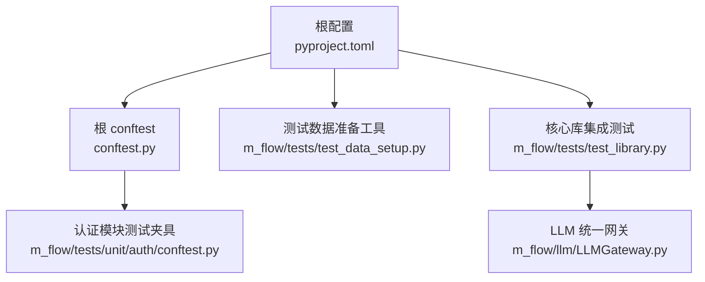
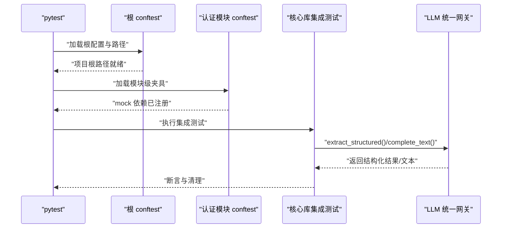
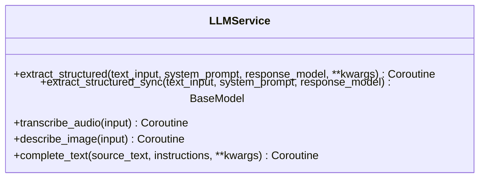
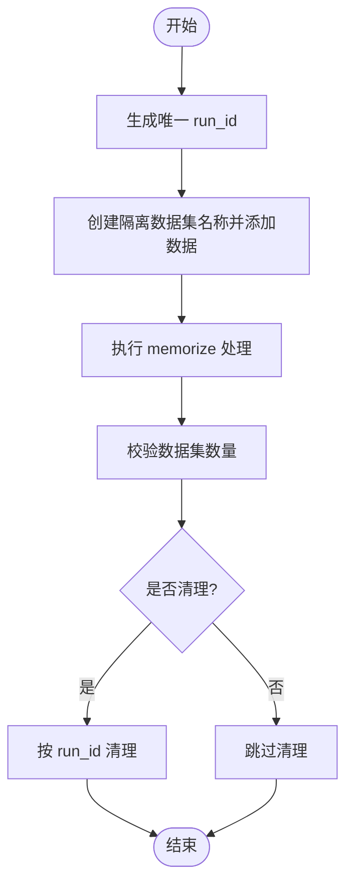
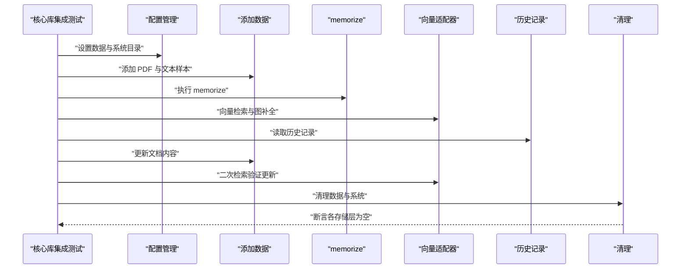
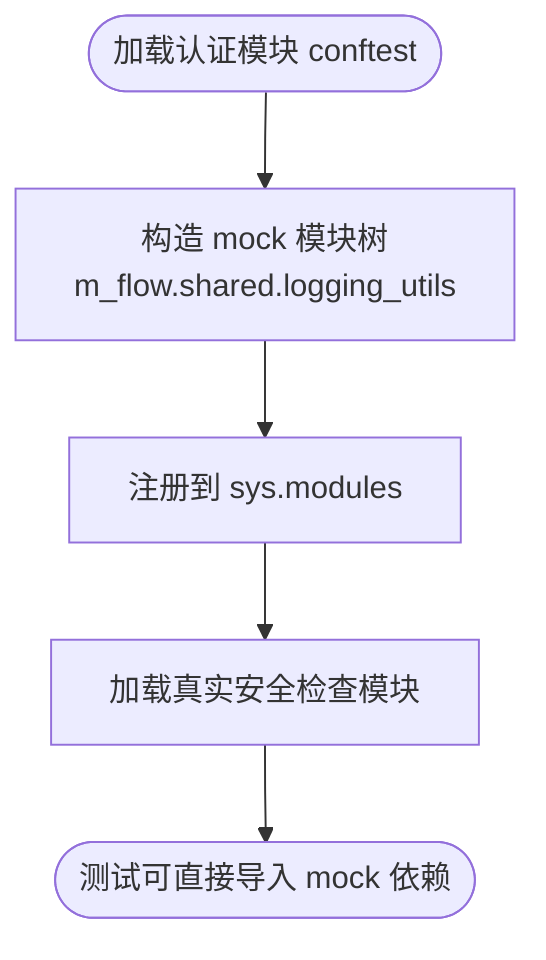
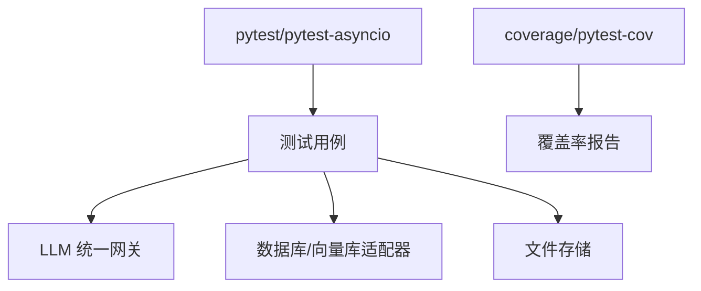

# 单元测试指南

<cite>
**本文引用的文件**
- [pyproject.toml](file://pyproject.toml)
- [conftest.py](file://conftest.py)
- [m_flow/tests/test_data_setup.py](file://m_flow/tests/test_data_setup.py)
- [m_flow/tests/test_library.py](file://m_flow/tests/test_library.py)
- [m_flow/llm/LLMGateway.py](file://m_flow/llm/LLMGateway.py)
- [m_flow/tests/unit/auth/conftest.py](file://m_flow/tests/unit/auth/conftest.py)
</cite>

## 目录
1. [引言](#引言)
2. [项目结构](#项目结构)
3. [核心组件](#核心组件)
4. [架构总览](#架构总览)
5. [详细组件分析](#详细组件分析)
6. [依赖分析](#依赖分析)
7. [性能考虑](#性能考虑)
8. [故障排查指南](#故障排查指南)
9. [结论](#结论)
10. [附录](#附录)

## 引言
本指南面向 M-flow 项目的开发者与测试工程师，系统性阐述如何编写高质量的单元测试与集成测试，覆盖以下主题：
- 测试函数命名规范与断言使用
- 异常处理测试策略
- Mock 对象的使用（LLM 调用、数据库连接、外部 API）
- 测试数据准备（测试夹具、隔离与清理）
- 异步函数测试（asyncio 使用与注意事项）
- 具体测试场景：API 测试、共享模块测试、接口测试
- 测试覆盖率要求与提升方法

## 项目结构
M-flow 的测试体系由根级 pytest 配置、通用 conftest、模块级测试夹具以及大量端到端与集成测试组成。关键测试相关文件如下：
- 根级 pytest 配置：控制异步模式、测试路径、Python 路径与覆盖率
- 根 conftest：确保项目根路径正确注入，避免包解析问题
- 认证模块测试夹具：加载安全检查模块并进行依赖替换
- 测试数据准备工具：提供测试数据集的创建、清理与校验
- 核心库集成测试：演示完整的知识图谱构建与检索流程

**图表来源**
- [pyproject.toml:296-323](file://pyproject.toml#L296-L323)
- [conftest.py:18-54](file://conftest.py#L18-L54)
- [m_flow/tests/unit/auth/conftest.py:14-55](file://m_flow/tests/unit/auth/conftest.py#L14-L55)
- [m_flow/tests/test_data_setup.py:54-107](file://m_flow/tests/test_data_setup.py#L54-L107)
- [m_flow/tests/test_library.py:35-155](file://m_flow/tests/test_library.py#L35-L155)
- [m_flow/llm/LLMGateway.py:60-168](file://m_flow/llm/LLMGateway.py#L60-L168)

**章节来源**
- [pyproject.toml:296-323](file://pyproject.toml#L296-L323)
- [conftest.py:18-54](file://conftest.py#L18-L54)
- [m_flow/tests/unit/auth/conftest.py:14-55](file://m_flow/tests/unit/auth/conftest.py#L14-L55)
- [m_flow/tests/test_data_setup.py:54-107](file://m_flow/tests/test_data_setup.py#L54-L107)
- [m_flow/tests/test_library.py:35-155](file://m_flow/tests/test_library.py#L35-L155)
- [m_flow/llm/LLMGateway.py:60-168](file://m_flow/llm/LLMGateway.py#L60-L168)

## 核心组件
- 根级 pytest 配置
  - 异步模式：auto，自动启用 asyncio 支持
  - 测试路径：m_flow/tests
  - Python 路径：当前目录
  - 警告过滤：忽略弃用警告
- 根 conftest
  - 在最早钩子阶段注入项目根路径，避免包解析错误
  - 预导入 m_flow 并强制从正确位置重载，确保测试发现稳定
- 认证模块测试夹具
  - 动态构造 mock 模块树，替换 m_flow.shared.logging_utils 等依赖
  - 加载真实的安全检查模块并在 sys.modules 中注册，便于测试其行为
- 测试数据准备工具
  - 生成唯一测试运行 ID，用于并行测试隔离
  - 创建隔离数据集名称，批量准备基础数据集并执行 memorize
  - 提供清理与校验功能，支持按 run_id 或全量清理

**章节来源**
- [pyproject.toml:296-301](file://pyproject.toml#L296-L301)
- [conftest.py:18-54](file://conftest.py#L18-L54)
- [m_flow/tests/unit/auth/conftest.py:14-55](file://m_flow/tests/unit/auth/conftest.py#L14-L55)
- [m_flow/tests/test_data_setup.py:26-107](file://m_flow/tests/test_data_setup.py#L26-L107)

## 架构总览
下图展示测试运行时的关键交互：pytest 通过根 conftest 注入路径并预导入包；认证模块测试通过自定义 conftest 替换依赖；核心库集成测试调用 LLM 统一网关完成结构化抽取与文本补全。

**图表来源**
- [conftest.py:18-54](file://conftest.py#L18-L54)
- [m_flow/tests/unit/auth/conftest.py:14-55](file://m_flow/tests/unit/auth/conftest.py#L14-L55)
- [m_flow/tests/test_library.py:35-155](file://m_flow/tests/test_library.py#L35-L155)
- [m_flow/llm/LLMGateway.py:60-168](file://m_flow/llm/LLMGateway.py#L60-L168)

## 详细组件分析

### 组件 A：LLM 统一网关（LLMGateway）
- 角色定位
  - 提供统一的 LLM 能力入口，支持结构化抽取、音频转写、图像描述与文本补全
  - 后端可切换至 BAML 或 LiteLLM/Instructor，并在调用时动态解析
- 关键点
  - 结构化抽取：根据后端选择 BAML 或 Instructor 客户端
  - 文本补全：封装消息格式与速率限制上下文，内置指数退避重试策略
  - 异步协程：complete_text 返回协程，适合在测试中 await
- 测试要点
  - Mock 后端选择逻辑，验证不同后端路径
  - Mock rate limiter 与外部服务，保证测试稳定性
  - 断言响应模型类型与日志级别

**图表来源**
- [m_flow/llm/LLMGateway.py:60-168](file://m_flow/llm/LLMGateway.py#L60-L168)

**章节来源**
- [m_flow/llm/LLMGateway.py:60-168](file://m_flow/llm/LLMGateway.py#L60-L168)

### 组件 B：测试数据准备与清理（test_data_setup）
- 功能概述
  - 生成唯一 run_id，用于并行测试隔离
  - 创建隔离数据集名称，批量添加与 memorize
  - 清理：按 run_id 或全量清理，删除图数据库节点、向量库条目与关系型数据集记录
  - 校验：统计测试数据集数量，确认准备状态
- 测试要点
  - 使用 asyncio.run 执行异步函数
  - 断言清理前后数据库状态变化
  - 通过命令行参数控制行为（setup/cleanup/verify/--get-run-id）

**图表来源**
- [m_flow/tests/test_data_setup.py:26-107](file://m_flow/tests/test_data_setup.py#L26-L107)
- [m_flow/tests/test_data_setup.py:109-189](file://m_flow/tests/test_data_setup.py#L109-L189)
- [m_flow/tests/test_data_setup.py:191-224](file://m_flow/tests/test_data_setup.py#L191-L224)

**章节来源**
- [m_flow/tests/test_data_setup.py:26-107](file://m_flow/tests/test_data_setup.py#L26-L107)
- [m_flow/tests/test_data_setup.py:109-189](file://m_flow/tests/test_data_setup.py#L109-L189)
- [m_flow/tests/test_data_setup.py:191-224](file://m_flow/tests/test_data_setup.py#L191-L224)

### 组件 C：核心库集成测试（test_library）
- 场景概览
  - 配置存储根目录，清理系统与数据
  - 添加 PDF 与文本样本，执行 memorize
  - 向量检索与图补全，验证历史记录
  - 更新文档并再次检索，验证更新生效
  - 清理并断言各存储层为空
- 测试要点
  - 使用 asyncio.run 运行主流程
  - 断言检索结果非空、历史记录存在、清理后存储层为空
  - 通过 get_vector_provider/get_db_adapter 等适配器访问底层实现

**图表来源**
- [m_flow/tests/test_library.py:35-155](file://m_flow/tests/test_library.py#L35-L155)

**章节来源**
- [m_flow/tests/test_library.py:35-155](file://m_flow/tests/test_library.py#L35-L155)

### 组件 D：认证模块测试夹具（unit/auth/conftest）
- 功能概述
  - 动态构造 mock 模块树，替换 m_flow.shared.logging_utils
  - 预加载真实的安全检查模块，注册到 sys.modules
- 测试要点
  - 通过 types.ModuleType 构造父模块，避免导入错误
  - 在 conftest 加载时即刻执行模块注册，确保后续测试可用

**图表来源**
- [m_flow/tests/unit/auth/conftest.py:14-55](file://m_flow/tests/unit/auth/conftest.py#L14-L55)

**章节来源**
- [m_flow/tests/unit/auth/conftest.py:14-55](file://m_flow/tests/unit/auth/conftest.py#L14-L55)

## 依赖分析
- 测试运行依赖
  - pytest 与 pytest-asyncio：异步测试与自动模式
  - coverage 与 pytest-cov：覆盖率收集与报告
- 项目运行依赖
  - FastAPI、SQLAlchemy、LiteLLM、Instructor 等：驱动核心功能
- 测试耦合与内聚
  - 根 conftest 与模块级 conftest 分离，降低耦合
  - 测试数据准备工具独立于业务逻辑，提高内聚
- 外部依赖与集成点
  - LLM 统一网关作为外部服务抽象层，便于 Mock
  - 数据库与向量库适配器通过 get_*_adapter 抽象，便于替换

**图表来源**
- [pyproject.toml:197-211](file://pyproject.toml#L197-L211)
- [pyproject.toml:317-323](file://pyproject.toml#L317-L323)
- [m_flow/llm/LLMGateway.py:60-168](file://m_flow/llm/LLMGateway.py#L60-L168)

**章节来源**
- [pyproject.toml:197-211](file://pyproject.toml#L197-L211)
- [pyproject.toml:317-323](file://pyproject.toml#L317-L323)
- [m_flow/llm/LLMGateway.py:60-168](file://m_flow/llm/LLMGateway.py#L60-L168)

## 性能考虑
- 异步测试
  - 使用 asyncio.run 执行异步测试主流程，避免事件循环复杂性
  - 将耗时操作（如向量检索、memorize）拆分为独立步骤，便于并行与缓存
- Mock 策略
  - 对外部 LLM 与数据库调用进行 Mock，减少真实依赖带来的性能波动
  - 使用小规模测试数据集，缩短测试执行时间
- 覆盖率与稳定性
  - 通过覆盖率阈值与排除规则平衡质量与成本
  - 在 CI 中固定并发度，避免资源争用导致的不稳定

## 故障排查指南
- 包路径问题
  - 症状：ImportError 或模块解析错误
  - 处理：确保根 conftest 已注入项目根路径并预导入 m_flow
- Mock 依赖缺失
  - 症状：模块导入失败或属性不存在
  - 处理：在模块级 conftest 中构造 mock 模块树并注册到 sys.modules
- 异步测试卡顿
  - 症状：测试长时间无响应
  - 处理：检查 await 调用链，确保超时与重试策略合理
- 覆盖率不达标
  - 症状：覆盖率低于预期
  - 处理：补充分支与异常路径测试，增加对边缘情况的断言

**章节来源**
- [conftest.py:18-54](file://conftest.py#L18-L54)
- [m_flow/tests/unit/auth/conftest.py:14-55](file://m_flow/tests/unit/auth/conftest.py#L14-L55)
- [pyproject.toml:317-323](file://pyproject.toml#L317-L323)

## 结论
本指南提供了 M-flow 项目单元与集成测试的系统化实践方法。通过规范的命名与断言、合理的 Mock 策略、完善的测试数据准备与清理机制，以及对异步与覆盖率的关注，可以显著提升测试质量与开发效率。建议在团队内推广这些最佳实践，并结合具体模块逐步完善测试矩阵。

## 附录

### A. 测试函数命名规范
- 建议以 test_ 前缀命名，清晰表达被测功能与输入输出
- 对异常路径使用 test_..._raises_... 形式，明确断言异常类型
- 对边界条件与特殊输入使用 test_..._edge_case_... 或 test_..._invalid_input_...

### B. 断言使用与异常处理测试
- 使用 assert 验证返回值与副作用
- 使用 pytest.raises 验证异常抛出与错误码
- 对异步函数使用 await 并捕获异常，断言异常类型与消息

### C. Mock 对象使用策略
- LLM 调用：Mock LLMService 的静态方法，返回预设响应
- 数据库连接：Mock get_*_adapter 返回的会话对象，拦截查询与写入
- 外部 API：Mock aiohttp/requests 行为，返回模拟响应

### D. 测试数据准备与隔离
- 使用唯一 run_id 隔离并行测试
- 通过 test_data_setup 创建/清理测试数据集
- 在测试前断言数据存在，在测试后断言清理完成

### E. 异步函数测试要点
- 使用 asyncio.run 运行主流程
- 对协程方法使用 await，注意超时与重试
- 在测试夹具中避免阻塞主线程

### F. 测试覆盖率要求与提升方法
- 覆盖率配置：源码目录与排除规则见根配置
- 提升方法：补充分支测试、异常路径测试、边界条件测试；对关键路径增加断言

**章节来源**
- [pyproject.toml:296-301](file://pyproject.toml#L296-L301)
- [pyproject.toml:317-323](file://pyproject.toml#L317-L323)