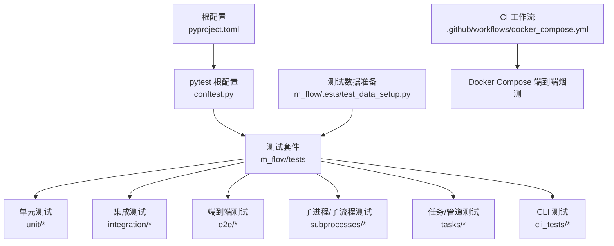
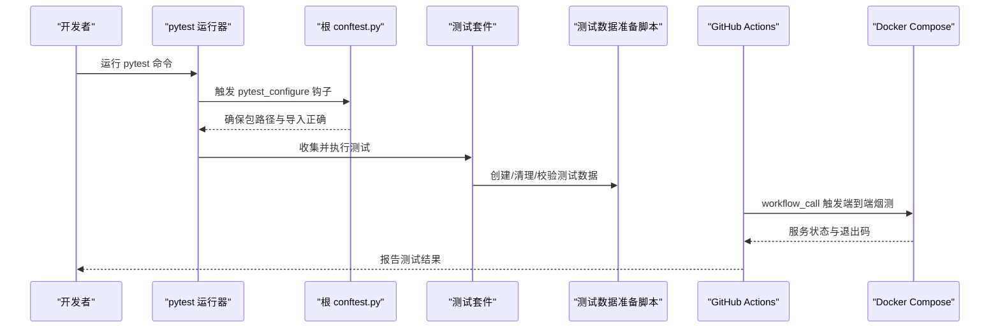
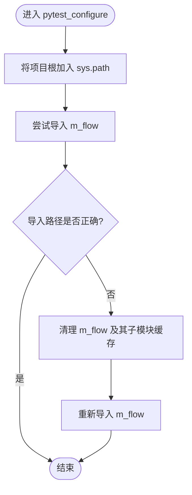
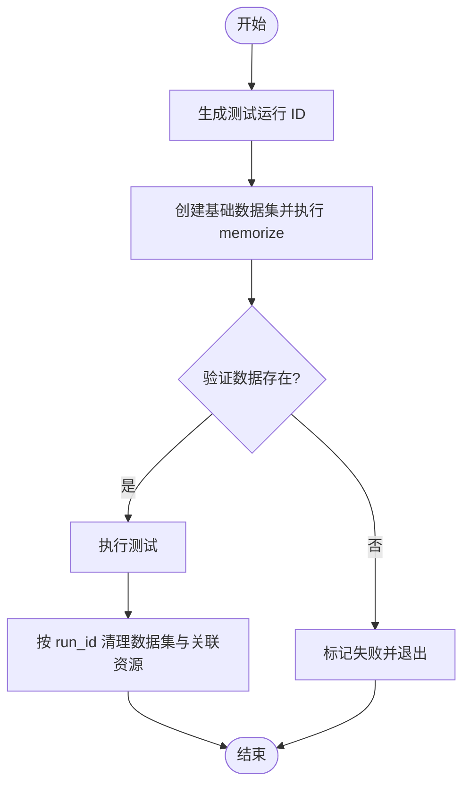
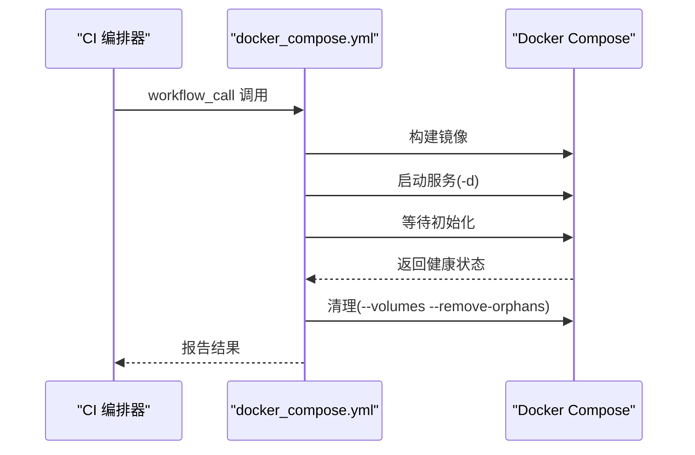
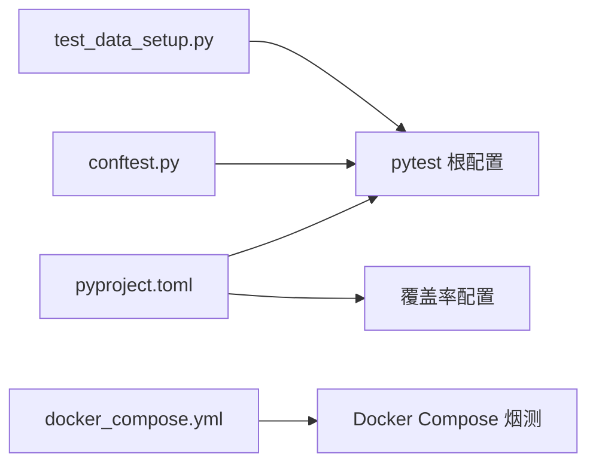

# 测试执行与持续集成

<cite>
**本文引用的文件**
- [pyproject.toml](file://pyproject.toml)
- [conftest.py](file://conftest.py)
- [m_flow/tests/test_data_setup.py](file://m_flow/tests/test_data_setup.py)
- [.github/workflows/docker_compose.yml](file://.github/workflows/docker_compose.yml)
- [m_flow/tests/e2e/__init__.py](file://m_flow/tests/e2e/__init__.py)
- [m_flow/tests/unit/auth/conftest.py](file://m_flow/tests/unit/auth/conftest.py)
- [m_flow/tests/unit/api/test_config_discovery.py](file://m_flow/tests/unit/api/test_config_discovery.py)
</cite>

## 目录
1. [简介](#简介)
2. [项目结构](#项目结构)
3. [核心组件](#核心组件)
4. [架构总览](#架构总览)
5. [详细组件分析](#详细组件分析)
6. [依赖分析](#依赖分析)
7. [性能考虑](#性能考虑)
8. [故障排查指南](#故障排查指南)
9. [结论](#结论)
10. [附录](#附录)

## 简介
本文件面向 M-flow 项目的测试执行与持续集成（CI）场景，系统性地阐述以下主题：
- 单个测试运行、批量测试执行与测试套件选择
- 测试配置（pytest 参数、测试报告与覆盖率）
- 持续集成（GitHub Actions 工作流、测试环境自动配置、结果报告）
- 性能优化（并行测试、测试数据缓存、环境复用）
- 调试技巧（失败排查、日志分析、问题定位）
- 维护最佳实践与测试重构建议

## 项目结构
M-flow 的测试体系围绕 pytest 配置、根级 conftest、测试数据准备脚本以及 GitHub Actions 工作流组织。核心要点如下：
- 根级 pytest 配置位于项目根的 pyproject.toml 中，统一定义测试路径、异步模式、Python 路径与警告过滤等
- 根 conftest.py 确保测试发现阶段的包路径正确解析，避免导入冲突
- 测试数据准备脚本提供测试数据的创建、清理与校验，支持并行隔离
- GitHub Actions 使用 workflow_call 模式组合多类测试任务，包含端到端堆栈烟测

图表来源
- [pyproject.toml:296-323](file://pyproject.toml#L296-L323)
- [conftest.py:18-48](file://conftest.py#L18-L48)
- [m_flow/tests/e2e/__init__.py:1-7](file://m_flow/tests/e2e/__init__.py#L1-L7)
- [m_flow/tests/test_data_setup.py:54-107](file://m_flow/tests/test_data_setup.py#L54-L107)

章节来源
- [pyproject.toml:296-323](file://pyproject.toml#L296-L323)
- [conftest.py:12-48](file://conftest.py#L12-L48)
- [m_flow/tests/e2e/__init__.py:1-7](file://m_flow/tests/e2e/__init__.py#L1-L7)
- [m_flow/tests/test_data_setup.py:26-107](file://m_flow/tests/test_data_setup.py#L26-L107)

## 核心组件
- pytest 根配置：通过 pyproject.toml 的 [tool.pytest.ini_options] 统一设置 asyncio_mode、testpaths、pythonpath、filterwarnings 等；同时在 [tool.coverage.*] 中定义覆盖率源码范围与排除项
- 根 conftest：在 pytest_configure 钩子中预导入 m_flow 并强制从项目根加载，确保测试收集阶段的包解析一致
- 测试数据准备脚本：提供测试运行 ID 生成、隔离数据集命名、测试数据创建/清理/校验，支持并行隔离
- CI 工作流：以 workflow_call 形式被主编排器调用，执行 docker-compose 端到端烟测，包含构建镜像、启动服务、等待初始化、最终清理

章节来源
- [pyproject.toml:296-323](file://pyproject.toml#L296-L323)
- [conftest.py:18-48](file://conftest.py#L18-L48)
- [m_flow/tests/test_data_setup.py:26-107](file://m_flow/tests/test_data_setup.py#L26-L107)
- [.github/workflows/docker_compose.yml:1-40](file://.github/workflows/docker_compose.yml#L1-L40)

## 架构总览
下图展示从本地测试执行到 CI 端到端烟测的整体流程。

图表来源
- [conftest.py:18-48](file://conftest.py#L18-L48)
- [m_flow/tests/test_data_setup.py:54-107](file://m_flow/tests/test_data_setup.py#L54-L107)
- [.github/workflows/docker_compose.yml:19-40](file://.github/workflows/docker_compose.yml#L19-L40)

## 详细组件分析

### 组件 A：pytest 根配置与覆盖率
- 关键点
  - asyncio_mode 设置为 auto，适配异步测试
  - testpaths 指向 m_flow/tests，确保自动发现
  - pythonpath 包含项目根，避免相对导入问题
  - filterwarnings 忽略弃用警告，减少噪音
  - 覆盖率源码范围覆盖 m_flow，排除测试目录与特定后端
- 建议
  - 在本地开发时可临时调整 filterwarnings，定位真实问题
  - 如需更细粒度的覆盖率控制，可在各子包添加独立的 .coveragerc

章节来源
- [pyproject.toml:296-323](file://pyproject.toml#L296-L323)

### 组件 B：根 conftest（包路径与导入修复）
- 关键点
  - 在 pytest_configure 阶段强制将项目根加入 sys.path
  - 预导入 m_flow 并校验其实际加载路径，若不匹配则清理模块缓存并重新导入
  - 保证测试收集阶段不会因包路径导致的歧义而失败
- 建议
  - 若新增子包或重命名目录，需同步检查该钩子逻辑
  - 对于第三方模块依赖，优先采用虚拟环境隔离

图表来源
- [conftest.py:18-48](file://conftest.py#L18-L48)

章节来源
- [conftest.py:18-48](file://conftest.py#L18-L48)

### 组件 C：测试数据准备与清理（并行隔离）
- 关键点
  - 生成唯一测试运行 ID，用于隔离不同并行会话
  - 生成隔离数据集名称，避免跨会话污染
  - 提供 setup/cleanup/verify 三类操作，支持按 run_id 精确清理
  - 清理流程覆盖关系型数据库、图数据库与向量库，确保环境干净
- 建议
  - 在并行测试中为每个 worker 分配独立 run_id
  - 对大型数据集，先 verify 再决定是否重复 setup

图表来源
- [m_flow/tests/test_data_setup.py:26-107](file://m_flow/tests/test_data_setup.py#L26-L107)
- [m_flow/tests/test_data_setup.py:109-189](file://m_flow/tests/test_data_setup.py#L109-L189)
- [m_flow/tests/test_data_setup.py:191-224](file://m_flow/tests/test_data_setup.py#L191-L224)

章节来源
- [m_flow/tests/test_data_setup.py:26-107](file://m_flow/tests/test_data_setup.py#L26-L107)
- [m_flow/tests/test_data_setup.py:109-189](file://m_flow/tests/test_data_setup.py#L109-L189)
- [m_flow/tests/test_data_setup.py:191-224](file://m_flow/tests/test_data_setup.py#L191-L224)

### 组件 D：端到端 CI 烟测（Docker Compose）
- 关键点
  - 使用 workflow_call 模式，仅在主编排器触发时执行
  - 构建所有镜像、后台启动服务、等待初始化、最终清理卷与孤儿容器
  - 环境变量设置为 dev，便于快速验证
- 建议
  - 将该工作流作为“集成门禁”前置任务，阻断不稳定的变更
  - 结合测试报告与覆盖率指标，形成质量阈值

图表来源
- [.github/workflows/docker_compose.yml:1-40](file://.github/workflows/docker_compose.yml#L1-L40)

章节来源
- [.github/workflows/docker_compose.yml:1-40](file://.github/workflows/docker_compose.yml#L1-L40)

### 组件 E：单元测试隔离与安全检查模块加载
- 关键点
  - 为认证模块测试提供独立 conftest，通过动态构造模块树与 Mock，确保安全检查模块可被导入
  - 适用于需要隔离依赖或外部服务的单元测试
- 建议
  - 对其他模块也可采用类似策略，统一管理 Mock 与模块注入

章节来源
- [m_flow/tests/unit/auth/conftest.py:14-54](file://m_flow/tests/unit/auth/conftest.py#L14-L54)

### 组件 F：配置语法静态检查（示例）
- 关键点
  - 通过 AST 校验配置文件的 Python 语法，防止 CI 中出现语法错误
  - 展示了如何在测试中定位配置文件路径并进行静态检查
- 建议
  - 将此类静态检查纳入 CI 的“快速门禁”，降低运行期风险

章节来源
- [m_flow/tests/unit/api/test_config_discovery.py:191-233](file://m_flow/tests/unit/api/test_config_discovery.py#L191-L233)

## 依赖分析
- 测试执行依赖
  - pytest 根配置与覆盖率配置由 pyproject.toml 提供
  - 根 conftest 确保包路径与导入一致性
  - 测试数据准备脚本为测试提供隔离且可重复的数据环境
- CI 依赖
  - docker-compose.yml 作为端到端烟测的基础编排
  - workflow_call 机制确保工作流只能被主编排器触发，避免误触发

图表来源
- [pyproject.toml:296-323](file://pyproject.toml#L296-L323)
- [conftest.py:18-48](file://conftest.py#L18-L48)
- [m_flow/tests/test_data_setup.py:54-107](file://m_flow/tests/test_data_setup.py#L54-L107)
- [.github/workflows/docker_compose.yml:1-40](file://.github/workflows/docker_compose.yml#L1-L40)

章节来源
- [pyproject.toml:296-323](file://pyproject.toml#L296-L323)
- [conftest.py:18-48](file://conftest.py#L18-L48)
- [m_flow/tests/test_data_setup.py:54-107](file://m_flow/tests/test_data_setup.py#L54-L107)
- [.github/workflows/docker_compose.yml:1-40](file://.github/workflows/docker_compose.yml#L1-L40)

## 性能考虑
- 并行测试
  - 利用测试数据准备脚本的 run_id 隔离，为每个并行 worker 提供独立数据集，避免锁竞争
  - 在 CI 中结合矩阵构建，按模块或子包拆分并行任务
- 测试数据缓存
  - 对于稳定不变的基准数据集，可考虑在 CI 缓存层复用，缩短准备时间
  - 对于易变数据，采用 per-run 清理策略，确保一致性
- 环境复用
  - CI 中尽量复用构建好的镜像与依赖缓存，减少重复安装
  - 端到端烟测后及时清理，避免状态泄漏影响后续任务

## 故障排查指南
- 测试导入失败或包路径异常
  - 检查根 conftest 的路径注入与 m_flow 重载逻辑是否生效
  - 确认本地虚拟环境与项目根一致
- 测试数据污染或残留
  - 使用测试数据准备脚本的 verify/cleanup 功能，按 run_id 精确清理
  - 在并行场景下，确保每个 worker 使用独立 run_id
- CI 端到端失败
  - 查看 docker-compose 启动日志与容器状态
  - 确认环境变量与服务就绪检测时间是否合理
- 配置语法错误
  - 引入静态语法检查测试，提前暴露配置问题

章节来源
- [conftest.py:18-48](file://conftest.py#L18-L48)
- [m_flow/tests/test_data_setup.py:109-189](file://m_flow/tests/test_data_setup.py#L109-L189)
- [.github/workflows/docker_compose.yml:19-40](file://.github/workflows/docker_compose.yml#L19-L40)
- [m_flow/tests/unit/api/test_config_discovery.py:191-233](file://m_flow/tests/unit/api/test_config_discovery.py#L191-L233)

## 结论
通过统一的 pytest 根配置、可靠的根 conftest、可复用的测试数据准备脚本以及以 workflow_call 为核心的 CI 端到端烟测，M-flow 实现了可扩展、可并行、可维护的测试执行与持续集成体系。建议在现有基础上进一步完善并行隔离策略、引入更多静态检查与覆盖率阈值，并将端到端烟测作为所有变更的“集成门禁”。

## 附录
- 测试执行命令参考（基于当前配置）
  - 运行全部测试：pytest
  - 运行指定套件：pytest m_flow/tests/unit 或 m_flow/tests/integration
  - 仅运行某测试文件：pytest m_flow/tests/unit/api/test_config_discovery.py
  - 生成覆盖率报告：pytest --cov=m_flow --cov-report=term-missing
- CI 工作流调用
  - 通过主编排器触发 docker_compose.yml 的 workflow_call，确保受控执行