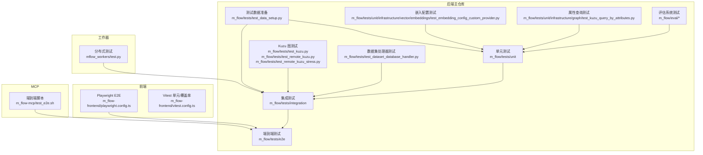
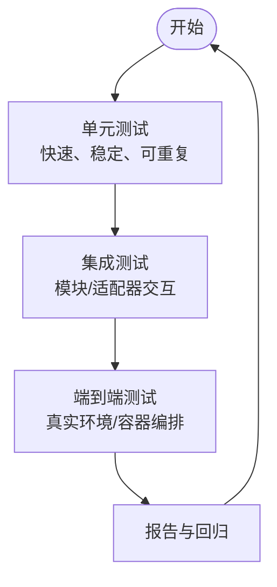
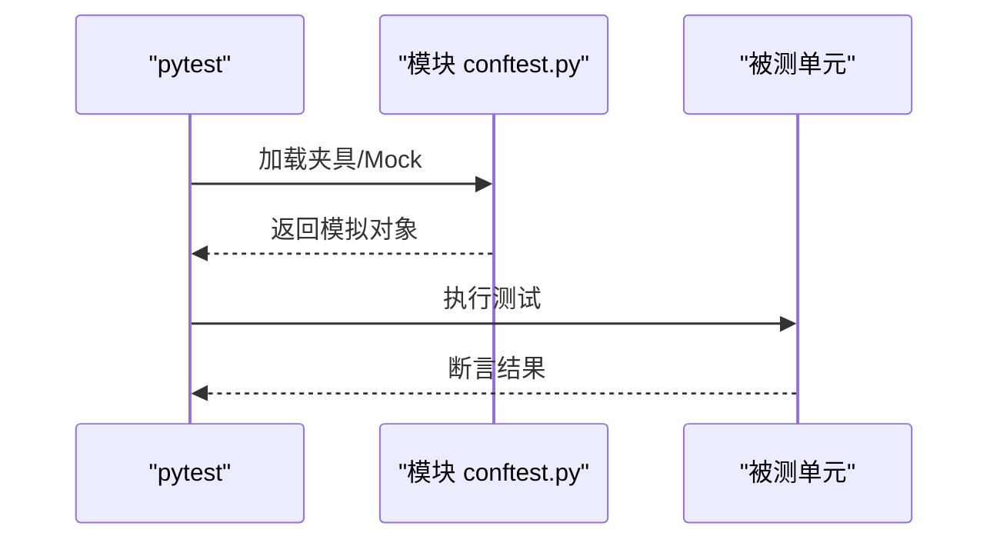
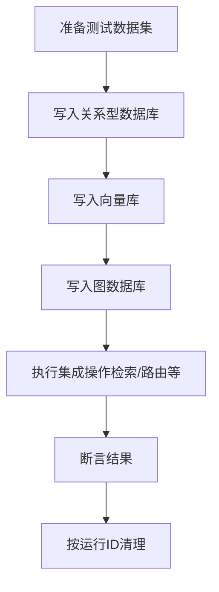
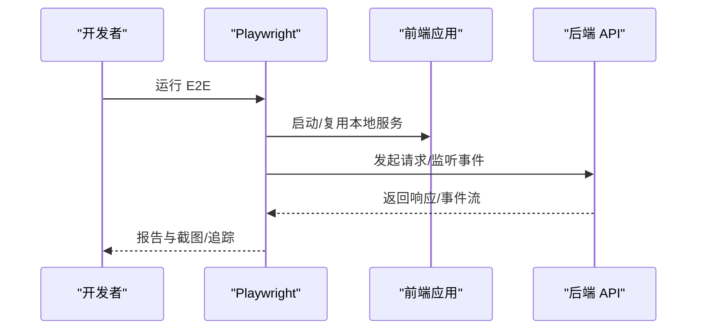
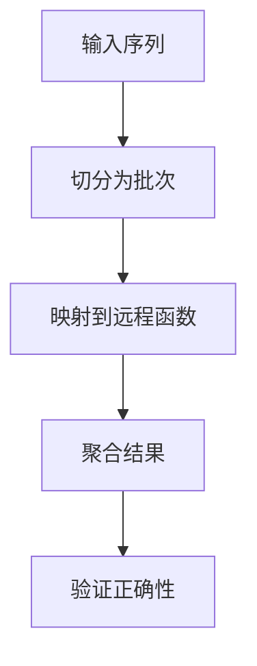
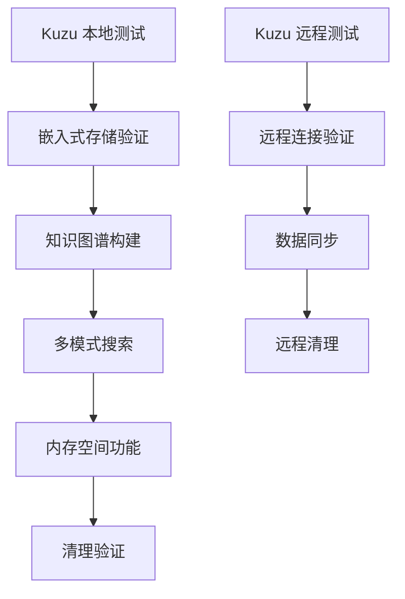
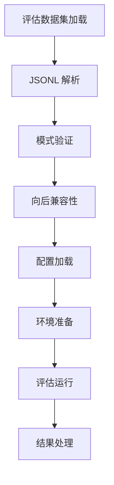
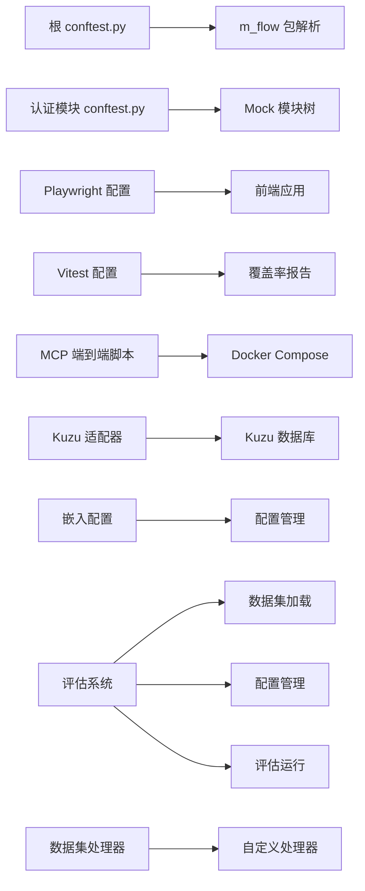

# 测试策略

<cite>
**本文引用的文件**
- [根 conftest.py](file://conftest.py)
- [核心参考测试夹具](file://coreference/tests/conftest.py)
- [前端 Playwright 配置](file://m_flow-frontend/playwright.config.ts)
- [前端 Vitest 配置](file://m_flow-frontend/vitest.config.ts)
- [MCP 端到端测试脚本](file://m_flow-mcp/test_e2e.sh)
- [后端测试数据准备脚本](file://m_flow/tests/test_data_setup.py)
- [后端认证模块测试夹具](file://m_flow/tests/unit/auth/conftest.py)
- [分布式计算测试模块](file://mflow_workers/test.py)
- [Kuzu 图查询属性测试](file://m_flow/tests/unit/infrastructure/graph/test_kuzu_query_by_attributes.py)
- [自定义嵌入提供程序配置测试](file://m_flow/tests/unit/infrastructure/vector/embeddings/test_embedding_config_custom_provider.py)
- [Kuzu 本地集成测试](file://m_flow/tests/test_kuzu.py)
- [Kuzu 远程集成测试](file://m_flow/tests/test_remote_kuzu.py)
- [Kuzu 压力测试](file://m_flow/tests/test_remote_kuzu_stress.py)
- [嵌入配置类](file://m_flow/adapters/vector/embeddings/config.py)
- [Kuzu 适配器](file://m_flow/adapters/graph/kuzu/adapter.py)
- [远程 Kuzu 适配器](file://m_flow/adapters/graph/kuzu/remote_kuzu_adapter.py)
- [数据集数据库处理器测试](file://m_flow/tests/test_dataset_database_handler.py)
- [评估数据集加载器](file://m_flow/eval/loader.py)
- [评估配置](file://m_flow/eval/config.py)
- [评估主程序](file://m_flow/eval/__main__.py)
</cite>

## 目录
1. [引言](#引言)
2. [项目结构](#项目结构)
3. [核心组件](#核心组件)
4. [架构总览](#架构总览)
5. [详细组件分析](#详细组件分析)
6. [依赖分析](#依赖分析)
7. [性能考虑](#性能考虑)
8. [故障排查指南](#故障排查指南)
9. [结论](#结论)
10. [附录](#附录)

## 引言
本文件面向 M-flow 项目的测试体系，系统阐述测试金字塔（单元测试、集成测试、端到端测试）的层次关系与组织方式，覆盖测试文件命名规范、夹具与数据管理、各类测试编写方法、运行指南、最佳实践以及调试技巧。目标是帮助开发者在不同层级高效地设计与执行测试，保障系统质量与可维护性。

**更新** 本次更新反映了测试基础设施的建立，新增了针对 Kuzu 图数据库查询属性和自定义嵌入提供程序配置的单元测试，进一步完善了测试金字塔的覆盖范围。同时，新增了评估系统测试相关内容，包括数据集解析、推理配置和数据保存功能的测试。

## 项目结构
M-flow 的测试分布在多个子项目中：
- 后端主仓库：m_flow 目录下包含大量测试用例，涵盖单元、集成与子集 E2E 场景；另有独立的测试数据准备脚本用于隔离与清理。
- 前端子项目：m_flow-frontend 使用 Playwright 进行浏览器级 E2E 测试，Vitest 提供组件/单元测试与覆盖率。
- MCP 子项目：m_flow-mcp 提供独立的端到端测试脚本，基于 Docker Compose 完整拉起服务链路进行验证。
- 工作器子项目：mflow_workers 包含 Modal 分布式任务的本地/映射执行测试样例。
- **新增** 评估系统：包含数据集加载、配置管理和评估运行的测试组件。

**图表来源**
- [Kuzu 图查询属性测试:1-36](file://m_flow/tests/unit/infrastructure/graph/test_kuzu_query_by_attributes.py#L1-L36)
- [自定义嵌入提供程序配置测试:1-20](file://m_flow/tests/unit/infrastructure/vector/embeddings/test_embedding_config_custom_provider.py#L1-L20)
- [Kuzu 本地集成测试:1-153](file://m_flow/tests/test_kuzu.py#L1-L153)
- [Kuzu 远程集成测试:1-122](file://m_flow/tests/test_remote_kuzu.py#L1-L122)
- [Kuzu 压力测试:1-110](file://m_flow/tests/test_remote_kuzu_stress.py#L1-L110)
- [数据集数据库处理器测试:1-165](file://m_flow/tests/test_dataset_database_handler.py#L1-L165)
- [评估数据集加载器:111-155](file://m_flow/eval/loader.py#L111-L155)
- [评估配置:120-161](file://m_flow/eval/config.py#L120-L161)
- [评估主程序:43-93](file://m_flow/eval/__main__.py#L43-L93)

**章节来源**
- [根 conftest.py:1-54](file://conftest.py#L1-L54)
- [前端 Playwright 配置:1-47](file://m_flow-frontend/playwright.config.ts#L1-L47)
- [前端 Vitest 配置:1-33](file://m_flow-frontend/vitest.config.ts#L1-L33)
- [MCP 端到端测试脚本:1-244](file://m_flow-mcp/test_e2e.sh#L1-L244)
- [后端测试数据准备脚本:1-255](file://m_flow/tests/test_data_setup.py#L1-L255)
- [后端认证模块测试夹具:1-55](file://m_flow/tests/unit/auth/conftest.py#L1-L55)
- [分布式计算测试模块:1-35](file://mflow_workers/test.py#L1-L35)

## 核心组件
- 测试组织与发现
  - 根级 conftest.py 在 pytest 收集早期阶段注入项目根路径，确保包解析一致，避免"找不到模块"问题。
  - 各子模块（如 auth）的 conftest.py 提供局部夹具与模块级 Mock，减少重复代码。
- 测试夹具与数据
  - 共享夹具：核心参考模块提供中文/英文解析器与分词器的会话级夹具，兼顾性能与一致性。
  - 数据准备：后端提供统一的测试数据准备/清理/校验工具，支持按运行 ID 隔离多并发场景。
- 前端测试
  - Playwright：多浏览器项目、重试策略、报告与追踪配置，适合跨平台 E2E。
  - Vitest：JS DOM 环境、覆盖率、别名与排除规则，适合组件与工具函数测试。
- MCP 端到端
  - Docker Compose 编排，健康检查、SSE 端点验证、环境变量检查与日志审计，形成闭环验证。
- **新增** 图数据库测试基础设施
  - Kuzu 本地/远程集成测试：验证图数据库连接、知识图谱构建和多模式搜索功能。
  - 属性查询测试：验证基于 JSON 属性的图查询功能。
  - 嵌入配置测试：验证自定义嵌入提供程序的配置参数。
- **新增** 评估系统测试
  - 数据集加载器：验证 JSONL 格式解析、模式验证和向后兼容性。
  - 推理配置：验证检索、注入和运行时配置的环境变量设置。
  - 数据保存功能：验证自定义数据库处理器的注册和使用。

**章节来源**
- [根 conftest.py:1-54](file://conftest.py#L1-L54)
- [核心参考测试夹具:1-47](file://coreference/tests/conftest.py#L1-L47)
- [前端 Playwright 配置:1-47](file://m_flow-frontend/playwright.config.ts#L1-L47)
- [前端 Vitest 配置:1-33](file://m_flow-frontend/vitest.config.ts#L1-L33)
- [后端测试数据准备脚本:1-255](file://m_flow/tests/test_data_setup.py#L1-L255)
- [后端认证模块测试夹具:1-55](file://m_flow/tests/unit/auth/conftest.py#L1-L55)

## 架构总览
测试金字塔自底向上：
- 单元测试：最小可执行单元，使用夹具与 Mock 隔离外部依赖，保证快速与稳定。
- 集成测试：模块间协作与外部适配器（数据库、向量库、图数据库）交互，强调数据一致性与事务边界。
- 端到端测试：真实或近似真实环境下的用户路径验证，覆盖 UI、API、消息推送等全链路。

**更新** 新增的测试基础设施进一步强化了单元测试和集成测试的覆盖范围，特别是在图数据库、嵌入配置和评估系统方面。

## 详细组件分析

### 单元测试：Mock 与夹具
- 目标：验证函数/类的内部逻辑，隔离外部副作用。
- 方法：
  - 使用模块级 conftest 注入 Mock，如认证模块对日志工具的 Mock，确保被测模块不依赖真实外部行为。
  - 利用共享夹具（如解析器/分词器）提升初始化效率，同时通过"每次测试重置"的夹具保证状态隔离。
  - **新增** 图查询属性测试：通过继承 KuzuAdapter 创建 Fake 实现，捕获 Cypher 查询语句并验证属性提取逻辑。
  - **新增** 嵌入配置测试：验证自定义嵌入提供程序的配置参数，包括维度、批大小和端点设置。
  - **新增** 评估系统测试：验证数据集加载器的 JSONL 解析、配置管理的环境变量处理和数据保存功能的自定义处理器注册。
- 示例路径
  - [认证模块测试夹具:1-55](file://m_flow/tests/unit/auth/conftest.py#L1-L55)
  - [核心参考测试夹具:1-47](file://coreference/tests/conftest.py#L1-L47)
  - [Kuzu 图查询属性测试:1-36](file://m_flow/tests/unit/infrastructure/graph/test_kuzu_query_by_attributes.py#L1-L36)
  - [自定义嵌入提供程序配置测试:1-20](file://m_flow/tests/unit/infrastructure/vector/embeddings/test_embedding_config_custom_provider.py#L1-L20)
  - [数据集数据库处理器测试:48-84](file://m_flow/tests/test_dataset_database_handler.py#L48-L84)
  - [评估数据集加载器:124-155](file://m_flow/eval/loader.py#L124-L155)
  - [评估配置:120-161](file://m_flow/eval/config.py#L120-L161)

**图表来源**
- [后端认证模块测试夹具:1-55](file://m_flow/tests/unit/auth/conftest.py#L1-L55)
- [核心参考测试夹具:1-47](file://coreference/tests/conftest.py#L1-L47)

**章节来源**
- [后端认证模块测试夹具:1-55](file://m_flow/tests/unit/auth/conftest.py#L1-L55)
- [核心参考测试夹具:1-47](file://coreference/tests/conftest.py#L1-L47)
- [Kuzu 图查询属性测试:1-36](file://m_flow/tests/unit/infrastructure/graph/test_kuzu_query_by_attributes.py#L1-L36)
- [自定义嵌入提供程序配置测试:1-20](file://m_flow/tests/unit/infrastructure/vector/embeddings/test_embedding_config_custom_provider.py#L1-L20)
- [数据集数据库处理器测试:48-84](file://m_flow/tests/test_dataset_database_handler.py#L48-L84)
- [评估数据集加载器:124-155](file://m_flow/eval/loader.py#L124-L155)
- [评估配置:120-161](file://m_flow/eval/config.py#L120-L161)

### 集成测试：数据库与适配器
- 目标：验证模块与外部系统（关系型、向量、图数据库）的交互。
- 方法：
  - 使用测试数据准备脚本创建隔离数据集，执行 memorize 等处理，确保后续查询/检索可用。
  - 清理阶段按运行 ID 精确删除，避免交叉污染。
  - **新增** Kuzu 图数据库集成测试：验证本地和远程 Kuzu 连接、知识图谱构建和多模式搜索功能。
  - **新增** 压力测试：验证远程 Kuzu 的大规模数据插入和查询性能。
  - **新增** 数据集数据库处理器测试：验证自定义 LanceDB 和 Kuzu 处理器的注册和使用，确保每数据集隔离存储。
- 示例路径
  - [后端测试数据准备脚本:1-255](file://m_flow/tests/test_data_setup.py#L1-L255)
  - [Kuzu 本地集成测试:1-153](file://m_flow/tests/test_kuzu.py#L1-L153)
  - [Kuzu 远程集成测试:1-122](file://m_flow/tests/test_remote_kuzu.py#L1-L122)
  - [Kuzu 压力测试:1-110](file://m_flow/tests/test_remote_kuzu_stress.py#L1-L110)
  - [数据集数据库处理器测试:91-147](file://m_flow/tests/test_dataset_database_handler.py#L91-L147)

**图表来源**
- [后端测试数据准备脚本:54-107](file://m_flow/tests/test_data_setup.py#L54-L107)
- [后端测试数据准备脚本:109-189](file://m_flow/tests/test_data_setup.py#L109-L189)

**章节来源**
- [后端测试数据准备脚本:1-255](file://m_flow/tests/test_data_setup.py#L1-L255)
- [Kuzu 本地集成测试:1-153](file://m_flow/tests/test_kuzu.py#L1-L153)
- [Kuzu 远程集成测试:1-122](file://m_flow/tests/test_remote_kuzu.py#L1-L122)
- [Kuzu 压力测试:1-110](file://m_flow/tests/test_remote_kuzu_stress.py#L1-L110)
- [数据集数据库处理器测试:91-147](file://m_flow/tests/test_dataset_database_handler.py#L91-L147)

### 端到端测试：环境与链路
- 目标：在接近生产环境的条件下验证完整业务路径。
- 方法：
  - 前端：Playwright 多浏览器项目、重试与报告，结合本地 Web 服务器启动。
  - MCP：Docker Compose 编排，健康检查、SSE 端点、环境变量与日志审计。
- 示例路径
  - [前端 Playwright 配置:1-47](file://m_flow-frontend/playwright.config.ts#L1-L47)
  - [MCP 端到端测试脚本:1-244](file://m_flow-mcp/test_e2e.sh#L1-L244)

**图表来源**
- [前端 Playwright 配置:1-47](file://m_flow-frontend/playwright.config.ts#L1-L47)

**章节来源**
- [前端 Playwright 配置:1-47](file://m_flow-frontend/playwright.config.ts#L1-L47)
- [MCP 端到端测试脚本:1-244](file://m_flow-mcp/test_e2e.sh#L1-L244)

### 分布式测试：Modal 任务映射
- 目标：验证分布式批处理任务的正确性与性能。
- 方法：本地与映射执行对比，批量切片与聚合求和作为示例。
- 示例路径
  - [分布式计算测试模块:1-35](file://mflow_workers/test.py#L1-L35)

**图表来源**
- [分布式计算测试模块:16-34](file://mflow_workers/test.py#L16-L34)

**章节来源**
- [分布式计算测试模块:1-35](file://mflow_workers/test.py#L1-L35)

### **新增** 图数据库测试基础设施
- 目标：验证 Kuzu 图数据库的完整功能，包括本地和远程连接、属性查询和性能测试。
- 方法：
  - 本地测试：验证嵌入式图存储、知识图谱构建和多模式搜索。
  - 远程测试：验证远程连接建立、数据同步和清理功能。
  - 属性查询测试：验证基于 JSON properties 字段的查询逻辑。
  - 压力测试：验证大规模数据插入和查询的性能表现。
- 示例路径
  - [Kuzu 本地集成测试:1-153](file://m_flow/tests/test_kuzu.py#L1-L153)
  - [Kuzu 远程集成测试:1-122](file://m_flow/tests/test_remote_kuzu.py#L1-L122)
  - [Kuzu 图查询属性测试:1-36](file://m_flow/tests/unit/infrastructure/graph/test_kuzu_query_by_attributes.py#L1-L36)
  - [Kuzu 压力测试:1-110](file://m_flow/tests/test_remote_kuzu_stress.py#L1-L110)

**图表来源**
- [Kuzu 本地集成测试:30-141](file://m_flow/tests/test_kuzu.py#L30-L141)
- [Kuzu 远程集成测试:27-109](file://m_flow/tests/test_remote_kuzu.py#L27-L109)

**章节来源**
- [Kuzu 本地集成测试:1-153](file://m_flow/tests/test_kuzu.py#L1-L153)
- [Kuzu 远程集成测试:1-122](file://m_flow/tests/test_remote_kuzu.py#L1-L122)
- [Kuzu 图查询属性测试:1-36](file://m_flow/tests/unit/infrastructure/graph/test_kuzu_query_by_attributes.py#L1-L36)
- [Kuzu 压力测试:1-110](file://m_flow/tests/test_remote_kuzu_stress.py#L1-L110)

### **新增** 评估系统测试基础设施
- 目标：验证评估系统的完整功能，包括数据集解析、配置管理和评估运行流程。
- 方法：
  - 数据集加载测试：验证 JSONL 格式的解析、模式验证和向后兼容性处理。
  - 配置管理测试：验证从环境变量加载配置、检索参数设置和运行时跟踪配置。
  - 评估运行测试：验证完整的评估流程，包括数据集加载、环境准备和结果处理。
  - 数据保存测试：验证自定义数据库处理器的注册和使用，确保每数据集隔离存储。
- 示例路径
  - [评估数据集加载器:111-155](file://m_flow/eval/loader.py#L111-L155)
  - [评估配置:120-161](file://m_flow/eval/config.py#L120-L161)
  - [评估主程序:43-93](file://m_flow/eval/__main__.py#L43-L93)
  - [数据集数据库处理器测试:91-147](file://m_flow/tests/test_dataset_database_handler.py#L91-L147)

**图表来源**
- [评估数据集加载器:124-155](file://m_flow/eval/loader.py#L124-L155)
- [评估配置:120-161](file://m_flow/eval/config.py#L120-L161)
- [评估主程序:76-88](file://m_flow/eval/__main__.py#L76-L88)

**章节来源**
- [评估数据集加载器:111-155](file://m_flow/eval/loader.py#L111-L155)
- [评估配置:120-161](file://m_flow/eval/config.py#L120-L161)
- [评估主程序:43-93](file://m_flow/eval/__main__.py#L43-L93)
- [数据集数据库处理器测试:91-147](file://m_flow/tests/test_dataset_database_handler.py#L91-L147)

## 依赖分析
- 路径与包解析
  - 根 conftest.py 在早期钩子中强制将项目根加入 sys.path，并在必要时重新导入 m_flow，确保测试收集阶段的包定位正确。
- 模块内依赖
  - 认证模块的 conftest.py 动态构造父模块与 Mock，使被测模块能加载到预期的路径结构。
- 外部依赖
  - 前端测试依赖 Playwright 设备集合与 Vitest 覆盖率提供器；MCP 端到端依赖 Docker Compose 与 curl 健康检查。
- **新增** 图数据库依赖
  - Kuzu 适配器依赖嵌入式数据库引擎和可选的 Redis 分布式锁。
  - 远程 Kuzu 适配器依赖 aiohttp 进行 HTTP REST API 通信。
  - 嵌入配置依赖 pydantic-settings 进行配置管理。
- **新增** 评估系统依赖
  - 评估数据集加载器依赖 JSON 解析和文件系统操作。
  - 评估配置依赖环境变量和 pydantic 设置管理。
  - 数据保存功能依赖自定义数据库处理器接口和异步数据库操作。

**图表来源**
- [根 conftest.py:18-48](file://conftest.py#L18-L48)
- [后端认证模块测试夹具:14-50](file://m_flow/tests/unit/auth/conftest.py#L14-L50)
- [前端 Playwright 配置:1-47](file://m_flow-frontend/playwright.config.ts#L1-L47)
- [前端 Vitest 配置:1-33](file://m_flow-frontend/vitest.config.ts#L1-L33)
- [MCP 端到端测试脚本:1-244](file://m_flow-mcp/test_e2e.sh#L1-L244)
- [Kuzu 适配器:144-156](file://m_flow/adapters/graph/kuzu/adapter.py#L144-L156)
- [嵌入配置类:16-69](file://m_flow/adapters/vector/embeddings/config.py#L16-L69)
- [评估数据集加载器:124-155](file://m_flow/eval/loader.py#L124-L155)
- [评估配置:120-161](file://m_flow/eval/config.py#L120-L161)
- [数据集数据库处理器测试:48-84](file://m_flow/tests/test_dataset_database_handler.py#L48-L84)

**章节来源**
- [根 conftest.py:1-54](file://conftest.py#L1-L54)
- [后端认证模块测试夹具:1-55](file://m_flow/tests/unit/auth/conftest.py#L1-L55)
- [前端 Playwright 配置:1-47](file://m_flow-frontend/playwright.config.ts#L1-L47)
- [前端 Vitest 配置:1-33](file://m_flow-frontend/vitest.config.ts#L1-L33)
- [MCP 端到端测试脚本:1-244](file://m_flow-mcp/test_e2e.sh#L1-L244)
- [Kuzu 适配器:144-156](file://m_flow/adapters/graph/kuzu/adapter.py#L144-L156)
- [嵌入配置类:16-69](file://m_flow/adapters/vector/embeddings/config.py#L16-L69)
- [评估数据集加载器:111-155](file://m_flow/eval/loader.py#L111-L155)
- [评估配置:120-161](file://m_flow/eval/config.py#L120-L161)
- [数据集数据库处理器测试:1-165](file://m_flow/tests/test_dataset_database_handler.py#L1-L165)

## 性能考虑
- 单元测试
  - 使用会话级夹具缓存昂贵资源（如解析器），减少初始化开销；对每个测试使用"重置"夹具确保状态隔离。
  - **新增** 图查询测试：通过 Fake 适配器捕获查询语句，避免实际数据库操作。
  - **新增** 评估系统测试：使用小规模数据集进行快速验证，避免大规模数据处理影响测试性能。
- 集成测试
  - 使用测试数据准备脚本生成隔离数据集，避免并发冲突；清理阶段按运行 ID 精准删除，降低数据膨胀。
  - **新增** Kuzu 压力测试：使用批量插入和并发操作验证大规模数据处理能力。
  - **新增** 数据集处理器测试：验证自定义处理器的注册和使用，确保每数据集隔离存储不会影响性能。
- 端到端测试
  - Playwright 在 CI 中限制 worker 数量与重试次数，平衡稳定性与速度；MCP 端到端脚本支持快速模式跳过耗时步骤。
- 分布式测试
  - 将大任务切分为固定大小的批次，利用映射并行提升吞吐，同时保留本地执行作为基准对比。

**章节来源**
- [核心参考测试夹具:15-30](file://coreference/tests/conftest.py#L15-L30)
- [后端测试数据准备脚本:26-51](file://m_flow/tests/test_data_setup.py#L26-L51)
- [MCP 端到端测试脚本:29-44](file://m_flow-mcp/test_e2e.sh#L29-L44)
- [分布式计算测试模块:12-34](file://mflow_workers/test.py#L12-L34)
- [Kuzu 压力测试:1-110](file://m_flow/tests/test_remote_kuzu_stress.py#L1-L110)
- [数据集数据库处理器测试:91-147](file://m_flow/tests/test_dataset_database_handler.py#L91-L147)

## 故障排查指南
- 包路径问题
  - 症状：pytest 收集阶段找不到 m_flow 或模块路径异常。
  - 处理：确认根 conftest.py 已将项目根加入 sys.path，并在必要时触发重新导入。
  - 参考路径：[根 conftest.py:18-48](file://conftest.py#L18-L48)
- Mock 不生效
  - 症状：被测模块仍调用真实外部依赖。
  - 处理：检查模块 conftest.py 的 Mock 注入顺序与父模块注册，确保在被测模块 import 前已存在于 sys.modules。
  - 参考路径：[后端认证模块测试夹具:14-50](file://m_flow/tests/unit/auth/conftest.py#L14-L50)
- 数据污染与并发冲突
  - 症状：集成测试间相互影响，查询结果不稳定。
  - 处理：使用测试数据准备脚本生成带运行 ID 的隔离数据集；清理阶段按运行 ID 删除。
  - 参考路径：[后端测试数据准备脚本:26-51](file://m_flow/tests/test_data_setup.py#L26-L51), [后端测试数据准备脚本:109-189](file://m_flow/tests/test_data_setup.py#L109-L189)
- 健康检查与日志
  - 症状：E2E 失败但原因不明。
  - 处理：查看 MCP 端到端脚本输出的容器日志与健康检查响应；关注错误/异常/回溯信息。
  - 参考路径：[MCP 端到端测试脚本:118-152](file://m_flow-mcp/test_e2e.sh#L118-L152), [MCP 端到端测试脚本:218-225](file://m_flow-mcp/test_e2e.sh#L218-L225)
- **新增** 图数据库连接问题
  - 症状：Kuzu 连接失败或查询超时。
  - 处理：检查环境变量配置（KUZU_HOST、KUZU_PORT、KUZU_USERNAME、KUZU_PASSWORD、KUZU_DATABASE）；验证数据库服务状态；查看适配器日志。
  - 参考路径：[Kuzu 远程集成测试:44-49](file://m_flow/tests/test_remote_kuzu.py#L44-L49), [远程 Kuzu 适配器:1-53](file://m_flow/adapters/graph/kuzu/remote_kuzu_adapter.py#L1-L53)
- **新增** 嵌入配置问题
  - 症状：自定义嵌入提供程序配置不生效。
  - 处理：验证 EmbeddingConfig 的参数设置；检查环境变量前缀（MFLOW_）；确认配置缓存是否正确更新。
  - 参考路径：[嵌入配置类:32-46](file://m_flow/adapters/vector/embeddings/config.py#L32-L46), [自定义嵌入提供程序配置测试:6-19](file://m_flow/tests/unit/infrastructure/vector/embeddings/test_embedding_config_custom_provider.py#L6-L19)
- **新增** 评估系统问题
  - 症状：评估数据集加载失败或配置不正确。
  - 处理：检查 JSONL 文件格式和编码；验证环境变量设置；确认评估配置的默认值和覆盖逻辑。
  - 参考路径：[评估数据集加载器:134-151](file://m_flow/eval/loader.py#L134-L151), [评估配置:120-161](file://m_flow/eval/config.py#L120-L161)
- **新增** 数据保存问题
  - 症状：自定义数据库处理器未生效或数据未正确保存。
  - 处理：验证处理器注册顺序；检查用户权限和数据集隔离；确认异步操作完成状态。
  - 参考路径：[数据集数据库处理器测试:98-100](file://m_flow/tests/test_dataset_database_handler.py#L98-L100), [数据集数据库处理器测试:137-147](file://m_flow/tests/test_dataset_database_handler.py#L137-L147)

**章节来源**
- [根 conftest.py:18-48](file://conftest.py#L18-L48)
- [后端认证模块测试夹具:14-50](file://m_flow/tests/unit/auth/conftest.py#L14-L50)
- [后端测试数据准备脚本:26-51](file://m_flow/tests/test_data_setup.py#L26-L51)
- [后端测试数据准备脚本:109-189](file://m_flow/tests/test_data_setup.py#L109-L189)
- [MCP 端到端测试脚本:118-152](file://m_flow-mcp/test_e2e.sh#L118-L152)
- [MCP 端到端测试脚本:218-225](file://m_flow-mcp/test_e2e.sh#L218-L225)
- [Kuzu 远程集成测试:44-49](file://m_flow/tests/test_remote_kuzu.py#L44-L49)
- [远程 Kuzu 适配器:1-53](file://m_flow/adapters/graph/kuzu/remote_kuzu_adapter.py#L1-L53)
- [嵌入配置类:32-46](file://m_flow/adapters/vector/embeddings/config.py#L32-L46)
- [自定义嵌入提供程序配置测试:6-19](file://m_flow/tests/unit/infrastructure/vector/embeddings/test_embedding_config_custom_provider.py#L6-L19)
- [评估数据集加载器:134-151](file://m_flow/eval/loader.py#L134-L151)
- [评估配置:120-161](file://m_flow/eval/config.py#L120-L161)
- [数据集数据库处理器测试:98-100](file://m_flow/tests/test_dataset_database_handler.py#L98-L100)
- [数据集数据库处理器测试:137-147](file://m_flow/tests/test_dataset_database_handler.py#L137-L147)

## 结论
M-flow 的测试策略以测试金字塔为核心，配合统一的夹具与数据管理机制，在单元、集成与端到端三个层面形成闭环。通过 Mock 与隔离数据、容器化编排与多浏览器验证，以及分布式任务映射测试，整体提升了系统的可靠性与可维护性。

**更新** 本次更新显著增强了测试基础设施，新增的 Kuzu 图数据库测试、嵌入配置测试和评估系统测试进一步完善了测试覆盖范围，特别是在图查询属性、自定义嵌入提供程序、数据集解析、推理配置和数据保存功能方面。这些测试确保了增强功能的正确性和性能表现，为系统的稳定运行提供了有力保障。

## 附录

### 测试组织与命名规范
- 文件命名
  - 单元测试：以 test_ 前缀，模块内按功能拆分，如 test_xxx.py。
  - 集成测试：以 test_integration_ 前缀或置于 integration 目录。
  - 端到端测试：以 test_e2e_ 前缀或置于 e2e 目录。
  - **新增** 图数据库测试：以 test_kuzu* 前缀或置于 infrastructure/graph 目录。
  - **新增** 嵌入配置测试：以 test_embedding_config* 前缀或置于 infrastructure/vector/embeddings 目录。
  - **新增** 评估系统测试：以 test_eval* 前缀或置于 eval 目录。
  - **新增** 数据集处理器测试：以 test_dataset_database_handler.py 形式存在。
- 目录结构
  - m_flow/tests/unit：按模块划分（如 auth、pipeline 等）。
  - m_flow/tests/integration：按功能域划分（如 database、vector、graph）。
  - m_flow/tests/e2e：按业务路径划分（如 search、ingest）。
  - **新增** m_flow/tests/unit/infrastructure/graph：图数据库相关单元测试。
  - **新增** m_flow/tests/unit/infrastructure/vector/embeddings：嵌入配置相关单元测试。
  - **新增** m_flow/tests/test_dataset_database_handler.py：数据集处理器集成测试。
  - **新增** m_flow/eval：评估系统测试目录。
- 夹具与配置
  - 根 conftest.py 统一注入项目路径与基础配置。
  - 模块级 conftest.py 提供局部夹具与 Mock。

**章节来源**
- [根 conftest.py:1-54](file://conftest.py#L1-L54)
- [后端认证模块测试夹具:1-55](file://m_flow/tests/unit/auth/conftest.py#L1-L55)

### 测试运行指南
- 后端单元/集成/E2E
  - 使用 pytest 命令运行，默认自动发现 test_*.py 与 *_test.py。
  - 可通过标记过滤（如 -m "not e2e"）选择性运行。
  - **新增** 图数据库测试：使用 python -m pytest 运行特定测试文件。
  - **新增** 评估系统测试：使用 python -m m_flow.eval 运行评估主程序测试。
  - **新增** 数据集处理器测试：使用 python -m m_flow.tests.test_dataset_database_handler 运行处理器测试。
- 前端
  - Playwright：npx playwright test，或 pnpm test。
  - Vitest：pnpm vitest，或 pnpm coverage。
- MCP 端到端
  - ./test_e2e.sh：完整测试；./test_e2e.sh --quick：快速模式；./test_e2e.sh --cleanup：仅清理。
- 工作器
  - 运行 mflow_workers/test.py 观察本地与映射执行差异。

**章节来源**
- [前端 Playwright 配置:1-47](file://m_flow-frontend/playwright.config.ts#L1-L47)
- [前端 Vitest 配置:1-33](file://m_flow-frontend/vitest.config.ts#L1-L33)
- [MCP 端到端测试脚本:1-244](file://m_flow-mcp/test_e2e.sh#L1-L244)
- [分布式计算测试模块:1-35](file://mflow_workers/test.py#L1-L35)
- [评估主程序:226-251](file://m_flow/eval/__main__.py#L226-L251)
- [数据集数据库处理器测试:155-165](file://m_flow/tests/test_dataset_database_handler.py#L155-L165)

### 覆盖率与持续集成
- 前端覆盖率
  - Vitest 配置启用 v8 提供器，输出文本、JSON、LCov、HTML 报告，建议在 CI 中上传 LCov。
- 后端覆盖率
  - 建议在 pytest 中启用覆盖率插件（如 coverage.py），设定阈值（如语句/分支/函数/行）。
  - **新增** 图数据库和嵌入配置测试应纳入覆盖率统计。
  - **新增** 评估系统测试应纳入覆盖率统计。
- CI 最佳实践
  - 并行作业：单元/集成/E2E 分离；前端与后端分别运行。
  - 缓存：pip/pnpm 缓存；Docker 镜像缓存。
  - 报告：上传覆盖率与测试报告；失败快照/日志归档。

**章节来源**
- [前端 Vitest 配置:13-25](file://m_flow-frontend/vitest.config.ts#L13-L25)

### 测试最佳实践
- 数据隔离
  - 使用测试数据准备脚本生成带运行 ID 的隔离数据集；清理阶段按运行 ID 删除。
- 异步测试
  - 对异步接口使用事件循环或协程执行；避免在同步测试中直接调用异步函数。
  - **新增** 图数据库测试使用 asyncio.run() 运行异步测试函数。
  - **新增** 评估系统测试使用异步配置和运行流程。
- 性能测试
  - 使用批处理与映射并行；对比本地与分布式执行结果；记录延迟与吞吐。
  - **新增** Kuzu 压力测试验证大规模数据处理能力。
  - **新增** 评估系统测试验证大规模数据集处理性能。
- 调试技巧
  - Playwright 开启 trace 与截图；pytest 使用 -s/-v 输出；MCP 端到端脚本打印详细日志与容器日志。
  - **新增** 图数据库测试添加详细的日志输出和错误信息。
  - **新增** 评估系统测试添加详细的配置和数据处理日志。
- **新增** 配置验证
  - 嵌入配置测试验证自定义参数的有效性。
  - 图查询测试验证 Cypher 语句的正确性。
  - **新增** 评估配置测试验证环境变量覆盖和默认值设置。
  - **新增** 数据保存测试验证自定义处理器的注册和使用。

**章节来源**
- [后端测试数据准备脚本:26-51](file://m_flow/tests/test_data_setup.py#L26-L51)
- [分布式计算测试模块:16-34](file://mflow_workers/test.py#L16-L34)
- [前端 Playwright 配置:13-17](file://m_flow-frontend/playwright.config.ts#L13-L17)
- [Kuzu 压力测试:1-110](file://m_flow/tests/test_remote_kuzu_stress.py#L1-L110)
- [自定义嵌入提供程序配置测试:1-20](file://m_flow/tests/unit/infrastructure/vector/embeddings/test_embedding_config_custom_provider.py#L1-L20)
- [评估配置:120-161](file://m_flow/eval/config.py#L120-L161)
- [数据集数据库处理器测试:98-100](file://m_flow/tests/test_dataset_database_handler.py#L98-L100)