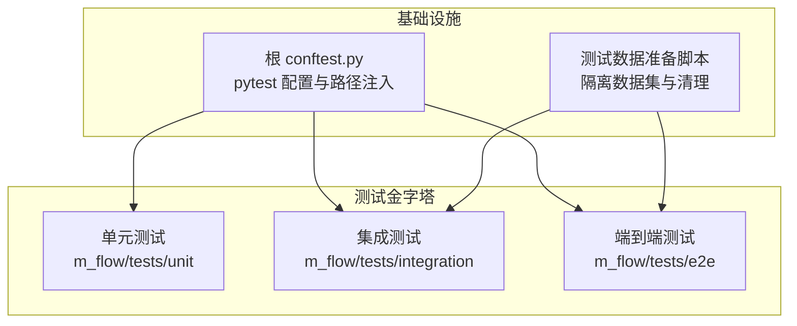
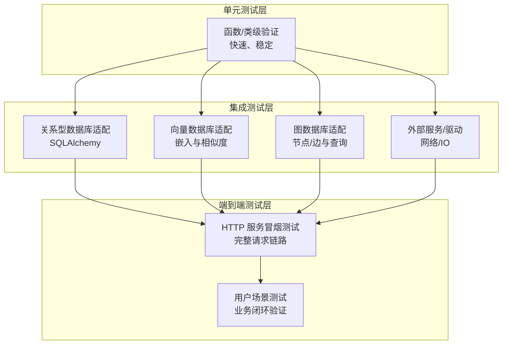
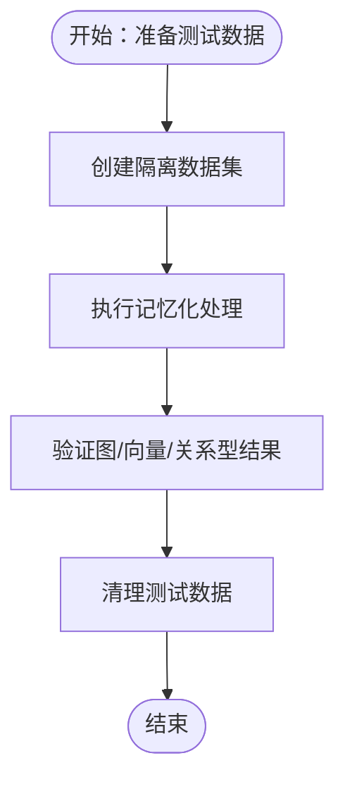
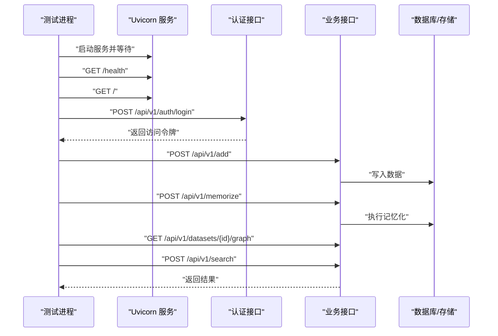
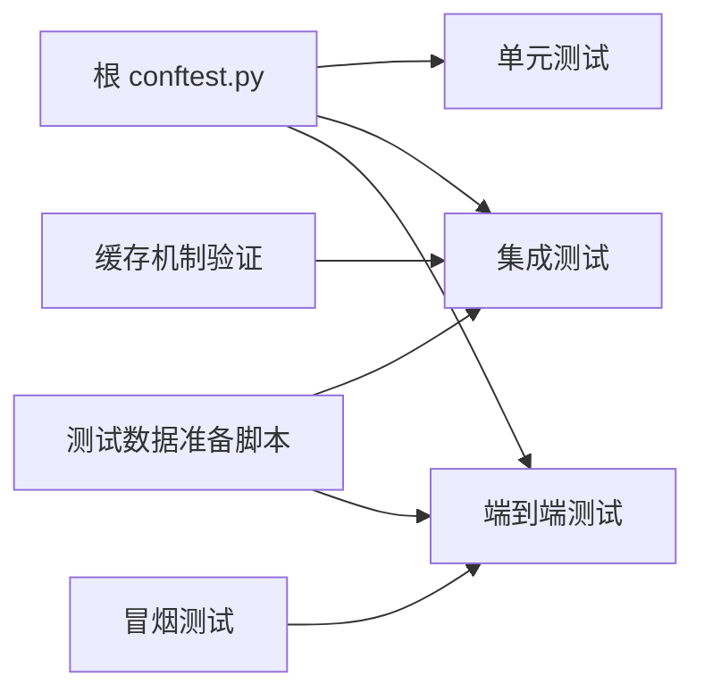

# 测试类型与金字塔结构

<cite>
**本文引用的文件**
- [根 conftest.py](file://conftest.py)
- [测试数据准备脚本](file://m_flow/tests/test_data_setup.py)
- [服务器启动冒烟测试](file://m_flow/tests/test_m_flow_server_start.py)
- [流水线缓存机制验证](file://m_flow/tests/test_pipeline_cache.py)
- [核心参考文件](file://m_flow/tests/e2e/__init__.py)
- [核心参考文件](file://m_flow/tests/integration/__init__.py)
- [核心参考文件](file://m_flow/tests/unit/__init__.py)
</cite>

## 目录
1. [引言](#引言)
2. [项目结构](#项目结构)
3. [核心组件](#核心组件)
4. [架构总览](#架构总览)
5. [详细组件分析](#详细组件分析)
6. [依赖分析](#依赖分析)
7. [性能考虑](#性能考虑)
8. [故障排除指南](#故障排除指南)
9. [结论](#结论)
10. [附录](#附录)

## 引言
本文件系统性阐述 M-flow 的测试类型与测试金字塔结构，围绕单元测试（Unit Tests）、集成测试（Integration Tests）与端到端测试（End-to-End Tests）三大层次展开，结合仓库中现有的测试实现与配置，解释各层的适用场景、测试范围与性能特征，并给出基于仓库实践的测试选择指南与最佳实践。

## 项目结构
M-flow 在测试组织上采用“金字塔”分层思路：
- 单元测试（Unit Tests）：位于 m_flow/tests/unit 下，聚焦函数与小对象的独立行为验证，强调快速、稳定与可重复。
- 集成测试（Integration Tests）：位于 m_flow/tests/integration 下，关注模块间协作、外部依赖（如数据库、向量库、图数据库）交互与配置正确性。
- 端到端测试（E2E Tests）：位于 m_flow/tests/e2e 下，覆盖真实用户场景下的完整流程，从服务启动到业务闭环。

此外，根目录的 conftest.py 提供统一的 pytest 配置与包路径注入，确保测试发现与导入一致性；测试数据准备脚本负责隔离的测试数据创建、清理与校验，支撑集成与 E2E 场景。

图表来源
- [根 conftest.py:1-54](file://conftest.py#L1-L54)
- [核心参考文件:1-7](file://m_flow/tests/e2e/__init__.py#L1-L7)
- [核心参考文件](file://m_flow/tests/integration/__init__.py)
- [核心参考文件](file://m_flow/tests/unit/__init__.py)

章节来源
- [根 conftest.py:1-54](file://conftest.py#L1-L54)
- [核心参考文件:1-7](file://m_flow/tests/e2e/__init__.py#L1-L7)

## 核心组件
- pytest 根配置与路径注入：通过根 conftest.py 在测试会话早期注入项目根路径，避免包解析问题，保证 m_flow 包从期望位置加载。
- 测试数据生命周期管理：测试数据准备脚本提供创建、清理与校验能力，支持按测试运行 ID 隔离多并发场景，保障测试稳定性与可重复性。
- 冒烟测试（E2E 示例）：服务器启动冒烟测试通过子进程启动服务并发起完整请求链路，验证健康检查、认证、数据添加、记忆化、图查询与检索等端到端流程。
- 缓存机制验证（集成示例）：流水线缓存测试通过自定义跟踪器验证缓存开关与状态重置对执行次数的影响，体现集成层对系统关键行为的验证。

章节来源
- [根 conftest.py:18-48](file://conftest.py#L18-L48)
- [测试数据准备脚本:26-106](file://m_flow/tests/test_data_setup.py#L26-L106)
- [服务器启动冒烟测试:27-62](file://m_flow/tests/test_m_flow_server_start.py#L27-L62)
- [流水线缓存机制验证:23-78](file://m_flow/tests/test_pipeline_cache.py#L23-L78)

## 架构总览
下图展示测试金字塔在 M-flow 中的职责分工与交互关系：

图表来源
- [服务器启动冒烟测试:70-134](file://m_flow/tests/test_m_flow_server_start.py#L70-L134)
- [流水线缓存机制验证:43-78](file://m_flow/tests/test_pipeline_cache.py#L43-L78)
- [测试数据准备脚本:109-182](file://m_flow/tests/test_data_setup.py#L109-L182)

## 详细组件分析

### 单元测试（Unit Tests）
- 设计原则
  - 小而快：聚焦单一函数或小对象的行为，避免外部依赖。
  - 可预测：输入输出明确，便于断言与回归。
  - 可并行：不共享全局状态，支持并发执行。
- 在 M-flow 的实践
  - 通过根 conftest.py 注入项目路径，确保单元测试能正确导入 m_flow 子模块。
  - 单元测试通常无需外部依赖，适合高频运行与本地开发阶段。
- 适用场景
  - 算法逻辑验证（如分块、归一化、路由规则等）。
  - 工具函数与纯函数的正确性。
  - 数据模型与序列化/反序列化的边界条件。

章节来源
- [根 conftest.py:18-48](file://conftest.py#L18-L48)
- [核心参考文件](file://m_flow/tests/unit/__init__.py)

### 集成测试（Integration Tests）
- 设计原则
  - 关注模块间协作与外部依赖交互。
  - 使用最小化、可控的外部资源（数据库、向量库、图数据库）。
  - 通过测试数据准备脚本进行隔离与清理，避免交叉污染。
- 在 M-flow 的实践
  - 关系型数据库适配：通过 SQLAlchemy 连接与迁移工具，验证数据模型与 CRUD 行为。
  - 向量数据库适配：验证嵌入生成与相似度检索。
  - 图数据库适配：验证节点/边写入与查询。
  - 缓存机制验证：通过工作流配置与状态重置，验证缓存开关与重置行为。
- 适用场景
  - 数据库连接、迁移与事务一致性。
  - 多适配器协同（向量+图+关系型）。
  - 关键业务流程的跨模块验证（如记忆化、检索）。

图表来源
- [测试数据准备脚本:54-106](file://m_flow/tests/test_data_setup.py#L54-L106)
- [流水线缓存机制验证:80-131](file://m_flow/tests/test_pipeline_cache.py#L80-L131)

章节来源
- [测试数据准备脚本:109-182](file://m_flow/tests/test_data_setup.py#L109-L182)
- [流水线缓存机制验证:43-78](file://m_flow/tests/test_pipeline_cache.py#L43-L78)

### 端到端测试（End-to-End Tests）
- 设计原则
  - 覆盖真实用户场景与完整业务闭环。
  - 以服务可访问性为基础，尽量减少外部依赖。
  - 明确超时与错误处理，提升稳定性。
- 在 M-flow 的实践
  - 冒烟测试：通过子进程启动 HTTP 服务，依次验证健康检查、根接口、登录认证、数据添加、记忆化、图查询与检索。
  - E2E 包说明：仓库提供 e2e 包作为端到端测试的容器，承载更复杂的用户场景与业务闭环。
- 适用场景
  - 新版本发布前的全链路验证。
  - 用户常见操作路径的回归测试。
  - 与前端或外部客户端对接的集成验证。

图表来源
- [服务器启动冒烟测试:70-134](file://m_flow/tests/test_m_flow_server_start.py#L70-L134)

章节来源
- [服务器启动冒烟测试:27-62](file://m_flow/tests/test_m_flow_server_start.py#L27-L62)
- [核心参考文件:1-7](file://m_flow/tests/e2e/__init__.py#L1-L7)

### 测试金字塔设计原则与平衡
- 层级比例：单元测试数量最多，集成测试次之，端到端测试最少，确保覆盖率与反馈速度的平衡。
- 依赖控制：单元测试不依赖外部系统；集成测试引入最小化外部依赖；端到端测试模拟真实用户路径。
- 性能与稳定性：单元测试优先，集成测试次之，端到端测试作为最后防线，避免阻塞开发迭代。
- 回归保障：端到端测试确保关键业务闭环稳定，集成测试验证模块协作，单元测试提供细粒度回归。

## 依赖分析
- 根 conftest.py 对测试发现与包路径的早期影响，确保 m_flow 包从正确路径加载，避免模块解析冲突。
- 测试数据准备脚本为集成与端到端测试提供隔离数据集，降低并发与交叉污染风险。
- 冒烟测试依赖 HTTP 服务与认证流程，验证系统整体可用性。
- 缓存机制验证依赖工作流执行与状态重置，验证系统关键行为。

图表来源
- [根 conftest.py:18-48](file://conftest.py#L18-L48)
- [测试数据准备脚本:54-106](file://m_flow/tests/test_data_setup.py#L54-L106)
- [服务器启动冒烟测试:70-134](file://m_flow/tests/test_m_flow_server_start.py#L70-L134)
- [流水线缓存机制验证:80-131](file://m_flow/tests/test_pipeline_cache.py#L80-L131)

章节来源
- [根 conftest.py:18-48](file://conftest.py#L18-L48)
- [测试数据准备脚本:109-182](file://m_flow/tests/test_data_setup.py#L109-L182)
- [服务器启动冒烟测试:27-62](file://m_flow/tests/test_m_flow_server_start.py#L27-L62)
- [流水线缓存机制验证:43-78](file://m_flow/tests/test_pipeline_cache.py#L43-L78)

## 性能考虑
- 单元测试：极快的执行速度，适合频繁运行与本地开发阶段，建议在 CI 中优先执行。
- 集成测试：涉及数据库与外部适配器，需注意连接池、事务与清理策略，避免资源泄漏。
- 端到端测试：启动服务与网络 IO 成本较高，建议在 CI 中串行或分批执行，并设置合理超时。
- 并发与隔离：通过测试数据准备脚本的运行 ID 机制，支持多进程并行测试，但需确保外部资源的命名空间隔离。

## 故障排除指南
- 包路径问题
  - 症状：测试导入 m_flow 失败或从错误路径加载。
  - 处理：确认根 conftest.py 已在 pytest 早期钩子中注入项目根路径，并强制重新导入 m_flow。
- 测试数据残留
  - 症状：集成或端到端测试间相互影响。
  - 处理：使用测试数据准备脚本的清理功能，确保按运行 ID 清理隔离数据集。
- 服务启动失败
  - 症状：冒烟测试无法连接服务或启动超时。
  - 处理：检查服务启动日志、端口占用与依赖环境，适当增加启动等待时间。
- 缓存行为异常
  - 症状：缓存开关或状态重置未按预期生效。
  - 处理：核对工作流配置与状态重置调用，确保执行次数与缓存策略一致。

章节来源
- [根 conftest.py:18-48](file://conftest.py#L18-L48)
- [测试数据准备脚本:109-182](file://m_flow/tests/test_data_setup.py#L109-L182)
- [服务器启动冒烟测试:30-62](file://m_flow/tests/test_m_flow_server_start.py#L30-L62)
- [流水线缓存机制验证:80-131](file://m_flow/tests/test_pipeline_cache.py#L80-L131)

## 结论
M-flow 的测试体系遵循金字塔结构：单元测试提供快速反馈与细粒度回归，集成测试验证模块协作与外部依赖，端到端测试保障业务闭环与真实用户场景。通过根 conftest.py 的路径注入、测试数据准备脚本的隔离与清理，以及冒烟测试与缓存机制验证等实践，项目在可维护性、稳定性与性能之间取得了良好平衡。建议开发者在日常开发中优先编写与运行单元测试，在需要验证模块协作或外部依赖时编写集成测试，并在关键发布前补充端到端测试以确保系统整体质量。

## 附录
- 测试选择指南
  - 需要快速反馈与高频运行：优先单元测试。
  - 需要验证模块协作与外部依赖：编写集成测试。
  - 需要验证真实用户场景与业务闭环：编写端到端测试。
  - 需要并行执行多个测试套件：使用测试数据准备脚本的运行 ID 机制进行隔离。