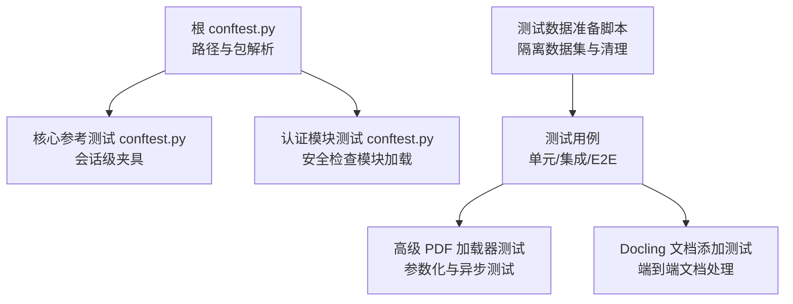
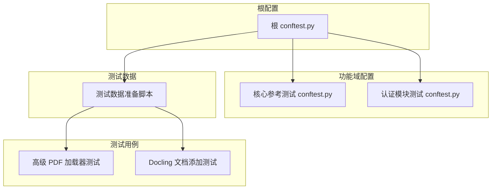
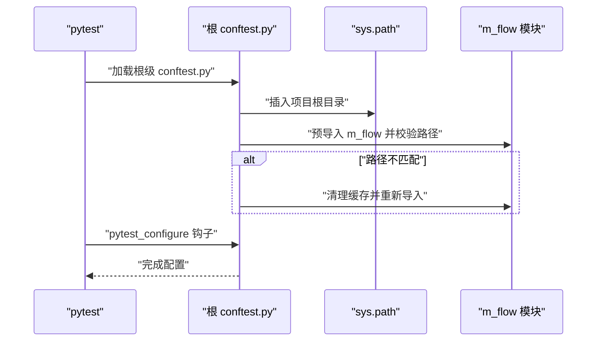
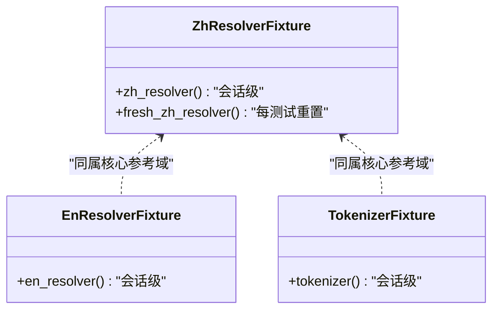
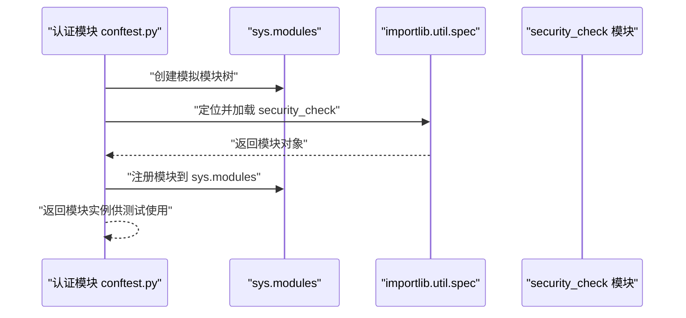
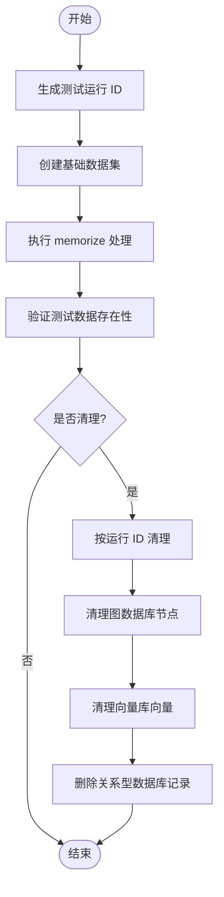
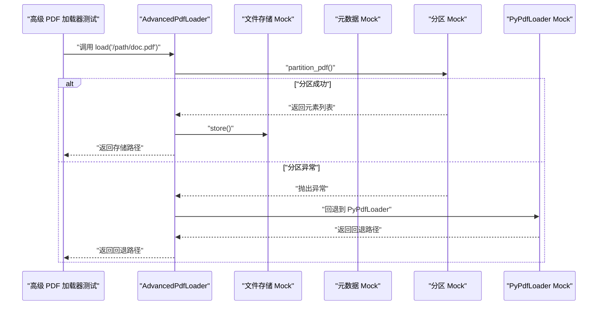
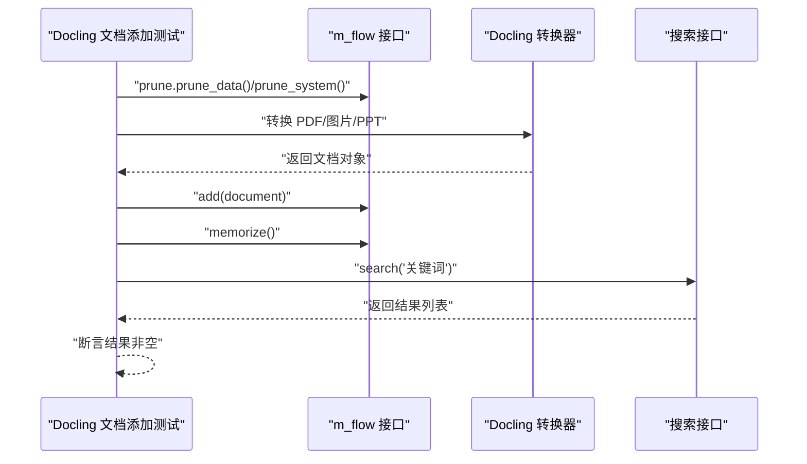
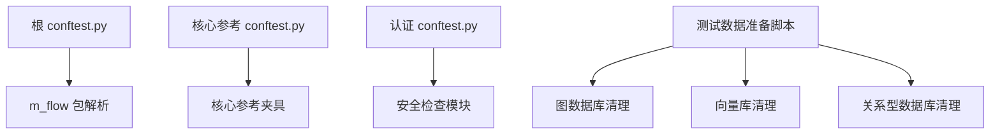

# 测试组织与结构

<cite>
**本文引用的文件**
- [根 conftest.py](file://conftest.py)
- [核心参考测试 conftest.py](file://coreference/tests/conftest.py)
- [认证模块测试 conftest.py](file://m_flow/tests/unit/auth/conftest.py)
- [测试数据准备脚本](file://m_flow/tests/test_data_setup.py)
- [Docling 文档添加测试](file://m_flow/tests/test_add_docling_document.py)
- [高级 PDF 加载器测试](file://m_flow/tests/test_advanced_pdf_loader.py)
</cite>

## 目录
1. [引言](#引言)
2. [项目结构](#项目结构)
3. [核心组件](#核心组件)
4. [架构总览](#架构总览)
5. [详细组件分析](#详细组件分析)
6. [依赖分析](#依赖分析)
7. [性能考虑](#性能考虑)
8. [故障排除指南](#故障排除指南)
9. [结论](#结论)

## 引言
本文件面向 M-flow 项目的测试组织与结构，系统性阐述测试项目的目录布局、命名规范、模块组织方式、测试夹具（fixtures）的使用、pytest 配置文件的作用与选项、测试数据管理策略、测试模块导入规则与测试发现机制，并提供测试组织的最佳实践，帮助开发者高效地编写、维护与扩展测试。

## 项目结构
M-flow 的测试体系采用分层与按功能域划分相结合的方式：
- 根级测试配置：通过根级 conftest.py 确保项目路径与包解析正确，保证测试发现与导入稳定。
- 功能域测试：各子模块（如 coreference、m_flow.auth 等）拥有独立的 conftest.py，提供该域内的共享夹具与测试前置。
- 测试数据管理：提供独立的测试数据准备与清理脚本，支持隔离运行与并行测试。
- 具体测试用例：分布在 unit、integration、e2e 等层级目录中，遵循命名规范与参数化策略。

**图表来源**
- [根 conftest.py:1-54](file://conftest.py#L1-L54)
- [核心参考测试 conftest.py:1-47](file://coreference/tests/conftest.py#L1-L47)
- [认证模块测试 conftest.py:1-55](file://m_flow/tests/unit/auth/conftest.py#L1-L55)
- [测试数据准备脚本:1-255](file://m_flow/tests/test_data_setup.py#L1-L255)
- [高级 PDF 加载器测试:1-101](file://m_flow/tests/test_advanced_pdf_loader.py#L1-L101)
- [Docling 文档添加测试:1-48](file://m_flow/tests/test_add_docling_document.py#L1-L48)

**章节来源**
- [根 conftest.py:1-54](file://conftest.py#L1-L54)
- [核心参考测试 conftest.py:1-47](file://coreference/tests/conftest.py#L1-L47)
- [认证模块测试 conftest.py:1-55](file://m_flow/tests/unit/auth/conftest.py#L1-L55)
- [测试数据准备脚本:1-255](file://m_flow/tests/test_data_setup.py#L1-L255)
- [高级 PDF 加载器测试:1-101](file://m_flow/tests/test_advanced_pdf_loader.py#L1-L101)
- [Docling 文档添加测试:1-48](file://m_flow/tests/test_add_docling_document.py#L1-L48)

## 核心组件
- 根级 pytest 配置与路径解析：确保项目根目录加入 sys.path，并在早期钩子中预导入并校验 m_flow 包的加载位置，避免测试收集阶段出现路径解析问题。
- 功能域夹具：在各功能域的 conftest.py 中定义会话级或测试级夹具，减少重复初始化成本，提升测试执行效率。
- 测试数据生命周期管理：提供测试数据准备、清理与验证工具，支持多数据源（图数据库、向量库、关系型数据库）的统一清理策略。
- 测试用例类型：包含单元测试（参数化、异步）、集成测试（外部库/服务）、端到端测试（真实文档处理）等。

**章节来源**
- [根 conftest.py:18-48](file://conftest.py#L18-L48)
- [核心参考测试 conftest.py:15-46](file://coreference/tests/conftest.py#L15-L46)
- [认证模块测试 conftest.py:14-54](file://m_flow/tests/unit/auth/conftest.py#L14-L54)
- [测试数据准备脚本:54-106](file://m_flow/tests/test_data_setup.py#L54-L106)

## 架构总览
下图展示了测试组织的整体架构：从根级配置到功能域夹具，再到测试数据管理与具体测试用例之间的关系。

**图表来源**
- [根 conftest.py:1-54](file://conftest.py#L1-L54)
- [核心参考测试 conftest.py:1-47](file://coreference/tests/conftest.py#L1-L47)
- [认证模块测试 conftest.py:1-55](file://m_flow/tests/unit/auth/conftest.py#L1-L55)
- [测试数据准备脚本:1-255](file://m_flow/tests/test_data_setup.py#L1-L255)
- [高级 PDF 加载器测试:1-101](file://m_flow/tests/test_advanced_pdf_loader.py#L1-L101)
- [Docling 文档添加测试:1-48](file://m_flow/tests/test_add_docling_document.py#L1-L48)

## 详细组件分析

### 根级 pytest 配置与路径解析
- 作用：在 pytest 最早可执行钩子中，确保项目根目录被加入 sys.path，并预导入 m_flow 包以校验其加载路径，防止测试收集阶段出现包解析错误。
- 关键点：
  - 在 pytest_configure 钩子中执行路径注入与包校验。
  - 若检测到包加载路径不正确，会清理相关模块缓存并重新导入，确保后续测试使用的是仓库内 m_flow。
  - 会话结束时打印清理信息，便于调试与监控。

**图表来源**
- [根 conftest.py:18-48](file://conftest.py#L18-L48)

**章节来源**
- [根 conftest.py:18-48](file://conftest.py#L18-L48)

### 功能域夹具：核心参考测试
- 作用：为核心参考（中文/英文指代消解）测试提供会话级与测试级夹具，避免昂贵初始化的重复开销。
- 夹具类型：
  - zh_resolver/fresh_zh_resolver：中文指代消解器（会话级/每次测试重置）。
  - en_resolver：英文指代消解器（会话级）。
  - tokenizer：中文分词器（会话级）。
- 使用场景：在测试函数中通过参数注入这些夹具，实现稳定的测试上下文。

**图表来源**
- [核心参考测试 conftest.py:15-46](file://coreference/tests/conftest.py#L15-L46)

**章节来源**
- [核心参考测试 conftest.py:15-46](file://coreference/tests/conftest.py#L15-L46)

### 功能域夹具：认证模块
- 作用：在认证模块测试中，通过动态加载与模拟依赖，确保安全检查模块可被正确导入与使用，同时避免真实依赖导致的测试不稳定。
- 实现要点：
  - 使用 types.ModuleType 动态创建模拟模块树（m_flow → m_flow.shared → m_flow.auth 等）。
  - 使用 importlib.util.spec_from_file_location 定位并加载实际的安全检查模块，注册到 sys.modules。
  - 在 conftest 加载时即完成模块加载，供测试使用。

**图表来源**
- [认证模块测试 conftest.py:14-54](file://m_flow/tests/unit/auth/conftest.py#L14-L54)

**章节来源**
- [认证模块测试 conftest.py:14-54](file://m_flow/tests/unit/auth/conftest.py#L14-L54)

### 测试数据管理策略
- 目标：提供可隔离、可清理、可验证的测试数据环境，支持并行测试与多数据源清理。
- 关键能力：
  - 生成唯一测试运行 ID，用于数据集命名前缀隔离。
  - 统一创建基础数据集（basic、edge、performance），并执行 memorize 处理。
  - 支持按运行 ID 或全量模式清理测试数据，覆盖图数据库、向量库与关系型数据库。
  - 提供验证接口，统计测试数据集数量，判断环境状态。
- 数据源覆盖：图数据库（节点删除）、向量库（按数据集删除）、关系型数据库（删除数据集记录）。

**图表来源**
- [测试数据准备脚本:26-106](file://m_flow/tests/test_data_setup.py#L26-L106)
- [测试数据准备脚本:109-189](file://m_flow/tests/test_data_setup.py#L109-L189)
- [测试数据准备脚本:191-223](file://m_flow/tests/test_data_setup.py#L191-L223)

**章节来源**
- [测试数据准备脚本:26-106](file://m_flow/tests/test_data_setup.py#L26-L106)
- [测试数据准备脚本:109-189](file://m_flow/tests/test_data_setup.py#L109-L189)
- [测试数据准备脚本:191-223](file://m_flow/tests/test_data_setup.py#L191-L223)

### 测试用例示例：高级 PDF 加载器
- 参数化测试：使用 pytest.mark.parametrize 对不同文件扩展名与 MIME 类型进行组合测试，验证 can_handle 行为。
- 异步测试：使用 @pytest.mark.asyncio 编写异步测试，覆盖主流程与异常回退逻辑。
- Mock 与 Patch：对文件存储、元数据获取、PDF 分区与加载器进行 Mock，确保测试可控且可重复。
- 流程验证：断言分区成功调用、PyPdfLoader 回退调用次数与返回值，确保异常场景下的健壮性。

**图表来源**
- [高级 PDF 加载器测试:48-78](file://m_flow/tests/test_advanced_pdf_loader.py#L48-L78)
- [高级 PDF 加载器测试:81-100](file://m_flow/tests/test_advanced_pdf_loader.py#L81-L100)

**章节来源**
- [高级 PDF 加载器测试:34-45](file://m_flow/tests/test_advanced_pdf_loader.py#L34-L45)
- [高级 PDF 加载器测试:48-78](file://m_flow/tests/test_advanced_pdf_loader.py#L48-L78)
- [高级 PDF 加载器测试:81-100](file://m_flow/tests/test_advanced_pdf_loader.py#L81-L100)

### 测试用例示例：Docling 文档添加
- 端到端验证：清理系统与数据后，使用 Docling 转换多种格式文档（PDF、图片、PPT），添加到系统并执行 memorize。
- 搜索验证：通过关键词搜索验证知识抽取与索引效果，断言返回结果非空。
- 异步执行：测试主体以异步协程运行，符合系统异步设计。

**图表来源**
- [Docling 文档添加测试:14-44](file://m_flow/tests/test_add_docling_document.py#L14-L44)

**章节来源**
- [Docling 文档添加测试:14-44](file://m_flow/tests/test_add_docling_document.py#L14-L44)

## 依赖分析
- 根级配置对全局路径与包解析的影响：确保所有测试模块均可正确导入 m_flow 及其子模块，避免路径差异导致的测试失败。
- 功能域配置对测试上下文的影响：通过会话级夹具减少初始化成本；通过模拟模块加载保障认证相关测试的稳定性。
- 测试数据脚本对多数据源的依赖：依赖图数据库查询、向量库删除接口与关系型数据库 ORM 操作，形成跨系统的清理闭环。

**图表来源**
- [根 conftest.py:18-48](file://conftest.py#L18-L48)
- [核心参考测试 conftest.py:15-46](file://coreference/tests/conftest.py#L15-L46)
- [认证模块测试 conftest.py:14-54](file://m_flow/tests/unit/auth/conftest.py#L14-L54)
- [测试数据准备脚本:118-189](file://m_flow/tests/test_data_setup.py#L118-L189)

**章节来源**
- [根 conftest.py:18-48](file://conftest.py#L18-L48)
- [核心参考测试 conftest.py:15-46](file://coreference/tests/conftest.py#L15-L46)
- [认证模块测试 conftest.py:14-54](file://m_flow/tests/unit/auth/conftest.py#L14-L54)
- [测试数据准备脚本:118-189](file://m_flow/tests/test_data_setup.py#L118-L189)

## 性能考虑
- 夹具作用域选择：优先使用会话级夹具承载昂贵初始化（如模型、适配器），在单次测试会话内复用，降低测试总耗时。
- 异步测试：充分利用异步 I/O 与并发，减少等待时间；在参数化测试中合理拆分用例，避免单条用例过长。
- 数据隔离与清理：通过唯一运行 ID 与前缀命名实现并行测试隔离；清理脚本按数据源分别处理，避免遗漏与冗余操作。
- Mock 策略：对外部依赖进行精准 Mock，减少真实 I/O 与网络请求，提高测试稳定性与速度。

## 故障排除指南
- 包路径解析失败：确认根级 conftest.py 已将项目根目录加入 sys.path，并在 pytest_configure 钩子中预导入并校验 m_flow 包路径。
- 认证模块导入异常：检查认证域 conftest.py 是否正确创建模拟模块树并加载安全检查模块，确保 sys.modules 注册顺序正确。
- 测试数据清理不彻底：核对清理脚本对图数据库、向量库与关系型数据库的调用是否成功；关注异常分支与事务提交。
- 参数化测试用例失败：检查参数组合与断言条件，确保每个分支都有对应的断言与 Mock 配置。

**章节来源**
- [根 conftest.py:18-48](file://conftest.py#L18-L48)
- [认证模块测试 conftest.py:14-54](file://m_flow/tests/unit/auth/conftest.py#L14-L54)
- [测试数据准备脚本:153-189](file://m_flow/tests/test_data_setup.py#L153-L189)

## 结论
M-flow 的测试组织以“根级配置 + 功能域夹具 + 数据生命周期管理 + 多类型测试用例”为核心，既保证了测试的稳定性与可维护性，又兼顾了性能与可扩展性。通过规范化的命名、参数化与夹具复用，以及完善的测试数据准备与清理策略，能够有效支撑单元、集成与端到端测试的协同工作，为持续交付与质量保障提供坚实基础。