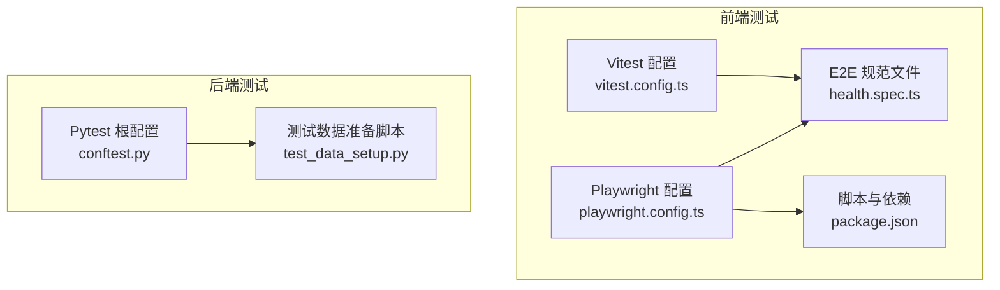
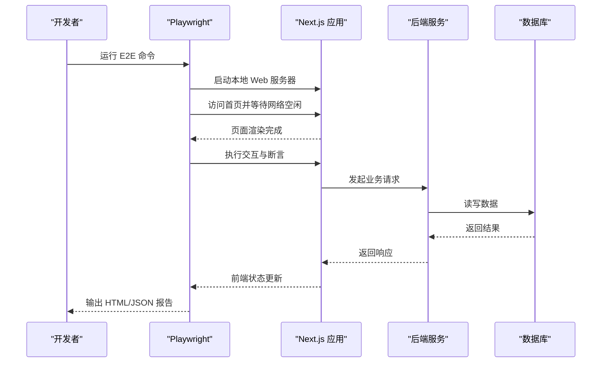
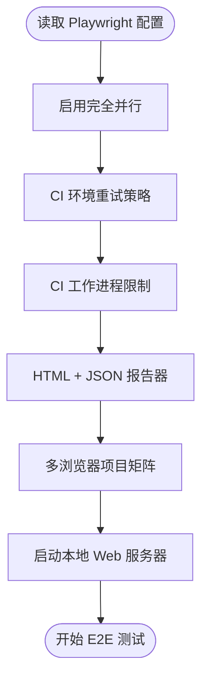
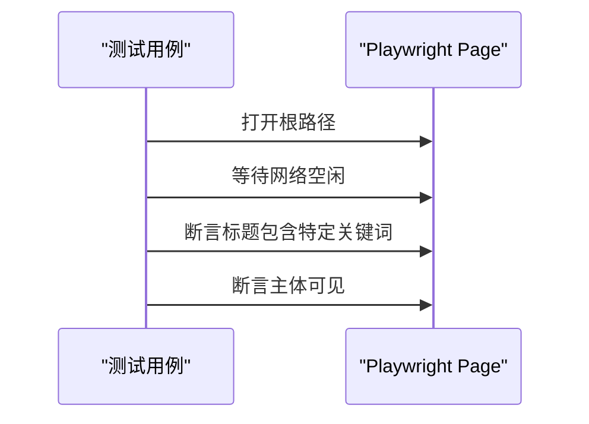
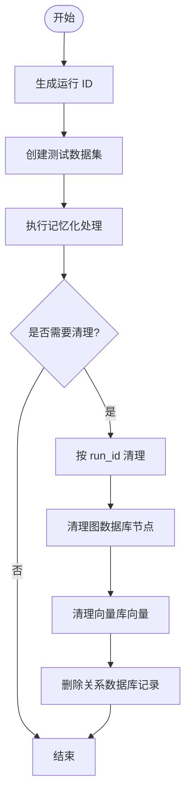
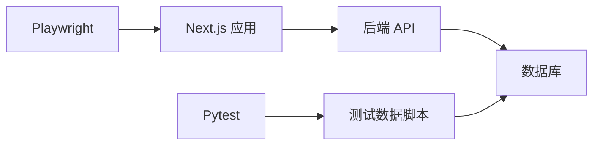

# 端到端测试指南

<cite>
**本文引用的文件**
- [playwright.config.ts](file://m_flow-frontend/playwright.config.ts)
- [package.json](file://m_flow-frontend/package.json)
- [vitest.config.ts](file://m_flow-frontend/vitest.config.ts)
- [health.spec.ts](file://m_flow-frontend/e2e/health.spec.ts)
- [conftest.py](file://conftest.py)
- [test_data_setup.py](file://m_flow/tests/test_data_setup.py)
- [DatabaseConfigStep.tsx](file://m_flow-frontend/src/components/setup/ConfigWizard/steps/DatabaseConfigStep.tsx)
- [EnvFileHelper.tsx](file://m_flow-frontend/src/components/setup/GettingStarted/EnvFileHelper.tsx)
- [setup.ts](file://m_flow-frontend/src/test/setup.ts)
</cite>

## 目录
1. [简介](#简介)
2. [项目结构](#项目结构)
3. [核心组件](#核心组件)
4. [架构总览](#架构总览)
5. [详细组件分析](#详细组件分析)
6. [依赖分析](#依赖分析)
7. [性能考虑](#性能考虑)
8. [故障排查指南](#故障排查指南)
9. [结论](#结论)
10. [附录](#附录)

## 简介
本指南面向希望在 M-flow 项目中编写与维护高质量端到端（E2E）测试的工程师与测试工程师。文档围绕以下目标展开：
- 设计原则：覆盖完整业务流程验证、用户操作路径模拟与系统整体行为测试
- 环境配置：开发服务器启动、数据库准备与前端应用部署
- 复杂场景：数据导入、检索查询、管理操作的完整验证
- 数据管理：测试数据生成、用户权限设置与系统状态初始化
- 示例实践：登录、数据处理、检索查询、系统管理等完整业务场景
- 稳定性与错误处理：重试策略、并行执行、报告与回溯

## 项目结构
M-flow 的 E2E 测试由前端 Playwright 与后端 pytest 共同支撑，形成“前端 UI 层 + 后端服务层”的双栈测试体系。前端通过 Playwright 在真实浏览器中驱动 UI 行为；后端通过 pytest 提供测试夹具与数据准备工具。

图表来源
- [playwright.config.ts:1-47](file://m_flow-frontend/playwright.config.ts#L1-L47)
- [health.spec.ts:1-20](file://m_flow-frontend/e2e/health.spec.ts#L1-L20)
- [vitest.config.ts:1-32](file://m_flow-frontend/vitest.config.ts#L1-L32)
- [package.json:1-65](file://m_flow-frontend/package.json#L1-L65)
- [conftest.py:1-54](file://conftest.py#L1-L54)
- [test_data_setup.py:1-255](file://m_flow/tests/test_data_setup.py#L1-L255)

章节来源
- [playwright.config.ts:1-47](file://m_flow-frontend/playwright.config.ts#L1-L47)
- [package.json:1-65](file://m_flow-frontend/package.json#L1-L65)
- [vitest.config.ts:1-32](file://m_flow-frontend/vitest.config.ts#L1-L32)
- [conftest.py:1-54](file://conftest.py#L1-L54)
- [test_data_setup.py:1-255](file://m_flow/tests/test_data_setup.py#L1-L255)

## 核心组件
- Playwright 前端 E2E：负责浏览器自动化、页面导航、交互与断言
- Vitest 单元测试：负责组件级与逻辑单元的快速反馈
- Pytest 后端夹具：负责测试环境初始化、数据库与数据准备
- 测试数据脚本：提供隔离的测试数据集、清理与校验能力

章节来源
- [playwright.config.ts:1-47](file://m_flow-frontend/playwright.config.ts#L1-L47)
- [health.spec.ts:1-20](file://m_flow-frontend/e2e/health.spec.ts#L1-L20)
- [vitest.config.ts:1-32](file://m_flow-frontend/vitest.config.ts#L1-L32)
- [conftest.py:1-54](file://conftest.py#L1-L54)
- [test_data_setup.py:1-255](file://m_flow/tests/test_data_setup.py#L1-L255)

## 架构总览
下图展示了 E2E 测试从启动到执行的关键路径：Playwright 启动 Next.js 开发服务器，加载前端页面，执行测试规范，并通过后端接口验证业务行为。

图表来源
- [playwright.config.ts:40-46](file://m_flow-frontend/playwright.config.ts#L40-L46)
- [health.spec.ts:3-18](file://m_flow-frontend/e2e/health.spec.ts#L3-L18)

章节来源
- [playwright.config.ts:1-47](file://m_flow-frontend/playwright.config.ts#L1-L47)
- [health.spec.ts:1-20](file://m_flow-frontend/e2e/health.spec.ts#L1-L20)

## 详细组件分析

### Playwright 配置与项目矩阵
- 并行与重试：启用完全并行、CI 下重试与受限工作进程
- 报告器：HTML 与 JSON 报告输出，便于 CI 分析
- 多设备项目：桌面与移动端浏览器矩阵，提升兼容性覆盖
- Web 服务器：自动启动本地开发服务器，复用已有实例以加速 CI

图表来源
- [playwright.config.ts:5-46](file://m_flow-frontend/playwright.config.ts#L5-L46)

章节来源
- [playwright.config.ts:1-47](file://m_flow-frontend/playwright.config.ts#L1-L47)

### 健康检查与基础断言
- 页面加载与标题断言：验证首页可访问与标题匹配
- 导航与可访问性：等待网络空闲后断言页面主体可见

图表来源
- [health.spec.ts:4-18](file://m_flow-frontend/e2e/health.spec.ts#L4-L18)

章节来源
- [health.spec.ts:1-20](file://m_flow-frontend/e2e/health.spec.ts#L1-L20)

### Vitest 配置与前端测试环境
- 环境：jsdom，便于 DOM 操作与组件测试
- 覆盖率：开启 v8 覆盖率，输出多种格式
- 别名：@ 指向 src，简化导入路径
- 排除：排除 e2e 目录，避免与 Playwright 冲突

章节来源
- [vitest.config.ts:1-32](file://m_flow-frontend/vitest.config.ts#L1-L32)

### Pytest 根配置与包路径修复
- 早期钩子：在测试收集前修正 Python 路径，确保正确加载 m_flow 包
- 强制重载：当包路径不正确时，清理模块缓存并重新导入
- 会话收尾：打印清理信息，便于调试

章节来源
- [conftest.py:18-54](file://conftest.py#L18-L54)

### 测试数据准备与清理
- 运行 ID：生成带时间戳与 UUID 的唯一标识，支持并行隔离
- 数据集命名：基于 run_id 生成 test_{run_id}_<name>，避免冲突
- 数据准备：批量创建测试数据集并执行记忆化处理
- 清理策略：按 run_id 或前缀模式清理，依次清理图数据库、向量库与关系数据库记录
- 校验机制：统计测试数据集数量，验证准备结果

图表来源
- [test_data_setup.py:54-107](file://m_flow/tests/test_data_setup.py#L54-L107)
- [test_data_setup.py:109-189](file://m_flow/tests/test_data_setup.py#L109-L189)
- [test_data_setup.py:191-224](file://m_flow/tests/test_data_setup.py#L191-L224)

章节来源
- [test_data_setup.py:1-255](file://m_flow/tests/test_data_setup.py#L1-L255)

### 数据库与环境变量配置
- 关系与图数据库：通过环境变量配置，本地默认 SQLite + Kuzu
- 环境文件：建议在项目根目录创建 .env，重启服务后生效
- 注意事项：不要将 .env 提交至版本控制

章节来源
- [DatabaseConfigStep.tsx:266-285](file://m_flow-frontend/src/components/setup/ConfigWizard/steps/DatabaseConfigStep.tsx#L266-L285)
- [EnvFileHelper.tsx:443-478](file://m_flow-frontend/src/components/setup/GettingStarted/EnvFileHelper.tsx#L443-L478)

### 前端测试初始化
- 统一导入：jest-dom 与 Vitest 生命周期钩子
- 自动清理：每次测试后清理 DOM，避免泄漏

章节来源
- [setup.ts:1-7](file://m_flow-frontend/src/test/setup.ts#L1-L7)

## 依赖分析
- Playwright 与 Next.js：通过 webServer 字段自动启动前端开发服务器
- 报告与 CI：HTML 与 JSON 报告器便于 CI 平台集成
- 前后端解耦：前端 E2E 与后端数据准备脚本相互独立，通过接口与数据库交互

图表来源
- [playwright.config.ts:40-46](file://m_flow-frontend/playwright.config.ts#L40-L46)
- [test_data_setup.py:109-189](file://m_flow/tests/test_data_setup.py#L109-L189)

章节来源
- [playwright.config.ts:1-47](file://m_flow-frontend/playwright.config.ts#L1-L47)
- [test_data_setup.py:1-255](file://m_flow/tests/test_data_setup.py#L1-L255)

## 性能考虑
- 并行执行：启用 fullyParallel 与多项目矩阵，缩短回归时间
- 重试策略：CI 环境下自动重试，降低偶发失败影响
- 服务器复用：reuseExistingServer 避免重复启动，提升 CI 效率
- 覆盖率与报告：合理配置覆盖率与报告器，平衡精度与性能

## 故障排查指南
- 服务器启动失败：检查 webServer 命令与端口占用，确认本地开发环境可用
- 页面加载超时：适当增加等待策略或调整网络空闲判断
- 数据准备异常：核对环境变量与数据库连接，确认测试数据脚本运行日志
- 报告缺失：检查 reporter 配置与输出目录权限
- 模块路径问题：确保 pytest 钩子正确修正 m_flow 包路径

章节来源
- [playwright.config.ts:40-46](file://m_flow-frontend/playwright.config.ts#L40-L46)
- [conftest.py:18-54](file://conftest.py#L18-L54)
- [test_data_setup.py:64-68](file://m_flow/tests/test_data_setup.py#L64-L68)

## 结论
通过 Playwright 与 Vitest 的组合，配合 Pytest 的环境与数据准备能力，M-flow 能够建立稳定、可扩展的端到端测试体系。遵循本文的设计原则与最佳实践，可在保证测试质量的同时显著提升回归效率。

## 附录

### 环境配置步骤
- 启动前端开发服务器：使用 Playwright 的 webServer 自动启动
- 设置环境变量：在项目根目录创建 .env 文件，配置数据库与 LLM 等关键变量
- 启动后端服务：确保后端监听端口与前端一致
- 运行 E2E：执行 Playwright 测试命令，查看 HTML/JSON 报告

章节来源
- [playwright.config.ts:40-46](file://m_flow-frontend/playwright.config.ts#L40-L46)
- [EnvFileHelper.tsx:443-478](file://m_flow-frontend/src/components/setup/GettingStarted/EnvFileHelper.tsx#L443-L478)

### 测试数据管理策略
- 生成：使用测试数据脚本创建隔离数据集，支持批量准备
- 初始化：在测试前置中调用准备函数，确保状态一致
- 清理：测试后按 run_id 或前缀清理，避免污染
- 校验：通过统计数量验证数据完整性

章节来源
- [test_data_setup.py:54-107](file://m_flow/tests/test_data_setup.py#L54-L107)
- [test_data_setup.py:109-189](file://m_flow/tests/test_data_setup.py#L109-L189)
- [test_data_setup.py:191-224](file://m_flow/tests/test_data_setup.py#L191-L224)

### 典型测试场景示例（路径指引）
- 用户登录：在 Playwright 中打开登录页，输入凭据并断言跳转
- 数据导入：触发上传流程，断言数据集创建与处理完成
- 检索查询：输入查询词，断言返回结果与上下文
- 系统管理：进入管理面板，断言权限与操作按钮可用

说明：以上场景为通用设计思路，具体实现请参考 Playwright 规范与后端接口定义。