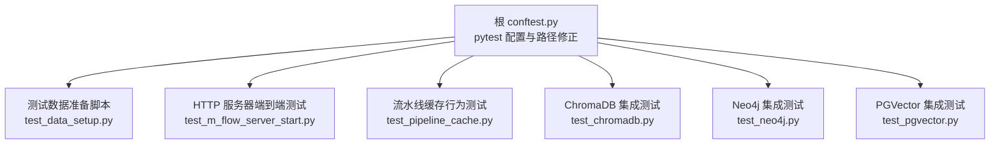
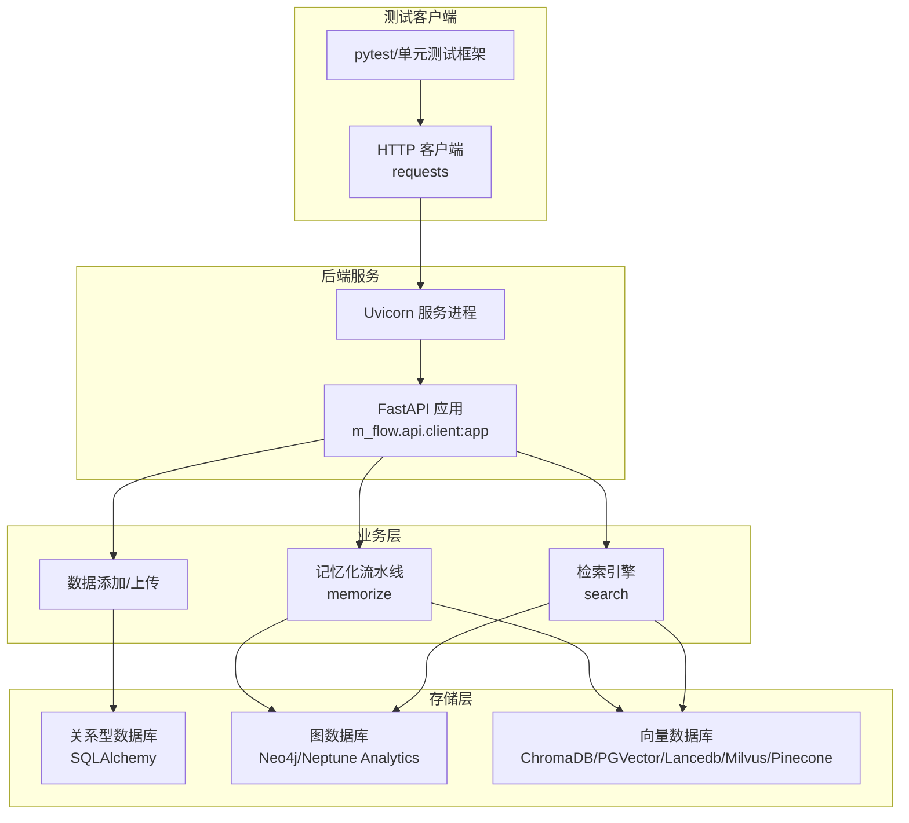
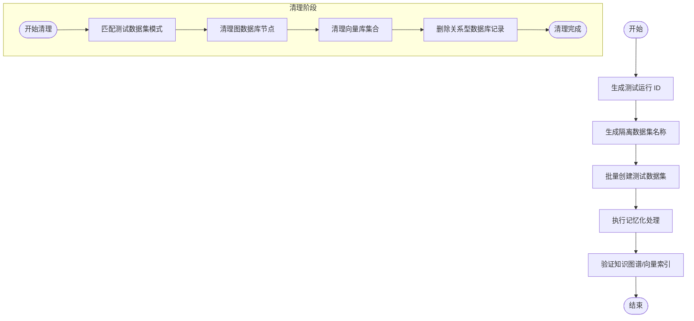
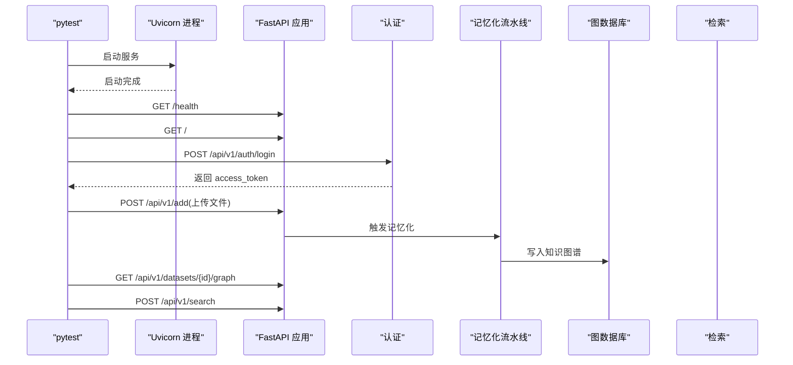
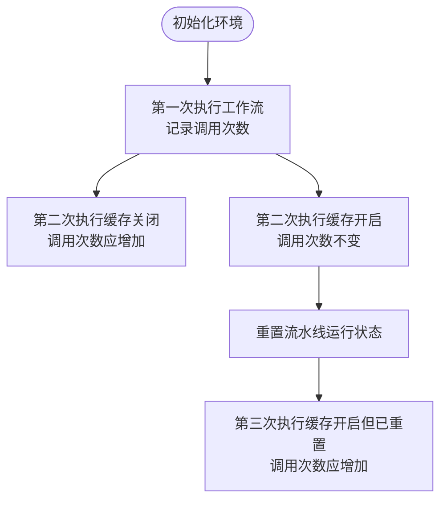
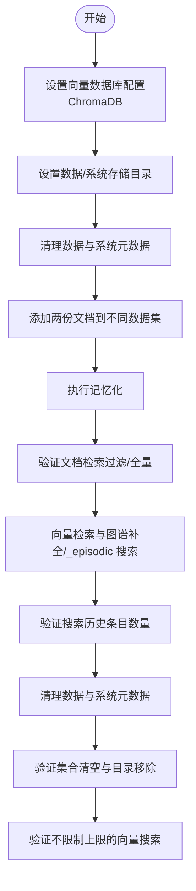
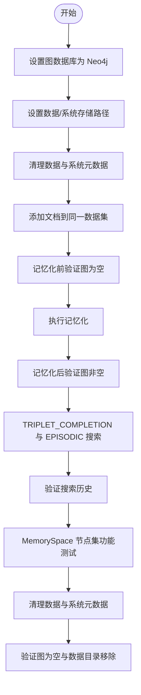
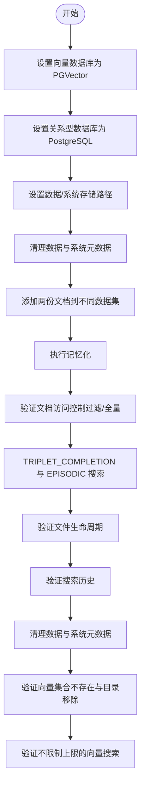
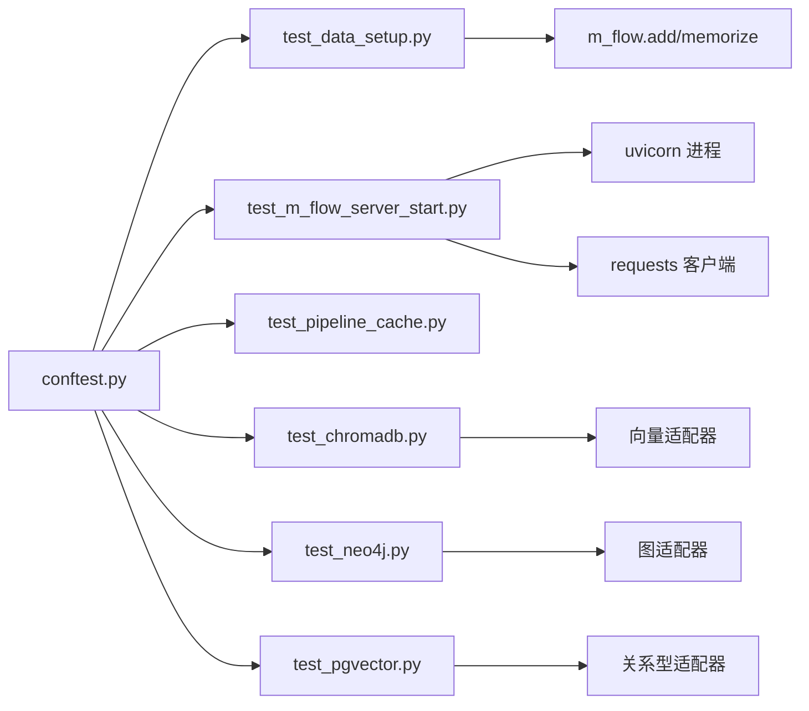

# 集成测试指南

<cite>
**本文引用的文件**
- [conftest.py](file://conftest.py)
- [m_flow/tests/test_data_setup.py](file://m_flow/tests/test_data_setup.py)
- [m_flow/tests/test_m_flow_server_start.py](file://m_flow/tests/test_m_flow_server_start.py)
- [m_flow/tests/test_pipeline_cache.py](file://m_flow/tests/test_pipeline_cache.py)
- [m_flow/tests/test_chromadb.py](file://m_flow/tests/test_chromadb.py)
- [m_flow/tests/test_neo4j.py](file://m_flow/tests/test_neo4j.py)
- [m_flow/tests/test_pgvector.py](file://m_flow/tests/test_pgvector.py)
</cite>

## 目录
1. [引言](#引言)
2. [项目结构](#项目结构)
3. [核心组件](#核心组件)
4. [架构总览](#架构总览)
5. [详细组件分析](#详细组件分析)
6. [依赖分析](#依赖分析)
7. [性能考虑](#性能考虑)
8. [故障排查指南](#故障排查指南)
9. [结论](#结论)
10. [附录](#附录)

## 引言
本指南面向希望系统性编写 M-flow 集成测试的工程师与测试工程师，围绕以下目标展开：数据库连接测试（图数据库、向量库、关系型数据库）、API 接口测试、模块间交互测试；测试环境搭建（测试数据库配置、测试数据准备与清理、外部服务 Mock）；复杂业务流程测试（数据处理流程、流水线执行、检索系统集成）；测试数据管理策略（生成、清理、验证）；以及性能优化与并发测试技巧。文中结合仓库中现有的端到端与集成测试样例，给出可直接落地的实践路径。

## 项目结构
M-flow 的测试主要分布在根目录与 m_flow/tests 下，采用 pytest 组织方式，并辅以 conftest.py 进行全局配置。现有测试覆盖了：
- 服务器启动与端到端请求链路验证
- 流水线缓存行为验证
- 多种后端适配器的集成测试（ChromaDB、Neo4j、PGVector）
- 测试数据准备与清理工具

图表来源
- [conftest.py:1-54](file://conftest.py#L1-L54)
- [m_flow/tests/test_data_setup.py:1-255](file://m_flow/tests/test_data_setup.py#L1-L255)
- [m_flow/tests/test_m_flow_server_start.py:1-138](file://m_flow/tests/test_m_flow_server_start.py#L1-L138)
- [m_flow/tests/test_pipeline_cache.py:1-132](file://m_flow/tests/test_pipeline_cache.py#L1-L132)
- [m_flow/tests/test_chromadb.py:1-227](file://m_flow/tests/test_chromadb.py#L1-L227)
- [m_flow/tests/test_neo4j.py:1-150](file://m_flow/tests/test_neo4j.py#L1-L150)
- [m_flow/tests/test_pgvector.py:1-231](file://m_flow/tests/test_pgvector.py#L1-L231)

章节来源
- [conftest.py:1-54](file://conftest.py#L1-L54)
- [m_flow/tests/test_data_setup.py:1-255](file://m_flow/tests/test_data_setup.py#L1-L255)

## 核心组件
- 测试数据准备与清理工具：提供测试运行 ID 生成、隔离数据集命名、批量创建/清理/验证测试数据的能力，支持并行测试隔离与幂等执行。
- 服务器端到端测试：通过子进程启动 uvicorn 服务，验证健康检查、根接口、认证、上传、流水线执行、图谱查询与检索等完整链路。
- 流水线缓存行为测试：验证缓存开关与状态重置对执行次数的影响，确保缓存策略正确。
- 向量与图数据库集成测试：分别针对 ChromaDB、Neo4j、PGVector 提供完整的数据生命周期与检索验证，包括访问控制、集合/节点清理、历史记录校验等。

章节来源
- [m_flow/tests/test_data_setup.py:26-255](file://m_flow/tests/test_data_setup.py#L26-L255)
- [m_flow/tests/test_m_flow_server_start.py:27-138](file://m_flow/tests/test_m_flow_server_start.py#L27-L138)
- [m_flow/tests/test_pipeline_cache.py:23-132](file://m_flow/tests/test_pipeline_cache.py#L23-L132)
- [m_flow/tests/test_chromadb.py:125-227](file://m_flow/tests/test_chromadb.py#L125-L227)
- [m_flow/tests/test_neo4j.py:29-150](file://m_flow/tests/test_neo4j.py#L29-L150)
- [m_flow/tests/test_pgvector.py:117-231](file://m_flow/tests/test_pgvector.py#L117-L231)

## 架构总览
下图展示了从客户端到后端服务、再到多后端存储的集成测试架构。测试通过 HTTP 客户端驱动 API，API 将请求路由至业务层，业务层协调数据处理、向量嵌入、图谱写入与检索，最终返回结果。

图表来源
- [m_flow/tests/test_m_flow_server_start.py:30-135](file://m_flow/tests/test_m_flow_server_start.py#L30-L135)

## 详细组件分析

### 测试环境与数据准备
- 测试运行 ID 生成：用于并行测试隔离，避免数据集命名冲突。
- 隔离数据集命名：基于 run_id 生成唯一前缀，确保多实例并行执行互不干扰。
- 数据准备：批量创建基础数据集，执行记忆化处理，验证知识图谱与向量索引构建。
- 数据清理：按 run_id 或通配符清理测试数据集，同步清理图数据库节点与向量库集合，最后删除关系型数据库记录。
- 数据验证：统计测试数据集数量，确保测试前置条件满足。

图表来源
- [m_flow/tests/test_data_setup.py:54-107](file://m_flow/tests/test_data_setup.py#L54-L107)
- [m_flow/tests/test_data_setup.py:109-189](file://m_flow/tests/test_data_setup.py#L109-L189)
- [m_flow/tests/test_data_setup.py:191-224](file://m_flow/tests/test_data_setup.py#L191-L224)

章节来源
- [m_flow/tests/test_data_setup.py:26-52](file://m_flow/tests/test_data_setup.py#L26-L52)
- [m_flow/tests/test_data_setup.py:54-107](file://m_flow/tests/test_data_setup.py#L54-L107)
- [m_flow/tests/test_data_setup.py:109-189](file://m_flow/tests/test_data_setup.py#L109-L189)
- [m_flow/tests/test_data_setup.py:191-224](file://m_flow/tests/test_data_setup.py#L191-L224)

### 服务器端到端测试
- 子进程启动 uvicorn 服务，等待启动完成并进行健康检查。
- 认证流程：使用默认凭据登录，获取 Bearer Token。
- 端到端链路：添加数据（上传文件）、执行记忆化、列出数据集、查询图谱、发起检索。
- 超时与错误处理：为不同阶段设置合理超时，异常时打印错误输出并抛出异常。

图表来源
- [m_flow/tests/test_m_flow_server_start.py:30-135](file://m_flow/tests/test_m_flow_server_start.py#L30-L135)

章节来源
- [m_flow/tests/test_m_flow_server_start.py:27-138](file://m_flow/tests/test_m_flow_server_start.py#L27-L138)

### 流水线缓存行为测试
- 目标：验证缓存开关与状态重置对执行次数的影响。
- 方法：自定义跟踪任务记录调用次数；关闭缓存时重复执行应增加调用次数；开启缓存时应跳过；重置状态后应再次执行。
- 环境准备：清理数据与系统元数据、重建数据库表，保证测试一致性。

图表来源
- [m_flow/tests/test_pipeline_cache.py:43-78](file://m_flow/tests/test_pipeline_cache.py#L43-L78)
- [m_flow/tests/test_pipeline_cache.py:80-132](file://m_flow/tests/test_pipeline_cache.py#L80-L132)

章节来源
- [m_flow/tests/test_pipeline_cache.py:23-132](file://m_flow/tests/test_pipeline_cache.py#L23-L132)

### ChromaDB 集成测试
- 目标：验证向量存储与检索、集合管理与清理、与记忆化流水线的集成、不同召回模式下的搜索。
- 关键点：禁用后端访问控制以适配 ChromaDB 的无数据集分区特性；准备两份文档，执行记忆化；验证文档检索过滤与不限制上限的搜索；清理后确认集合清空与数据目录移除。

图表来源
- [m_flow/tests/test_chromadb.py:125-221](file://m_flow/tests/test_chromadb.py#L125-L221)

章节来源
- [m_flow/tests/test_chromadb.py:125-227](file://m_flow/tests/test_chromadb.py#L125-L227)

### Neo4j 集成测试
- 目标：验证 Neo4j 作为图数据库后端的存储与检索、知识图谱构建、多模式搜索、MemorySpace 节点集功能、完整清理验证。
- 关键点：在记忆化前后验证图为空/非空；执行 TRIPLET_COMPLETION 与 EPISODIC 搜索；验证搜索历史；测试 MemorySpace 节点集存在与缺失的行为；清理后验证图为空与数据目录移除。

图表来源
- [m_flow/tests/test_neo4j.py:29-144](file://m_flow/tests/test_neo4j.py#L29-L144)

章节来源
- [m_flow/tests/test_neo4j.py:29-150](file://m_flow/tests/test_neo4j.py#L29-L150)

### PGVector 集成测试
- 目标：验证 PostgreSQL + pgvector 的向量存储与相似度检索、与关系型数据库的集成、多模式搜索、数据生命周期与清理。
- 关键点：配置向量与关系型数据库；准备两份文档；验证文档访问控制（按数据集过滤/全量）；执行 TRIPLET_COMPLETION 与 EPISODIC 搜索；验证文件生命周期（内部生成文件随实体删除、外部文件保留）；清理后验证集合不存在与数据目录移除；验证不限制上限的向量搜索。

图表来源
- [m_flow/tests/test_pgvector.py:117-224](file://m_flow/tests/test_pgvector.py#L117-L224)

章节来源
- [m_flow/tests/test_pgvector.py:117-231](file://m_flow/tests/test_pgvector.py#L117-L231)

## 依赖分析
- 全局配置：根 conftest.py 确保项目根路径加入 sys.path，避免测试收集阶段的包解析问题。
- 测试数据准备：依赖 m_flow 的 add、memorize 与适配器（图/向量/关系型），通过统一的清理与验证函数实现幂等。
- 服务器端到端：依赖 uvicorn 子进程与 requests 客户端，覆盖健康检查、认证、上传、记忆化、图查询与检索。
- 向量/图数据库：各后端测试独立配置，验证各自特性（如 ChromaDB 的无数据集分区、Neo4j 的节点集 MemorySpace、PGVector 的关系型集成）。

图表来源
- [conftest.py:18-54](file://conftest.py#L18-L54)
- [m_flow/tests/test_data_setup.py:61-104](file://m_flow/tests/test_data_setup.py#L61-L104)
- [m_flow/tests/test_m_flow_server_start.py:32-109](file://m_flow/tests/test_m_flow_server_start.py#L32-L109)
- [m_flow/tests/test_chromadb.py:134-140](file://m_flow/tests/test_chromadb.py#L134-L140)
- [m_flow/tests/test_neo4j.py:36-44](file://m_flow/tests/test_neo4j.py#L36-L44)
- [m_flow/tests/test_pgvector.py:124-143](file://m_flow/tests/test_pgvector.py#L124-L143)

章节来源
- [conftest.py:18-54](file://conftest.py#L18-L54)
- [m_flow/tests/test_data_setup.py:61-104](file://m_flow/tests/test_data_setup.py#L61-L104)
- [m_flow/tests/test_m_flow_server_start.py:32-109](file://m_flow/tests/test_m_flow_server_start.py#L32-L109)

## 性能考虑
- 并发与隔离：通过测试运行 ID 与隔离数据集命名，支持多实例并行执行，避免资源竞争。
- 超时设置：为不同阶段设置合理的请求超时，避免单点阻塞影响整体测试进度。
- 缓存策略：利用流水线缓存行为测试，验证缓存开启/关闭与状态重置对执行次数的影响，有助于定位性能瓶颈与重复计算问题。
- 无限制搜索：在向量检索中验证不限制上限的行为，避免默认限制导致的性能误判或结果偏差。

章节来源
- [m_flow/tests/test_data_setup.py:26-52](file://m_flow/tests/test_data_setup.py#L26-L52)
- [m_flow/tests/test_m_flow_server_start.py:20-25](file://m_flow/tests/test_m_flow_server_start.py#L20-L25)
- [m_flow/tests/test_pipeline_cache.py:43-78](file://m_flow/tests/test_pipeline_cache.py#L43-L78)
- [m_flow/tests/test_chromadb.py:115-123](file://m_flow/tests/test_chromadb.py#L115-L123)
- [m_flow/tests/test_pgvector.py:97-105](file://m_flow/tests/test_pgvector.py#L97-L105)

## 故障排查指南
- 服务器启动失败：检查子进程启动日志输出，确认端口占用与依赖可用性；适当延长启动等待时间。
- 认证失败：核对默认用户名/密码配置，确保认证接口返回有效 token。
- 数据集不存在：确认测试数据准备脚本已成功创建数据集并执行记忆化；使用验证函数检查测试数据集数量。
- 向量/图清理不彻底：检查清理逻辑是否按数据集 ID 匹配；确认图数据库与向量库的删除接口可用；清理后再次验证。
- 文件生命周期异常：内部生成文件应在删除数据实体时一并删除，外部文件不应被删除；通过哈希/URI 标识定位记录并验证。

章节来源
- [m_flow/tests/test_m_flow_server_start.py:47-51](file://m_flow/tests/test_m_flow_server_start.py#L47-L51)
- [m_flow/tests/test_m_flow_server_start.py:63-68](file://m_flow/tests/test_m_flow_server_start.py#L63-L68)
- [m_flow/tests/test_data_setup.py:191-224](file://m_flow/tests/test_data_setup.py#L191-L224)
- [m_flow/tests/test_chromadb.py:28-70](file://m_flow/tests/test_chromadb.py#L28-L70)
- [m_flow/tests/test_pgvector.py:28-62](file://m_flow/tests/test_pgvector.py#L28-L62)

## 结论
本指南基于仓库现有测试样例，总结了 M-flow 集成测试的关键策略与实践路径：以测试数据准备脚本为核心，结合服务器端到端测试、流水线缓存行为测试与多后端适配器集成测试，形成覆盖数据库连接、API 接口与模块交互的完整测试体系。通过隔离命名、幂等清理与历史记录验证，确保测试稳定性与可重复性；通过超时与缓存策略，提升测试性能与可维护性。

## 附录
- 测试数据准备脚本命令
  - 准备测试数据：python -m m_flow.tests.test_data_setup
  - 清理测试数据：python -m m_flow.tests.test_data_setup cleanup
  - 验证测试数据：python -m m_flow.tests.test_data_setup verify
  - 获取测试运行 ID：python -m m_flow.tests.test_data_setup --get-run-id
- 服务器端到端测试
  - 使用默认凭据登录，随后依次执行健康检查、根接口、上传、记忆化、图查询与检索。
- 流水线缓存行为
  - 关闭缓存：重复执行应增加调用次数
  - 开启缓存：重复执行应保持调用次数不变
  - 重置状态：再次执行应增加调用次数
- 向量/图数据库集成
  - ChromaDB：禁用后端访问控制，验证检索与集合清理
  - Neo4j：验证节点集 MemorySpace 功能与清理
  - PGVector：验证关系型与向量集成、文件生命周期与清理

章节来源
- [m_flow/tests/test_data_setup.py:226-255](file://m_flow/tests/test_data_setup.py#L226-L255)
- [m_flow/tests/test_m_flow_server_start.py:70-135](file://m_flow/tests/test_m_flow_server_start.py#L70-L135)
- [m_flow/tests/test_pipeline_cache.py:43-132](file://m_flow/tests/test_pipeline_cache.py#L43-L132)
- [m_flow/tests/test_chromadb.py:134-221](file://m_flow/tests/test_chromadb.py#L134-L221)
- [m_flow/tests/test_neo4j.py:109-144](file://m_flow/tests/test_neo4j.py#L109-L144)
- [m_flow/tests/test_pgvector.py:124-224](file://m_flow/tests/test_pgvector.py#L124-L224)