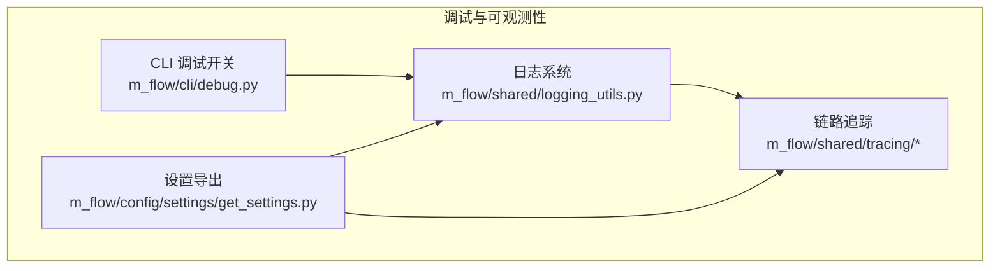
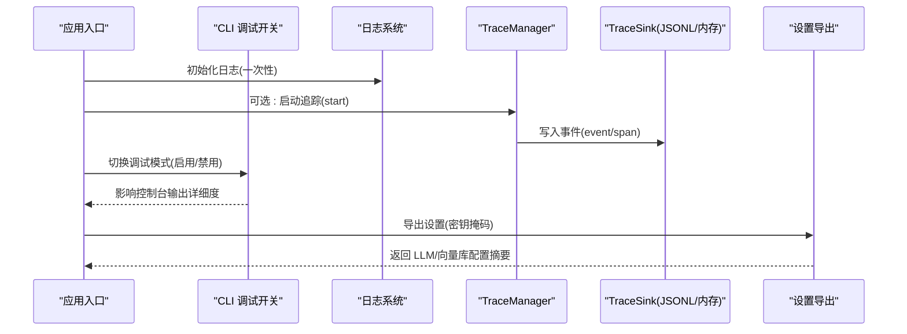
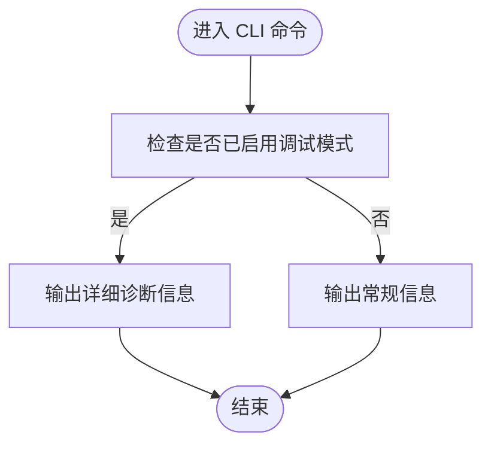
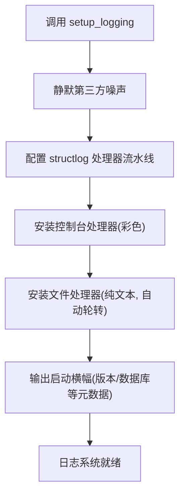
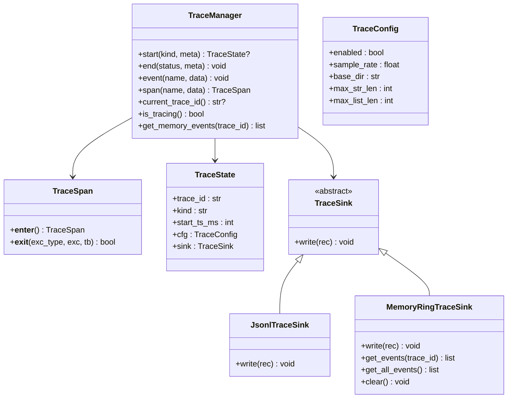
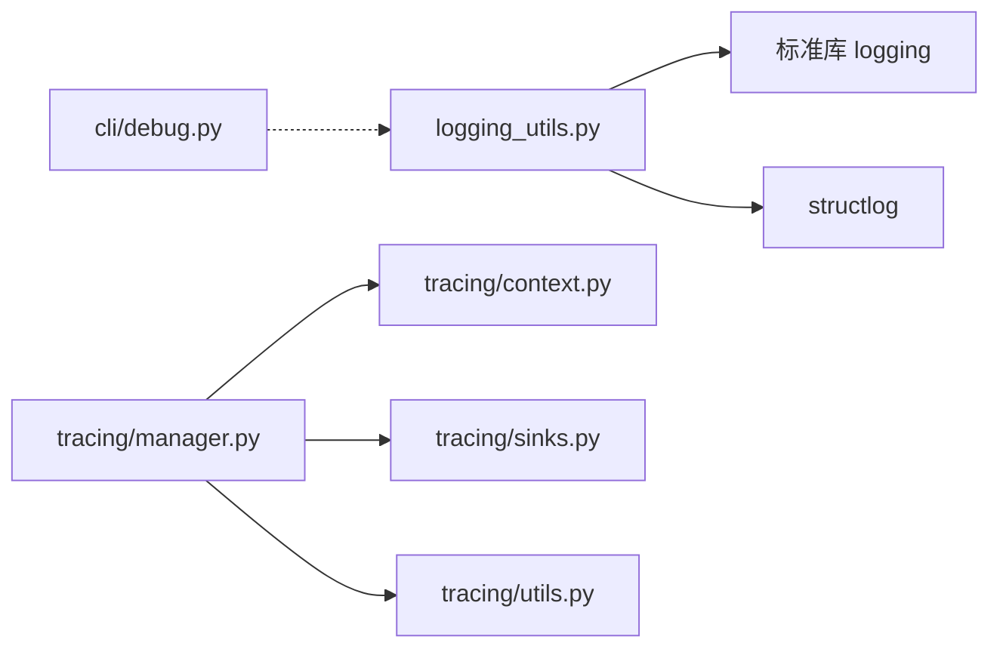

# 调试工具和技巧

<cite>
**本文引用的文件**
- [m_flow/cli/debug.py](file://m_flow/cli/debug.py)
- [m_flow/shared/logging_utils.py](file://m_flow/shared/logging_utils.py)
- [m_flow/shared/tracing/__init__.py](file://m_flow/shared/tracing/__init__.py)
- [m_flow/shared/tracing/manager.py](file://m_flow/shared/tracing/manager.py)
- [m_flow/shared/tracing/sinks.py](file://m_flow/shared/tracing/sinks.py)
- [m_flow/shared/tracing/context.py](file://m_flow/shared/tracing/context.py)
- [m_flow/shared/tracing/utils.py](file://m_flow/shared/tracing/utils.py)
- [m_flow/config/settings/get_settings.py](file://m_flow/config/settings/get_settings.py)
- [examples/python/simple_example.py](file://examples/python/simple_example.py)
</cite>

## 目录
1. [简介](#简介)
2. [项目结构](#项目结构)
3. [核心组件](#核心组件)
4. [架构总览](#架构总览)
5. [详细组件分析](#详细组件分析)
6. [依赖分析](#依赖分析)
7. [性能考虑](#性能考虑)
8. [故障排查指南](#故障排查指南)
9. [结论](#结论)
10. [附录](#附录)

## 简介
本文件面向 M-flow 的开发者与运维人员，提供一套可操作的“调试工具与技巧”实用指南。内容覆盖：
- 开发环境配置：IDE 设置要点、Python 环境与虚拟环境、调试器使用建议
- 日志系统：日志级别、结构化日志格式、日志落盘与轮转、日志分析方法
- 性能分析：内存与 CPU 监控、I/O 优化思路、常见瓶颈定位
- 调试技巧：断点调试、变量检查、异常追踪、链路追踪
- 观测性：指标采集、链路追踪、错误监控
- 实战案例：典型调试场景与解决方案，常见问题排查清单

## 项目结构
围绕调试主题，M-flow 在以下模块提供了关键能力：
- CLI 调试开关：控制命令行输出的详细程度
- 日志系统：集中式初始化、结构化输出、文件落盘与轮转、第三方噪声抑制
- 链路追踪：基于上下文的 TraceManager、自动计时 Span、JSONL 文件与内存环形缓冲双通道写入
- 设置导出：为管理界面提供 LLM/向量库配置，便于核对与排障

图表来源
- [m_flow/cli/debug.py:1-47](file://m_flow/cli/debug.py#L1-L47)
- [m_flow/shared/logging_utils.py:340-520](file://m_flow/shared/logging_utils.py#L340-L520)
- [m_flow/shared/tracing/__init__.py:1-51](file://m_flow/shared/tracing/__init__.py#L1-L51)
- [m_flow/config/settings/get_settings.py:123-151](file://m_flow/config/settings/get_settings.py#L123-L151)

章节来源
- [m_flow/cli/debug.py:1-47](file://m_flow/cli/debug.py#L1-L47)
- [m_flow/shared/logging_utils.py:340-520](file://m_flow/shared/logging_utils.py#L340-L520)
- [m_flow/shared/tracing/__init__.py:1-51](file://m_flow/shared/tracing/__init__.py#L1-L51)
- [m_flow/config/settings/get_settings.py:123-151](file://m_flow/config/settings/get_settings.py#L123-L151)

## 核心组件
- CLI 调试模式：通过模块级布尔标志控制 CLI 输出详细度，适合在本地快速放大/收敛诊断信息。
- 日志系统：一次性初始化（structlog + 标准库），支持彩色控制台输出、纯文本文件落盘、自动轮转、第三方噪声抑制、全局未处理异常钩子。
- 链路追踪：TraceManager 提供 start/end/event/span，结合 JsonlTraceSink 与 MemoryRingTraceSink，既可持久化又可内存回看。
- 设置导出：统一导出 LLM/向量库配置，便于在管理界面核对参数与密钥掩码。

章节来源
- [m_flow/cli/debug.py:16-46](file://m_flow/cli/debug.py#L16-L46)
- [m_flow/shared/logging_utils.py:340-520](file://m_flow/shared/logging_utils.py#L340-L520)
- [m_flow/shared/tracing/manager.py:107-280](file://m_flow/shared/tracing/manager.py#L107-L280)
- [m_flow/config/settings/get_settings.py:123-151](file://m_flow/config/settings/get_settings.py#L123-L151)

## 架构总览
下图展示调试与可观测性在系统中的交互路径：应用启动时初始化日志；在需要时开启链路追踪；CLI 调试模式影响控制台输出；设置导出用于核对配置。

图表来源
- [m_flow/shared/logging_utils.py:340-520](file://m_flow/shared/logging_utils.py#L340-L520)
- [m_flow/shared/tracing/manager.py:144-206](file://m_flow/shared/tracing/manager.py#L144-L206)
- [m_flow/shared/tracing/sinks.py:34-95](file://m_flow/shared/tracing/sinks.py#L34-L95)
- [m_flow/cli/debug.py:16-46](file://m_flow/cli/debug.py#L16-L46)
- [m_flow/config/settings/get_settings.py:123-151](file://m_flow/config/settings/get_settings.py#L123-L151)

## 详细组件分析

### 组件一：CLI 调试模式
- 功能：提供模块级开关，控制命令行输出的详细程度，便于在本地快速放大或收敛诊断信息。
- 使用建议：
  - 在本地开发脚本中显式调用启用/禁用函数，避免默认状态带来的噪音。
  - 结合日志系统级别，优先在本地提升到更细粒度的日志级别进行验证。

图表来源
- [m_flow/cli/debug.py:16-46](file://m_flow/cli/debug.py#L16-L46)

章节来源
- [m_flow/cli/debug.py:16-46](file://m_flow/cli/debug.py#L16-L46)

### 组件二：日志系统
- 初始化流程：一次性初始化 structlog + 标准库，安装控制台处理器（彩色渲染）、文件处理器（纯文本、自动轮转）、全局异常钩子。
- 结构化日志：记录时间戳、级别、logger 名称、事件体与额外字段，并在文件处理器中统一格式化输出。
- 第三方噪声抑制：静默特定第三方 logger 并过滤噪声词，降低无关日志干扰。
- 日志落盘与轮转：根据环境变量控制文件大小与保留数量，清理过期日志。
- 日志分析方法：
  - 使用日志文件路径定位当前日志文件，结合 grep/正则筛选关键事件。
  - 关注异常钩子输出，定位未捕获异常的堆栈。
  - 对比不同日志级别下的输出范围，缩小问题区间。

图表来源
- [m_flow/shared/logging_utils.py:340-520](file://m_flow/shared/logging_utils.py#L340-L520)

章节来源
- [m_flow/shared/logging_utils.py:340-520](file://m_flow/shared/logging_utils.py#L340-L520)

### 组件三：链路追踪
- TraceManager：提供 start/end/event/span，支持采样率、目录、字符串/列表长度限制等配置。
- TraceSpan：自动计时上下文，记录开始/结束事件与耗时，异常时附加异常类型与简短异常信息。
- Sink：JsonlTraceSink 将事件写入按日期分片的 JSONL 文件；MemoryRingTraceSink 作为内存环形缓冲，便于无磁盘写入场景调试。
- 上下文传播：通过 contextvars 保存当前 TraceState，实现跨异步任务的隐式传递。

图表来源
- [m_flow/shared/tracing/manager.py:107-280](file://m_flow/shared/tracing/manager.py#L107-L280)
- [m_flow/shared/tracing/sinks.py:17-110](file://m_flow/shared/tracing/sinks.py#L17-L110)
- [m_flow/shared/tracing/context.py:15-33](file://m_flow/shared/tracing/context.py#L15-L33)
- [m_flow/shared/tracing/utils.py:35-108](file://m_flow/shared/tracing/utils.py#L35-L108)

章节来源
- [m_flow/shared/tracing/manager.py:107-280](file://m_flow/shared/tracing/manager.py#L107-L280)
- [m_flow/shared/tracing/sinks.py:17-110](file://m_flow/shared/tracing/sinks.py#L17-L110)
- [m_flow/shared/tracing/context.py:15-33](file://m_flow/shared/tracing/context.py#L15-L33)
- [m_flow/shared/tracing/utils.py:35-108](file://m_flow/shared/tracing/utils.py#L35-L108)

### 组件四：设置导出（便于核对与排障）
- 功能：聚合 LLM 与向量库配置，返回给管理 UI 展示；敏感密钥进行部分掩码，避免泄露。
- 调试用途：在出现配置类问题时，先通过该接口确认当前生效配置与模型目录，再结合日志定位具体环节。

章节来源
- [m_flow/config/settings/get_settings.py:123-151](file://m_flow/config/settings/get_settings.py#L123-L151)

## 依赖分析
- 日志系统依赖于 structlog 与标准库 logging，同时通过环境变量与配置模块进行解耦。
- 链路追踪依赖 contextvars 进行上下文传播，Sink 抽象屏蔽了文件与内存两种存储差异。
- CLI 调试模式与日志系统相互独立但可协同：CLI 模式仅影响控制台输出详细度，不影响日志文件与结构化记录。

图表来源
- [m_flow/shared/logging_utils.py:340-520](file://m_flow/shared/logging_utils.py#L340-L520)
- [m_flow/shared/tracing/manager.py:107-280](file://m_flow/shared/tracing/manager.py#L107-L280)
- [m_flow/shared/tracing/context.py:15-33](file://m_flow/shared/tracing/context.py#L15-L33)
- [m_flow/shared/tracing/sinks.py:34-95](file://m_flow/shared/tracing/sinks.py#L34-L95)
- [m_flow/shared/tracing/utils.py:35-108](file://m_flow/shared/tracing/utils.py#L35-L108)
- [m_flow/cli/debug.py:16-46](file://m_flow/cli/debug.py#L16-L46)

章节来源
- [m_flow/shared/logging_utils.py:340-520](file://m_flow/shared/logging_utils.py#L340-L520)
- [m_flow/shared/tracing/manager.py:107-280](file://m_flow/shared/tracing/manager.py#L107-L280)
- [m_flow/shared/tracing/context.py:15-33](file://m_flow/shared/tracing/context.py#L15-L33)
- [m_flow/shared/tracing/sinks.py:34-95](file://m_flow/shared/tracing/sinks.py#L34-L95)
- [m_flow/shared/tracing/utils.py:35-108](file://m_flow/shared/tracing/utils.py#L35-L108)
- [m_flow/cli/debug.py:16-46](file://m_flow/cli/debug.py#L16-L46)

## 性能考虑
- 内存使用监控
  - 使用系统自带工具（如 Linux 的 top/htop、Windows 任务管理器）观察进程常驻内存变化。
  - 在关键阶段（如大规模数据入库、检索）前后记录日志时间戳，结合 TraceSpan 计时评估阶段性内存占用趋势。
- CPU 性能分析
  - 使用火焰图工具（如 py-spy）对长时间运行的服务进行采样，定位热点函数。
  - 在 TraceManager 中利用 span 自动计时，聚焦耗时操作（如 LLM 推理、向量检索、图构建）。
- I/O 优化技巧
  - 日志文件采用自动轮转与最大文件数限制，避免磁盘膨胀；必要时调整轮转阈值与保留数量。
  - 追踪事件写入按日期分片的 JSONL 文件，减少并发写锁冲突；若磁盘受限，可仅使用内存环形缓冲进行临时调试。
- 配置核对
  - 通过设置导出接口核对 LLM/向量库 Provider 与模型，避免因配置不一致导致的性能退化。

章节来源
- [m_flow/shared/logging_utils.py:340-520](file://m_flow/shared/logging_utils.py#L340-L520)
- [m_flow/shared/tracing/manager.py:144-206](file://m_flow/shared/tracing/manager.py#L144-L206)
- [m_flow/config/settings/get_settings.py:123-151](file://m_flow/config/settings/get_settings.py#L123-L151)

## 故障排查指南
- 日志级别与噪声
  - 若日志过多或过少，检查 LOG_LEVEL 与 CLI 调试模式；必要时临时降低第三方噪声级别。
  - 使用日志文件路径定位当前日志文件，结合关键字搜索与异常钩子输出定位根因。
- 异常追踪
  - 全局异常钩子会记录未捕获异常的堆栈；结合 TraceManager 的 span 异常字段，快速定位异常发生点。
- 链路追踪
  - 在问题复现路径上添加 trace.start/trace.event/trace.end 与 span 包裹，形成端到端事件流。
  - 若磁盘不可写，可仅依赖内存环形缓冲进行回看；完成后导出内存事件进行离线分析。
- 配置核对
  - 使用设置导出接口核对 LLM Provider、模型、向量库 Provider 与 URL，确保与环境变量一致。
- 示例参考
  - 参考示例脚本中的日志初始化方式，确保在最小可复现实例中也能获得一致的可观测性输出。

章节来源
- [m_flow/shared/logging_utils.py:340-520](file://m_flow/shared/logging_utils.py#L340-L520)
- [m_flow/shared/tracing/manager.py:144-206](file://m_flow/shared/tracing/manager.py#L144-L206)
- [m_flow/config/settings/get_settings.py:123-151](file://m_flow/config/settings/get_settings.py#L123-L151)
- [examples/python/simple_example.py:48-51](file://examples/python/simple_example.py#L48-L51)

## 结论
通过 CLI 调试模式、集中式日志系统与链路追踪三者的协同，M-flow 提供了从“现象—线索—根因”的完整调试闭环。建议在日常开发中：
- 默认使用结构化日志与 TraceManager，保留足够的上下文信息；
- 在本地开发时配合 CLI 调试模式快速定位问题；
- 在生产环境中谨慎开启高采样率与大体积事件记录，平衡可观测性与性能。

## 附录
- 实战场景示例（路径指引）
  - 快速开始示例：演示如何在最小实例中初始化日志并执行一次检索，便于复现与对比。
  - 路径：[examples/python/simple_example.py:1-51](file://examples/python/simple_example.py#L1-L51)
- 环境变量与配置要点
  - 日志：LOG_LEVEL、LOG_FILE_NAME、LOG_FILE_LEVEL、LOG_FILE_MAX_BYTES、LOG_FILE_BACKUP_COUNT
  - 追踪：MFLOW_TRACE_ENABLED、MFLOW_TRACE_SAMPLE_RATE、MFLOW_TRACE_DIR、MFLOW_TRACE_MAX_STR、MFLOW_TRACE_MAX_LIST
  - CLI：MFLOW_CLI_MODE（影响日志清理提示）