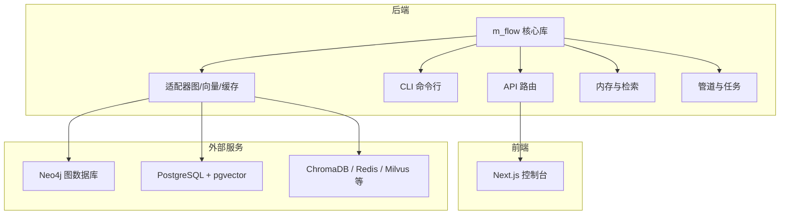
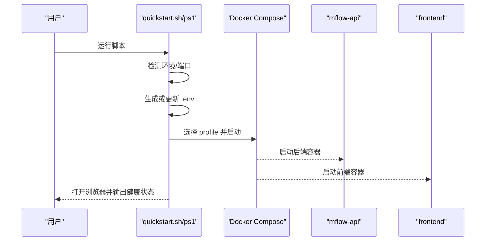
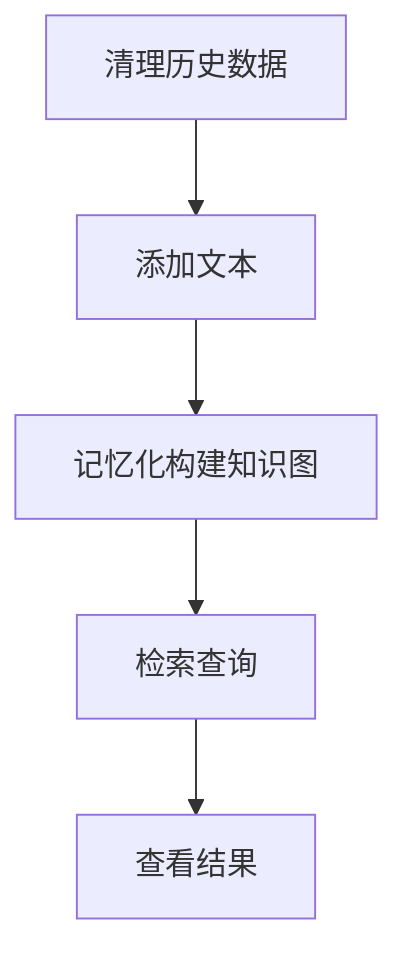
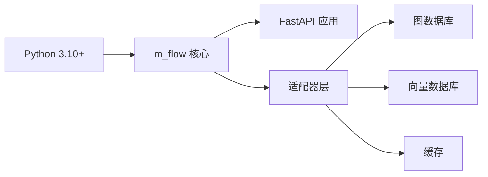

# 快速开始

<cite>
**本文引用的文件**
- [README.md](file://README.md)
- [quickstart.sh](file://quickstart.sh)
- [quickstart.ps1](file://quickstart.ps1)
- [docker-compose.yml](file://docker-compose.yml)
- [Dockerfile](file://Dockerfile)
- [.env.template](file://.env.template)
- [pyproject.toml](file://pyproject.toml)
- [simple_example.py](file://examples/python/simple_example.py)
- [get_settings.py](file://m_flow/config/settings/get_settings.py)
- [exceptions.py](file://m_flow/exceptions/exceptions.py)
- [app.py](file://m_flow/cli/app.py)
- [CUSTOM_LLM_PROVIDERS.md](file://docs/CUSTOM_LLM_PROVIDERS.md)
- [RETRIEVAL_ARCHITECTURE.md](file://docs/RETRIEVAL_ARCHITECTURE.md)
- [m_flow/__main__.py](file://m_flow/__main__.py)
</cite>

## 目录
1. [简介](#简介)
2. [项目结构](#项目结构)
3. [核心组件](#核心组件)
4. [架构总览](#架构总览)
5. [详细组件分析](#详细组件分析)
6. [依赖关系分析](#依赖关系分析)
7. [性能注意事项](#性能注意事项)
8. [故障排查指南](#故障排查指南)
9. [结论](#结论)
10. [附录](#附录)

## 简介
本指南面向首次接触 M-flow 的用户，帮助你在最短时间内完成安装与配置，并运行第一个检索示例。内容覆盖三种安装方式（Docker 一键安装、pip 安装、源码安装）、环境要求检查、Docker Compose 配置说明、Windows/macOS 具体步骤、初始配置要点（环境变量、数据库与向量库、LLM 提供商密钥）、首个使用示例（添加知识、记忆化、检索查询），以及常见问题排查。

## 项目结构
M-flow 采用模块化分层设计，核心目录与职责概览如下：
- m_flow：后端核心库与 API（FastAPI）、CLI、适配器、内存与检索、管道等
- m_flow-frontend：Next.js 前端控制台
- m_flow-mcp：MCP（模型上下文协议）服务
- mflow_workers：分布式执行辅助
- examples：示例脚本与端到端演示
- deployment：容器与 Helm 部署模板
- docs：架构与集成文档

图表来源
- [README.md:344-365](file://README.md#L344-L365)

章节来源
- [README.md:344-365](file://README.md#L344-L365)

## 核心组件
- 后端核心库与 API：提供检索、记忆化、数据管理、权限与多租户等能力
- CLI：命令行工具，支持 add、memorize、search、config 等子命令
- 适配器：统一抽象图数据库、向量数据库、缓存等存储后端
- 内存与检索：Episodic/Procedural 记忆、图路由检索、三元组补全等
- 前端控制台：可视化配置、知识图谱浏览、检索结果展示
- MCP 服务：将 M-flow 记忆作为 IDE 的模型上下文工具

章节来源
- [README.md:344-365](file://README.md#L344-L365)
- [app.py:71-77](file://m_flow/cli/app.py#L71-L77)

## 架构总览
M-flow 的检索以“图路由”为核心：先通过向量搜索在多粒度集合中捕获锚点，再在知识图中从尖端（实体/细粒度事实）向基部（事件集）传播成本，最终按最强证据链对事件集评分与排序。

图表来源
- [RETRIEVAL_ARCHITECTURE.md:44-82](file://docs/RETRIEVAL_ARCHITECTURE.md#L44-L82)

章节来源
- [RETRIEVAL_ARCHITECTURE.md:15-137](file://docs/RETRIEVAL_ARCHITECTURE.md#L15-L137)

## 详细组件分析

### 安装方式一：Docker 一键安装
- 使用仓库提供的快速启动脚本，自动检测环境、生成 .env、交互式配置 LLM 密钥与提供商，并一键拉起后端与前端。
- Windows 使用 quickstart.ps1；Linux/macOS 使用 quickstart.sh。
- 支持多种 profile 组合：ui（后端+前端）、neo4j、postgres、mcp、playground 等。

图表来源
- [quickstart.sh:192-245](file://quickstart.sh#L192-L245)
- [quickstart.ps1:184-211](file://quickstart.ps1#L184-L211)
- [docker-compose.yml:17-104](file://docker-compose.yml#L17-L104)

章节来源
- [README.md:274-283](file://README.md#L274-L283)
- [quickstart.sh:114-139](file://quickstart.sh#L114-L139)
- [quickstart.ps1:101-120](file://quickstart.ps1#L101-L120)
- [docker-compose.yml:1-10](file://docker-compose.yml#L1-L10)

### 安装方式二：pip 安装
- 通过 pip 或 uv 安装 mflow-ai 包，并设置 LLM_API_KEY 环境变量即可使用。
- 适合希望直接在本地 Python 环境中运行的用户。

章节来源
- [README.md:285-291](file://README.md#L285-L291)

### 安装方式三：源码安装
- 克隆仓库后使用可编辑安装，便于开发与调试。
- 可选 extras（如 api、dev、postgres、neo4j 等）按需启用。

章节来源
- [README.md:292-297](file://README.md#L292-L297)
- [pyproject.toml:82-191](file://pyproject.toml#L82-L191)

### 环境要求检查清单
- Python 版本：3.10 及以上
- Docker 与 docker compose：推荐版本，用于一键部署
- 端口占用：8000（后端）、3000（前端），必要时释放占用
- LLM API 密钥：必须配置，可在 .env 中设置
- 可选：uv、pnpm（本地模式）

章节来源
- [pyproject.toml:8](file://pyproject.toml#L8)
- [quickstart.sh:57-113](file://quickstart.sh#L57-L113)
- [quickstart.ps1:42-99](file://quickstart.ps1#L42-L99)

### Docker Compose 配置选项与选择建议
- 基础 profile
  - ui：后端 + 前端
  - mcp：后端 + MCP 服务
  - neo4j：后端 + Neo4j 图数据库
  - postgres：后端 + PostgreSQL + pgvector
  - chromadb、redis：可选的向量/缓存后端
  - playground：后端 + 人脸识别服务（需要额外准备）
- 选择建议
  - 开发起步：ui profile 即可满足本地体验
  - 需要图数据库：neo4j profile
  - 需要关系型+向量：postgres profile
  - 集成 IDE：mcp profile
  - 多人会话与人脸分区：playground profile（需额外服务）

章节来源
- [docker-compose.yml:17-227](file://docker-compose.yml#L17-L227)

### Windows 与 macOS 安装步骤
- Windows
  - 使用 PowerShell 脚本 quickstart.ps1，交互式配置 .env、LLM 提供商与模型、端口占用检查
  - 支持选择 profile 并自动等待健康检查
- macOS/Linux
  - 使用 Bash 脚本 quickstart.sh，功能与 Windows 版一致
  - 若无 Docker，可选择本地 Python 模式（需 uv、pnpm）

章节来源
- [quickstart.ps1:1-278](file://quickstart.ps1#L1-L278)
- [quickstart.sh:1-326](file://quickstart.sh#L1-L326)

### 初始配置：环境变量、数据库与 LLM 密钥
- 生成 .env：脚本会复制 .env.template 并提示输入 LLM_API_KEY、LLM_PROVIDER、LLM_MODEL
- 关键配置项
  - LLM：LLM_API_KEY、LLM_PROVIDER、LLM_MODEL、LLM_ENDPOINT、LLM_API_VERSION
  - 向量嵌入：EMBEDDING_PROVIDER、EMBEDDING_MODEL、EMBEDDING_ENDPOINT、EMBEDDING_API_VERSION、EMBEDDING_DIMENSIONS
  - 存储：DB_PROVIDER（sqlite/postgres）、VECTOR_DB_PROVIDER（lancedb/pgvector/chroma 等）、GRAPH_DATABASE_PROVIDER（kuzu/neo4j）
  - 可选：S3 存储、迁移数据库、云同步、日志级别、并发限制等

章节来源
- [.env.template:55-299](file://.env.template#L55-L299)
- [get_settings.py:40-105](file://m_flow/config/settings/get_settings.py#L40-L105)

### 第一个使用示例：添加知识、记忆化与检索
- 示例脚本展示了完整流程：清理历史数据 → 添加文本 → 记忆化构建知识图 → 检索查询
- 可直接运行 examples/python/simple_example.py

图表来源
- [simple_example.py:21-46](file://examples/python/simple_example.py#L21-L46)

章节来源
- [simple_example.py:1-51](file://examples/python/simple_example.py#L1-L51)

### CLI 与命令入口
- mflow 命令提供 add、memorize、search、delete、config 等子命令
- 支持 -ui 参数一键启动后端、前端与 MCP

章节来源
- [app.py:71-77](file://m_flow/cli/app.py#L71-L77)
- [app.py:235-243](file://m_flow/cli/app.py#L235-L243)
- [m_flow/__main__.py:10-18](file://m_flow/__main__.py#L10-L18)

### 自定义 LLM 提供商
- 支持通过 custom provider 连接任何 OpenAI 兼容的端点
- 推荐预设、Instructor 模式、速率限制与常见陷阱

章节来源
- [CUSTOM_LLM_PROVIDERS.md:16-140](file://docs/CUSTOM_LLM_PROVIDERS.md#L16-L140)

## 依赖关系分析
- Python 版本与依赖：要求 Python 3.10+，核心依赖包括 FastAPI、SQLAlchemy、LiteLLM、Instructor、Pydantic 等
- 可选依赖：各 LLM 提供商、图数据库、向量库、文档解析、网页抓取、监控等
- 构建镜像：两阶段 Dockerfile，builder 阶段使用 uv 安装依赖，runner 阶段精简运行时

图表来源
- [pyproject.toml:29-73](file://pyproject.toml#L29-L73)
- [Dockerfile:6-16](file://Dockerfile#L6-L16)

章节来源
- [pyproject.toml:1-323](file://pyproject.toml#L1-L323)
- [Dockerfile:1-90](file://Dockerfile#L1-L90)

## 性能注意事项
- 并发与资源：容器默认 CPU 与内存上限可按需调整；生产环境建议根据负载调优
- 日志级别：可通过环境变量降低文件日志级别以减少 IO
- 检索参数：RETURNS_TOP_K、CHUNK_MAX_TOKENS、PIPELINE_RETRY_ATTEMPTS 等可按场景优化

章节来源
- [docker-compose.yml:38-47](file://docker-compose.yml#L38-L47)
- [.env.template:268-273](file://.env.template#L268-L273)

## 故障排查指南
- 健康检查失败
  - 后端：访问 http://localhost:8000/health；若超时，查看容器日志
  - 前端：访问 http://localhost:3000；若未就绪，等待构建完成
- 端口占用
  - 8000/3000 被占用时，释放或修改映射端口
- LLM 配置错误
  - 确认 LLM_API_KEY、LLM_PROVIDER、LLM_MODEL 设置正确；必要时切换 Instructor 模式
- 数据库连接异常
  - 检查 DB_PROVIDER、DB_HOST、DB_PORT、DB_NAME、DB_USERNAME、DB_PASSWORD
- 权限与认证
  - 如开启鉴权，确保 JWT 密钥与默认用户配置正确
- 异常类型参考
  - 平台异常体系包含 InternalError、BadInputError、ConfigError、TransientError 等

章节来源
- [quickstart.sh:192-205](file://quickstart.sh#L192-L205)
- [quickstart.ps1:166-180](file://quickstart.ps1#L166-L180)
- [.env.template:40-51](file://.env.template#L40-L51)
- [exceptions.py:20-148](file://m_flow/exceptions/exceptions.py#L20-L148)

## 结论
通过本快速开始指南，你已掌握 M-flow 的三种安装方式、环境与配置要点、Docker Compose 的常用 profile 选择、Windows/macOS 的具体操作步骤，以及首个检索示例的完整流程。建议在本地 ui profile 下先行体验，随后根据需求扩展至 neo4j/postgres 等后端组合，并结合自定义 LLM 提供商与高级检索模式深入探索。

## 附录

### 常用命令速查
- Docker 一键启动（含前端）：docker compose --profile ui up
- 后端+Neo4j：docker compose --profile ui --profile neo4j up
- 后端+Postgres：docker compose --profile ui --profile postgres up
- 本地 Python 模式：uv sync --extra api --extra dev；前端安装与启动

章节来源
- [README.md:382-391](file://README.md#L382-L391)
- [quickstart.sh:311-325](file://quickstart.sh#L311-L325)
- [quickstart.ps1:265-277](file://quickstart.ps1#L265-L277)