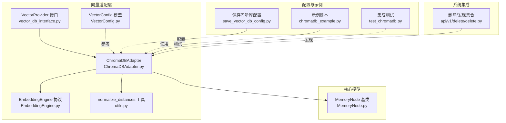
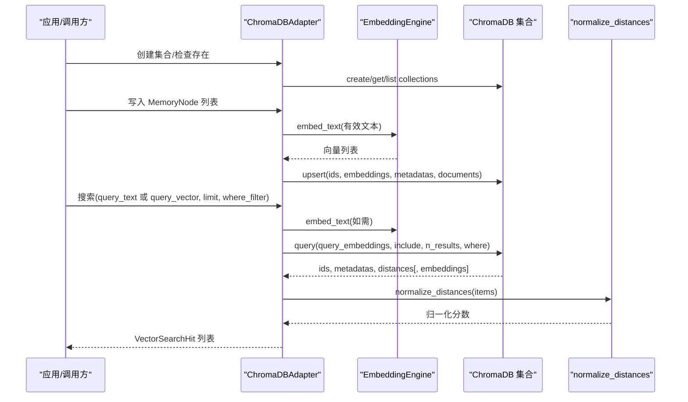
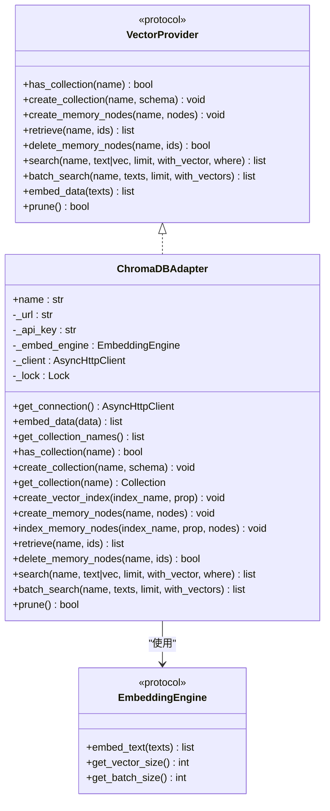
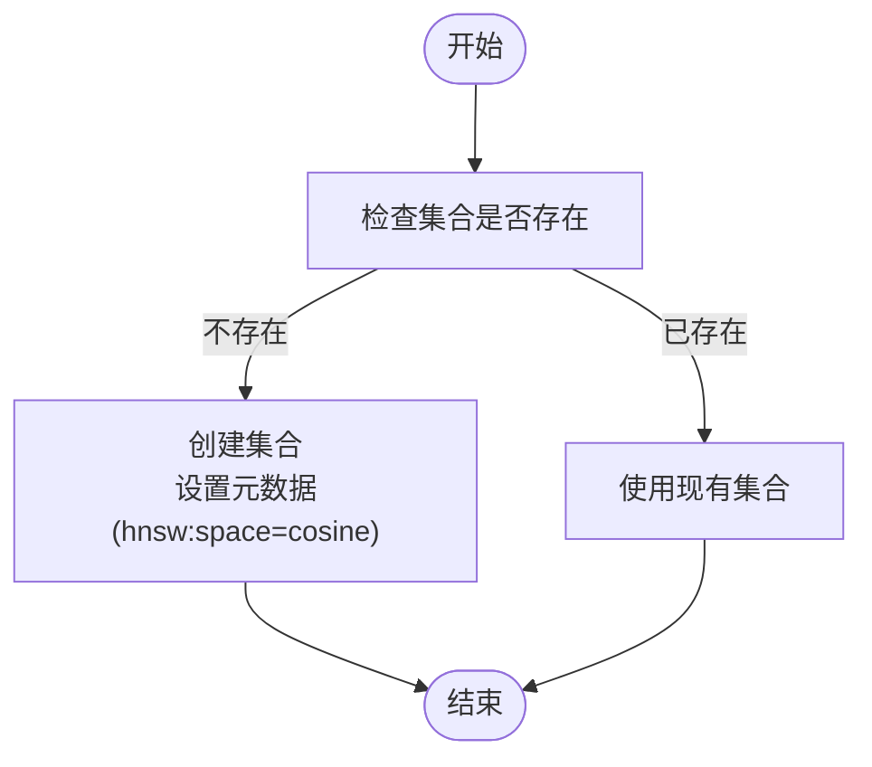
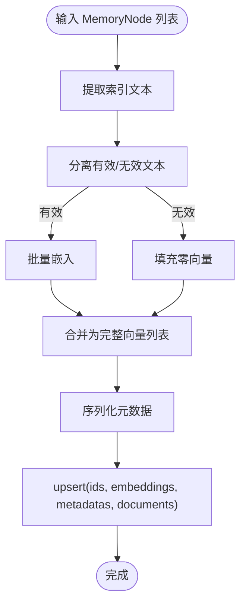
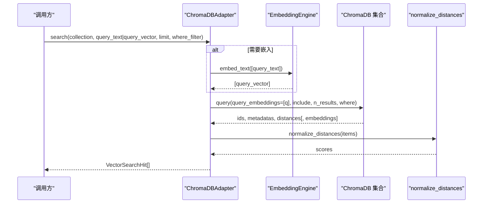
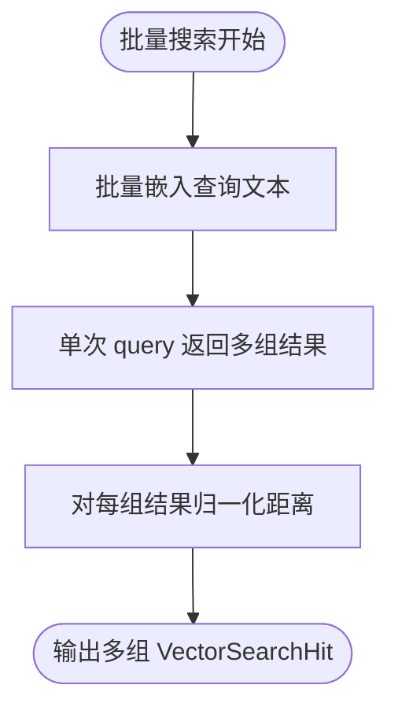
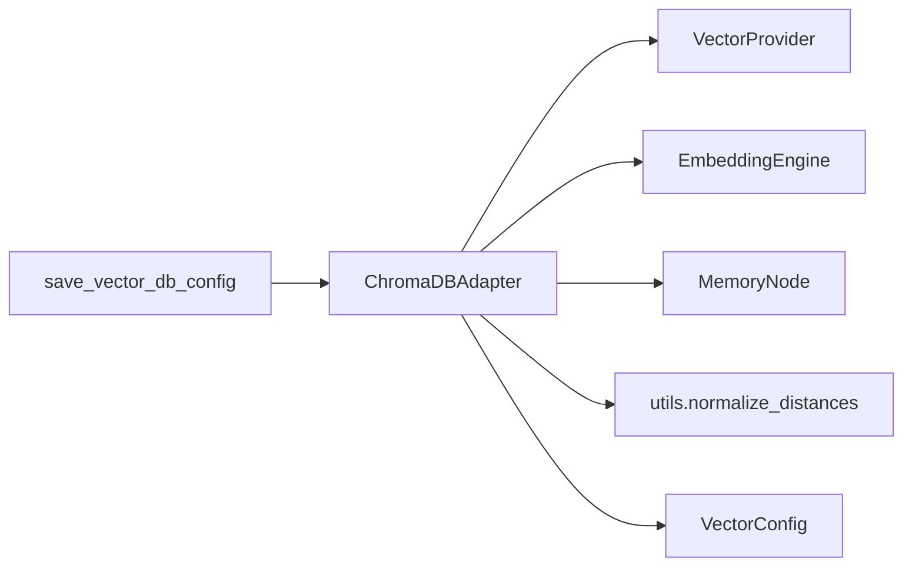

# ChromaDB 适配器

<cite>
**本文引用的文件**
- [ChromaDBAdapter.py](file://m_flow/adapters/vector/chromadb/ChromaDBAdapter.py)
- [vector_db_interface.py](file://m_flow/adapters/vector/vector_db_interface.py)
- [EmbeddingEngine.py](file://m_flow/adapters/vector/embeddings/EmbeddingEngine.py)
- [VectorConfig.py](file://m_flow/adapters/vector/models/VectorConfig.py)
- [utils.py](file://m_flow/adapters/vector/utils.py)
- [MemoryNode.py](file://m_flow/core/models/MemoryNode.py)
- [save_vector_db_config.py](file://m_flow/config/settings/save_vector_db_config.py)
- [chromadb_example.py](file://examples/database_examples/chromadb_example.py)
- [test_chromadb.py](file://m_flow/tests/test_chromadb.py)
- [delete.py](file://m_flow/api/v1/delete/delete.py)
</cite>

## 目录
1. [简介](#简介)
2. [项目结构](#项目结构)
3. [核心组件](#核心组件)
4. [架构总览](#架构总览)
5. [组件详细分析](#组件详细分析)
6. [依赖关系分析](#依赖关系分析)
7. [性能考量](#性能考量)
8. [故障排查指南](#故障排查指南)
9. [结论](#结论)
10. [附录：使用示例与最佳实践](#附录使用示例与最佳实践)

## 简介
本文件系统性阐述 M-Flow 中的 ChromaDB 适配器实现，重点覆盖以下方面：
- 基于异步客户端的向量检索与存储接口
- 集合管理、文档分割与元数据处理、批量操作优化
- 向量存储架构（嵌入生成、文档文本与元数据持久化）
- 查询优化策略（相似度度量、过滤条件、结果归一化）
- 配置参数详解（嵌入维度、距离度量、索引相关元数据）
- 实际使用示例（向量搜索、批量插入、数据清理）
- 与文档处理流程的集成方式与性能优化建议
- 已知限制与适用场景

## 项目结构
ChromaDB 适配器位于向量适配层，围绕抽象接口实现具体能力，并与嵌入引擎、通用模型与工具函数协同工作。

**图表来源**
- [vector_db_interface.py:16-180](file://m_flow/adapters/vector/vector_db_interface.py#L16-L180)
- [ChromaDBAdapter.py:155-550](file://m_flow/adapters/vector/chromadb/ChromaDBAdapter.py#L155-L550)
- [EmbeddingEngine.py:14-64](file://m_flow/adapters/vector/embeddings/EmbeddingEngine.py#L14-L64)
- [VectorConfig.py:20-47](file://m_flow/adapters/vector/models/VectorConfig.py#L20-L47)
- [utils.py:13-46](file://m_flow/adapters/vector/utils.py#L13-L46)
- [MemoryNode.py:27-105](file://m_flow/core/models/MemoryNode.py#L27-L105)
- [save_vector_db_config.py:19-70](file://m_flow/config/settings/save_vector_db_config.py#L19-L70)
- [chromadb_example.py:1-49](file://examples/database_examples/chromadb_example.py#L1-L49)
- [test_chromadb.py:125-227](file://m_flow/tests/test_chromadb.py#L125-L227)
- [delete.py:62-85](file://m_flow/api/v1/delete/delete.py#L62-L85)

**章节来源**
- [vector_db_interface.py:16-180](file://m_flow/adapters/vector/vector_db_interface.py#L16-L180)
- [ChromaDBAdapter.py:155-550](file://m_flow/adapters/vector/chromadb/ChromaDBAdapter.py#L155-L550)
- [EmbeddingEngine.py:14-64](file://m_flow/adapters/vector/embeddings/EmbeddingEngine.py#L14-L64)
- [VectorConfig.py:20-47](file://m_flow/adapters/vector/models/VectorConfig.py#L20-L47)
- [utils.py:13-46](file://m_flow/adapters/vector/utils.py#L13-L46)
- [MemoryNode.py:27-105](file://m_flow/core/models/MemoryNode.py#L27-L105)
- [save_vector_db_config.py:19-70](file://m_flow/config/settings/save_vector_db_config.py#L19-L70)
- [chromadb_example.py:1-49](file://examples/database_examples/chromadb_example.py#L1-L49)
- [test_chromadb.py:125-227](file://m_flow/tests/test_chromadb.py#L125-L227)
- [delete.py:62-85](file://m_flow/api/v1/delete/delete.py#L62-L85)

## 核心组件
- ChromaDBAdapter：实现 VectorProvider，提供集合管理、内存节点增删改查、向量检索、批量检索与维护清理等能力。
- EmbeddingEngine：嵌入引擎协议，统一不同后端的文本向量化能力。
- MemoryNode：知识图谱中的基础节点模型，支持提取索引文本、序列化/反序列化元数据。
- VectorConfig：向量存储配置模型，定义距离度量与向量维度。
- utils.normalize_distances：对检索距离进行归一化，便于跨集合/跨任务的一致评分。
- 配置保存模块：提供向量库配置更新与持久化能力。

**章节来源**
- [ChromaDBAdapter.py:155-550](file://m_flow/adapters/vector/chromadb/ChromaDBAdapter.py#L155-L550)
- [EmbeddingEngine.py:14-64](file://m_flow/adapters/vector/embeddings/EmbeddingEngine.py#L14-L64)
- [MemoryNode.py:27-105](file://m_flow/core/models/MemoryNode.py#L27-L105)
- [VectorConfig.py:20-47](file://m_flow/adapters/vector/models/VectorConfig.py#L20-L47)
- [utils.py:13-46](file://m_flow/adapters/vector/utils.py#L13-L46)
- [save_vector_db_config.py:19-70](file://m_flow/config/settings/save_vector_db_config.py#L19-L70)

## 架构总览
ChromaDB 适配器通过异步 HTTP 客户端连接到 ChromaDB 服务端；在写入侧，先由嵌入引擎生成向量，再以 upsert 方式写入集合；在读取侧，支持按文本或预计算向量进行相似度检索，并可附加过滤条件与返回向量。

**图表来源**
- [ChromaDBAdapter.py:212-550](file://m_flow/adapters/vector/chromadb/ChromaDBAdapter.py#L212-L550)
- [EmbeddingEngine.py:24-53](file://m_flow/adapters/vector/embeddings/EmbeddingEngine.py#L24-L53)
- [utils.py:13-46](file://m_flow/adapters/vector/utils.py#L13-L46)

## 组件详细分析

### ChromaDBAdapter 类与接口契约
- 实现 VectorProvider，提供集合管理、内存节点 CRUD、搜索与批量搜索、维护清理等方法。
- 连接管理：延迟初始化异步 HTTP 客户端，支持令牌鉴权。
- 并发控制：使用 asyncio.Lock 保护集合创建等关键路径。
- 过滤解析：支持 SQL 风格的 where 子句，白名单字段与值校验，转换为 ChromaDB 查询条件。
- 结果处理：统一将元数据序列化/反序列化，归一化距离为 0~1 区间。

**图表来源**
- [vector_db_interface.py:16-180](file://m_flow/adapters/vector/vector_db_interface.py#L16-L180)
- [ChromaDBAdapter.py:155-550](file://m_flow/adapters/vector/chromadb/ChromaDBAdapter.py#L155-L550)
- [EmbeddingEngine.py:14-64](file://m_flow/adapters/vector/embeddings/EmbeddingEngine.py#L14-L64)

**章节来源**
- [ChromaDBAdapter.py:155-550](file://m_flow/adapters/vector/chromadb/ChromaDBAdapter.py#L155-L550)
- [vector_db_interface.py:16-180](file://m_flow/adapters/vector/vector_db_interface.py#L16-L180)
- [EmbeddingEngine.py:14-64](file://m_flow/adapters/vector/embeddings/EmbeddingEngine.py#L14-L64)

### 集合管理与索引
- 集合命名：集合即“模型名_索引字段名”，例如“Entity_name”、“Episode_summary”等。
- 创建集合：首次写入时自动创建，设置集合元数据（如 HNSW 空间为余弦）。
- 获取集合：若不存在则抛出异常。
- 索引创建：通过组合索引名与属性名形成集合名并创建。

**图表来源**
- [ChromaDBAdapter.py:243-266](file://m_flow/adapters/vector/chromadb/ChromaDBAdapter.py#L243-L266)

**章节来源**
- [ChromaDBAdapter.py:243-266](file://m_flow/adapters/vector/chromadb/ChromaDBAdapter.py#L243-L266)

### 文档分割、元数据处理与批量写入
- 文档分割：从 MemoryNode 中提取索引字段文本，拼接为可嵌入字符串；无索引字段则跳过嵌入。
- 元数据处理：将复杂类型（UUID、dict、list 等）序列化为字符串键值，避免 ChromaDB 不支持的复杂类型。
- 批量写入：对有效文本批量嵌入，无效项填充零向量，保持与 ID 对齐；同时 upsert 写入文档与元数据。
- 索引 Schema：IndexSchema 封装 text、dataset_id、memory_type 等字段，用于路由与过滤。

**图表来源**
- [ChromaDBAdapter.py:271-312](file://m_flow/adapters/vector/chromadb/ChromaDBAdapter.py#L271-L312)
- [MemoryNode.py:64-84](file://m_flow/core/models/MemoryNode.py#L64-L84)
- [ChromaDBAdapter.py:43-66](file://m_flow/adapters/vector/chromadb/ChromaDBAdapter.py#L43-L66)

**章节来源**
- [ChromaDBAdapter.py:271-312](file://m_flow/adapters/vector/chromadb/ChromaDBAdapter.py#L271-L312)
- [MemoryNode.py:64-84](file://m_flow/core/models/MemoryNode.py#L64-L84)
- [ChromaDBAdapter.py:43-66](file://m_flow/adapters/vector/chromadb/ChromaDBAdapter.py#L43-L66)

### 查询与过滤
- 查询入口：支持文本或向量查询；当仅提供文本时自动嵌入。
- 过滤解析：SQL 风格表达式，白名单字段与允许值校验，转换为 ChromaDB where 条件。
- 结果组装：合并 id、元数据、距离，可选返回向量；最后进行距离归一化。

**图表来源**
- [ChromaDBAdapter.py:364-455](file://m_flow/adapters/vector/chromadb/ChromaDBAdapter.py#L364-L455)
- [EmbeddingEngine.py:24-43](file://m_flow/adapters/vector/embeddings/EmbeddingEngine.py#L24-L43)
- [utils.py:13-46](file://m_flow/adapters/vector/utils.py#L13-L46)

**章节来源**
- [ChromaDBAdapter.py:364-455](file://m_flow/adapters/vector/chromadb/ChromaDBAdapter.py#L364-L455)
- [EmbeddingEngine.py:24-43](file://m_flow/adapters/vector/embeddings/EmbeddingEngine.py#L24-L43)
- [utils.py:13-46](file://m_flow/adapters/vector/utils.py#L13-L46)

### 批量搜索与结果归一化
- 批量搜索：对多个查询文本批量嵌入，一次请求返回多组结果。
- 结果归一化：对每批结果的距离执行 min-max 归一化，保证跨查询的一致性。

**图表来源**
- [ChromaDBAdapter.py:456-517](file://m_flow/adapters/vector/chromadb/ChromaDBAdapter.py#L456-L517)
- [utils.py:13-46](file://m_flow/adapters/vector/utils.py#L13-L46)

**章节来源**
- [ChromaDBAdapter.py:456-517](file://m_flow/adapters/vector/chromadb/ChromaDBAdapter.py#L456-L517)
- [utils.py:13-46](file://m_flow/adapters/vector/utils.py#L13-L46)

### 维护与清理
- 清理：列出并删除所有集合，常用于测试或重置环境。
- 删除节点：按 ID 删除集合中的条目。

**章节来源**
- [ChromaDBAdapter.py:523-531](file://m_flow/adapters/vector/chromadb/ChromaDBAdapter.py#L523-L531)
- [ChromaDBAdapter.py:354-358](file://m_flow/adapters/vector/chromadb/ChromaDBAdapter.py#L354-L358)

## 依赖关系分析
- 适配器依赖抽象接口 VectorProvider，确保可替换性。
- 依赖 EmbeddingEngine 提供向量生成能力。
- 依赖 MemoryNode 的索引文本提取与元数据序列化。
- 依赖 utils.normalize_distances 进行距离归一化。
- 依赖配置保存模块进行向量库配置更新与持久化。

**图表来源**
- [ChromaDBAdapter.py:155-550](file://m_flow/adapters/vector/chromadb/ChromaDBAdapter.py#L155-L550)
- [vector_db_interface.py:16-180](file://m_flow/adapters/vector/vector_db_interface.py#L16-L180)
- [EmbeddingEngine.py:14-64](file://m_flow/adapters/vector/embeddings/EmbeddingEngine.py#L14-L64)
- [MemoryNode.py:27-105](file://m_flow/core/models/MemoryNode.py#L27-L105)
- [utils.py:13-46](file://m_flow/adapters/vector/utils.py#L13-L46)
- [VectorConfig.py:20-47](file://m_flow/adapters/vector/models/VectorConfig.py#L20-L47)
- [save_vector_db_config.py:19-70](file://m_flow/config/settings/save_vector_db_config.py#L19-L70)

**章节来源**
- [ChromaDBAdapter.py:155-550](file://m_flow/adapters/vector/chromadb/ChromaDBAdapter.py#L155-L550)
- [vector_db_interface.py:16-180](file://m_flow/adapters/vector/vector_db_interface.py#L16-L180)
- [EmbeddingEngine.py:14-64](file://m_flow/adapters/vector/embeddings/EmbeddingEngine.py#L14-L64)
- [MemoryNode.py:27-105](file://m_flow/core/models/MemoryNode.py#L27-L105)
- [utils.py:13-46](file://m_flow/adapters/vector/utils.py#L13-L46)
- [VectorConfig.py:20-47](file://m_flow/adapters/vector/models/VectorConfig.py#L20-L47)
- [save_vector_db_config.py:19-70](file://m_flow/config/settings/save_vector_db_config.py#L19-L70)

## 性能考量
- 向量生成批大小：EmbeddingEngine 提供 get_batch_size 建议，适配器在批量嵌入时应遵循该建议以提升吞吐。
- 距离归一化：对检索结果进行归一化，有助于跨查询比较与后续排序。
- 过滤与结果数：合理设置 limit，避免不必要的全量扫描；当 limit 为空时会查询集合总数，注意大集合的开销。
- 并发与锁：集合创建使用互斥锁，避免并发重复创建；写入侧尽量减少无效文本的嵌入。
- 集合命名与发现：集合命名遵循“模型_字段”，系统可通过反射/约定发现集合，减少硬编码。

**章节来源**
- [EmbeddingEngine.py:55-63](file://m_flow/adapters/vector/embeddings/EmbeddingEngine.py#L55-L63)
- [utils.py:13-46](file://m_flow/adapters/vector/utils.py#L13-L46)
- [ChromaDBAdapter.py:396-400](file://m_flow/adapters/vector/chromadb/ChromaDBAdapter.py#L396-L400)
- [delete.py:62-85](file://m_flow/api/v1/delete/delete.py#L62-L85)

## 故障排查指南
- 缺少查询参数：当未提供文本或向量时抛出异常，确保至少提供其一。
- 集合不存在：获取集合前应先创建或确认存在。
- 过滤条件非法：仅允许白名单字段与允许值，否则抛出异常。
- 搜索失败：捕获异常并返回空结果，便于上层降级处理。
- 配置问题：检查向量库 URL、API Key 与 Provider 是否正确；必要时重新保存配置。

**章节来源**
- [ChromaDBAdapter.py:386-387](file://m_flow/adapters/vector/chromadb/ChromaDBAdapter.py#L386-L387)
- [ChromaDBAdapter.py:254-260](file://m_flow/adapters/vector/chromadb/ChromaDBAdapter.py#L254-L260)
- [ChromaDBAdapter.py:123-136](file://m_flow/adapters/vector/chromadb/ChromaDBAdapter.py#L123-L136)
- [ChromaDBAdapter.py:452-454](file://m_flow/adapters/vector/chromadb/ChromaDBAdapter.py#L452-L454)
- [save_vector_db_config.py:32-66](file://m_flow/config/settings/save_vector_db_config.py#L32-L66)

## 结论
ChromaDB 适配器在 M-Flow 中提供了完整的异步向量检索与存储能力，具备良好的扩展性与一致性。通过严格的过滤白名单、元数据序列化与距离归一化，适配器在易用性与稳定性之间取得平衡。结合嵌入引擎的批处理建议与合理的集合命名策略，可在多数场景下获得稳定且可预测的性能表现。

## 附录：使用示例与最佳实践

### 示例：配置与基本检索
- 使用示例脚本展示了如何配置 ChromaDB 为向量库后端、添加数据、记忆化以及执行检索。

**章节来源**
- [chromadb_example.py:17-45](file://examples/database_examples/chromadb_example.py#L17-L45)

### 示例：集成测试要点
- 集成测试验证了：
  - 向量存储与检索
  - 集合管理与清理
  - 记忆化流水线集成
  - 多种召回模式下的检索
  - 无限制搜索行为（limit=None）

**章节来源**
- [test_chromadb.py:125-227](file://m_flow/tests/test_chromadb.py#L125-L227)

### 最佳实践
- 在写入前确保集合存在或允许自动创建；批量写入时优先剔除无效文本，减少嵌入与 IO。
- 使用白名单过滤条件，避免不安全或不受支持的过滤表达式。
- 对检索结果进行距离归一化，便于后续排序与去重。
- 合理设置 limit，避免大集合上的全量扫描；必要时分页或分批处理。
- 使用 IndexSchema 保留 dataset_id 与 memory_type 等关键元数据，便于路由与过滤。

**章节来源**
- [ChromaDBAdapter.py:43-66](file://m_flow/adapters/vector/chromadb/ChromaDBAdapter.py#L43-L66)
- [ChromaDBAdapter.py:123-136](file://m_flow/adapters/vector/chromadb/ChromaDBAdapter.py#L123-L136)
- [utils.py:13-46](file://m_flow/adapters/vector/utils.py#L13-L46)
- [ChromaDBAdapter.py:396-400](file://m_flow/adapters/vector/chromadb/ChromaDBAdapter.py#L396-L400)