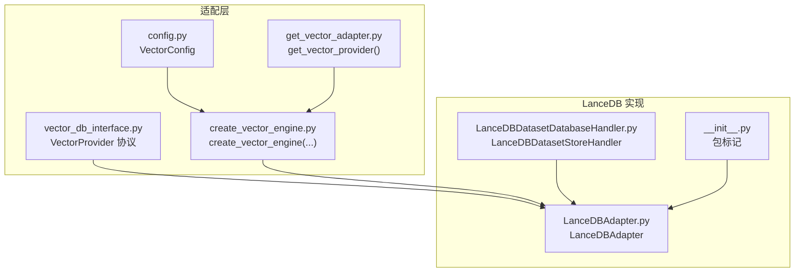
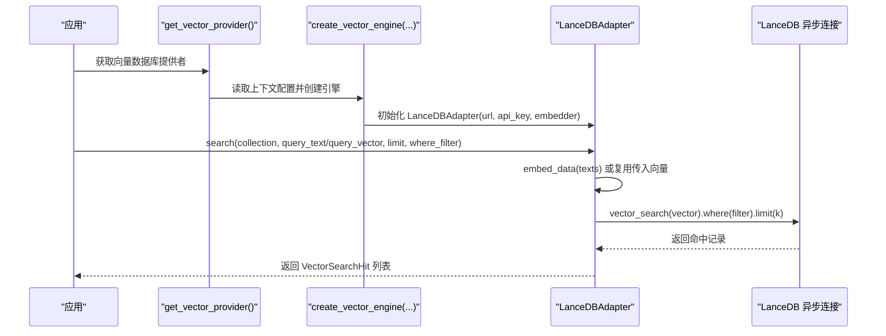
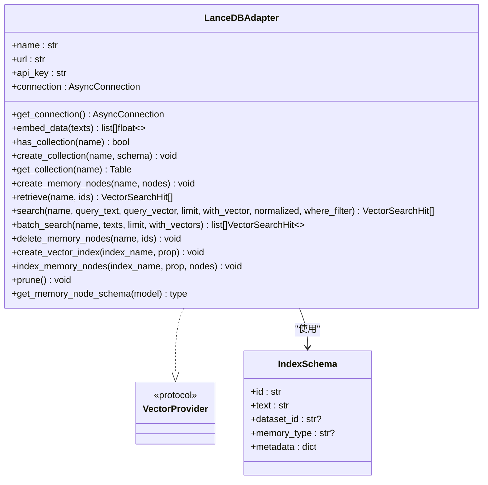
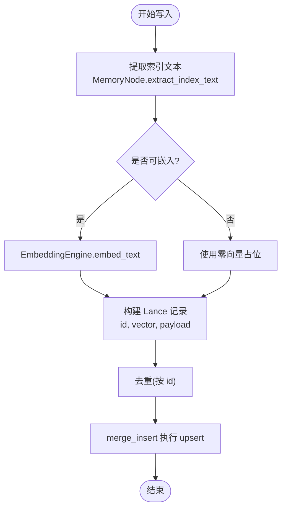
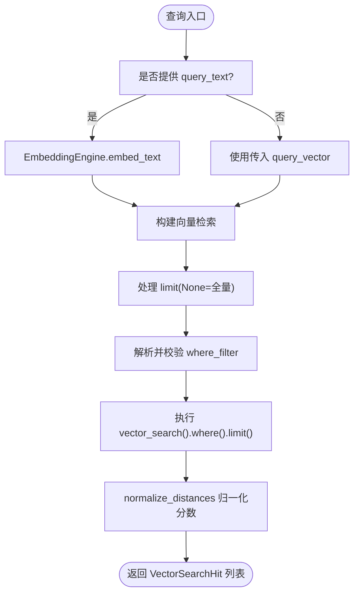
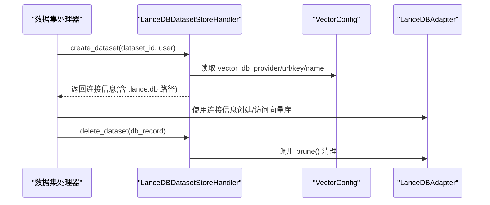
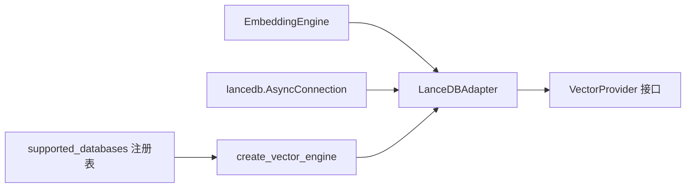

# LanceDB 适配器

<cite>
**本文档引用的文件**
- [LanceDBAdapter.py](file://m_flow/adapters/vector/lancedb/LanceDBAdapter.py)
- [LanceDBDatasetDatabaseHandler.py](file://m_flow/adapters/vector/lancedb/LanceDBDatasetDatabaseHandler.py)
- [__init__.py](file://m_flow/adapters/vector/lancedb/__init__.py)
- [get_vector_adapter.py](file://m_flow/adapters/vector/get_vector_adapter.py)
- [create_vector_engine.py](file://m_flow/adapters/vector/create_vector_engine.py)
- [supported_databases.py](file://m_flow/adapters/vector/supported_databases.py)
- [vector_db_interface.py](file://m_flow/adapters/vector/vector_db_interface.py)
- [config.py](file://m_flow/adapters/vector/config.py)
- [MemoryNode.py](file://m_flow/core/models/MemoryNode.py)
- [test_lancedb.py](file://m_flow/tests/test_lancedb.py)
- [test_dataset_database_handler.py](file://m_flow/tests/test_dataset_database_handler.py)
- [migrate_lancedb_created_at.py](file://scripts/migrate_lancedb_created_at.py)
</cite>

## 目录
1. [简介](#简介)
2. [项目结构](#项目结构)
3. [核心组件](#核心组件)
4. [架构总览](#架构总览)
5. [详细组件分析](#详细组件分析)
6. [依赖分析](#依赖分析)
7. [性能考虑](#性能考虑)
8. [故障排查指南](#故障排查指南)
9. [结论](#结论)
10. [附录](#附录)

## 简介
本文件系统性阐述 M-flow 中的 LanceDB 向量数据库适配器实现，重点覆盖以下方面：
- 基于 Parquet 文件格式的列式存储架构与优势
- 集合管理、内存节点存储、向量索引与查询优化
- 嵌入向量的序列化与反序列化流程
- 元数据管理策略（标签、属性、过滤条件）
- 配置参数详解（索引类型、距离度量、性能调优）
- 实际使用示例与性能优化建议
- 与数据集处理器的集成与数据隔离机制

## 项目结构
LanceDB 适配器位于向量数据库适配层的 lancedb 子包中，围绕统一的 VectorProvider 接口进行扩展，并通过工厂方法按运行时配置实例化。

图表来源
- [vector_db_interface.py:16-180](file://m_flow/adapters/vector/vector_db_interface.py#L16-L180)
- [config.py:26-76](file://m_flow/adapters/vector/config.py#L26-L76)
- [create_vector_engine.py:15-112](file://m_flow/adapters/vector/create_vector_engine.py#L15-L112)
- [get_vector_adapter.py:11-19](file://m_flow/adapters/vector/get_vector_adapter.py#L11-L19)
- [LanceDBAdapter.py:131-154](file://m_flow/adapters/vector/lancedb/LanceDBAdapter.py#L131-L154)
- [LanceDBDatasetDatabaseHandler.py:20-41](file://m_flow/adapters/vector/lancedb/LanceDBDatasetDatabaseHandler.py#L20-L41)
- [__init__.py:1-11](file://m_flow/adapters/vector/lancedb/__init__.py#L1-L11)

章节来源
- [LanceDBAdapter.py:1-446](file://m_flow/adapters/vector/lancedb/LanceDBAdapter.py#L1-L446)
- [LanceDBDatasetDatabaseHandler.py:1-53](file://m_flow/adapters/vector/lancedb/LanceDBDatasetDatabaseHandler.py#L1-L53)
- [vector_db_interface.py:1-180](file://m_flow/adapters/vector/vector_db_interface.py#L1-L180)
- [config.py:1-76](file://m_flow/adapters/vector/config.py#L1-L76)
- [create_vector_engine.py:1-166](file://m_flow/adapters/vector/create_vector_engine.py#L1-L166)
- [get_vector_adapter.py:1-19](file://m_flow/adapters/vector/get_vector_adapter.py#L1-L19)

## 核心组件
- LanceDBAdapter：实现 VectorProvider 协议，提供集合管理、内存节点写入/读取、向量检索、批量搜索、索引构建、清理等能力。
- LanceDBDatasetStoreHandler：为每个数据集提供独立的 LanceDB 实例（文件系统路径），实现数据隔离与生命周期管理。
- VectorConfig/工厂：负责读取运行时配置并创建 LanceDB 适配器实例；默认使用本地文件系统路径存放数据库文件。
- MemoryNode：通用内存节点模型，提供提取索引文本、版本控制等能力，供 LanceDB 写入时序列化与检索。

章节来源
- [LanceDBAdapter.py:131-446](file://m_flow/adapters/vector/lancedb/LanceDBAdapter.py#L131-L446)
- [LanceDBDatasetDatabaseHandler.py:20-53](file://m_flow/adapters/vector/lancedb/LanceDBDatasetDatabaseHandler.py#L20-L53)
- [vector_db_interface.py:16-180](file://m_flow/adapters/vector/vector_db_interface.py#L16-L180)
- [config.py:26-76](file://m_flow/adapters/vector/config.py#L26-L76)
- [MemoryNode.py:27-106](file://m_flow/core/models/MemoryNode.py#L27-L106)

## 架构总览
LanceDB 适配器采用“异步连接 + 列式表结构 + 向量索引”的设计，结合 M-flow 的内存节点模型完成从文本到向量再到检索的端到端流程。

图表来源
- [get_vector_adapter.py:11-19](file://m_flow/adapters/vector/get_vector_adapter.py#L11-L19)
- [create_vector_engine.py:92-100](file://m_flow/adapters/vector/create_vector_engine.py#L92-L100)
- [LanceDBAdapter.py:301-361](file://m_flow/adapters/vector/lancedb/LanceDBAdapter.py#L301-L361)

## 详细组件分析

### LanceDBAdapter 类
- 连接管理：延迟初始化异步连接，避免重复创建。
- 集合管理：自动检测集合是否存在，必要时按清洗后的模式创建表。
- 内存节点写入：提取索引文本、生成向量、去重后执行 upsert。
- 检索与搜索：支持文本或向量查询，支持无界查询（limit=None）与安全过滤表达式。
- 索引与隔离：内置索引 schema，保留 dataset_id 与 memory_type 字段以支持路由与过滤。
- 清理：清空表并删除底层文件（本地路径场景）。

图表来源
- [LanceDBAdapter.py:131-446](file://m_flow/adapters/vector/lancedb/LanceDBAdapter.py#L131-L446)
- [vector_db_interface.py:16-180](file://m_flow/adapters/vector/vector_db_interface.py#L16-L180)

章节来源
- [LanceDBAdapter.py:131-446](file://m_flow/adapters/vector/lancedb/LanceDBAdapter.py#L131-L446)

### 数据序列化与反序列化
- 序列化：写入前对内存节点进行“精简 schema”转换，排除复杂类型与关联字段，仅保留基础字段与向量。
- 反序列化：查询返回后封装为 VectorSearchHit，包含 id、payload、score、raw_distance 等。

图表来源
- [LanceDBAdapter.py:203-273](file://m_flow/adapters/vector/lancedb/LanceDBAdapter.py#L203-L273)
- [MemoryNode.py:64-84](file://m_flow/core/models/MemoryNode.py#L64-L84)

章节来源
- [LanceDBAdapter.py:203-273](file://m_flow/adapters/vector/lancedb/LanceDBAdapter.py#L203-L273)
- [MemoryNode.py:64-84](file://m_flow/core/models/MemoryNode.py#L64-L84)

### 查询与过滤
- 查询入口：search 支持 query_text 或 query_vector；若仅提供文本则自动嵌入。
- 过滤：支持安全的 where_filter 表达式，白名单限制字段与值范围，防止注入。
- 无界查询：limit=None 时返回全量结果，避免隐藏默认上限。

图表来源
- [LanceDBAdapter.py:301-361](file://m_flow/adapters/vector/lancedb/LanceDBAdapter.py#L301-L361)
- [LanceDBAdapter.py:93-117](file://m_flow/adapters/vector/lancedb/LanceDBAdapter.py#L93-L117)

章节来源
- [LanceDBAdapter.py:301-361](file://m_flow/adapters/vector/lancedb/LanceDBAdapter.py#L301-L361)
- [LanceDBAdapter.py:93-117](file://m_flow/adapters/vector/lancedb/LanceDBAdapter.py#L93-L117)

### 数据集隔离与集成
- 数据集级隔离：LanceDBDatasetStoreHandler 为每个数据集生成独立的 .lance.db 文件，路径位于系统根目录下的用户子目录。
- 生命周期：创建数据集时生成连接信息；删除数据集时通过向量引擎执行 prune 清理。
- 测试验证：集成测试覆盖多数据集检索、无界查询、历史记录等场景。

图表来源
- [LanceDBDatasetDatabaseHandler.py:20-53](file://m_flow/adapters/vector/lancedb/LanceDBDatasetDatabaseHandler.py#L20-L53)
- [config.py:26-76](file://m_flow/adapters/vector/config.py#L26-L76)
- [test_dataset_database_handler.py:48-74](file://m_flow/tests/test_dataset_database_handler.py#L48-L74)

章节来源
- [LanceDBDatasetDatabaseHandler.py:20-53](file://m_flow/adapters/vector/lancedb/LanceDBDatasetDatabaseHandler.py#L20-L53)
- [test_dataset_database_handler.py:48-74](file://m_flow/tests/test_dataset_database_handler.py#L48-L74)

## 依赖分析
- 适配器依赖：lancedb 异步连接、pydantic/LanceModel 定义表结构、EmbeddingEngine 生成向量。
- 工厂与注册：create_vector_engine 根据 provider 名称选择具体适配器；LanceDB 通过字符串 "lancedb" 匹配。
- 接口契约：VectorProvider 规定集合管理、CRUD、搜索、嵌入、维护等方法签名。

图表来源
- [LanceDBAdapter.py:23-37](file://m_flow/adapters/vector/lancedb/LanceDBAdapter.py#L23-L37)
- [create_vector_engine.py:47-55](file://m_flow/adapters/vector/create_vector_engine.py#L47-L55)
- [supported_databases.py:7-8](file://m_flow/adapters/vector/supported_databases.py#L7-L8)

章节来源
- [LanceDBAdapter.py:23-37](file://m_flow/adapters/vector/lancedb/LanceDBAdapter.py#L23-L37)
- [create_vector_engine.py:47-55](file://m_flow/adapters/vector/create_vector_engine.py#L47-L55)
- [supported_databases.py:7-8](file://m_flow/adapters/vector/supported_databases.py#L7-L8)

## 性能考虑
- 向量维度与索引：集合创建时根据 EmbeddingEngine 维度设置 Vector 字段大小；索引构建通过专用索引集合保留 dataset_id 与 memory_type 字段，便于后续过滤。
- 并发与锁：集合创建与 upsert 使用 asyncio.Lock 避免并发冲突。
- 无界查询：limit=None 会扫描全表，适合小规模或离线分析；生产环境建议设置合理 limit。
- 文件系统与列式存储：LanceDB 基于 Parquet 的列式存储具备高压缩率与高效扫描能力，适合大规模向量检索与二次筛选。

## 故障排查指南
- 连接失败：确认 vector_db_url 是否为有效路径或服务地址，以及 api_key 配置正确。
- 集合不存在：调用 has_collection 检查；首次写入会自动创建，注意并发场景下的双重检查。
- 过滤错误：where_filter 必须满足白名单格式与字段约束，否则抛出异常。
- 清理不彻底：本地路径场景下 prune 会删除文件并重置连接，确保下次连接可正常重建。
- 集成测试参考：通过 test_lancedb.py 验证多数据集检索、无界查询与系统清理行为。

章节来源
- [LanceDBAdapter.py:93-117](file://m_flow/adapters/vector/lancedb/LanceDBAdapter.py#L93-L117)
- [LanceDBAdapter.py:424-441](file://m_flow/adapters/vector/lancedb/LanceDBAdapter.py#L424-L441)
- [test_lancedb.py:123-220](file://m_flow/tests/test_lancedb.py#L123-L220)

## 结论
LanceDB 适配器在 M-flow 中提供了高性能、低配置成本的向量检索能力。其基于列式存储与异步连接的设计，配合严格的过滤安全机制与数据集级隔离策略，能够满足从开发到生产的多种场景需求。通过工厂与配置模块，适配器实现了灵活的运行时选择与一致的接口契约。

## 附录

### 配置参数详解
- provider: "lancedb"
- url: 数据库文件路径或服务地址（为空时默认位于系统根目录下的 databases/m_flow.lancedb）
- api_key: API 密钥（LanceDB 本地文件系统通常无需）
- name/port/key 等其他字段由工厂与适配器内部使用

章节来源
- [config.py:26-76](file://m_flow/adapters/vector/config.py#L26-L76)
- [create_vector_engine.py:92-100](file://m_flow/adapters/vector/create_vector_engine.py#L92-L100)

### 实际使用示例
- 设置 LanceDB 为向量数据库提供者并执行检索：参考测试用例中的配置与调用流程。
- 多数据集隔离：通过自定义数据集处理器为每个数据集生成独立 .lance.db 文件。
- 无界查询：search(collection, query_vector, limit=None) 返回全部匹配项。

章节来源
- [test_lancedb.py:123-220](file://m_flow/tests/test_lancedb.py#L123-L220)
- [test_dataset_database_handler.py:48-74](file://m_flow/tests/test_dataset_database_handler.py#L48-L74)

### 元数据与过滤策略
- 白名单过滤字段：memory_type（原子/情景记忆）、dataset_id（任意 UUID）。
- 过滤表达式格式：payload.field = 'value'，值支持 UUID 字符集。
- 索引 schema：保留 dataset_id 与 memory_type，便于路由与检索阶段过滤。

章节来源
- [LanceDBAdapter.py:43-48](file://m_flow/adapters/vector/lancedb/LanceDBAdapter.py#L43-L48)
- [LanceDBAdapter.py:93-117](file://m_flow/adapters/vector/lancedb/LanceDBAdapter.py#L93-L117)
- [LanceDBAdapter.py:119-129](file://m_flow/adapters/vector/lancedb/LanceDBAdapter.py#L119-L129)

### 数据迁移与维护
- 迁移脚本：针对 created_at 等字段的批量迁移流程，支持干跑与统计汇总。
- 清理：prune 会清空表并删除底层文件，确保完全回收资源。

章节来源
- [migrate_lancedb_created_at.py:201-233](file://scripts/migrate_lancedb_created_at.py#L201-L233)
- [LanceDBAdapter.py:424-441](file://m_flow/adapters/vector/lancedb/LanceDBAdapter.py#L424-L441)