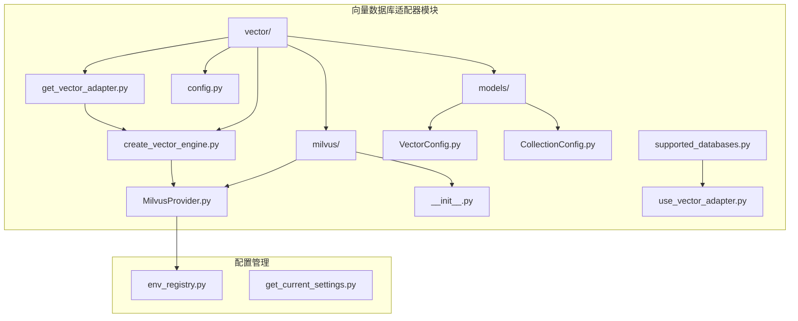
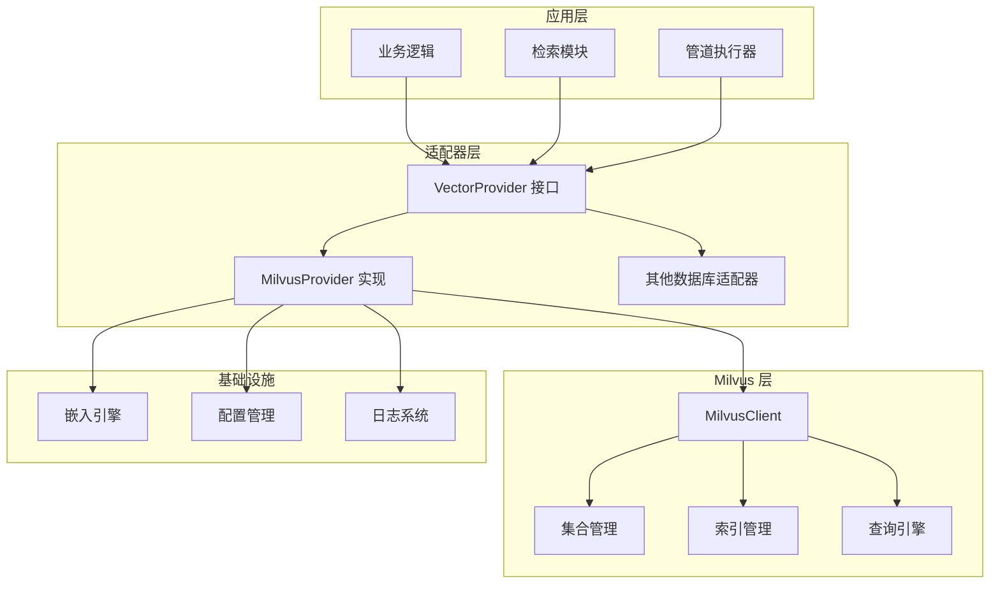
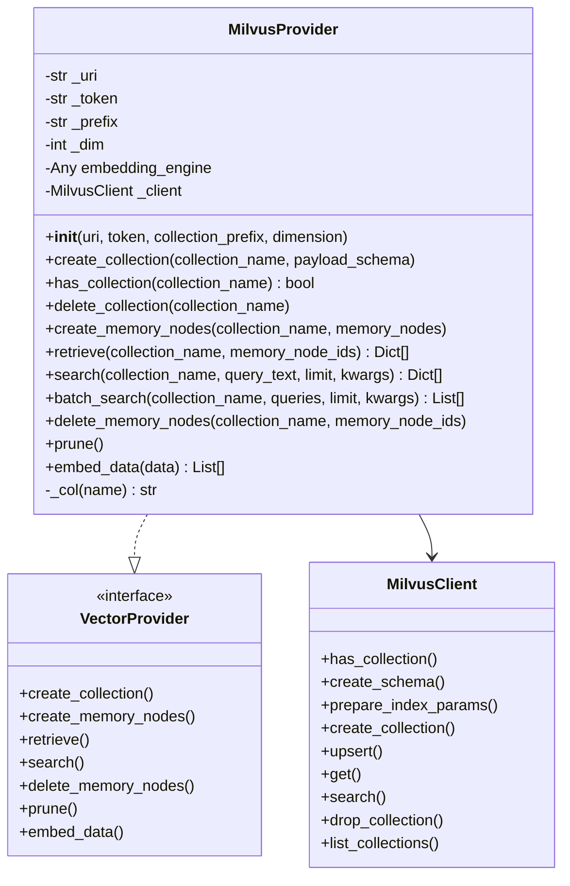
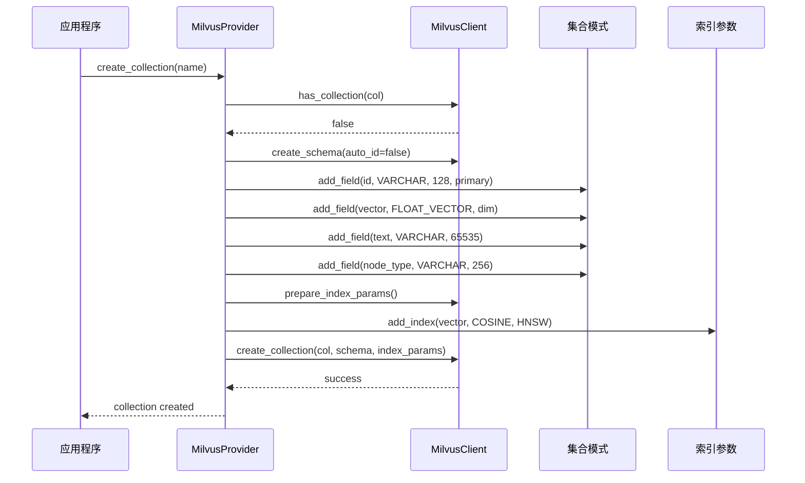
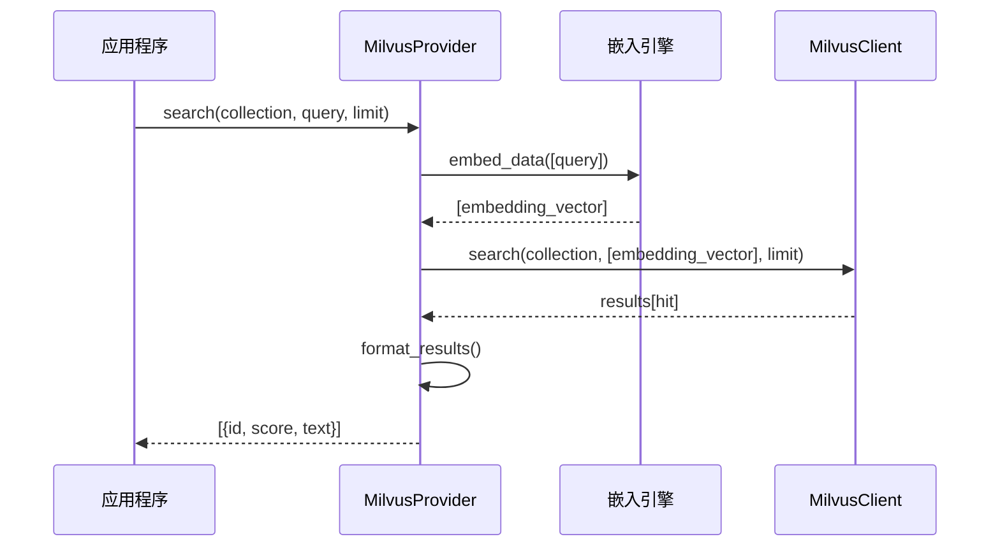
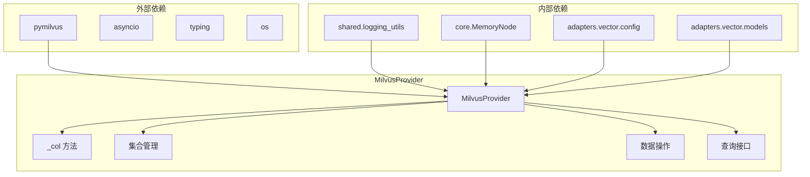
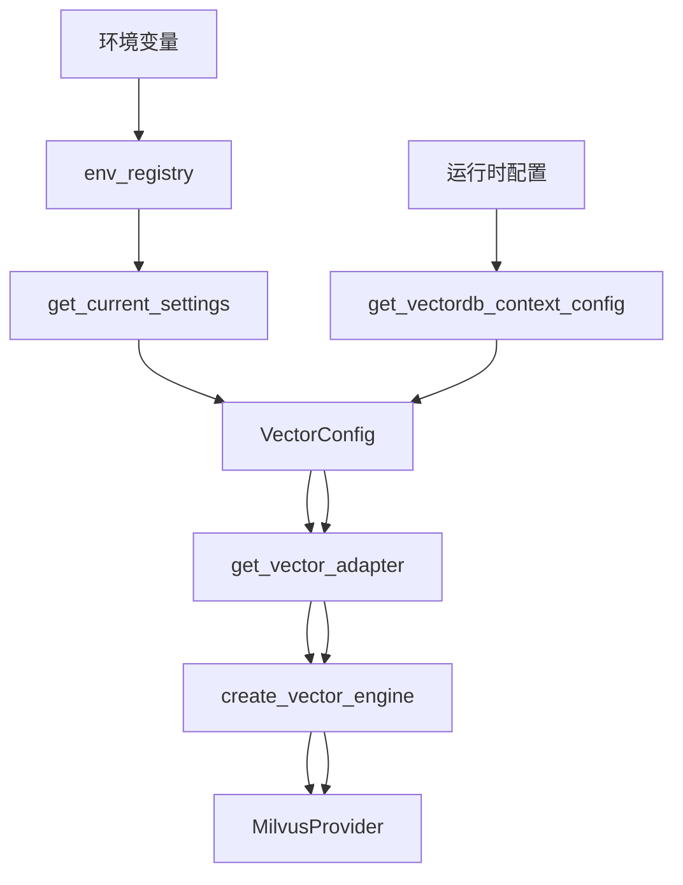

# Milvus 适配器

<cite>
**本文档引用的文件**
- [MilvusProvider.py](file://m_flow/adapters/vector/milvus/MilvusProvider.py)
- [__init__.py](file://m_flow/adapters/vector/milvus/__init__.py)
- [create_vector_engine.py](file://m_flow/adapters/vector/create_vector_engine.py)
- [get_vector_adapter.py](file://m_flow/adapters/vector/get_vector_adapter.py)
- [config.py](file://m_flow/adapters/vector/config.py)
- [VectorConfig.py](file://m_flow/adapters/vector/models/VectorConfig.py)
- [CollectionConfig.py](file://m_flow/adapters/vector/models/CollectionConfig.py)
- [supported_databases.py](file://m_flow/adapters/vector/supported_databases.py)
- [use_vector_adapter.py](file://m_flow/adapters/vector/use_vector_adapter.py)
- [get_current_settings.py](file://m_flow/config/settings/get_current_settings.py)
- [env_registry.py](file://m_flow/config/env_registry.py)
</cite>

## 目录
1. [简介](#简介)
2. [项目结构](#项目结构)
3. [核心组件](#核心组件)
4. [架构概览](#架构概览)
5. [详细组件分析](#详细组件分析)
6. [依赖分析](#依赖分析)
7. [性能考虑](#性能考虑)
8. [故障排除指南](#故障排除指南)
9. [结论](#结论)
10. [附录](#附录)

## 简介

Milvus 适配器是 M-flow 分布式向量数据库系统的核心组件，基于 Milvus/Zilliz 分布式向量数据库构建。该适配器提供了完整的向量存储、检索和管理功能，支持大规模向量相似性搜索、批量数据处理和高并发查询。

Milvus 是一个开源的分布式向量数据库，专为大规模向量数据的存储和检索而设计。它采用分层架构，支持多种索引类型（如 HNSW、IVF、ANNOY 等），具有强大的分布式查询能力和水平扩展能力。在 M-flow 中，Milvus 适配器通过统一的接口抽象，为上层应用提供透明的向量数据库访问能力。

## 项目结构

M-flow 项目中的 Milvus 适配器位于向量数据库适配器模块中，采用模块化设计，便于扩展和维护。



**图表来源**
- [MilvusProvider.py:1-178](file://m_flow/adapters/vector/milvus/MilvusProvider.py#L1-L178)
- [create_vector_engine.py:81-90](file://m_flow/adapters/vector/create_vector_engine.py#L81-L90)
- [config.py:1-77](file://m_flow/adapters/vector/config.py#L1-L77)

**章节来源**
- [MilvusProvider.py:1-178](file://m_flow/adapters/vector/milvus/MilvusProvider.py#L1-L178)
- [__init__.py:1-6](file://m_flow/adapters/vector/milvus/__init__.py#L1-L6)

## 核心组件

### MilvusProvider 类

MilvusProvider 是 Milvus 适配器的核心类，实现了 M-flow VectorProvider 协议。该类提供了完整的向量数据库操作接口，包括集合管理、数据 CRUD 操作和向量搜索功能。

主要特性：
- **分布式连接管理**：支持 Milvus 集群连接，自动处理连接池和重连机制
- **集合生命周期管理**：提供集合的创建、检查、删除等完整生命周期管理
- **向量索引管理**：支持多种索引类型，包括 HNSW、IVF 等
- **批量数据处理**：优化的批量插入和查询接口
- **嵌入引擎集成**：与 M-flow 嵌入引擎无缝集成

### 配置管理系统

M-flow 提供了完善的配置管理系统，支持环境变量配置和运行时配置切换。

核心配置项：
- `VECTOR_DB_PROVIDER=milvus`：指定使用 Milvus 作为向量数据库
- `MILVUS_URI`：Milvus 服务地址，默认 `http://localhost:19530`
- `MILVUS_TOKEN`：认证令牌，支持空令牌或 JWT 认证
- `collection_prefix`：集合前缀，用于命名空间隔离

**章节来源**
- [MilvusProvider.py:28-56](file://m_flow/adapters/vector/milvus/MilvusProvider.py#L28-L56)
- [config.py:26-36](file://m_flow/adapters/vector/config.py#L26-L36)

## 架构概览

M-flow 的 Milvus 适配器采用分层架构设计，确保了良好的可扩展性和维护性。



**图表来源**
- [create_vector_engine.py:81-90](file://m_flow/adapters/vector/create_vector_engine.py#L81-L90)
- [MilvusProvider.py:28-56](file://m_flow/adapters/vector/milvus/MilvusProvider.py#L28-L56)

## 详细组件分析

### MilvusProvider 类设计



**图表来源**
- [MilvusProvider.py:28-178](file://m_flow/adapters/vector/milvus/MilvusProvider.py#L28-L178)

#### 集合管理流程



**图表来源**
- [MilvusProvider.py:65-86](file://m_flow/adapters/vector/milvus/MilvusProvider.py#L65-L86)

#### 向量搜索流程



**图表来源**
- [MilvusProvider.py:130-151](file://m_flow/adapters/vector/milvus/MilvusProvider.py#L130-L151)

### 数据模型设计


**图表来源**
- [MilvusProvider.py:72-76](file://m_flow/adapters/vector/milvus/MilvusProvider.py#L72-L76)
- [VectorConfig.py:20-48](file://m_flow/adapters/vector/models/VectorConfig.py#L20-L48)

**章节来源**
- [MilvusProvider.py:65-178](file://m_flow/adapters/vector/milvus/MilvusProvider.py#L65-L178)
- [VectorConfig.py:20-48](file://m_flow/adapters/vector/models/VectorConfig.py#L20-L48)
- [CollectionConfig.py:15-19](file://m_flow/adapters/vector/models/CollectionConfig.py#L15-L19)

## 依赖分析

### 组件依赖关系



**图表来源**
- [MilvusProvider.py:15-56](file://m_flow/adapters/vector/milvus/MilvusProvider.py#L15-L56)

### 配置依赖链



**图表来源**
- [env_registry.py:117-122](file://m_flow/config/env_registry.py#L117-L122)
- [get_current_settings.py:102-105](file://m_flow/config/settings/get_current_settings.py#L102-L105)
- [config.py:66-77](file://m_flow/adapters/vector/config.py#L66-L77)

**章节来源**
- [create_vector_engine.py:81-90](file://m_flow/adapters/vector/create_vector_engine.py#L81-L90)
- [get_vector_adapter.py:11-19](file://m_flow/adapters/vector/get_vector_adapter.py#L11-L19)

## 性能考虑

### 查询性能优化

Milvus 适配器在设计时充分考虑了性能优化：

1. **索引策略优化**
   - 默认使用 HNSW 索引，支持近似最近邻搜索
   - 支持多种距离度量：余弦相似度、点积等
   - 可配置索引参数以适应不同数据分布

2. **批量操作优化**
   - 批量插入操作减少网络往返
   - 异步查询接口支持并发处理
   - 内存节点缓存机制

3. **内存管理**
   - 自动化的集合前缀管理
   - 资源清理和垃圾回收
   - 连接池管理

### 扩展性设计

1. **水平扩展**
   - 支持 Milvus 集群部署
   - 自动负载均衡和故障转移
   - 分片数据管理

2. **垂直扩展**
   - 可配置的向量维度
   - 灵活的索引类型选择
   - 动态资源分配

**章节来源**
- [MilvusProvider.py:78-86](file://m_flow/adapters/vector/milvus/MilvusProvider.py#L78-L86)
- [env_registry.py:129-153](file://m_flow/config/env_registry.py#L129-L153)

## 故障排除指南

### 常见问题及解决方案

1. **连接失败**
   - 检查 `MILVUS_URI` 环境变量配置
   - 验证 Milvus 服务状态和网络连通性
   - 确认防火墙设置和端口开放情况

2. **认证错误**
   - 验证 `MILVUS_TOKEN` 配置
   - 检查 Milvus 用户权限设置
   - 确认令牌格式和有效期

3. **索引创建失败**
   - 检查向量维度配置是否匹配
   - 验证磁盘空间和内存资源
   - 确认 Milvus 版本兼容性

4. **查询性能问题**
   - 优化索引参数配置
   - 调整批量大小和并发度
   - 检查硬件资源配置

### 调试工具

1. **日志监控**
   - 启用详细日志级别
   - 监控连接状态和查询性能
   - 跟踪异常和错误信息

2. **性能分析**
   - 使用内置性能计数器
   - 监控内存使用情况
   - 分析查询延迟分布

**章节来源**
- [MilvusProvider.py:44-47](file://m_flow/adapters/vector/milvus/MilvusProvider.py#L44-L47)
- [env_registry.py:195-207](file://m_flow/config/env_registry.py#L195-L207)

## 结论

Milvus 适配器为 M-flow 提供了强大而灵活的分布式向量数据库解决方案。通过模块化设计和完善的配置管理，该适配器能够满足大规模向量数据存储和检索的需求。

关键优势：
- **高性能**：基于 Milvus 的分布式架构，支持大规模向量相似性搜索
- **易扩展**：模块化设计支持灵活的功能扩展和定制
- **易于使用**：统一的接口抽象简化了向量数据库的集成和使用
- **可靠性**：完善的错误处理和监控机制确保系统稳定运行

未来发展方向：
- 支持更多 Milvus 索引类型和高级功能
- 优化大规模数据处理性能
- 增强集群管理和监控能力
- 扩展对云原生部署的支持

## 附录

### 配置参数参考

| 参数名 | 默认值 | 描述 | 类型 |
|--------|--------|------|------|
| VECTOR_DB_PROVIDER | milvus | 向量数据库提供商 | str |
| MILVUS_URI | http://localhost:19530 | Milvus 服务地址 | str |
| MILVUS_TOKEN | 空 | 认证令牌 | str |
| collection_prefix | mflow | 集合前缀 | str |
| dimension | 3072 | 向量维度 | int |

### 使用示例

1. **基本配置**
```bash
export VECTOR_DB_PROVIDER=milvus
export MILVUS_URI=http://localhost:19530
export MILVUS_TOKEN=your-token
```

2. **集合管理**
```python
provider = get_vector_provider()
await provider.create_collection("documents")
```

3. **数据插入**
```python
nodes = [memory_node_1, memory_node_2]
await provider.create_memory_nodes("documents", nodes)
```

4. **向量搜索**
```python
results = await provider.search("documents", "查询文本", limit=10)
```

**章节来源**
- [env_registry.py:117-122](file://m_flow/config/env_registry.py#L117-L122)
- [get_current_settings.py:102-105](file://m_flow/config/settings/get_current_settings.py#L102-L105)