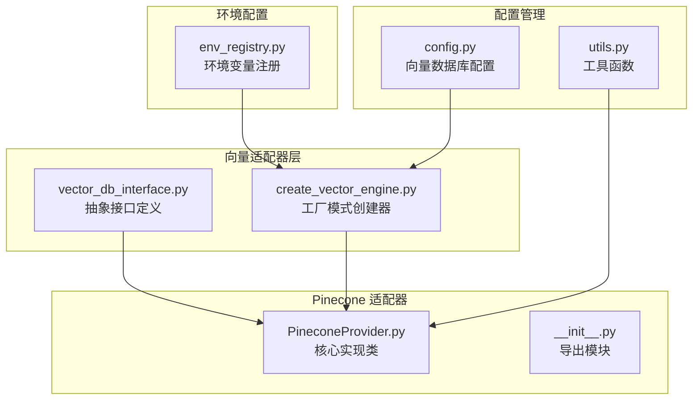
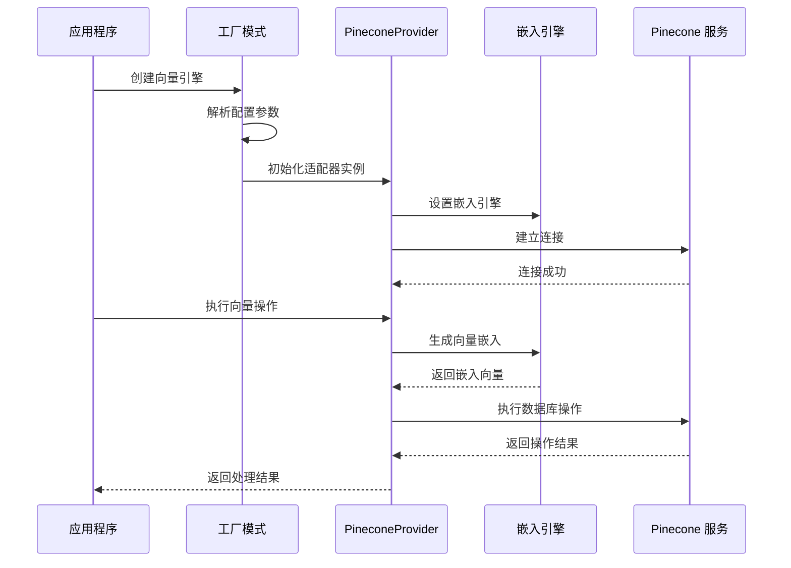
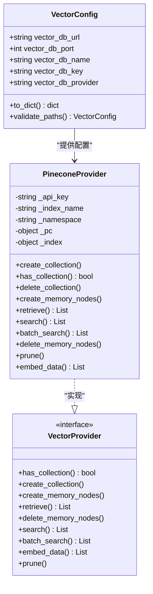
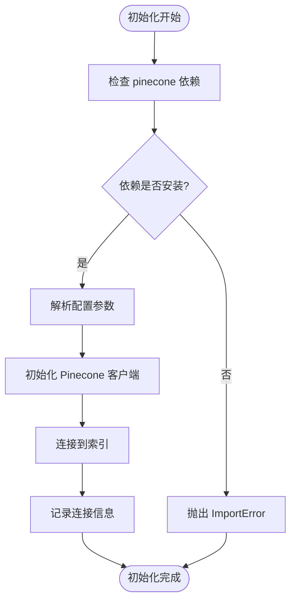
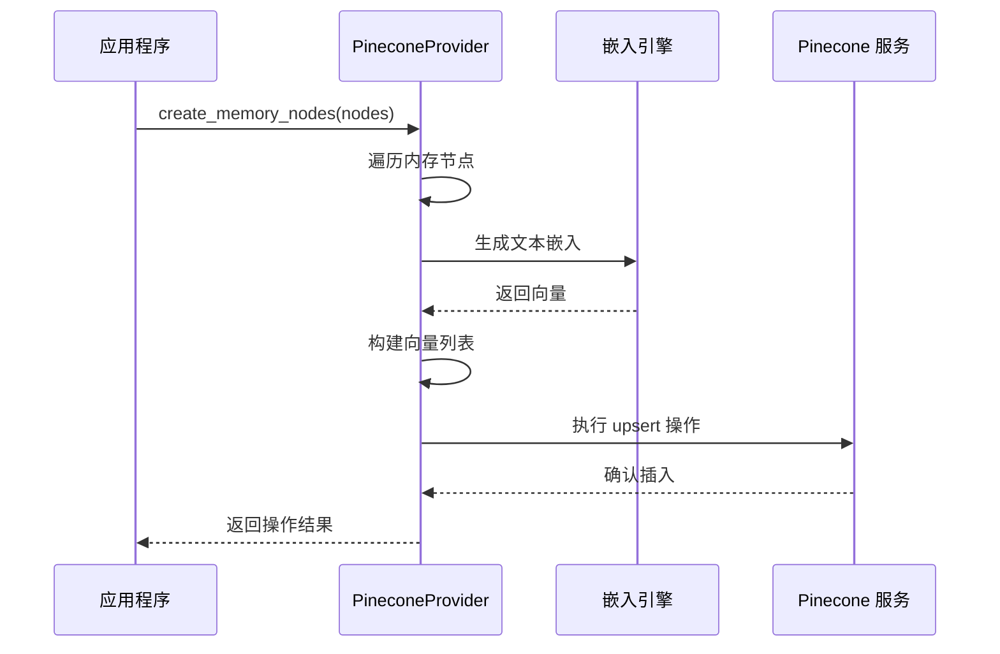
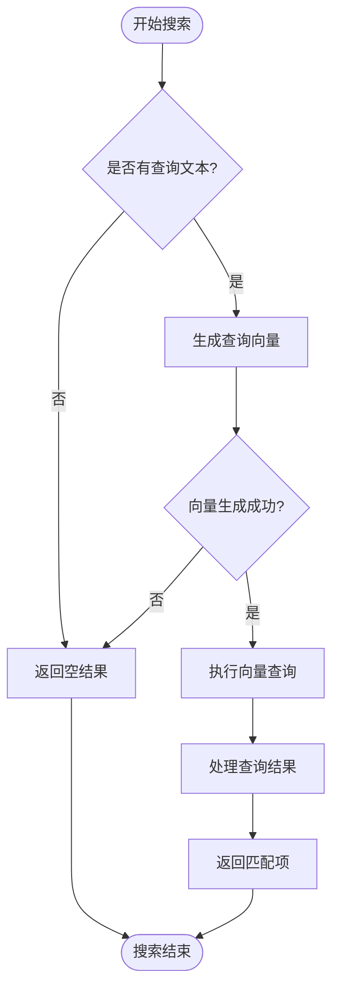
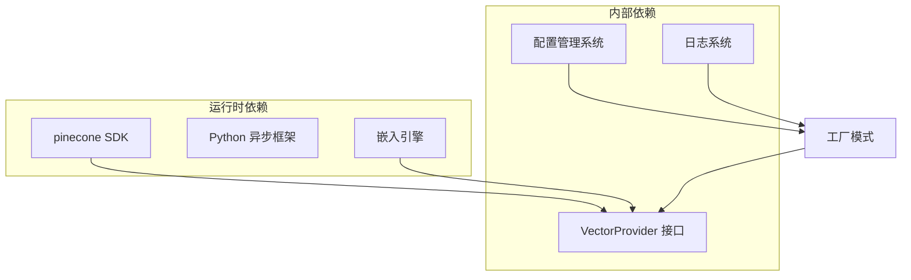

# Pinecone 适配器

<cite>
**本文档引用的文件**
- [PineconeProvider.py](file://m_flow/adapters/vector/pinecone/PineconeProvider.py)
- [__init__.py](file://m_flow/adapters/vector/pinecone/__init__.py)
- [vector_db_interface.py](file://m_flow/adapters/vector/vector_db_interface.py)
- [create_vector_engine.py](file://m_flow/adapters/vector/create_vector_engine.py)
- [config.py](file://m_flow/adapters/vector/config.py)
- [utils.py](file://m_flow/adapters/vector/utils.py)
- [env_registry.py](file://m_flow/config/env_registry.py)
</cite>

## 目录
1. [简介](#简介)
2. [项目结构](#项目结构)
3. [核心组件](#核心组件)
4. [架构概览](#架构概览)
5. [详细组件分析](#详细组件分析)
6. [依赖关系分析](#依赖关系分析)
7. [性能考虑](#性能考虑)
8. [故障排除指南](#故障排除指南)
9. [结论](#结论)

## 简介

Pinecone 适配器是 M-flow 框架中的云原生向量数据库集成模块，专为 Pinecone 托管服务设计。该适配器实现了完整的向量存储、检索和管理功能，支持基于命名空间的多租户隔离，并提供了与嵌入引擎的无缝集成。

Pinecone 作为云原生向量数据库，具有以下核心优势：
- **托管服务架构**：完全托管的向量数据库服务，无需基础设施管理
- **自动扩缩容**：根据负载自动调整资源分配
- **高可用性**：内置数据冗余和故障转移机制
- **全球分布**：支持多区域部署和低延迟访问
- **企业级安全**：提供 API 密钥管理和访问控制

## 项目结构

Pinecone 适配器在 M-flow 项目中的组织结构如下：



**图表来源**
- [PineconeProvider.py:1-148](file://m_flow/adapters/vector/pinecone/PineconeProvider.py#L1-L148)
- [vector_db_interface.py:1-180](file://m_flow/adapters/vector/vector_db_interface.py#L1-L180)
- [create_vector_engine.py:1-166](file://m_flow/adapters/vector/create_vector_engine.py#L1-L166)

**章节来源**
- [PineconeProvider.py:1-148](file://m_flow/adapters/vector/pinecone/PineconeProvider.py#L1-L148)
- [__init__.py:1-6](file://m_flow/adapters/vector/pinecone/__init__.py#L1-L6)

## 核心组件

### PineconeProvider 类

PineconeProvider 是适配器的核心实现类，负责与 Pinecone 云服务进行交互。该类实现了 VectorProvider 协议，提供了完整的向量数据库操作功能。

主要特性：
- **云原生集成**：直接连接 Pinecone 托管服务
- **命名空间支持**：基于命名空间实现多租户隔离
- **异步操作**：所有数据库操作都支持异步执行
- **嵌入引擎集成**：与嵌入模型生成器无缝协作

### 接口协议

VectorProvider 协议定义了向量数据库适配器的标准接口，确保不同数据库实现的一致性。

关键接口包括：
- **集合管理**：创建、检查、删除向量集合
- **内存节点 CRUD**：创建、检索、更新、删除内存节点
- **搜索功能**：语义搜索和批量搜索
- **维护操作**：数据清理和索引管理

**章节来源**
- [vector_db_interface.py:16-180](file://m_flow/adapters/vector/vector_db_interface.py#L16-L180)
- [PineconeProvider.py:28-148](file://m_flow/adapters/vector/pinecone/PineconeProvider.py#L28-L148)

## 架构概览

Pinecone 适配器采用分层架构设计，通过工厂模式实现可插拔的数据库适配器。



**图表来源**
- [create_vector_engine.py:15-112](file://m_flow/adapters/vector/create_vector_engine.py#L15-L112)
- [PineconeProvider.py:36-56](file://m_flow/adapters/vector/pinecone/PineconeProvider.py#L36-L56)

### 配置架构



**图表来源**
- [config.py:26-77](file://m_flow/adapters/vector/config.py#L26-L77)
- [PineconeProvider.py:28-148](file://m_flow/adapters/vector/pinecone/PineconeProvider.py#L28-L148)
- [vector_db_interface.py:16-180](file://m_flow/adapters/vector/vector_db_interface.py#L16-L180)

## 详细组件分析

### 连接管理

PineconeProvider 的初始化过程涉及多个关键步骤：

1. **依赖检查**：验证 pinecone SDK 是否已安装
2. **配置解析**：从构造函数参数或环境变量获取配置
3. **客户端初始化**：创建 Pinecone 客户端实例
4. **索引连接**：建立到指定索引的连接



**图表来源**
- [PineconeProvider.py:44-56](file://m_flow/adapters/vector/pinecone/PineconeProvider.py#L44-L56)

### 向量存储操作

Pinecone 适配器支持多种向量存储操作：

#### 批量插入操作流程



**图表来源**
- [PineconeProvider.py:76-95](file://m_flow/adapters/vector/pinecone/PineconeProvider.py#L76-L95)

#### 搜索操作实现

搜索功能支持单次和批量查询：



**图表来源**
- [PineconeProvider.py:101-131](file://m_flow/adapters/vector/pinecone/PineconeProvider.py#L101-L131)

### 配置参数详解

Pinecone 适配器支持以下配置参数：

| 参数名称 | 环境变量 | 默认值 | 描述 |
|---------|----------|--------|------|
| api_key | PINECONE_API_KEY | "" | Pinecone API 密钥 |
| index_name | PINECONE_INDEX_NAME | "m_flow" | 要连接的索引名称 |
| namespace | 构造函数参数 | "default" | 命名空间标识符 |
| embedding_engine | 自动注入 | None | 嵌入模型生成器 |

**章节来源**
- [PineconeProvider.py:36-56](file://m_flow/adapters/vector/pinecone/PineconeProvider.py#L36-L56)
- [config.py:29-34](file://m_flow/adapters/vector/config.py#L29-L34)

### 安全配置指南

#### API 密钥管理

Pinecone 适配器支持多种 API 密钥配置方式：

1. **环境变量配置**（推荐）
   ```bash
   export PINECONE_API_KEY=your_api_key_here
   export VECTOR_DB_PROVIDER=pinecone
   export PINECONE_INDEX_NAME=your_index_name
   ```

2. **构造函数参数**
   ```python
   provider = PineconeProvider(
       api_key="your_api_key_here",
       index_name="your_index_name"
   )
   ```

3. **配置文件方式**
   在项目根目录创建 `.env` 文件：
   ```
   PINECONE_API_KEY=your_api_key_here
   VECTOR_DB_PROVIDER=pinecone
   PINECONE_INDEX_NAME=your_index_name
   ```

#### 访问控制

Pinecone 服务端提供以下安全特性：
- **API 密钥认证**：每个请求都需要有效的 API 密钥
- **网络访问控制**：支持 IP 白名单
- **加密传输**：所有数据传输都经过 TLS 加密
- **审计日志**：详细的 API 调用记录

**章节来源**
- [PineconeProvider.py:6-11](file://m_flow/adapters/vector/pinecone/PineconeProvider.py#L6-L11)

### 实际使用示例

#### 基本向量搜索

```python
# 初始化向量引擎
from m_flow.adapters.vector.create_vector_engine import create_vector_engine

vector_engine = create_vector_engine(
    vector_db_provider="pinecone",
    vector_db_key="your_api_key",
    vector_db_name="your_index_name"
)

# 执行向量搜索
results = await vector_engine.search(
    collection_name="your_namespace",
    query_text="搜索查询文本",
    limit=10
)
```

#### 批量数据插入

```python
# 准备内存节点数据
memory_nodes = [
    # 内存节点对象
]

# 批量插入向量
await vector_engine.create_memory_nodes(
    collection_name="your_namespace",
    memory_nodes=memory_nodes
)
```

#### 多租户命名空间管理

```python
# 为不同租户使用独立命名空间
tenant_namespaces = ["tenant_a", "tenant_b", "tenant_c"]

for namespace in tenant_namespaces:
    # 检查命名空间是否存在
    exists = await vector_engine.has_collection(namespace)
    
    # 执行操作
    results = await vector_engine.search(
        collection_name=namespace,
        query_text="查询内容"
    )
```

**章节来源**
- [create_vector_engine.py:71-79](file://m_flow/adapters/vector/create_vector_engine.py#L71-L79)
- [PineconeProvider.py:76-138](file://m_flow/adapters/vector/pinecone/PineconeProvider.py#L76-L138)

## 依赖关系分析

### 外部依赖

Pinecone 适配器的主要外部依赖包括：



**图表来源**
- [PineconeProvider.py:44-47](file://m_flow/adapters/vector/pinecone/PineconeProvider.py#L44-L47)
- [create_vector_engine.py:15-112](file://m_flow/adapters/vector/create_vector_engine.py#L15-L112)

### 内部耦合关系

适配器与框架其他组件的集成关系：

| 组件 | 依赖关系 | 用途 |
|------|----------|------|
| VectorProvider | 接口实现 | 标准化向量操作接口 |
| create_vector_engine | 工厂模式 | 统一的适配器创建入口 |
| config.py | 配置解析 | 环境变量和配置文件处理 |
| utils.py | 工具函数 | 结果处理和距离计算 |

**章节来源**
- [vector_db_interface.py:16-180](file://m_flow/adapters/vector/vector_db_interface.py#L16-L180)
- [create_vector_engine.py:15-112](file://m_flow/adapters/vector/create_vector_engine.py#L15-L112)

## 性能考虑

### 查询优化策略

Pinecone 适配器在性能优化方面采用了以下策略：

1. **批量操作**：支持批量向量插入和查询，减少网络往返
2. **异步处理**：所有数据库操作都支持异步执行
3. **嵌入缓存**：与嵌入引擎集成，避免重复的向量生成
4. **命名空间隔离**：通过命名空间实现数据隔离，提高查询效率

### 成本优化建议

1. **合理设置索引大小**：根据数据量和查询频率选择合适的索引配置
2. **优化查询参数**：合理设置 top_k 和过滤条件，避免不必要的计算
3. **批量操作**：尽量使用批量插入和批量查询，减少 API 调用次数
4. **命名空间管理**：合理规划命名空间，避免过度细分导致的管理开销

## 故障排除指南

### 常见问题及解决方案

#### 连接问题

**问题**：无法连接到 Pinecone 服务
**可能原因**：
- API 密钥无效
- 索引名称错误
- 网络连接问题

**解决方案**：
1. 验证 API 密钥的有效性
2. 检查索引名称是否正确
3. 确认网络连接正常

#### 性能问题

**问题**：查询响应时间过长
**可能原因**：
- 查询向量生成失败
- 索引配置不当
- 网络延迟

**解决方案**：
1. 检查嵌入引擎配置
2. 优化查询参数设置
3. 考虑使用更接近用户的区域

#### 数据一致性问题

**问题**：查询结果不一致
**可能原因**：
- 命名空间数据冲突
- 并发写入导致的数据竞争

**解决方案**：
1. 使用适当的命名空间隔离
2. 实现适当的并发控制机制
3. 定期执行数据清理操作

**章节来源**
- [PineconeProvider.py:44-47](file://m_flow/adapters/vector/pinecone/PineconeProvider.py#L44-L47)
- [PineconeProvider.py:136-138](file://m_flow/adapters/vector/pinecone/PineconeProvider.py#L136-L138)

## 结论

Pinecone 适配器为 M-flow 框架提供了强大而灵活的云原生向量数据库解决方案。通过实现标准的 VectorProvider 接口，该适配器能够无缝集成到现有的向量检索管道中，同时充分利用 Pinecone 云服务的托管优势。

主要优势包括：
- **简化部署**：无需管理复杂的基础设施
- **弹性扩展**：自动适应负载变化
- **高可用性**：内置的数据冗余和故障转移
- **企业安全**：完善的访问控制和审计功能

对于需要快速部署向量检索功能的应用场景，Pinecone 适配器是一个理想的选择。通过合理的配置和优化，可以在保证性能的同时控制成本，满足各种规模的应用需求。