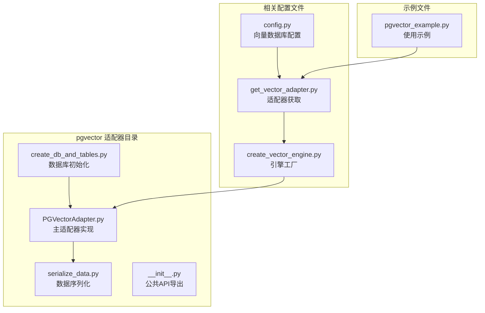
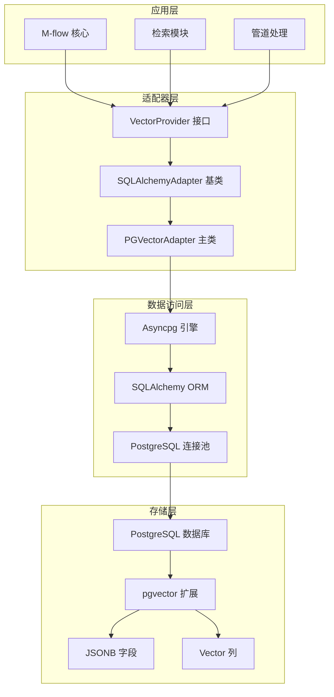
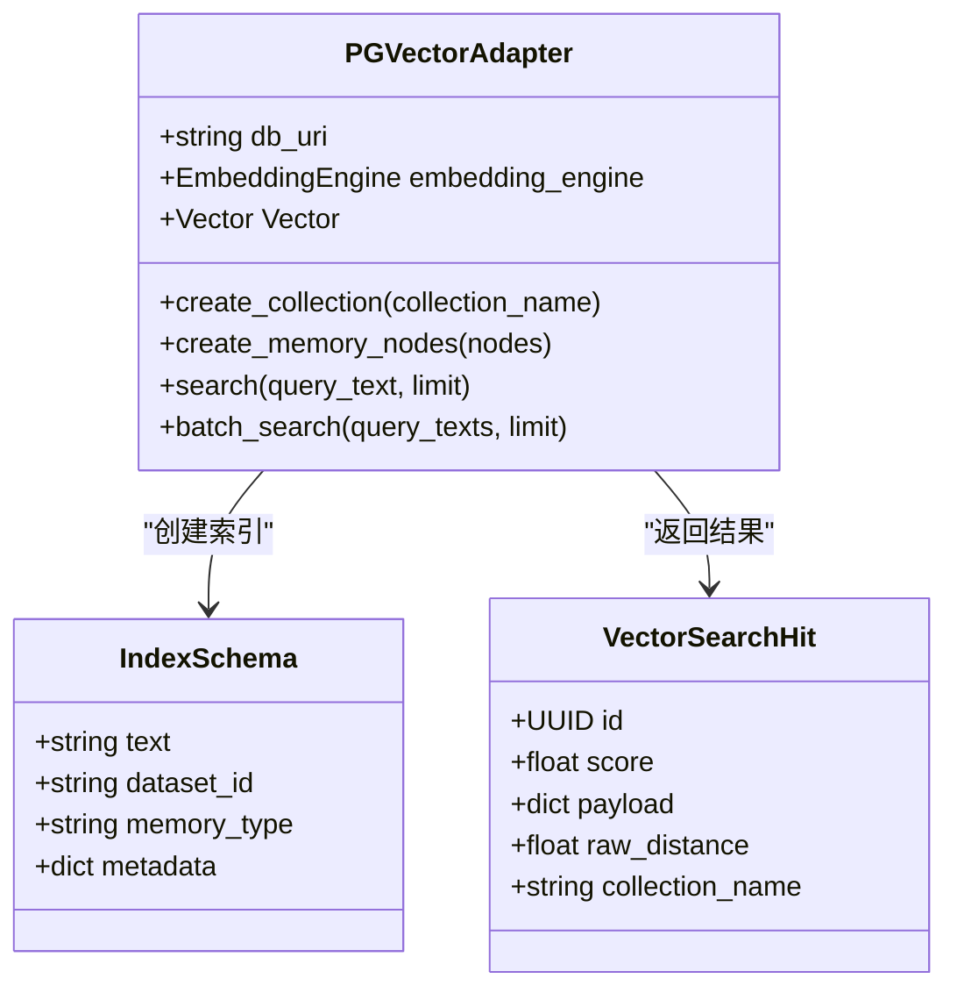
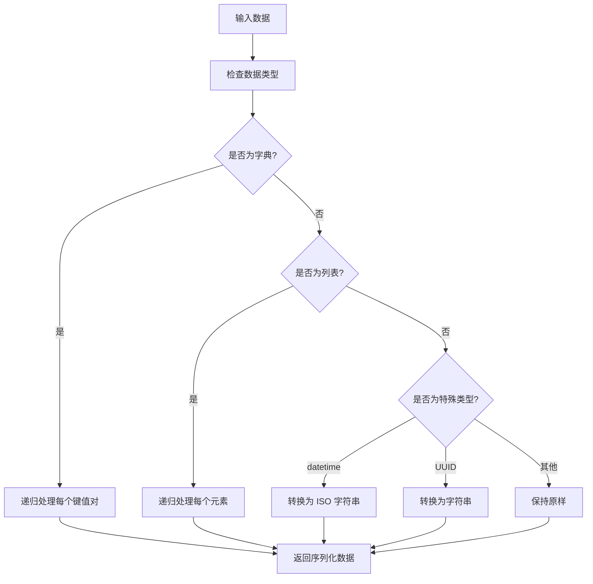
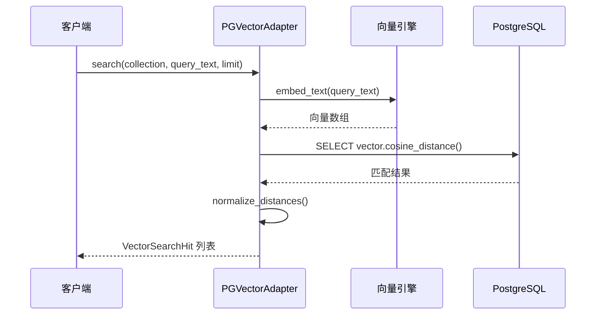
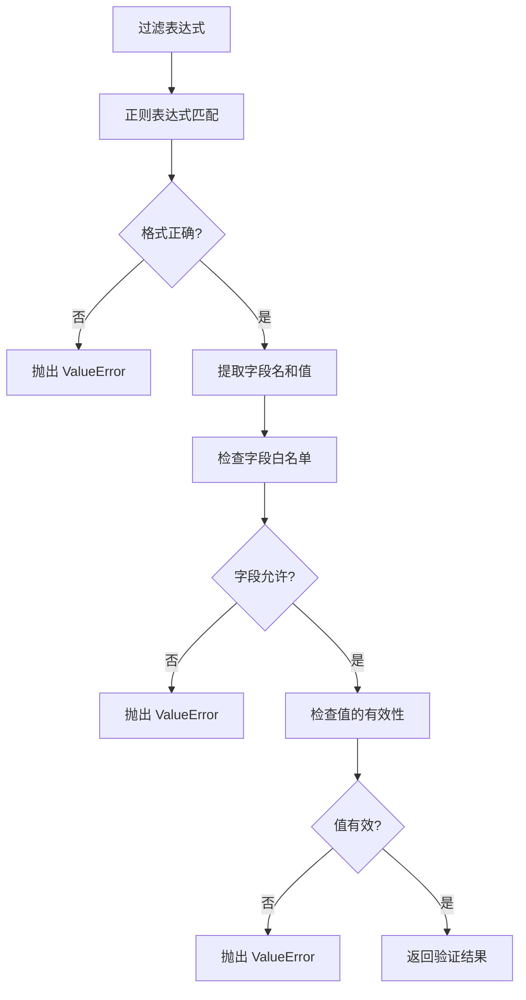
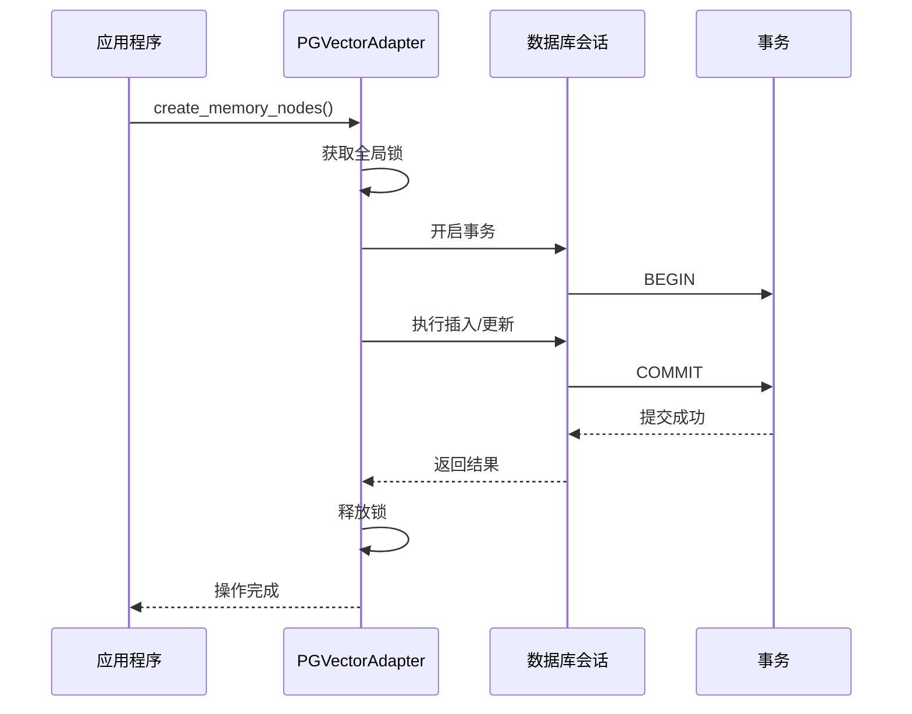
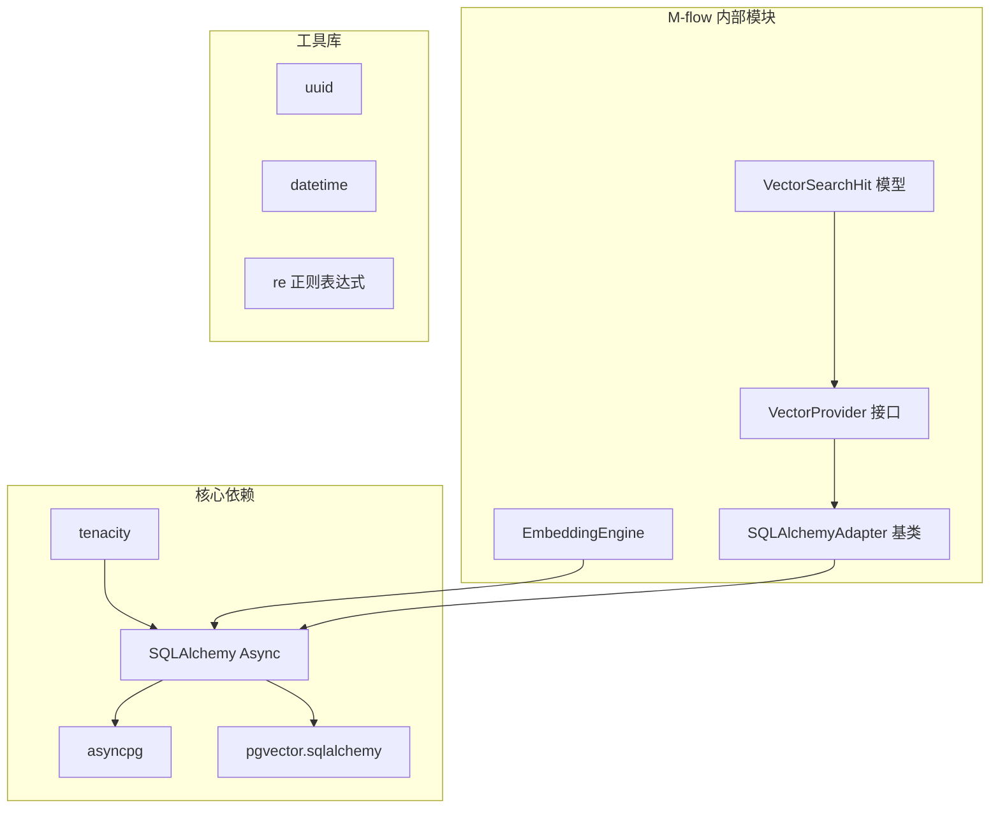
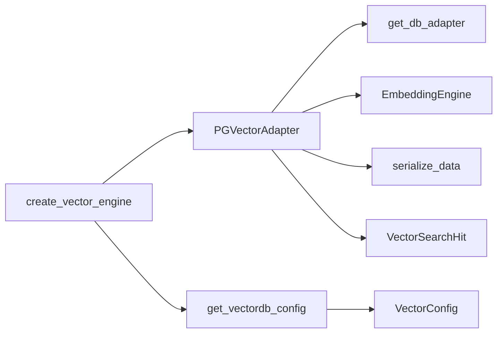
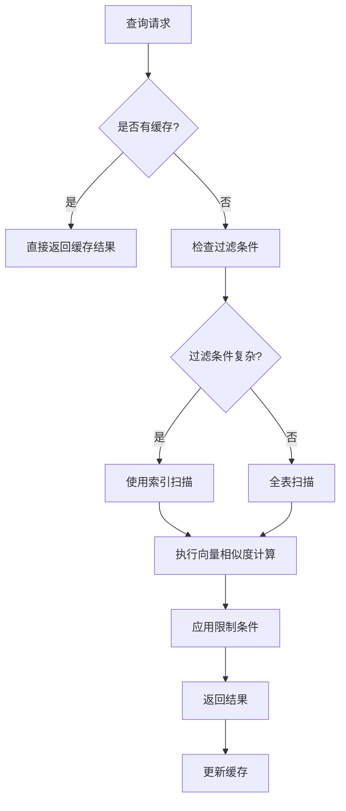

# PostgreSQL/pgvector 适配器

<cite>
**本文档引用的文件**
- [PGVectorAdapter.py](file://m_flow/adapters/vector/pgvector/PGVectorAdapter.py)
- [create_db_and_tables.py](file://m_flow/adapters/vector/pgvector/create_db_and_tables.py)
- [serialize_data.py](file://m_flow/adapters/vector/pgvector/serialize_data.py)
- [create_vector_engine.py](file://m_flow/adapters/vector/create_vector_engine.py)
- [get_vector_adapter.py](file://m_flow/adapters/vector/get_vector_adapter.py)
- [config.py](file://m_flow/adapters/vector/config.py)
- [VectorSearchHit.py](file://m_flow/adapters/vector/models/VectorSearchHit.py)
- [pgvector_example.py](file://examples/database_examples/pgvector_example.py)
</cite>

## 目录
1. [简介](#简介)
2. [项目结构](#项目结构)
3. [核心组件](#核心组件)
4. [架构概览](#架构概览)
5. [详细组件分析](#详细组件分析)
6. [依赖关系分析](#依赖关系分析)
7. [性能考虑](#性能考虑)
8. [故障排除指南](#故障排除指南)
9. [结论](#结论)
10. [附录](#附录)

## 简介

PostgreSQL/pgvector 适配器是 M-flow 框架中的一个关键组件，它为 PostgreSQL 数据库提供了向量相似性搜索功能。该适配器利用了 PostgreSQL 的 pgvector 扩展，实现了 SQL 兼容性、ACID 事务支持和复杂的查询能力。

pgvector 是一个强大的 PostgreSQL 扩展，它为向量数据类型提供了原生支持，使得开发者可以在关系型数据库中存储和查询向量数据。通过这个适配器，M-flow 能够充分利用 PostgreSQL 的成熟生态系统，同时提供现代向量数据库的功能。

## 项目结构

M-flow 中的 PostgreSQL/pgvector 适配器位于 `m_flow/adapters/vector/pgvector/` 目录下，主要包含以下核心文件：



**图表来源**
- [PGVectorAdapter.py:1-445](file://m_flow/adapters/vector/pgvector/PGVectorAdapter.py#L1-L445)
- [create_db_and_tables.py:1-21](file://m_flow/adapters/vector/pgvector/create_db_and_tables.py#L1-L21)
- [config.py:1-77](file://m_flow/adapters/vector/config.py#L1-L77)

**章节来源**
- [PGVectorAdapter.py:1-445](file://m_flow/adapters/vector/pgvector/PGVectorAdapter.py#L1-L445)
- [create_db_and_tables.py:1-21](file://m_flow/adapters/vector/pgvector/create_db_and_tables.py#L1-L21)
- [config.py:1-77](file://m_flow/adapters/vector/config.py#L1-L77)

## 核心组件

### PGVectorAdapter 类

PGVectorAdapter 是适配器的核心类，继承自 SQLAlchemyAdapter 和 VectorProvider 接口。它提供了完整的向量数据库功能：

- **向量存储**: 使用 PostgreSQL 的 Vector 数据类型存储向量
- **相似性搜索**: 支持余弦距离、欧几里得距离等多种距离度量
- **批量操作**: 支持批量插入、更新和删除操作
- **过滤查询**: 支持基于 JSON 字段的复杂过滤条件
- **事务支持**: 完整的 ACID 事务保证

### 数据序列化系统

serialize_data 模块负责将 Python 对象转换为 PostgreSQL 友好的格式：

- **日期时间处理**: 将 datetime 对象转换为 ISO 8601 字符串
- **UUID 序列化**: 将 UUID 对象转换为字符串表示
- **递归处理**: 支持嵌套的数据结构处理

### 数据库初始化

create_db_and_tables 函数负责在首次使用时创建必要的数据库扩展：

- **扩展检查**: 自动检测并创建 vector 扩展
- **异步执行**: 使用 SQLAlchemy 异步引擎确保线程安全

**章节来源**
- [PGVectorAdapter.py:96-125](file://m_flow/adapters/vector/pgvector/PGVectorAdapter.py#L96-L125)
- [serialize_data.py:24-53](file://m_flow/adapters/vector/pgvector/serialize_data.py#L24-L53)
- [create_db_and_tables.py:13-21](file://m_flow/adapters/vector/pgvector/create_db_and_tables.py#L13-L21)

## 架构概览

PostgreSQL/pgvector 适配器采用分层架构设计，确保了良好的模块化和可扩展性：



**图表来源**
- [PGVectorAdapter.py:96-125](file://m_flow/adapters/vector/pgvector/PGVectorAdapter.py#L96-L125)
- [create_vector_engine.py:114-131](file://m_flow/adapters/vector/create_vector_engine.py#L114-L131)

该架构的关键特点：

1. **接口抽象**: 通过 VectorProvider 接口实现适配器的统一抽象
2. **继承复用**: PGVectorAdapter 继承自 SQLAlchemyAdapter，复用其数据库连接管理功能
3. **异步支持**: 全面使用异步编程模式，提高并发性能
4. **错误处理**: 内置重试机制和异常处理策略

## 详细组件分析

### 向量数据类型和存储机制

PGVectorAdapter 使用 PostgreSQL 的原生向量数据类型来存储向量数据：



**图表来源**
- [PGVectorAdapter.py:96-445](file://m_flow/adapters/vector/pgvector/PGVectorAdapter.py#L96-L445)
- [VectorSearchHit.py:13-52](file://m_flow/adapters/vector/models/VectorSearchHit.py#L13-L52)

#### 向量存储结构

每个向量记录包含三个核心字段：

1. **id**: 主键，使用 UUID 类型确保唯一性
2. **payload**: JSONB 字段，存储元数据和原始内容
3. **vector**: 向量字段，使用 PostgreSQL 的 Vector 类型

#### 序列化处理流程



**图表来源**
- [serialize_data.py:15-53](file://m_flow/adapters/vector/pgvector/serialize_data.py#L15-L53)

**章节来源**
- [PGVectorAdapter.py:154-173](file://m_flow/adapters/vector/pgvector/PGVectorAdapter.py#L154-L173)
- [serialize_data.py:24-53](file://m_flow/adapters/vector/pgvector/serialize_data.py#L24-L53)

### 相似度搜索实现

PGVectorAdapter 提供了多种相似度搜索方法：

#### 单次搜索流程



**图表来源**
- [PGVectorAdapter.py:307-385](file://m_flow/adapters/vector/pgvector/PGVectorAdapter.py#L307-L385)

#### 批量搜索优化

批量搜索通过并行处理多个查询来提高效率：


**图表来源**
- [PGVectorAdapter.py:387-407](file://m_flow/adapters/vector/pgvector/PGVectorAdapter.py#L387-L407)

**章节来源**
- [PGVectorAdapter.py:307-407](file://m_flow/adapters/vector/pgvector/PGVectorAdapter.py#L307-L407)

### 过滤查询和复杂查询

适配器支持基于 JSON 字段的复杂过滤条件：

#### 过滤表达式验证



**图表来源**
- [PGVectorAdapter.py:60-82](file://m_flow/adapters/vector/pgvector/PGVectorAdapter.py#L60-L82)

**章节来源**
- [PGVectorAdapter.py:47-82](file://m_flow/adapters/vector/pgvector/PGVectorAdapter.py#L47-L82)

### 事务管理和并发控制

PGVectorAdapter 实现了完善的事务管理和并发控制机制：

#### 并发安全策略

1. **全局锁**: 使用 asyncio.Lock() 确保集合创建的原子性
2. **重试机制**: 对死锁、唯一约束冲突等异常进行指数退避重试
3. **连接复用**: 复用现有的 PostgreSQL 连接，避免额外的连接开销

#### 事务边界



**图表来源**
- [PGVectorAdapter.py:174-255](file://m_flow/adapters/vector/pgvector/PGVectorAdapter.py#L174-L255)

**章节来源**
- [PGVectorAdapter.py:108-125](file://m_flow/adapters/vector/pgvector/PGVectorAdapter.py#L108-L125)
- [PGVectorAdapter.py:174-255](file://m_flow/adapters/vector/pgvector/PGVectorAdapter.py#L174-L255)

## 依赖关系分析

### 外部依赖

PGVectorAdapter 依赖于多个关键库：



**图表来源**
- [PGVectorAdapter.py:14-43](file://m_flow/adapters/vector/pgvector/PGVectorAdapter.py#L14-L43)

### 内部模块交互



**图表来源**
- [create_vector_engine.py:114-131](file://m_flow/adapters/vector/create_vector_engine.py#L114-L131)
- [get_vector_adapter.py:11-19](file://m_flow/adapters/vector/get_vector_adapter.py#L11-L19)

**章节来源**
- [create_vector_engine.py:114-131](file://m_flow/adapters/vector/create_vector_engine.py#L114-L131)
- [get_vector_adapter.py:11-19](file://m_flow/adapters/vector/get_vector_adapter.py#L11-L19)

## 性能考虑

### 索引策略

虽然当前实现主要依赖 PostgreSQL 的原生向量类型，但可以结合以下策略优化性能：

1. **向量维度优化**: 根据嵌入模型选择合适的向量维度
2. **批量操作**: 使用批量插入和更新减少网络往返
3. **连接池**: 复用数据库连接避免频繁建立连接
4. **查询缓存**: 对热门查询结果进行缓存

### 查询优化



**图表来源**
- [PGVectorAdapter.py:307-385](file://m_flow/adapters/vector/pgvector/PGVectorAdapter.py#L307-L385)

### 错误处理和恢复

适配器实现了多层次的错误处理机制：

1. **重试策略**: 对暂时性错误（如死锁）自动重试
2. **异常分类**: 区分永久性错误和可恢复错误
3. **资源清理**: 确保在异常情况下正确释放资源

**章节来源**
- [PGVectorAdapter.py:137-141](file://m_flow/adapters/vector/pgvector/PGVectorAdapter.py#L137-L141)
- [PGVectorAdapter.py:174-178](file://m_flow/adapters/vector/pgvector/PGVectorAdapter.py#L174-L178)

## 故障排除指南

### 常见问题和解决方案

#### 连接问题

**问题**: 无法连接到 PostgreSQL 数据库
**解决方案**: 
1. 检查数据库连接字符串格式
2. 验证数据库凭据的正确性
3. 确认数据库服务正在运行

#### 权限问题

**问题**: 创建表或扩展时权限不足
**解决方案**:
1. 确保数据库用户具有 CREATE 权限
2. 检查数据库扩展安装权限
3. 验证数据库角色配置

#### 性能问题

**问题**: 查询响应时间过长
**解决方案**:
1. 检查向量维度是否过大
2. 优化过滤条件的使用
3. 考虑添加适当的索引

**章节来源**
- [create_vector_engine.py:119-122](file://m_flow/adapters/vector/create_vector_engine.py#L119-L122)
- [PGVectorAdapter.py:137-141](file://m_flow/adapters/vector/pgvector/PGVectorAdapter.py#L137-L141)

## 结论

PostgreSQL/pgvector 适配器为 M-flow 框架提供了强大而灵活的向量存储解决方案。通过充分利用 PostgreSQL 的成熟特性和 pgvector 扩展的强大功能，该适配器实现了：

1. **完整的 SQL 兼容性**: 支持标准 SQL 查询和事务
2. **ACID 事务支持**: 确保数据一致性和可靠性
3. **高性能向量搜索**: 优化的相似度计算和查询执行
4. **灵活的扩展性**: 易于集成和扩展的架构设计

该适配器特别适合需要结合结构化数据查询和语义搜索的应用场景，为现代 AI 应用提供了坚实的数据基础。

## 附录

### 使用示例

以下是一个完整的使用示例，展示了如何配置和使用 PGVector 适配器：

```python
# 设置向量数据库配置
m_flow.config.set_vector_db_config({"vector_db_provider": "pgvector"})

# 配置关系数据库连接
m_flow.config.set_relational_db_config({
    "db_host": os.getenv("POSTGRES_HOST", "localhost"),
    "db_port": os.getenv("POSTGRES_PORT", "5432"),
    "db_name": os.getenv("POSTGRES_DB", "mflow_store"),
    "db_username": os.getenv("POSTGRES_USER", "m_flow"),
    "db_password": os.getenv("POSTGRES_PASSWORD", "m_flow"),
    "db_provider": "postgres",
})

# 初始化数据库
await m_flow.prune.prune_data()
await m_flow.prune.prune_system(metadata=True)

# 添加数据并进行搜索
await m_flow.add([SAMPLE], DATASET)
await m_flow.memorize([DATASET])

results = await m_flow.search(
    query_type=RecallMode.TRIPLET_COMPLETION, 
    query_text="vector search in PostgreSQL"
)
```

**章节来源**
- [pgvector_example.py:18-48](file://examples/database_examples/pgvector_example.py#L18-L48)

### 配置选项

| 配置项 | 类型 | 默认值 | 描述 |
|--------|------|--------|------|
| vector_db_provider | string | "lancedb" | 向量数据库提供商名称 |
| vector_db_url | string | "" | 数据库连接 URL |
| vector_db_name | string | "" | 数据库名称 |
| vector_db_port | integer | 1234 | 数据库端口号 |
| vector_db_key | string | "" | API 密钥 |

**章节来源**
- [config.py:26-77](file://m_flow/adapters/vector/config.py#L26-L77)