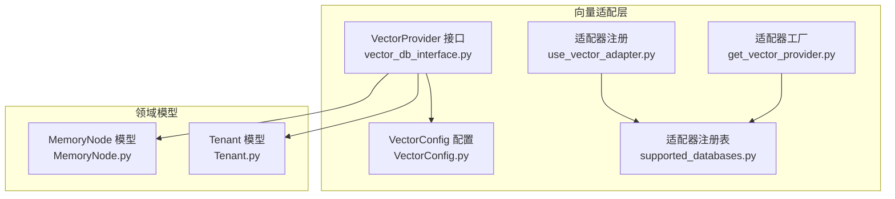
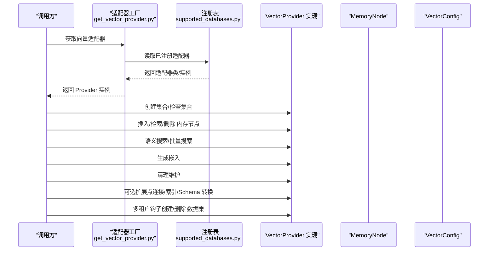
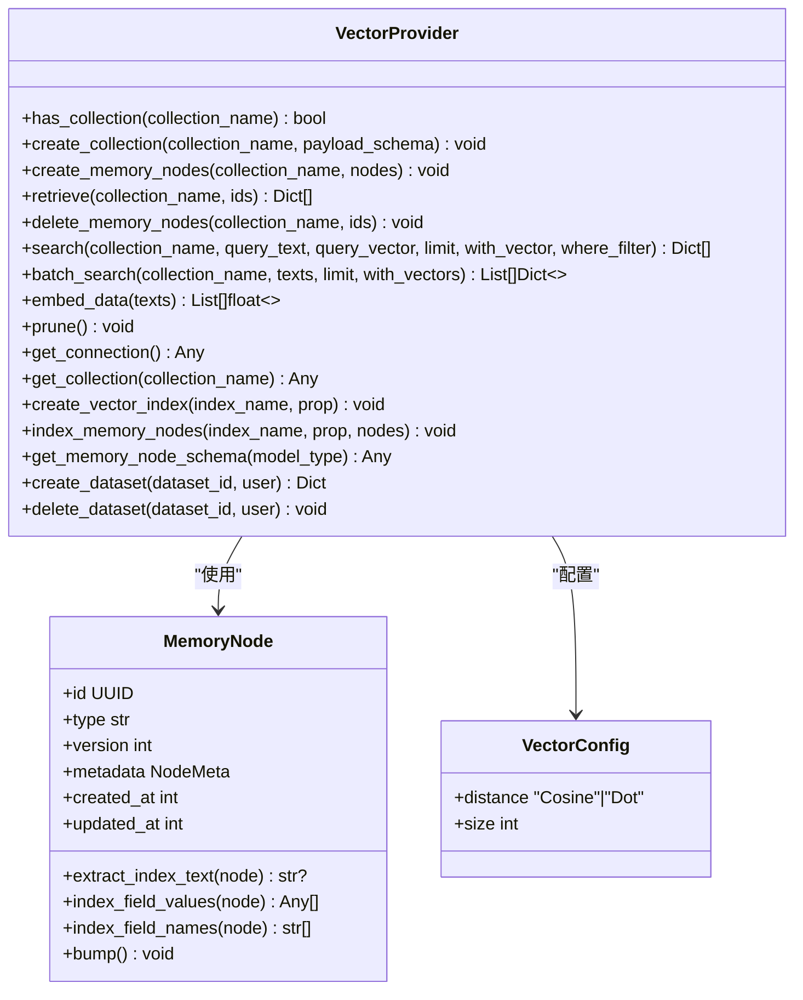

# 向量数据库接口规范

<cite>
**本文引用的文件**
- [vector_db_interface.py](file://m_flow/adapters/vector/vector_db_interface.py)
- [MemoryNode.py](file://m_flow/core/models/MemoryNode.py)
- [Tenant.py](file://m_flow/auth/models/Tenant.py)
- [VectorConfig.py](file://m_flow/adapters/vector/models/VectorConfig.py)
- [get_vector_adapter.py](file://m_flow/adapters/vector/get_vector_adapter.py)
- [use_vector_adapter.py](file://m_flow/adapters/vector/use_vector_adapter.py)
- [supported_databases.py](file://m_flow/adapters/vector/supported_databases.py)
</cite>

## 目录
1. [简介](#简介)
2. [项目结构](#项目结构)
3. [核心组件](#核心组件)
4. [架构总览](#架构总览)
5. [详细组件分析](#详细组件分析)
6. [依赖分析](#依赖分析)
7. [性能考虑](#性能考虑)
8. [故障排查指南](#故障排查指南)
9. [结论](#结论)
10. [附录](#附录)

## 简介
本文件系统化阐述向量数据库适配器接口规范，重点围绕 VectorProvider 协议的设计与抽象接口定义，覆盖集合管理、内存节点 CRUD、语义搜索、嵌入生成与维护操作等核心能力；同时明确可选扩展点（连接获取、集合句柄、向量索引创建、内存节点索引）的默认行为，解释多租户生命周期钩子（数据集创建与删除），并提供异步编程模式、错误处理策略与性能优化建议。为便于落地，文档给出实现路径与使用场景指引。

## 项目结构
与向量数据库接口规范直接相关的模块组织如下：
- 接口协议：VectorProvider 定义于 vector_db_interface.py
- 核心数据模型：MemoryNode（知识图谱中的内存节点）
- 多租户模型：Tenant（组织隔离）
- 配置模型：VectorConfig（距离度量、向量维度）
- 适配器工厂与注册：get_vector_provider、use_vector_adapter、supported_databases

图表来源
- [vector_db_interface.py:16-180](file://m_flow/adapters/vector/vector_db_interface.py#L16-L180)
- [VectorConfig.py:20-48](file://m_flow/adapters/vector/models/VectorConfig.py#L20-L48)
- [get_vector_adapter.py:11-19](file://m_flow/adapters/vector/get_vector_adapter.py#L11-L19)
- [use_vector_adapter.py:10-13](file://m_flow/adapters/vector/use_vector_adapter.py#L10-L13)
- [supported_databases.py:7-8](file://m_flow/adapters/vector/supported_databases.py#L7-L8)
- [MemoryNode.py:27-106](file://m_flow/core/models/MemoryNode.py#L27-L106)
- [Tenant.py:24-74](file://m_flow/auth/models/Tenant.py#L24-L74)

章节来源
- [vector_db_interface.py:16-180](file://m_flow/adapters/vector/vector_db_interface.py#L16-L180)
- [VectorConfig.py:20-48](file://m_flow/adapters/vector/models/VectorConfig.py#L20-L48)
- [get_vector_adapter.py:11-19](file://m_flow/adapters/vector/get_vector_adapter.py#L11-L19)
- [use_vector_adapter.py:10-13](file://m_flow/adapters/vector/use_vector_adapter.py#L10-L13)
- [supported_databases.py:7-8](file://m_flow/adapters/vector/supported_databases.py#L7-L8)
- [MemoryNode.py:27-106](file://m_flow/core/models/MemoryNode.py#L27-L106)
- [Tenant.py:24-74](file://m_flow/auth/models/Tenant.py#L24-L74)

## 核心组件
- VectorProvider 协议：定义集合管理、内存节点 CRUD、语义搜索、批量搜索、嵌入生成、维护清理以及可选扩展点与多租户钩子。
- MemoryNode：带版本化、元数据与嵌入辅助方法的知识图谱节点。
- VectorConfig：向量存储配置（距离度量、维度）。
- 适配器工厂与注册：按运行时配置实例化具体向量数据库引擎，并注册可用适配器。

章节来源
- [vector_db_interface.py:16-180](file://m_flow/adapters/vector/vector_db_interface.py#L16-L180)
- [MemoryNode.py:27-106](file://m_flow/core/models/MemoryNode.py#L27-L106)
- [VectorConfig.py:20-48](file://m_flow/adapters/vector/models/VectorConfig.py#L20-L48)
- [get_vector_adapter.py:11-19](file://m_flow/adapters/vector/get_vector_adapter.py#L11-L19)
- [use_vector_adapter.py:10-13](file://m_flow/adapters/vector/use_vector_adapter.py#L10-L13)
- [supported_databases.py:7-8](file://m_flow/adapters/vector/supported_databases.py#L7-L8)

## 架构总览
下图展示 VectorProvider 在系统中的角色与交互：

图表来源
- [get_vector_adapter.py:11-19](file://m_flow/adapters/vector/get_vector_adapter.py#L11-L19)
- [supported_databases.py:7-8](file://m_flow/adapters/vector/supported_databases.py#L7-L8)
- [vector_db_interface.py:16-180](file://m_flow/adapters/vector/vector_db_interface.py#L16-L180)
- [MemoryNode.py:27-106](file://m_flow/core/models/MemoryNode.py#L27-L106)
- [VectorConfig.py:20-48](file://m_flow/adapters/vector/models/VectorConfig.py#L20-L48)

## 详细组件分析

### VectorProvider 协议详解
VectorProvider 是一个异步协议，定义了以下能力域与方法签名要点（参数、返回值、用途与注意事项）：

- 集合管理
  - has_collection(collection_name: str) -> bool
    - 用途：判断集合是否存在
    - 参数：集合名称（字符串）
    - 返回：布尔值
  - create_collection(collection_name: str, payload_schema: Optional[Any] = None) -> None
    - 用途：创建集合，可选传入负载模式
    - 参数：集合名、可选负载模式对象
    - 返回：无
    - 注意：payload_schema 由具体后端解释

- 内存节点 CRUD
  - create_memory_nodes(collection_name: str, memory_nodes: List[MemoryNode]) -> None
    - 用途：批量插入内存节点
    - 参数：集合名、节点列表（MemoryNode）
    - 返回：无
  - retrieve(collection_name: str, memory_node_ids: List[str]) -> List[Dict[str, Any]]
    - 用途：按 ID 批量检索节点
    - 参数：集合名、节点 ID 列表（字符串）
    - 返回：节点字典列表
  - delete_memory_nodes(collection_name: str, memory_node_ids: List[str]) -> None
    - 用途：按 ID 批量删除节点
    - 参数：集合名、节点 ID 列表（字符串）
    - 返回：无

- 搜索
  - search(
      collection_name: str,
      query_text: Optional[str] = None,
      query_vector: Optional[List[float]] = None,
      limit: Optional[int] = None,
      with_vector: bool = False,
      where_filter: Optional[str] = None,
    ) -> List[Dict[str, Any]]
    - 用途：基于文本或向量进行语义检索
    - 参数：
      - 集合名
      - 查询文本或查询向量二选一
      - 结果上限
      - 是否返回向量
      - SQL-like 过滤表达式（where_filter）
    - 返回：匹配结果字典列表
    - 注意：where_filter 用于后过滤
  - batch_search(
      collection_name: str,
      query_texts: List[str],
      limit: Optional[int] = None,
      with_vectors: bool = False,
    ) -> List[List[Dict[str, Any]]]
    - 用途：对多个查询文本执行批量语义检索
    - 参数：集合名、查询文本列表、结果上限、是否返回向量
    - 返回：每个查询对应的结果列表

- 嵌入
  - embed_data(texts: List[str]) -> List[List[float]]
    - 用途：为文本生成向量嵌入
    - 参数：文本列表
    - 返回：向量列表

- 维护
  - prune() -> None
    - 用途：清理陈旧或孤立数据
    - 返回：无

- 可选扩展点（默认实现）
  - get_connection() -> Any
    - 用途：返回底层连接对象（默认返回 None）
  - get_collection(collection_name: str) -> Any
    - 用途：返回集合句柄（默认返回 None）
  - create_vector_index(index_name: str, index_property_name: str) -> None
    - 用途：为属性创建向量索引（默认空操作）
  - index_memory_nodes(index_name: str, index_property_name: str, memory_nodes: List[MemoryNode]) -> None
    - 用途：对节点进行索引以加速检索（默认空操作）
  - get_memory_node_schema(model_type: Any) -> Any
    - 用途：将通用模型转换为后端特定 Schema（默认返回原类型）

- 多租户钩子
  - create_dataset(dataset_id: Optional[UUID], user: Optional[User]) -> Dict[str, Any]
    - 用途：为新数据集预置向量存储资源
    - 返回：需持久化的连接信息字典（默认空字典）
  - delete_dataset(dataset_id: UUID, user: User) -> None
    - 用途：释放数据集对应的向量存储资源
    - 返回：无（默认空操作）

实现建议与约束
- 所有方法均为异步，遵循事件循环与并发模型
- where_filter 的语法与支持取决于具体后端
- embed_data 的输入文本数量与长度应受后端限制
- create_vector_index 与 index_memory_nodes 通常在写入前或批量导入后调用
- 多租户钩子用于在关系数据库中保存/清理向量存储连接信息

章节来源
- [vector_db_interface.py:16-180](file://m_flow/adapters/vector/vector_db_interface.py#L16-L180)

### MemoryNode 数据模型
MemoryNode 是知识图谱中的基础节点，具备以下关键特性：
- 版本化与时间戳：id、type、version、created_at、updated_at
- 元数据：metadata（含 type 与 index_fields），用于指定参与嵌入与检索的字段
- 时间提及字段：mentioned_time_*，支持时间相关检索
- 嵌入辅助方法：
  - extract_index_text(node)：拼接 index_fields 为单个文本
  - index_field_values / index_field_names：获取索引字段值与名称列表
- 版本推进：bump() 增加版本并更新时间戳

这些字段与方法为 VectorProvider 的嵌入生成与检索提供了基础数据支撑。

章节来源
- [MemoryNode.py:27-106](file://m_flow/core/models/MemoryNode.py#L27-L106)

### 多租户钩子设计
- create_dataset(dataset_id, user) -> Dict[str, Any]
  - 生命周期：在创建数据集时触发，用于为该数据集准备向量存储资源
  - 返回：应包含可在关系数据库中持久化的连接信息（如连接参数、命名空间等）
- delete_dataset(dataset_id, user) -> None
  - 生命周期：在删除数据集时触发，用于回收向量存储资源
- Tenant 模型
  - 提供组织隔离能力，与数据集/集合的命名空间策略配合，确保跨租户数据隔离

章节来源
- [vector_db_interface.py:160-179](file://m_flow/adapters/vector/vector_db_interface.py#L160-L179)
- [Tenant.py:24-74](file://m_flow/auth/models/Tenant.py#L24-L74)

### 适配器工厂与注册
- get_vector_provider()
  - 依据上下文配置动态选择并实例化向量数据库引擎
  - 通过上下文变量影响配置解析（如异步上下文）
- use_vector_adapter(name, adapter)
  - 将具体适配器注册到 supported_databases 映射中
- supported_databases
  - 适配器注册表，键为适配器名称，值为适配器类或实例

章节来源
- [get_vector_adapter.py:11-19](file://m_flow/adapters/vector/get_vector_adapter.py#L11-L19)
- [use_vector_adapter.py:10-13](file://m_flow/adapters/vector/use_vector_adapter.py#L10-L13)
- [supported_databases.py:7-8](file://m_flow/adapters/vector/supported_databases.py#L7-L8)

### 配置模型 VectorConfig
- distance: "Cosine" 或 "Dot"
  - Cosine：角度相似度（归一化）
  - Dot：点积（非归一化）
- size: int（>0）
  - 嵌入向量维度，必须与所选嵌入模型输出一致

章节来源
- [VectorConfig.py:20-48](file://m_flow/adapters/vector/models/VectorConfig.py#L20-L48)

## 依赖分析
- VectorProvider 依赖 MemoryNode（用于 CRUD 与嵌入文本提取）、VectorConfig（用于距离度量与维度一致性）
- 适配器工厂依赖注册表以解析当前上下文下的适配器实现
- 多租户钩子依赖 Tenant 与 User 类型（在协议注释中声明）

图表来源
- [vector_db_interface.py:16-180](file://m_flow/adapters/vector/vector_db_interface.py#L16-L180)
- [MemoryNode.py:27-106](file://m_flow/core/models/MemoryNode.py#L27-L106)
- [VectorConfig.py:20-48](file://m_flow/adapters/vector/models/VectorConfig.py#L20-L48)

## 性能考虑
- 异步并发：所有方法为异步，建议在高并发场景下复用连接与会话，避免频繁创建销毁
- 批量操作：优先使用批量插入（create_memory_nodes）、批量搜索（batch_search）减少往返
- 索引策略：在写入前或导入阶段调用 create_vector_index 与 index_memory_nodes，显著提升检索性能
- 嵌入缓存：对重复文本进行缓存，避免重复调用 embed_data
- 过滤与限制：合理设置 where_filter 与 limit，减少结果集规模
- 维护清理：定期调用 prune，保持向量存储健康状态

## 故障排查指南
- 方法未实现
  - 若具体后端未实现某可选扩展点，默认行为为返回 None 或空操作，不会抛出异常
- 参数不匹配
  - embed_data 的 size 必须与 VectorConfig.size 一致
  - search/batch_search 的查询文本与向量二选一，且 limit/with_vector/with_vectors 使用需符合后端支持
- 连接与句柄
  - get_connection()/get_collection() 默认返回 None，若后端需要显式连接，请在实现中覆盖
- 多租户
  - create_dataset 应返回可持久化的连接信息；delete_dataset 应清理对应资源
- 错误处理策略
  - 对外暴露统一的异常包装，区分网络/配置/数据不一致等错误类别
  - 在批量操作中采用部分失败重试与日志记录，避免整体回滚导致的长尾延迟

## 结论
VectorProvider 协议以清晰的职责划分与可选扩展点，为多种向量数据库提供了统一抽象。结合 MemoryNode 的嵌入辅助方法与 VectorConfig 的配置约束，开发者可以快速实现兼容的向量存储适配器，并通过索引与批处理等手段获得良好性能。多租户钩子则为跨组织隔离与资源治理提供了可落地的生命周期管理方案。

## 附录

### 接口方法一览与最佳实践清单
- 集合管理
  - has_collection：先查后建，避免重复创建
  - create_collection：传入 payload_schema 以约束字段类型
- 内存节点 CRUD
  - create_memory_nodes：分批写入，控制批次大小
  - retrieve/delete_memory_nodes：按 ID 批处理，注意去重
- 搜索
  - search：优先使用向量查询；where_filter 仅做后过滤
  - batch_search：合并请求，减少网络开销
- 嵌入
  - embed_data：文本去重与缓存，严格校验 size
- 维护
  - prune：周期性任务，避免在高峰期执行
- 可选扩展点
  - get_connection/get_collection：按需返回，避免不必要的对象创建
  - create_vector_index/index_memory_nodes：在导入阶段集中执行
  - get_memory_node_schema：必要时进行字段映射与类型转换
- 多租户钩子
  - create_dataset：返回可序列化的连接信息
  - delete_dataset：幂等清理，避免残留