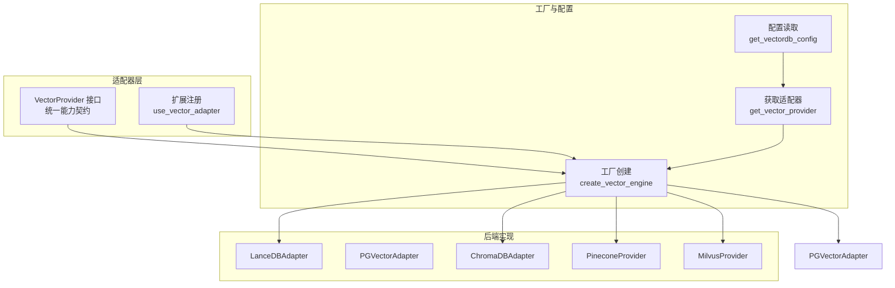
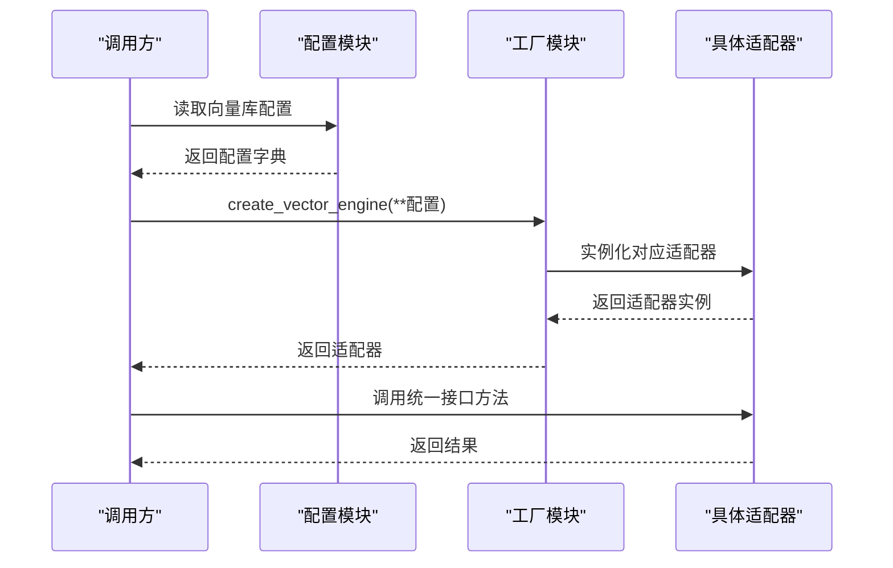
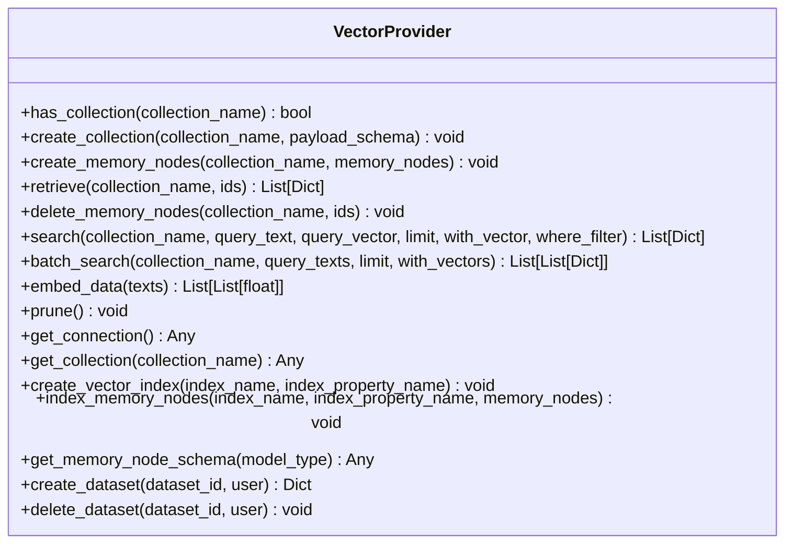
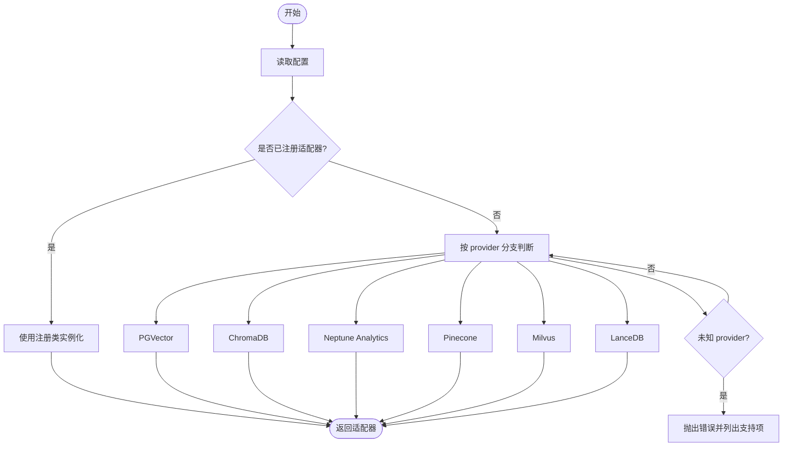
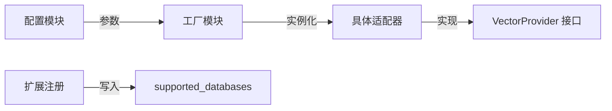

# 向量数据库适配器

<cite>
**本文引用的文件**
- [m_flow/adapters/vector/__init__.py](file://m_flow/adapters/vector/__init__.py)
- [m_flow/adapters/vector/vector_db_interface.py](file://m_flow/adapters/vector/vector_db_interface.py)
- [m_flow/adapters/vector/config.py](file://m_flow/adapters/vector/config.py)
- [m_flow/adapters/vector/create_vector_engine.py](file://m_flow/adapters/vector/create_vector_engine.py)
- [m_flow/adapters/vector/get_vector_adapter.py](file://m_flow/adapters/vector/get_vector_adapter.py)
- [m_flow/adapters/vector/supported_databases.py](file://m_flow/adapters/vector/supported_databases.py)
- [m_flow/adapters/vector/use_vector_adapter.py](file://m_flow/adapters/vector/use_vector_adapter.py)
- [m_flow/adapters/vector/utils.py](file://m_flow/adapters/vector/utils.py)
</cite>

## 目录
1. [简介](#简介)
2. [项目结构](#项目结构)
3. [核心组件](#核心组件)
4. [架构总览](#架构总览)
5. [详细组件分析](#详细组件分析)
6. [依赖分析](#依赖分析)
7. [性能考虑](#性能考虑)
8. [故障排查指南](#故障排查指南)
9. [结论](#结论)
10. [附录](#附录)

## 简介
本文件面向向量数据库适配器的系统化技术文档，聚焦于统一接口架构与适配器模式在多后端（LanceDB、PGVector、ChromaDB、Pinecone、Milvus 等）中的落地实践。文档从设计原理出发，梳理接口契约、工厂创建流程、配置管理与扩展机制，并对嵌入引擎集成、索引与查询优化、迁移与选型建议进行系统阐述，帮助读者在不改变上层调用方式的前提下，平滑切换或扩展向量存储后端。

## 项目结构
向量数据库适配器位于 m_flow/adapters/vector 目录下，采用“接口 + 工厂 + 配置 + 扩展注册”的分层组织方式：
- 接口层：定义统一的 VectorProvider 协议，约束集合管理、CRUD、搜索、批量搜索、嵌入生成、维护等能力。
- 工厂层：根据运行时配置动态创建具体适配器实例，内置对 PGVector、ChromaDB、LanceDB、Pinecone、Milvus 等的支持，并支持自定义扩展注册。
- 配置层：集中管理向量数据库连接参数与默认值，支持环境变量注入与路径规范化。
- 扩展层：提供 use_vector_adapter 注册函数，允许第三方适配器加入支持列表。
- 工具层：提供结果归一化等辅助工具，保障跨后端评分一致性。

图表来源
- [m_flow/adapters/vector/vector_db_interface.py:16-180](file://m_flow/adapters/vector/vector_db_interface.py#L16-L180)
- [m_flow/adapters/vector/create_vector_engine.py:15-112](file://m_flow/adapters/vector/create_vector_engine.py#L15-L112)
- [m_flow/adapters/vector/get_vector_adapter.py:11-19](file://m_flow/adapters/vector/get_vector_adapter.py#L11-L19)
- [m_flow/adapters/vector/config.py:26-77](file://m_flow/adapters/vector/config.py#L26-L77)
- [m_flow/adapters/vector/use_vector_adapter.py:10-13](file://m_flow/adapters/vector/use_vector_adapter.py#L10-L13)

章节来源
- [m_flow/adapters/vector/__init__.py:1-7](file://m_flow/adapters/vector/__init__.py#L1-L7)
- [m_flow/adapters/vector/vector_db_interface.py:16-180](file://m_flow/adapters/vector/vector_db_interface.py#L16-L180)
- [m_flow/adapters/vector/config.py:26-77](file://m_flow/adapters/vector/config.py#L26-L77)
- [m_flow/adapters/vector/create_vector_engine.py:15-166](file://m_flow/adapters/vector/create_vector_engine.py#L15-L166)
- [m_flow/adapters/vector/get_vector_adapter.py:11-19](file://m_flow/adapters/vector/get_vector_adapter.py#L11-L19)
- [m_flow/adapters/vector/supported_databases.py:7-8](file://m_flow/adapters/vector/supported_databases.py#L7-L8)
- [m_flow/adapters/vector/use_vector_adapter.py:10-13](file://m_flow/adapters/vector/use_vector_adapter.py#L10-L13)
- [m_flow/adapters/vector/utils.py:13-46](file://m_flow/adapters/vector/utils.py#L13-L46)

## 核心组件
- 统一接口 VectorProvider：定义集合管理、内存节点 CRUD、语义搜索与批量搜索、嵌入生成、维护清理以及可选扩展点（如索引创建、Schema 转换、多租户数据集生命周期钩子）。该协议确保上层业务以一致方式调用不同后端。
- 工厂 create_vector_engine：依据 provider 名称与连接参数，按优先级匹配已注册适配器，再回退到内置分支（PGVector、ChromaDB、LanceDB、Pinecone、Milvus、Neptune Analytics），并负责缺失依赖的异常提示。
- 配置管理 get_vectordb_config：封装向量数据库连接参数（URL、端口、名称、密钥、提供商、数据集处理器），并对本地路径进行绝对化处理，默认 LanceDB 存储位置位于系统根目录下的 databases 子目录。
- 获取适配器 get_vector_provider：从上下文或单例中读取当前配置，交由工厂创建具体实例，便于在异步上下文中保持配置一致性。
- 扩展注册 use_vector_adapter：将自定义适配器类登记至 supported_databases 字典，实现“即插即用”式的后端扩展。
- 工具函数 normalize_distances：对搜索结果的距离进行最小-最大归一化，保证不同后端返回的相似度可比性。

章节来源
- [m_flow/adapters/vector/vector_db_interface.py:16-180](file://m_flow/adapters/vector/vector_db_interface.py#L16-L180)
- [m_flow/adapters/vector/create_vector_engine.py:15-166](file://m_flow/adapters/vector/create_vector_engine.py#L15-L166)
- [m_flow/adapters/vector/config.py:26-77](file://m_flow/adapters/vector/config.py#L26-L77)
- [m_flow/adapters/vector/get_vector_adapter.py:11-19](file://m_flow/adapters/vector/get_vector_adapter.py#L11-L19)
- [m_flow/adapters/vector/use_vector_adapter.py:10-13](file://m_flow/adapters/vector/use_vector_adapter.py#L10-L13)
- [m_flow/adapters/vector/utils.py:13-46](file://m_flow/adapters/vector/utils.py#L13-L46)

## 架构总览
适配器模式通过统一接口屏蔽底层差异，工厂根据配置动态选择实现，扩展点允许第三方无缝接入。整体流程如下：

图表来源
- [m_flow/adapters/vector/get_vector_adapter.py:11-19](file://m_flow/adapters/vector/get_vector_adapter.py#L11-L19)
- [m_flow/adapters/vector/create_vector_engine.py:15-112](file://m_flow/adapters/vector/create_vector_engine.py#L15-L112)
- [m_flow/adapters/vector/vector_db_interface.py:16-180](file://m_flow/adapters/vector/vector_db_interface.py#L16-L180)

## 详细组件分析

### 接口层：VectorProvider 协议
- 能力范围
  - 集合管理：has_collection、create_collection
  - 内存节点 CRUD：create_memory_nodes、retrieve、delete_memory_nodes
  - 搜索：search（支持文本或向量查询）、batch_search（批量查询）
  - 嵌入：embed_data（文本转向量）
  - 维护：prune（清理过期或孤立数据）
  - 可选扩展：get_connection、get_collection、create_vector_index、index_memory_nodes、get_memory_node_schema
  - 多租户钩子：create_dataset、delete_dataset
- 设计要点
  - 异步方法签名统一，便于在高并发场景下解耦 IO
  - where_filter 支持 SQL-like 表达式用于后过滤，增强检索灵活性
  - 默认空实现与可选扩展点降低具体实现负担

图表来源
- [m_flow/adapters/vector/vector_db_interface.py:16-180](file://m_flow/adapters/vector/vector_db_interface.py#L16-L180)

章节来源
- [m_flow/adapters/vector/vector_db_interface.py:16-180](file://m_flow/adapters/vector/vector_db_interface.py#L16-L180)

### 工厂层：create_vector_engine
- 优先级
  - 已注册适配器：从 supported_databases 映射类名到实现
  - 内置分支：PGVector、ChromaDB、Neptune Analytics、Pinecone、Milvus、LanceDB
- 参数与校验
  - 从 get_embedding_engine 获取嵌入引擎实例
  - 对 PGVector：从关系型配置构造连接字符串；校验必要字段
  - 对 ChromaDB：校验依赖安装
  - 对 Neptune Analytics：校验 URL 前缀与图 ID
  - 对 Pinecone/Milvus：传入 API Key/Token、索引名/集合前缀等
- 错误处理
  - 未知 provider 抛出 EnvironmentError，列出已知支持项
  - 缺失依赖抛出 ImportError，并给出安装指引

图表来源
- [m_flow/adapters/vector/create_vector_engine.py:15-166](file://m_flow/adapters/vector/create_vector_engine.py#L15-L166)

章节来源
- [m_flow/adapters/vector/create_vector_engine.py:15-166](file://m_flow/adapters/vector/create_vector_engine.py#L15-L166)

### 配置层：get_vectordb_config
- 关键字段
  - vector_db_url、vector_db_port、vector_db_name、vector_db_key、vector_db_provider、vector_dataset_database_handler
- 路径处理
  - 若为本地路径且存在，则转换为绝对路径
  - 若为空则默认指向系统根目录下的 LanceDB 数据库文件
- 上下文读取
  - 提供 get_vectordb_context_config，优先从全局上下文变量读取，否则回退到单例配置

章节来源
- [m_flow/adapters/vector/config.py:26-77](file://m_flow/adapters/vector/config.py#L26-L77)

### 获取适配器：get_vector_provider
- 作用：从上下文或单例读取配置，调用工厂创建适配器实例
- 适用场景：异步上下文、多租户隔离、测试替身注入

章节来源
- [m_flow/adapters/vector/get_vector_adapter.py:11-19](file://m_flow/adapters/vector/get_vector_adapter.py#L11-L19)

### 扩展注册：use_vector_adapter
- 作用：将自定义适配器类注册到 supported_databases 字典
- 使用建议：在应用启动阶段完成注册，确保工厂能优先命中

章节来源
- [m_flow/adapters/vector/use_vector_adapter.py:10-13](file://m_flow/adapters/vector/use_vector_adapter.py#L10-L13)
- [m_flow/adapters/vector/supported_databases.py:7-8](file://m_flow/adapters/vector/supported_databases.py#L7-L8)

### 工具层：normalize_distances
- 功能：对搜索结果中的距离进行最小-最大归一化，使不同后端输出具备可比性
- 边界处理：当所有距离相等时返回全零，避免除零

章节来源
- [m_flow/adapters/vector/utils.py:13-46](file://m_flow/adapters/vector/utils.py#L13-L46)

## 依赖分析
- 组件内聚与耦合
  - 接口层与实现层通过协议解耦，工厂仅依赖字符串标识与注册表
  - 配置模块与工厂解耦，通过字典传递参数
  - 扩展注册提供低耦合的插拔式能力
- 外部依赖
  - PGVector：依赖关系型配置与 asyncpg 连接
  - ChromaDB：需要 chromadb 包
  - Neptune Analytics：需要 langchain_aws
  - Pinecone/Milvus：需要相应 SDK 或客户端
- 循环依赖
  - 未见循环导入；工厂内部按需导入具体适配器类，避免全局导入链

图表来源
- [m_flow/adapters/vector/config.py:26-77](file://m_flow/adapters/vector/config.py#L26-L77)
- [m_flow/adapters/vector/create_vector_engine.py:15-112](file://m_flow/adapters/vector/create_vector_engine.py#L15-L112)
- [m_flow/adapters/vector/supported_databases.py:7-8](file://m_flow/adapters/vector/supported_databases.py#L7-L8)
- [m_flow/adapters/vector/vector_db_interface.py:16-180](file://m_flow/adapters/vector/vector_db_interface.py#L16-L180)

章节来源
- [m_flow/adapters/vector/config.py:26-77](file://m_flow/adapters/vector/config.py#L26-L77)
- [m_flow/adapters/vector/create_vector_engine.py:15-166](file://m_flow/adapters/vector/create_vector_engine.py#L15-L166)
- [m_flow/adapters/vector/supported_databases.py:7-8](file://m_flow/adapters/vector/supported_databases.py#L7-L8)
- [m_flow/adapters/vector/vector_db_interface.py:16-180](file://m_flow/adapters/vector/vector_db_interface.py#L16-L180)

## 性能考虑
- 查询与索引
  - 在具体适配器中实现 create_vector_index 与 index_memory_nodes，结合业务热点数据建立专用索引
  - 批量搜索 batch_search 可显著降低网络往返与上下文切换开销
- 距离归一化
  - 使用 normalize_distances 将不同后端的距离映射到统一区间，便于后续融合与阈值设定
- 并发与连接
  - 工厂与适配器均采用异步方法签名，适合高并发检索场景
- 存储与路径
  - LanceDB 默认路径位于系统根目录下的 databases 子目录，建议在高性能磁盘上部署以提升 IO 吞吐

## 故障排查指南
- 依赖缺失
  - PGVector：安装 postgres 依赖并确保关系型配置完整
  - ChromaDB：安装 chromadb
  - Neptune Analytics：安装 langchain_aws
- URL/端口/密钥
  - 确认 vector_db_url、vector_db_port、vector_db_key 正确
  - 对 Neptune Analytics，确认 URL 前缀与图 ID 规范
- 未知 provider
  - 检查 vector_db_provider 是否拼写正确，或通过 use_vector_adapter 注册自定义适配器
- 结果不可比
  - 使用 normalize_distances 对距离进行归一化，确保跨后端一致性

章节来源
- [m_flow/adapters/vector/create_vector_engine.py:114-166](file://m_flow/adapters/vector/create_vector_engine.py#L114-L166)
- [m_flow/adapters/vector/utils.py:13-46](file://m_flow/adapters/vector/utils.py#L13-L46)

## 结论
通过 VectorProvider 统一接口与工厂驱动的适配器模式，系统实现了对多后端向量存储的一致抽象与灵活替换。配合完善的配置管理、扩展注册与工具函数，开发者可在不改动上层逻辑的情况下快速集成新后端或切换现有后端，满足从本地开发到生产部署的多样化需求。

## 附录
- 嵌入引擎集成
  - 工厂通过 get_embedding_engine 获取嵌入引擎实例，具体实现位于 embeddings 子模块（文件路径参见 [m_flow/adapters/vector/create_vector_engine.py:45-45](file://m_flow/adapters/vector/create_vector_engine.py#L45-L45)）
- 选择与迁移建议
  - 本地开发与小规模数据：LanceDB
  - 与关系型数据强耦合：PGVector
  - 开源生态与易用性：ChromaDB
  - 云原生托管与弹性扩展：Pinecone
  - 分布式高并发与大规模索引：Milvus
  - 迁移步骤建议：先在新后端创建同名集合，批量导入向量与元数据，验证检索质量与性能，最后切换配置并灰度放量