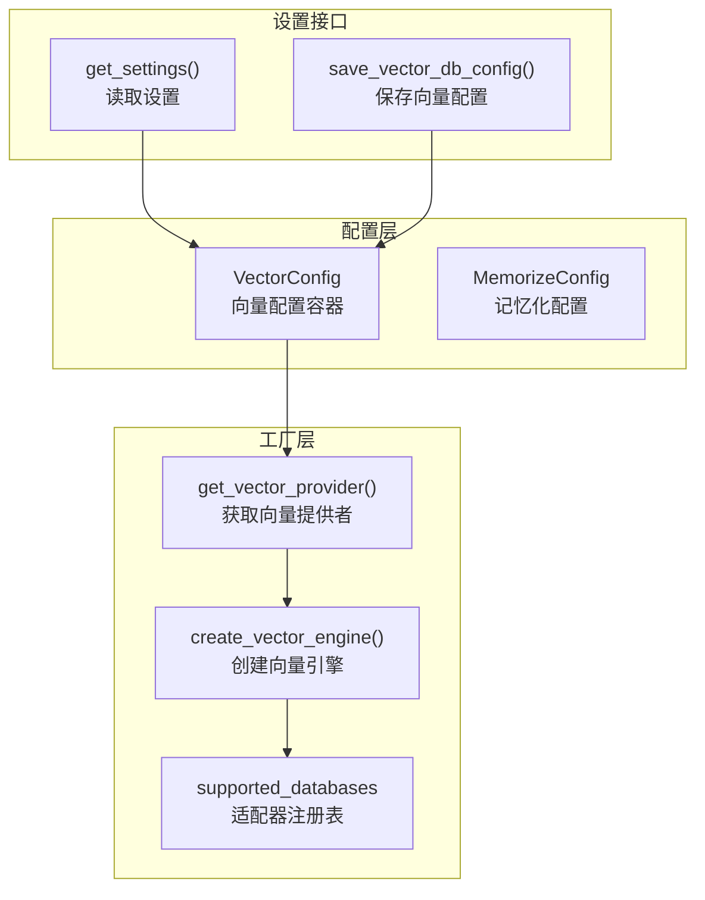
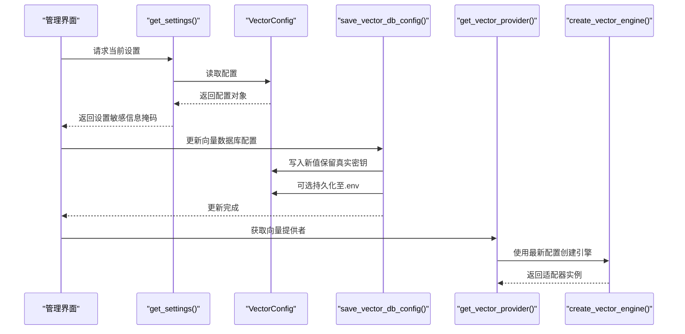
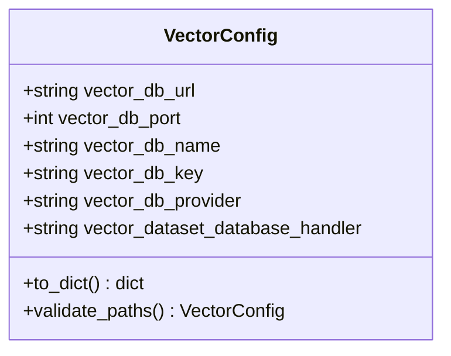
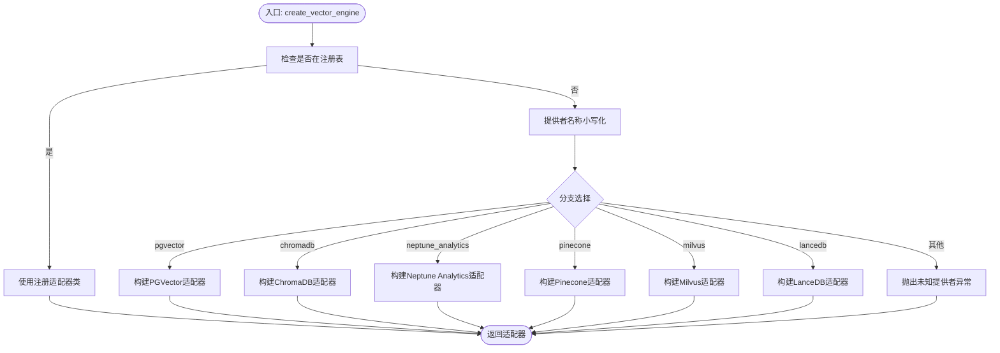
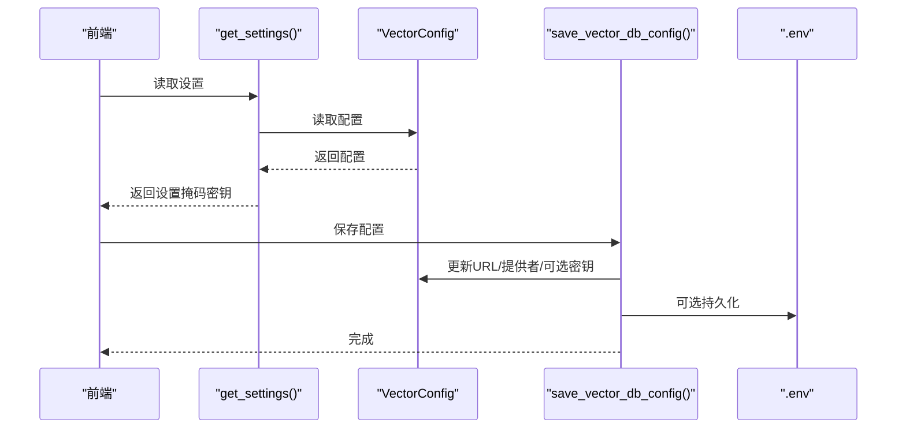
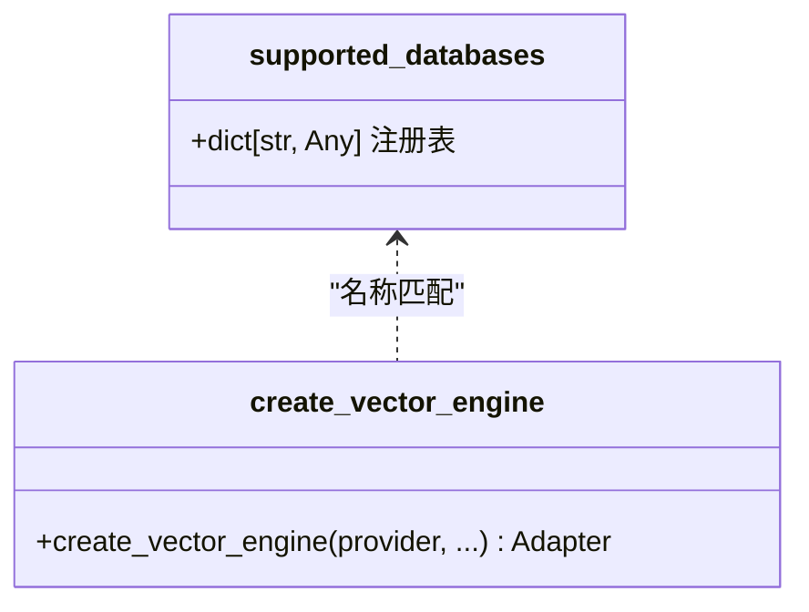
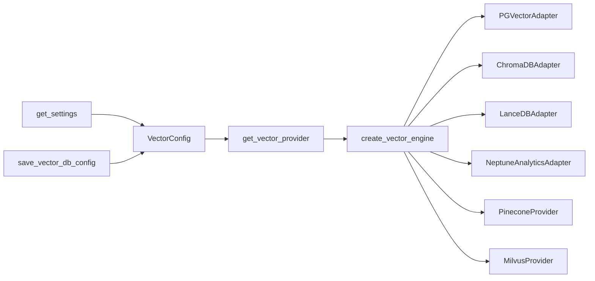

# 向量数据库配置管理

<cite>
**本文档引用的文件**
- [m_flow/adapters/vector/config.py](file://m_flow/adapters/vector/config.py)
- [m_flow/adapters/vector/create_vector_engine.py](file://m_flow/adapters/vector/create_vector_engine.py)
- [m_flow/adapters/vector/get_vector_adapter.py](file://m_flow/adapters/vector/get_vector_adapter.py)
- [m_flow/adapters/vector/supported_databases.py](file://m_flow/adapters/vector/supported_databases.py)
- [m_flow/config/settings/get_settings.py](file://m_flow/config/settings/get_settings.py)
- [m_flow/config/settings/save_vector_db_config.py](file://m_flow/config/settings/save_vector_db_config.py)
- [m_flow/config/config.py](file://m_flow/config/config.py)
- [m_flow/base_config.py](file://m_flow/base_config.py)
- [m_flow/root_dir.py](file://m_flow/root_dir.py)
</cite>

## 目录
1. [简介](#简介)
2. [项目结构](#项目结构)
3. [核心组件](#核心组件)
4. [架构总览](#架构总览)
5. [详细组件分析](#详细组件分析)
6. [依赖关系分析](#依赖关系分析)
7. [性能考虑](#性能考虑)
8. [故障排除指南](#故障排除指南)
9. [结论](#结论)
10. [附录](#附录)

## 简介
本文件面向向量数据库配置管理，系统性梳理配置体系与运行机制，覆盖连接参数、索引设置、性能调优与安全配置；解释配置文件结构与参数含义（如数据库连接串、认证凭据、网络设置）；阐述向量维度、距离度量、索引类型等关键参数对性能与检索质量的影响；提供不同向量数据库的特定配置指南（索引参数、批量大小、超时设置）；记录配置的动态更新与持久化流程；给出配置验证与错误处理策略、最佳实践与安全存储建议，以及配置迁移与版本管理策略。

## 项目结构
向量数据库配置管理由“配置容器 + 工厂 + 适配器注册 + 设置接口”四层构成：
- 配置容器：集中定义向量数据库连接参数与默认值
- 工厂：根据运行时配置创建具体适配器实例
- 适配器注册：支持扩展自定义适配器
- 设置接口：对外暴露配置读取与保存能力

**图表来源**
- [m_flow/adapters/vector/config.py:26-68](file://m_flow/adapters/vector/config.py#L26-L68)
- [m_flow/adapters/vector/get_vector_adapter.py:11-18](file://m_flow/adapters/vector/get_vector_adapter.py#L11-L18)
- [m_flow/adapters/vector/create_vector_engine.py:15-111](file://m_flow/adapters/vector/create_vector_engine.py#L15-L111)
- [m_flow/adapters/vector/supported_databases.py:7-7](file://m_flow/adapters/vector/supported_databases.py#L7-L7)
- [m_flow/config/settings/get_settings.py:123-150](file://m_flow/config/settings/get_settings.py#L123-L150)
- [m_flow/config/settings/save_vector_db_config.py:32-66](file://m_flow/config/settings/save_vector_db_config.py#L32-L66)

**章节来源**
- [m_flow/adapters/vector/config.py:1-77](file://m_flow/adapters/vector/config.py#L1-L77)
- [m_flow/adapters/vector/create_vector_engine.py:1-166](file://m_flow/adapters/vector/create_vector_engine.py#L1-L166)
- [m_flow/adapters/vector/get_vector_adapter.py:1-19](file://m_flow/adapters/vector/get_vector_adapter.py#L1-L19)
- [m_flow/adapters/vector/supported_databases.py:1-8](file://m_flow/adapters/vector/supported_databases.py#L1-L8)
- [m_flow/config/settings/get_settings.py:1-151](file://m_flow/config/settings/get_settings.py#L1-L151)
- [m_flow/config/settings/save_vector_db_config.py:1-70](file://m_flow/config/settings/save_vector_db_config.py#L1-L70)

## 核心组件
- 向量配置容器（VectorConfig）
  - 职责：统一承载向量数据库连接参数与默认值，支持路径规范化与环境变量注入
  - 关键字段：连接URL、端口、数据库名、密钥、提供者、数据集处理器
  - 默认行为：本地路径自动转绝对路径；未设置URL时回退到默认LanceDB路径
- 向量引擎工厂（create_vector_engine）
  - 职责：依据提供者名称创建对应适配器实例，内置多厂商适配器分支
  - 支持：PGVector、ChromaDB、LanceDB、Neptune Analytics、Pinecone、Milvus
  - 错误处理：缺失凭据或依赖时报错
- 提供者获取（get_vector_provider）
  - 职责：从上下文或单例读取配置并创建引擎实例
- 设置接口（get_settings / save_vector_db_config）
  - 职责：对外暴露配置读取与保存，支持敏感信息掩码与持久化

**章节来源**
- [m_flow/adapters/vector/config.py:26-68](file://m_flow/adapters/vector/config.py#L26-L68)
- [m_flow/adapters/vector/create_vector_engine.py:15-111](file://m_flow/adapters/vector/create_vector_engine.py#L15-L111)
- [m_flow/adapters/vector/get_vector_adapter.py:11-18](file://m_flow/adapters/vector/get_vector_adapter.py#L11-L18)
- [m_flow/config/settings/get_settings.py:123-150](file://m_flow/config/settings/get_settings.py#L123-L150)
- [m_flow/config/settings/save_vector_db_config.py:32-66](file://m_flow/config/settings/save_vector_db_config.py#L32-L66)

## 架构总览
下图展示从配置读取到适配器实例化的完整链路，以及设置接口对配置的动态更新与持久化。

**图表来源**
- [m_flow/config/settings/get_settings.py:123-150](file://m_flow/config/settings/get_settings.py#L123-L150)
- [m_flow/config/settings/save_vector_db_config.py:32-66](file://m_flow/config/settings/save_vector_db_config.py#L32-L66)
- [m_flow/adapters/vector/get_vector_adapter.py:11-18](file://m_flow/adapters/vector/get_vector_adapter.py#L11-L18)
- [m_flow/adapters/vector/create_vector_engine.py:15-111](file://m_flow/adapters/vector/create_vector_engine.py#L15-L111)

## 详细组件分析

### 组件A：向量配置容器（VectorConfig）
- 数据结构与字段
  - 连接参数：vector_db_url、vector_db_port、vector_db_name、vector_db_key
  - 提供者：vector_db_provider、vector_dataset_database_handler
  - 默认值：提供者默认为LanceDB，端口默认1234
- 复杂度与性能
  - 字段访问为O(1)，路径规范化仅在URL为本地路径时触发
- 依赖链
  - 依赖基础配置以生成默认LanceDB路径
  - 通过上下文变量支持异步上下文隔离
- 错误处理
  - 未知提供者抛出环境异常
  - 缺少依赖时抛出导入异常
- 优化建议
  - 将常用配置缓存于上下文变量，减少重复解析

**图表来源**
- [m_flow/adapters/vector/config.py:26-68](file://m_flow/adapters/vector/config.py#L26-L68)

**章节来源**
- [m_flow/adapters/vector/config.py:26-68](file://m_flow/adapters/vector/config.py#L26-L68)
- [m_flow/base_config.py](file://m_flow/base_config.py)
- [m_flow/root_dir.py](file://m_flow/root_dir.py)

### 组件B：向量引擎工厂（create_vector_engine）
- 实现模式
  - 基于提供者名称的分发工厂，优先检查注册表，再按内置分支创建
  - 对PGVector采用关系型配置拼接连接串
  - 对ChromaDB、LanceDB、Neptune Analytics分别进行依赖校验与参数校验
- 关键算法
  - 提供者名称归一化（小写）
  - 注册表优先匹配
  - 依赖存在性检查与异常提示
- 复杂度
  - 分发逻辑为O(1)，依赖检查为O(1)
- 依赖关系
  - 依赖嵌入引擎（embedding_engine）
  - 依赖关系型配置（PGVector）
  - 动态导入各适配器类

**图表来源**
- [m_flow/adapters/vector/create_vector_engine.py:15-111](file://m_flow/adapters/vector/create_vector_engine.py#L15-L111)

**章节来源**
- [m_flow/adapters/vector/create_vector_engine.py:15-166](file://m_flow/adapters/vector/create_vector_engine.py#L15-L166)

### 组件C：设置接口（get_settings / save_vector_db_config）
- get_settings
  - 汇总LLM与向量数据库设置，屏蔽敏感信息（前可见字符后掩码）
  - 提供可用提供者列表与模型目录
- save_vector_db_config
  - 接收DTO，更新内存配置
  - 仅当传入非掩码且非空的API Key时才更新密钥
  - 可选持久化至.env文件，失败不中断内存更新

**图表来源**
- [m_flow/config/settings/get_settings.py:123-150](file://m_flow/config/settings/get_settings.py#L123-L150)
- [m_flow/config/settings/save_vector_db_config.py:32-66](file://m_flow/config/settings/save_vector_db_config.py#L32-L66)

**章节来源**
- [m_flow/config/settings/get_settings.py:123-150](file://m_flow/config/settings/get_settings.py#L123-L150)
- [m_flow/config/settings/save_vector_db_config.py:32-66](file://m_flow/config/settings/save_vector_db_config.py#L32-L66)

### 组件D：适配器注册与扩展
- supported_databases
  - 用于注册自定义适配器类，实现扩展点
- 扩展流程
  - 在应用启动阶段将自定义适配器类注册到字典中
  - 工厂通过名称匹配直接实例化

**图表来源**
- [m_flow/adapters/vector/supported_databases.py:7-7](file://m_flow/adapters/vector/supported_databases.py#L7-L7)
- [m_flow/adapters/vector/create_vector_engine.py:47-55](file://m_flow/adapters/vector/create_vector_engine.py#L47-L55)

**章节来源**
- [m_flow/adapters/vector/supported_databases.py:1-8](file://m_flow/adapters/vector/supported_databases.py#L1-L8)
- [m_flow/adapters/vector/create_vector_engine.py:47-55](file://m_flow/adapters/vector/create_vector_engine.py#L47-L55)

## 依赖关系分析
- 配置到工厂
  - VectorConfig → get_vector_provider → create_vector_engine
- 工厂到适配器
  - create_vector_engine → 具体适配器类（PGVector、ChromaDB、LanceDB、Neptune Analytics、Pinecone、Milvus）
- 设置接口
  - get_settings → VectorConfig
  - save_vector_db_config → VectorConfig（可持久化）

**图表来源**
- [m_flow/adapters/vector/config.py:26-68](file://m_flow/adapters/vector/config.py#L26-L68)
- [m_flow/adapters/vector/get_vector_adapter.py:11-18](file://m_flow/adapters/vector/get_vector_adapter.py#L11-L18)
- [m_flow/adapters/vector/create_vector_engine.py:15-111](file://m_flow/adapters/vector/create_vector_engine.py#L15-L111)
- [m_flow/config/settings/get_settings.py:123-150](file://m_flow/config/settings/get_settings.py#L123-L150)
- [m_flow/config/settings/save_vector_db_config.py:32-66](file://m_flow/config/settings/save_vector_db_config.py#L32-L66)

**章节来源**
- [m_flow/adapters/vector/config.py:26-68](file://m_flow/adapters/vector/config.py#L26-L68)
- [m_flow/adapters/vector/get_vector_adapter.py:11-18](file://m_flow/adapters/vector/get_vector_adapter.py#L11-L18)
- [m_flow/adapters/vector/create_vector_engine.py:15-111](file://m_flow/adapters/vector/create_vector_engine.py#L15-L111)
- [m_flow/config/settings/get_settings.py:123-150](file://m_flow/config/settings/get_settings.py#L123-L150)
- [m_flow/config/settings/save_vector_db_config.py:32-66](file://m_flow/config/settings/save_vector_db_config.py#L32-L66)

## 性能考虑
- 连接参数
  - URL与端口：确保使用稳定内网地址与合理端口，避免DNS解析开销
  - 密钥：避免频繁重连，启用连接池（如适配器支持）
- 索引与检索
  - 向量维度：维度越高表达力越强但内存与计算成本越高，需结合业务权衡
  - 距离度量：余弦/内积/欧氏在不同分布数据上表现差异明显，建议通过A/B测试确定
  - 索引类型：HNSW/IVF/PQ等各有适用场景，需结合数据规模与查询延迟目标选择
- 批量与并发
  - 批量大小：吞吐与延迟的折中，建议从较小批次开始逐步扩大
  - 并发：控制写入并发与查询并发上限，避免资源争用
- 存储与路径
  - LanceDB默认路径位于系统根目录下的数据库子目录，注意磁盘IO与容量规划
- 超时与重试
  - 为网络请求设置合理超时与指数退避重试，避免雪崩效应

## 故障排除指南
- 常见错误与定位
  - 未知提供者：检查提供者名称大小写与注册表是否正确
  - 缺失依赖：安装对应适配器所需包（如PGVector需PostgreSQL依赖）
  - 缺少凭据：PGVector需完整的数据库连接参数；Neptune需正确的端点URL
  - 路径问题：本地路径需绝对化，否则可能导致找不到数据库文件
- 日志与告警
  - 保存配置失败会记录警告日志，不影响内存配置生效
- 验证步骤
  - 通过设置接口读取当前配置，确认URL/提供者/密钥状态
  - 尝试创建适配器实例，观察异常信息
  - 对PGVector，检查关系型配置是否完整

**章节来源**
- [m_flow/adapters/vector/create_vector_engine.py:114-166](file://m_flow/adapters/vector/create_vector_engine.py#L114-L166)
- [m_flow/config/settings/save_vector_db_config.py:63-65](file://m_flow/config/settings/save_vector_db_config.py#L63-L65)

## 结论
该配置体系以Pydantic配置容器为核心，配合工厂与注册表实现多厂商适配器的统一接入；通过设置接口提供读取与保存能力，支持敏感信息掩码与可选持久化。整体设计具备良好的扩展性与可维护性，建议在生产环境中结合业务特征进行索引与批量参数的A/B测试，并完善监控与告警策略。

## 附录

### 配置参数详解与最佳实践
- 连接参数
  - vector_db_url：远程服务URL或本地路径；本地路径将被转换为绝对路径
  - vector_db_port：连接端口，默认1234
  - vector_db_name：数据库/索引名称
  - vector_db_key：API密钥或令牌
  - vector_db_provider：提供者名称（lancedb/pgvector/chromadb/neptune_analytics/pinecone/milvus）
  - vector_dataset_database_handler：数据集数据库处理器名称
- 最佳实践
  - 使用内网域名或私有网络地址，降低延迟与带宽消耗
  - 为不同环境（开发/测试/生产）设置独立的数据库名与索引前缀
  - 对高并发场景启用连接池与限流策略

### 不同向量数据库的特定配置指南
- PGVector
  - 依赖：PostgreSQL驱动
  - 参数：基于关系型配置拼接连接串，需提供主机、端口、数据库名、用户名、密码
  - 建议：开启连接池与慢查询日志
- ChromaDB
  - 依赖：chromadb
  - 参数：URL与可选API Key
  - 建议：使用本地文件存储时关注磁盘空间与IO
- LanceDB
  - 依赖：本地文件系统
  - 参数：URL为本地路径或默认路径
  - 建议：定期清理旧版本文件，监控磁盘占用
- Neptune Analytics
  - 依赖：langchain_aws
  - 参数：端点URL需符合规范
  - 建议：使用AWS VPC内网访问，减少跨区域延迟
- Pinecone/Milvus
  - 依赖：各自SDK
  - 参数：API Key/Token、索引/集合前缀
  - 建议：结合业务规模选择合适的分区与副本策略

### 动态更新与热重载
- 动态更新
  - 通过设置接口更新内存配置，立即生效
  - 保存配置时可选择持久化至.env文件，便于重启后恢复
- 热重载
  - 当前实现为内存更新，重启或重新初始化适配器可达到“热重载”效果
  - 建议在应用启动阶段加载.env中的配置，确保一致性

### 安全存储与敏感信息保护
- 掩码显示：设置接口对敏感信息进行部分掩码，避免泄露
- 持久化：保存配置时可写入.env文件，建议配合权限控制与密钥管理服务
- 最小权限：为不同环境与角色分配最小必要权限

### 配置验证与错误处理策略
- 验证
  - 提供者名称大小写归一化与注册表匹配
  - 依赖存在性检查与明确的异常提示
  - 路径规范化与端点URL合法性校验
- 错误处理
  - 缺失凭据与依赖时抛出明确异常
  - 持久化失败仅记录警告，保证内存配置可用

### 配置迁移与版本管理
- 版本管理
  - 通过.env文件与设置接口管理配置版本
  - 建议在升级前备份.env文件
- 迁移策略
  - 提供者切换：先在测试环境验证，再灰度发布
  - 参数变更：采用双写/双读策略，逐步替换