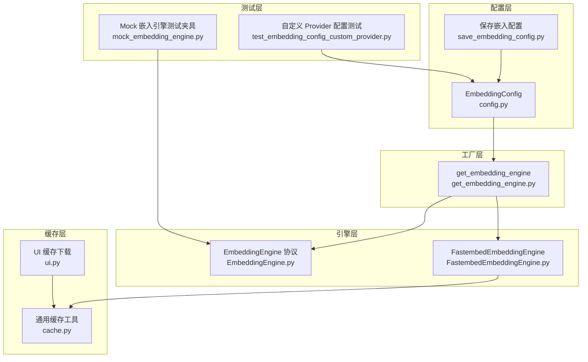
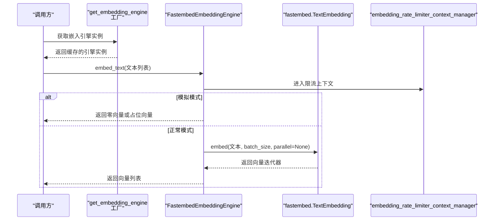
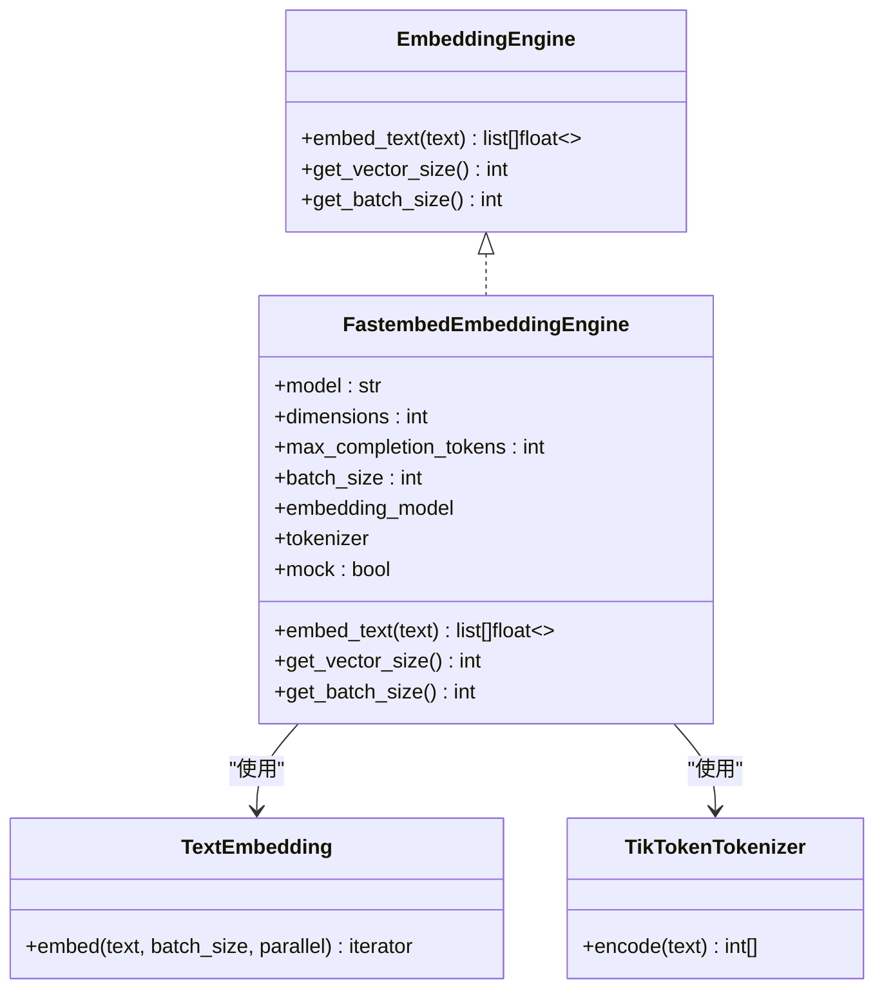
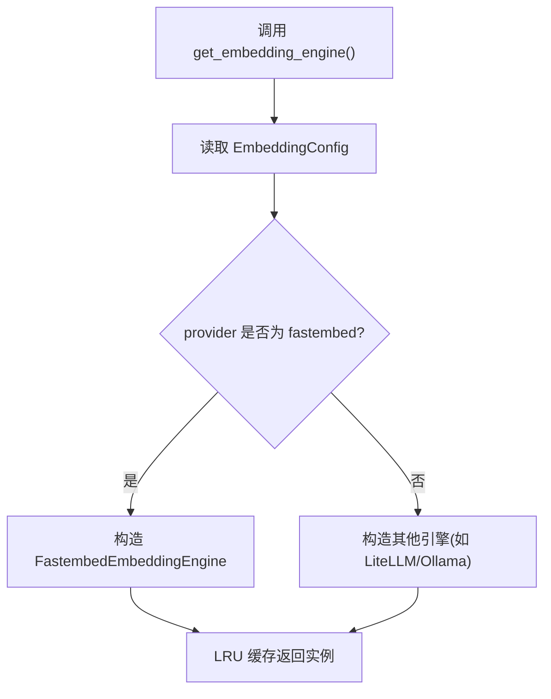
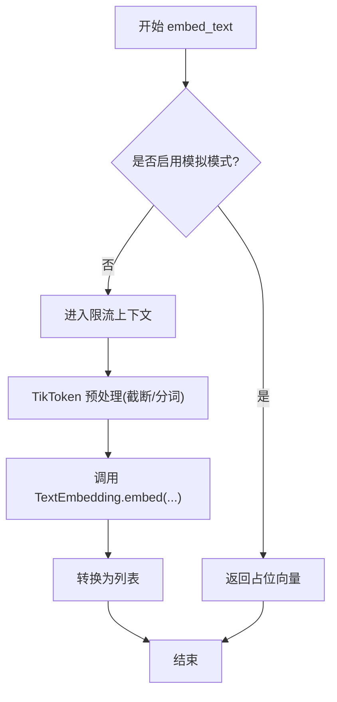
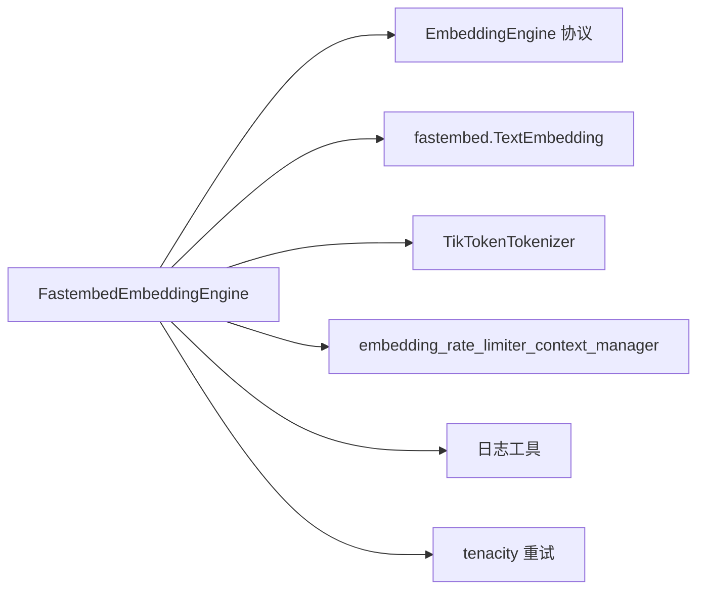

# FastEmbed 嵌入引擎

<cite>
**本文引用的文件**
- [FastembedEmbeddingEngine.py](file://m_flow/adapters/vector/embeddings/FastembedEmbeddingEngine.py)
- [get_embedding_engine.py](file://m_flow/adapters/vector/embeddings/get_embedding_engine.py)
- [EmbeddingEngine.py](file://m_flow/adapters/vector/embeddings/EmbeddingEngine.py)
- [config.py](file://m_flow/adapters/vector/embeddings/config.py)
- [save_embedding_config.py](file://m_flow/config/settings/save_embedding_config.py)
- [cache.py](file://m_flow/shared/cache.py)
- [ui.py](file://m_flow/api/v1/ui/ui.py)
- [mock_embedding_engine.py](file://m_flow/tests/unit/infrastructure/mock_embedding_engine.py)
- [test_embedding_config_custom_provider.py](file://m_flow/tests/unit/infrastructure/vector/embeddings/test_embedding_config_custom_provider.py)
</cite>

## 目录
1. [简介](#简介)
2. [项目结构](#项目结构)
3. [核心组件](#核心组件)
4. [架构总览](#架构总览)
5. [组件详解](#组件详解)
6. [依赖关系分析](#依赖关系分析)
7. [性能考量](#性能考量)
8. [故障排除指南](#故障排除指南)
9. [结论](#结论)
10. [附录](#附录)

## 简介
本文件系统化梳理 FastEmbed 嵌入引擎在 M-Flow 中的实现与使用方式，覆盖以下主题：
- 本地模型加载机制与推理优化
- 内存与资源管理策略
- 支持的嵌入模型类型与配置项
- 嵌入向量生成流程（文本预处理、模型推理、结果后处理）
- 性能优化建议（批处理大小、并发控制、资源分配）
- 实际使用示例与常见问题排查

## 项目结构
与 FastEmbed 嵌入引擎直接相关的模块组织如下：
- 配置层：定义嵌入配置、默认值与环境变量映射
- 工厂层：根据配置选择并实例化具体嵌入引擎
- 引擎层：FastEmbed 引擎的具体实现
- 缓存层：通用缓存工具（用于模型文件缓存等）
- UI 层：前端设置页面对嵌入配置的持久化
- 测试层：验证配置与行为的单元测试

**图表来源**
- [config.py:16-69](file://m_flow/adapters/vector/embeddings/config.py#L16-L69)
- [save_embedding_config.py:33-85](file://m_flow/config/settings/save_embedding_config.py#L33-L85)
- [get_embedding_engine.py:16-100](file://m_flow/adapters/vector/embeddings/get_embedding_engine.py#L16-L100)
- [EmbeddingEngine.py:14-64](file://m_flow/adapters/vector/embeddings/EmbeddingEngine.py#L14-L64)
- [FastembedEmbeddingEngine.py:35-128](file://m_flow/adapters/vector/embeddings/FastembedEmbeddingEngine.py#L35-L128)
- [cache.py:182-366](file://m_flow/shared/cache.py#L182-L366)
- [ui.py:100-134](file://m_flow/api/v1/ui/ui.py#L100-L134)
- [test_embedding_config_custom_provider.py:6-20](file://m_flow/tests/unit/infrastructure/vector/embeddings/test_embedding_config_custom_provider.py#L6-L20)
- [mock_embedding_engine.py:29-83](file://m_flow/tests/unit/infrastructure/mock_embedding_engine.py#L29-L83)

**章节来源**
- [config.py:16-69](file://m_flow/adapters/vector/embeddings/config.py#L16-L69)
- [get_embedding_engine.py:16-100](file://m_flow/adapters/vector/embeddings/get_embedding_engine.py#L16-L100)
- [EmbeddingEngine.py:14-64](file://m_flow/adapters/vector/embeddings/EmbeddingEngine.py#L14-L64)
- [FastembedEmbeddingEngine.py:35-128](file://m_flow/adapters/vector/embeddings/FastembedEmbeddingEngine.py#L35-L128)
- [cache.py:182-366](file://m_flow/shared/cache.py#L182-L366)
- [ui.py:100-134](file://m_flow/api/v1/ui/ui.py#L100-L134)
- [save_embedding_config.py:33-85](file://m_flow/config/settings/save_embedding_config.py#L33-L85)
- [test_embedding_config_custom_provider.py:6-20](file://m_flow/tests/unit/infrastructure/vector/embeddings/test_embedding_config_custom_provider.py#L6-L20)
- [mock_embedding_engine.py:29-83](file://m_flow/tests/unit/infrastructure/mock_embedding_engine.py#L29-L83)

## 核心组件
- 嵌入引擎协议（EmbeddingEngine）：定义统一接口，确保不同后端（FastEmbed/LiteLLM/Ollama）可互换。
- FastEmbed 引擎（FastembedEmbeddingEngine）：基于 fastembed 的本地推理实现，支持重试、速率限制与可选的“模拟嵌入”模式。
- 引擎工厂（get_embedding_engine）：从配置中解析参数并构建引擎实例，使用 LRU 缓存避免重复初始化。
- 配置（EmbeddingConfig）：集中管理 provider/model/dimensions/batch_size/endpoint 等参数，并提供默认值与环境变量映射。
- 配置保存（save_embedding_config）：将运行时配置写回 .env 并持久化。

**章节来源**
- [EmbeddingEngine.py:14-64](file://m_flow/adapters/vector/embeddings/EmbeddingEngine.py#L14-L64)
- [FastembedEmbeddingEngine.py:35-128](file://m_flow/adapters/vector/embeddings/FastembedEmbeddingEngine.py#L35-L128)
- [get_embedding_engine.py:16-100](file://m_flow/adapters/vector/embeddings/get_embedding_engine.py#L16-L100)
- [config.py:16-69](file://m_flow/adapters/vector/embeddings/config.py#L16-L69)
- [save_embedding_config.py:33-85](file://m_flow/config/settings/save_embedding_config.py#L33-L85)

## 架构总览
FastEmbed 引擎在 M-Flow 中的调用链路如下：

**图表来源**
- [get_embedding_engine.py:16-38](file://m_flow/adapters/vector/embeddings/get_embedding_engine.py#L16-L38)
- [FastembedEmbeddingEngine.py:88-110](file://m_flow/adapters/vector/embeddings/FastembedEmbeddingEngine.py#L88-L110)
- [FastembedEmbeddingEngine.py:95-102](file://m_flow/adapters/vector/embeddings/FastembedEmbeddingEngine.py#L95-L102)

## 组件详解

### FastEmbed 引擎实现
- 本地推理：通过 fastembed 的 TextEmbedding 在本地完成嵌入计算，无需网络请求。
- 重试机制：使用 tenacity 对异常进行指数退避重试，排除认证/参数/未找到等明确错误类型。
- 速率限制：在嵌入调用前后使用共享的限流上下文，避免突发流量冲击底层资源。
- 文本预处理：使用 TikToken 分词器进行输入长度控制与预处理。
- 可选模拟：通过环境变量启用“模拟嵌入”，在测试中快速返回占位向量。
- 批处理：当前实现以“单次调用包含全部文本”的方式提交给底层，batch_size 字段用于对外报告与策略参考。

**图表来源**
- [EmbeddingEngine.py:24-63](file://m_flow/adapters/vector/embeddings/EmbeddingEngine.py#L24-L63)
- [FastembedEmbeddingEngine.py:35-128](file://m_flow/adapters/vector/embeddings/FastembedEmbeddingEngine.py#L35-L128)

**章节来源**
- [FastembedEmbeddingEngine.py:35-128](file://m_flow/adapters/vector/embeddings/FastembedEmbeddingEngine.py#L35-L128)

### 引擎工厂与配置
- 工厂函数从全局配置中读取 provider/model/dimensions/batch_size/endpoint 等参数，构建对应引擎。
- 当 provider 为 "fastembed" 时，构造 FastembedEmbeddingEngine。
- 使用 LRU 缓存保证同一进程内只创建一个引擎实例，减少初始化开销。
- 配置默认值与环境变量映射由 EmbeddingConfig 提供，支持动态更新与持久化。

**图表来源**
- [get_embedding_engine.py:16-100](file://m_flow/adapters/vector/embeddings/get_embedding_engine.py#L16-L100)
- [config.py:16-69](file://m_flow/adapters/vector/embeddings/config.py#L16-L69)

**章节来源**
- [get_embedding_engine.py:16-100](file://m_flow/adapters/vector/embeddings/get_embedding_engine.py#L16-L100)
- [config.py:16-69](file://m_flow/adapters/vector/embeddings/config.py#L16-L69)

### 配置项与持久化
- 关键配置项：provider、model、dimensions、endpoint、api_key、api_version、max_completion_tokens、batch_size、huggingface_tokenizer。
- 默认值：若未显式设置 batch_size，则默认为 36。
- 持久化：save_embedding_config 将 provider/model/dimensions/endpoint/api_key 写入 .env 文件，支持掩码保护敏感字段。

**章节来源**
- [config.py:16-69](file://m_flow/adapters/vector/embeddings/config.py#L16-L69)
- [save_embedding_config.py:33-85](file://m_flow/config/settings/save_embedding_config.py#L33-L85)

### 文本预处理与推理流程
- 预处理：使用 TikTokenTokenizer 控制最大上下文长度，避免超长输入导致的错误。
- 推理：调用 fastembed.TextEmbedding.embed，传入 batch_size 与并行参数（None 表示由底层决定）。
- 结果：将底层返回的迭代器转换为列表，作为最终向量输出。
- 错误处理：捕获异常并封装为 EmbeddingException，同时记录日志便于诊断。

**图表来源**
- [FastembedEmbeddingEngine.py:88-110](file://m_flow/adapters/vector/embeddings/FastembedEmbeddingEngine.py#L88-L110)
- [FastembedEmbeddingEngine.py:122-127](file://m_flow/adapters/vector/embeddings/FastembedEmbeddingEngine.py#L122-L127)

**章节来源**
- [FastembedEmbeddingEngine.py:88-110](file://m_flow/adapters/vector/embeddings/FastembedEmbeddingEngine.py#L88-L110)
- [FastembedEmbeddingEngine.py:122-127](file://m_flow/adapters/vector/embeddings/FastembedEmbeddingEngine.py#L122-L127)

### 模型下载、缓存与版本管理
- 通用缓存工具：提供下载 ZIP、校验版本、存储元数据（version/content_id）等功能，可用于模型文件缓存。
- UI 缓存：前端资产下载与缓存逻辑，体现仓库级缓存策略。
- 注意：FastEmbed 引擎通过 fastembed.TextEmbedding 自动处理模型下载与缓存，上述通用缓存工具可作为补充方案用于其他场景。

**章节来源**
- [cache.py:182-366](file://m_flow/shared/cache.py#L182-L366)
- [ui.py:100-134](file://m_flow/api/v1/ui/ui.py#L100-L134)

## 依赖关系分析
- 协议与实现解耦：通过 EmbeddingEngine 协议实现多后端替换，降低耦合度。
- 外部依赖：
  - fastembed：ONNX 推理后端，负责本地嵌入计算。
  - tenacity：重试与退避策略。
  - litellm：日志静默控制。
  - tiktoken：文本分词与长度控制。
- 内部依赖：
  - 共享速率限制上下文：统一控制并发与突发。
  - 日志工具：统一记录错误与调试信息。

**图表来源**
- [FastembedEmbeddingEngine.py:14-28](file://m_flow/adapters/vector/embeddings/FastembedEmbeddingEngine.py#L14-L28)
- [EmbeddingEngine.py:14-64](file://m_flow/adapters/vector/embeddings/EmbeddingEngine.py#L14-L64)

**章节来源**
- [FastembedEmbeddingEngine.py:14-28](file://m_flow/adapters/vector/embeddings/FastembedEmbeddingEngine.py#L14-L28)
- [EmbeddingEngine.py:14-64](file://m_flow/adapters/vector/embeddings/EmbeddingEngine.py#L14-L64)

## 性能考量
- 批处理大小
  - 引擎对外报告的 batch_size 由配置提供；当前实现以“全部文本一次提交”给底层。
  - 建议：结合下游向量库的批量插入能力与硬件资源，动态调整 batch_size 以提升吞吐。
- 并发控制
  - 使用共享速率限制上下文，避免突发请求导致的资源争用。
  - 建议：在高并发场景下，配合队列与信号量，限制同时进行的嵌入任务数量。
- 资源分配
  - ONNX Runtime 的并行策略由底层决定（parallel=None），可根据 CPU/GPU 资源调优。
  - 建议：在多核环境下评估并行度，避免过度并行导致上下文切换开销。
- 重试与稳定性
  - tenacity 的指数退避可缓解瞬时错误；建议结合熔断与告警，防止雪崩。
- 模拟模式
  - 测试阶段可通过环境变量启用模拟嵌入，显著缩短测试时间。

**章节来源**
- [FastembedEmbeddingEngine.py:53-69](file://m_flow/adapters/vector/embeddings/FastembedEmbeddingEngine.py#L53-L69)
- [FastembedEmbeddingEngine.py:75-87](file://m_flow/adapters/vector/embeddings/FastembedEmbeddingEngine.py#L75-L87)
- [FastembedEmbeddingEngine.py:95-102](file://m_flow/adapters/vector/embeddings/FastembedEmbeddingEngine.py#L95-L102)

## 故障排除指南
- 常见错误与定位
  - 认证/参数/未找到类错误：被 tenacity 明确排除，不会自动重试，需检查密钥与参数。
  - 其他异常：被捕获并封装为 EmbeddingException，同时记录日志，便于定位。
- 配置问题
  - provider/model/dimensions 不匹配：检查配置与模型兼容性。
  - endpoint/api_key：确认自定义端点与密钥有效。
- 测试与验证
  - 使用 Mock 嵌入引擎模拟故障与延迟，验证限流与重试逻辑。
  - 单元测试验证自定义 provider 的配置项是否生效。

**章节来源**
- [FastembedEmbeddingEngine.py:88-110](file://m_flow/adapters/vector/embeddings/FastembedEmbeddingEngine.py#L88-L110)
- [mock_embedding_engine.py:29-83](file://m_flow/tests/unit/infrastructure/mock_embedding_engine.py#L29-L83)
- [test_embedding_config_custom_provider.py:6-20](file://m_flow/tests/unit/infrastructure/vector/embeddings/test_embedding_config_custom_provider.py#L6-L20)

## 结论
FastEmbed 嵌入引擎在 M-Flow 中提供了高性能、低延迟的本地嵌入能力。通过协议抽象、工厂缓存、重试与限流等机制，实现了稳定与可扩展的嵌入服务。结合合理的批处理与并发控制策略，可在不同硬件与业务负载下获得良好性能表现。

## 附录

### 支持的嵌入模型类型与配置项
- provider：支持 "fastembed"（本地）、"ollama"（本地 LLM 服务器）、"openai"（或其他 LiteLLM 兼容提供商）。
- model：模型标识符，例如 "openai/text-embedding-3-large"。
- dimensions：输出向量维度。
- endpoint/api_version/api_key：自定义端点与版本、API 密钥。
- max_completion_tokens：单次请求的最大 token 上限。
- batch_size：建议的批大小（对外报告，当前实现以全部文本一次提交）。
- huggingface_tokenizer：用于计数的 HF 分词器（可选）。

**章节来源**
- [config.py:16-69](file://m_flow/adapters/vector/embeddings/config.py#L16-L69)
- [get_embedding_engine.py:55-89](file://m_flow/adapters/vector/embeddings/get_embedding_engine.py#L55-L89)

### 使用示例（路径指引）
- 在应用中获取嵌入引擎实例并调用 embed_text：
  - [get_embedding_engine.py:16-38](file://m_flow/adapters/vector/embeddings/get_embedding_engine.py#L16-L38)
  - [FastembedEmbeddingEngine.py:88-110](file://m_flow/adapters/vector/embeddings/FastembedEmbeddingEngine.py#L88-L110)
- 更新并持久化嵌入配置：
  - [save_embedding_config.py:33-85](file://m_flow/config/settings/save_embedding_config.py#L33-L85)
- 验证自定义 provider 的配置：
  - [test_embedding_config_custom_provider.py:6-20](file://m_flow/tests/unit/infrastructure/vector/embeddings/test_embedding_config_custom_provider.py#L6-L20)