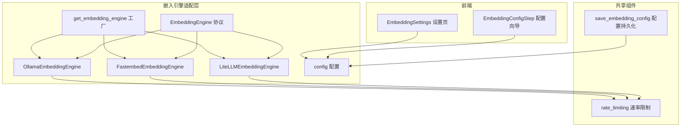
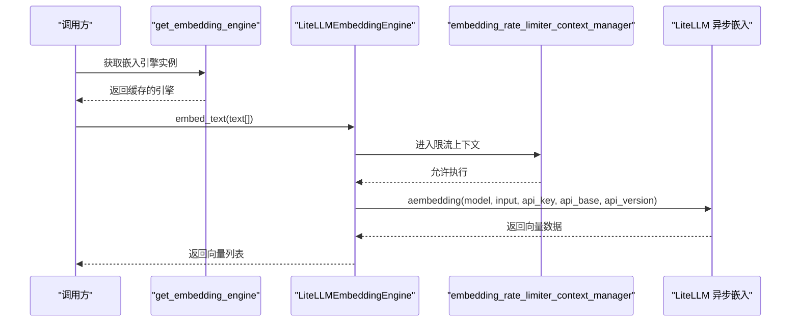
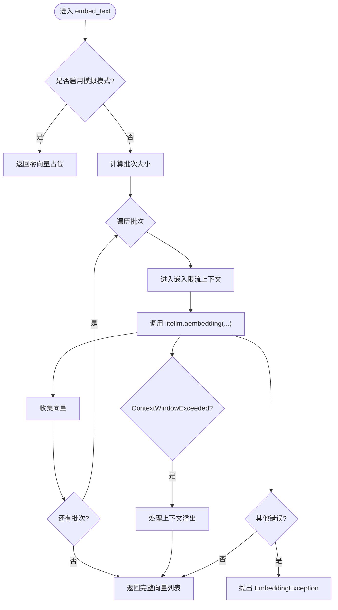
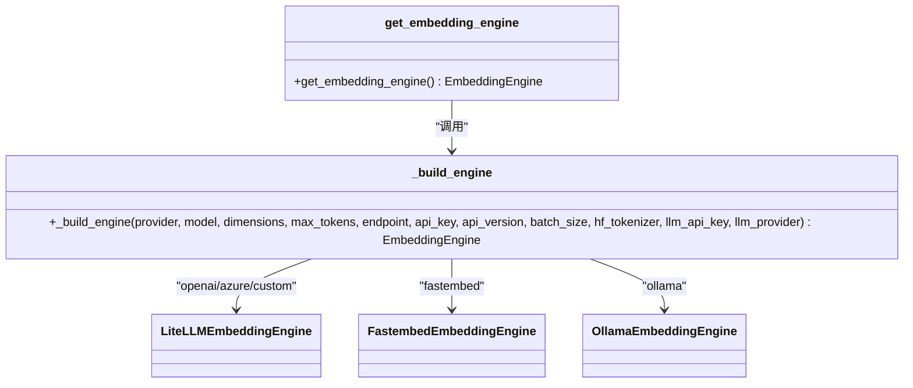
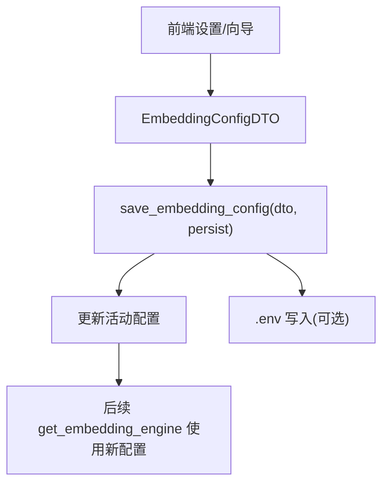
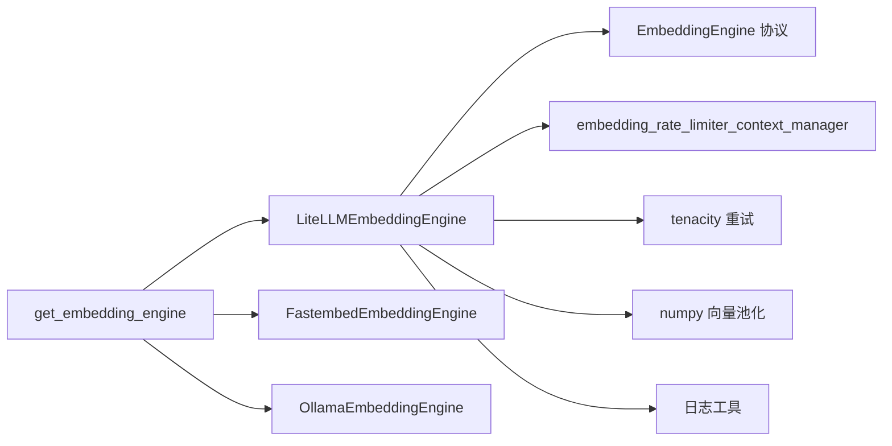

# LiteLLM 嵌入引擎

<cite>
**本文档引用的文件**
- [LiteLLMEmbeddingEngine.py](file://m_flow/adapters/vector/embeddings/LiteLLMEmbeddingEngine.py)
- [EmbeddingEngine.py](file://m_flow/adapters/vector/embeddings/EmbeddingEngine.py)
- [get_embedding_engine.py](file://m_flow/adapters/vector/embeddings/get_embedding_engine.py)
- [config.py](file://m_flow/adapters/vector/embeddings/config.py)
- [rate_limiting.py](file://m_flow/shared/rate_limiting.py)
- [save_embedding_config.py](file://m_flow/config/settings/save_embedding_config.py)
- [EmbeddingConfigStep.tsx](file://m_flow-frontend/src/components/setup/ConfigWizard/steps/EmbeddingConfigStep.tsx)
- [EmbeddingSettings.tsx](file://m_flow-frontend/src/components/settings/EmbeddingSettings.tsx)
- [FastembedEmbeddingEngine.py](file://m_flow/adapters/vector/embeddings/FastembedEmbeddingEngine.py)
- [OllamaEmbeddingEngine.py](file://m_flow/adapters/vector/embeddings/OllamaEmbeddingEngine.py)
- [test_embedding_config_custom_provider.py](file://m_flow/tests/unit/infrastructure/vector/embeddings/test_embedding_config_custom_provider.py)
</cite>

## 目录
1. [简介](#简介)
2. [项目结构](#项目结构)
3. [核心组件](#核心组件)
4. [架构总览](#架构总览)
5. [详细组件分析](#详细组件分析)
6. [依赖关系分析](#依赖关系分析)
7. [性能考量](#性能考量)
8. [故障排查指南](#故障排查指南)
9. [结论](#结论)
10. [附录](#附录)

## 简介
本文件面向 LiteLLM 嵌入引擎的技术文档，系统性阐述其多提供商路由能力与统一嵌入接口设计。该引擎支持 OpenAI、Azure、以及通过 LiteLLM 兼容层接入的其他提供商（如自定义兼容端点），并提供统一的异步嵌入接口、上下文窗口溢出处理、批量分片与池化、速率限制、重试机制与错误处理。同时给出配置指南、使用示例与最佳实践，帮助在不同提供商之间进行智能路由与成本优化。

## 项目结构
LiteLLM 嵌入引擎位于向量适配层的嵌入子模块中，采用协议驱动的适配器模式，结合工厂方法与缓存机制，按配置动态构建具体引擎实例。前端提供配置向导与设置页面，后端提供配置持久化与运行时更新能力。

**图表来源**
- [EmbeddingEngine.py:14-63](file://m_flow/adapters/vector/embeddings/EmbeddingEngine.py#L14-L63)
- [LiteLLMEmbeddingEngine.py:37-178](file://m_flow/adapters/vector/embeddings/LiteLLMEmbeddingEngine.py#L37-L178)
- [get_embedding_engine.py:16-99](file://m_flow/adapters/vector/embeddings/get_embedding_engine.py#L16-L99)
- [config.py:16-68](file://m_flow/adapters/vector/embeddings/config.py#L16-L68)
- [rate_limiting.py:23-31](file://m_flow/shared/rate_limiting.py#L23-L31)
- [save_embedding_config.py:33-81](file://m_flow/config/settings/save_embedding_config.py#L33-L81)
- [EmbeddingConfigStep.tsx:45-83](file://m_flow-frontend/src/components/setup/ConfigWizard/steps/EmbeddingConfigStep.tsx#L45-L83)
- [EmbeddingSettings.tsx:38-42](file://m_flow-frontend/src/components/settings/EmbeddingSettings.tsx#L38-L42)

**章节来源**
- [EmbeddingEngine.py:1-64](file://m_flow/adapters/vector/embeddings/EmbeddingEngine.py#L1-L64)
- [get_embedding_engine.py:1-100](file://m_flow/adapters/vector/embeddings/get_embedding_engine.py#L1-L100)
- [config.py:1-69](file://m_flow/adapters/vector/embeddings/config.py#L1-L69)

## 核心组件
- 统一协议接口：定义嵌入引擎必须实现的方法契约，确保不同提供商适配器的一致行为。
- LiteLLM 引擎：基于 LiteLLM 的异步嵌入调用，支持 OpenAI/Azure 等提供商，并内置上下文溢出处理与重试。
- 工厂与缓存：根据配置动态构建引擎实例，使用 LRU 缓存避免重复连接。
- 配置系统：集中管理提供商、模型、维度、端点、密钥、批次大小等参数。
- 速率限制：对嵌入请求进行统一限流，可按配置启用或禁用。
- 前端配置：提供可视化配置向导与设置页，支持 OpenAI、Azure、Ollama、FastEmbed 等提供商。

**章节来源**
- [EmbeddingEngine.py:14-63](file://m_flow/adapters/vector/embeddings/EmbeddingEngine.py#L14-L63)
- [LiteLLMEmbeddingEngine.py:37-178](file://m_flow/adapters/vector/embeddings/LiteLLMEmbeddingEngine.py#L37-L178)
- [get_embedding_engine.py:16-99](file://m_flow/adapters/vector/embeddings/get_embedding_engine.py#L16-L99)
- [config.py:16-68](file://m_flow/adapters/vector/embeddings/config.py#L16-L68)
- [rate_limiting.py:23-31](file://m_flow/shared/rate_limiting.py#L23-L31)
- [EmbeddingConfigStep.tsx:45-83](file://m_flow-frontend/src/components/setup/ConfigWizard/steps/EmbeddingConfigStep.tsx#L45-L83)
- [EmbeddingSettings.tsx:38-42](file://m_flow-frontend/src/components/settings/EmbeddingSettings.tsx#L38-L42)

## 架构总览
LiteLLM 嵌入引擎通过工厂方法按配置选择具体提供商实现，统一对外暴露异步嵌入接口。引擎内部使用速率限制上下文、指数退避重试与异常分类处理，针对上下文窗口溢出进行分片与池化，保证稳定性与吞吐。

**图表来源**
- [get_embedding_engine.py:16-38](file://m_flow/adapters/vector/embeddings/get_embedding_engine.py#L16-L38)
- [LiteLLMEmbeddingEngine.py:85-109](file://m_flow/adapters/vector/embeddings/LiteLLMEmbeddingEngine.py#L85-L109)
- [rate_limiting.py:56-58](file://m_flow/shared/rate_limiting.py#L56-L58)

## 详细组件分析

### 统一嵌入接口协议
- 方法契约：定义 embed_text、get_vector_size、get_batch_size 三个方法，作为所有嵌入适配器的结构化协议。
- 设计要点：使用运行时协议检查，无需显式继承，降低耦合；方法签名严格约束返回类型与异常语义。

**章节来源**
- [EmbeddingEngine.py:14-63](file://m_flow/adapters/vector/embeddings/EmbeddingEngine.py#L14-L63)

### LiteLLM 嵌入引擎
- 引擎职责：封装 LiteLLM 的异步嵌入调用，支持 OpenAI、Azure 与自定义兼容端点；负责上下文溢出处理、批量分片与池化、重试与错误分类。
- 关键特性：
  - 批量处理：按 batch_size 分批发送请求，减少单次调用开销。
  - 上下文溢出处理：当输入文本过大导致上下文超限时，自动递归分片或重叠池化，保证结果一致性。
  - 重试机制：对非鉴权类错误采用指数退避+抖动重试，最大时长受限，避免雪崩。
  - 令牌计数：根据提供商自动选择合适的分词器，用于预处理与长度估算。
  - 模拟模式：通过环境变量开启，便于测试与离线开发。

**图表来源**
- [LiteLLMEmbeddingEngine.py:85-143](file://m_flow/adapters/vector/embeddings/LiteLLMEmbeddingEngine.py#L85-L143)

**章节来源**
- [LiteLLMEmbeddingEngine.py:37-178](file://m_flow/adapters/vector/embeddings/LiteLLMEmbeddingEngine.py#L37-L178)

### 工厂与缓存机制
- 工厂函数：根据配置选择提供商，支持 fastembed、ollama 与 LiteLLM 三大类；对 LiteLLM 类别进一步区分 openai、azure 与其他自定义兼容端点。
- API 密钥选择：优先使用嵌入专用密钥，若未配置则回退到 LLM 配置中的密钥；当提供商为 custom 时可使用独立密钥策略。
- 实例缓存：使用 LRU 缓存避免重复初始化，降低连接与初始化成本。

**图表来源**
- [get_embedding_engine.py:16-99](file://m_flow/adapters/vector/embeddings/get_embedding_engine.py#L16-L99)
- [LiteLLMEmbeddingEngine.py:37-66](file://m_flow/adapters/vector/embeddings/LiteLLMEmbeddingEngine.py#L37-L66)
- [FastembedEmbeddingEngine.py:35-70](file://m_flow/adapters/vector/embeddings/FastembedEmbeddingEngine.py#L35-L70)
- [OllamaEmbeddingEngine.py:38-77](file://m_flow/adapters/vector/embeddings/OllamaEmbeddingEngine.py#L38-L77)

**章节来源**
- [get_embedding_engine.py:16-99](file://m_flow/adapters/vector/embeddings/get_embedding_engine.py#L16-L99)

### 配置系统与持久化
- 配置项：提供商、模型、维度、端点、API 密钥、API 版本、最大完成令牌、批次大小、HuggingFace 分词器名称等。
- 默认值：未指定时提供合理默认；批次大小未指定时默认为 36。
- 持久化：通过设置页或向导更新配置时，可选择是否写入 .env 文件，保护敏感信息（密钥字段支持掩码占位）。

**图表来源**
- [save_embedding_config.py:33-81](file://m_flow/config/settings/save_embedding_config.py#L33-L81)
- [config.py:16-68](file://m_flow/adapters/vector/embeddings/config.py#L16-L68)

**章节来源**
- [config.py:16-68](file://m_flow/adapters/vector/embeddings/config.py#L16-L68)
- [save_embedding_config.py:33-81](file://m_flow/config/settings/save_embedding_config.py#L33-L81)
- [EmbeddingConfigStep.tsx:45-83](file://m_flow-frontend/src/components/setup/ConfigWizard/steps/EmbeddingConfigStep.tsx#L45-L83)
- [EmbeddingSettings.tsx:38-42](file://m_flow-frontend/src/components/settings/EmbeddingSettings.tsx#L38-L42)

### 速率限制与重试机制
- 速率限制：通过嵌入专用限流器对并发请求进行节流，支持按配置开关与区间调整。
- 重试策略：对非鉴权类错误（如 400/404）采用指数退避+抖动重试，最大等待时间受限；对鉴权/未找到等错误直接抛出业务异常。
- 超时与安全：HTTP 请求使用安全 SSL 上下文与超时控制，避免阻塞与资源泄露。

**章节来源**
- [rate_limiting.py:23-31](file://m_flow/shared/rate_limiting.py#L23-L31)
- [LiteLLMEmbeddingEngine.py:72-84](file://m_flow/adapters/vector/embeddings/LiteLLMEmbeddingEngine.py#L72-L84)
- [OllamaEmbeddingEngine.py:101-113](file://m_flow/adapters/vector/embeddings/OllamaEmbeddingEngine.py#L101-L113)

### 上下文窗口溢出处理
- 批量溢出：当一批文本整体超过上下文限制时，递归将批次拆半，分别嵌入后再合并。
- 单条溢出：当单个字符串过长时，按三分之一重叠切分，分别嵌入后做向量平均池化，提升语义一致性。
- 边界校验：空输入直接抛出上下文溢出异常，防止无效处理。

**章节来源**
- [LiteLLMEmbeddingEngine.py:118-143](file://m_flow/adapters/vector/embeddings/LiteLLMEmbeddingEngine.py#L118-L143)

### 分词器选择策略
- OpenAI/Azure：优先使用 TikToken 分词器；若模型不在注册表内则回退到通用 cl100k_base。
- Gemini：使用 TikToken 分词器。
- Mistral：使用 Mistral 分词器。
- 其他/Hugging Face：尝试 HuggingFace 分词器，失败则回退到 TikToken。

**章节来源**
- [LiteLLMEmbeddingEngine.py:151-177](file://m_flow/adapters/vector/embeddings/LiteLLMEmbeddingEngine.py#L151-L177)

## 依赖关系分析
- 松耦合设计：通过协议与工厂解耦具体提供商实现，新增提供商只需遵循协议即可无缝接入。
- 外部依赖：LiteLLM（异步嵌入）、Tenacity（重试）、NumPy（向量池化）、aiohttp（HTTP 客户端，Ollama 场景）。
- 内部依赖：共享速率限制模块、配置模块、日志工具。

**图表来源**
- [LiteLLMEmbeddingEngine.py:15-31](file://m_flow/adapters/vector/embeddings/LiteLLMEmbeddingEngine.py#L15-L31)
- [get_embedding_engine.py:84-99](file://m_flow/adapters/vector/embeddings/get_embedding_engine.py#L84-L99)
- [rate_limiting.py:56-58](file://m_flow/shared/rate_limiting.py#L56-L58)

**章节来源**
- [LiteLLMEmbeddingEngine.py:15-31](file://m_flow/adapters/vector/embeddings/LiteLLMEmbeddingEngine.py#L15-L31)
- [get_embedding_engine.py:84-99](file://m_flow/adapters/vector/embeddings/get_embedding_engine.py#L84-L99)

## 性能考量
- 批次大小：建议根据提供商上下文限制与网络状况调整批次大小，默认 36；对大模型可适当减小以避免溢出。
- 限流策略：在高并发场景启用嵌入限流，避免触发第三方速率限制或被降级。
- 重试退避：指数退避+抖动可有效缓解瞬时抖动，建议结合熔断策略使用。
- 向量池化：对超长文本进行重叠池化可提升召回质量，但会增加计算与内存消耗。
- 本地化替代：在低延迟与隐私要求高的场景，可考虑 FastEmbed 或 Ollama 本地部署。

[本节为通用指导，不直接分析具体文件]

## 故障排查指南
- 常见错误分类：
  - 认证错误：检查 API 密钥与提供商是否匹配。
  - 参数错误：检查模型、维度、端点与版本号。
  - 上下文超限：减小批次或启用自动分片；必要时调整最大完成令牌。
- 排查步骤：
  - 开启模拟模式验证流程完整性。
  - 查看日志输出定位异常阶段（网络、解析、重试）。
  - 在前端设置页核对配置项与掩码密钥处理。
- 测试参考：
  - 自定义提供商配置项覆盖测试，验证维度与端点生效。

**章节来源**
- [LiteLLMEmbeddingEngine.py:114-116](file://m_flow/adapters/vector/embeddings/LiteLLMEmbeddingEngine.py#L114-L116)
- [save_embedding_config.py:57-60](file://m_flow/config/settings/save_embedding_config.py#L57-L60)
- [test_embedding_config_custom_provider.py:6-19](file://m_flow/tests/unit/infrastructure/vector/embeddings/test_embedding_config_custom_provider.py#L6-L19)

## 结论
LiteLLM 嵌入引擎通过协议化接口与工厂缓存机制，实现了对多家提供商的统一抽象与灵活路由。其内置的上下文溢出处理、批量分片与池化、速率限制与重试策略，显著提升了稳定性与吞吐表现。配合完善的配置系统与前端可视化界面，用户可在 OpenAI、Azure、Ollama、FastEmbed 等多种方案间快速切换与优化，满足不同场景的成本与性能需求。

[本节为总结性内容，不直接分析具体文件]

## 附录

### 配置指南（后端）
- 关键配置项：
  - provider：提供商标识（openai、azure、ollama、fastembed、custom）。
  - model：模型标识符（如 openai/text-embedding-3-large）。
  - dimensions：输出向量维度（如 1536、3072）。
  - endpoint：自定义 API 端点（Azure、DashScope 等）。
  - api_key：提供商 API 密钥（支持掩码占位）。
  - api_version：API 版本（Azure 必填）。
  - max_completion_tokens：单次请求最大令牌数。
  - batch_size：批次大小（未指定时默认 36）。
  - huggingface_tokenizer：HF 分词器名称（用于预处理）。
- 默认值与行为：
  - 未指定批次大小时使用默认值。
  - 自定义提供商可覆盖端点与模型，以兼容第三方兼容层。

**章节来源**
- [config.py:16-68](file://m_flow/adapters/vector/embeddings/config.py#L16-L68)
- [get_embedding_engine.py:87-88](file://m_flow/adapters/vector/embeddings/get_embedding_engine.py#L87-L88)

### 配置指南（前端）
- 支持的提供商与默认参数：
  - OpenAI：默认模型 text-embedding-3-large，维度 3072，需 API Key。
  - Azure OpenAI：默认模型 text-embedding-3-large，维度 3072，需 API Key 与端点。
  - Ollama（本地）：默认模型 nomic-embed-text，维度 768，需端点。
  - FastEmbed（本地）：默认模型 BAAI/bge-small-en-v1.5，维度 384，无需密钥。
- 设置页功能：
  - 表单校验与变更检测。
  - 保存时可选择是否持久化至 .env。
  - 掩码密钥保护，避免明文泄露。

**章节来源**
- [EmbeddingConfigStep.tsx:45-83](file://m_flow-frontend/src/components/setup/ConfigWizard/steps/EmbeddingConfigStep.tsx#L45-L83)
- [EmbeddingSettings.tsx:38-42](file://m_flow-frontend/src/components/settings/EmbeddingSettings.tsx#L38-L42)
- [save_embedding_config.py:57-75](file://m_flow/config/settings/save_embedding_config.py#L57-L75)

### 使用示例（概念性）
- 示例目标：演示在不同提供商间进行智能路由与成本优化。
- 步骤概要：
  - 在前端设置页选择提供商与模型，填写必要参数（如 Azure 端点与密钥）。
  - 保存配置并持久化至 .env。
  - 通过工厂方法获取嵌入引擎实例，调用 embed_text 执行批量嵌入。
  - 根据返回向量进行向量检索或知识图谱构建。
- 成本优化建议：
  - 优先选择与应用同区域的提供商以降低延迟与费用。
  - 对高频查询启用嵌入限流，避免触发第三方配额。
  - 使用较小批次与重试策略平衡吞吐与稳定性。

[本节为概念性示例，不直接分析具体文件]