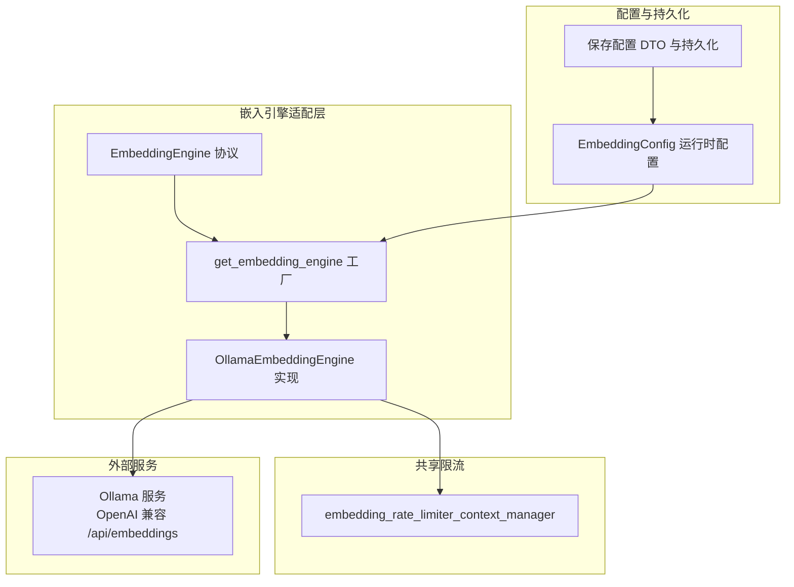
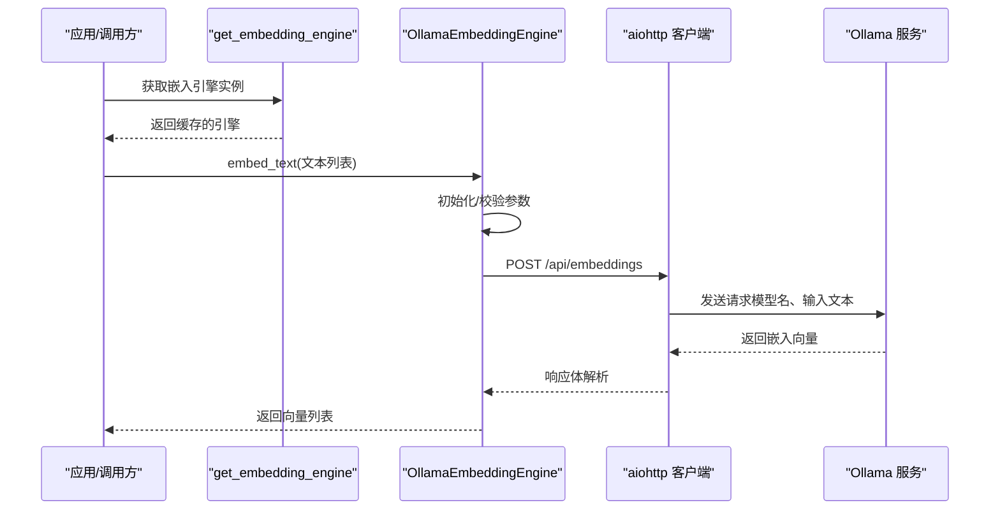
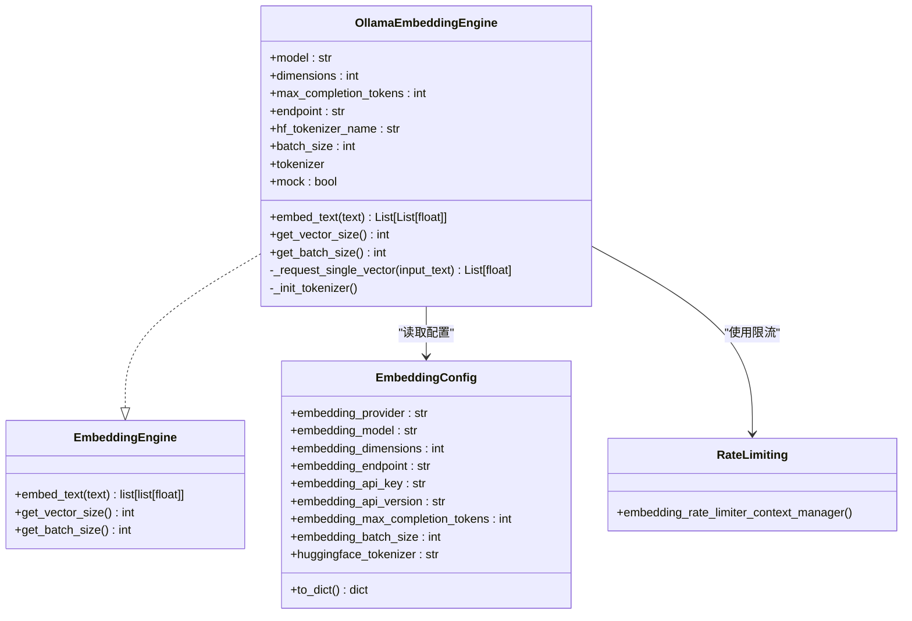
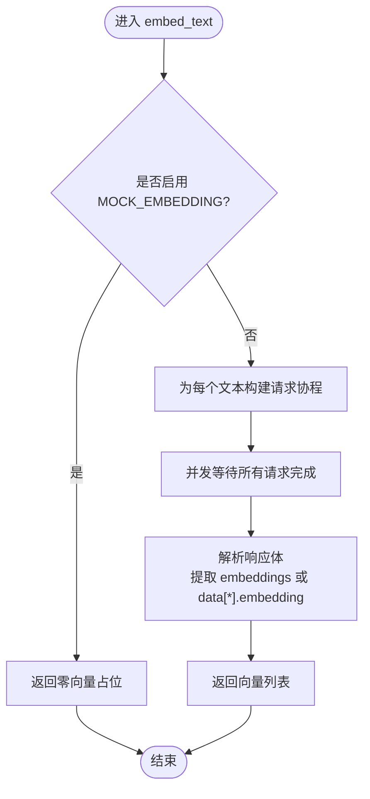
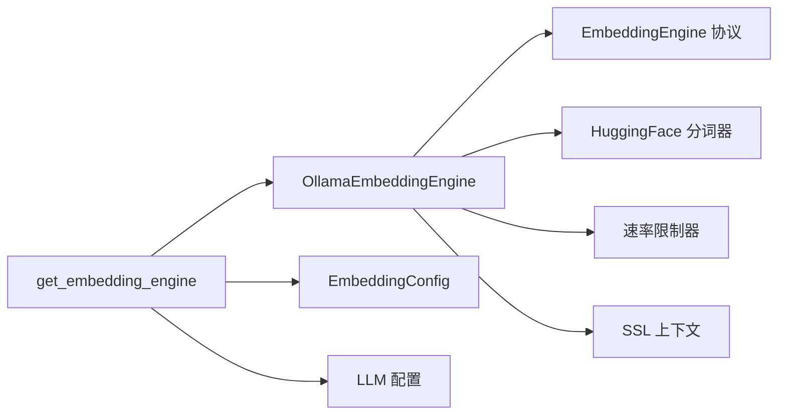

# Ollama 嵌入引擎

<cite>
**本文引用的文件**
- [OllamaEmbeddingEngine.py](file://m_flow/adapters/vector/embeddings/OllamaEmbeddingEngine.py)
- [EmbeddingEngine.py](file://m_flow/adapters/vector/embeddings/EmbeddingEngine.py)
- [get_embedding_engine.py](file://m_flow/adapters/vector/embeddings/get_embedding_engine.py)
- [config.py](file://m_flow/adapters/vector/embeddings/config.py)
- [save_embedding_config.py](file://m_flow/config/settings/save_embedding_config.py)
- [rate_limiting.py](file://m_flow/shared/rate_limiting.py)
- [adapter.py](file://m_flow/llm/backends/litellm_instructor/llm/ollama/adapter.py)
- [test_ollama.yml](file://.github/workflows/test_ollama.yml)
- [simple_example.py](file://examples/python/simple_example.py)
</cite>

## 目录
1. [简介](#简介)
2. [项目结构](#项目结构)
3. [核心组件](#核心组件)
4. [架构总览](#架构总览)
5. [详细组件分析](#详细组件分析)
6. [依赖关系分析](#依赖关系分析)
7. [性能考量](#性能考量)
8. [故障排除指南](#故障排除指南)
9. [结论](#结论)
10. [附录](#附录)

## 简介
本文件面向需要在本地或私有网络中部署与使用 Ollama 嵌入引擎的工程师与运维人员，系统性阐述以下内容：
- Ollama 嵌入引擎的本地部署与推理能力
- 与 Ollama 服务的通信协议与数据传输格式
- 支持的本地嵌入模型类型（如 SFR-Embedding-Mistral 等）
- 配置参数（Ollama 服务器地址、模型名称、推理参数）
- 部署指南（Ollama 服务安装、模型拉取、本地环境配置）
- 实际使用示例（配置本地嵌入服务与向量生成）
- 性能调优建议（批处理大小、并发连接数、内存使用）
- 常见连接问题与模型加载失败的故障排除

## 项目结构
围绕嵌入引擎的关键模块分布如下：
- 向量适配层：定义统一协议与工厂函数，按提供商选择具体实现
- Ollama 适配器：通过 HTTP 客户端调用 Ollama 的嵌入接口
- 配置与持久化：运行时配置对象与 .env 写入
- 共享限流：对嵌入请求进行速率限制
- LLM 侧 Ollama 适配：用于结构化输出与多模态能力（与嵌入同源）

图表来源
- [EmbeddingEngine.py:14-63](file://m_flow/adapters/vector/embeddings/EmbeddingEngine.py#L14-L63)
- [get_embedding_engine.py:16-100](file://m_flow/adapters/vector/embeddings/get_embedding_engine.py#L16-L100)
- [OllamaEmbeddingEngine.py:38-150](file://m_flow/adapters/vector/embeddings/OllamaEmbeddingEngine.py#L38-L150)
- [config.py:16-69](file://m_flow/adapters/vector/embeddings/config.py#L16-L69)
- [save_embedding_config.py:33-85](file://m_flow/config/settings/save_embedding_config.py#L33-L85)
- [rate_limiting.py:56-59](file://m_flow/shared/rate_limiting.py#L56-L59)

章节来源
- [EmbeddingEngine.py:1-63](file://m_flow/adapters/vector/embeddings/EmbeddingEngine.py#L1-L63)
- [get_embedding_engine.py:1-100](file://m_flow/adapters/vector/embeddings/get_embedding_engine.py#L1-L100)
- [config.py:1-69](file://m_flow/adapters/vector/embeddings/config.py#L1-L69)

## 核心组件
- 统一协议：EmbeddingEngine 定义了 embed_text、get_vector_size、get_batch_size 三个方法，作为所有嵌入后端的契约
- 工厂函数：根据配置动态选择并缓存嵌入引擎实例，当前支持 fastembed、ollama、LiteLLM
- Ollama 实现：OllamaEmbeddingEngine 通过 HTTP 调用 Ollama 的嵌入端点，内置指数抖动重试与 SSL 上下文
- 配置对象：EmbeddingConfig 提供运行时配置（提供商、模型、维度、端点、令牌、最大补全长度、批大小等），并可序列化为字典
- 配置持久化：save_embedding_config 将更新写入运行时配置，并可选写入 .env 文件
- 速率限制：embedding_rate_limiter_context_manager 提供异步限流上下文，避免过载

章节来源
- [EmbeddingEngine.py:14-63](file://m_flow/adapters/vector/embeddings/EmbeddingEngine.py#L14-L63)
- [get_embedding_engine.py:41-100](file://m_flow/adapters/vector/embeddings/get_embedding_engine.py#L41-L100)
- [OllamaEmbeddingEngine.py:38-150](file://m_flow/adapters/vector/embeddings/OllamaEmbeddingEngine.py#L38-L150)
- [config.py:16-69](file://m_flow/adapters/vector/embeddings/config.py#L16-L69)
- [save_embedding_config.py:33-85](file://m_flow/config/settings/save_embedding_config.py#L33-L85)
- [rate_limiting.py:56-59](file://m_flow/shared/rate_limiting.py#L56-L59)

## 架构总览
Ollama 嵌入引擎在系统中的位置与交互如下：

图表来源
- [get_embedding_engine.py:16-38](file://m_flow/adapters/vector/embeddings/get_embedding_engine.py#L16-L38)
- [OllamaEmbeddingEngine.py:82-143](file://m_flow/adapters/vector/embeddings/OllamaEmbeddingEngine.py#L82-L143)

## 详细组件分析

### Ollama 嵌入引擎类图

图表来源
- [EmbeddingEngine.py:14-63](file://m_flow/adapters/vector/embeddings/EmbeddingEngine.py#L14-L63)
- [OllamaEmbeddingEngine.py:38-150](file://m_flow/adapters/vector/embeddings/OllamaEmbeddingEngine.py#L38-L150)
- [config.py:16-69](file://m_flow/adapters/vector/embeddings/config.py#L16-L69)
- [rate_limiting.py:56-59](file://m_flow/shared/rate_limiting.py#L56-L59)

章节来源
- [OllamaEmbeddingEngine.py:38-150](file://m_flow/adapters/vector/embeddings/OllamaEmbeddingEngine.py#L38-L150)
- [EmbeddingEngine.py:14-63](file://m_flow/adapters/vector/embeddings/EmbeddingEngine.py#L14-L63)
- [config.py:16-69](file://m_flow/adapters/vector/embeddings/config.py#L16-L69)
- [rate_limiting.py:56-59](file://m_flow/shared/rate_limiting.py#L56-L59)

### 通信协议与数据传输格式
- 默认端点：http://localhost:11434/api/embeddings
- 请求方法：POST
- 请求头：可选 Authorization: Bearer {LLM_API_KEY}
- 请求体字段：
  - model: 使用的嵌入模型名称
  - prompt: 文本输入（兼容字段 input）
  - input: 文本输入（与 prompt 对应）
- 响应体字段：
  - 返回值包含 embeddings 或 data[*].embedding，取首个元素作为向量
- 超时：默认 60 秒
- 重试策略：指数抖动退避，针对非认证/未找到/错误请求类异常进行重试，最多约 128 秒

章节来源
- [OllamaEmbeddingEngine.py:33-35](file://m_flow/adapters/vector/embeddings/OllamaEmbeddingEngine.py#L33-L35)
- [OllamaEmbeddingEngine.py:114-142](file://m_flow/adapters/vector/embeddings/OllamaEmbeddingEngine.py#L114-L142)

### 支持的本地嵌入模型类型
- 默认模型：avr/sfr-embedding-mistral:latest
- 示例工作流中使用的模型：avr/sfr-embedding-mistral:latest
- 可通过配置项 embedding_model 自定义替换

章节来源
- [OllamaEmbeddingEngine.py:34-34](file://m_flow/adapters/vector/embeddings/OllamaEmbeddingEngine.py#L34-L34)
- [test_ollama.yml:112-112](file://.github/workflows/test_ollama.yml#L112-L112)

### 配置参数
- 提供商：embedding_provider（当值为 ollama 时启用 Ollama 嵌入）
- 模型：embedding_model（默认 avr/sfr-embedding-mistral:latest）
- 维度：embedding_dimensions（向量维度）
- 端点：embedding_endpoint（自定义 Ollama 嵌入端点）
- API 密钥：embedding_api_key（可选，用于鉴权）
- 最大补全长度：embedding_max_completion_tokens（影响分词与截断）
- 批大小：embedding_batch_size（建议与索引/查询吞吐匹配）
- HuggingFace 分词器：huggingface_tokenizer（用于计数与截断）
- 运行时读取：get_embedding_config 返回缓存实例
- 持久化：save_embedding_config 支持将更新写入 .env

章节来源
- [config.py:16-69](file://m_flow/adapters/vector/embeddings/config.py#L16-L69)
- [save_embedding_config.py:33-85](file://m_flow/config/settings/save_embedding_config.py#L33-L85)
- [get_embedding_engine.py:16-38](file://m_flow/adapters/vector/embeddings/get_embedding_engine.py#L16-L38)

### 部署指南
- 安装 Ollama 服务
  - 在本地或目标主机启动 Ollama 守护进程
  - 确保端口 11434 可访问
- 拉取嵌入与对话模型
  - 使用 Ollama API 拉取嵌入模型（如 avr/sfr-embedding-mistral:latest）
  - 拉取对话模型（如 phi4）以验证服务可用性
- 配置本地嵌入服务
  - 设置 EMBEDDING_PROVIDER=ollama
  - 设置 EMBEDDING_MODEL=avr/sfr-embedding-mistral:latest
  - 设置 EMBEDDING_ENDPOINT=http://localhost:11434/api/embeddings
  - 设置 EMBEDDING_DIMENSIONS=4096（与模型一致）
  - 设置 HUGGINGFACE_TOKENIZER=Salesforce/SFR-Embedding-Mistral
- 验证服务
  - 运行示例脚本，触发嵌入与检索流程
  - 观察日志与返回结果确认连通性

章节来源
- [test_ollama.yml:42-70](file://.github/workflows/test_ollama.yml#L42-L70)
- [test_ollama.yml:101-116](file://.github/workflows/test_ollama.yml#L101-L116)
- [simple_example.py:1-51](file://examples/python/simple_example.py#L1-L51)

### 实际使用示例
- 配置环境变量（示例）
  - LLM_PROVIDER=ollama
  - LLM_ENDPOINT=http://localhost:11434/v1/
  - LLM_MODEL=phi4
  - EMBEDDING_PROVIDER=ollama
  - EMBEDDING_MODEL=avr/sfr-embedding-mistral:latest
  - EMBEDDING_ENDPOINT=http://localhost:11434/api/embeddings
  - EMBEDDING_DIMENSIONS=4096
  - HUGGINGFACE_TOKENIZER=Salesforce/SFR-Embedding-Mistral
- 运行示例脚本
  - 执行 examples/python/simple_example.py，完成数据摄取、记忆构建与检索

章节来源
- [test_ollama.yml:101-116](file://.github/workflows/test_ollama.yml#L101-L116)
- [simple_example.py:21-50](file://examples/python/simple_example.py#L21-L50)

### 复杂逻辑流程图（嵌入请求）

图表来源
- [OllamaEmbeddingEngine.py:82-89](file://m_flow/adapters/vector/embeddings/OllamaEmbeddingEngine.py#L82-L89)
- [OllamaEmbeddingEngine.py:114-142](file://m_flow/adapters/vector/embeddings/OllamaEmbeddingEngine.py#L114-L142)

## 依赖关系分析
- 组件耦合
  - OllamaEmbeddingEngine 依赖 EmbeddingEngine 协议、HuggingFace 分词器、速率限制器与 SSL 上下文
  - 工厂函数 get_embedding_engine 依赖运行时配置与 LLM 配置，按提供商分支实例化
- 外部依赖
  - Ollama 服务（HTTP/HTTPS，端口 11434）
  - aiohttp（异步 HTTP 客户端）
  - tenacity（重试机制）
  - litellm（异常类型判断）
- 循环依赖
  - 未发现直接循环导入；工厂函数通过字符串导入避免循环

图表来源
- [OllamaEmbeddingEngine.py:25-29](file://m_flow/adapters/vector/embeddings/OllamaEmbeddingEngine.py#L25-L29)
- [get_embedding_engine.py:11-12](file://m_flow/adapters/vector/embeddings/get_embedding_engine.py#L11-L12)
- [config.py:16-69](file://m_flow/adapters/vector/embeddings/config.py#L16-L69)

章节来源
- [OllamaEmbeddingEngine.py:25-29](file://m_flow/adapters/vector/embeddings/OllamaEmbeddingEngine.py#L25-L29)
- [get_embedding_engine.py:11-12](file://m_flow/adapters/vector/embeddings/get_embedding_engine.py#L11-L12)

## 性能考量
- 批处理大小
  - 建议与 embedding_batch_size 配置保持一致，结合下游索引/查询吞吐评估
  - 索引阶段存在按并发与批次拆分的逻辑，便于控制内存峰值
- 并发连接数
  - 使用 asyncio.gather 并发发送请求，受速率限制器与 Ollama 服务能力约束
  - 建议在高负载场景开启速率限制并适当降低并发
- 内存使用优化
  - 控制单次请求文本长度（max_completion_tokens），减少分词与编码开销
  - 使用批大小与并发的平衡点，避免一次性加载过多向量
- 重试与超时
  - 指数抖动重试可提升瞬时故障恢复能力，但需配合速率限制避免雪崩

章节来源
- [OllamaEmbeddingEngine.py:88-89](file://m_flow/adapters/vector/embeddings/OllamaEmbeddingEngine.py#L88-L89)
- [rate_limiting.py:56-59](file://m_flow/shared/rate_limiting.py#L56-L59)
- [index_memory_nodes.py:142-175](file://m_flow/storage/index_memory_nodes.py#L142-L175)

## 故障排除指南
- 连接失败
  - 确认 Ollama 服务已启动且端口 11434 可达
  - 检查 EMBEDDING_ENDPOINT 是否正确（默认 http://localhost:11434/api/embeddings）
  - 若使用 HTTPS，请确保 SSL 上下文与证书配置正确
- 模型加载失败
  - 使用 Ollama API 拉取所需嵌入模型（如 avr/sfr-embedding-mistral:latest）
  - 确认模型名称与 embedding_model 一致
- 认证问题
  - 如需鉴权，设置 LLM_API_KEY 环境变量并在请求头中携带 Bearer Token
- 响应格式异常
  - 确认响应体包含 embeddings 或 data[*].embedding 字段
  - 检查模型输出维度与 embedding_dimensions 是否一致
- 重试与超时
  - 观察日志中的重试行为；若持续失败，检查网络与 Ollama 服务状态

章节来源
- [OllamaEmbeddingEngine.py:122-126](file://m_flow/adapters/vector/embeddings/OllamaEmbeddingEngine.py#L122-L126)
- [OllamaEmbeddingEngine.py:101-113](file://m_flow/adapters/vector/embeddings/OllamaEmbeddingEngine.py#L101-L113)
- [test_ollama.yml:49-70](file://.github/workflows/test_ollama.yml#L49-L70)

## 结论
Ollama 嵌入引擎通过统一协议与工厂模式，实现了对本地 Ollama 服务的稳定接入。其具备完善的重试、限流与 SSL 支持，适合在私有化与离线环境中部署。结合合理的批大小、并发与维度配置，可在保证稳定性的同时获得良好的吞吐表现。

## 附录
- 相关 LLM 侧 Ollama 适配（结构化输出与多模态）可参考对应模块，与嵌入引擎共享相同的 OpenAI 兼容端点与重试策略

章节来源
- [adapter.py:47-146](file://m_flow/llm/backends/litellm_instructor/llm/ollama/adapter.py#L47-L146)