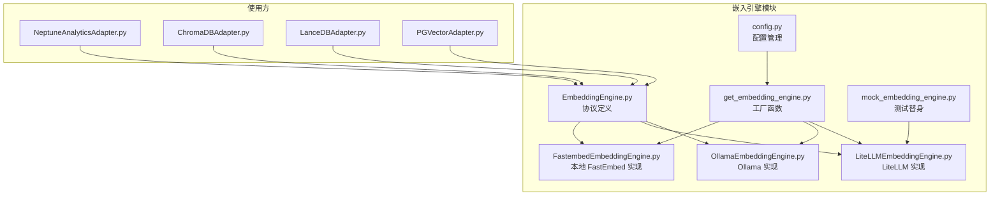
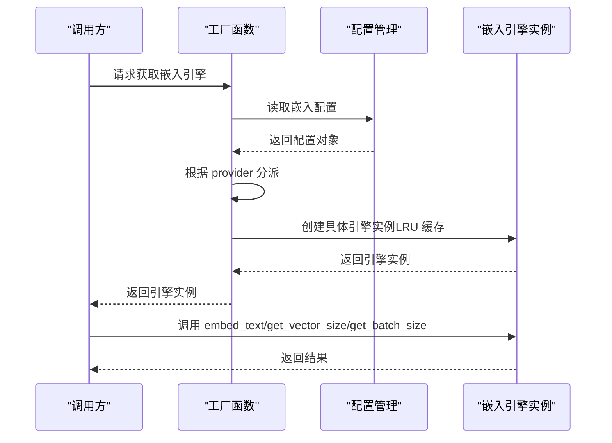
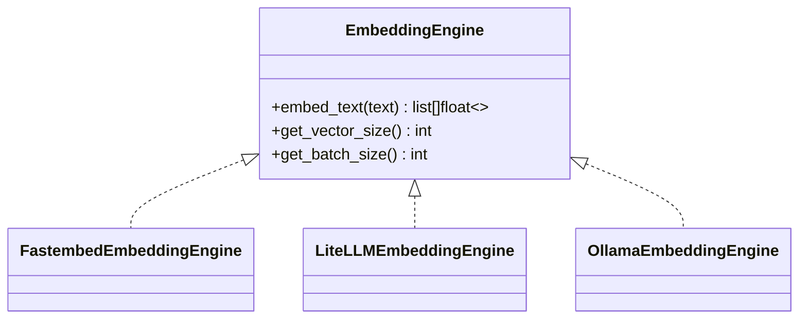
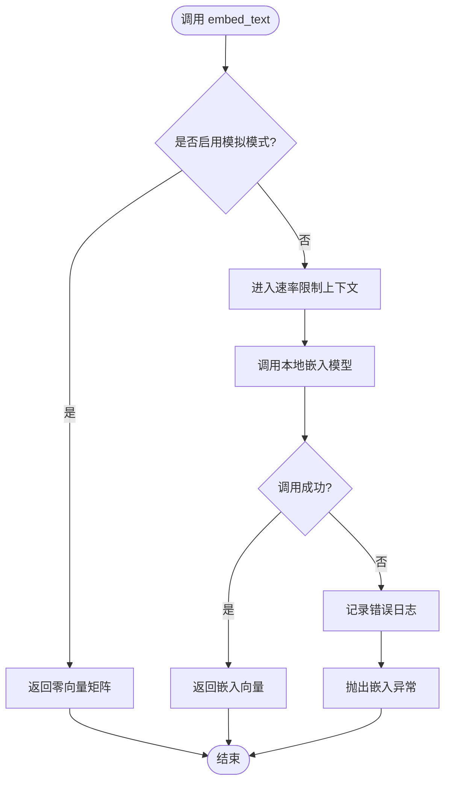
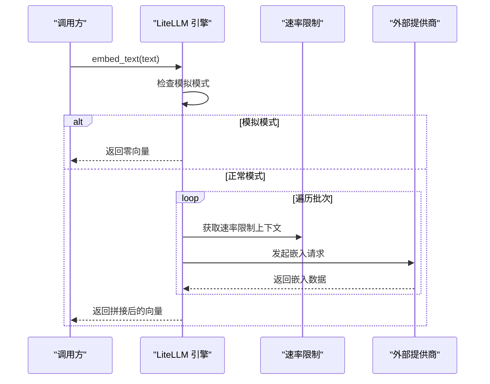
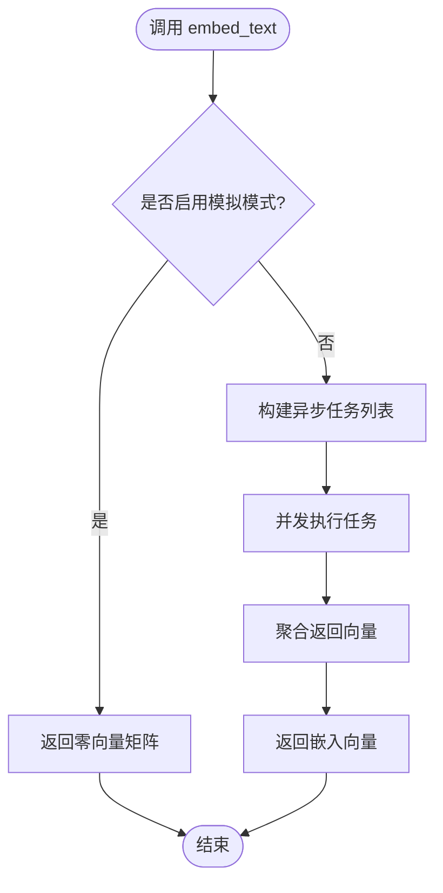
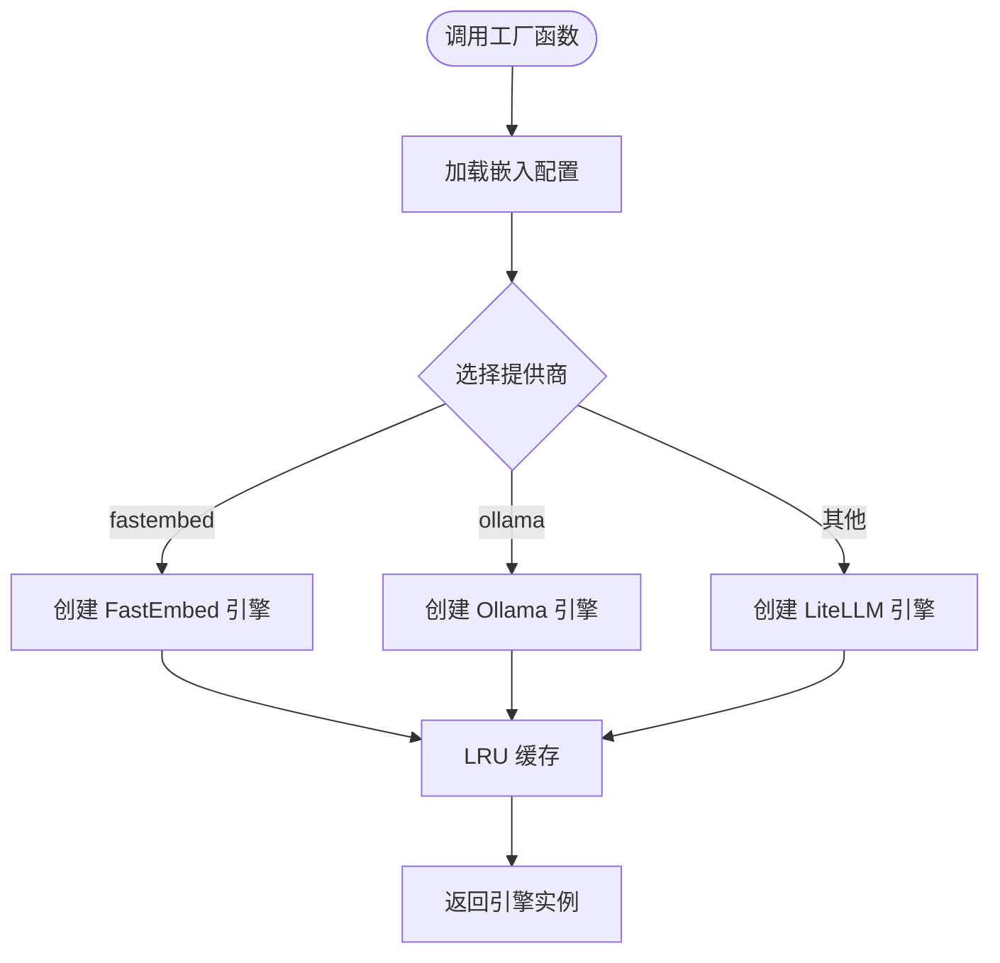
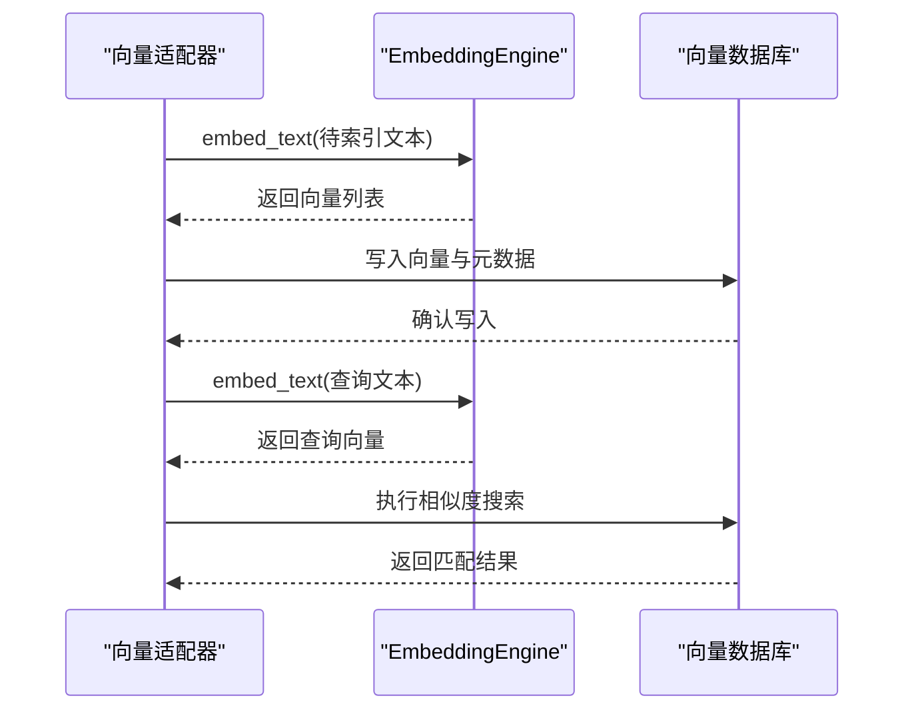
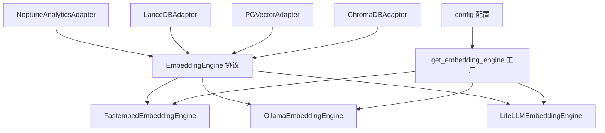

# 嵌入引擎基础协议

<cite>
**本文档引用的文件**
- [EmbeddingEngine.py](file://m_flow/adapters/vector/embeddings/EmbeddingEngine.py)
- [FastembedEmbeddingEngine.py](file://m_flow/adapters/vector/embeddings/FastembedEmbeddingEngine.py)
- [LiteLLMEmbeddingEngine.py](file://m_flow/adapters/vector/embeddings/LiteLLMEmbeddingEngine.py)
- [OllamaEmbeddingEngine.py](file://m_flow/adapters/vector/embeddings/OllamaEmbeddingEngine.py)
- [get_embedding_engine.py](file://m_flow/adapters/vector/embeddings/get_embedding_engine.py)
- [config.py](file://m_flow/adapters/vector/embeddings/config.py)
- [exceptions.py](file://m_flow/adapters/exceptions/exceptions.py)
- [mock_embedding_engine.py](file://m_flow/tests/unit/infrastructure/mock_embedding_engine.py)
- [NeptuneAnalyticsAdapter.py](file://m_flow/adapters/hybrid/neptune_analytics/NeptuneAnalyticsAdapter.py)
- [ChromaDBAdapter.py](file://m_flow/adapters/vector/chromadb/ChromaDBAdapter.py)
- [LanceDBAdapter.py](file://m_flow/adapters/vector/lancedb/LanceDBAdapter.py)
- [PGVectorAdapter.py](file://m_flow/adapters/vector/pgvector/PGVectorAdapter.py)
</cite>

## 目录
1. [简介](#简介)
2. [项目结构](#项目结构)
3. [核心组件](#核心组件)
4. [架构概览](#架构概览)
5. [详细组件分析](#详细组件分析)
6. [依赖分析](#依赖分析)
7. [性能考虑](#性能考虑)
8. [故障排除指南](#故障排除指南)
9. [结论](#结论)
10. [附录](#附录)

## 简介
本文件系统性阐述 M-Flow 嵌入引擎基础协议的设计理念、接口规范与实现模式。协议通过 Python 结构化协议（Structural Protocol）与运行时鸭子类型检查，消除了传统显式继承带来的约束，使得任意对象只要满足约定的方法签名即可被当作嵌入引擎使用。本文将深入解析以下三个核心方法：
- embed_text：将原始文本批量转换为稠密浮点向量
- get_vector_size：报告向量维度大小
- get_batch_size：建议每次嵌入调用的最佳批处理大小

同时，本文将解释运行时鸭子类型检查的工作原理、异常处理机制、最佳实践以及自定义实现指南。

## 项目结构
嵌入引擎相关代码集中于向量适配器的嵌入模块，包含协议定义、多种具体实现、工厂函数与配置管理：

**图表来源**
- [EmbeddingEngine.py:13-63](file://m_flow/adapters/vector/embeddings/EmbeddingEngine.py#L13-L63)
- [FastembedEmbeddingEngine.py:35-127](file://m_flow/adapters/vector/embeddings/FastembedEmbeddingEngine.py#L35-L127)
- [LiteLLMEmbeddingEngine.py:37-177](file://m_flow/adapters/vector/embeddings/LiteLLMEmbeddingEngine.py#L37-L177)
- [OllamaEmbeddingEngine.py:38-150](file://m_flow/adapters/vector/embeddings/OllamaEmbeddingEngine.py#L38-L150)
- [get_embedding_engine.py:16-99](file://m_flow/adapters/vector/embeddings/get_embedding_engine.py#L16-L99)
- [config.py:16-68](file://m_flow/adapters/vector/embeddings/config.py#L16-L68)
- [NeptuneAnalyticsAdapter.py:84-236](file://m_flow/adapters/hybrid/neptune_analytics/NeptuneAnalyticsAdapter.py#L84-L236)
- [ChromaDBAdapter.py:226-389](file://m_flow/adapters/vector/chromadb/ChromaDBAdapter.py#L226-L389)
- [LanceDBAdapter.py:157-370](file://m_flow/adapters/vector/lancedb/LanceDBAdapter.py#L157-L370)
- [PGVectorAdapter.py:127-394](file://m_flow/adapters/vector/pgvector/PGVectorAdapter.py#L127-L394)
- [mock_embedding_engine.py:29-82](file://m_flow/tests/unit/infrastructure/mock_embedding_engine.py#L29-L82)

**章节来源**
- [EmbeddingEngine.py:1-64](file://m_flow/adapters/vector/embeddings/EmbeddingEngine.py#L1-L64)
- [get_embedding_engine.py:1-100](file://m_flow/adapters/vector/embeddings/get_embedding_engine.py#L1-L100)
- [config.py:1-69](file://m_flow/adapters/vector/embeddings/config.py#L1-L69)

## 核心组件
本节聚焦嵌入引擎基础协议的三个核心方法及其职责边界。

- embed_text(text: list[str]) -> list[list[float]]
  - 功能：将输入的原始字符串列表转换为稠密浮点向量列表
  - 参数：text 为原始字符串序列
  - 返回：与输入一一对应的向量列表，每个向量长度等于模型的原生维度
  - 异常：协议方法直接调用会抛出未实现异常，具体实现需覆盖此方法
  - 复杂度：通常与输入样本数量成线性关系，受底层模型与批处理策略影响

- get_vector_size() -> int
  - 功能：报告该引擎产生的向量固定维度
  - 返回：整型维度大小
  - 异常：协议方法直接调用会抛出未实现异常，具体实现需覆盖此方法

- get_batch_size() -> int
  - 功能：建议每次嵌入调用的最佳批处理大小
  - 返回：整型批大小
  - 异常：协议方法直接调用会抛出未实现异常，具体实现需覆盖此方法

运行时鸭子类型检查原理：
- 使用结构化协议（Structural Protocol）与运行时检查装饰器，确保对象在运行时具备所需方法签名
- 不要求显式继承，只要对象暴露与协议签名兼容的方法即可被接受
- 这种设计提升了扩展性，便于新增第三方嵌入后端而无需修改既有继承体系

**章节来源**
- [EmbeddingEngine.py:24-63](file://m_flow/adapters/vector/embeddings/EmbeddingEngine.py#L24-L63)

## 架构概览
嵌入引擎采用工厂模式按配置动态选择具体实现，并通过 LRU 缓存避免重复实例化。使用方通过统一协议接口调用，屏蔽底层差异。

**图表来源**
- [get_embedding_engine.py:16-99](file://m_flow/adapters/vector/embeddings/get_embedding_engine.py#L16-L99)
- [config.py:65-68](file://m_flow/adapters/vector/embeddings/config.py#L65-L68)

**章节来源**
- [get_embedding_engine.py:16-99](file://m_flow/adapters/vector/embeddings/get_embedding_engine.py#L16-L99)
- [config.py:16-68](file://m_flow/adapters/vector/embeddings/config.py#L16-L68)

## 详细组件分析

### 协议定义与鸭子类型检查
- 协议通过结构化协议与运行时检查装饰器声明，明确三方法签名与职责
- 方法体中抛出未实现异常，防止直接调用协议方法
- 允许任何满足签名的对象作为嵌入引擎使用，无需显式继承

**图表来源**
- [EmbeddingEngine.py:13-63](file://m_flow/adapters/vector/embeddings/EmbeddingEngine.py#L13-L63)
- [FastembedEmbeddingEngine.py:35-127](file://m_flow/adapters/vector/embeddings/FastembedEmbeddingEngine.py#L35-L127)
- [LiteLLMEmbeddingEngine.py:37-177](file://m_flow/adapters/vector/embeddings/LiteLLMEmbeddingEngine.py#L37-L177)
- [OllamaEmbeddingEngine.py:38-150](file://m_flow/adapters/vector/embeddings/OllamaEmbeddingEngine.py#L38-L150)

**章节来源**
- [EmbeddingEngine.py:13-63](file://m_flow/adapters/vector/embeddings/EmbeddingEngine.py#L13-L63)

### FastEmbed 实现
- 特点：本地 ONNX 优化模型，无需外部 API 调用
- 批处理：支持按批提交并行嵌入
- 错误处理：捕获异常并包装为嵌入异常
- 模拟模式：可通过环境变量启用零向量返回，加速测试

**图表来源**
- [FastembedEmbeddingEngine.py:87-110](file://m_flow/adapters/vector/embeddings/FastembedEmbeddingEngine.py#L87-L110)

**章节来源**
- [FastembedEmbeddingEngine.py:35-127](file://m_flow/adapters/vector/embeddings/FastembedEmbeddingEngine.py#L35-L127)
- [exceptions.py:54-58](file://m_flow/adapters/exceptions/exceptions.py#L54-L58)

### LiteLLM 实现
- 特点：支持多提供商（OpenAI、Azure 等），自动处理上下文窗口溢出
- 上下文溢出处理：对超长文本进行分割与向量池化
- 批处理：按批次并发调用，提升吞吐
- 错误处理：区分不同异常类型并进行相应处理

**图表来源**
- [LiteLLMEmbeddingEngine.py:84-116](file://m_flow/adapters/vector/embeddings/LiteLLMEmbeddingEngine.py#L84-L116)

**章节来源**
- [LiteLLMEmbeddingEngine.py:37-177](file://m_flow/adapters/vector/embeddings/LiteLLMEmbeddingEngine.py#L37-L177)
- [exceptions.py:54-58](file://m_flow/adapters/exceptions/exceptions.py#L54-L58)

### Ollama 实现
- 特点：调用本地或远程 Ollama 实例生成向量
- 并发：对每个文本异步发起请求并聚合结果
- 安全：使用安全 SSL 上下文与可选认证头
- 错误处理：统一捕获异常并包装为嵌入异常

**图表来源**
- [OllamaEmbeddingEngine.py:81-89](file://m_flow/adapters/vector/embeddings/OllamaEmbeddingEngine.py#L81-L89)

**章节来源**
- [OllamaEmbeddingEngine.py:38-150](file://m_flow/adapters/vector/embeddings/OllamaEmbeddingEngine.py#L38-L150)
- [exceptions.py:54-58](file://m_flow/adapters/exceptions/exceptions.py#L54-L58)

### 工厂函数与配置
- 工厂函数根据配置选择具体实现：fastembed、ollama 或 LiteLLM
- 使用 LRU 缓存避免重复创建实例
- 支持从环境变量读取 API 密钥与端点信息

**图表来源**
- [get_embedding_engine.py:41-99](file://m_flow/adapters/vector/embeddings/get_embedding_engine.py#L41-L99)
- [config.py:65-68](file://m_flow/adapters/vector/embeddings/config.py#L65-L68)

**章节来源**
- [get_embedding_engine.py:16-99](file://m_flow/adapters/vector/embeddings/get_embedding_engine.py#L16-L99)
- [config.py:16-68](file://m_flow/adapters/vector/embeddings/config.py#L16-L68)

### 使用示例与集成点
多个向量数据库与混合检索适配器通过统一协议调用嵌入引擎：
- 图数据库适配器：Neptune Analytics、LanceDB、PGVector、ChromaDB
- 记忆模块：实体描述合并、路由与精炼等流程

**图表来源**
- [NeptuneAnalyticsAdapter.py:84-236](file://m_flow/adapters/hybrid/neptune_analytics/NeptuneAnalyticsAdapter.py#L84-L236)
- [LanceDBAdapter.py:157-370](file://m_flow/adapters/vector/lancedb/LanceDBAdapter.py#L157-L370)
- [PGVectorAdapter.py:127-394](file://m_flow/adapters/vector/pgvector/PGVectorAdapter.py#L127-L394)
- [ChromaDBAdapter.py:226-389](file://m_flow/adapters/vector/chromadb/ChromaDBAdapter.py#L226-L389)

**章节来源**
- [NeptuneAnalyticsAdapter.py:84-236](file://m_flow/adapters/hybrid/neptune_analytics/NeptuneAnalyticsAdapter.py#L84-L236)
- [LanceDBAdapter.py:157-370](file://m_flow/adapters/vector/lancedb/LanceDBAdapter.py#L157-L370)
- [PGVectorAdapter.py:127-394](file://m_flow/adapters/vector/pgvector/PGVectorAdapter.py#L127-L394)
- [ChromaDBAdapter.py:226-389](file://m_flow/adapters/vector/chromadb/ChromaDBAdapter.py#L226-L389)

## 依赖分析
- 协议层：EmbeddingEngine 作为统一抽象，被各具体实现类遵循
- 实现层：FastEmbed、LiteLLM、Ollama 三种实现分别面向不同部署场景
- 工厂层：根据配置动态选择实现并缓存实例
- 使用层：向量数据库与检索适配器均依赖统一协议接口

**图表来源**
- [EmbeddingEngine.py:13-63](file://m_flow/adapters/vector/embeddings/EmbeddingEngine.py#L13-L63)
- [get_embedding_engine.py:41-99](file://m_flow/adapters/vector/embeddings/get_embedding_engine.py#L41-L99)
- [config.py:65-68](file://m_flow/adapters/vector/embeddings/config.py#L65-L68)
- [NeptuneAnalyticsAdapter.py:84-236](file://m_flow/adapters/hybrid/neptune_analytics/NeptuneAnalyticsAdapter.py#L84-L236)
- [LanceDBAdapter.py:157-370](file://m_flow/adapters/vector/lancedb/LanceDBAdapter.py#L157-L370)
- [PGVectorAdapter.py:127-394](file://m_flow/adapters/vector/pgvector/PGVectorAdapter.py#L127-L394)
- [ChromaDBAdapter.py:226-389](file://m_flow/adapters/vector/chromadb/ChromaDBAdapter.py#L226-L389)

**章节来源**
- [EmbeddingEngine.py:13-63](file://m_flow/adapters/vector/embeddings/EmbeddingEngine.py#L13-L63)
- [get_embedding_engine.py:41-99](file://m_flow/adapters/vector/embeddings/get_embedding_engine.py#L41-L99)
- [config.py:65-68](file://m_flow/adapters/vector/embeddings/config.py#L65-L68)

## 性能考虑
- 批处理策略：合理设置 get_batch_size 可显著提升吞吐，但需平衡内存占用与并发度
- 速率限制：嵌入调用通常受外部服务速率限制约束，应配合上下文管理器控制并发
- 上下文溢出：对于超长文本，LiteLLM 实现提供分割与池化策略，避免一次性超限
- 本地 vs 远程：本地实现（FastEmbed、Ollama）可减少网络开销，适合低延迟场景
- 缓存与复用：工厂函数使用 LRU 缓存复用引擎实例，降低连接与初始化成本

[本节为通用性能讨论，不直接分析特定文件]

## 故障排除指南
- 常见异常类型
  - 嵌入异常：当底层调用失败时，包装为嵌入异常以便上层统一处理
  - 配置错误：如缺少必要配置项导致初始化失败
  - 输入错误：如同时提供文本与向量查询参数时触发

- 排查步骤
  - 检查配置项是否完整（提供商、模型、维度、批大小等）
  - 验证网络连通性（远程提供商或 Ollama 服务）
  - 查看日志输出定位具体失败阶段（初始化、请求、解析）
  - 在测试环境中启用模拟模式验证流程逻辑

**章节来源**
- [exceptions.py:54-58](file://m_flow/adapters/exceptions/exceptions.py#L54-L58)
- [FastembedEmbeddingEngine.py:104-110](file://m_flow/adapters/vector/embeddings/FastembedEmbeddingEngine.py#L104-L110)
- [LiteLLMEmbeddingEngine.py:111-116](file://m_flow/adapters/vector/embeddings/LiteLLMEmbeddingEngine.py#L111-L116)
- [OllamaEmbeddingEngine.py:130-142](file://m_flow/adapters/vector/embeddings/OllamaEmbeddingEngine.py#L130-L142)

## 结论
嵌入引擎基础协议通过结构化协议与运行时鸭子类型检查，实现了高度灵活的扩展机制。三个核心方法定义清晰、职责明确，配合工厂函数与配置管理，既保证了使用的一致性，又为不同部署场景提供了多样化的实现选择。实践中建议：
- 明确方法签名兼容性，确保返回类型与异常行为符合协议约定
- 合理设置批大小与速率限制，兼顾吞吐与稳定性
- 在开发与测试中利用模拟模式快速验证流程
- 对超长文本采用分割与池化策略，避免上下文溢出

[本节为总结性内容，不直接分析特定文件]

## 附录

### 最佳实践指南
- 方法签名兼容性
  - embed_text 必须接受字符串列表并返回二维浮点数组
  - get_vector_size 与 get_batch_size 必须返回整数
  - 异常行为需与协议保持一致（协议方法抛出未实现异常）

- 性能优化要点
  - 批处理：根据模型能力与资源限制调整批大小
  - 并发：在支持的实现中利用异步并发提升吞吐
  - 缓存：复用引擎实例，减少初始化开销

- 自定义实现步骤
  - 定义类并实现三个方法，确保签名与返回类型一致
  - 在工厂函数中注册新提供商与分派逻辑
  - 编写单元测试，覆盖正常路径与异常路径

**章节来源**
- [EmbeddingEngine.py:24-63](file://m_flow/adapters/vector/embeddings/EmbeddingEngine.py#L24-L63)
- [get_embedding_engine.py:41-99](file://m_flow/adapters/vector/embeddings/get_embedding_engine.py#L41-L99)

### 协议使用示例路径
- 向量数据库写入与查询
  - [NeptuneAnalyticsAdapter.py:84-236](file://m_flow/adapters/hybrid/neptune_analytics/NeptuneAnalyticsAdapter.py#L84-L236)
  - [LanceDBAdapter.py:157-370](file://m_flow/adapters/vector/lancedb/LanceDBAdapter.py#L157-L370)
  - [PGVectorAdapter.py:127-394](file://m_flow/adapters/vector/pgvector/PGVectorAdapter.py#L127-L394)
  - [ChromaDBAdapter.py:226-389](file://m_flow/adapters/vector/chromadb/ChromaDBAdapter.py#L226-L389)

- 记忆模块集成
  - [entity_description_merger.py:122-154](file://m_flow/memory/episodic/entity_description_merger.py#L122-L154)
  - [episode_router.py](file://m_flow/memory/episodic/episode_router.py#L413)
  - [facet_points_refiner.py](file://m_flow/memory/episodic/facet_points_refiner.py#L276)

**章节来源**
- [NeptuneAnalyticsAdapter.py:84-236](file://m_flow/adapters/hybrid/neptune_analytics/NeptuneAnalyticsAdapter.py#L84-L236)
- [LanceDBAdapter.py:157-370](file://m_flow/adapters/vector/lancedb/LanceDBAdapter.py#L157-L370)
- [PGVectorAdapter.py:127-394](file://m_flow/adapters/vector/pgvector/PGVectorAdapter.py#L127-L394)
- [ChromaDBAdapter.py:226-389](file://m_flow/adapters/vector/chromadb/ChromaDBAdapter.py#L226-L389)
- [entity_description_merger.py:122-154](file://m_flow/memory/episodic/entity_description_merger.py#L122-L154)
- [episode_router.py](file://m_flow/memory/episodic/episode_router.py#L413)
- [facet_points_refiner.py](file://m_flow/memory/episodic/facet_points_refiner.py#L276)