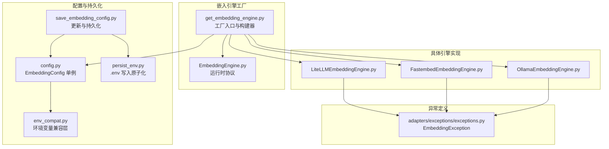
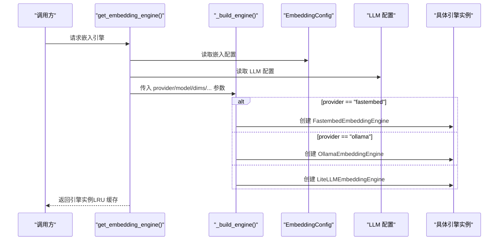
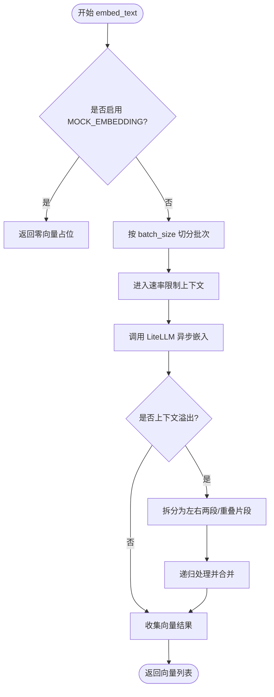
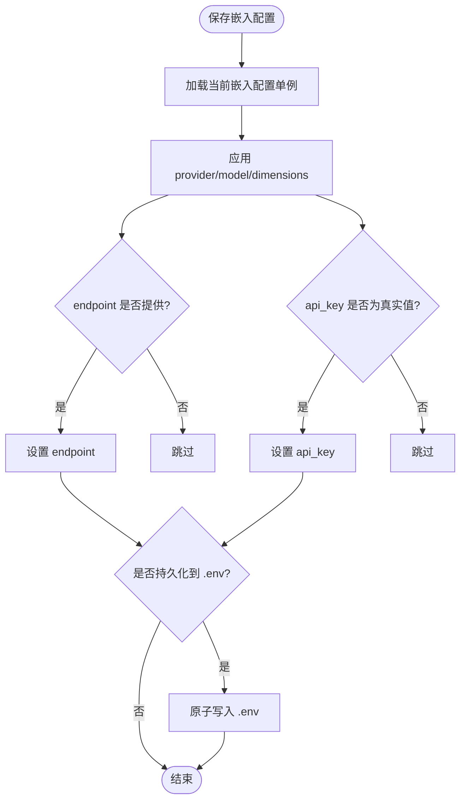
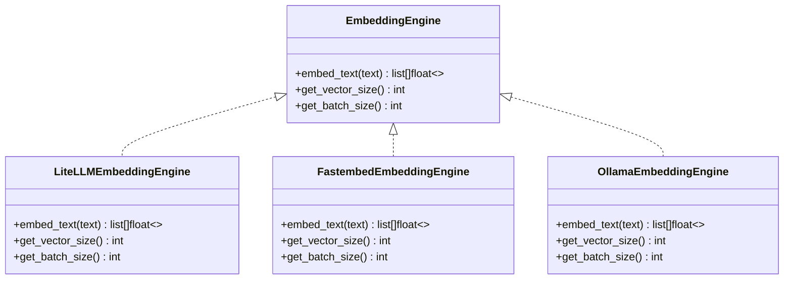

# 嵌入引擎工厂

<cite>
**本文引用的文件**
- [get_embedding_engine.py](file://m_flow/adapters/vector/embeddings/get_embedding_engine.py)
- [EmbeddingEngine.py](file://m_flow/adapters/vector/embeddings/EmbeddingEngine.py)
- [LiteLLMEmbeddingEngine.py](file://m_flow/adapters/vector/embeddings/LiteLLMEmbeddingEngine.py)
- [FastembedEmbeddingEngine.py](file://m_flow/adapters/vector/embeddings/FastembedEmbeddingEngine.py)
- [OllamaEmbeddingEngine.py](file://m_flow/adapters/vector/embeddings/OllamaEmbeddingEngine.py)
- [config.py](file://m_flow/adapters/vector/embeddings/config.py)
- [save_embedding_config.py](file://m_flow/config/settings/save_embedding_config.py)
- [env_compat.py](file://m_flow/config/env_compat.py)
- [persist_env.py](file://m_flow/config/settings/persist_env.py)
- [exceptions.py](file://m_flow/adapters/exceptions/exceptions.py)
- [__init__.py](file://m_flow/adapters/vector/embeddings/__init__.py)
</cite>

## 目录
1. [简介](#简介)
2. [项目结构](#项目结构)
3. [核心组件](#核心组件)
4. [架构总览](#架构总览)
5. [详细组件分析](#详细组件分析)
6. [依赖分析](#依赖分析)
7. [性能考虑](#性能考虑)
8. [故障排查指南](#故障排查指南)
9. [结论](#结论)
10. [附录](#附录)

## 简介
本文件系统性阐述嵌入引擎工厂的设计与实现，重点覆盖以下方面：
- 工厂模式与动态创建机制：基于配置在运行时选择并实例化具体嵌入引擎（LiteLLM、FastEmbed、Ollama）。
- 配置解析与优先级：环境变量前缀、回退机制、默认值与缓存单例。
- 引擎类型检测与选择逻辑：根据提供商字符串进行分支选择，并处理 API Key 的有效来源。
- 生命周期管理：LRU 缓存确保单例复用，避免重复连接；各引擎内部具备重试与速率限制。
- 配置参数组织：引擎类型、提供商、模型、维度、端点、令牌、批大小等。
- 使用示例：通过工厂获取引擎实例并执行嵌入。
- 错误处理与异常恢复：配置校验、初始化失败、运行时故障与上下文溢出处理。

## 项目结构
嵌入引擎工厂位于向量适配层的嵌入子模块中，采用“协议 + 多实现”的架构，配合配置与持久化模块完成全链路能力。

图表来源
- [get_embedding_engine.py:16-99](file://m_flow/adapters/vector/embeddings/get_embedding_engine.py#L16-L99)
- [EmbeddingEngine.py:14-63](file://m_flow/adapters/vector/embeddings/EmbeddingEngine.py#L14-L63)
- [LiteLLMEmbeddingEngine.py:37-177](file://m_flow/adapters/vector/embeddings/LiteLLMEmbeddingEngine.py#L37-L177)
- [FastembedEmbeddingEngine.py:35-127](file://m_flow/adapters/vector/embeddings/FastembedEmbeddingEngine.py#L35-L127)
- [OllamaEmbeddingEngine.py:38-150](file://m_flow/adapters/vector/embeddings/OllamaEmbeddingEngine.py#L38-L150)
- [config.py:16-68](file://m_flow/adapters/vector/embeddings/config.py#L16-L68)
- [save_embedding_config.py:33-81](file://m_flow/config/settings/save_embedding_config.py#L33-L81)
- [env_compat.py:21-45](file://m_flow/config/env_compat.py#L21-L45)
- [persist_env.py:136-205](file://m_flow/config/settings/persist_env.py#L136-L205)
- [exceptions.py:54-58](file://m_flow/adapters/exceptions/exceptions.py#L54-L58)

章节来源
- [get_embedding_engine.py:16-99](file://m_flow/adapters/vector/embeddings/get_embedding_engine.py#L16-L99)
- [config.py:16-68](file://m_flow/adapters/vector/embeddings/config.py#L16-L68)

## 核心组件
- 工厂函数：负责读取配置、合并 LLM 配置中的 API Key，并调用构建器按提供商创建具体引擎实例。
- 运行时协议：统一嵌入接口，要求实现文本向量化、报告向量维度、建议批大小。
- 具体引擎：
  - LiteLLM 引擎：支持多提供商（OpenAI/Azure 等），内置上下文溢出拆分与重试。
  - FastEmbed 引擎：本地 ONNX 模型，零外部调用，适合离线或低延迟场景。
  - Ollama 引擎：调用本地/远程 Ollama 服务，支持自定义端点与令牌。
- 配置与持久化：EmbeddingConfig 提供默认值与环境变量解析；保存接口支持运行时更新与 .env 原子写入。

章节来源
- [EmbeddingEngine.py:14-63](file://m_flow/adapters/vector/embeddings/EmbeddingEngine.py#L14-L63)
- [LiteLLMEmbeddingEngine.py:37-177](file://m_flow/adapters/vector/embeddings/LiteLLMEmbeddingEngine.py#L37-L177)
- [FastembedEmbeddingEngine.py:35-127](file://m_flow/adapters/vector/embeddings/FastembedEmbeddingEngine.py#L35-L127)
- [OllamaEmbeddingEngine.py:38-150](file://m_flow/adapters/vector/embeddings/OllamaEmbeddingEngine.py#L38-L150)
- [config.py:16-68](file://m_flow/adapters/vector/embeddings/config.py#L16-L68)
- [save_embedding_config.py:33-81](file://m_flow/config/settings/save_embedding_config.py#L33-L81)

## 架构总览
工厂模式通过“配置驱动 + 条件分支”实现动态创建，结合 LRU 缓存保证单例复用，降低资源消耗。

图表来源
- [get_embedding_engine.py:16-99](file://m_flow/adapters/vector/embeddings/get_embedding_engine.py#L16-L99)
- [config.py:65-68](file://m_flow/adapters/vector/embeddings/config.py#L65-L68)

## 详细组件分析

### 工厂与构建器
- 工厂函数读取嵌入配置与 LLM 配置，提取关键参数后调用构建器。
- 构建器依据提供商字符串选择具体实现：
  - fastembed：本地模型，无需外部 API。
  - ollama：本地/远程服务，可指定端点与分词器。
  - 其他：LiteLLM，自动选择 API Key 来源。
- LRU 缓存确保相同配置只创建一次实例，避免重复连接。

章节来源
- [get_embedding_engine.py:16-99](file://m_flow/adapters/vector/embeddings/get_embedding_engine.py#L16-L99)

### 运行时协议与接口契约
- 统一接口要求：embed_text、get_vector_size、get_batch_size。
- 使用运行时协议检查，无需显式继承，满足结构即可被接受。

章节来源
- [EmbeddingEngine.py:14-63](file://m_flow/adapters/vector/embeddings/EmbeddingEngine.py#L14-L63)

### LiteLLM 引擎
- 能力：支持多种提供商（OpenAI、Azure 等），自动选择合适分词器；对上下文溢出进行递归拆分与向量池化；带指数抖动重试。
- 关键行为：
  - 批量请求受速率限制器保护。
  - 上下文溢出时递归拆分或重叠切分后平均融合。
  - API Key 优先使用嵌入配置中的 Key，否则在自定义提供商场景下回退到 LLM 配置中的 Key。
- 错误处理：将常见错误映射为嵌入异常，便于上层捕获与降级。

图表来源
- [LiteLLMEmbeddingEngine.py:85-143](file://m_flow/adapters/vector/embeddings/LiteLLMEmbeddingEngine.py#L85-L143)

章节来源
- [LiteLLMEmbeddingEngine.py:37-177](file://m_flow/adapters/vector/embeddings/LiteLLMEmbeddingEngine.py#L37-L177)

### FastEmbed 引擎
- 能力：本地 ONNX 模型，零外部调用，适合离线或低延迟场景；具备重试与速率限制。
- 关键行为：
  - 支持 MOCK_EMBEDDING，测试时快速返回零向量。
  - 使用 TikToken 分词器进行预处理。
- 错误处理：捕获异常并抛出嵌入异常。

章节来源
- [FastembedEmbeddingEngine.py:35-127](file://m_flow/adapters/vector/embeddings/FastembedEmbeddingEngine.py#L35-L127)

### Ollama 引擎
- 能力：调用本地/远程 Ollama 服务生成嵌入；支持自定义端点与 HuggingFace 分词器；具备重试与速率限制。
- 关键行为：
  - 默认端点与模型常量；支持从环境变量读取 LLM API Key 注入 Authorization 头。
  - MOCK_EMBEDDING 下返回零向量。
- 错误处理：异常统一记录日志并抛出嵌入异常。

章节来源
- [OllamaEmbeddingEngine.py:38-150](file://m_flow/adapters/vector/embeddings/OllamaEmbeddingEngine.py#L38-L150)

### 配置解析与持久化
- 配置类：
  - 默认值：提供者、模型、维度、最大令牌、批大小等。
  - 环境变量前缀：MFLOW_，同时回退到裸变量名以兼容旧部署。
  - 单例缓存：@lru_cache，避免重复解析。
- 更新与持久化：
  - 运行时更新：仅当 DTO 中提供真实非掩码密钥时才写入。
  - .env 原子写入：并发安全，避免竞态；新增键带注释标识。
- 优先级与覆盖：
  - provider/model/dimensions 总是覆盖。
  - endpoint 在提供时覆盖。
  - api_key 仅在非掩码且非空时覆盖。

图表来源
- [save_embedding_config.py:33-81](file://m_flow/config/settings/save_embedding_config.py#L33-L81)
- [persist_env.py:136-205](file://m_flow/config/settings/persist_env.py#L136-L205)
- [env_compat.py:21-45](file://m_flow/config/env_compat.py#L21-L45)

章节来源
- [config.py:16-68](file://m_flow/adapters/vector/embeddings/config.py#L16-L68)
- [save_embedding_config.py:33-81](file://m_flow/config/settings/save_embedding_config.py#L33-L81)
- [env_compat.py:21-45](file://m_flow/config/env_compat.py#L21-L45)
- [persist_env.py:136-205](file://m_flow/config/settings/persist_env.py#L136-L205)

### 引擎类型检测与选择逻辑
- 选择顺序：fastembed → ollama → 其他（LiteLLM）。
- API Key 选择：优先使用嵌入配置中的 Key；若提供商为 custom，则回退到 LLM 配置中的 Key。
- 端点与版本：LiteLLM 引擎支持自定义端点与 API 版本；Ollama 引擎支持自定义端点与 HuggingFace 分词器名称。

章节来源
- [get_embedding_engine.py:41-99](file://m_flow/adapters/vector/embeddings/get_embedding_engine.py#L41-L99)

## 依赖分析
- 组件耦合：
  - 工厂仅依赖配置与 LLM 配置，不直接依赖具体引擎，体现低耦合。
  - 引擎实现依赖协议，遵循运行时协议检查，无需注册表。
- 外部依赖：
  - LiteLLM：异步嵌入调用、重试与速率限制。
  - FastEmbed：ONNX 模型嵌入。
  - Ollama：HTTP 客户端与 SSL 上下文。
- 循环依赖：未发现循环导入；各模块职责清晰。

图表来源
- [EmbeddingEngine.py:14-63](file://m_flow/adapters/vector/embeddings/EmbeddingEngine.py#L14-L63)
- [LiteLLMEmbeddingEngine.py:37-177](file://m_flow/adapters/vector/embeddings/LiteLLMEmbeddingEngine.py#L37-L177)
- [FastembedEmbeddingEngine.py:35-127](file://m_flow/adapters/vector/embeddings/FastembedEmbeddingEngine.py#L35-L127)
- [OllamaEmbeddingEngine.py:38-150](file://m_flow/adapters/vector/embeddings/OllamaEmbeddingEngine.py#L38-L150)

## 性能考虑
- 单例复用：LRU 缓存减少重复初始化与连接成本。
- 批处理：各引擎提供 get_batch_size 建议，工厂侧也维护批大小配置，提升吞吐。
- 速率限制：嵌入调用均在速率限制上下文中执行，避免突发流量导致限流或失败。
- 本地模型：FastEmbed 与 Ollama 本地化路径显著降低网络开销与延迟。
- 上下文溢出处理：LiteLLM 引擎对超长输入进行拆分与池化，平衡准确性与性能。

## 故障排查指南
- 常见问题与处理：
  - 配置无效或未生效：确认环境变量前缀（MFLOW_）与回退（裸变量名）是否正确；检查 .env 是否被原子写入成功。
  - API Key 未生效：核对提供商为 custom 时是否走 LLM 配置 Key；非 custom 场景需确保嵌入配置 Key 正确。
  - 上下文溢出：LiteLLM 引擎会自动拆分与池化；如仍失败，检查模型上下文窗口与分词器选择。
  - 本地模型不可用：FastEmbed 模型下载或加载失败时，查看日志并确认模型名称与硬件支持。
  - Ollama 服务不可达：检查端点、SSL 上下文与网络连通性；必要时开启 MOCK_EMBEDDING 进行测试。
- 异常类型：嵌入异常统一由嵌入异常类型承载，便于上层捕获与告警。

章节来源
- [exceptions.py:54-58](file://m_flow/adapters/exceptions/exceptions.py#L54-L58)
- [LiteLLMEmbeddingEngine.py:111-116](file://m_flow/adapters/vector/embeddings/LiteLLMEmbeddingEngine.py#L111-L116)
- [FastembedEmbeddingEngine.py:104-110](file://m_flow/adapters/vector/embeddings/FastembedEmbeddingEngine.py#L104-L110)
- [OllamaEmbeddingEngine.py:130-142](file://m_flow/adapters/vector/embeddings/OllamaEmbeddingEngine.py#L130-L142)

## 结论
嵌入引擎工厂通过“配置驱动 + 协议抽象 + 动态构建 + 单例缓存”的设计，在保证灵活性的同时兼顾性能与可靠性。它支持多种提供商与本地化路径，具备完善的错误处理与上下文溢出恢复策略，并通过环境变量与持久化模块实现平滑的配置管理体验。

## 附录

### 配置参数组织结构
- 基本字段
  - 引擎类型：embedding_provider（fastembed/ollama/custom 等）
  - 模型标识：embedding_model
  - 输出维度：embedding_dimensions
  - 自定义端点：embedding_endpoint
  - API 密钥：embedding_api_key
  - API 版本：embedding_api_version
  - 最大令牌：embedding_max_completion_tokens
  - 批大小：embedding_batch_size
  - HuggingFace 分词器：huggingface_tokenizer
- 默认值与回退
  - 默认提供者与模型、默认维度、默认最大令牌、默认批大小等均有明确默认值。
  - 环境变量优先使用 MFLOW_ 前缀，若不存在则回退到裸变量名。
- 运行时更新
  - provider/model/dimensions 总是覆盖；endpoint 在提供时覆盖；api_key 仅在非掩码且非空时覆盖。
  - 变更可持久化至 .env 文件，采用原子写入保障一致性。

章节来源
- [config.py:16-68](file://m_flow/adapters/vector/embeddings/config.py#L16-L68)
- [save_embedding_config.py:33-81](file://m_flow/config/settings/save_embedding_config.py#L33-L81)
- [env_compat.py:21-45](file://m_flow/config/env_compat.py#L21-L45)

### 使用示例（步骤说明）
- 获取引擎实例
  - 通过工厂函数获取嵌入引擎实例，该实例已按配置完成初始化并缓存。
- 执行嵌入
  - 调用引擎的文本嵌入方法，传入字符串列表，返回对应向量列表。
- 批大小与维度
  - 可通过引擎提供的方法查询推荐批大小与输出维度，用于上层调度与存储规划。

章节来源
- [get_embedding_engine.py:16-38](file://m_flow/adapters/vector/embeddings/get_embedding_engine.py#L16-L38)
- [EmbeddingEngine.py:24-63](file://m_flow/adapters/vector/embeddings/EmbeddingEngine.py#L24-L63)