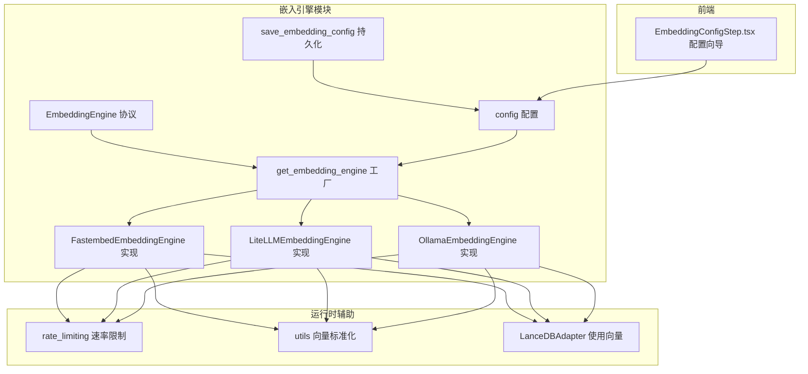
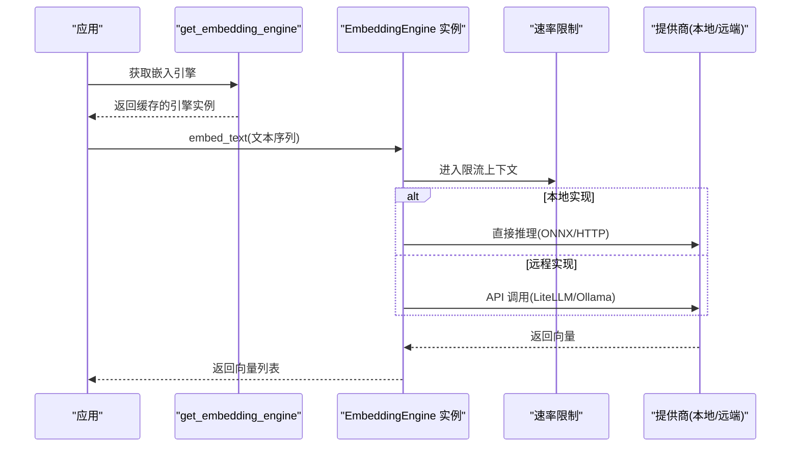
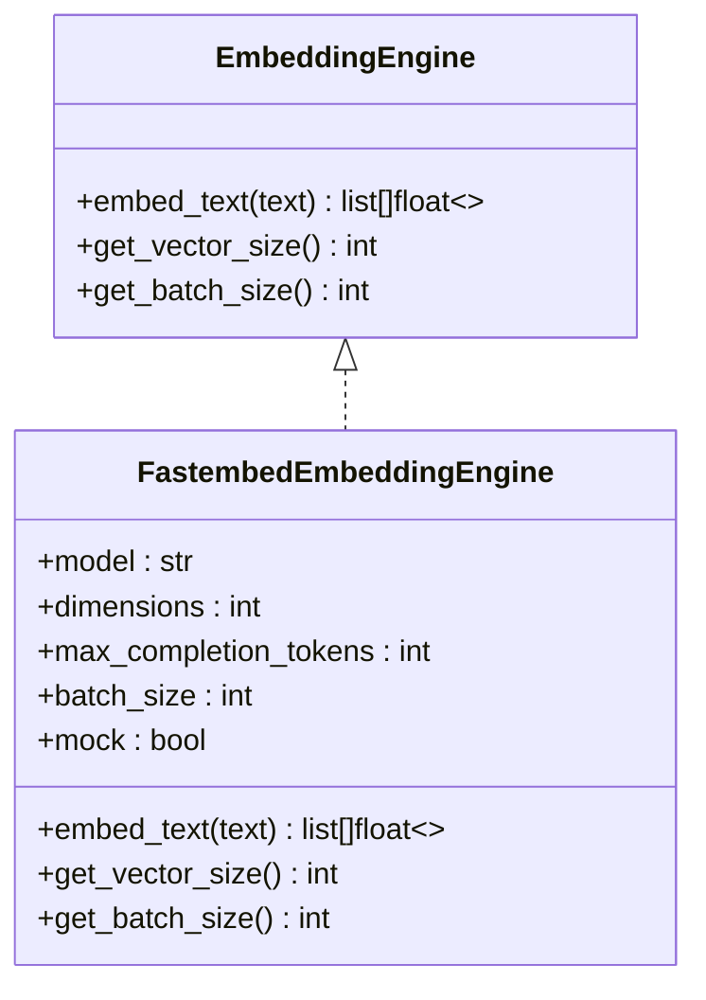
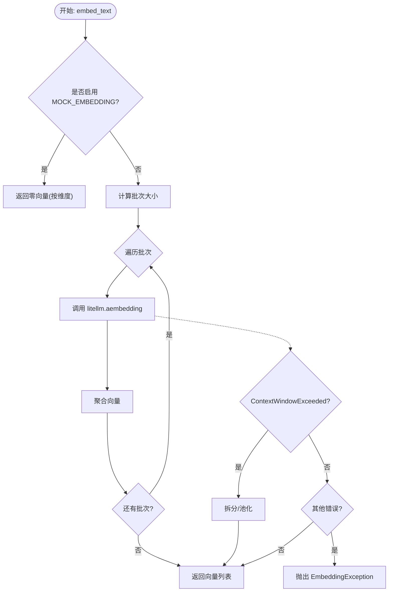
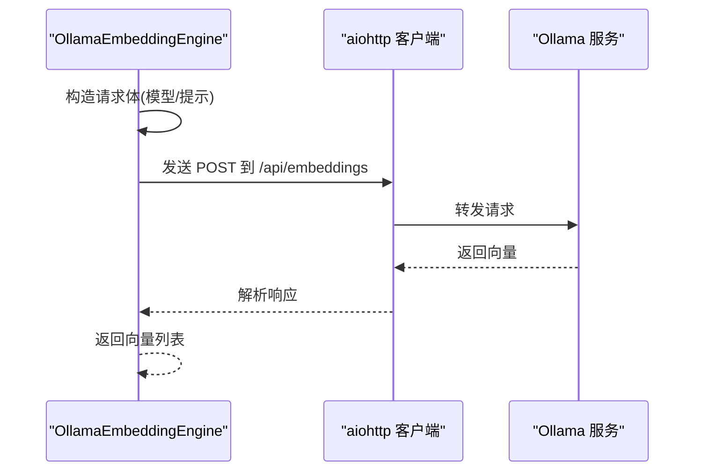
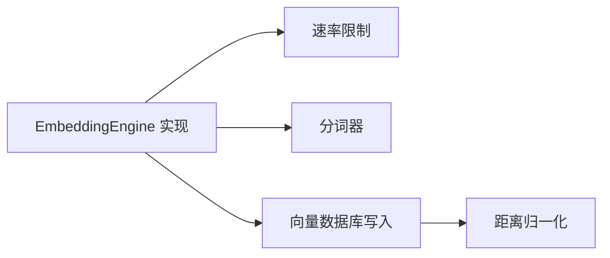

# 嵌入引擎集成

<cite>
**本文引用的文件**   
- [EmbeddingEngine.py](file://m_flow/adapters/vector/embeddings/EmbeddingEngine.py)
- [FastembedEmbeddingEngine.py](file://m_flow/adapters/vector/embeddings/FastembedEmbeddingEngine.py)
- [LiteLLMEmbeddingEngine.py](file://m_flow/adapters/vector/embeddings/LiteLLMEmbeddingEngine.py)
- [OllamaEmbeddingEngine.py](file://m_flow/adapters/vector/embeddings/OllamaEmbeddingEngine.py)
- [get_embedding_engine.py](file://m_flow/adapters/vector/embeddings/get_embedding_engine.py)
- [config.py](file://m_flow/adapters/vector/embeddings/config.py)
- [save_embedding_config.py](file://m_flow/config/settings/save_embedding_config.py)
- [EmbeddingConfigStep.tsx](file://m_flow-frontend/src/components/setup/ConfigWizard/steps/EmbeddingConfigStep.tsx)
- [utils.py](file://m_flow/adapters/vector/utils.py)
- [LanceDBAdapter.py](file://m_flow/adapters/vector/lancedb/LanceDBAdapter.py)
- [rate_limiting.py](file://m_flow/shared/rate_limiting.py)
- [mock_embedding_engine.py](file://m_flow/tests/unit/infrastructure/mock_embedding_engine.py)
- [test_embedding_rate_limiting_realistic.py](file://m_flow/tests/unit/infrastructure/test_embedding_rate_limiting_realistic.py)
</cite>

## 目录
1. [简介](#简介)
2. [项目结构](#项目结构)
3. [核心组件](#核心组件)
4. [架构总览](#架构总览)
5. [详细组件分析](#详细组件分析)
6. [依赖分析](#依赖分析)
7. [性能考量](#性能考量)
8. [故障排查指南](#故障排查指南)
9. [结论](#结论)
10. [附录](#附录)

## 简介
本文件系统化梳理了 M-Flow 中嵌入引擎的集成设计与实现，覆盖抽象协议、工厂模式、三大具体实现（FastEmbed、LiteLLM、Ollama），以及配置管理、速率限制、向量标准化与缓存策略。目标是帮助读者快速理解如何在不同部署与成本约束下选择合适的嵌入方案，并掌握统一的嵌入生成接口与最佳实践。

## 项目结构
嵌入引擎相关代码集中在向量适配层的嵌入子模块，采用“协议 + 工厂 + 多实现”的分层设计：
- 协议层：定义统一的嵌入接口，确保不同提供商实现的一致性
- 工厂层：依据配置动态构建并缓存引擎实例
- 实现层：FastEmbed（本地）、LiteLLM（多提供商路由）、Ollama（本地/远程）
- 配置层：集中管理提供商、模型、维度、端点、批次等参数
- 运行时辅助：速率限制、向量标准化、前端配置向导

图表来源
- [EmbeddingEngine.py:1-64](file://m_flow/adapters/vector/embeddings/EmbeddingEngine.py#L1-L64)
- [get_embedding_engine.py:1-100](file://m_flow/adapters/vector/embeddings/get_embedding_engine.py#L1-L100)
- [FastembedEmbeddingEngine.py:1-128](file://m_flow/adapters/vector/embeddings/FastembedEmbeddingEngine.py#L1-L128)
- [LiteLLMEmbeddingEngine.py:1-178](file://m_flow/adapters/vector/embeddings/LiteLLMEmbeddingEngine.py#L1-L178)
- [OllamaEmbeddingEngine.py:1-151](file://m_flow/adapters/vector/embeddings/OllamaEmbeddingEngine.py#L1-L151)
- [config.py:1-69](file://m_flow/adapters/vector/embeddings/config.py#L1-L69)
- [save_embedding_config.py:1-85](file://m_flow/config/settings/save_embedding_config.py#L1-L85)
- [rate_limiting.py:1-59](file://m_flow/shared/rate_limiting.py#L1-L59)
- [utils.py:1-45](file://m_flow/adapters/vector/utils.py#L1-L45)
- [LanceDBAdapter.py:224-265](file://m_flow/adapters/vector/lancedb/LanceDBAdapter.py#L224-L265)
- [EmbeddingConfigStep.tsx:39-86](file://m_flow-frontend/src/components/setup/ConfigWizard/steps/EmbeddingConfigStep.tsx#L39-L86)

章节来源
- [EmbeddingEngine.py:1-64](file://m_flow/adapters/vector/embeddings/EmbeddingEngine.py#L1-L64)
- [get_embedding_engine.py:1-100](file://m_flow/adapters/vector/embeddings/get_embedding_engine.py#L1-L100)
- [config.py:1-69](file://m_flow/adapters/vector/embeddings/config.py#L1-L69)

## 核心组件
- 统一协议：通过结构化协议定义嵌入接口，保证实现一致性
- 工厂函数：基于配置创建并缓存引擎实例，避免重复连接
- 三大实现：本地 FastEmbed、多提供商 LiteLLM、本地/远程 Ollama
- 配置与持久化：集中管理提供商、模型、维度、端点、批次等参数
- 运行时保障：速率限制、向量标准化、前端配置向导

章节来源
- [EmbeddingEngine.py:1-64](file://m_flow/adapters/vector/embeddings/EmbeddingEngine.py#L1-L64)
- [get_embedding_engine.py:16-38](file://m_flow/adapters/vector/embeddings/get_embedding_engine.py#L16-L38)
- [config.py:16-69](file://m_flow/adapters/vector/embeddings/config.py#L16-L69)

## 架构总览
嵌入引擎采用“协议 + 工厂 + 多实现”的架构，核心流程如下：
- 应用通过工厂获取嵌入引擎实例
- 引擎实现统一暴露 embed_text、get_vector_size、get_batch_size 接口
- 工厂根据配置选择具体实现（fastembed/ollama/litellm）
- 引擎内部结合速率限制、重试与上下文切分等机制提升稳定性

图表来源
- [get_embedding_engine.py:16-38](file://m_flow/adapters/vector/embeddings/get_embedding_engine.py#L16-L38)
- [FastembedEmbeddingEngine.py:88-110](file://m_flow/adapters/vector/embeddings/FastembedEmbeddingEngine.py#L88-L110)
- [LiteLLMEmbeddingEngine.py:85-116](file://m_flow/adapters/vector/embeddings/LiteLLMEmbeddingEngine.py#L85-L116)
- [OllamaEmbeddingEngine.py:82-142](file://m_flow/adapters/vector/embeddings/OllamaEmbeddingEngine.py#L82-L142)
- [rate_limiting.py:56-58](file://m_flow/shared/rate_limiting.py#L56-L58)

## 详细组件分析

### 统一协议：EmbeddingEngine
- 设计要点
  - 结构化协议，支持鸭子类型，无需显式继承
  - 统一方法签名：embed_text、get_vector_size、get_batch_size
  - 明确异常契约，便于上层统一处理
- 适用范围
  - 任何嵌入实现只要满足协议即可被工厂识别与使用

章节来源
- [EmbeddingEngine.py:14-63](file://m_flow/adapters/vector/embeddings/EmbeddingEngine.py#L14-L63)

### 工厂：get_embedding_engine
- 功能
  - 从配置与 LLM 配置中读取参数
  - 基于 provider 分支创建具体引擎
  - 使用 LRU 缓存复用引擎实例
- 支持的提供商
  - fastembed：本地模型
  - ollama：本地或远程 Ollama 服务
  - litellm：OpenAI/Azure/第三方兼容提供商

章节来源
- [get_embedding_engine.py:16-38](file://m_flow/adapters/vector/embeddings/get_embedding_engine.py#L16-L38)
- [get_embedding_engine.py:41-99](file://m_flow/adapters/vector/embeddings/get_embedding_engine.py#L41-L99)

### 实现一：FastEmbed 嵌入引擎
- 特点
  - 本地 ONNX 推理，无需网络调用
  - 支持 MOCK_EMBEDDING 环境变量进行测试加速
  - 内置重试与速率限制
  - 使用 TikToken 分词器进行输入预处理
- 关键实现
  - embed_text：批量推理，支持 mock 返回零向量
  - get_vector_size / get_batch_size：返回配置维度与批次
  - 重试策略：指数退避抖动，排除特定异常类型

图表来源
- [EmbeddingEngine.py:14-63](file://m_flow/adapters/vector/embeddings/EmbeddingEngine.py#L14-L63)
- [FastembedEmbeddingEngine.py:35-127](file://m_flow/adapters/vector/embeddings/FastembedEmbeddingEngine.py#L35-L127)

章节来源
- [FastembedEmbeddingEngine.py:35-127](file://m_flow/adapters/vector/embeddings/FastembedEmbeddingEngine.py#L35-L127)

### 实现二：LiteLLM 嵌入引擎
- 特点
  - 多提供商路由，支持 OpenAI、Azure 等
  - 自动上下文窗口溢出处理：拆分与池化
  - 自适应分词器选择（TikToken/Gemini/Mistral/HuggingFace）
  - MOCK_EMBEDDING 支持与重试机制
- 关键实现
  - embed_text：按批次调用 litellm.aembedding，聚合结果
  - 上下文溢出处理：递归拆分与向量平均池化
  - 分词器初始化：根据 provider/model 选择最优分词器

图表来源
- [LiteLLMEmbeddingEngine.py:85-142](file://m_flow/adapters/vector/embeddings/LiteLLMEmbeddingEngine.py#L85-L142)

章节来源
- [LiteLLMEmbeddingEngine.py:37-178](file://m_flow/adapters/vector/embeddings/LiteLLMEmbeddingEngine.py#L37-L178)

### 实现三：Ollama 嵌入引擎
- 特点
  - 通过 HTTP 调用 Ollama 服务，支持本地/远程
  - 默认端点与模型，可配置认证头
  - MOCK_EMBEDDING 支持与重试机制
  - 使用 HuggingFace 分词器进行长度控制
- 关键实现
  - embed_text：对每个文本异步发起请求，聚合结果
  - _request_single_vector：构造 JSON 请求体与安全 SSL 上下文
  - 支持 Authorization 头（Bearer）

图表来源
- [OllamaEmbeddingEngine.py:114-142](file://m_flow/adapters/vector/embeddings/OllamaEmbeddingEngine.py#L114-L142)

章节来源
- [OllamaEmbeddingEngine.py:38-151](file://m_flow/adapters/vector/embeddings/OllamaEmbeddingEngine.py#L38-L151)

### 配置与持久化
- 配置项
  - 提供商、模型、维度、端点、API Key、API Version、最大补全 token、批次大小、HuggingFace 分词器名称
- 持久化
  - 支持将配置写回 .env 文件，保留掩码 API Key 不覆盖

章节来源
- [config.py:16-69](file://m_flow/adapters/vector/embeddings/config.py#L16-L69)
- [save_embedding_config.py:33-81](file://m_flow/config/settings/save_embedding_config.py#L33-L81)

### 前端配置向导
- 提供商选项：OpenAI、Ollama（本地）、FastEmbed（本地）、Azure OpenAI
- 默认模型与维度提示，Ollama 默认端点

章节来源
- [EmbeddingConfigStep.tsx:45-83](file://m_flow-frontend/src/components/setup/ConfigWizard/steps/EmbeddingConfigStep.tsx#L45-L83)

## 依赖分析
- 协议与实现解耦：通过协议与工厂实现松耦合
- 速率限制：统一通过上下文管理器接入，屏蔽实现差异
- 向量标准化：对外检索结果进行距离归一化，便于跨数据库比较
- 引擎到存储：向量写入时使用引擎维度，缺失数据填充零向量

图表来源
- [rate_limiting.py:56-58](file://m_flow/shared/rate_limiting.py#L56-L58)
- [utils.py:13-45](file://m_flow/adapters/vector/utils.py#L13-L45)
- [LanceDBAdapter.py:226-242](file://m_flow/adapters/vector/lancedb/LanceDBAdapter.py#L226-L242)

章节来源
- [rate_limiting.py:1-59](file://m_flow/shared/rate_limiting.py#L1-L59)
- [utils.py:1-45](file://m_flow/adapters/vector/utils.py#L1-L45)
- [LanceDBAdapter.py:224-265](file://m_flow/adapters/vector/lancedb/LanceDBAdapter.py#L224-L265)

## 性能考量
- 批处理与并发
  - 引擎提供 get_batch_size 建议，实际调用会按批次迭代
  - LiteLLM 与 Ollama 使用异步并发请求，提升吞吐
- 本地推理
  - FastEmbed 本地 ONNX 推理，延迟低、带宽开销小
- 速率限制
  - 统一的异步令牌桶限流，可按配置开启/关闭
- 上下文窗口溢出
  - LiteLLM 自动拆分与池化，避免一次性超长输入导致失败
- 向量标准化
  - 对检索距离进行最小-最大归一化，消除不同数据库距离尺度差异

章节来源
- [FastembedEmbeddingEngine.py:95-102](file://m_flow/adapters/vector/embeddings/FastembedEmbeddingEngine.py#L95-L102)
- [LiteLLMEmbeddingEngine.py:96-107](file://m_flow/adapters/vector/embeddings/LiteLLMEmbeddingEngine.py#L96-L107)
- [OllamaEmbeddingEngine.py:88-89](file://m_flow/adapters/vector/embeddings/OllamaEmbeddingEngine.py#L88-L89)
- [rate_limiting.py:23-31](file://m_flow/shared/rate_limiting.py#L23-L31)
- [utils.py:13-45](file://m_flow/adapters/vector/utils.py#L13-L45)

## 故障排查指南
- 常见问题定位
  - API 错误：检查提供商、端点、Key、版本参数
  - 上下文窗口溢出：LiteLLM 会自动拆分，确认输入长度与分词器
  - 速率限制：调整配置或关闭限流以验证
- 测试与调试
  - 使用 MOCK_EMBEDDING 快速回归测试
  - 使用限流测试用例验证真实场景下的稳定性
- 日志与异常
  - 引擎内部捕获异常并包装为 EmbeddingException，便于上层统一处理

章节来源
- [LiteLLMEmbeddingEngine.py:114-116](file://m_flow/adapters/vector/embeddings/LiteLLMEmbeddingEngine.py#L114-L116)
- [FastembedEmbeddingEngine.py:104-110](file://m_flow/adapters/vector/embeddings/FastembedEmbeddingEngine.py#L104-L110)
- [test_embedding_rate_limiting_realistic.py:48-136](file://m_flow/tests/unit/infrastructure/test_embedding_rate_limiting_realistic.py#L48-L136)
- [mock_embedding_engine.py:29-82](file://m_flow/tests/unit/infrastructure/mock_embedding_engine.py#L29-L82)

## 结论
通过统一协议与工厂模式，M-Flow 将 FastEmbed、LiteLLM、Ollama 三种嵌入实现整合为一致的接口，既满足本地低延迟需求，也支持多提供商与成本优化。配合速率限制、上下文溢出处理与向量标准化，可在不同部署与性能目标之间灵活权衡。

## 附录

### 嵌入引擎选择指南
- 本地优先、低延迟：选择 FastEmbed（本地 ONNX）
- 多提供商路由、成本敏感：选择 LiteLLM（OpenAI/Azure/兼容）
- 本地模型服务、可自管：选择 Ollama（本地/远程均可）
- 配置要点：优先设置合适维度与批次，必要时开启限流

章节来源
- [EmbeddingConfigStep.tsx:45-83](file://m_flow-frontend/src/components/setup/ConfigWizard/steps/EmbeddingConfigStep.tsx#L45-L83)
- [config.py:32-46](file://m_flow/adapters/vector/embeddings/config.py#L32-L46)

### 实际使用示例与最佳实践
- 示例路径
  - 获取引擎并生成向量：[get_embedding_engine.py:16-38](file://m_flow/adapters/vector/embeddings/get_embedding_engine.py#L16-L38)
  - 本地推理（FastEmbed）：[FastembedEmbeddingEngine.py:88-110](file://m_flow/adapters/vector/embeddings/FastembedEmbeddingEngine.py#L88-L110)
  - 远程推理（LiteLLM）：[LiteLLMEmbeddingEngine.py:85-116](file://m_flow/adapters/vector/embeddings/LiteLLMEmbeddingEngine.py#L85-L116)
  - HTTP 推理（Ollama）：[OllamaEmbeddingEngine.py:114-142](file://m_flow/adapters/vector/embeddings/OllamaEmbeddingEngine.py#L114-L142)
- 最佳实践
  - 启用速率限制以保护上游 API
  - 针对超长文本使用 LiteLLM 的自动拆分
  - 使用 MOCK_EMBEDDING 进行单元测试
  - 对检索结果进行距离归一化以便比较

章节来源
- [rate_limiting.py:56-58](file://m_flow/shared/rate_limiting.py#L56-L58)
- [utils.py:13-45](file://m_flow/adapters/vector/utils.py#L13-L45)
- [mock_embedding_engine.py:29-82](file://m_flow/tests/unit/infrastructure/mock_embedding_engine.py#L29-L82)