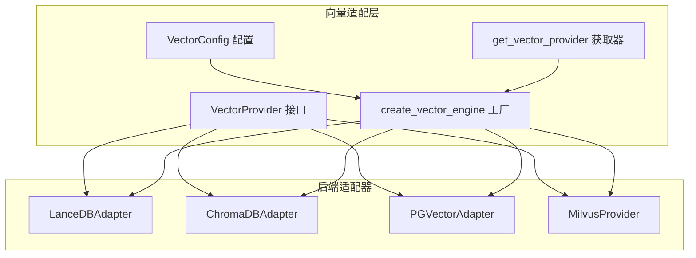
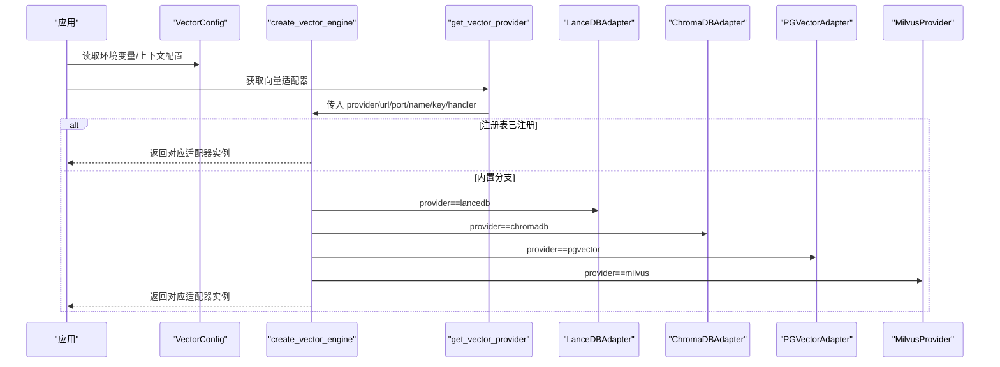
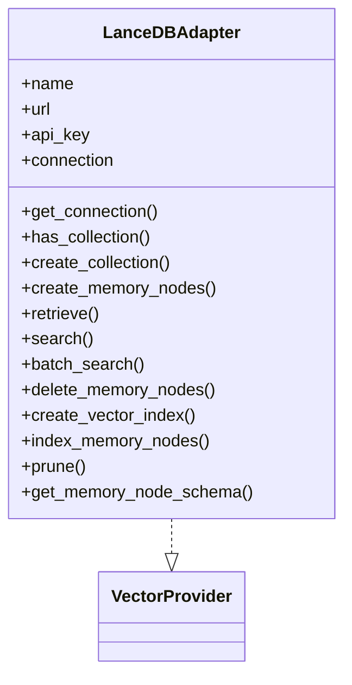
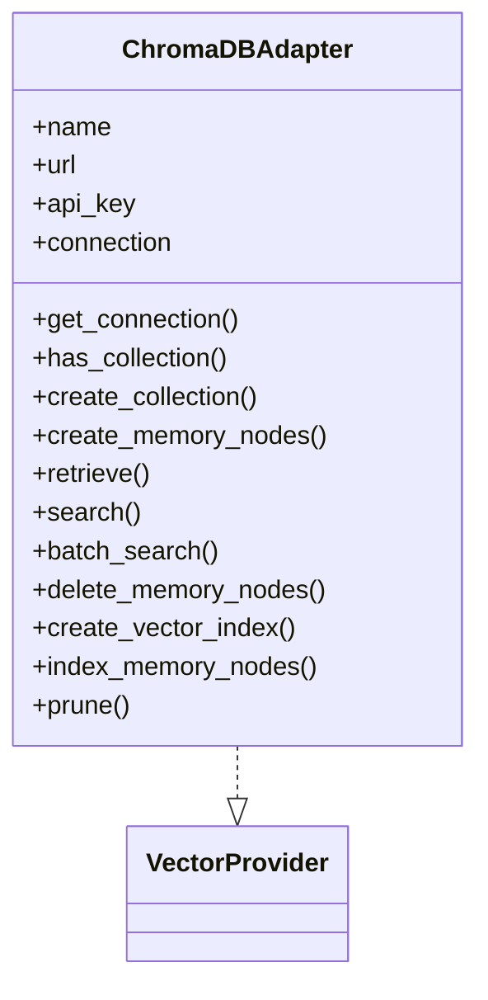
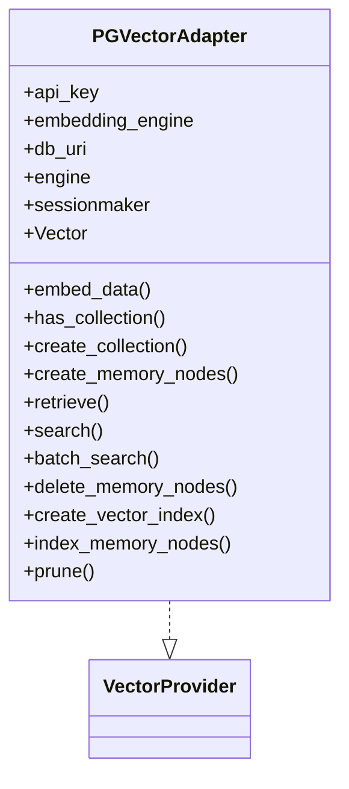
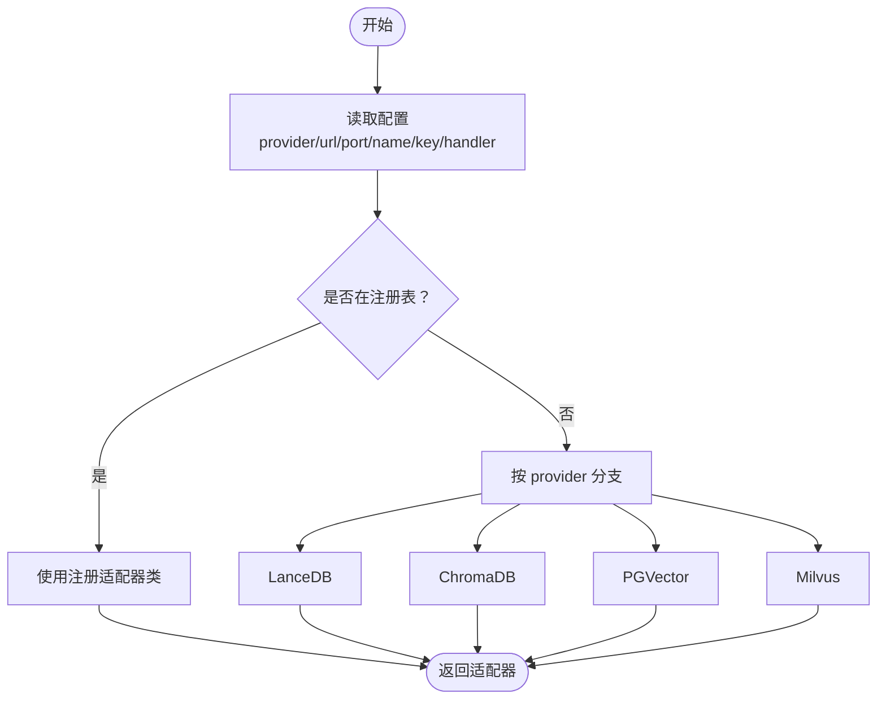
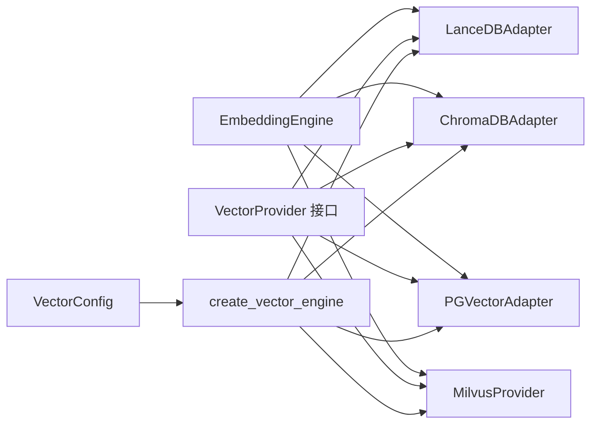
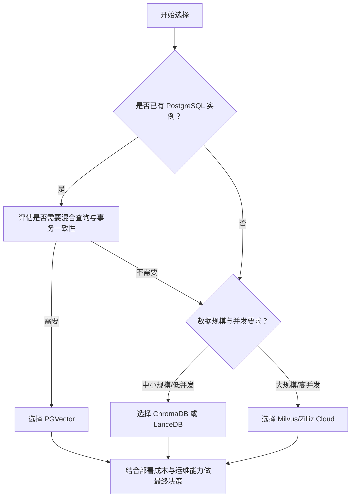

# 支持的向量数据库

<cite>
**本文引用的文件**
- [m_flow/adapters/vector/supported_databases.py](file://m_flow/adapters/vector/supported_databases.py)
- [m_flow/adapters/vector/__init__.py](file://m_flow/adapters/vector/__init__.py)
- [m_flow/adapters/vector/config.py](file://m_flow/adapters/vector/config.py)
- [m_flow/adapters/vector/create_vector_engine.py](file://m_flow/adapters/vector/create_vector_engine.py)
- [m_flow/adapters/vector/get_vector_adapter.py](file://m_flow/adapters/vector/get_vector_adapter.py)
- [m_flow/adapters/vector/vector_db_interface.py](file://m_flow/adapters/vector/vector_db_interface.py)
- [m_flow/adapters/vector/models/VectorSearchHit.py](file://m_flow/adapters/vector/models/VectorSearchHit.py)
- [m_flow/adapters/vector/lancedb/LanceDBAdapter.py](file://m_flow/adapters/vector/lancedb/LanceDBAdapter.py)
- [m_flow/adapters/vector/chromadb/ChromaDBAdapter.py](file://m_flow/adapters/vector/chromadb/ChromaDBAdapter.py)
- [m_flow/adapters/vector/pgvector/PGVectorAdapter.py](file://m_flow/adapters/vector/pgvector/PGVectorAdapter.py)
- [m_flow/adapters/vector/milvus/MilvusProvider.py](file://m_flow/adapters/vector/milvus/MilvusProvider.py)
- [examples/database_examples/pgvector_example.py](file://examples/database_examples/pgvector_example.py)
- [examples/database_examples/chromadb_example.py](file://examples/database_examples/chromadb_example.py)
</cite>

## 目录
1. [简介](#简介)
2. [项目结构](#项目结构)
3. [核心组件](#核心组件)
4. [架构总览](#架构总览)
5. [详细组件分析](#详细组件分析)
6. [依赖关系分析](#依赖关系分析)
7. [性能与特性对比](#性能与特性对比)
8. [故障排查指南](#故障排查指南)
9. [结论](#结论)
10. [附录](#附录)

## 简介
本文件面向需要在系统中选择与集成向量数据库的用户与工程师，系统性梳理当前支持的向量数据库类型及其技术特点、性能特征、扩展能力与限制，并提供配置参数、连接方式、部署要求、兼容性矩阵、迁移指南与性能对比参考。当前已支持的向量数据库包括：LanceDB、PostgreSQL+pgvector、ChromaDB、Milvus/Zilliz Cloud，以及通过统一接口扩展的其他提供商。

## 项目结构
围绕向量数据库的适配层采用“抽象接口 + 工厂 + 各后端适配器”的分层设计：
- 抽象接口：定义统一的向量数据库能力契约
- 工厂与配置：按运行时配置创建具体适配器实例
- 各后端适配器：针对具体数据库实现 CRUD、索引、检索等能力
- 示例：提供最小可用示例，展示如何切换不同后端

图表来源
- [m_flow/adapters/vector/vector_db_interface.py:16-180](file://m_flow/adapters/vector/vector_db_interface.py#L16-L180)
- [m_flow/adapters/vector/config.py:26-77](file://m_flow/adapters/vector/config.py#L26-L77)
- [m_flow/adapters/vector/create_vector_engine.py:15-112](file://m_flow/adapters/vector/create_vector_engine.py#L15-L112)
- [m_flow/adapters/vector/get_vector_adapter.py:11-19](file://m_flow/adapters/vector/get_vector_adapter.py#L11-L19)
- [m_flow/adapters/vector/lancedb/LanceDBAdapter.py:131-446](file://m_flow/adapters/vector/lancedb/LanceDBAdapter.py#L131-L446)
- [m_flow/adapters/vector/chromadb/ChromaDBAdapter.py:155-550](file://m_flow/adapters/vector/chromadb/ChromaDBAdapter.py#L155-L550)
- [m_flow/adapters/vector/pgvector/PGVectorAdapter.py:96-445](file://m_flow/adapters/vector/pgvector/PGVectorAdapter.py#L96-L445)
- [m_flow/adapters/vector/milvus/MilvusProvider.py:28-178](file://m_flow/adapters/vector/milvus/MilvusProvider.py#L28-L178)

章节来源
- [m_flow/adapters/vector/__init__.py:1-7](file://m_flow/adapters/vector/__init__.py#L1-L7)
- [m_flow/adapters/vector/config.py:26-77](file://m_flow/adapters/vector/config.py#L26-L77)
- [m_flow/adapters/vector/create_vector_engine.py:15-112](file://m_flow/adapters/vector/create_vector_engine.py#L15-L112)
- [m_flow/adapters/vector/get_vector_adapter.py:11-19](file://m_flow/adapters/vector/get_vector_adapter.py#L11-L19)

## 核心组件
- 抽象接口 VectorProvider：定义集合管理、节点 CRUD、检索、批量检索、嵌入、维护等方法，确保不同后端具备一致的调用体验。
- 配置与工厂：
  - VectorConfig：封装 vector_db_provider、vector_db_url、vector_db_port、vector_db_name、vector_db_key、vector_dataset_database_handler 等关键参数。
  - create_vector_engine：根据 provider 名称与参数，优先从注册表获取适配器，否则按内置分支创建对应适配器；对 PGVector、ChromaDB、LanceDB、Milvus 等提供内置支持。
  - get_vector_provider：从上下文配置中读取参数并创建适配器实例。
- 搜索结果模型 VectorSearchHit：统一返回 id、score、payload、raw_distance、collection_name 等字段。

章节来源
- [m_flow/adapters/vector/vector_db_interface.py:16-180](file://m_flow/adapters/vector/vector_db_interface.py#L16-L180)
- [m_flow/adapters/vector/config.py:26-77](file://m_flow/adapters/vector/config.py#L26-L77)
- [m_flow/adapters/vector/create_vector_engine.py:15-112](file://m_flow/adapters/vector/create_vector_engine.py#L15-L112)
- [m_flow/adapters/vector/get_vector_adapter.py:11-19](file://m_flow/adapters/vector/get_vector_adapter.py#L11-L19)
- [m_flow/adapters/vector/models/VectorSearchHit.py:13-52](file://m_flow/adapters/vector/models/VectorSearchHit.py#L13-L52)

## 架构总览
下图展示了从配置到适配器实例化的整体流程，以及各后端适配器的职责边界。

图表来源
- [m_flow/adapters/vector/config.py:66-77](file://m_flow/adapters/vector/config.py#L66-L77)
- [m_flow/adapters/vector/get_vector_adapter.py:11-19](file://m_flow/adapters/vector/get_vector_adapter.py#L11-L19)
- [m_flow/adapters/vector/create_vector_engine.py:15-112](file://m_flow/adapters/vector/create_vector_engine.py#L15-L112)
- [m_flow/adapters/vector/lancedb/LanceDBAdapter.py:131-150](file://m_flow/adapters/vector/lancedb/LanceDBAdapter.py#L131-L150)
- [m_flow/adapters/vector/chromadb/ChromaDBAdapter.py:155-211](file://m_flow/adapters/vector/chromadb/ChromaDBAdapter.py#L155-L211)
- [m_flow/adapters/vector/pgvector/PGVectorAdapter.py:96-125](file://m_flow/adapters/vector/pgvector/PGVectorAdapter.py#L96-L125)
- [m_flow/adapters/vector/milvus/MilvusProvider.py:28-57](file://m_flow/adapters/vector/milvus/MilvusProvider.py#L28-L57)

## 详细组件分析

### LanceDB 适配器
- 角色定位：本地/文件系统型向量数据库，适合开发、单机与边缘场景。
- 关键能力：
  - 异步连接与表级锁控制，保证并发安全
  - 自动 schema 清洗与向量维度推断
  - 安全过滤表达式校验，支持 dataset_id 与 memory_type 过滤
  - 支持索引集合（index_name_property）以加速检索
- 性能与限制：
  - 本地文件系统 IO，适合中小规模数据与低延迟访问
  - 无内置分布式能力，扩展主要依赖文件系统与外部存储
- 配置要点：
  - vector_db_provider=lancedb
  - vector_db_url 指向本地 LanceDB 数据库文件路径或远程服务地址（如适用）
  - vector_db_key 可选认证参数（若远程服务需要）

图表来源
- [m_flow/adapters/vector/lancedb/LanceDBAdapter.py:131-446](file://m_flow/adapters/vector/lancedb/LanceDBAdapter.py#L131-L446)
- [m_flow/adapters/vector/vector_db_interface.py:16-180](file://m_flow/adapters/vector/vector_db_interface.py#L16-L180)

章节来源
- [m_flow/adapters/vector/lancedb/LanceDBAdapter.py:131-446](file://m_flow/adapters/vector/lancedb/LanceDBAdapter.py#L131-L446)

### ChromaDB 适配器
- 角色定位：开源嵌入向量数据库，支持多种部署模式（内存/SQLite/客户端-服务器），适合快速原型与中小规模应用。
- 关键能力：
  - 异步客户端连接与集合管理
  - 元数据序列化/反序列化，支持复杂类型持久化
  - 安全过滤表达式解析，支持 dataset_id 与 memory_type 过滤
  - 支持索引集合与检索
- 性能与限制：
  - 依赖 ChromaDB 服务端性能与网络延迟
  - 对复杂元数据有额外序列化开销
- 配置要点：
  - vector_db_provider=chromadb
  - vector_db_url 指向 ChromaDB 服务端地址
  - vector_db_key 可选令牌（若启用鉴权）

图表来源
- [m_flow/adapters/vector/chromadb/ChromaDBAdapter.py:155-550](file://m_flow/adapters/vector/chromadb/ChromaDBAdapter.py#L155-L550)
- [m_flow/adapters/vector/vector_db_interface.py:16-180](file://m_flow/adapters/vector/vector_db_interface.py#L16-L180)

章节来源
- [m_flow/adapters/vector/chromadb/ChromaDBAdapter.py:155-550](file://m_flow/adapters/vector/chromadb/ChromaDBAdapter.py#L155-L550)

### PostgreSQL + pgvector 适配器
- 角色定位：将向量相似度检索能力扩展至 PostgreSQL，适合已有关系型数据栈、需要混合查询与事务一致性保障的场景。
- 关键能力：
  - 复用现有 PostgreSQL 连接或独立异步连接
  - 动态建表与向量列（pgvector.Vector）管理
  - 基于 JSON payload 存储任意元数据
  - 并发冲突重试与死锁退避
- 性能与限制：
  - 受 PostgreSQL 性能与扩展影响
  - 向量索引与查询优化取决于 pgvector 版本与配置
- 配置要点：
  - vector_db_provider=pgvector
  - 通过关系型数据库配置提供连接串（由 PGVectorAdapter 读取）
  - 需安装 postgres 依赖集

图表来源
- [m_flow/adapters/vector/pgvector/PGVectorAdapter.py:96-445](file://m_flow/adapters/vector/pgvector/PGVectorAdapter.py#L96-L445)
- [m_flow/adapters/vector/vector_db_interface.py:16-180](file://m_flow/adapters/vector/vector_db_interface.py#L16-L180)

章节来源
- [m_flow/adapters/vector/pgvector/PGVectorAdapter.py:96-445](file://m_flow/adapters/vector/pgvector/PGVectorAdapter.py#L96-L445)

### Milvus / Zilliz Cloud 适配器
- 角色定位：分布式向量数据库，适合大规模向量检索与高并发场景。
- 关键能力：
  - 使用 MilvusClient 进行集合管理与数据写入
  - 默认 COSINE 距离与 HNSW 索引
  - 支持批量 upsert、检索与删除
- 性能与限制：
  - 依赖 Milvus 集群规模与索引配置
  - 需要正确设置 dimension 与 metric 类型
- 配置要点：
  - vector_db_provider=milvus
  - MILVUS_URI、MILVUS_TOKEN 环境变量
  - 可通过 collection_prefix 控制命名空间

图表来源
- [m_flow/adapters/vector/milvus/MilvusProvider.py:28-178](file://m_flow/adapters/vector/milvus/MilvusProvider.py#L28-L178)

章节来源
- [m_flow/adapters/vector/milvus/MilvusProvider.py:28-178](file://m_flow/adapters/vector/milvus/MilvusProvider.py#L28-L178)

### 统一工厂与配置
- 工厂 create_vector_engine：
  - 优先从 supported_databases 注册表获取适配器类
  - 内置分支覆盖 lancedb、chromadb、pgvector、milvus 等
  - 对未知 provider 抛出明确错误，提示已知列表
- 配置 VectorConfig：
  - 默认 provider=lancedb，本地默认路径自动计算
  - 支持绝对路径与相对路径转换
  - 输出 to_dict 便于上下文传递

图表来源
- [m_flow/adapters/vector/create_vector_engine.py:15-112](file://m_flow/adapters/vector/create_vector_engine.py#L15-L112)
- [m_flow/adapters/vector/supported_databases.py:7-8](file://m_flow/adapters/vector/supported_databases.py#L7-L8)

章节来源
- [m_flow/adapters/vector/create_vector_engine.py:15-112](file://m_flow/adapters/vector/create_vector_engine.py#L15-L112)
- [m_flow/adapters/vector/config.py:26-77](file://m_flow/adapters/vector/config.py#L26-L77)

## 依赖关系分析
- 适配器均实现 VectorProvider 协议，确保统一调用接口
- 工厂依赖嵌入引擎（EmbeddingEngine）完成文本向量化
- PGVector 适配器复用关系型数据库适配器的连接与会话机制
- 各适配器内部对过滤表达式进行白名单校验，防止注入与越权

图表来源
- [m_flow/adapters/vector/vector_db_interface.py:16-180](file://m_flow/adapters/vector/vector_db_interface.py#L16-L180)
- [m_flow/adapters/vector/create_vector_engine.py:45-55](file://m_flow/adapters/vector/create_vector_engine.py#L45-L55)
- [m_flow/adapters/vector/pgvector/PGVectorAdapter.py:110-125](file://m_flow/adapters/vector/pgvector/PGVectorAdapter.py#L110-L125)

章节来源
- [m_flow/adapters/vector/vector_db_interface.py:16-180](file://m_flow/adapters/vector/vector_db_interface.py#L16-L180)
- [m_flow/adapters/vector/create_vector_engine.py:45-55](file://m_flow/adapters/vector/create_vector_engine.py#L45-L55)

## 性能与特性对比
以下为基于代码实现与行为的通用对比维度（非实测数据）：

- 可靠性与一致性
  - PGVector：依托 PostgreSQL 事务与一致性，适合强一致场景
  - LanceDB/ChromaDB/Milvus：各自数据库的事务与一致性策略不同
- 查询性能
  - 索引类型与参数：Milvus 默认 HNSW+COSINE；PGVector 可自定义索引；LanceDB/ChromaDB 的索引策略由各自实现决定
- 可扩展性
  - Milvus：原生分布式能力，适合大规模扩展
  - LanceDB/ChromaDB：更适合单机或小集群部署
- 易用性
  - PGVector：复用现有关系型基础设施
  - ChromaDB：部署简单，适合快速原型
  - LanceDB：本地文件系统友好
- 过滤与安全
  - 各适配器均对过滤表达式进行白名单校验，仅允许有限字段与值范围

章节来源
- [m_flow/adapters/vector/lancedb/LanceDBAdapter.py:93-117](file://m_flow/adapters/vector/lancedb/LanceDBAdapter.py#L93-L117)
- [m_flow/adapters/vector/chromadb/ChromaDBAdapter.py:109-137](file://m_flow/adapters/vector/chromadb/ChromaDBAdapter.py#L109-L137)
- [m_flow/adapters/vector/pgvector/PGVectorAdapter.py:60-83](file://m_flow/adapters/vector/pgvector/PGVectorAdapter.py#L60-L83)
- [m_flow/adapters/vector/milvus/MilvusProvider.py:78-86](file://m_flow/adapters/vector/milvus/MilvusProvider.py#L78-L86)

## 故障排查指南
- 未知向量提供者
  - 现象：抛出 EnvironmentError，提示已知提供者列表
  - 处理：确认 vector_db_provider 是否拼写正确，或已在注册表中注册
  - 参考：[create_vector_engine:102-111](file://m_flow/adapters/vector/create_vector_engine.py#L102-L111)
- 缺少依赖包
  - 现象：ImportError，提示缺少特定依赖（如 chromadb、pgvector、milvus）
  - 处理：按提示安装相应 extras 或依赖
  - 参考：[create_vector_engine:128-139](file://m_flow/adapters/vector/create_vector_engine.py#L128-L139)
- PGVector 凭据缺失
  - 现象：EnvironmentError，提示缺少关系型数据库凭据
  - 处理：配置关系型数据库连接参数
  - 参考：[create_vector_engine:119-123](file://m_flow/adapters/vector/create_vector_engine.py#L119-L123)
- ChromaDB/Neptune URL 校验失败
  - 现象：ValueError，提示 URL 前缀不合法
  - 处理：确保使用受支持的前缀
  - 参考：[create_vector_engine:161-162](file://m_flow/adapters/vector/create_vector_engine.py#L161-L162)
- 过滤表达式非法
  - 现象：ValueError，提示格式或字段/值不在白名单内
  - 处理：仅使用允许字段与值，遵循 payload.field='value' 格式
  - 参考：[LanceDB:93-117](file://m_flow/adapters/vector/lancedb/LanceDBAdapter.py#L93-L117)、[ChromaDB:109-137](file://m_flow/adapters/vector/chromadb/ChromaDBAdapter.py#L109-L137)、[PGVector:60-83](file://m_flow/adapters/vector/pgvector/PGVectorAdapter.py#L60-L83)

章节来源
- [m_flow/adapters/vector/create_vector_engine.py:119-162](file://m_flow/adapters/vector/create_vector_engine.py#L119-L162)
- [m_flow/adapters/vector/lancedb/LanceDBAdapter.py:93-117](file://m_flow/adapters/vector/lancedb/LanceDBAdapter.py#L93-L117)
- [m_flow/adapters/vector/chromadb/ChromaDBAdapter.py:109-137](file://m_flow/adapters/vector/chromadb/ChromaDBAdapter.py#L109-L137)
- [m_flow/adapters/vector/pgvector/PGVectorAdapter.py:60-83](file://m_flow/adapters/vector/pgvector/PGVectorAdapter.py#L60-L83)

## 结论
系统通过统一接口与工厂模式，屏蔽了不同向量数据库的差异，使用户能够以一致的方式进行集合管理、节点 CRUD、检索与维护操作。在选择上：
- 开发/单机/边缘：优先考虑 LanceDB
- 快速原型/轻量部署：优先考虑 ChromaDB
- 已有关系型数据栈：优先考虑 PGVector
- 大规模/高并发/分布式：优先考虑 Milvus/Zilliz Cloud

## 附录

### 数据库选择决策树

[此图为概念性流程图，无需图表来源]

### 配置参数与连接方式
- 通用参数
  - vector_db_provider：lancedb / chromadb / pgvector / milvus
  - vector_db_url：数据库服务地址或本地路径
  - vector_db_port：端口（可选）
  - vector_db_name：数据库/索引名称（可选）
  - vector_db_key：密钥/令牌（可选）
  - vector_dataset_database_handler：数据集处理器（可选，默认与 provider 一致）
- LanceDB
  - 默认 provider=lancedb，未提供 url 时使用系统根目录下的默认路径
  - 参考：[VectorConfig:29-48](file://m_flow/adapters/vector/config.py#L29-L48)
- ChromaDB
  - 通过 vector_db_url 指定服务端地址
  - 参考：[ChromaDBAdapter:168-186](file://m_flow/adapters/vector/chromadb/ChromaDBAdapter.py#L168-L186)
- PGVector
  - 通过关系型数据库配置提供连接串；工厂会校验必要字段
  - 参考：[create_vector_engine:119-124](file://m_flow/adapters/vector/create_vector_engine.py#L119-L124)
- Milvus
  - 通过环境变量 MILVUS_URI、MILVUS_TOKEN 配置；默认前缀为 mflow
  - 参考：[MilvusProvider:49-56](file://m_flow/adapters/vector/milvus/MilvusProvider.py#L49-L56)

章节来源
- [m_flow/adapters/vector/config.py:29-48](file://m_flow/adapters/vector/config.py#L29-L48)
- [m_flow/adapters/vector/chromadb/ChromaDBAdapter.py:168-186](file://m_flow/adapters/vector/chromadb/ChromaDBAdapter.py#L168-L186)
- [m_flow/adapters/vector/create_vector_engine.py:119-124](file://m_flow/adapters/vector/create_vector_engine.py#L119-L124)
- [m_flow/adapters/vector/milvus/MilvusProvider.py:49-56](file://m_flow/adapters/vector/milvus/MilvusProvider.py#L49-L56)

### 兼容性矩阵与版本支持
- 当前仓库已内置支持的提供者：lancedb、chromadb、pgvector、milvus
- 注册表扩展：可通过 supported_databases 注册自定义适配器类
- 依赖安装：
  - PGVector：需安装 postgres 依赖集
  - ChromaDB：需安装 chromadb
  - Milvus：需安装 pymilvus
- 参考：
  - [supported_databases:7-8](file://m_flow/adapters/vector/supported_databases.py#L7-L8)
  - [create_vector_engine 导入与异常处理:127-139](file://m_flow/adapters/vector/create_vector_engine.py#L127-L139)
  - [MilvusProvider 依赖导入:44-47](file://m_flow/adapters/vector/milvus/MilvusProvider.py#L44-L47)

章节来源
- [m_flow/adapters/vector/supported_databases.py:7-8](file://m_flow/adapters/vector/supported_databases.py#L7-L8)
- [m_flow/adapters/vector/create_vector_engine.py:127-139](file://m_flow/adapters/vector/create_vector_engine.py#L127-L139)
- [m_flow/adapters/vector/milvus/MilvusProvider.py:44-47](file://m_flow/adapters/vector/milvus/MilvusProvider.py#L44-L47)

### 迁移指南
- 通用步骤
  - 在新环境中配置新的 vector_db_provider 与连接参数
  - 使用新的适配器重新构建集合与索引
  - 将旧数据导出并导入新后端（见下方示例）
- 从 ChromaDB 到 PGVector
  - 步骤：导出 ChromaDB 集合中的文档与元数据 → 生成向量 → 写入 PGVector 表 → 建立索引
  - 参考示例：[pgvector_example.py:18-48](file://examples/database_examples/pgvector_example.py#L18-L48)
- 从 ChromaDB 到 Milvus
  - 步骤：遍历集合 → 生成向量 → upsert 到 Milvus 集合 → 建立索引
  - 参考示例：[chromadb_example.py:17-48](file://examples/database_examples/chromadb_example.py#L17-L48)
- 从 LanceDB 到 ChromaDB
  - 步骤：列出表/集合 → 读取记录 → 生成向量 → upsert 到 ChromaDB 集合
  - 注意：ChromaDB 的元数据序列化/反序列化规则需匹配
- 从 PGVector 到 Milvus
  - 步骤：查询表 → 读取 payload 与向量 → upsert 到 Milvus 集合
  - 注意：Milvus 默认 COSINE 距离，PGVector 可自定义距离函数

章节来源
- [examples/database_examples/pgvector_example.py:18-48](file://examples/database_examples/pgvector_example.py#L18-L48)
- [examples/database_examples/chromadb_example.py:17-48](file://examples/database_examples/chromadb_example.py#L17-L48)
- [m_flow/adapters/vector/chromadb/ChromaDBAdapter.py:43-106](file://m_flow/adapters/vector/chromadb/ChromaDBAdapter.py#L43-L106)
- [m_flow/adapters/vector/pgvector/PGVectorAdapter.py:314-385](file://m_flow/adapters/vector/pgvector/PGVectorAdapter.py#L314-L385)
- [m_flow/adapters/vector/milvus/MilvusProvider.py:100-124](file://m_flow/adapters/vector/milvus/MilvusProvider.py#L100-L124)

### 基准测试与性能对比
- 仓库未提供官方基准测试报告
- 建议在目标硬件与数据规模下进行端到端压测，关注指标：
  - 向量生成耗时（嵌入模型推理）
  - 写入吞吐（批量 upsert/insert）
  - 检索延迟与 QPS（不同 limit 与过滤条件下）
  - 索引构建时间与内存占用
- 参考实现中的批处理接口可用于构造测试场景：
  - [LanceDB.batch_search:363-384](file://m_flow/adapters/vector/lancedb/LanceDBAdapter.py#L363-L384)
  - [ChromaDB.batch_search:456-517](file://m_flow/adapters/vector/chromadb/ChromaDBAdapter.py#L456-L517)
  - [PGVector.batch_search:387-407](file://m_flow/adapters/vector/pgvector/PGVectorAdapter.py#L387-L407)
  - [Milvus.batch_search:153-157](file://m_flow/adapters/vector/milvus/MilvusProvider.py#L153-L157)

章节来源
- [m_flow/adapters/vector/lancedb/LanceDBAdapter.py:363-384](file://m_flow/adapters/vector/lancedb/LanceDBAdapter.py#L363-L384)
- [m_flow/adapters/vector/chromadb/ChromaDBAdapter.py:456-517](file://m_flow/adapters/vector/chromadb/ChromaDBAdapter.py#L456-L517)
- [m_flow/adapters/vector/pgvector/PGVectorAdapter.py:387-407](file://m_flow/adapters/vector/pgvector/PGVectorAdapter.py#L387-L407)
- [m_flow/adapters/vector/milvus/MilvusProvider.py:153-157](file://m_flow/adapters/vector/milvus/MilvusProvider.py#L153-L157)