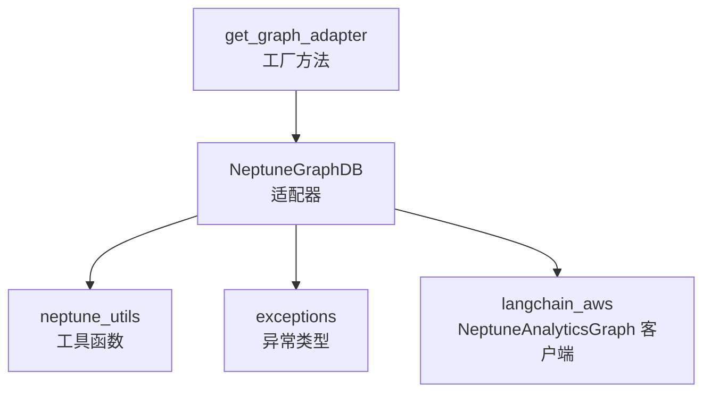
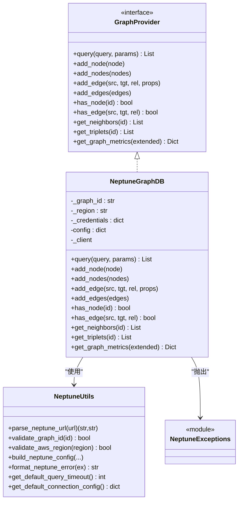
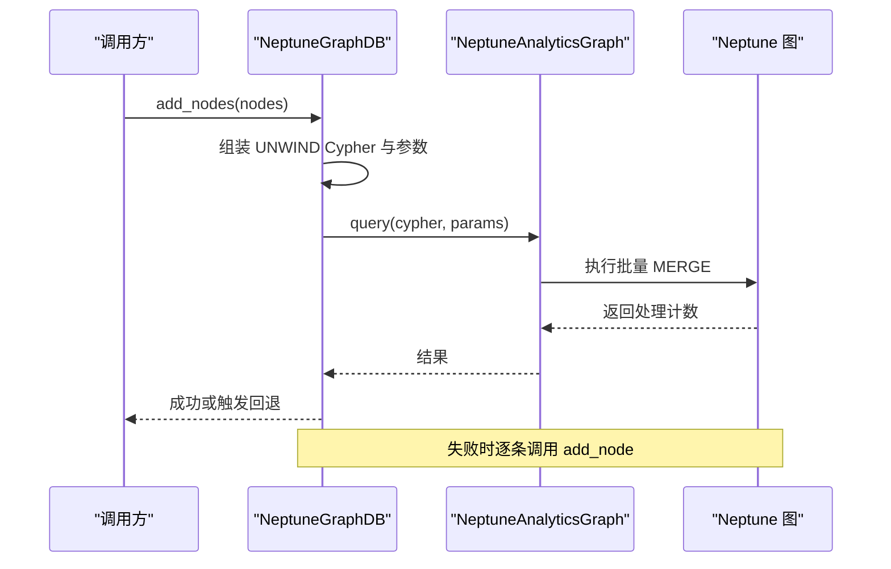
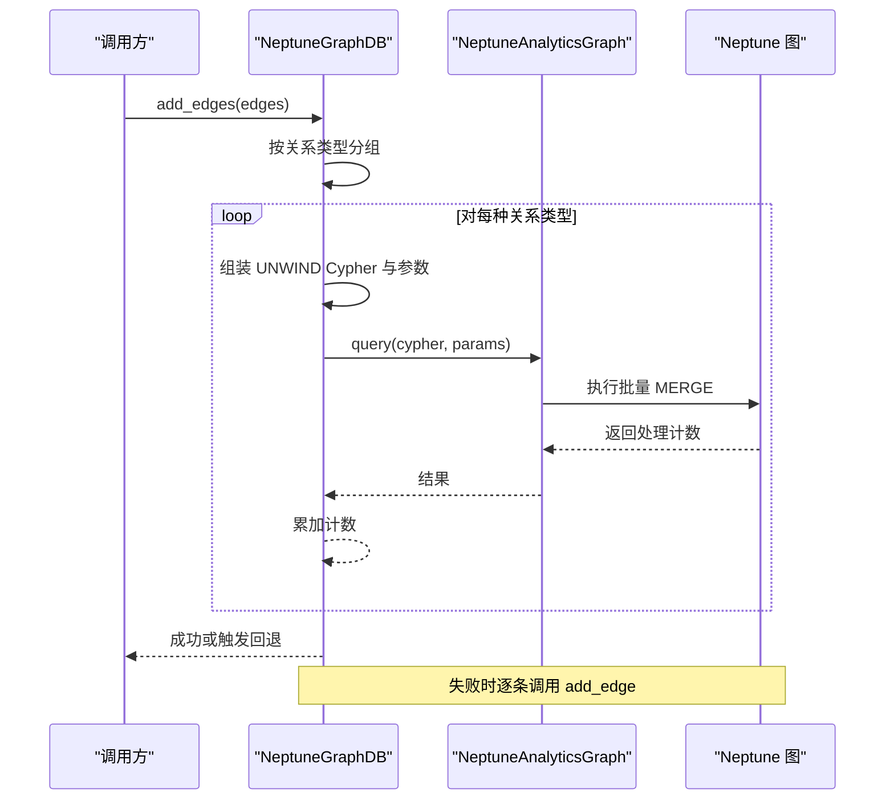
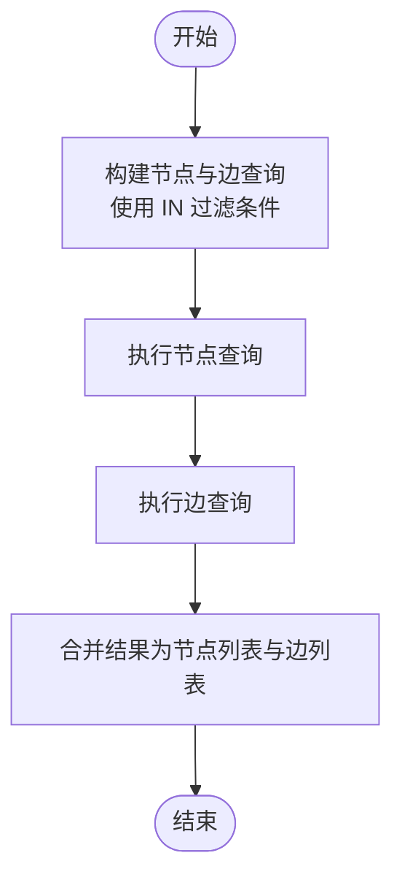
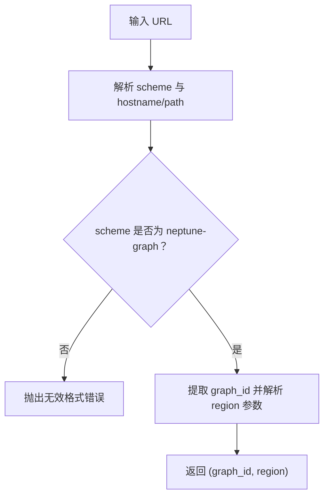
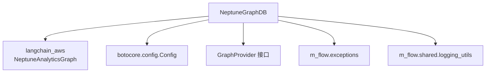

# Amazon Neptune 图数据库适配器

<cite>
**本文引用的文件**
- [adapter.py](file://m_flow/adapters/graph/neptune_driver/adapter.py)
- [neptune_utils.py](file://m_flow/adapters/graph/neptune_driver/neptune_utils.py)
- [exceptions.py](file://m_flow/adapters/graph/neptune_driver/exceptions.py)
- [get_graph_adapter.py](file://m_flow/adapters/graph/get_graph_adapter.py)
- [supported_databases.py](file://m_flow/adapters/graph/supported_databases.py)
- [__init__.py](file://m_flow/adapters/graph/neptune_driver/__init__.py)
- [test_neptune_has_edges_contract.py](file://m_flow/tests/test_neptune_has_edges_contract.py)
- [test_neptune_query_by_attributes.py](file://m_flow/tests/test_neptune_query_by_attributes.py)
- [test_get_graph_adapter_neptune.py](file://m_flow/tests/test_get_graph_adapter_neptune.py)
- [neptune_analytics_example.py](file://examples/database_examples/neptune_analytics_example.py)
</cite>

## 目录
1. [简介](#简介)
2. [项目结构](#项目结构)
3. [核心组件](#核心组件)
4. [架构总览](#架构总览)
5. [详细组件分析](#详细组件分析)
6. [依赖分析](#依赖分析)
7. [性能考虑](#性能考虑)
8. [故障排除指南](#故障排除指南)
9. [结论](#结论)
10. [附录](#附录)

## 简介
本文件为 Amazon Neptune 图数据库适配器的技术文档，聚焦于 Neptune Analytics 的适配实现与扩展能力。文档涵盖以下主题：
- Neptune 适配器设计与架构：基于 openCypher 查询语言的实现、批量操作与回退策略、图度量统计与子图提取。
- 多查询协议支持：以 openCypher 为主，兼容属性过滤查询与节点/边存在性检查等。
- IAM 认证与权限：AWS 凭证注入、区域校验、错误格式化与权限映射。
- 大规模图数据优化：UNWIND 批量写入、按关系类型分组批处理、自动回退到逐条插入。
- Neptune 特性：连接配置、默认超时、查询语言偏好、错误友好化。
- 异常处理与恢复：连接失败、查询错误、认证失败、超时与限流的分类与处理策略。
- 性能优化建议：索引使用、查询计划分析、执行效率提升。
- 配置参数详解：端点配置、安全组设置、监控告警。
- 与 AWS 生态系统集成最佳实践与迁移策略。

## 项目结构
Neptune 适配器位于图数据库适配层中，通过工厂方法解析配置并实例化具体适配器。Neptune Analytics 使用 langchain_aws 提供的客户端进行 openCypher 查询与管理操作。

图表来源
- [get_graph_adapter.py:22-131](file://m_flow/adapters/graph/get_graph_adapter.py#L22-L131)
- [adapter.py:108-215](file://m_flow/adapters/graph/neptune_driver/adapter.py#L108-L215)
- [neptune_utils.py:76-113](file://m_flow/adapters/graph/neptune_driver/neptune_utils.py#L76-L113)

章节来源
- [get_graph_adapter.py:22-131](file://m_flow/adapters/graph/get_graph_adapter.py#L22-L131)
- [adapter.py:108-215](file://m_flow/adapters/graph/neptune_driver/adapter.py#L108-L215)
- [neptune_utils.py:76-113](file://m_flow/adapters/graph/neptune_driver/neptune_utils.py#L76-L113)

## 核心组件
- NeptuneGraphDB：实现 GraphProvider 接口，提供 openCypher 查询、节点/边 CRUD、邻居与三元组检索、图统计与子图提取等能力。
- neptune_utils：提供 URL 解析、参数校验（区域、图 ID）、配置构建、错误友好化与默认连接参数。
- exceptions：定义 Neptune 相关的异常类型，覆盖连接、查询、认证、配置、超时、限流、资源不存在与参数错误。
- 工厂方法 get_graph_adapter：根据配置选择适配器，支持 neptune 与 neptune_analytics，并对 URL 前缀进行校验。

章节来源
- [adapter.py:108-215](file://m_flow/adapters/graph/neptune_driver/adapter.py#L108-L215)
- [neptune_utils.py:29-113](file://m_flow/adapters/graph/neptune_driver/neptune_utils.py#L29-L113)
- [exceptions.py:25-85](file://m_flow/adapters/graph/neptune_driver/exceptions.py#L25-L85)
- [get_graph_adapter.py:22-131](file://m_flow/adapters/graph/get_graph_adapter.py#L22-L131)

## 架构总览
Neptune 适配器采用“工厂 + 适配器 + 工具 + 异常”的分层设计。工厂负责解析环境变量与 URL 前缀，适配器封装 openCypher 查询与批量操作，工具模块提供参数校验与错误格式化，异常模块统一错误语义。

图表来源
- [adapter.py:108-215](file://m_flow/adapters/graph/neptune_driver/adapter.py#L108-L215)
- [neptune_utils.py:29-153](file://m_flow/adapters/graph/neptune_driver/neptune_utils.py#L29-L153)
- [exceptions.py:25-85](file://m_flow/adapters/graph/neptune_driver/exceptions.py#L25-L85)

## 详细组件分析

### 组件一：NeptuneGraphDB 适配器
- 设计要点
  - 以 openCypher 作为主要查询语言，所有操作均通过 query 方法执行。
  - 节点标签固定为 MFLOW_NODE，便于在查询中统一约束。
  - 批量操作采用 UNWIND 语法，按关系类型分组以减少往返次数；失败时自动回退到逐条插入。
  - 属性存储前进行序列化与类型转换，确保与 Neptune 兼容。
  - 提供邻居、三元组、连通分量统计、自环计数等图度量与子图提取能力。

- 关键流程（批量节点插入）

图表来源
- [adapter.py:282-315](file://m_flow/adapters/graph/neptune_driver/adapter.py#L282-L315)

- 关键流程（批量边插入）

图表来源
- [adapter.py:487-535](file://m_flow/adapters/graph/neptune_driver/adapter.py#L487-L535)

- 关键流程（属性过滤查询）

图表来源
- [test_neptune_query_by_attributes.py:13-42](file://m_flow/tests/test_neptune_query_by_attributes.py#L13-L42)

章节来源
- [adapter.py:216-800](file://m_flow/adapters/graph/neptune_driver/adapter.py#L216-L800)
- [test_neptune_has_edges_contract.py:8-35](file://m_flow/tests/test_neptune_has_edges_contract.py#L8-L35)
- [test_neptune_query_by_attributes.py:13-42](file://m_flow/tests/test_neptune_query_by_attributes.py#L13-L42)

### 组件二：neptune_utils 工具模块
- 功能概览
  - URL 解析：从 neptune-graph://<GRAPH_ID>?region=<REGION> 中提取 graph_id 与 region。
  - 参数校验：验证 AWS 区域格式与图 ID 规范。
  - 配置构建：组装服务名、区域与凭据字典。
  - 错误友好化：将 AWS 错误类型映射为可读提示。
  - 默认连接参数：查询超时、重试次数、延迟与首选查询语言。

- 关键流程（URL 解析）

图表来源
- [neptune_utils.py:29-63](file://m_flow/adapters/graph/neptune_driver/neptune_utils.py#L29-L63)

章节来源
- [neptune_utils.py:29-153](file://m_flow/adapters/graph/neptune_driver/neptune_utils.py#L29-L153)

### 组件三：异常体系
- 异常分类
  - 连接错误：网络或端点问题。
  - 查询错误：Cypher 语法或语义错误。
  - 认证错误：AWS 凭证拒绝。
  - 配置错误：缺失或无效设置。
  - 超时错误：截止时间超限。
  - 限流错误：速率限制触发。
  - 资源未找到：请求实体不存在。
  - 参数错误：输入参数不合法。

- 错误映射
  - 将常见 AWS 错误类型映射为用户可理解的提示，便于快速定位问题。

章节来源
- [exceptions.py:25-85](file://m_flow/adapters/graph/neptune_driver/exceptions.py#L25-L85)

### 组件四：工厂方法与注册机制
- 工厂方法
  - 支持 neptune 与 neptune_analytics 两种 Provider。
  - 对传入 URL 做前缀校验（neptune-graph://），并从 URL 中剥离 graph_id 传递给适配器。
  - 依赖 langchain_aws 可用性检测，缺失时报错引导安装。

- 注册机制
  - 通过 supported_databases 字典扩展第三方适配器。

章节来源
- [get_graph_adapter.py:22-131](file://m_flow/adapters/graph/get_graph_adapter.py#L22-L131)
- [supported_databases.py](file://m_flow/adapters/graph/supported_databases.py#L7)

## 依赖分析
- 外部依赖
  - langchain_aws：NeptuneAnalyticsGraph 客户端。
  - botocore.config.Config：用于设置用户代理等 AWS 客户端配置。
- 内部依赖
  - GraphProvider 接口契约：保证不同图数据库适配器的一致行为。
  - m_flow.exceptions：异常基类与状态码映射。
  - m_flow.shared.logging_utils：日志记录。

图表来源
- [adapter.py:184-214](file://m_flow/adapters/graph/neptune_driver/adapter.py#L184-L214)
- [get_graph_adapter.py:149-155](file://m_flow/adapters/graph/get_graph_adapter.py#L149-L155)

章节来源
- [adapter.py:184-214](file://m_flow/adapters/graph/neptune_driver/adapter.py#L184-L214)
- [get_graph_adapter.py:149-155](file://m_flow/adapters/graph/get_graph_adapter.py#L149-L155)

## 性能考虑
- 批量操作
  - 使用 UNWIND 与 MERGE 实现批量节点/边插入，显著降低网络往返。
  - 按关系类型分组批处理，减少查询分支数量。
  - 失败自动回退到逐条插入，保障一致性。
- 查询优化
  - 在节点与边查询中使用 IN 条件与标签约束，减少扫描范围。
  - 使用 LIMIT 与 DISTINCT 控制结果集大小。
  - 合理使用索引（如节点 ~id 字段）以加速匹配。
- 资源管理
  - 默认查询超时为 300 秒，可根据负载调整。
  - 重试策略与指数退避可缓解瞬时抖动。
- 内存与并发
  - 批量参数应控制在合理范围内，避免单次请求过大。
  - 并行任务需结合 Neptune 的吞吐限制与限流策略。

## 故障排除指南
- 连接失败
  - 检查 graph_id 与 region 格式是否符合规范。
  - 确认 AWS 凭证有效且具备访问 Neptune 图的权限。
  - 使用 format_neptune_error 获取更友好的错误提示。
- 查询超时
  - 增大查询超时时间或拆分复杂查询。
  - 分析查询计划，添加必要索引与标签。
- 限流与配额
  - 实施指数退避与重试策略。
  - 降低并发或分批提交请求。
- 资源不存在
  - 确认节点/边 ID 存在后再执行删除或更新。
  - 使用 has_node/has_edge 进行预检查。

章节来源
- [exceptions.py:32-85](file://m_flow/adapters/graph/neptune_driver/exceptions.py#L32-L85)
- [neptune_utils.py:121-137](file://m_flow/adapters/graph/neptune_driver/neptune_utils.py#L121-L137)

## 结论
该 Neptune 适配器以 openCypher 为核心，提供了完整的节点/边 CRUD、批量操作与图度量能力，并通过工具模块与异常体系实现了良好的可维护性与可观测性。结合 AWS 凭证与区域校验，适配器能够稳定地接入 Neptune Analytics 并支撑大规模图数据场景。

## 附录

### 查询性能优化指南
- 索引使用
  - 为常用过滤字段（如 ~id）建立索引以加速匹配。
- 查询计划分析
  - 使用 EXPLAIN/PROFILE 分析查询路径，识别全表扫描与高成本操作。
- 执行效率提升
  - 合理拆分复杂查询，避免一次性返回过大数据集。
  - 使用 LIMIT 控制输出规模，按需分页。

### 配置参数详解
- 端点配置
  - URL 前缀：neptune-graph://
  - graph_id：图标识符，需满足 AWS 命名规则。
  - region：AWS 区域，需符合格式规范。
- 安全组设置
  - 确保运行环境可访问 Neptune 图所在 VPC 与端点。
- 监控告警
  - 结合 CloudWatch 指标（如查询延迟、错误率、限流次数）设置告警阈值。

### 与 AWS 生态系统集成最佳实践
- 凭证管理
  - 使用 IAM 角色或临时凭证，避免硬编码密钥。
- 网络与安全
  - 通过 VPC 终端节点访问 Neptune，减少公网暴露。
- 迁移策略
  - 从本地或其它图数据库迁移时，先在测试环境验证 openCypher 兼容性与性能。
  - 逐步替换查询路径，保留回滚方案。

章节来源
- [neptune_utils.py:29-153](file://m_flow/adapters/graph/neptune_driver/neptune_utils.py#L29-L153)
- [get_graph_adapter.py:103-122](file://m_flow/adapters/graph/get_graph_adapter.py#L103-L122)
- [neptune_analytics_example.py:18-41](file://examples/database_examples/neptune_analytics_example.py#L18-L41)