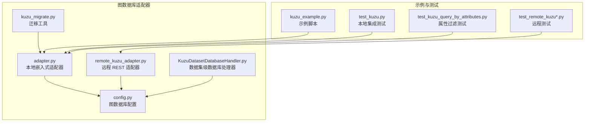
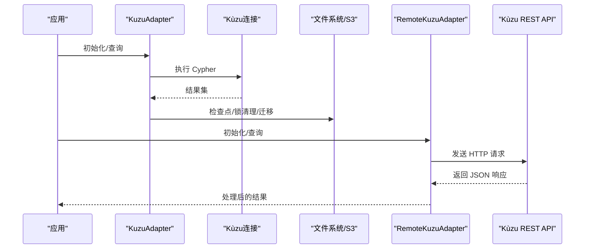
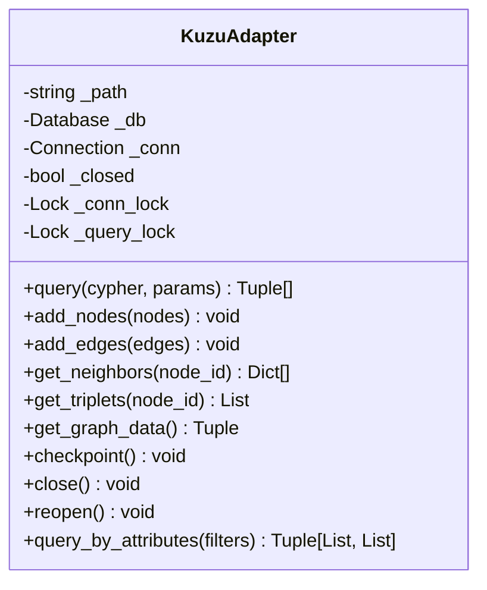
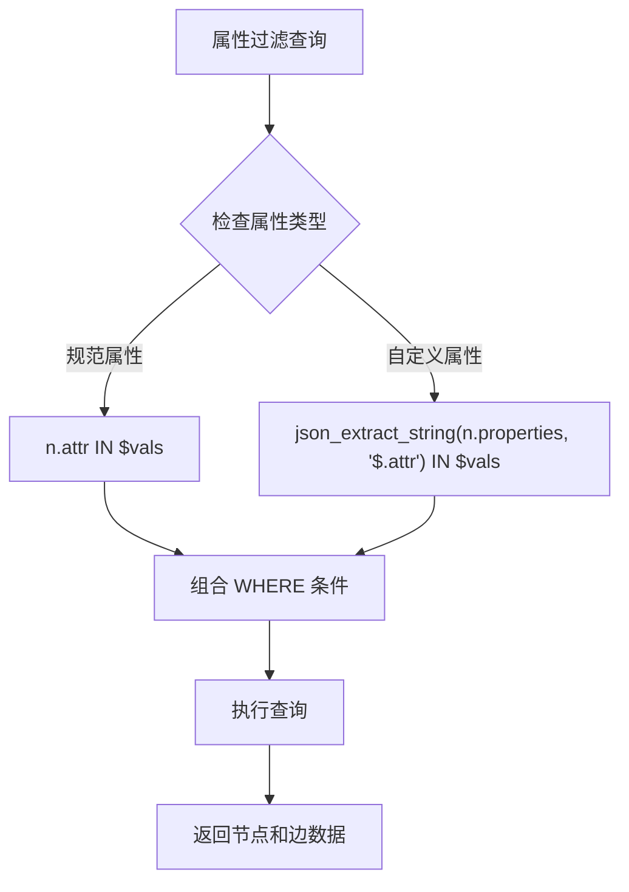
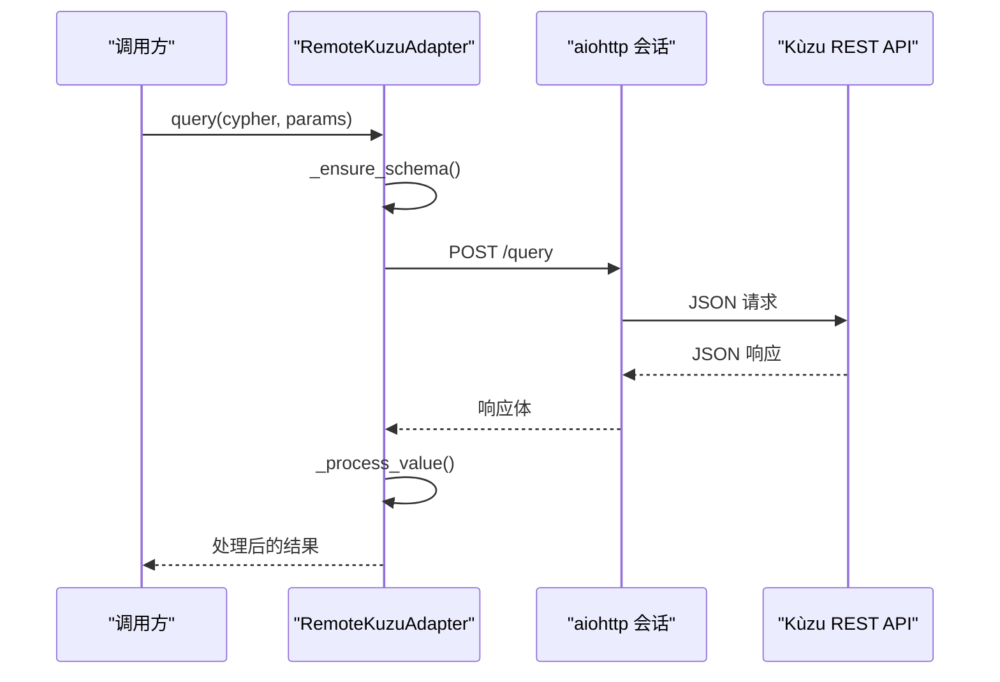
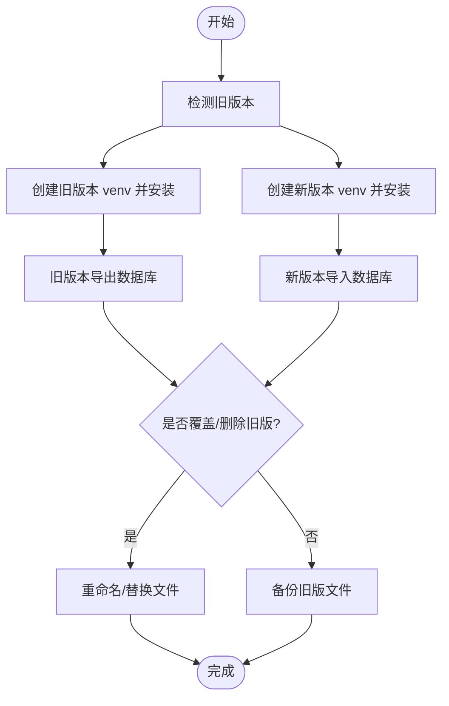
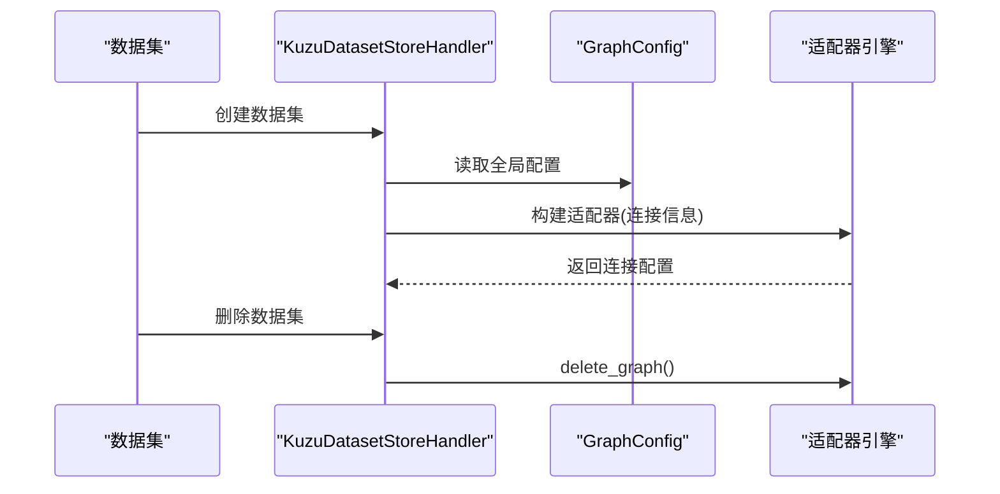
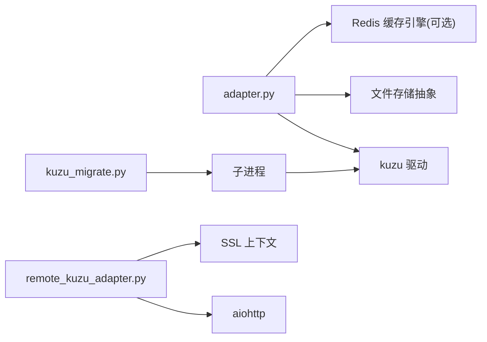

# KùzuDB 本地图数据库适配器

<cite>
**本文引用的文件**
- [adapter.py](file://m_flow/adapters/graph/kuzu/adapter.py)
- [remote_kuzu_adapter.py](file://m_flow/adapters/graph/kuzu/remote_kuzu_adapter.py)
- [kuzu_migrate.py](file://m_flow/adapters/graph/kuzu/kuzu_migrate.py)
- [KuzuDatasetDatabaseHandler.py](file://m_flow/adapters/graph/kuzu/KuzuDatasetDatabaseHandler.py)
- [config.py](file://m_flow/adapters/graph/config.py)
- [kuzu_example.py](file://examples/database_examples/kuzu_example.py)
- [test_kuzu.py](file://m_flow/tests/test_kuzu.py)
- [test_remote_kuzu.py](file://m_flow/tests/test_remote_kuzu.py)
- [test_remote_kuzu_stress.py](file://m_flow/tests/test_remote_kuzu_stress.py)
- [test_kuzu_query_by_attributes.py](file://m_flow/tests/unit/infrastructure/graph/test_kuzu_query_by_attributes.py)
</cite>

## 更新摘要
**变更内容**
- 更新了属性过滤功能的实现细节，现在能够区分规范属性（id、name、type、created_at、updated_at）和存储在 JSON 格式中的自定义属性
- 新增了 `query_by_attributes` 方法的详细说明，支持更灵活的图节点查询
- 增强了属性过滤的查询优化策略

## 目录
1. [简介](#简介)
2. [项目结构](#项目结构)
3. [核心组件](#核心组件)
4. [架构总览](#架构总览)
5. [详细组件分析](#详细组件分析)
6. [依赖关系分析](#依赖关系分析)
7. [性能考虑](#性能考虑)
8. [故障排查指南](#故障排查指南)
9. [结论](#结论)
10. [附录](#附录)

## 简介
本文件面向 KùzuDB 本地图数据库适配器的技术文档，系统阐述其在 M-Flow 中的实现与使用方式。重点覆盖以下方面：
- 嵌入式数据库架构：本地文件存储、可选 S3 同步、WAL 检查点与锁清理
- 查询执行引擎：Cypher 查询封装、批量写入冲突处理、属性过滤检索
- 数据模型与存储：节点/边表结构、JSON 属性序列化、时间戳转换
- 并发与一致性：连接状态锁、查询串行化、分布式 Redis 锁（可选）
- 迁移工具：版本检测、虚拟环境隔离、导入导出迁移流程
- 配置参数：内存池大小、最大数据库容量、S3 存储开关
- 使用示例与测试：本地集成测试、远程适配器测试、属性过滤单元测试

## 项目结构
KùzuDB 适配器位于图数据库适配器子模块中，围绕本地/远程两种模式提供统一接口，并支持按数据集隔离的数据库实例管理。

**图表来源**
- [adapter.py:144-195](file://m_flow/adapters/graph/kuzu/adapter.py#L144-L195)
- [remote_kuzu_adapter.py:75-103](file://m_flow/adapters/graph/kuzu/remote_kuzu_adapter.py#L75-L103)
- [kuzu_migrate.py:145-204](file://m_flow/adapters/graph/kuzu/kuzu_migrate.py#L145-L204)
- [KuzuDatasetDatabaseHandler.py:19-51](file://m_flow/adapters/graph/kuzu/KuzuDatasetDatabaseHandler.py#L19-L51)
- [config.py:29-106](file://m_flow/adapters/graph/config.py#L29-L106)
- [kuzu_example.py:16-36](file://examples/database_examples/kuzu_example.py#L16-L36)
- [test_kuzu.py:30-152](file://m_flow/tests/test_kuzu.py#L30-L152)
- [test_remote_kuzu.py](file://m_flow/tests/test_remote_kuzu.py)
- [test_remote_kuzu_stress.py](file://m_flow/tests/test_remote_kuzu_stress.py)
- [test_kuzu_query_by_attributes.py](file://m_flow/tests/unit/infrastructure/graph/test_kuzu_query_by_attributes.py)

**章节来源**
- [adapter.py:144-195](file://m_flow/adapters/graph/kuzu/adapter.py#L144-L195)
- [config.py:29-106](file://m_flow/adapters/graph/config.py#L29-L106)

## 核心组件
- 本地嵌入式适配器：提供异步查询、节点/边 CRUD、批量写入、图遍历、属性过滤、图统计等能力；支持本地文件系统与可选 S3 同步；内置锁清理与版本迁移逻辑。
- 远程 REST 适配器：基于 HTTP 客户端通过 REST API 访问远端 Kùzu 实例，自动初始化表结构并进行请求/响应值处理。
- 迁移工具：检测旧版本存储版本、创建隔离虚拟环境、导出/导入数据库，支持覆盖或备份旧版本。
- 数据集数据库处理器：为每个数据集创建独立的 Kùzu 数据库实例，负责创建与删除生命周期管理。
- 图数据库配置：集中管理提供方、路径、文件名、模型类型等参数，并提供上下文覆盖机制。

**章节来源**
- [adapter.py:144-195](file://m_flow/adapters/graph/kuzu/adapter.py#L144-L195)
- [remote_kuzu_adapter.py:75-103](file://m_flow/adapters/graph/kuzu/remote_kuzu_adapter.py#L75-L103)
- [kuzu_migrate.py:145-204](file://m_flow/adapters/graph/kuzu/kuzu_migrate.py#L145-L204)
- [KuzuDatasetDatabaseHandler.py:19-51](file://m_flow/adapters/graph/kuzu/KuzuDatasetDatabaseHandler.py#L19-L51)
- [config.py:29-106](file://m_flow/adapters/graph/config.py#L29-L106)

## 架构总览
下图展示本地与远程两种模式的交互关系及关键组件职责。

**图表来源**
- [adapter.py:490-550](file://m_flow/adapters/graph/kuzu/adapter.py#L490-L550)
- [remote_kuzu_adapter.py:201-239](file://m_flow/adapters/graph/kuzu/remote_kuzu_adapter.py#L201-L239)

## 详细组件分析

### 本地嵌入式适配器（KuzuAdapter）
- 连接与初始化
  - 支持本地路径与 s3:// 前缀初始化，自动安装 JSON 扩展，加载扩展失败时记录告警。
  - 提供检查点强制持久化、关闭/重开、会话上下文管理。
- 并发与一致性
  - 使用 asyncio 锁保护连接状态变更与查询执行，避免线程不安全。
  - 可选 Redis 分布式锁，用于跨进程共享同一数据库实例时的互斥。
- 节点与边操作
  - 单条/批量插入/合并节点，自动去重与冲突回退到逐条写入。
  - 边的批量合并写入，采用"端点分区"策略避免 UNWIND+MERGE 冲突。
  - 属性更新采用读-改-写模式，JSON 字符串解析与合并。
- 图遍历与检索
  - 获取邻居、前驱/后继、三元组、断连节点等。
  - 支持按属性过滤检索，同时返回节点与边集合。
- 数据导出与统计
  - 导出全量图数据，必要时生成自环以满足下游依赖。
  - 计算基础统计指标（节点数、边数、平均度、边密度等）。
- 错误处理与回退
  - 批量写入遇到可恢复冲突（写写冲突/重复键）时，自动降级为逐条写入。
  - 边插入静默失败场景进行告警提示。

**更新** 新增了 `query_by_attributes` 方法，支持区分规范属性和自定义属性的灵活查询

**图表来源**
- [adapter.py:144-195](file://m_flow/adapters/graph/kuzu/adapter.py#L144-L195)
- [adapter.py:490-550](file://m_flow/adapters/graph/kuzu/adapter.py#L490-L550)
- [adapter.py:614-698](file://m_flow/adapters/graph/kuzu/adapter.py#L614-L698)
- [adapter.py:820-966](file://m_flow/adapters/graph/kuzu/adapter.py#L820-L966)
- [adapter.py:997-1074](file://m_flow/adapters/graph/kuzu/adapter.py#L997-L1074)
- [adapter.py:1103-1254](file://m_flow/adapters/graph/kuzu/adapter.py#L1103-L1254)
- [adapter.py:1207-1254](file://m_flow/adapters/graph/kuzu/adapter.py#L1207-L1254)
- [adapter.py:1521-1551](file://m_flow/adapters/graph/kuzu/adapter.py#L1521-L1551)

**章节来源**
- [adapter.py:144-195](file://m_flow/adapters/graph/kuzu/adapter.py#L144-L195)
- [adapter.py:490-550](file://m_flow/adapters/graph/kuzu/adapter.py#L490-L550)
- [adapter.py:614-698](file://m_flow/adapters/graph/kuzu/adapter.py#L614-L698)
- [adapter.py:820-966](file://m_flow/adapters/graph/kuzu/adapter.py#L820-L966)
- [adapter.py:997-1074](file://m_flow/adapters/graph/kuzu/adapter.py#L997-L1074)
- [adapter.py:1103-1254](file://m_flow/adapters/graph/kuzu/adapter.py#L1103-L1254)
- [adapter.py:1207-1254](file://m_flow/adapters/graph/kuzu/adapter.py#L1207-L1254)
- [adapter.py:1521-1551](file://m_flow/adapters/graph/kuzu/adapter.py#L1521-L1551)

### 属性过滤功能（新增）
- 规范属性过滤
  - 支持直接过滤节点的规范属性：id、name、type、created_at、updated_at
  - 使用标准 Cypher 属性访问语法，性能最优
- 自定义属性过滤
  - 支持从 JSON 格式的 properties 字段中提取和过滤自定义属性
  - 使用 `json_extract_string` 函数进行 JSON 路径查询
  - 支持嵌套属性的点号表示法（如 `properties.nested.field`）
- 查询优化策略
  - 规范属性使用直接比较，自定义属性使用 JSON 提取函数
  - 自动参数化查询，防止 SQL 注入攻击
  - 支持多个属性条件的组合查询

**图表来源**
- [adapter.py:1207-1254](file://m_flow/adapters/graph/kuzu/adapter.py#L1207-L1254)

**章节来源**
- [adapter.py:1207-1254](file://m_flow/adapters/graph/kuzu/adapter.py#L1207-L1254)
- [test_kuzu_query_by_attributes.py:19-35](file://m_flow/tests/unit/infrastructure/graph/test_kuzu_query_by_attributes.py#L19-L35)

### 远程 REST 适配器（RemoteKuzuAdapter）
- 会话管理
  - 自动创建/复用 aiohttp 会话，注册进程退出清理钩子，确保连接正确关闭。
- 查询执行
  - 将 Cypher 查询与参数封装为 JSON，POST 到 /query 接口，解析返回值。
  - 首次查询前确保表结构存在，若不存在则创建 Node/EDGE 表。
- 值处理
  - 对返回的节点对象中的 properties 字段进行 JSON 解析并合并到顶层字段。

**图表来源**
- [remote_kuzu_adapter.py:201-239](file://m_flow/adapters/graph/kuzu/remote_kuzu_adapter.py#L201-L239)
- [remote_kuzu_adapter.py:260-342](file://m_flow/adapters/graph/kuzu/remote_kuzu_adapter.py#L260-L342)

**章节来源**
- [remote_kuzu_adapter.py:75-103](file://m_flow/adapters/graph/kuzu/remote_kuzu_adapter.py#L75-L103)
- [remote_kuzu_adapter.py:201-239](file://m_flow/adapters/graph/kuzu/remote_kuzu_adapter.py#L201-L239)
- [remote_kuzu_adapter.py:260-342](file://m_flow/adapters/graph/kuzu/remote_kuzu_adapter.py#L260-L342)

### 迁移工具（kuzu_migrate.py）
- 版本检测
  - 从 catalog.kz 文件中解析存储版本号，映射到 Kùzu 版本字符串。
- 虚拟环境隔离
  - 为目标与源版本分别创建独立 venv，安装对应版本的 kuzu。
- 导出/导入
  - 在源版本中执行 EXPORT DATABASE，在目标版本中执行 IMPORT DATABASE。
- 替换与清理
  - 可选择覆盖原数据库或将旧版本重命名为带版本号的备份文件。

**图表来源**
- [kuzu_migrate.py:38-71](file://m_flow/adapters/graph/kuzu/kuzu_migrate.py#L38-L71)
- [kuzu_migrate.py:145-204](file://m_flow/adapters/graph/kuzu/kuzu_migrate.py#L145-L204)

**章节来源**
- [kuzu_migrate.py:145-204](file://m_flow/adapters/graph/kuzu/kuzu_migrate.py#L145-L204)

### 数据集数据库处理器（KuzuDatasetDatabaseHandler）
- 生命周期管理
  - 为每个数据集创建独立的 Kùzu 数据库实例，删除时根据连接信息构建适配器并执行删除。
- 连接配置
  - 从全局图配置中读取提供方、URL、密钥等参数，组装数据集级连接信息。

**图表来源**
- [KuzuDatasetDatabaseHandler.py:22-51](file://m_flow/adapters/graph/kuzu/KuzuDatasetDatabaseHandler.py#L22-L51)
- [KuzuDatasetDatabaseHandler.py:53-84](file://m_flow/adapters/graph/kuzu/KuzuDatasetDatabaseHandler.py#L53-L84)

**章节来源**
- [KuzuDatasetDatabaseHandler.py:19-51](file://m_flow/adapters/graph/kuzu/KuzuDatasetDatabaseHandler.py#L19-L51)
- [KuzuDatasetDatabaseHandler.py:53-84](file://m_flow/adapters/graph/kuzu/KuzuDatasetDatabaseHandler.py#L53-L84)

### 配置与环境变量
- 全局配置
  - 提供统一的 GraphConfig，支持从环境变量与 .env 文件加载，解析绝对路径，提供哈希化字典以便缓存键使用。
- 本地适配器参数
  - KUZU_BUFFER_POOL_MB：设置缓冲池大小（字节）
  - KUZU_MAX_DB_MB：设置最大数据库容量（字节）
  - STORAGE_BACKEND：当为 "s3" 时启用 S3 同步
- 提供方与路径
  - graph_database_provider: "kuzu"
  - graph_file_path/graph_filename：数据库文件路径与名称
  - graph_model/graph_topology：模型类型

**章节来源**
- [config.py:29-106](file://m_flow/adapters/graph/config.py#L29-L106)
- [adapter.py:259-260](file://m_flow/adapters/graph/kuzu/adapter.py#L259-L260)
- [adapter.py:398-411](file://m_flow/adapters/graph/kuzu/adapter.py#L398-L411)

## 依赖关系分析
- 组件耦合
  - 本地适配器依赖 kuzu Python 驱动与文件存储抽象；可选 Redis 缓存引擎用于分布式锁。
  - 远程适配器依赖 aiohttp 与 SSL 上下文；继承本地适配器以复用查询逻辑。
  - 迁移工具独立运行，通过子进程调用不同版本的 kuzu CLI。
- 外部依赖
  - kuzu：嵌入式数据库内核
  - aiohttp：远程通信
  - pydantic-settings：配置解析
  - redis（可选）：分布式锁

**图表来源**
- [adapter.py:21-34](file://m_flow/adapters/graph/kuzu/adapter.py#L21-L34)
- [remote_kuzu_adapter.py:17-21](file://m_flow/adapters/graph/kuzu/remote_kuzu_adapter.py#L17-L21)
- [kuzu_migrate.py:87-92](file://m_flow/adapters/graph/kuzu/kuzu_migrate.py#L87-L92)

**章节来源**
- [adapter.py:21-34](file://m_flow/adapters/graph/kuzu/adapter.py#L21-L34)
- [remote_kuzu_adapter.py:17-21](file://m_flow/adapters/graph/kuzu/remote_kuzu_adapter.py#L17-L21)
- [kuzu_migrate.py:87-92](file://m_flow/adapters/graph/kuzu/kuzu_migrate.py#L87-L92)

## 性能考虑
- 写入吞吐
  - 批量 MERGE 时采用"端点分区"策略减少写写冲突；冲突时自动降级为逐条写入。
  - 节点/边去重提升批量写入效率，减少重复键冲突。
- 查询执行
  - 使用异步执行器与查询锁避免连接竞争；对复杂查询建议拆分批处理。
  - 属性过滤使用 JSON 提取函数，注意索引缺失时的扫描成本。
  - **更新** 规范属性过滤使用直接比较，性能优于 JSON 提取函数。
- 内存与磁盘
  - 通过环境变量调节缓冲池与最大数据库容量；默认禁用自动检查点以降低 WAL 刷新频率，显式调用以确保持久化。
  - S3 同步仅在 STORAGE_BACKEND 为 "s3" 时启用，避免不必要的网络开销。
- 并发控制
  - 本地模式下使用 asyncio 锁；可选 Redis 锁用于跨进程共享同一数据库实例。

**章节来源**
- [adapter.py:110-142](file://m_flow/adapters/graph/kuzu/adapter.py#L110-L142)
- [adapter.py:664-697](file://m_flow/adapters/graph/kuzu/adapter.py#L664-L697)
- [adapter.py:939-966](file://m_flow/adapters/graph/kuzu/adapter.py#L939-L966)
- [adapter.py:259-294](file://m_flow/adapters/graph/kuzu/adapter.py#L259-L294)
- [adapter.py:398-411](file://m_flow/adapters/graph/kuzu/adapter.py#L398-L411)

## 故障排查指南
- 常见错误与处理
  - 写写冲突/重复键：自动触发批量回退到逐条写入；检查输入数据去重与端点分区策略。
  - 边插入静默失败：当源/目标节点不存在时 MERGE 不生效，记录告警并建议先验证节点存在性。
  - 文件锁残留：启动时清理 .lock/.wal 与父目录同名锁文件；必要时启用"激进清理"。
  - 版本不匹配：检测存储版本并尝试迁移；失败时检查虚拟环境与导出/导入流程。
  - 远程连接异常：检查 API 地址、认证信息与 SSL 上下文；确认首次查询前已初始化表结构。
  - **更新** 属性过滤失败：检查属性名称是否正确，规范属性使用直接访问，自定义属性使用 JSON 路径。
- 日志与诊断
  - 关键路径均记录调试/警告/错误日志，便于定位问题。
  - 提供图统计接口辅助评估数据规模与连通性。

**章节来源**
- [adapter.py:664-697](file://m_flow/adapters/graph/kuzu/adapter.py#L664-L697)
- [adapter.py:871-877](file://m_flow/adapters/graph/kuzu/adapter.py#L871-L877)
- [adapter.py:296-356](file://m_flow/adapters/graph/kuzu/adapter.py#L296-L356)
- [adapter.py:357-373](file://m_flow/adapters/graph/kuzu/adapter.py#L357-L373)
- [remote_kuzu_adapter.py:180-196](file://m_flow/adapters/graph/kuzu/remote_kuzu_adapter.py#L180-L196)
- [remote_kuzu_adapter.py:260-290](file://m_flow/adapters/graph/kuzu/remote_kuzu_adapter.py#L260-L290)
- [adapter.py:1553-1599](file://m_flow/adapters/graph/kuzu/adapter.py#L1553-L1599)

## 结论
KùzuDB 本地图数据库适配器在 M-Flow 中提供了高性能、可扩展的图数据存储方案。通过本地嵌入式与远程 REST 两种模式，结合数据集级隔离、并发控制与版本迁移工具，能够满足从单机开发到分布式部署的多种场景需求。**更新** 新增的属性过滤功能显著提升了图节点查询的灵活性，通过区分规范属性和自定义属性的处理策略，既保证了查询性能又提供了强大的查询能力。建议在生产环境中合理配置内存与磁盘参数，配合检查点与锁清理策略，确保数据一致性与稳定性。

## 附录

### 使用示例
- 示例脚本展示了如何设置提供方、清理存储、添加数据、记忆化以及执行检索。

**章节来源**
- [kuzu_example.py:16-36](file://examples/database_examples/kuzu_example.py#L16-L36)

### 测试参考
- 本地集成测试：验证空库状态、记忆化后非空、检索模式与清理验证。
- 远程测试：覆盖远程适配器初始化、查询与清理流程。
- **更新** 属性过滤测试：验证按节点属性过滤返回节点与边集合，包括规范属性和自定义属性的处理。

**章节来源**
- [test_kuzu.py:30-152](file://m_flow/tests/test_kuzu.py#L30-L152)
- [test_remote_kuzu.py](file://m_flow/tests/test_remote_kuzu.py)
- [test_remote_kuzu_stress.py](file://m_flow/tests/test_remote_kuzu_stress.py)
- [test_kuzu_query_by_attributes.py:19-35](file://m_flow/tests/unit/infrastructure/graph/test_kuzu_query_by_attributes.py#L19-L35)