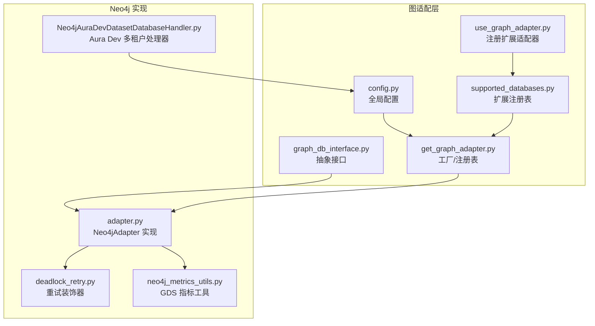
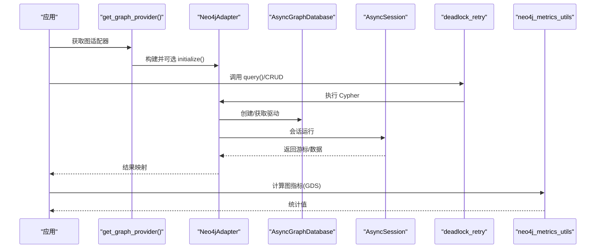
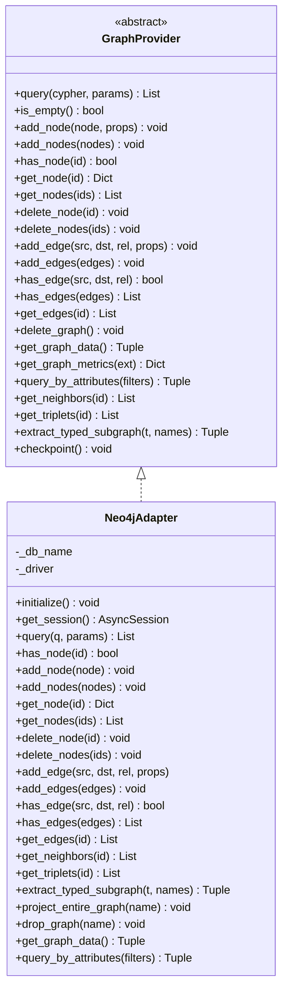
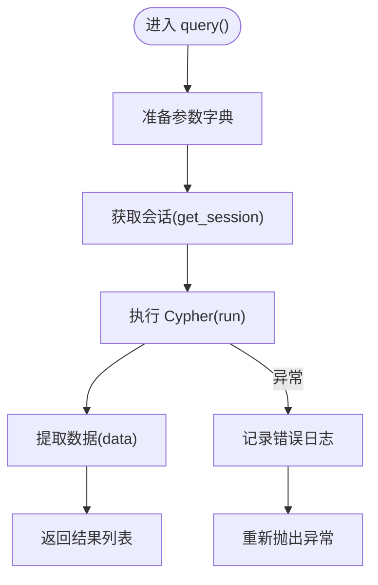
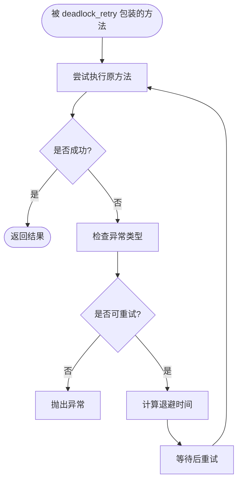
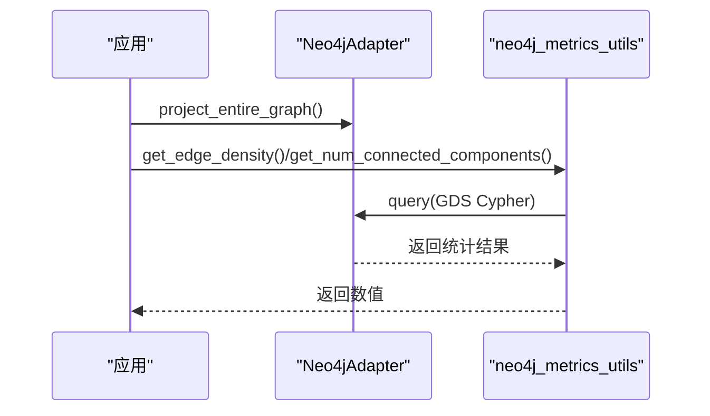
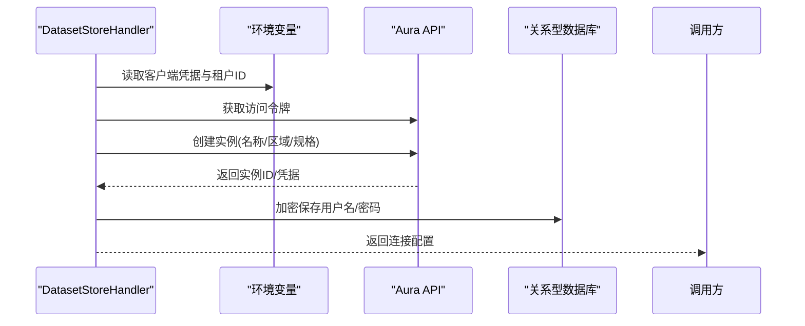
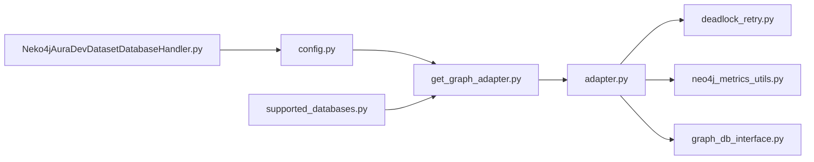

# Neo4j 图数据库适配器

<cite>
**本文引用的文件**
- [m_flow/adapters/graph/__init__.py](file://m_flow/adapters/graph/__init__.py)
- [m_flow/adapters/graph/get_graph_adapter.py](file://m_flow/adapters/graph/get_graph_adapter.py)
- [m_flow/adapters/graph/config.py](file://m_flow/adapters/graph/config.py)
- [m_flow/adapters/graph/supported_databases.py](file://m_flow/adapters/graph/supported_databases.py)
- [m_flow/adapters/graph/use_graph_adapter.py](file://m_flow/adapters/graph/use_graph_adapter.py)
- [m_flow/adapters/graph/graph_db_interface.py](file://m_flow/adapters/graph/graph_db_interface.py)
- [m_flow/adapters/graph/neo4j_driver/adapter.py](file://m_flow/adapters/graph/neo4j_driver/adapter.py)
- [m_flow/adapters/graph/neo4j_driver/deadlock_retry.py](file://m_flow/adapters/graph/neo4j_driver/deadlock_retry.py)
- [m_flow/adapters/graph/neo4j_driver/neo4j_metrics_utils.py](file://m_flow/adapters/graph/neo4j_driver/neo4j_metrics_utils.py)
- [m_flow/adapters/graph/neo4j_driver/Neko4jAuraDevDatasetDatabaseHandler.py](file://m_flow/adapters/graph/neo4j_driver/Neko4jAuraDevDatasetDatabaseHandler.py)
</cite>

## 目录
1. [简介](#简介)
2. [项目结构](#项目结构)
3. [核心组件](#核心组件)
4. [架构总览](#架构总览)
5. [详细组件分析](#详细组件分析)
6. [依赖分析](#依赖分析)
7. [性能考量](#性能考量)
8. [故障排查指南](#故障排查指南)
9. [结论](#结论)
10. [附录](#附录)

## 简介
本文件面向 Neo4j 图数据库适配器的技术文档，系统阐述其在本项目中的实现架构与运行机制，覆盖以下主题：
- 连接池与会话生命周期管理
- 事务与并发控制（含自动重试）
- Cypher 查询执行流程（参数绑定、结果映射、错误处理）
- 死锁检测与自动重试策略（次数上限、退避策略）
- Neo4j Aura Dev 多租户适配器（连接字符串、认证、加密存储）
- 图指标采集与监控（GDS 统计函数）
- Neo4j 特有功能支持（约束、标签、属性过滤等）
- 连接配置参数详解（驱动版本兼容性、SSL、超时等）
- 常见问题排查与性能调优建议

## 项目结构
Neo4j 适配器位于图数据库适配层，通过统一工厂与接口解耦具体后端；Neo4j 实现位于 neo4j_driver 子模块，并提供 Aura Dev 的多租户数据集处理器。

**图表来源**
- [m_flow/adapters/graph/graph_db_interface.py:122-347](file://m_flow/adapters/graph/graph_db_interface.py#L122-L347)
- [m_flow/adapters/graph/get_graph_adapter.py:22-131](file://m_flow/adapters/graph/get_graph_adapter.py#L22-L131)
- [m_flow/adapters/graph/config.py:29-128](file://m_flow/adapters/graph/config.py#L29-L128)
- [m_flow/adapters/graph/supported_databases.py:1-8](file://m_flow/adapters/graph/supported_databases.py#L1-L8)
- [m_flow/adapters/graph/use_graph_adapter.py:10-13](file://m_flow/adapters/graph/use_graph_adapter.py#L10-L13)
- [m_flow/adapters/graph/neo4j_driver/adapter.py:90-134](file://m_flow/adapters/graph/neo4j_driver/adapter.py#L90-L134)
- [m_flow/adapters/graph/neo4j_driver/deadlock_retry.py:24-85](file://m_flow/adapters/graph/neo4j_driver/deadlock_retry.py#L24-L85)
- [m_flow/adapters/graph/neo4j_driver/neo4j_metrics_utils.py:16-132](file://m_flow/adapters/graph/neo4j_driver/neo4j_metrics_utils.py#L16-L132)
- [m_flow/adapters/graph/neo4j_driver/Neko4jAuraDevDatasetDatabaseHandler.py:24-152](file://m_flow/adapters/graph/neo4j_driver/Neko4jAuraDevDatasetDatabaseHandler.py#L24-L152)

**章节来源**
- [m_flow/adapters/graph/__init__.py:1-4](file://m_flow/adapters/graph/__init__.py#L1-L4)
- [m_flow/adapters/graph/get_graph_adapter.py:22-131](file://m_flow/adapters/graph/get_graph_adapter.py#L22-L131)
- [m_flow/adapters/graph/config.py:29-128](file://m_flow/adapters/graph/config.py#L29-L128)
- [m_flow/adapters/graph/supported_databases.py:1-8](file://m_flow/adapters/graph/supported_databases.py#L1-L8)
- [m_flow/adapters/graph/use_graph_adapter.py:10-13](file://m_flow/adapters/graph/use_graph_adapter.py#L10-L13)

## 核心组件
- 工厂与注册表：负责解析上下文配置、构建并初始化适配器实例，支持内置与扩展适配器注册。
- 抽象接口：定义节点/边 CRUD、图级操作、遍历、属性过滤、指标采集等统一契约。
- Neo4jAdapter：基于异步驱动实现的适配器，封装会话、查询、重试、指标计算与 GDS 投影。
- 死锁重试装饰器：对关键异步方法进行透明重试，指数退避。
- 指标工具：基于 GDS 的连通分量、密度、聚类系数等统计。
- Aura Dev 数据集处理器：为每个数据集创建隔离的 Aura 实例，管理凭据加密与解析。

**章节来源**
- [m_flow/adapters/graph/graph_db_interface.py:122-347](file://m_flow/adapters/graph/graph_db_interface.py#L122-L347)
- [m_flow/adapters/graph/neo4j_driver/adapter.py:90-134](file://m_flow/adapters/graph/neo4j_driver/adapter.py#L90-L134)
- [m_flow/adapters/graph/neo4j_driver/deadlock_retry.py:24-85](file://m_flow/adapters/graph/neo4j_driver/deadlock_retry.py#L24-L85)
- [m_flow/adapters/graph/neo4j_driver/neo4j_metrics_utils.py:16-132](file://m_flow/adapters/graph/neo4j_driver/neo4j_metrics_utils.py#L16-L132)
- [m_flow/adapters/graph/neo4j_driver/Neko4jAuraDevDatasetDatabaseHandler.py:24-152](file://m_flow/adapters/graph/neo4j_driver/Neko4jAuraDevDatasetDatabaseHandler.py#L24-L152)

## 架构总览
下图展示从应用到 Neo4j 的调用链路与关键组件交互：

**图表来源**
- [m_flow/adapters/graph/get_graph_adapter.py:22-35](file://m_flow/adapters/graph/get_graph_adapter.py#L22-L35)
- [m_flow/adapters/graph/neo4j_driver/adapter.py:148-179](file://m_flow/adapters/graph/neo4j_driver/adapter.py#L148-L179)
- [m_flow/adapters/graph/neo4j_driver/deadlock_retry.py:40-82](file://m_flow/adapters/graph/neo4j_driver/deadlock_retry.py#L40-L82)
- [m_flow/adapters/graph/neo4j_driver/neo4j_metrics_utils.py:16-132](file://m_flow/adapters/graph/neo4j_driver/neo4j_metrics_utils.py#L16-L132)

## 详细组件分析

### Neo4jAdapter 类与连接管理
- 驱动初始化：根据 URL、用户名/密码、数据库名创建异步驱动；设置连接生命周期、通知级别与保活。
- 会话管理：通过上下文管理器获取会话，确保资源释放。
- 初始化约束：首次初始化时创建唯一性约束以保证节点 ID 唯一。
- 节点/边操作：提供单条/批量增删改查，属性编码与扁平化处理，确保嵌套结构可持久化。
- 图投影与指标：支持 GDS 投影、连通分量、密度、聚类系数等统计。

**图表来源**
- [m_flow/adapters/graph/graph_db_interface.py:122-347](file://m_flow/adapters/graph/graph_db_interface.py#L122-L347)
- [m_flow/adapters/graph/neo4j_driver/adapter.py:90-134](file://m_flow/adapters/graph/neo4j_driver/adapter.py#L90-L134)

**章节来源**
- [m_flow/adapters/graph/neo4j_driver/adapter.py:98-134](file://m_flow/adapters/graph/neo4j_driver/adapter.py#L98-L134)
- [m_flow/adapters/graph/neo4j_driver/adapter.py:148-179](file://m_flow/adapters/graph/neo4j_driver/adapter.py#L148-L179)
- [m_flow/adapters/graph/neo4j_driver/adapter.py:184-413](file://m_flow/adapters/graph/neo4j_driver/adapter.py#L184-L413)
- [m_flow/adapters/graph/neo4j_driver/adapter.py:579-601](file://m_flow/adapters/graph/neo4j_driver/adapter.py#L579-L601)

### Cypher 查询执行流程与参数绑定
- 参数绑定：所有查询均通过参数字典传入，避免拼接注入风险。
- 结果映射：游标数据转为字典列表，便于上层统一处理。
- 错误处理：捕获驱动异常并记录日志，必要时向上抛出。

**图表来源**
- [m_flow/adapters/graph/neo4j_driver/adapter.py:148-179](file://m_flow/adapters/graph/neo4j_driver/adapter.py#L148-L179)

**章节来源**
- [m_flow/adapters/graph/neo4j_driver/adapter.py:160-179](file://m_flow/adapters/graph/neo4j_driver/adapter.py#L160-L179)

### 事务与并发控制（含自动重试）
- 重试装饰器：对可能因死锁或瞬态错误失败的操作进行透明重试，指数退避。
- 可重试条件：识别特定错误标记与数据库不可用异常。
- 重试上限：由装饰器参数控制最大重试次数。

**图表来源**
- [m_flow/adapters/graph/neo4j_driver/deadlock_retry.py:40-82](file://m_flow/adapters/graph/neo4j_driver/deadlock_retry.py#L40-L82)

**章节来源**
- [m_flow/adapters/graph/neo4j_driver/deadlock_retry.py:24-85](file://m_flow/adapters/graph/neo4j_driver/deadlock_retry.py#L24-L85)

### 图指标采集与监控
- GDS 统计：提供边密度、连通分量数量与大小、自环计数、最短路径距离分布、平均局部聚类系数等。
- 使用方式：先进行 GDS 图投影，再调用对应统计函数。

**图表来源**
- [m_flow/adapters/graph/neo4j_driver/adapter.py:579-601](file://m_flow/adapters/graph/neo4j_driver/adapter.py#L579-L601)
- [m_flow/adapters/graph/neo4j_driver/neo4j_metrics_utils.py:16-132](file://m_flow/adapters/graph/neo4j_driver/neo4j_metrics_utils.py#L16-L132)

**章节来源**
- [m_flow/adapters/graph/neo4j_driver/neo4j_metrics_utils.py:16-132](file://m_flow/adapters/graph/neo4j_driver/neo4j_metrics_utils.py#L16-L132)

### Neo4j Aura Dev 多租户适配器
- 功能概述：为每个数据集创建独立的 Aura 实例，连接信息加密存储于关系型数据库。
- 关键流程：OAuth 获取令牌 → 创建实例 → 等待可用 → 加密保存凭据 → 解密解析连接信息。
- 安全注意：开发环境示例，生产请使用专用密钥管理器。

**图表来源**
- [m_flow/adapters/graph/neo4j_driver/Neko4jAuraDevDatasetDatabaseHandler.py:40-112](file://m_flow/adapters/graph/neo4j_driver/Neko4jAuraDevDatasetDatabaseHandler.py#L40-L112)
- [m_flow/adapters/graph/neo4j_driver/Neko4jAuraDevDatasetDatabaseHandler.py:115-127](file://m_flow/adapters/graph/neo4j_driver/Neko4jAuraDevDatasetDatabaseHandler.py#L115-L127)

**章节来源**
- [m_flow/adapters/graph/neo4j_driver/Neko4jAuraDevDatasetDatabaseHandler.py:24-152](file://m_flow/adapters/graph/neo4j_driver/Neko4jAuraDevDatasetDatabaseHandler.py#L24-L152)

## 依赖分析
- 工厂与注册：通过配置解析与注册表选择适配器，支持扩展注册。
- 接口契约：所有适配器需实现统一接口，保证上层调用一致性。
- Neo4j 依赖：异步驱动、异常类型、APoc 与 GDS 函数调用。
- 重试与日志：共享退避计算与日志记录。

**图表来源**
- [m_flow/adapters/graph/config.py:29-128](file://m_flow/adapters/graph/config.py#L29-L128)
- [m_flow/adapters/graph/get_graph_adapter.py:44-131](file://m_flow/adapters/graph/get_graph_adapter.py#L44-L131)
- [m_flow/adapters/graph/supported_databases.py:1-8](file://m_flow/adapters/graph/supported_databases.py#L1-L8)
- [m_flow/adapters/graph/neo4j_driver/adapter.py:90-134](file://m_flow/adapters/graph/neo4j_driver/adapter.py#L90-L134)
- [m_flow/adapters/graph/neo4j_driver/deadlock_retry.py:24-85](file://m_flow/adapters/graph/neo4j_driver/deadlock_retry.py#L24-L85)
- [m_flow/adapters/graph/neo4j_driver/neo4j_metrics_utils.py:16-132](file://m_flow/adapters/graph/neo4j_driver/neo4j_metrics_utils.py#L16-L132)
- [m_flow/adapters/graph/neo4j_driver/Neko4jAuraDevDatasetDatabaseHandler.py:24-152](file://m_flow/adapters/graph/neo4j_driver/Neko4jAuraDevDatasetDatabaseHandler.py#L24-L152)

**章节来源**
- [m_flow/adapters/graph/get_graph_adapter.py:44-131](file://m_flow/adapters/graph/get_graph_adapter.py#L44-L131)
- [m_flow/adapters/graph/graph_db_interface.py:122-347](file://m_flow/adapters/graph/graph_db_interface.py#L122-L347)

## 性能考量
- 连接与会话
  - 驱动保活与连接生命周期参数已设定，适合中等并发场景；高并发时建议结合连接池与会话复用策略。
- 批量写入
  - 使用 UNWIND 与 MERGE/合并关系，减少往返；对大批次写入可分批提交以降低锁竞争。
- 查询优化
  - 合理使用属性过滤与索引；对频繁查询建立节点/关系类型与属性索引。
- GDS 投影
  - 在进行大规模统计前先进行投影，避免在线计算开销；统计完成后可按需释放。
- 重试与退避
  - 合理设置最大重试次数与退避上限，避免雪崩效应；区分可重试与不可重试错误。

[本节为通用指导，不直接分析具体文件]

## 故障排查指南
- 连接失败
  - 检查连接 URL、用户名/密码、数据库名；确认网络可达与防火墙放行。
- 权限不足
  - 确认用户具备读写权限与 GDS/Schema 相关权限；Aura 场景检查租户与实例状态。
- 死锁/瞬态错误
  - 观察重试日志；若持续失败，检查业务逻辑是否存在长事务或热点更新。
- 属性映射异常
  - 检查属性编码/扁平化逻辑，确保嵌套结构正确序列化。
- 指标计算失败
  - 确认已进行 GDS 投影且关系类型存在；检查 GDS 版本与可用性。

**章节来源**
- [m_flow/adapters/graph/neo4j_driver/deadlock_retry.py:56-80](file://m_flow/adapters/graph/neo4j_driver/deadlock_retry.py#L56-L80)
- [m_flow/adapters/graph/neo4j_driver/adapter.py:579-601](file://m_flow/adapters/graph/neo4j_driver/adapter.py#L579-L601)

## 结论
该 Neo4j 适配器通过统一接口与工厂模式实现对异步驱动的封装，结合死锁重试、属性编码与 GDS 指标工具，满足工程化部署与可观测性需求。Aura Dev 多租户处理器进一步完善了开发与演示场景下的隔离与安全。建议在生产环境中配合密钥管理、连接池与查询优化策略，持续监控与迭代。

[本节为总结性内容，不直接分析具体文件]

## 附录

### 连接配置参数详解
- 提供者与位置
  - 提供者：neo4j
  - URL：bolt 连接地址
  - 数据库名：目标数据库（Aura 固定为 neo4j）
  - 用户名/密码：认证凭据（可选匿名）
  - 端口：默认端口（配置模型包含端口字段）
- 驱动参数
  - 连接生命周期、通知严重级别、保活等已在驱动初始化中设置。
- SSL 与超时
  - 通过驱动初始化参数控制；如需启用 SSL/TLS，请在 URL 中使用加密协议并在网络层面配置证书校验。
- 环境变量
  - Aura Dev 需要客户端 ID、密钥、租户 ID 与加密密钥等环境变量。

**章节来源**
- [m_flow/adapters/graph/config.py:38-106](file://m_flow/adapters/graph/config.py#L38-L106)
- [m_flow/adapters/graph/neo4j_driver/adapter.py:116-125](file://m_flow/adapters/graph/neo4j_driver/adapter.py#L116-L125)
- [m_flow/adapters/graph/neo4j_driver/Neko4jAuraDevDatasetDatabaseHandler.py:60-67](file://m_flow/adapters/graph/neo4j_driver/Neko4jAuraDevDatasetDatabaseHandler.py#L60-L67)

### Neo4j 特有功能支持
- 约束与标签
  - 初始化阶段创建节点 ID 唯一性约束；节点统一打上基础标签以便一致查询。
- 全文索引与触发器
  - 代码中未直接出现全文索引与触发器实现；如需使用，请在 Cypher 中显式创建并维护。
- 属性过滤与投影
  - 支持按属性过滤节点/边；支持 GDS 投影与统计。

**章节来源**
- [m_flow/adapters/graph/neo4j_driver/adapter.py:144-146](file://m_flow/adapters/graph/neo4j_driver/adapter.py#L144-L146)
- [m_flow/adapters/graph/neo4j_driver/adapter.py:579-601](file://m_flow/adapters/graph/neo4j_driver/adapter.py#L579-L601)